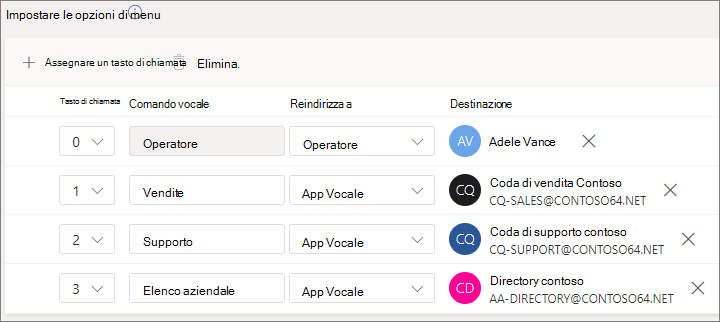

# Impostare un operatore automatico

Gli operatori automatici consentono alle persone di chiamare l'organizzazione ed esplorare un sistema di menu per parlare al reparto, alla coda di chiamata, alla persona o a un operatore. È possibile creare operatori automatici per l'organizzazione con l'interfaccia di amministrazione di Microsoft Teams o con PowerShell.

Assicurarsi di aver letto Il piano per gli operatori  automatici e le code di chiamata di [Teams](plan-auto-attendant-call-queue.md) e aver seguito i passaggi introduttivi prima di seguire le procedure di questo articolo.

Gli operatori automatici possono indirizzare le chiamate, in base all'input dei chiamanti, verso una delle destinazioni seguenti: 

- **Operatore:** l'operatore definito per l'operatore automatico. La definizione di un operatore è facoltativa. L'operatore può essere definito come una qualsiasi delle altre destinazioni dell'elenco.
- **Persona nell'organizzazione:** persona dell'organizzazione che può ricevere chiamate vocali. Può trattarsi di un utente online o di un utente ospitato in locale con Skype for Business Server.
- **App vocale:** un altro operatore automatico o una coda di chiamata. Scegliere l'account della risorsa associato all'operatore automatico o alla coda di chiamata quando si sceglie questa destinazione.
- **Segreteria telefonica:** cassetta postale vocale associata a un gruppo di Microsoft 365 specificato dall'utente.
- **Numero di telefono esterno:** qualsiasi numero di telefono. (Vedere [i dettagli tecnici sul trasferimento esterno).](create-a-phone-system-auto-attendant.md#external-phone-number-transfers---technical-details)
- **Annuncio:** riprodurre un file audio. Un messaggio di annuncio registrato caricato e salvato come audio in. WAV, . MP3, o . WMA. Le dimensioni della registrazione non possono essere superiori a 5 MB. Il sistema riproduce l'annuncio e quindi torna al menu dell'operatore automatico.
- **Annuncio:** digitare un messaggio. Testo che si vuole far leggere al sistema. È possibile immettere fino a 1000 caratteri. Il sistema riproduce l'annuncio e quindi torna al menu dell'operatore automatico.

Ti verrà chiesto di scegliere una di queste opzioni in varie fasi durante la configurazione di un operatore automatico.

Per impostare un operatore automatico, nell'interfaccia di amministrazione di Teams espandi **Voce,** seleziona **Operatori** automatici, quindi **seleziona Aggiungi.**

## Informazioni generali

1. Digita un nome per l'operatore automatico nella casella in alto.

2. Se si vuole designare un operatore, specificare la destinazione delle chiamate all'operatore. Questo passaggio è facoltativo (ma consigliato). È possibile impostare **l'opzione Operatore** per consentire ai chiamanti di uscire dal menu e parlare con una persona designata.

3. Specifica il fuso orario per questo operatore automatico. Il fuso orario viene utilizzato per calcolare l'orario di ufficio se si crea un flusso delle [chiamate separato per l'orario di uscita.](#call-flow-for-after-hours)

4. Specifica una [lingua supportata per](create-a-phone-system-auto-attendant-languages.md) questo operatore automatico. Questa è la lingua che verrà usata per i comandi vocali generati dal sistema.

5. Scegli se abilitare gli input vocali. Se abilitata, il nome di ogni opzione di menu diventa una parola chiave di riconoscimento vocale. Ad esempio, i chiamanti possono dire "Uno" per selezionare l'opzione di menu mappata al tasto 1, oppure possono dire "Vendite" per selezionare l'opzione di menu denominata "Vendite".

> [!NOTE]
> Se si sceglie una lingua nel passaggio 4 che non supporta gli input vocali, questa opzione verrà disabilitata.

6. Selezionare **Avanti.**

## Flusso delle chiamate

Scegli se vuoi riprodurre un saluto quando l'operatore automatico risponde a una chiamata.

Se si seleziona **Riproduci un file audio,** è possibile usare il pulsante Carica **file** per caricare un messaggio di saluto registrato salvato come audio in. WAV, . MP3, o . WMA. Le dimensioni della registrazione non possono essere superiori a 5 MB.

Se si seleziona Digita un messaggio di saluto, il sistema leggerà il testo digitato (fino **a** 1000 caratteri) quando l'operatore automatico risponde a una chiamata.

Scegli come instradare la chiamata.

Se si seleziona **Disconnetti,** l'operatore automatico ggancia la chiamata.

Se si seleziona **Reindirizza** chiamata, è possibile scegliere una delle destinazioni di instradamento chiamate.

Se si **selezionaNo le opzioni** del menu Riproduci, è possibile scegliere Riproduci file **audio** o Digitare **un** messaggio di saluto e quindi scegliere tra le opzioni del menu e la ricerca in elenco.

### Opzioni di menu

Per le opzioni di composizione, è possibile assegnare i tasti da 0 a 9 tasti sulla tastiera del telefono a una delle destinazioni di instradamento delle chiamate. (I tasti \* (Ripeti) e \# (Indietro) sono riservate dal sistema e non possono essere riassegnate.

I mapping di tasti non devono essere continui. È possibile, ad esempio, creare un menu con i tasti 0, 1 e 3 mappati a opzioni, mentre i due tasti non vengono usati.

Se ne è stato configurato uno, è consigliabile mappare il tasto zero all'operatore. Se l'operatore non è impostato su alcun tasto, viene disabilitato anche il comando vocale "Operatore".

Per ogni opzione di menu, specificare le impostazioni seguenti:

- **Tasto di composizione:** il tasto sulla tastiera del telefono per accedere a questa opzione. Se sono disponibili input vocali, i chiamanti possono anche pronunciare questo numero per accedere all'opzione.

- **Comando vocale:** definisce il comando vocale che un chiamante può fornire per accedere a questa opzione, se sono abilitati gli input vocali. Può contenere più parole, ad esempio "Servizio clienti" o "Operazioni e basi". Ad esempio, il chiamante può premere 2, dire "due" o dire "Vendite" per selezionare l'opzione mappata ai due tasti. Il testo viene visualizzato anche dal testo da sintesi vocale per la richiesta di conferma del servizio, ad esempio "Trasferimento delle chiamate alle vendite".

- **Redirect to** - the call routing destination used when callers choose this option. Se stai effettuando il reindirizzamento a un operatore automatico o a una coda di chiamata, scegli l'account della risorsa associato.

### Ricerca in elenco

Se assegni tasti di composizione alle destinazioni, ti consigliamo di scegliere **Nessuno per** la **ricerca in Elenco.** Se un chiamante prova a comporre un nome o un'estensione usando i tasti assegnati a destinazioni specifiche, potrebbe essere instradato in modo imprevisto a una destinazione prima di completare l'immissione del nome o dell'interno. Ti consigliamo di creare un operatore automatico distinto per la ricerca in elenco e di impostare il collegamento dell'operatore automatico principale tramite un tasto di chiamata.

Se non hai assegnato i tasti di composizione, scegli un'opzione per la **ricerca in Elenco.**

**Chiamata per nome** : se si abilita questa opzione, i chiamanti possono pronunciare il nome dell'utente o digitarlo sulla tastiera del telefono. Qualsiasi utente online o qualsiasi utente ospitato in locale con Skype for Business Server è un utente idoneo e può essere trovato con Chiamata per nome. Puoi impostare chi è e non è incluso nella directory nella [pagina Ambito di](#dial-scope) chiamata.

**Chiamata per interno** - Se si abilita questa opzione, i chiamanti possono connettersi con gli utenti dell'organizzazione componendo l'interno del telefono. Qualsiasi utente online o qualsiasi utente ospitato in locale con Skype for Business Server è un utente idoneo e può essere trovato con **Chiamata per interno.** Puoi impostare chi è e non è incluso nella directory nella [pagina Ambito di](#dial-scope) chiamata.

Gli utenti che si desidera rendere disponibili per Chiamata per interno devono avere un'estensione specificata come parte di uno dei seguenti attributi del telefono definiti in Active Directory o Azure Active Directory (per altre informazioni, vedere Aggiungere utenti singolarmente o [in](https://docs.microsoft.com/microsoft-365/admin/add-users/add-users) blocco).

- OfficePhone
- HomePhone
- Cellulare/Cellulare
- TelephoneNumber/PhoneNumber
- OtherTelephone

Il formato richiesto per immettere l'interno nel campo del numero di telefono dell'utente è:

- *+\<phone number>;ext=\<extension>*
- *+\<phone number>x\<extension>*
- *x\<extension>*

- Esempio 1: Set-MsolUser -UserPrincipalName usern@domain.com -Phonenumber "+1555555678;ext=5678"
- Esempio 2: Set-MsolUser -UserPrincipalName usern@domain.com -Phonenumber "+15555555678x5678"
- Esempio 3: Set-MsolUser -UserPrincipalName usern@domain.com -Phonenumber "x5678"

È possibile impostare l'estensione [nell'interfaccia di amministrazione di Microsoft 365](https://admin.microsoft.com/) o nell'interfaccia di amministrazione di Azure Active [Directory.](https://aad.portal.azure.com) Possono essere necessarie fino a 12 ore prima che le modifiche siano disponibili per gli operatori automatici e le code di chiamata.

> [!NOTE]
> Se si desidera utilizzare  sia la  funzionalità Chiamata per nome che Chiamata per interno, è possibile assegnare un tasto di chiamata sull'operatore automatico principale per raggiungere un operatore automatico abilitato per Chiamata per **nome.** All'interno di tale operatore automatico, puoi assegnare il tasto 1 (senza lettere associate) per raggiungere l'operatore automatico Chiamata per interno. 

Dopo aver selezionato un'opzione **di ricerca nella directory,** selezionare **Avanti.**

## Flusso delle chiamate per le ore non lavorative

L'orario di ufficio può essere impostato per ogni operatore automatico. Se l'orario di ufficio non è impostato, tutti i giorni e tutte le ore del giorno sono considerati orario di ufficio perché il programma 24/7 è impostato come predefinito. L'orario di ufficio può essere impostato con interruzioni durante il giorno e tutti gli orari non impostati come orario di ufficio sono considerati fuori orario. Puoi impostare diverse opzioni di gestione delle chiamate in arrivo e messaggi di saluto per il dopo-orario.

A seconda di come hai configurato gli operatori automatici e le code di chiamata, potresti dover specificare l'instradamento delle chiamate in orario di instradamento solo per gli operatori automatici con numeri di telefono diretti.

Se si desidera un instradamento delle chiamate separato per i chiamanti non in orario di ufficio, specificare l'orario di ufficio per ogni giorno. Selezionare **Aggiungi nuovo orario** per specificare più set di ore per un determinato giorno, ad esempio per specificare una pausa pranzo.

Dopo aver specificato l'orario di ufficio, scegliere le opzioni di instradamento delle chiamate per l'orario di ufficio. Le stesse opzioni sono disponibili per l'instradamento delle chiamate in orario di ufficio specificato sopra.

Al **termine,** selezionare Avanti.

## Flussi delle chiamate durante le festività

L'operatore automatico può avere un flusso delle chiamate per [ogni Festività che hai impostato.](set-up-holidays-in-teams.md) È possibile aggiungere fino a 20 giorni festivi pianificati per ogni operatore automatico.

1. Nella pagina delle impostazioni delle chiamate per le festività selezionare **Aggiungi.**

2. Digitare un nome per l'impostazione delle festività.

3. **Nell'elenco** a discesa Festività scegliere la festività da usare.

4. Scegliere il tipo di messaggio di saluto da usare.

    

5. Scegli se vuoi disconnettere **o** **reindirizzare** la chiamata.

6. Se hai scelto di reindirizzare la chiamata, scegli la destinazione del routing delle chiamate.

7. Selezionare **Salva**.

Ripetere la procedura in base alle esigenze per ogni festività aggiuntiva.

Dopo aver aggiunto tutte le festività, selezionare **Avanti.**

## Ambito di chiamata

*L'ambito* di chiamata definisce quali utenti sono disponibili nella directory quando un chiamante usa chiamata per nome o per interno. L'impostazione predefinita Di tutti gli utenti **online** include tutti gli utenti dell'organizzazione che sono utenti online o ospitati in sede con Skype for Business Server.

È possibile includere o escludere utenti specifici  selezionando  Gruppo di utenti personalizzato in Includi o escludi e scegliendo uno o più gruppi di Microsoft 365, liste di distribuzione o gruppi di sicurezza.  Ad esempio, è possibile escludere i dirigenti dell'organizzazione dalla directory di composizione. Se un utente è presente in entrambi gli elenchi, verrà escluso dalla directory.

> [!NOTE]
> L'elenco dei nomi di un nuovo utente nella directory può richiedere fino a 36 ore.

Dopo aver impostato l'ambito di chiamata, seleziona **Avanti.**

## Account delle risorse

Tutti gli operatori automatici devono avere un account delle risorse associato.  Gli operatori automatici di primo livello avranno bisogno di almeno un account delle risorse a cui è associato un numero di servizio. Se si desidera, è possibile assegnare più account delle risorse a un operatore automatico, ognuno con un numero di servizio distinto.

Per aggiungere un account della risorsa, selezionare Aggiungi **account** e cercare l'account che si vuole aggiungere. Selezionare **Aggiungi,** quindi **Aggiungi.**

Dopo aver aggiunto gli account del servizio, **seleziona** Invia per completare la configurazione dell'operatore automatico.

## Trasferimenti di numeri di telefono esterni - dettagli tecnici

Consulta i [Prerequisiti per consentire](plan-auto-attendant-call-queue.md#prerequisites) agli operatori automatici di trasferire le chiamate esternamente.  Inoltre:

- Per un account risorsa con licenza per un Piano per [chiamate,](calling-plans-for-office-365.md)il numero di telefono per il trasferimento esterno deve essere immesso nel formato E.164 (+[codice paese][codice area][numero di telefono]).

- Per un account di risorsa con un criterio licenza sistema telefonico e routing diretto instradamento vocale online, il formato del numero di telefono per il trasferimento esterno dipende dalle impostazioni del controller dei confini della sessione [(SBC).](direct-routing-connect-the-sbc.md)

Il numero di telefono in uscita visualizzato viene determinato nel modo seguente:

  - Per i numeri del Piano per chiamate, viene visualizzato il numero di telefono del chiamante originale.
  - Per i numeri di routing diretto, il numero inviato si basa sull'impostazione PAI (P-Asserted-Identity) nell'SBC, come indicato di seguito:
    - Se impostato su Disabilitato, viene visualizzato il numero di telefono del chiamante originale. Questa è l'impostazione predefinita e consigliata.
    - Se è impostata su Abilitato, viene visualizzato il numero di telefono dell'account della risorsa.

In un ambiente ibrido di Skype for Business, per trasferire una chiamata di operatore automatico alla rete PSTN, creare un nuovo utente locale con l'inoltro di chiamata impostato sul numero PSTN. L'utente deve essere abilitato per VoIP aziendale e avere assegnato un criterio vocale. Per ulteriori informazioni, consulta Trasferimento di chiamata [dell'operatore automatico a PSTN.](https://docs.microsoft.com/SkypeForBusiness/plan/exchange-unified-messaging-online-migration-support#auto-attendant-call-transfer-to-pstn)

### Creare un operatore automatico con PowerShell

Puoi anche usare PowerShell per creare e configurare gli operatori automatici. Ecco i cmdlet necessari per gestire un operatore automatico:

- [New-CsAutoAttendant](https://docs.microsoft.com/powershell/module/skype/new-csautoattendant)  
- [Set-CsAutoAttendant](https://docs.microsoft.com/powershell/module/skype/set-csautoattendant)
- [Get-CsAutoAttendant](https://docs.microsoft.com/powershell/module/skype/get-csautoattendant)
- [Get-CsAutoAttendantHolidays](https://docs.microsoft.com/powershell/module/skype/get-csautoattendantholidays)
- [Remove-CsAutoAttendant](https://docs.microsoft.com/powershell/module/skype/remove-csautoattendant)
- [New-CsAutoAttendantMenu](https://docs.microsoft.com/powershell/module/skype/new-csautoattendantmenu)
- [New-CsOnlineAudioFile](https://docs.microsoft.com/powershell/module/skype/new-CsOnlineAudioFile)
- [New-CsAutoAttendantCallFlow](https://docs.microsoft.com/powershell/module/skype/New-CsAutoAttendantCallFlow)
- [Export-CsAutoAttendantHolidays](https://docs.microsoft.com/powershell/module/skype/export-csorganizationalautoattendantholidays)
- [New-CsOnlineTimeRange](https://docs.microsoft.com/powershell/module/skype/new-csonlinetimerange)
- [New-CsOnlineDateTimeRange](https://docs.microsoft.com/powershell/module/skype/new-csonlinedatetimerange)
- [New-CsOnlineSchedule](https://docs.microsoft.com/powershell/module/skype/New-CsOnlineSchedule)
- [Get-CsAutoAttendantSupportedTimeZone](https://docs.microsoft.com/powershell/module/skype/Get-CsAutoAttendantSupportedTimeZone)
- [New-CsAutoAttendantCallHandlingAssociation](https://docs.microsoft.com/powershell/module/skype/New-CsAutoAttendantCallHandlingAssociation)
- [Get-CsAutoAttendantSupportedLanguage](https://docs.microsoft.com/powershell/module/skype/Get-CsAutoAttendantSupportedLanguage)
- [Import-CsAutoAttendantHolidays](https://docs.microsoft.com/powershell/module/skype/import-csautoattendantholidays)
- [New-CsAutoAttendantCallableEntity](https://docs.microsoft.com/powershell/module/skype/New-CsAutoAttendantCallableEntity)

## Argomenti correlati

[Vantaggi offerti dal Sistema telefonico](/MicrosoftTeams/here-s-what-you-get-with-phone-system)

[Recuperare numeri di telefono del servizio](/microsoftteams/getting-service-phone-numbers).

[Disponibilità di Audioconferenza e Piani per chiamate per Paese e area geografica](/microsoftteams/country-and-region-availability-for-audio-conferencing-and-calling-plans/country-and-region-availability-for-audio-conferencing-and-calling-plans)

[Introduzione a Windows Powershell e Skype for Business online](/SkypeForBusiness/set-up-your-computer-for-windows-powershell/set-up-your-computer-for-windows-powershell)
