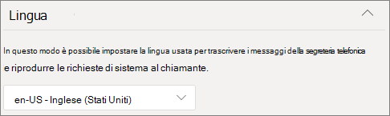

# Creare una coda di chiamata

Le code di chiamata forniscono un metodo per instradare i chiamanti alle persone dell'organizzazione che possono aiutare a risolvere un particolare problema o domanda. Le chiamate vengono distribuite una alla volta alle persone in coda (note come *agenti).* 

> [!TIP]
> Questo articolo è per le organizzazioni di grandi dimensioni. Se l'organizzazione è una piccola azienda, vedere Creare una coda [di chiamata - esercitazione sulle piccole](/microsoftteams/business-voice/create-a-phone-system-call-queue-smb) imprese.

Le code di chiamata forniscono:

- Messaggio di saluto.

- Musica mentre le persone sono in attesa di blocco in una coda.

- Instradamento delle chiamate, in ordine FIFO *(First In, First Out)* agli agenti.

- Opzioni di gestione per l'overflow e il timeout della coda.

Assicurarsi di aver letto Pianificare [gli](plan-auto-attendant-call-queue.md) operatori Teams e le  code di chiamata e di aver seguito i passaggi introduttivi prima di seguire le procedure descritte in questo articolo.

## Dimostrazione video

Questo video mostra un esempio di base di come creare una coda di chiamata in Teams.

> [!VIDEO https://www.microsoft.com/videoplayer/embed/RWCF23?autoplay=false]

## Creare la coda di chiamata

Per configurare una coda di chiamata, nell'interfaccia Teams di amministrazione espandere **Voce,** fare clic su Code di chiamata **e** quindi su **Aggiungi.**

Digitare un nome per la coda di chiamata.

## Account delle risorse

Fare **clic su Aggiungi account,** cercare l'account della risorsa che si vuole usare con questa coda di chiamata, fare clic su Aggiungi e quindi su **Aggiungi.**  Gli agenti visualizzano il nome dell'account della risorsa quando ricevono una chiamata in arrivo.

### Assegnare l'ID chiamata

Se si prevede di usare un canale Teams per gli agenti di chiamata, è possibile assegnare un numero di ID chiamante in uscita per gli agenti specificando uno o più account delle risorse con un numero di telefono.

Fare **clic su** Aggiungi , cercare gli account delle risorse a cui consentire agli agenti di effettuare chiamate con ID durante le chiamate in uscita, fare clic su **Aggiungi** e quindi su **Aggiungi.**

Se non si usa un canale di Teams per controllare l'appartenenza all'agente, è consigliabile impostare direttamente l'ID chiamante per i membri della coda di chiamata sul numero di servizio della coda di chiamata o sull'operatore automatico appropriato. Per altre informazioni, vedere Gestire i [criteri id chiamante in Microsoft Teams](caller-id-policies.md) chiamate.

## Lingua

Scegliere una [lingua supportata.](create-a-phone-system-call-queue-languages.md) Questa lingua verrà usata per le istruzioni vocali generate dal sistema e per la trascrizione della segreteria telefonica (se abilitate).

## Messaggi di saluto e musica in attesa in coda

Specificare se si vuole riprodurre un messaggio di saluto ai chiamanti quando arrivano in coda. È necessario caricare un file MP3, WAV o WMA contenente il messaggio di saluto da riprodurre. La registrazione caricata non può essere superiore a 5 MB.

Teams musica predefinita ai chiamanti mentre sono in attesa in una coda. La musica predefinita fornita nelle code Teams chiamate è gratuita di eventuali royalty pagate dall'organizzazione. Se si vuole riprodurre un file audio specifico, scegliere Riproduci **un file audio** e caricare un file MP3, WAV o WMA.

> [!NOTE]
> L'utente è responsabile della cancellazione e della protezione indipendente di tutti i diritti e le autorizzazioni necessari per l'uso di qualsiasi file musicale o audio con il servizio di Microsoft Teams, che possono includere proprietà intellettuale e altri diritti in qualsiasi musica, effetti sonori, audio, marchi, nomi e altri contenuti nel file audio di tutti i titolari dei diritti pertinenti, che possono includere artisti, attori, interpreti, musicisti, cantautori, compositori, etichette di registrazione, editori musicali, unioni, corporazioni, società di diritti, organizzazioni di gestione collettiva e qualsiasi altra parte proprietaria, controllo o licenza del copyright musicale, degli effetti sonori, dell'audio e di altri diritti di proprietà intellettuale.

## Agenti di chiamata

Esaminare i [prerequisiti per l'aggiunta di agenti a una coda di chiamata.](plan-auto-attendant-call-queue.md#prerequisites)

##### Teams canale

È possibile aggiungere fino a 200 agenti tramite un Teams canale.

Se si vuole usare un canale Teams per gestire la [coda,](https://support.microsoft.com/office/9f07dabe-91c6-4a9b-a545-8ffdddd2504e)selezionare l'opzione **Scegli un team** e fare clic su Aggiungi **canale.** Cercare il team da usare, selezionarlo e fare clic su **Aggiungi.** Selezionare il canale da usare e fare clic su **Applica.** È necessario essere un membro del team o il creatore di o un proprietario del canale.

I client seguenti sono supportati quando si usa un canale Teams per le code di chiamata: 

  - Microsoft Teams Windows client
  - Client Microsoft Teams Mac

> [!NOTE]
> Se si usa questa opzione, la piena operatività della coda di chiamata può richiedere fino a 24 ore.

##### Utenti e gruppi

È possibile aggiungere fino a 20 agenti singolarmente e fino a 200 agenti tramite gruppi.

Per aggiungere singoli utenti o gruppi alla coda, selezionare **l'opzione Scegli utenti e** gruppi. 

Per aggiungere un utente alla coda, fare clic **su Aggiungi utenti**, cercare l'utente, fare clic su **Aggiungi** e quindi su **Aggiungi**.

Per aggiungere un gruppo alla coda, fare clic **su Aggiungi gruppi,** cercare il gruppo, fare clic su **Aggiungi** e quindi su **Aggiungi.** È possibile usare liste di distribuzione, gruppi di sicurezza e gruppi di Microsoft 365 o Microsoft Teams team.

> [!NOTE]
> I nuovi utenti aggiunti a un gruppo possono richiedere fino a otto ore prima dell'arrivo della prima chiamata.

## Routing delle chiamate

**La modalità conferenza** riduce significativamente il tempo necessario per la connessione di un chiamante a un agente, dopo che l'agente ha accettato la chiamata. Per il funzionamento della modalità conferenza, gli agenti nella coda di chiamata devono usare uno dei client seguenti:

  - La versione più recente del client desktop Microsoft Teams, dell'app Android o dell'app iOS
  - Microsoft Teams telefono 1449/1.0.94.2020051601 o versione successiva
  
Gli account Teams agenti devono essere impostati sulla modalità Teams solo utenti. Gli agenti che non soddisfano i requisiti non sono inclusi nell'elenco di routing delle chiamate. È consigliabile abilitare la modalità conferenza per le code di chiamata se tutti gli agenti usano client compatibili.

> [!NOTE]
> La modalità conferenza non è supportata se le chiamate telefoniche vengono instradati alla coda da un gateway di routing diretto abilitato per il routing in base alla posizione.

> [!TIP]
> **L'impostazione consigliata è** **La** modalità conferenza è Automatica.

**Il metodo di** routing determina l'ordine in cui gli agenti ricevono le chiamate dalla coda. Scegliere una delle opzioni seguenti:

- **Il routing** dell'operatore chiama tutti gli agenti nella coda contemporaneamente. Il primo agente di chiamata a prendere la chiamata riceve la chiamata.

- **Il routing seriale** chiama tutti gli agenti di chiamata uno alla volta nell'ordine specificato nell'elenco **Agenti di** chiamata. Se un agente licenzia o non riceve una chiamata, la chiamata squillerà all'agente successivo e proverà tutti gli agenti fino a quando non viene ritirata o non si verifica il timeout.

- **Round robin** bilancia il routing delle chiamate in arrivo in modo che ogni agente di chiamata oscinda lo stesso numero di chiamate dalla coda. Questo può essere utile in un ambiente di vendita in ingresso per garantire la stessa opportunità tra tutti gli agenti di chiamata.

- **L'inattività** più lunga instrada ogni chiamata all'agente che è rimasto inattivo più a lungo. Un agente è considerato inattivo se lo stato di presenza è Disponibile o se lo stato presenza è Stato Non al computer per meno di 10 minuti. Gli agenti il cui stato presenza è Stato Non al computer per più di 10 minuti non vengono considerati inattivi e non saranno idonei a ricevere chiamate finché non cambiano la propria presenza in Disponibile. 

> [!TIP]
> **L'impostazione consigliata è** Round **robin** o **Inattività** più lunga.

**Il routing basato sulla presenza** usa lo stato di disponibilità degli agenti di chiamata per determinare se un agente deve essere incluso nell'elenco di routing delle chiamate per il metodo di routing selezionato. Gli agenti di chiamata il cui stato di disponibilità è impostato su **Disponibile** sono inclusi nell'elenco di routing delle chiamate e possono ricevere chiamate. Gli agenti il cui stato di disponibilità è impostato su qualsiasi altro stato vengono esclusi dall'elenco di routing delle chiamate e non riceveranno chiamate finché lo stato di disponibilità non torna su **Disponibile**. 

È possibile abilitare il routing delle chiamate basate sulla presenza con uno qualsiasi dei metodi di routing.

Se un agente rifiuta esplicitamente di ricevere chiamate, non verrà incluso nell'elenco di routing delle chiamate indipendentemente dal relativo stato di disponibilità impostato. 

> [!NOTE]
> Quando **l'opzione** Inattività più lunga è selezionata come metodo di routing, il routing  basato sulla presenza è obbligatorio e abilitato automaticamente anche se l'interruttore routing basato sulla presenza sarà disattivato e disattivato.
>
> Se il routing basato sulla presenza non è abilitato e la coda contiene più chiamate, il sistema presenterà queste chiamate contemporaneamente agli agenti indipendentemente dal loro stato di presenza. In questo modo si riceveranno più notifiche di chiamata agli agenti, in particolare se alcuni agenti non rispondono alla chiamata iniziale presentata.
> 
> Gli agenti che usano il client Skype for Business non sono inclusi nell'elenco di routing delle chiamate quando è abilitato il routing basato sulla presenza. Se si hanno agenti che usano Skype for Business, non abilitare il routing delle chiamate basato sulla presenza.

> [!TIP]
> **L'impostazione consigliata è il routing basato** sulla presenza **su** Attivata.

**Tempo di avviso agente** specifica per quanto tempo il telefono di un agente squillerà prima che la coda reindirizza la chiamata all'agente successivo.

> [!TIP]
> **L'impostazione del tempo di avviso** dell'agente su **20 secondi** è l'impostazione consigliata.

## Gestione dell'overflow delle chiamate

**Numero massimo di chiamate in coda** specifica il numero massimo di chiamate che possono essere in coda in qualsiasi momento. Il valore predefinito è 50, ma può essere compreso tra 0 e 200. Quando viene raggiunto questo limite, la chiamata viene gestita come specificato dall'impostazione Quando viene raggiunto il numero massimo **di** chiamate.

È possibile scegliere di disconnettere la chiamata o reindirizzarla a una delle destinazioni di routing delle chiamate. Ad esempio, è possibile che il chiamante lasci una segreteria telefonica per gli agenti in coda. Per i trasferimenti esterni, vedere Prerequisiti e trasferimenti di numeri di telefono esterni [- dettagli tecnici](create-a-phone-system-auto-attendant.md#external-phone-number-transfers---technical-details) per la formattazione dei numeri. 

> [!NOTE]
> Se il numero massimo di chiamate è impostato su 0, il messaggio di saluto non verrà riprodotto.

## Gestione del timeout delle chiamate

**Timeout chiamata: il tempo di attesa** massimo specifica il tempo massimo di attesa di una chiamata in coda prima che venga reindirizzata o disconnessa. È possibile specificare un valore compreso tra 0 secondi e 45 minuti.

È possibile scegliere di disconnettere la chiamata o reindirizzarla a una delle destinazioni di routing delle chiamate. Ad esempio, è possibile che il chiamante lasci una segreteria telefonica per gli agenti in coda. Per i trasferimenti esterni, vedere Prerequisiti e trasferimenti di numeri di telefono esterni [- dettagli tecnici](create-a-phone-system-auto-attendant.md#external-phone-number-transfers---technical-details) per la formattazione dei numeri. 

Dopo aver selezionato le opzioni di timeout della chiamata, fare clic su **Salva.**

## Riepilogo delle impostazioni consigliate per la coda di chiamata

Sono consigliate le impostazioni seguenti:

- **Modalità conferenza su** **Automatico**
- **Metodo di instradamento** **a Round robin** o Più lungo **inattivo**
- **Routing basato sulla presenza su** **On**
- **Tempo di avviso dell'agente:** **a 20 secondi**

## Client supportati

I client seguenti sono supportati per gli agenti di chiamata in una coda di chiamata:

  - Skype for Business client desktop 2016 (versioni a 32 bit e a 64 bit)
  - Client desktop Lync 2013 (versioni a 32 bit e a 64 bit)
  - Tutti i modelli di telefono IP supportati per Microsoft Teams. Vedere [Ottenere telefoni per Skype for Business Online](/skypeforbusiness/what-is-phone-system-in-office-365/getting-phones-for-skype-for-business-online/getting-phones-for-skype-for-business-online).
  - Client Mac Skype for Business (versione 16.8.196 e versioni successive)
  - Client Android Skype for Business (versione 6.16.0.9 e versioni successive)
  - Client iPhone Skype for Business (versione 6.16.0 e versioni successive)
  - Client Mac Skype for Business (versione 6.16.0 e versioni successive)
  - Microsoft Teams Windows client (versioni a 32 bit e a 64 bit)
  - Client Microsoft Teams Mac
  - Microsoft Teams in [Virtualized Desktop Infrastructure](/microsoftteams/teams-for-vdi) (Windows Virtual Desktop, Citrix e VMware)
  - Microsoft Teams iPhone app
  - Microsoft Teams App Android

    > [!NOTE]
    > Le code di chiamata a cui è assegnato un numero di instradamento diretto non supportano Skype for Business client, client Lync o telefoni IP Skype for Business telefoni IP come agenti.

## Cmdlet della coda di chiamata

Puoi anche utilizzare Windows PowerShell per creare e configurare code di chiamata. Ecco i cmdlet che si usano per gestire una coda di chiamata.

- [New-CsCallQueue](/powershell/module/skype/new-CsCallQueue)

- [Set-CsCallQueue](/powershell/module/skype/set-CsCallQueue)

- [Get-CsCallQueue](/powershell/module/skype/get-CsCallQueue)

- [Remove-CsCallQueue](/powershell/module/skype/remove-CsCallQueue)

## Argomenti correlati

[Vantaggi offerti dal Sistema telefonico](here-s-what-you-get-with-phone-system.md)

[Ottenere numeri telefonici di servizio](getting-service-phone-numbers.md).

[Disponibilità di Audioconferenza e Piani per chiamate per Paese e area geografica](country-and-region-availability-for-audio-conferencing-and-calling-plans/country-and-region-availability-for-audio-conferencing-and-calling-plans.md)

[New-CsOnlineApplicationInstance](/powershell/module/skype/new-csonlineapplicationinstance)

[Introduzione a Windows Powershell e Skype for Business online](/SkypeForBusiness/set-up-your-computer-for-windows-powershell/set-up-your-computer-for-windows-powershell)
