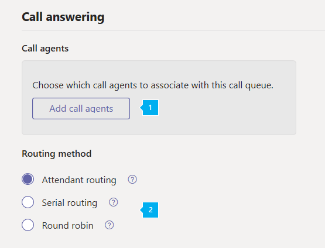

# <a name="create-a-cloud-call-queue"></a>Creare una coda di chiamata cloud

Le code delle chiamate cloud possono essere fornite:

- Messaggio di saluto.
- Musica mentre le persone sono in attesa.
- Reindirizzamento delle chiamate per chiamare gli agenti in liste di distribuzione via mail e gruppi di sicurezza.
- Impostazione di parametri diversi, ad esempio la dimensione massima della coda, il timeout e le opzioni di gestione delle chiamate.

Per associare un numero di telefono a una coda di chiamata, è possibile usare un [account di risorse](manage-resource-accounts.md). Una coda di chiamata può essere chiamata direttamente o accessibile tramite una selezione in un operatore automatico.

Il chiamante sente la musica mentre è in attesa e la chiamata si connette agli agenti di chiamata in ordine *First in, First out* (FIFO).

Tutte le chiamate nella coda vengono inviate agli agenti da uno dei metodi seguenti:

- Con il routing di Attendant, la prima chiamata nella coda squilla tutti gli agenti contemporaneamente.
- Con il routing seriale, la prima chiamata nella coda squilla tutti gli agenti di chiamata uno alla volta.
- Con Round Robin, il routing delle chiamate in arrivo è bilanciato in modo che ogni agente di chiamata ottenga lo stesso numero di chiamate dalla coda.

    > [!NOTE]
    > Gli agenti di chiamata **offline**, hanno impostato la loro presenza su non **disturbare** o hanno scelto di non ricevere chiamate nella coda di chiamata.

- Solo una notifica di chiamata in arrivo (per la chiamata a capo della coda) alla volta passa agli agenti di chiamata.
- Una volta che un agente di chiamata accetta la chiamata, la prossima chiamata in arrivo in coda viene segnalata agli agenti di chiamata.

> [!NOTE]
> Questo articolo si applica sia a Microsoft teams che a Skype for business online.

## <a name="step-1--get-started"></a>Passaggio 1: iniziare

Per iniziare a utilizzare le code di chiamata, è importante ricordare quanto segue.

- È necessaria una coda di chiamata per avere un account di risorse associato. Per informazioni dettagliate sugli account delle risorse, vedere [gestire gli account delle risorse in teams](manage-resource-accounts.md) .
- Quando si assegna un numero di telefono a un account delle risorse, è ora possibile usare la licenza per gli [utenti virtuali](teams-add-on-licensing/virtual-user.md)del sistema telefonico senza costi. Sistema telefonico consente di usare i numeri di telefono a livello di organizzazione per l'operatore automatico a basso costo e i servizi di Accodamento chiamate.

> [!NOTE]
> I numeri di servizio di routing diretto per le code di chiamata sono supportati solo per gli utenti e gli agenti di Microsoft teams.

> [!NOTE]
> Per reindirizzare le chiamate alle persone dell'organizzazione online, devono avere una licenza per il **sistema telefonico** e essere abilitate per VoIP aziendale o avere piani di chiamata di Office 365. Vedere [assegnare licenze di Skype for business](/Skype/SfbOnline/skype-for-business-and-microsoft-teams-add-on-licensing/assign-skype-for-business-and-microsoft-teams-licenses.md) o [assegnare licenze di Microsoft teams](assign-teams-licenses.md). Per abilitare VoIP aziendale, è possibile utilizzare Windows PowerShell. Ad esempio, Esegui:`Set-CsUser -identity "Amos Marble" -EnterpriseVoiceEnabled $true`

- Per altre informazioni sui piani di chiamate di Office 365, vedere [sistemi di telefonia e](calling-plan-landing-page.md) piani di chiamata e [piani di chiamata per Office 365](calling-plans-for-office-365.md).

- È possibile assegnare solo i numeri di telefono a pedaggio e numero verde delle code di chiamate cloud disponibili nell'interfaccia di **amministrazione di Microsoft teams** o trasferiti da un altro provider di servizi. I crediti per le comunicazioni sono necessari per i numeri di servizio gratuiti.

    > [!NOTE]
    > I numeri di telefono di utenti (abbonati) non possono essere assegnati a code di chiamata, ma solo numeri di telefono di servizio a pagamento o numeri verdi.

- I client seguenti sono supportati per gli agenti di chiamata associati a una coda di chiamata cloud:

  - Client desktop Skype for business 2016 (versioni 32 e 64 bit)

  - Client desktop Lync 2013 (versioni 32 e 64 bit)

  - Tutti i modelli di telefono IP supportati per Microsoft teams. Vedere [ottenere telefoni per Skype for business online](/skypeforbusiness/what-is-phone-system-in-office-365/getting-phones-for-skype-for-business-online/getting-phones-for-skype-for-business-online).

  - Client Mac Skype for Business (versione 16.8.196 e versioni successive)

  - Client Android Skype for Business (versione 6.16.0.9 e versioni successive)

  - Client iPhone Skype for Business (versione 6.16.0 e versioni successive)

  - Client Mac Skype for Business (versione 6.16.0 e versioni successive)

  - Client Windows Microsoft Teams (versioni a 32 bit e 64 bit)

  - Client Microsoft Teams Mac

  - App per iPhone di Microsoft Teams

  - App Microsoft teams Android

    > [!NOTE]
    > Le code di chiamata assegnate a un numero di routing diretto non supportano i client di Skype for business, i client Lync o i telefoni IP Skype for business come agenti. 

## <a name="step-2--getting-or-transferring-toll-or-toll-free-service-phone-numbers"></a>Passaggio 2: ottenere o trasferire numeri di telefono del servizio a pagamento o a numero verde

Prima di poter creare e configurare le code di chiamata, è necessario ottenere o trasferire i numeri di servizio a pagamento o a pedaggio esistenti. Dopo aver ottenuto i numeri di telefono del servizio a pagamento o a pedaggio, verranno visualizzati nei**numeri di telefono**della**voce** > del portale > **** > dell'interfaccia di **amministrazione Microsoft teams**legacy e il **tipo di numero** verrà elencato come **Servizio-numero verde**. Per ottenere i numeri di servizio, vedere [recupero di numeri di telefono](getting-service-phone-numbers.md) o se si vuole trasferire un numero di servizio esistente, vedere trasferire i [numeri di telefono in Office 365](transfer-phone-numbers-to-office-365.md).

> [!NOTE]
> Se si è al di fuori degli Stati Uniti, non è possibile usare l'interfaccia di amministrazione di Microsoft teams per ottenere i numeri di servizio. Vai a [gestire i numeri di telefono per l'organizzazione](manage-phone-numbers-for-your-organization/manage-phone-numbers-for-your-organization.md) per vedere come farlo dall'esterno degli Stati Uniti.

Quando si configura più operatori automatici, è possibile assegnare un numero di telefono solo all'account delle risorse dell'operatore automatico principale, che può indirizzare i chiamanti alle code di chiamata o agli operatori automatici annidati. In questi casi, è possibile creare tutti gli operatori automatici e le code di chiamata nel sistema senza assegnare le opzioni del tastierino e quindi modificare le impostazioni in un secondo momento. Questa operazione è necessaria perché non è consentito creare un'opzione che collega a una coda di chiamata o a un operatore automatico che non esiste ancora.

## <a name="step-3--create-a-new-call-queue"></a>Passaggio 3: creare una nuova coda di chiamata

[!INCLUDE [updating-admin-interfaces](includes/updating-admin-interfaces.md)]

> [!IMPORTANT]
> Ogni coda di chiamata è necessaria per avere un [account di risorse](manage-resource-accounts.md)associato. Devi prima creare l'account della risorsa, quindi puoi associarlo alla coda di chiamata.

### <a name="using-the-microsoft-teams-admin-center"></a>Uso dell'interfaccia di amministrazione di Microsoft Teams

Nell'interfaccia di **amministrazione di Microsoft teams**,**code di chiamata** **vocale** > , quindi fare clic su **+ Aggiungi nuovo**:

### <a name="set-the-call-queue-display-name-and-resource-account"></a>Impostare il nome visualizzato della coda di chiamata e l'account delle risorse


* * *


**nome** dello screenshot precedente immettere un nome visualizzato descrittivo per la coda di chiamata. Questo nome è obbligatorio e può contenere fino a 64 caratteri, inclusi gli spazi.

 Questo nome viene visualizzato nella notifica per la chiamata in arrivo.

* * *


**Aggiungere account** Selezionare un account di risorse. L'account delle risorse può o non può essere associato a un numero di telefono a pagamento o a pagamento gratuito per la coda di chiamata, ma per ogni coda di chiamata è necessario un account di risorse associato.

Se non sono presenti elenchi, è necessario ottenere i numeri di servizio e assegnarli a un account delle risorse prima di poter creare la coda di chiamata, come descritto in precedenza. Per ottenere i numeri di servizio, vedere [ottenere i numeri di telefono del servizio](getting-service-phone-numbers.md). Si crea un account delle risorse come descritto in [gestire gli account delle risorse in teams](manage-resource-accounts.md) se si vuole che la coda di chiamata disponga di un numero di telefono associato.

> [!NOTE]
> Se si vuole o è necessario assegnare un **dominio** , assegnarlo all'account delle risorse per la coda di chiamata.

### <a name="set-the-greeting-and-music-played-while-on-hold"></a>Impostare il saluto e la musica durante l'attesa


* * *


Il **Saluto** è opzionale. Questo è il messaggio di saluto che viene riprodotto per le persone che chiamano il numero della coda di chiamata.

È possibile caricare un file audio (formati. wav,. mp3 o. WMA).


**Musica in attesa** È possibile usare la musica predefinita in attesa fornita con la coda di chiamata oppure è possibile caricare un file audio in formato WAV, MP3 o WMA da usare come musica personalizzata in attesa.

* * *

### <a name="select-the-call-answering-options"></a>Selezionare le opzioni di segreteria telefonica




È possibile selezionare fino a 200 gli agenti di chiamata che appartengono a una delle seguenti liste di distribuzione o gruppi:

- Gruppo Office 365
- Gruppo di sicurezza
- Elenco di distribuzione

Gli agenti di chiamata selezionati devono essere uno dei seguenti: 

- Utenti online con licenza di sistema telefonico e VoIP aziendale abilitato 
- Utenti online con un piano per le chiamate
- Utenti di Skype for Business Server locale

  > [!NOTE]
  > Questo vale anche se vuoi reindirizzare le chiamate agli utenti dell'organizzazione online. Questi utenti devono avere una licenza per il **sistema telefonico** e VoIP aziendale abilitato **o** avere un piano di chiamata. Per altre informazioni, vedere [assegnare licenze Skype for business](/Skype/SfbOnline/skype-for-business-and-microsoft-teams-add-on-licensing/assign-skype-for-business-and-microsoft-teams-licenses.md), [assegnare licenze Microsoft teams](https://docs.microsoft.com/microsoftteams/assign-teams-licenses)o [quale piano per le chiamate è giusto per l'utente?](https://docs.microsoft.com/microsoftteams/calling-plan-landing-page)

 Per abilitare un agente per VoIP aziendale, è possibile usare Windows PowerShell. Ad esempio, Esegui:`Set-CsUser -identity "Amos Marble" -EnterpriseVoiceEnabled $true`

- Utenti con una licenza di **sistema telefonico** o un piano di chiamata aggiunto a un gruppo di Office 365; una lista di distribuzione abilitata per la posta elettronica; o un gruppo di sicurezza. Per iniziare a ricevere chiamate da una coda di chiamata, potrebbero essere necessarie fino a tre ore per un nuovo agente aggiunto in una lista di distribuzione o un gruppo di sicurezza. Una lista di distribuzione o un gruppo di sicurezza appena creato può richiedere fino a 48 ore per diventare disponibile per l'uso con le code di chiamata. I Gruppi di Office 365 appena creati sono disponibili quasi immediatamente.

- Se gli agenti usano l'app Microsoft teams per eseguire chiamate in coda di chiamata, devono essere in modalità TeamsOnly.


**Metodo di routing** Per il metodo di distribuzione delle code di chiamata, è possibile scegliere **Supervisore**, **seriale**o **Round Robin** . Tutte le code di chiamata nuovi ed esistenti hanno l'instradamento operatore selezionato per impostazione predefinita. Quando viene usato il routing di Attendant, la prima chiamata nella coda squilla tutti gli agenti di chiamata contemporaneamente. Il primo agente di chiamata a prendere la chiamata riceve la chiamata.

- Il **routing degli assistenti** fa sì che la prima chiamata nella coda squilli tutti gli agenti di chiamata contemporaneamente. Il primo agente di chiamata a prendere la chiamata riceve la chiamata.
- **Routing seriale** chiamate in arrivo chiama gli agenti di chiamata uno alla volta, a partire dall'inizio dell'elenco dell'agente di chiamata. Non è possibile ordinare gli agenti nell'elenco agente chiamate. Se un agente rifiuta o non seleziona una chiamata, la chiamata squillerà all'agente successivo nell'elenco e cercherà tutti gli agenti uno alla volta fino a quando non verrà risposta o va in timeout in attesa nella coda.
  > [!NOTE]
  > L'instradamento seriale ignorerà gli agenti che sono **Non in linea**, che hanno impostato la presenza su **Non disturbare**o hanno **Rinunciato** scegliendo di non ricevere chiamate da questa coda.
- **Round Robin** bilancia il routing delle chiamate in arrivo in modo che ogni agente di chiamata ottenga lo stesso numero di chiamate dalla coda. Questo potrebbe essere auspicabile in un ambiente di vendita in entrata per assicurare la parità di opportunità tra tutti gli agenti di chiamata.

### <a name="select-an-agent-opt-out-option"></a>Selezionare un'opzione di opt-out per l'agente


* * *


**L'agente può rifiutare di ricevere chiamate** È possibile scegliere di consentire agli agenti della coda di chiamata di rifiutare l'annullamento delle chiamate da una coda specifica abilitando questa opzione.

L'abilitazione di questa opzione consente a tutti gli agenti in questa coda di avviare o interrompere la ricezione delle chiamate da questa coda di chiamata. Puoi revocare il privilegio di esclusione dell'agente in qualsiasi momento, deselezionando la casella di controllo, includendo nuovamente automaticamente tutti gli agenti a questa coda (impostazione predefinita per tutti gli agenti).

Per accedere all'opzione di esclusione, gli agenti possono eseguire le seguenti operazioni:

 1. Aprire **Opzioni** nel proprio client desktop di Skype for Business.
 2. Nella scheda **Inoltro chiamata** di chiamata, fare clic sul collegamento **Modifica impostazioni online**.
 3. Nella pagina impostazioni utente fare clic su **code di chiamata**e quindi deselezionare le caselle di controllo relative alle code per cui si desidera escludere l'opt-out.

    > [!NOTE]
    > Gli agenti che usano app o endpoint diversi da Skype for business desktop possono accedere all'opzione opt-out dal portale [https://aka.ms/cqsettings](https://aka.ms/cqsettings)delle impostazioni utente.


**impostazione di avviso dell'agente** screenshot precedente

In questo modo viene definita la durata di un agente notificato di una chiamata prima che i metodi di routing seriale o Round Robin vengano spostati nell'agente successivo.

L'impostazione predefinita è 30 secondi, ma può essere impostata per un massimo di 3 minuti.

* * *

### <a name="set-the-call-overflow-and-timeout-handling-options"></a>Impostare le opzioni di gestione di overflow e timeout delle chiamate


* * *


**Chiamate massime in coda** Consente di impostare il numero massimo di chiamate che possono aspettare in coda contemporaneamente. Il valore predefinito è 50, ma può variare da 0 a 200. Quando viene raggiunto questo limite, la chiamata viene gestita nel modo in cui viene impostata la posizione in **cui viene raggiunto il numero massimo di chiamate** .

* * *


**Quando viene raggiunto il numero massimo di chiamate** Quando la coda di chiamata raggiunge le dimensioni massime (impostate usando le **chiamate massime nell'impostazione della coda** ), è possibile scegliere cosa succede alle nuove chiamate in arrivo.

- **Disconnetti** La chiamata è disconnessa.
- **Reindirizza a** Quando si sceglie questo pulsante, selezionare una delle opzioni seguenti:

  - **Persona nella tua azienda** Un utente online con una licenza di **sistema telefonico** ed essere abilitato per VoIP aziendale o avere un piano per le chiamate. È possibile configurarlo in modo che il chiamante possa essere inviato alla segreteria telefonica. A questo scopo, seleziona una **persona nella tua azienda** e imposta questa persona affinché le chiamate vengano inoltrate direttamente alla segreteria telefonica.

  Per informazioni sulle licenze necessarie per la segreteria telefonica, vedere [configurare la segreteria telefonica cloud](set-up-phone-system-voicemail.md).

  - **Applicazione vocale** Selezionare il nome di un account di risorsa associato a una coda di chiamata o a un operatore automatico già creato.

* * *


**Timeout chiamata: tempo massimo di attesa** Puoi anche decidere quanto tempo può rimanere in attesa di una chiamata nella coda prima che venga interrotto e debba essere reindirizzato o disconnesso. Il punto in cui viene reindirizzato si basa su come impostare l'impostazione quando viene impostato il timeout **di una chiamata** . Puoi impostare un tempo da 0 a 45 minuti.

Puoi impostare il valore di timeout in secondi, a intervalli di 15 secondi. In questo modo è possibile modificare il flusso delle chiamate con maggiore granularità. Ad esempio, puoi specificare che le chiamate non risposte da un agente entro 30 secondi passa a un operatore automatico di ricerca della directory.


**Timeout chiamata** Quando la chiamata raggiunge il limite impostato sul periodo di **attesa di una chiamata nell'impostazione della coda** , è possibile scegliere cosa succede a questa chiamata:

- **Disconnetti** La chiamata è disconnessa.
- **Reindirizzare la chiamata a** Quando si sceglie questa opzione, sono disponibili le opzioni seguenti:
  - **Persona nella tua azienda** Un utente online con una licenza di **sistema telefonico** ed essere abilitato per VoIP aziendale o per avere piani di chiamata. Puoi impostarla in modo che la persona che chiama possa essere passata alla segreteria telefonica. A questo scopo, seleziona una **persona nella tua azienda** e imposta questa persona affinché le chiamate vengano inoltrate direttamente alla segreteria telefonica.

  Per informazioni sulle licenze necessarie per la segreteria telefonica, vedere [configurare la segreteria telefonica cloud](set-up-phone-system-voicemail.md).

  - **Applicazione vocale** Selezionare il nome di un account di risorsa associato a una coda di chiamata o a un operatore automatico già creato.

## <a name="change-a-users-caller-id-for-outbound-calls"></a>Modificare l'ID chiamante di un utente per le chiamate in uscita

Puoi proteggere l'identità di un utente modificando l'ID chiamante per le chiamate in uscita in una coda di chiamata, un operatore automatico o un numero di servizio usando il cmdlet **New-CsCallingLineIdentity** .

Per farlo, eseguire quanto segue:

``` Powershell
New-CsCallingLineIdentity -Identity "UKSalesQueue" -CallingIdSubstitute "Service" -ServiceNumber 14258828080 -EnableUserOverride $False -Verbose
```

Quindi applica il criterio per l'utente utilizzando il cmdlet ** Grant-CallingLineIdentity.** Per farlo, eseguire quanto segue:

``` Powershell
Grant-CsCallingLineIdentity -PolicyName UKSalesQueue -Identity "AmosMarble@contoso.com"
```

Per altre informazioni su come impostare le impostazioni dell'ID chiamante nell'organizzazione [, vedere come si può usare l'ID chiamante nell'organizzazione](/microsoftteams/how-can-caller-id-be-used-in-your-organization).

## <a name="call-queue-cmdlets"></a>Cmdlet della coda di chiamata

Puoi anche utilizzare Windows PowerShell per creare e configurare code di chiamata. Ecco i cmdlet usati per gestire una coda di chiamata.

- [New-CsCallQueue](https://docs.microsoft.com/powershell/module/skype/new-CsCallQueue?view=skype-ps)

- [Set-CsCallQueue](https://docs.microsoft.com/powershell/module/skype/set-CsCallQueue?view=skype-ps)

- [Get-CsCallQueue](https://docs.microsoft.com/powershell/module/skype/get-CsCallQueue?view=skype-ps)

- [Remove-CsCallQueue](https://docs.microsoft.com/powershell/module/skype/remove-CsCallQueue?view=skype-ps)

### <a name="more-about-windows-powershell"></a>Altre informazioni su Windows PowerShell

- Windows PowerShell is all about managing users and what users are allowed or not allowed to do. Con Windows PowerShell è possibile gestire Office 365 e Microsoft teams con un unico punto di amministrazione in grado di semplificare il lavoro quotidiano, quando si hanno più attività da eseguire. Per iniziare a usare Windows PowerShell, vedere questi argomenti:

  - [Introduzione a Windows PowerShell e Skype for Business Online](/SkypeForBusiness/set-up-your-computer-for-windows-powershell/set-up-your-computer-for-windows-powershell)

  - [Sei motivi per utilizzare Windows PowerShell per gestire Office 365](https://docs.microsoft.com/en-us/office365/enterprise/powershell/why-you-need-to-use-office-365-powershell)

- Windows PowerShell offre numerosi vantaggi in termini di velocità, semplicità e produttività nell'interfaccia di amministrazione di Microsoft teams, ad esempio quando si apportano modifiche alle impostazioni per molti utenti contemporaneamente. Per informazioni su questi vantaggi, consulta i seguenti argomenti:

  - [Gestire Office 365 con Windows PowerShell](https://docs.microsoft.com/en-us/office365/enterprise/powershell/manage-office-365-with-office-365-powershell)

  - [Configurare il computer per Windows PowerShell](https://docs.microsoft.com/en-us/SkypeForBusiness/set-up-your-computer-for-windows-powershell/set-up-your-computer-for-windows-powershell)

## <a name="related-topics"></a>Argomenti correlati

[Ecco cosa offre il Sistema telefonico in Office 365](here-s-what-you-get-with-phone-system.md)

[Recupero di numeri di telefono del servizio](getting-service-phone-numbers.md)

[Disponibilità di Audioconferenza e Piani per chiamate per Paese e area geografica](country-and-region-availability-for-audio-conferencing-and-calling-plans/country-and-region-availability-for-audio-conferencing-and-calling-plans.md)

[New-CsOnlineApplicationInstance](https://docs.microsoft.com/powershell/module/skype/new-csonlineapplicationinstance?view=skype-ps)
