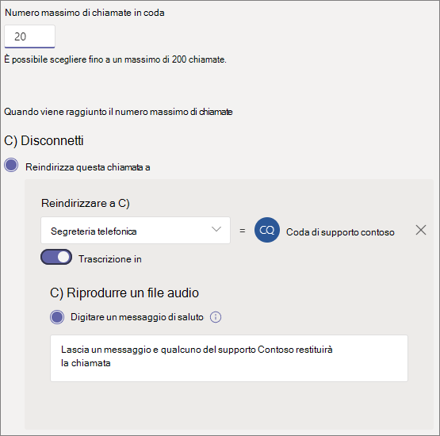

# Creare una coda di chiamataCreate a call queue

Le code di chiamata offrono un metodo per indirizzare i chiamanti alle persone dell'organizzazione che possono essere utili per un problema o una domanda particolare.Call queues provide a method of routing callers to people in your organization who can help with a particular issue or question. Le chiamate vengono distribuite una alla volta per gli utenti della coda (noti come *agenti*).Calls are distributed one at a time to the people in the queue (who are known as *agents*). 

Le code di chiamata includono:Call queues provide:

- Messaggio di saluto.A greeting message.

- Musica mentre gli utenti attendono il blocco in una coda.Music while people are waiting on hold in a queue.

- Chiamata routing-in *First in, First out* (FIFO) Order-to Agents.Call routing - in *First In, First Out* (FIFO) order - to agents.

- Opzioni di gestione per l'overflow e il timeout delle code.Handling options for queue overflow and timeout.

Assicurarsi di aver letto [piano per gli operatori automatici di teams e le code di chiamata](plan-auto-attendant-call-queue.md) e aver seguito i [passaggi introduttivi](plan-auto-attendant-call-queue.md#getting-started) prima di seguire le procedure descritte in questo articolo.Be sure you have read [Plan for Teams auto attendants and call queues](plan-auto-attendant-call-queue.md) and followed the [getting started steps](plan-auto-attendant-call-queue.md#getting-started) before you follow the procedures in this articles.

Per configurare una coda di chiamata, nell'interfaccia di amministrazione di Team espandere **voce**, fare clic su **code di chiamata** e quindi fare clic su **Aggiungi**.To set up a call queue, in the Teams admin center, expand **Voice**, click **Call queues**, and then click **Add**.

## Account e lingua delle risorseResource account and language

1. Digitare un nome per la coda di chiamata.Type a name for the call queue. Gli agenti vedranno questo nome quando ricevono una chiamata in arrivo dalla coda.Agents will see this name when they receive an incoming call from the queue.

2. Fare clic su **Aggiungi account**, cercare l'account risorse che si vuole usare con la coda di chiamata, fare clic su **Aggiungi** e quindi fare clic su **Aggiungi**.Click **Add accounts**, search for the resource account that you want to use with this call queue, click **Add**, and then click **Add**.

3. Scegliere una lingua.Choose a language. Questa lingua verrà usata per le istruzioni vocali generate dal sistema e la trascrizione della segreteria telefonica (se abilitate).This language will be used for system-generated voice prompts and voicemail transcription (if you enable them).

## Messaggi di saluto e musica in attesa in codaGreetings and music on hold in queue

Specificare se si vuole riprodurre un saluto ai chiamanti quando arrivano in coda.Specify if you want to play a greeting to callers when they arrive in the queue. È necessario caricare un file MP3, WAV o WMA contenente il messaggio di saluto che si vuole riprodurre.You must upload an MP3, WAV, or WMA file containing the greeting that you want to play.

Teams offre musica predefinita ai chiamanti mentre sono in attesa in una coda.Teams provides default music to callers while they are on hold in a queue. Se si vuole riprodurre un file audio specifico, scegliere **Riproduci un file audio** e caricare un file MP3, WAV o WMA.If you want to play a specific audio file, choose **Play an audio file** and upload an MP3, WAV, or WMA file.

> [!NOTE]
> La registrazione caricata non può essere superiore a 5 MB.The uploaded recording can be no larger than 5 MB.
> La musica predefinita fornita nelle code delle chiamate di teams è priva di qualsiasi royalties pagabile dall'organizzazione.The default music supplied in Teams call queues is free of any royalties payable by your organization. 

## Agenti di chiamataCall agents

Per poter aggiungere agenti a una coda di chiamata, vedere i [prerequisiti](plan-auto-attendant-call-queue.md#prerequisites) .Please refer to the [Prerequisites](plan-auto-attendant-call-queue.md#prerequisites) in order to be able to add agents to a call queue.

È possibile aggiungere fino a 20 agenti singolarmente e fino a 200 agenti tramite gruppi.You can add up to 20 agents individually and up to 200 agents via groups.

Per aggiungere un utente alla coda, fare clic su **Aggiungi utenti**, cercare l'utente, fare clic su **Aggiungi** e quindi fare clic su **Aggiungi**.To add a user to the queue, click **Add users**, search for the user, click **Add**, and then click **Add**.

Per aggiungere un gruppo alla coda, fare clic su **Aggiungi gruppi**, cercare il gruppo, fare clic su **Aggiungi** e quindi fare clic su **Aggiungi**.To add a group to the queue, click **Add groups**, search for the group, click **Add**, and then click **Add**. È possibile usare le liste di distribuzione, i gruppi di sicurezza e i gruppi Microsoft 365 o Microsoft teams.You can use distribution lists, security groups, and Microsoft 365 groups or Microsoft Teams teams.

> [!NOTE]
> I nuovi utenti aggiunti a un gruppo possono richiedere fino a otto ore per la prima chiamata in arrivo.New users added to a group can take up to eight hours for their first call to arrive.

## Routing delle chiamateCall routing

La **modalità conferenza** riduce significativamente la quantità di tempo necessaria affinché un chiamante venga connesso a un agente, dopo che l'agente accetta la chiamata.**Conference mode** significantly reduces the amount of time it takes for a caller to be connected to an agent, after the agent accepts the call. Per il funzionamento della modalità conferenza, gli agenti nella coda di chiamata devono usare uno dei client seguenti:For conference mode to work, agents in the call queue must use one of the following clients:

  - La versione più recente di Microsoft teams desktop client, Android app o iOS appThe latest version of the Microsoft Teams desktop client, Android app, or iOS app
  - Telefono Microsoft teams versione 1449/1.0.94.2020051601 o successivaMicrosoft Teams phone version 1449/1.0.94.2020051601 or later
  
Gli account teams degli agenti devono essere impostati sulla modalità solo teams.Agents' Teams accounts need to be set to Teams-only mode. Gli agenti che non soddisfano i requisiti non sono inclusi nell'elenco di routing delle chiamate.Agents who don't meet the requirements aren't included in the call routing list. È consigliabile abilitare la modalità conferenza per le code di chiamata se gli agenti usano tutti i client compatibili.We recommend enabling conference mode for your call queues if your agents are all using compatible clients.

Il **metodo di routing** determina l'ordine in cui gli agenti ricevono chiamate dalla coda.**Routing method** determines the order in which agents receive calls from the queue. Scegliere una delle opzioni seguenti:Choose from these options:

- Il **routing di Attendant** squilla tutti gli agenti della coda contemporaneamente.**Attendant routing** rings all agents in the queue at the same time. Il primo agente di chiamata a prendere la chiamata riceve la chiamata.The first call agent to pick up the call gets the call.

- Il **routing seriale** squilla tutti gli agenti di chiamata uno alla volta nell'ordine specificato nell'elenco **agenti di chiamata** .**Serial routing** rings all call agents one by one in the order specified in the **Call agents** list. Se un agente respinge o non prende una chiamata, la chiamata suonerà l'agente successivo e proverà tutti gli agenti finché non viene prelevato o non viene ritirato.If an agent dismisses or does not pick up a call, the call will ring the next agent and will try all agents until it is picked up or times out.

- **Round Robin** bilancia il routing delle chiamate in arrivo in modo che ogni agente di chiamata ottenga lo stesso numero di chiamate dalla coda.**Round robin** balances the routing of incoming calls so that each call agent gets the same number of calls from the queue. Questo potrebbe essere auspicabile in un ambiente di vendita in entrata per assicurare la parità di opportunità tra tutti gli agenti di chiamata.This may be desirable in an inbound sales environment to assure equal opportunity among all the call agents.

- Le rotte **inattive più lunghe** ogni chiamata all'agente che è stato inattivo il tempo più lungo.**Longest idle** routes each call to the agent who has been idle the longest time. Un agente viene considerato inattivo se lo stato presenza è disponibile o se lo stato presenza è stato assente per meno di 10 minuti.An agent is considered idle if their presence state is Available or if their presence state has been Away for less than 10 minutes. Gli agenti il cui stato di presenza è stato assente per più di 10 minuti non sono considerati inattivi e non sono idonei a ricevere chiamate finché non modificano la loro presenza in available.Agents whose presence state has been Away for more than 10 minutes are not considered idle and will not be eligible to receive calls until they change their presence to Available. 

Il **routing basato sulla presenza** usa lo stato di disponibilità degli agenti di chiamata per determinare se un agente deve essere incluso nell'elenco di routing delle chiamate per il metodo di routing selezionato.**Presence-based routing** uses the availability status of call agents to determine whether an agent should be included in the call routing list for the selected routing method. Gli agenti di chiamata il cui stato di disponibilità è impostato su **disponibile** sono inclusi nell'elenco di routing delle chiamate e possono ricevere chiamate.Call agents whose availability status is set to **Available** are included in the call routing list and can receive calls. Gli agenti il cui stato di disponibilità è impostato su qualsiasi altro stato sono esclusi dall'elenco di routing delle chiamate e non ricevono le chiamate finché il loro stato di disponibilità non torna a **disponibile**.Agents whose availability status is set to any other status are excluded from the call routing list and won't receive calls until their availability status changes back to **Available**. 

Puoi abilitare il routing delle chiamate basate sulla presenza con uno dei metodi di routing.You can enable presence-based call routing with any of the routing methods.

Se un agente sceglie di ricevere chiamate, non verrà incluso nell'elenco di routing delle chiamate, indipendentemente dal tipo di stato di disponibilità impostato.If an agent opts out of getting calls, they won't be included in the call routing list regardless of what their availability status is set to. 

> [!NOTE]
> Gli agenti che usano il client Skype for business non sono inclusi nell'elenco di routing delle chiamate quando è abilitato il routing basato sulla presenza.Agents who use the Skype for Business client aren't included in the call routing list when presence-based routing is enabled. Se si hanno agenti che usano Skype for business, non abilitare il routing delle chiamate basate sulla presenza.If you have agents who use Skype for Business, don't enable presence-based call routing.

L' **ora di avviso dell'agente** specifica il tempo di squillo del telefono di un agente prima che la chiamata venga reindirizzata all'agente successivo.**Agent alert time** specifies how long an agent's phone will ring before the queue redirects the call to the next agent.

Per le code a volume elevato, è consigliabile seguire le impostazioni seguenti:For high volume queues, we recommend the following settings:

- **Modalità conferenza** per l' **auto****Conference mode** to **Auto**
- **Metodo di routing** per il **routing di Attendant****Routing method** to **Attendant routing**
- **Routing basato sulla presenza** **su** attivato**Presence-based routing** to **On**
- **Tempo di avviso agente:** a **20 secondi****Agent alert time:** to **20 seconds**

## Gestione dell'overflow delle chiamateCall overflow handling

**Massimo chiamate nella coda** specifica il numero massimo di chiamate che possono essere attese nella coda in qualsiasi momento.**Maximum calls in the queue** specifies the maximum number of calls that can wait in the queue at any given time. Il valore predefinito è 50, ma può variare da 0 a 200.The default is 50, but it can range from 0 to 200. Quando viene raggiunto questo limite, la chiamata viene gestita come specificato dalla **quando viene raggiunta l'impostazione del numero massimo di chiamate** .When this limit is reached, the call is handled as specified by the **When the maximum number of calls is reached** setting.

Puoi scegliere di disconnettere la chiamata o di reindirizzarla a qualsiasi destinazione di routing delle chiamate.You can choose to disconnect the call or redirect it to any of the call routing destinations. Ad esempio, è possibile che il chiamante lasci un messaggio vocale per gli agenti nella coda.For example, you might have the caller leave a voicemail for the agents in the queue. Per i trasferimenti esterni, vedere i [prerequisiti](plan-auto-attendant-call-queue.md#prerequisites) e i trasferimenti per i [numeri di telefono esterni-dettagli tecnici](create-a-phone-system-auto-attendant.md#external-phone-number-transfers---technical-details) per la formattazione dei numeri.For external transfers, please refer to [Prerequisites](plan-auto-attendant-call-queue.md#prerequisites) and the [external phone number transfers - technical details](create-a-phone-system-auto-attendant.md#external-phone-number-transfers---technical-details) for number formatting.

> [!NOTE]
> Se il numero massimo di chiamate è impostato su 0, il messaggio di saluto non verrà riprodotto.If the maximum number of calls is set to 0 then the greeting message will not play.

## Gestione del timeout delle chiamateCall timeout handling

**Timeout chiamata: periodo di attesa massimo** specifica il tempo massimo che una chiamata può contenere nella coda prima che venga reindirizzata o disconnessa.**Call Timeout: maximum wait time** specifies the maximum time a call can be on hold in the queue before it is redirected or disconnected. È possibile specificare un valore da 0 secondi a 45 minuti.You can specify a value from 0 seconds to 45 minutes.

Puoi scegliere di disconnettere la chiamata o di reindirizzarla a una delle destinazioni di routing delle chiamate.You can choose to disconnect the call or redirect it to one of the call routing destinations. Ad esempio, è possibile che il chiamante lasci un messaggio vocale per gli agenti nella coda.For example, you might have the caller leave a voicemail for the agents in the queue. Per i trasferimenti esterni, vedere i [prerequisiti](plan-auto-attendant-call-queue.md#prerequisites) e i trasferimenti per i [numeri di telefono esterni-dettagli tecnici](create-a-phone-system-auto-attendant.md#external-phone-number-transfers---technical-details) per la formattazione dei numeri.For external transfers, please refer to [Prerequisites](plan-auto-attendant-call-queue.md#prerequisites) and the [external phone number transfers - technical details](create-a-phone-system-auto-attendant.md#external-phone-number-transfers---technical-details) for number formatting.

Dopo aver selezionato le opzioni di timeout delle chiamate, fare clic su **Salva**.When you have selected your call timeout options, click **Save**.

## ID chiamante per le chiamate in uscitaCaller ID for outbound calls

Poiché gli agenti in una coda di chiamata possono effettuare chiamate in uscita per restituire una chiamata al cliente, è consigliabile impostare l'ID chiamante per i membri di una coda di chiamata sul numero di servizio di un operatore automatico appropriato.Since agents in a call queue may dial out to return a customer call, consider setting the caller ID for members of a call queue to the service number of an appropriate auto attendant. Per altre informazioni, vedere [gestire i criteri di ID chiamante in Microsoft teams](caller-id-policies.md) .See [Manage caller ID policies in Microsoft Teams](caller-id-policies.md) for more information.

## Client supportatiSupported clients

I client seguenti sono supportati per gli agenti di chiamata in una coda di chiamata:The following clients are supported for call agents in a call queue:

  - Client desktop Skype for business 2016 (versioni 32 e 64 bit)Skype for Business desktop client 2016 (32-bit and 64-bit versions)
  - Client desktop Lync 2013 (versioni 32 e 64 bit)Lync desktop client 2013 (32-bit and 64-bit versions)
  - Tutti i modelli di telefono IP supportati per Microsoft teams.All IP phone models supported for Microsoft Teams. Vedere [ottenere telefoni per Skype for business online](/skypeforbusiness/what-is-phone-system-in-office-365/getting-phones-for-skype-for-business-online/getting-phones-for-skype-for-business-online).See [Getting phones for Skype for Business Online](/skypeforbusiness/what-is-phone-system-in-office-365/getting-phones-for-skype-for-business-online/getting-phones-for-skype-for-business-online).
  - Client Mac Skype for Business (versione 16.8.196 e versioni successive)Mac Skype for Business Client (version 16.8.196 and later)
  - Client Android Skype for Business (versione 6.16.0.9 e versioni successive)Android Skype for Business Client (version 6.16.0.9 and later)
  - Client iPhone Skype for Business (versione 6.16.0 e versioni successive)iPhone Skype for Business Client (version 6.16.0 and later)
  - Client Mac Skype for Business (versione 6.16.0 e versioni successive)iPad Skype for Business Client (version 6.16.0 and later)
  - Client Windows Microsoft Teams (versioni a 32 bit e 64 bit)Microsoft Teams Windows client (32-bit and 64-bit versions)
  - Client Microsoft Teams MacMicrosoft Teams Mac client
  - App per iPhone di Microsoft TeamsMicrosoft Teams iPhone app
  - App Microsoft teams AndroidMicrosoft Teams Android app

    > [!NOTE]
    > Le code di chiamata assegnate a un numero di routing diretto non supportano i client Skype for business, i client Lync o i telefoni IP Skype for business come agenti.Call queues that are assigned a direct routing number don't support Skype for Business clients, Lync clients, or Skype for Business IP Phones as agents.

## Cmdlet della coda di chiamataCall queue cmdlets

Puoi anche utilizzare Windows PowerShell per creare e configurare code di chiamata.You can also use Windows PowerShell to create and set up call queues. Ecco i cmdlet usati per gestire una coda di chiamata.Here are the cmdlets that you use to manage a call queue.

- [New-CsCallQueueNew-CsCallQueue](https://docs.microsoft.com/powershell/module/skype/new-CsCallQueue)

- [Set-CsCallQueueSet-CsCallQueue](https://docs.microsoft.com/powershell/module/skype/set-CsCallQueue)

- [Get-CsCallQueueGet-CsCallQueue](https://docs.microsoft.com/powershell/module/skype/get-CsCallQueue)

- [Remove-CsCallQueueRemove-CsCallQueue](https://docs.microsoft.com/powershell/module/skype/remove-CsCallQueue)

## Argomenti correlatiRelated topics

[Vantaggi offerti dal Sistema telefonicoHere's what you get with Phone System](here-s-what-you-get-with-phone-system.md)

[Recuperare numeri di telefono del servizio](getting-service-phone-numbers.md).[Getting service phone numbers](getting-service-phone-numbers.md)

[Disponibilità di Audioconferenza e Piani per chiamate per Paese e area geograficaCountry and region availability for Audio Conferencing and Calling Plans](country-and-region-availability-for-audio-conferencing-and-calling-plans/country-and-region-availability-for-audio-conferencing-and-calling-plans.md)

[New-CsOnlineApplicationInstanceNew-CsOnlineApplicationInstance](https://docs.microsoft.com/powershell/module/skype/new-csonlineapplicationinstance)

[Introduzione a Windows Powershell e Skype for Business onlineAn introduction to Windows PowerShell and Skype for Business Online](/SkypeForBusiness/set-up-your-computer-for-windows-powershell/set-up-your-computer-for-windows-powershell)
