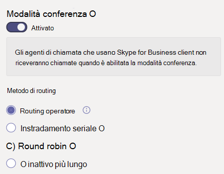
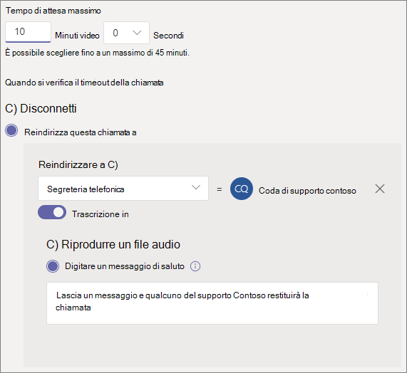

# Creare una coda di chiamata

Le code di chiamata sono un metodo per instradare i chiamanti all'interno dell'organizzazione, che possono aiutare a risolvere un particolare problema o domanda. Le chiamate vengono distribuite una alla volta alle persone in coda (che sono noti come *agenti).* 

Le code di chiamata forniscono:

- Un messaggio di saluto.

- Musica in attesa di un blocco in coda.

- Instradamento delle chiamate ( in *ordine FIFO ,First In, First Out)* - agli agenti.

- Opzioni di gestione per l'overflow e il timeout della coda.

Assicurarsi di aver letto Il piano per gli operatori  automatici e le code di chiamata di [Teams](plan-auto-attendant-call-queue.md) e aver seguito le procedure introduttive prima di seguire le procedure di questo articolo.

Per impostare una coda di chiamata, nell'interfaccia di amministrazione di Teams espandi **Voce,** fai clic su Code di **chiamata,** quindi fai clic su **Aggiungi.**

## Account e lingua delle risorse

1. Digitare un nome per la coda di chiamata. Gli agenti riceveranno questo nome quando ricevono una chiamata in arrivo dalla coda.

2. Fare **clic su Aggiungi** account, cercare l'account delle risorse da usare con questa coda di chiamata, fare clic su Aggiungi e quindi su **Aggiungi.** 

3. Scegliere una lingua. Questa lingua verrà utilizzata per i comandi vocali generati dal sistema e per la trascrizione della segreteria telefonica (se li abiliti).

## Messaggi di saluto e musica di attesa in coda

Specificare se si vuole riprodurre un messaggio di saluto ai chiamanti quando arrivano in coda. È necessario caricare un file MP3, WAV o WMA contenente il messaggio di saluto da riprodurre.

Teams offre musica predefinita ai chiamanti mentre sono in attesa in coda. Se si vuole riprodurre un file audio specifico, scegliere Riproduci **file audio** e caricare un file MP3, WAV o WMA.

> [!NOTE]
> Le dimensioni della registrazione caricata non possono essere superiori a 5 MB.
> La musica predefinita fornita nelle code di chiamata di Teams è gratuita di tutte le royalty pagate dall'organizzazione. 

## Agenti di chiamata

Fai riferimento ai [prerequisiti per](plan-auto-attendant-call-queue.md#prerequisites) poter aggiungere agenti a una coda di chiamata.

È possibile aggiungere fino a 20 agenti singolarmente e fino a 200 tramite gruppi.

Per aggiungere un utente alla coda, fare clic su Aggiungi **utenti,** cercare l'utente, fare clic su **Aggiungi** e quindi su **Aggiungi.**

Per aggiungere un gruppo alla coda, fare clic **su Aggiungi gruppi,** cercare il gruppo, fare clic su **Aggiungi** e quindi su **Aggiungi.** È possibile usare liste di distribuzione, gruppi di sicurezza e gruppi di Microsoft 365 o team di Microsoft Teams.

> [!NOTE]
> L'arrivo della prima chiamata da parte di nuovi utenti aggiunti a un gruppo può richiedere fino a otto ore.

## Routing delle chiamate

**La modalità** conferenza riduce significativamente il tempo necessario per collegare un chiamante a un agente, dopo che l'agente ha accettato la chiamata. Per il funzionamento della modalità conferenza, gli agenti in coda di chiamata devono utilizzare uno dei client seguenti:

  - La versione più recente del client desktop di Microsoft Teams, dell'app Android o dell'app iOS
  - Telefono Microsoft Teams versione 1449/1.0.94.2020051601 o successiva
  
Gli account di Teams degli agenti devono essere impostati sulla modalità solo di Teams. Gli agenti che non soddisfano i requisiti non sono inclusi nell'elenco di instradamento chiamate. Ti consigliamo di abilitare la modalità conferenza per le code di chiamata se tutti i tuoi agenti utilizzano client compatibili.

> [!NOTE]
> Occupato non è supportato dalla modalità conferenza. Gli agenti per le chiamate non in coda di chiamata possono comunque essere presentati con una chiamata in coda di chiamata se il routing basato sulla presenza non è abilitato.

**Il metodo di** instradamento determina l'ordine in cui gli agenti ricevono le chiamate dalla coda. Scegliere una delle opzioni seguenti:

- **Il routing** dell'operatore chiama tutti gli agenti della coda contemporaneamente. Il primo agente di chiamata a ritirare la chiamata riceve la chiamata.

- **L'instradamento** seriale chiama tutti gli agenti di chiamata uno alla volta nell'ordine specificato **nell'elenco agenti di** chiamata. Se un agente ignora o non riceve una chiamata, la chiamata squillerà sul successivo agente e proverà tutti gli agenti fino al ritiro o al timeout.

- **Round Robin** bilancia il routing delle chiamate in arrivo in modo che ogni agente di chiamata riceve lo stesso numero di chiamate dalla coda. Può essere desiderabile in un ambiente di vendita in entrata per assicurare la stessa opportunità tra tutti gli agenti di chiamata.

- **L'inattività** più lunga instrada ogni chiamata all'agente che è rimasto inattivo più a lungo. Un agente viene considerato inattivo se lo stato presenza è Disponibile o se lo stato presenza è stato Non al computer per meno di 10 minuti. Gli agenti il cui stato presenza è rimasto Non al computer per più di 10 minuti non sono considerati inattivi e non saranno idonei a ricevere chiamate finché non cambia la loro presenza in Disponibile. 

**Il routing basato sulla presenza** utilizza lo stato di disponibilità degli agenti di chiamata per determinare se un agente deve essere incluso nell'elenco del routing delle chiamate per il metodo di routing selezionato. Gli agenti di chiamata il cui stato di disponibilità è impostato su **Disponibile** sono inclusi nell'elenco instradamento chiamate e possono ricevere chiamate. Gli agenti il cui stato di disponibilità è impostato su qualsiasi altro stato vengono esclusi dall'elenco instradamento chiamate e non riceveranno chiamate finché lo stato di disponibilità non torna **su Disponibile.** 

È possibile abilitare il routing delle chiamate basato sulla presenza con uno dei metodi di routing.

Se un agente rifiuta esplicitamente di ricevere chiamate, non sarà incluso nell'elenco instradamento chiamate indipendentemente da quello su cui è impostato lo stato di disponibilità. 

> [!NOTE]
> Gli agenti che utilizzano il client Skype for Business non sono inclusi nell'elenco di instradamento delle chiamate quando è abilitato il routing basato sulla presenza. Se ci sono agenti che usano Skype for Business, non abilitare il routing delle chiamate basato sulla presenza.

**L'ora dell'avviso** dell'agente specifica per quanto tempo il telefono di un agente squillerà prima che la coda reindirizza la chiamata all'agente successivo.

Per le code a volumi elevati, sono consigliate le impostazioni seguenti:

- **Modalità conferenza** su **Automatica**
- **Routing method** to **Attendant routing**
- **Routing basato sulla presenza** su **On**
- **Tempo di avviso dell'agente:** **a 20 secondi**

## Gestione dell'overflow delle chiamate

**Il numero massimo di** chiamate in coda specifica il numero massimo di chiamate che possono aspettare in coda in qualsiasi momento. Il valore predefinito è 50, ma può essere compreso tra 0 e 200. Una volta raggiunto questo limite, la chiamata viene gestita come specificato dall'impostazione Quando viene raggiunto il numero massimo **di** chiamate.

È possibile scegliere di disconnettere la chiamata o reindirizzarla a una delle destinazioni di instradamento chiamate. Ad esempio, il chiamante potrebbe lasciare un messaggio vocale per gli agenti in coda. Per i trasferimenti esterni, consulta [Prerequisiti](plan-auto-attendant-call-queue.md#prerequisites) e trasferimenti del numero di telefono [esterno - dettagli tecnici per](create-a-phone-system-auto-attendant.md#external-phone-number-transfers---technical-details) la formattazione dei numeri.

> [!NOTE]
> Se il numero massimo di chiamate è impostato su 0, il messaggio di saluto non verrà riprodotto.

## Gestione del timeout di chiamata

**Timeout chiamata: il tempo di** attesa massimo specifica il tempo massimo per cui una chiamata può essere in attesa in coda prima di essere reindirizzata o disconnessa. È possibile specificare un valore compreso tra 0 secondi e 45 minuti.

È possibile scegliere di disconnettere la chiamata o reindirizzarla a una delle destinazioni di instradamento chiamate. Ad esempio, il chiamante potrebbe lasciare un messaggio vocale per gli agenti in coda. Per i trasferimenti esterni, consulta [Prerequisiti](plan-auto-attendant-call-queue.md#prerequisites) e trasferimenti del numero di telefono [esterno - dettagli tecnici per](create-a-phone-system-auto-attendant.md#external-phone-number-transfers---technical-details) la formattazione dei numeri.

Dopo aver selezionato le opzioni di timeout della chiamata, fare clic su **Salva.**

## ID chiamante per le chiamate in uscita

Poiché gli agenti in una coda di chiamata possono effettuare chiamate in uscita per restituire una chiamata al cliente, puoi impostare l'ID chiamante per i membri di una coda di chiamata sul numero di servizio di un operatore automatico appropriato. Per [altre informazioni, vedere Gestire i criteri ID chiamante in Microsoft Teams.](caller-id-policies.md)

## Client supportati

Per gli agenti di chiamata in coda di chiamata sono supportati i client seguenti:

  - Client desktop Skype for Business 2016 (versioni a 32 bit e a 64 bit)
  - Client desktop Lync 2013 (versioni a 32 bit e a 64 bit)
  - Tutti i modelli di telefoni IP supportati per Microsoft Teams. Consulta [Ottenere telefoni per Skype for Business online.](/skypeforbusiness/what-is-phone-system-in-office-365/getting-phones-for-skype-for-business-online/getting-phones-for-skype-for-business-online)
  - Client Mac Skype for Business (versione 16.8.196 e versioni successive)
  - Client Android Skype for Business (versione 6.16.0.9 e versioni successive)
  - Client iPhone Skype for Business (versione 6.16.0 e versioni successive)
  - Client Mac Skype for Business (versione 6.16.0 e versioni successive)
  - Client Windows di Microsoft Teams (versioni a 32 bit e a 64 bit)
  - Client Microsoft Teams Mac
  - App Microsoft Teams per iPhone
  - App Microsoft Teams android

    > [!NOTE]
    > Le code di chiamata assegnate a un numero di instradamento diretto non supportano i client Skype for Business, i client Lync o i telefoni IP di Skype for Business come agenti.

## Cmdlet della coda di chiamata

Puoi anche utilizzare Windows PowerShell per creare e configurare code di chiamata. Ecco i cmdlet che usi per gestire una coda di chiamata.

- [New-CsCallQueue](https://docs.microsoft.com/powershell/module/skype/new-CsCallQueue)

- [Set-CsCallQueue](https://docs.microsoft.com/powershell/module/skype/set-CsCallQueue)

- [Get-CsCallQueue](https://docs.microsoft.com/powershell/module/skype/get-CsCallQueue)

- [Remove-CsCallQueue](https://docs.microsoft.com/powershell/module/skype/remove-CsCallQueue)

## Argomenti correlati

[Vantaggi offerti dal Sistema telefonico](here-s-what-you-get-with-phone-system.md)

[Recuperare numeri di telefono del servizio](getting-service-phone-numbers.md).

[Disponibilità di Audioconferenza e Piani per chiamate per Paese e area geografica](country-and-region-availability-for-audio-conferencing-and-calling-plans/country-and-region-availability-for-audio-conferencing-and-calling-plans.md)

[New-CsOnlineApplicationInstance](https://docs.microsoft.com/powershell/module/skype/new-csonlineapplicationinstance)

[Introduzione a Windows Powershell e Skype for Business online](/SkypeForBusiness/set-up-your-computer-for-windows-powershell/set-up-your-computer-for-windows-powershell)
