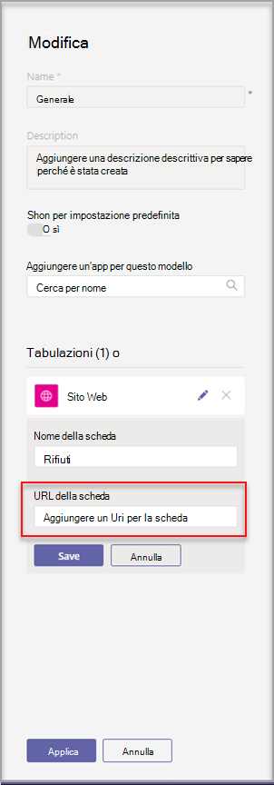
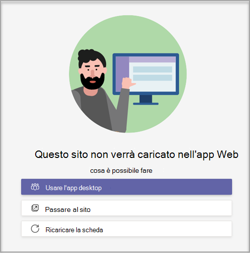

# Creare un modello di team personalizzato in Microsoft Teams

**I modelli personalizzati non sono ancora supportati per i clienti EDU.**

Un modello di team personalizzato è una struttura predefinita del team con un set di canali, schede e app. È possibile sviluppare rapidamente un modello che consente di creare rapidamente lo spazio di collaborazione giusto. Il modello di team personalizzato usa le impostazioni preferite.  

 

> [!VIDEO https://www.microsoft.com/en-us/videoplayer/embed/RE4P5rx]

Per iniziare:

1. Passare all'interfaccia di amministrazione di Teams.

2. Nel riquadro di spostamento sinistro **espandere** Teams  >  **Team**.

3. Selezionare **Aggiungi**.

    

4. Nella sezione **Modelli team** selezionare Crea un **nuovo modello.**

5. Nella sezione **Impostazioni modello** compilare i campi seguenti e quindi selezionare **Avanti:**
    - Nome modello
    - Descrizione breve e lunga del modello
    - Visibilità delle impostazioni locali  

    

6. Nella sezione **canali, schede e app** aggiungere tutti i canali e le app di cui il team ha bisogno.

    1. Nella sezione **Canali** selezionare **Aggiungi**.
    2. Nella finestra **di dialogo** Aggiungi assegnare un nome al canale.
    3. Aggiungere una descrizione.
    4. Decidere se il canale deve essere visualizzato per impostazione predefinita.
    5. Cercare un nome di app da aggiungere al canale.
    6. Al **termine, selezionare** Applica.

    

8. Al **termine, selezionare** Invia.

Il nuovo modello viene visualizzato **nell'elenco Modelli team.** Il modello può essere usato per creare un team in Teams.

> [!Note]
> La modifica di un modello personalizzato nella raccolta può richiedere fino a 24 ore.

## Personalizzazione delle app della scheda Sito Web

> [!Note]
> Questa funzionalità è in anteprima

È consigliabile specificare gli URL per le schede dei siti Web per i canali nei modelli di team personalizzati. Gli utenti finali che creano team con modelli avranno schede del sito Web preimpostate all'URL del sito specificato.

Per iniziare:

1. Creare un nuovo modello di team o modificare un modello di team esistente.

2. Nella sezione Canali aggiungere un nuovo canale o selezionare un canale esistente e selezionare **Modifica**.

3. Nella sezione **Aggiungere un'app per questo modello** aggiungere un'app Sito Web.

    

4. Selezionare l'icona di modifica e immettere l'URL desiderato.

    

5. Selezionare **Salva** per le modifiche dell'app a schede e quindi selezionare **Applica** per salvare le modifiche.

## Problemi noti

**Problema:** se è stato creato un team da un modello personalizzato che conteneva altre schede personalizzate, è possibile che al posto delle app per schede personalizzate venga visualizzata una scheda vuota. Le schede predefinite, ad esempio **Post,** **File** e **Wiki,** verranno visualizzate come previsto.

**Soluzione:** per risolvere il problema, rimuovere la scheda personalizzata e aggiungere una nuova scheda con la stessa app. Se non si hanno le autorizzazioni per rimuovere la scheda personalizzata e aggiungere una nuova scheda, contattare il proprietario del team per assistenza.

Stiamo lavorando a una correzione per i futuri team creati da modelli personalizzati.

**Problema:** quando si usa Teams nel browser, alcuni siti Web non supportano il rendering all'interno di una Teams pagina.

**Soluzione:** in caso di problemi con la visualizzazione del contenuto della scheda del sito Web, si verrà reindirizzati all'apertura della scheda in una pagina Web separata oppure all'apertura di Teams nell'app desktop per visualizzare l'app della scheda del sito Web.

## Argomenti correlati

- [Introduzione ai modelli di team nell'interfaccia di amministrazione](get-started-with-teams-templates-in-the-admin-console.md)
- [Creare un modello da un team esistente](create-template-from-existing-team.md)
- [Creare un modello di team da un modello di team esistente](create-template-from-existing-template.md)
