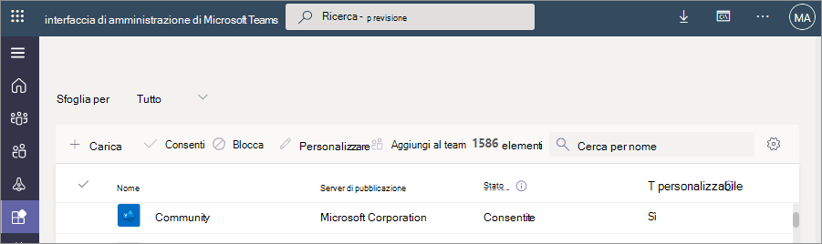

# Personalizzare l'aspetto delle app nell'archivio Teams dell'organizzazione

Microsoft Teams consente agli amministratori di personalizzare Teams'app per migliorare l'esperienza dello Store e rispettare il marchio dell'organizzazione. Uno sviluppatore di app può consentire la personalizzazione dell'app da parte di un amministratore Teams. È quindi possibile aggiornare le proprietà dell'app in base alle esigenze dell'organizzazione nella pagina Gestisci app nell Teams interfaccia di amministrazione. I dettagli che puoi personalizzare sono:

* Nome breve
* Descrizione breve
* Descrizione completa
* URL dell'informativa sulla privacy
* URL del sito Web
* URL delle condizioni per l'utilizzo
* Icona dell'app
* Colore contorno dell'icona
* Colore principale

Per informazioni sui vari campi dei metadati dell'app, vedi lo [schema del manifesto di Teams](/microsoftteams/platform/resources/schema/manifest-schema) nella documentazione per sviluppatori.

> [!NOTE]
> Non è possibile personalizzare le app in sideload in qualsiasi organizzazione. Non è possibile personalizzare alcuna app in cloud Government Community Cloud High (GCCH) o DoD (Department of Defense).

## Personalizzare i dettagli di un'app

Per personalizzare un'app, completa i passaggi seguenti:

1. Passare all'interfaccia di amministrazione di Teams.

1. Espandi **Teams app** e seleziona **[Gestisci app](https://admin.teams.microsoft.com/policies/manage-apps)**.

1. Controlla la colonna **Personalizzabile** dell'elenco delle app e ordina per app personalizzabili.

   

   Sono disponibili tre punti di ingresso per accedere alla funzionalità di personalizzazione:

   * Seleziona accanto all'app che vuoi personalizzare e quindi seleziona **Personalizza**.

     

   * Seleziona il nome dell'app e quindi seleziona l'icona di modifica in **Personalizzabile**.

     

   * Seleziona il nome dell'app, fai clic sul **menu di overflow** , passa il mouse su **Azioni** e seleziona Personalizza.

     

1. Espandere la sezione **Dettagli** e personalizzare uno o più dei campi seguenti. I campi assegnati come personalizzabili dallo sviluppatore sono visibili.

    * Nome breve
    * Descrizione breve
    * Descrizione completa
    * Sito Web
    * URL dell'informativa sulla privacy
    * URL delle condizioni per l'utilizzo

   

1. Espandere la sezione **Icona** .

1. Upload un'icona. Usa un'icona (192 x 192) pixel in formato PNG.

1. Scegliere un colore di contorno dell'icona. Usare un contorno trasparente (32x32) pixel in formato PNG.

1. Seleziona un colore principale dell'app corrispondente all'icona.

   

1. Dopo aver personalizzato l'app, seleziona **Applica**.

1. Selezionare **Pubblica** per pubblicare l'app personalizzata.

   L'app personalizzata è ora elencata nella pagina **Gestisci app** . Si avrà una sola versione dell'app, perché la personalizzazione delle funzionalità dell'app non crea una copia dell'app.

Ora il Teams gli utenti finali possono vedere l'app personalizzata nel proprio client.

   

Nota i dettagli seguenti sulla personalizzazione di un'app:

* Quando si personalizzano le app e qualsiasi descrizione correlata a un'app, assicurarsi di seguire le linee guida per la personalizzazione fornite dall'autore dell'app nella documentazione o nelle condizioni per l'utilizzo. L'utente è inoltre tenuto a rispettare i diritti di altri utenti relativamente a immagini di terze parti che potrebbero essere usate.

* Amministrazione dati di personalizzazione forniti vengono archiviati nell'area più vicina.

* L'utente è responsabile di garantire la validità dei collegamenti alle condizioni per l'utilizzo o all'informativa sulla privacy.

* Se l'autore dell'app non consente più di personalizzare un campo, nella pagina dei dettagli dell'app viene visualizzato un messaggio che informa l'amministratore dei campi che non possono più essere personalizzati. Tutte le modifiche apportate al campo verranno ripristinate ai valori originali.

* È consigliabile testare le modifiche apportate alla personalizzazione delle app in un tenant di test di Teams prima di apportare queste modifiche nell'ambiente di produzione.

* La propagazione delle modifiche al marchio a tutti gli utenti può richiedere fino a 24 ore.

* Per rendere personalizzabile un'app, gli sviluppatori possono fornire una nuova versione dell'app. Si carica la nuova versione e si rimuove la versione precedente dell'app. Se un'app è stata personalizzata e pubblicata, la nuova app personalizzata con la funzionalità di personalizzazione dell'app non sostituirà l'app corrente.

* Il [report utilizzo app](teams-analytics-and-reports/app-usage-report.md) visualizza il nome originale dell'app fornito dall'autore.

* Nella finestra di dialogo Consenso per l'autorizzazione di Microsoft Graph viene visualizzato il nome originale dell'app fornito dall'autore. Consente di identificare in modo accurato un'app mentre si forniscono le autorizzazioni per l'app.

## Rivedi i dettagli dell'app

È consigliabile visualizzare i dettagli dell'app per rivedere le informazioni.

1. Passare all'interfaccia di amministrazione di Teams.

1. Espandi **Teams app** e seleziona **[Gestisci app](https://admin.teams.microsoft.com/policies/manage-apps)**.

1. Seleziona il nome dell'app.

1. Visualizzare i dettagli dell'app, incluso il nome **dell'app originale Nome breve dell'autore**.

   

   Il **nome breve del campo publisher** è visibile solo se è stato modificato il nome breve dell'app.

## Reimpostare i dettagli dell'app ai valori predefiniti

Puoi reimpostare i dettagli dell'app sui valori originali forniti dallo sviluppatore dell'app. L'opzione è disponibile solo per l'app personalizzata.

1. Nell Teams interfaccia di amministrazione accedere **Teams app** > **[Gestisci app](https://admin.teams.microsoft.com/policies/manage-apps)**.

1. Seleziona il nome dell'app.

1. Scegliere **Ripristina come predefinito** dal menu **Azioni** .

   

## Articolo correlato

* [Gestione delle app](manage-apps.md)
* [Personalizzare l'app store dell'organizzazione](customize-your-app-store.md)
* [Rebrand le tue app](https://techcommunity.microsoft.com/t5/microsoft-teams-blog/rebrand-apps-to-your-own-organization-s-branding-with-app/ba-p/2376296)
