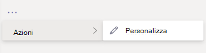

# Personalizzare l'aspetto delle app nello store di Teams dell'organizzazione

Microsoft Teams consente agli amministratori di personalizzare l'app di Teams per migliorare l'esperienza dello store e rispettare le linee guida di identità del marchio dell'organizzazione. Uno sviluppatore di app può consentire la personalizzazione della propria app da parte di un amministratore di Teams. È quindi possibile aggiornare le proprietà dell'app in base alle esigenze dell'organizzazione nella pagina Gestisci app nell'interfaccia di amministrazione di Teams. I dettagli che è possibile personalizzare sono:

* Nome breve
* Descrizione breve
* Descrizione completa
* URL dell'Informativa sulla privacy
* URL del sito Web
* URL delle Condizioni per l'utilizzo
* Icona dell'app
* Colore del contorno dell'icona
* Colore di evidenziazione

Per informazioni sui vari campi dei metadati dell'app, vedere lo [schema del manifesto di Teams](/microsoftteams/platform/resources/schema/manifest-schema) nella documentazione per sviluppatori.

> [!NOTE]
> Non è possibile personalizzare le app trasferite in locale in qualsiasi organizzazione. Non è possibile personalizzare alcuna app in Government Community Cloud High (GCCH) o DoD (Department of Defense).

## Personalizzare i dettagli di un'app

Per personalizzare un'app, completare i passaggi seguenti:

1. Passare all'interfaccia di amministrazione di Teams.

1. Espandere **App di Teams** e selezionare **[Gestisci app](https://admin.teams.microsoft.com/policies/manage-apps)**.

1. Controllare la colonna **Personalizzabile** dell'elenco delle app e ordinare le app in base alla possibilità di personalizzazione.

   

   Sono disponibili tre punti di ingresso per accedere alla funzionalità di personalizzazione:

   * Selezionare accanto all'app che è possibile personalizzare e quindi selezionare **Personalizza**.

     

   * Selezionare il nome dell'app e quindi selezionare l'icona di modifica in **Personalizzabile**.

     

   * Selezionare il nome dell'app, fare clic sul **menu di riversamento**, passare il mouse su **Azioni** e selezionare Personalizza.

     

1. Espandere la sezione **Dettagli** e personalizzare uno o più dei campi seguenti. I campi assegnati come personalizzabili dallo sviluppatore sono visibili.

    * Nome breve
    * Descrizione breve
    * Descrizione completa
    * Sito Web
    * URL dell'Informativa sulla privacy
    * URL delle Condizioni per l'utilizzo

   

1. Espandere la sezione **Icona**.

1. Caricare un'icona. Usare un'icona (192 x 192) pixel in formato PNG.

1. Scegliere un colore di contorno dell'icona. Usare un contorno trasparente (32x32) pixel in formato PNG.

1. Selezionare un colore di evidenziazione dell'app corrispondente all'icona.

   

1. Dopo aver personalizzato l'app, selezionare **Applica**.

1. Selezionare **Pubblica** per pubblicare l'app personalizzata.

   L'app personalizzata è ora elencata nella pagina **Gestisci app**. Si avrà una sola versione dell'app, poiché la personalizzazione delle funzionalità dell'app non crea una copia dell'app.

Ora gli utenti finali di Teams possono vedere l'app personalizzata nel proprio client.

   

Notare i dettagli seguenti sulla personalizzazione di un'app:

* Quando si personalizzano le app e qualsiasi descrizione correlata a un'app, assicurarsi di seguire le linee guida per la personalizzazione se fornite dall'autore dell'app nella documentazione o nelle condizioni d’uso. L'utente è inoltre tenuto a rispettare i diritti di altri utenti relativamente a immagini di terze parti che potrebbero essere usate.

* I dati di personalizzazione forniti dall'amministratore vengono archiviati nell'area geografica più vicina.

* L'utente è responsabile di assicurarsi che i collegamenti alle condizioni d'uso o all'informativa sulla privacy siano validi.

* Nel caso in cui l'autore dell'app non consenta più la personalizzazione di un campo, verrà visualizzato un messaggio nella pagina dei dettagli dell'app che informa l'amministratore riguardo ai campi che non possono più essere personalizzati. Tutte le modifiche apportate al campo verranno ripristinate ai valori originali.

* È consigliabile testare le modifiche alla personalizzazione delle app in un tenant di test di Teams prima di apportare queste modifiche nell'ambiente di produzione.

* Le modifiche per la ridefinizione di identità di marchio di un’app possono richiedere fino a 24 ore per propagarsi a tutti gli utenti.

* Per rendere personalizzabile un'app, gli sviluppatori possono fornire una nuova versione dell'app. Si carica la nuova versione e si rimuove la versione precedente dell'app. Se un'app è stata personalizzata e pubblicata, la nuova app personalizzata con la funzionalità di personalizzazione dell'app non sostituirà l'app corrente.

* Il [report sull’utilizzo dell’app](teams-analytics-and-reports/app-usage-report.md) visualizza il nome originale dell'app fornito dall'autore.

* La finestra di dialogo di consenso per l'autorizzazione di Microsoft Graph visualizza il nome originale dell'app fornito dall’autore. Consente di identificare accuratamente un'app, fornendo al contempo le autorizzazioni per l'app.

## Rivedere i dettagli dell'app

È consigliabile visualizzare i dettagli dell'app per rivedere le informazioni.

1. Accedere all'interfaccia di amministrazione di Teams.

1. Espandere **App di Teams** e selezionare **[Gestisci app](https://admin.teams.microsoft.com/policies/manage-apps)**.

1. Selezionare il nome dell'app.

1. Visualizzare i dettagli dell'app, incluso il nome originale dell'app **Nome breve dell’autore**.

   

   Il campo **Nome breve dell’autore** è visibile solo se è stato modificato il nome breve dell'app.

## Reimpostare i dettagli dell'app sui valori predefiniti

È possibile reimpostare i dettagli dell'app sui valori originali forniti dallo sviluppatore dell'app. L'opzione è disponibile solo per app che si sceglie di personalizzare.

1. Nell'interfaccia di amministrazione di Teams, accedere a **App di Teams** > **[Gestisci app](https://admin.teams.microsoft.com/policies/manage-apps)**.

1. Selezionare il nome dell'app.

1. Scegliere **Reimposta a predefinito** dal menu **Azioni**.

   

## Articolo correlato

* [Gestione delle app](manage-apps.md)
* [Personalizzare l'app store dell'organizzazione](customize-your-app-store.md)
* [Ridefinire l’identità di marchio delle app](https://techcommunity.microsoft.com/t5/microsoft-teams-blog/rebrand-apps-to-your-own-organization-s-branding-with-app/ba-p/2376296)
