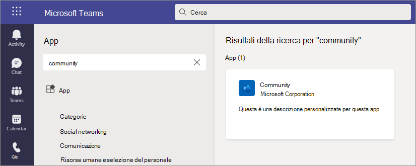

# Personalizzare le app in Microsoft Teams

 Microsoft Teams la personalizzazione dell'app per migliorare l'esperienza Teams utente. Alcuni sviluppatori di app consentono di personalizzare un'app dall'Teams amministratore. L'amministratore può personalizzare o ridenobrare le proprietà dell'app in base alle esigenze dell'organizzazione usando la Teams di amministrazione **di** Gestione app. I dettagli che è possibile personalizzare sono:

- Nome breve
- Breve descrizione
- Descrizione completa
- URL dell'informativa sulla privacy
- URL del sito Web
- URL delle condizioni per l'uso
- Icona a colori
- Icona Struttura
- Colore principale

Vedere lo [schema Teams manifesto](/microsoftteams/platform/resources/schema/manifest-schema) per informazioni dettagliate sui campi che è possibile personalizzare.

> [!NOTE]
> Al momento, la personalizzazione delle app non è supportata in Government Community Cloud High (GCCH) o Department of Defense (DoD).
> Attualmente, questa funzionalità non è disponibile per le app Microsoft Teams affiancate.

## Personalizzare i dettagli dell'app

Per iniziare a personalizzare un'app, completare la procedura seguente:

1. Passare all'interfaccia di amministrazione di Teams.
2. Espandere **Teams app e** selezionare Gestisci **app.**
3. Controllare la **colonna Personalizzabile** dell'elenco delle app e ordinare in base alle app personalizzabili.

   

   Sono disponibili tre punti di ingresso per accedere alla caratteristica di personalizzazione:

   - Selezionare accanto all'app da personalizzare e quindi **scegliere Personalizza**.

     

   - Selezionare il nome dell'app e quindi **Personalizzabile.**

     

   - Selezionare il nome dell'app e quindi selezionare **Personalizza** nell'elenco **a discesa** Azioni.

     

4. Espandere la **sezione** Dettagli e personalizzare i campi seguenti:

    - Nome breve
    - Breve descrizione
    - Descrizione completa
    - Sito Web
    - URL dell'informativa sulla privacy
    - URL delle condizioni per l'uso

   

> [!Note]
> Saranno visibili solo i campi assegnati dallo sviluppatore dell'app come personalizzabili.

5. Espandere la **sezione** Icona.

   a. Upload un'icona. Usare un'icona a colori (192x192) pixel in formato PNG.

   b. Scegliere un colore per il contorno di un'icona. Usare un solo pixel del contorno trasparente (32x32) in formato PNG.

   c. Selezionare un colore principale dell'app corrispondente all'icona.

    

6. Dopo aver personalizzato l'app, selezionare **Applica.**

7. Selezionare **Pubblica** per pubblicare l'app personalizzata.

   L'app personalizzata è ora elencata nella **pagina Gestisci app.** Sarà disponibile una sola versione dell'app, perché la personalizzazione delle caratteristiche dell'app non crea una copia dell'app.

Ora gli Teams gli utenti finali possono aprire il Teams client per visualizzare l'app personalizzata.

   

### Considerazioni speciali per la personalizzazione di un'app

La nota seguente include dettagli importanti sulla personalizzazione di un'app.

> [!Note]
> - Quando si personalizzano le app e qualsiasi descrizione relativa a un'app, assicurarsi di seguire le eventuali linee guida per la personalizzazione fornite dall'autore dell'app nella documentazione o nelle condizioni per l'uso. L'utente è anche responsabile del rispetto dei diritti di altri utenti per quanto riguarda le immagini di terze parti che potrebbero essere usate.
> - I dati di personalizzazione forniti dall'amministratore vengono archiviati nell'area geografica più vicina.
> - L'utente è responsabile della validità dei collegamenti alle condizioni d'uso o all'informativa sulla privacy.
> - Nel caso in cui l'autore dell'app non consenta più la personalizzazione di un campo, nella pagina dei dettagli dell'app viene visualizzato un messaggio che informa l'amministratore dei campi che non possono più essere personalizzati. Tutte le modifiche apportate al campo verranno ripristinate ai valori originali.
> - È consigliabile testare le modifiche alla personalizzazione delle app in un tenant di test Teams prima di apportare queste modifiche nell'ambiente di produzione.
> - Le modifiche alla personalizzazione potrebbero richiedere fino a 24 ore per consentire agli utenti di visualizzare le modifiche.

## Esaminare i dettagli dell'app

È consigliabile visualizzare i dettagli dell'app per esaminare le informazioni.

1. Passare all'interfaccia di amministrazione di Teams.

2. Espandere **App di Teams** e selezionare **Gestisci app**.

3. Selezionare il nome dell'app.

4. Visualizzare i dettagli dell'app, incluso il nome dell'app originale **Nome breve dell'autore.**

   

   Il **campo Nome breve dell'autore** è visibile solo se è stato modificato il nome breve dell'app.

## Reimpostare i dettagli dell'app sul valore predefinito

In qualsiasi momento, è possibile reimpostare i dettagli dell'app sulle impostazioni originali.

1. Passare all'interfaccia di amministrazione di Teams.

2. Espandere **Teams app e** selezionare Gestisci **app.**

3. Selezionare il nome dell'app.

4. Selezionare **Reimposta come predefinito nell'elenco** a **discesa** Azioni.

   

## Domande frequenti

**Quanto tempo è necessario per consentire agli utenti di visualizzare l'app personalizzata?**

Anche se l'amministratore può vedere immediatamente le modifiche nell'interfaccia di amministrazione di Teams, potrebbero essere necessarie fino a 24 ore prima che gli utenti finali vedano le modifiche.  

**Il provider di app può personalizzare l'app per i propri clienti?**

 No, l'amministratore di un tenant deve personalizzare l'app per il tenant usando l'Teams di amministrazione.

**L'app personalizzata verrà distribuita automaticamente per sostituire l'app personalizzata corrente in un tenant?**

No, gli amministratori del tenant doranno rimuovere manualmente qualsiasi app personalizzata e pubblicare la versione personalizzata dell'app. Se un'app è stata personalizzata e pubblicata come app personalizzata, la nuova app personalizzata con la caratteristica di personalizzazione dell'app non sostituirà l'app personalizzata corrente.  

**Il report sull'utilizzo delle app mostrerà anche i valori personalizzati, ad esempio il nome breve personalizzato?**

 No, il report sull'utilizzo dell'app mostrerà comunque il nome originale dell'app inviata dall'autore.

**Quali app è possibile personalizzare usando la funzionalità di personalizzazione dell'app?**

È possibile personalizzare solo le app che possono essere personalizzabili dall'autore dell'app. L'autore dell'app dovrà acconsentire esplicitamente per consentire ai propri clienti di personalizzare l'app.

**Le proprietà personalizzate verranno visualizzate nella schermata di consenso all'autorizzazione del grafico?**

No, la schermata di consenso all'autorizzazione mostrerà comunque il valore originale inviato dall'autore.

## Articolo correlato

- [Gestire le app](manage-apps.md)
- [Personalizzare l'app store](customize-your-app-store.md)
- [Ridenobrare le app](https://techcommunity.microsoft.com/t5/microsoft-teams-blog/rebrand-apps-to-your-own-organization-s-branding-with-app/ba-p/2376296)
