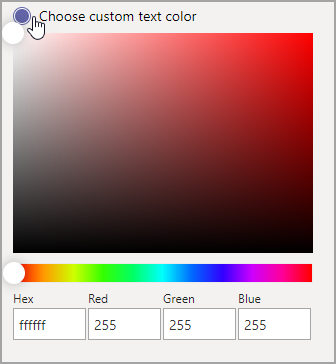
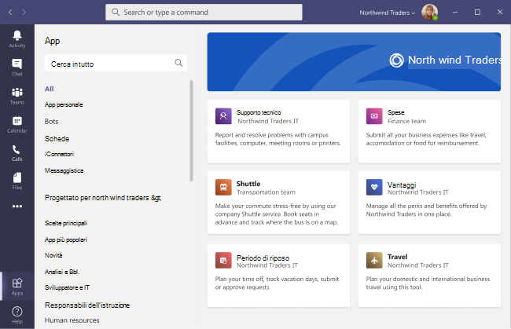

# App personalizzate archiviate in Microsoft Teams

Ora è possibile personalizzare l'app store dell'organizzazione in Teams con il marchio aziendale aggiungendo il logo, gli sfondi personalizzati e i colori del testo personalizzati per renderlo più invitante per gli utenti finali.

> [!Note]
> Le modifiche alla personalizzazione richiederanno 24 ore per l'applicazione.

È possibile accedere all'archivio di personalizzazione nell'interfaccia di amministrazione **selezionando Teams personalizzazione**  >  **dell'archivio.**

  

Questo articolo descrive le caratteristiche dell'archivio app personalizzate e come usarle.

## Personalizzare il logo dell'organizzazione

<!-- Bookmark used by Context Sensitive Help (CSH). Do not delete. -->

<!-- Do not remove the bookmark link above. -->

Qui è possibile caricare il logo dell'organizzazione. Il logo selezionato verrà visualizzato nel client Teams **app**  >  **create per la pagina tenant.**

Quando si seleziona **l'opzione Scegli un'immagine,** è possibile caricare il file desiderato. Il logo deve essere 240x60 oppure verrà ridimensionato in base a tale dimensione. Non deve essere superiore a 5 MB. I formati supportati sono:

- svg
- .png
- .jpg

Il logo viene visualizzato nell'angolo in alto a destra del catalogo app tenant nell'Teams store.

## Personalizzare il logo di piccole dimensioni

<!-- Bookmark used by Context Sensitive Help (CSH). Do not delete. -->

<!-- Do not remove the bookmark link above. -->

Il logo dell'organizzazione o il logo piccolo è un'immagine o un simbolo che rappresenta il marchio dell'organizzazione e non include il nome della società. Il lovemark aiuta i membri del team a identificare lo Store delle app. Il logo selezionato verrà visualizzato nel client Teams nella pagina App.

Quando si seleziona **l'opzione Scegli un'immagine,** è possibile caricare il file desiderato. Il logomark deve essere di 32x32 pixel oppure verrà ridimensionato in base a tale dimensione. Non deve essere superiore a 5 MB. I formati supportati sono:

- svg
- .png
- .jpg

Il piccolo logo viene visualizzato accanto al titolo della sezione **Built for tenant** nella pagina di destinazione Teams store.

## Personalizzare il colore di sfondo

<!-- Bookmark used by Context Sensitive Help (CSH). Do not delete. -->

<!-- Do not remove the bookmark link above. -->

Assicurarsi che lo sfondo sia abbastanza in contrasto con il testo in modo che gli utenti possano leggere il testo in modo chiaro. Lo sfondo verrà visualizzato nel client Teams **app**  >  **create per l'intestazione del tenant.**

Le opzioni disponibili sono:

- Usare il Teams di sfondo predefinito del client
- Scegliere un'immagine. Quando si seleziona l'immagine di sfondo, è possibile caricare il file desiderato. Lo sfondo deve essere di 1212x100 pixel oppure verrà ridimensionato in base a tale dimensione. Non deve essere superiore a 5 MB. I formati supportati sono:
  - svg
  - .png
  - .jpg
- Scegliere uno sfondo personalizzato. Quando si seleziona **Scegli un colore personalizzato,** si apre un selettore colori. Selezionare il colore desiderato regolando la scala del selettore colori.

L'immagine o il colore di sfondo viene usato come sfondo per il banner superiore nel Teams app tenant.

## Personalizzare il colore del testo del proprio nome

<!-- Bookmark used by Context Sensitive Help (CSH). Do not delete. -->

<!-- Do not remove the bookmark link above. -->

Assicurarsi che il colore del testo sia abbastanza in contrasto con lo sfondo, in modo che gli utenti possano leggere chiaramente il nome dell'organizzazione. Il testo verrà visualizzato nel client Teams **app**  >  **create per l'intestazione del tenant.**

Quando si seleziona **Scegli un colore personalizzato,** si apre un selettore colori. Selezionare il colore desiderato regolando la scala del selettore colori.

 

## Completare la personalizzazione dell'app store del team

Dopo aver completato la personalizzazione dell'app store, assicurarsi di selezionare **Salva** per salvare le modifiche.
Per visualizzare in anteprima le modifiche, selezionare **Anteprima app store** per visualizzare una rappresentazione dell'app store personalizzato.

> [!Note]
> La rappresentazione può variare rispetto alla versione finale dell'archivio app personalizzato, perché alcuni colori predefiniti si basano sulla versione di Teams client degli utenti.

## Articolo correlato

[Gestire le app](manage-apps.md)
