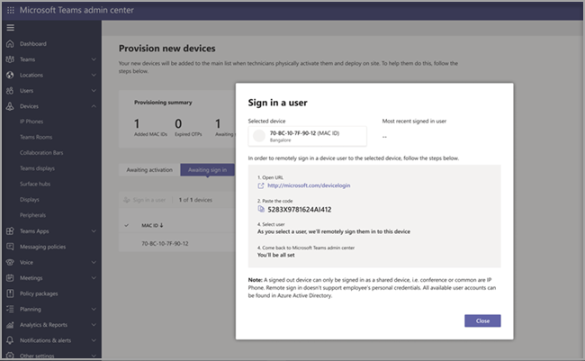

# Provisioning remoto e accesso per Teams dispositivi Android

Gli amministratori IT possono eseguire il provisioning in remoto e accedere a un dispositivo Teams Android. Per eseguire il provisioning di un dispositivo in remoto, l'amministratore deve caricare gli ID MAC dei dispositivi di cui viene eseguito il provisioning e creare un codice di verifica. L'intero processo può essere completato in remoto dall'Teams di amministrazione.

## Esaminare i dispositivi supportati

L'elenco seguente mostra i requisiti del firmware del dispositivo Android.

|Categoria dispositivo|Modello di dispositivo|Versione firmware|
|-|-|-|
|Teams telefoni|Yealink T55/T56/T58|58.15.0.124|
|Teams telefoni|Yealink VP59|91.15.0.58|
|Teams telefoni|Yealink CP960|73.15.0.117|
|Teams telefoni|Yealink MP56/MP54/MP58|122.15.0.36|
|Teams telefoni|Crestron UC-2|1.0.3.52|
|Teams telefoni|  Poly Trio C60|  7.0.2.1071|
|Teams telefoni|  CCX400/CCX500/CCX600    |7.0.2.1072|
|Teams telefoni|  Codici audio C448HD/C450HD/C470HD|   1.10.120|
|Teams di lavoro|  Crestron 770/1070|  1.004.0115|
|Teams Rooms su Android|Logitech Rally Bar Mini|1.2.982|
|Teams Rooms su Android|Logitech Rally Bar|1.2.982|
|Teams Rooms su Android|AudioCodes RXV80|1.13.361|
|Teams Rooms su Android|EPOS EXPAND Vision 3T|1.2.2.21182.10|
|Teams Rooms su Android|Yealink MeetingBar A30|133.15.0.60|
|Teams Rooms su Android|Yealink MeetingBar A20|133.15.0.60|
|Teams Rooms su Android|Console touch Yealink CTP18|137.15.0.37|
|Teams Rooms su Android|Poly Studio X30|3.5.0.344025|
|Teams Rooms su Android|Poly Studio X50|3.5.0.344025|
|Teams Rooms su Android|Console touch Poly TC8 |3.5.0.210489|
|Teams Rooms su Android|Yealink VC210|118.15.0.54|

## Aggiungere un indirizzo MAC del dispositivo

Completare la procedura seguente per eseguire il provisioning di un nuovo dispositivo.

1. Passare all'interfaccia di amministrazione di Teams.
2. Espandere **Teams dispositivi**.
3. Selezionare **Provisioning nuovo dispositivo** nella **scheda** Azioni.

Nella finestra **Provisioning nuovi dispositivi** è possibile aggiungere manualmente l'indirizzo MAC o caricare un file.

### Aggiungere manualmente un indirizzo MAC del dispositivo

1. Nella scheda **In attesa di attivazione** selezionare Aggiungi ID **MAC.**

   

1. Immettere l'ID MAC.
1. Immettere una posizione che consente ai tecnici di identificare la posizione in cui installare i dispositivi.
1. Al **termine, selezionare** Applica.

### Upload file per aggiungere un indirizzo MAC del dispositivo

1. Nella scheda **In attesa di attivazione** selezionare Upload ID **MAC**.
2. Scaricare il modello di file.
3. Immettere l'ID MAC e il percorso e quindi salvare il file.
4. **Selezionare file** e quindi **selezionare** Upload .

## Generare un codice di verifica

È necessario un codice di verifica per i dispositivi. Il codice di verifica viene generato in blocco o a livello di dispositivo ed è valido per 24 ore.

1. Nella scheda **In attesa di attivazione** selezionare un ID MAC esistente.
   Viene creata una password per l'indirizzo MAC e visualizzata nella **colonna Codice di** verifica.

2. Fornire l'elenco di ID MAC e codici di verifica ai tecnici del campo. È possibile esportare i dettagli direttamente in un file e condividerlo con il tecnico che sta eseguendo il lavoro di installazione effettivo.

## Eseguire il provisioning del dispositivo

Quando il dispositivo è acceso e connesso alla rete, il tecnico esegue il provisioning del dispositivo. Questi passaggi vengono completati nel Teams dispositivo.

1. Il tecnico seleziona **Provisioning dispositivo** **nell'Impostazioni**.  

   
  
2. Il tecnico immette il codice di verifica specifico del dispositivo nel campo di input fornito.

   

   Dopo il provisioning del dispositivo, il nome del tenant viene visualizzato nella pagina di accesso.

   

## Primo accesso remoto

Il dispositivo di cui è stato eseguito il provisioning viene visualizzato nella **scheda In** attesa di accesso. Avviare il processo di accesso remoto selezionando il singolo dispositivo.

1. Selezionare un dispositivo nella scheda In **attesa di** accesso.

   

2. Seguire le istruzioni in **Accedi a un utente** e quindi selezionare **Chiudi.**

   

## Articoli correlati

- [Gestire i dispositivi in Teams](device-management.md)
- [Accesso remoto e disconnessione](remote-sign-in-and-sign-out.md)
- [Aggiornare Teams dispositivi in remoto](remote-update.md)
