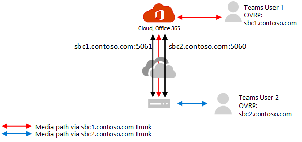

# Configurare il bypass multimediale con routing diretto

Prima di configurare il bypass multimediale con il routing diretto, assicurati di aver letto [piano per il bypass multimediale con routing diretto](direct-routing-plan-media-bypass.md).

Per attivare il bypass multimediale, è necessario che siano soddisfatte le condizioni seguenti:

1.  Verificare che il fornitore di Session Border Controller (SBC) di Choice supporti il bypass multimediale e fornisca istruzioni su come configurare il bypass in SBC. Vedere la pagina certificazione per informazioni su SBCs, che supportano il bypass multimediale e per le istruzioni.

2.  È necessario attivare il bypass multimediale nel trunk usando il comando seguente: **set-CSOnlinePSTNGateway-Identity <sbc_FQDN>-MediaBypass $true**.

3.  Verificare che le porte necessarie vengano aperte. 

## Eseguire la migrazione da trunk non bypassati a trunk abilitati per bypass

Puoi cambiare tutti gli utenti contemporaneamente oppure puoi implementare un approccio graduale (consigliato).

- **Cambiare tutti gli utenti contemporaneamente.** Se tutte le condizioni sono soddisfatte, è possibile attivare la modalità bypass. Tutti gli utenti della produzione verranno comunque cambiati in contemporanea. Poiché potrebbero verificarsi alcuni problemi inizialmente quando si configurano trunk e porte, l'esperienza utente di produzione potrebbe essere interessata. 

- **Approccio graduale. (Scelta consigliata)**.  Creare un nuovo trunk per lo stesso SBC (con una porta diversa), testarlo e modificare i criteri di routing vocale online per gli utenti in modo che puntino al nuovo trunk. 

  Questo è l'approccio consigliato perché consente una transizione più fluida e un'esperienza utente senza interruzioni. Questo approccio richiede la configurazione di SBC, un nuovo nome FQDN e la configurazione del firewall. Nota sarà necessario verificare che il certificato supporti entrambi i trunk. In SAN è necessario avere due nomi (**sbc1.contoso.com** e **sbc2.contoso.com**) o avere un certificato con carattere jolly.

Per istruzioni su come configurare i trunk ed eseguire la migrazione, vedere la documentazione del fornitore di SBC:

- [Documentazione di distribuzione di AudioCodes](https://www.audiocodes.com/solutions-products/products/products-for-microsoft-365/direct-routing-for-microsoft-teams)
- [Documentazione di distribuzione Oracle](https://www.oracle.com/industries/communications/enterprise-session-border-controller/microsoft.html)
- [Documentazione sulla distribuzione delle comunicazioni della barra multifunzione](https://ribboncommunications.com/solutions/enterprise-solutions/microsoft-solutions/direct-routing-microsoft-teams-calling)
- [Documentazione sulla distribuzione di TE-Systems (anynode)](https://www.anynode.de/anynode-and-microsoft-teams/)

Per un elenco di Session Border Controller (SBCs) Certified for Direct routing, vedere l' [elenco dei controller di sessione Broder certificati per il routing diretto](direct-routing-border-controllers.md).

## Vedere anche

[Pianificare il bypass multimediale con routing diretto](direct-routing-plan-media-bypass.md)

