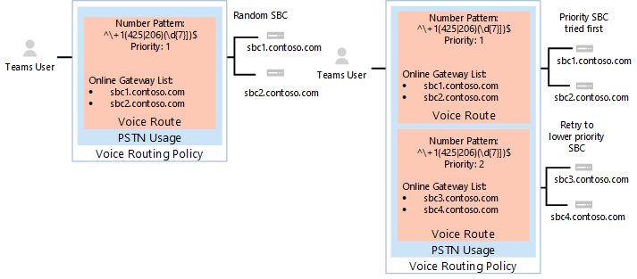
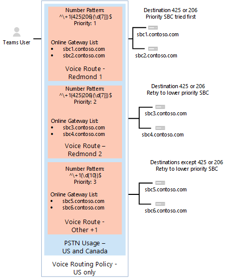

# <a name="configure-direct-routing"></a><span data-ttu-id="0cf76-103">Configurare Instradamento diretto</span><span class="sxs-lookup"><span data-stu-id="0cf76-103">Configure Direct Routing</span></span>

> [!Tip]
> <span data-ttu-id="0cf76-104">Vedere la sessione seguente per informazioni sui vantaggi del routing diretto, su come pianificare la procedura e su come distribuirla: [routing diretto in Microsoft teams](https://aka.ms/teams-direct-routing)</span><span class="sxs-lookup"><span data-stu-id="0cf76-104">Watch the following session to learn about the benefits of Direct Routing, how to plan for it, and how to deploy it: [Direct Routing in Microsoft Teams](https://aka.ms/teams-direct-routing)</span></span>

<span data-ttu-id="0cf76-105">Se non è già stato fatto, leggere [pianificare il routing diretto](direct-routing-plan.md) per i prerequisiti e rivedere altri passaggi che è necessario eseguire prima di configurare la rete del sistema telefonico Microsoft.</span><span class="sxs-lookup"><span data-stu-id="0cf76-105">If you have not already done so, read [Plan Direct Routing](direct-routing-plan.md) for prerequisites and to review other steps you’ll need to take before you configure your Microsoft Phone System network.</span></span> 

<span data-ttu-id="0cf76-106">Questo articolo descrive come configurare il routing diretto di Microsoft Phone System.</span><span class="sxs-lookup"><span data-stu-id="0cf76-106">This article describes how to configure Microsoft Phone System Direct Routing.</span></span> <span data-ttu-id="0cf76-107">Descrive come associare un SBC (Session Border Controller) supportato a routing diretto e come configurare gli utenti di Microsoft teams per usare il routing diretto per la connessione alla rete PSTN (Public Switched Telephone Network).</span><span class="sxs-lookup"><span data-stu-id="0cf76-107">It details how to pair a supported Session Border Controller (SBC) to Direct Routing and how to configure Microsoft Teams users to use Direct Routing to connect to the Public Switched Telephone Network (PSTN).</span></span> <span data-ttu-id="0cf76-108">Per completare la procedura descritta in questo articolo, gli amministratori hanno bisogno di una certa familiarità con i cmdlet di PowerShell.</span><span class="sxs-lookup"><span data-stu-id="0cf76-108">To complete the steps explained in this article, administrators need some familiarity with PowerShell cmdlets.</span></span> <span data-ttu-id="0cf76-109">Per altre informazioni sull'uso di PowerShell, vedere [configurare il computer per Windows PowerShell](https://docs.microsoft.com/SkypeForBusiness/set-up-your-computer-for-windows-powershell/set-up-your-computer-for-windows-powershell).</span><span class="sxs-lookup"><span data-stu-id="0cf76-109">For more information about using PowerShell, see [Set up your computer for Windows PowerShell](https://docs.microsoft.com/SkypeForBusiness/set-up-your-computer-for-windows-powershell/set-up-your-computer-for-windows-powershell).</span></span> 

<span data-ttu-id="0cf76-110">È consigliabile verificare che SBC sia già stato configurato come consigliato dal fornitore SBC:</span><span class="sxs-lookup"><span data-stu-id="0cf76-110">We recommend that you confirm that your SBC has already been configured as recommended by your SBC vendor:</span></span> 

- [<span data-ttu-id="0cf76-111">Documentazione di distribuzione di AudioCodes</span><span class="sxs-lookup"><span data-stu-id="0cf76-111">AudioCodes deployment documentation</span></span>](https://www.audiocodes.com/solutions-products/products/products-for-microsoft-365/direct-routing-for-microsoft-teams)
- [<span data-ttu-id="0cf76-112">Documentazione di distribuzione Oracle</span><span class="sxs-lookup"><span data-stu-id="0cf76-112">Oracle deployment documentation</span></span>](https://www.oracle.com/industries/communications/enterprise-session-border-controller/microsoft.html)
- [<span data-ttu-id="0cf76-113">Documentazione sulla distribuzione delle comunicazioni della barra multifunzione</span><span class="sxs-lookup"><span data-stu-id="0cf76-113">Ribbon Communications deployment documentation</span></span>](https://ribboncommunications.com/solutions/enterprise-solutions/microsoft-solutions/direct-routing-microsoft-teams-calling)
- [<span data-ttu-id="0cf76-114">Documentazione sulla distribuzione di TE-Systems (anynode)</span><span class="sxs-lookup"><span data-stu-id="0cf76-114">TE-Systems (anynode) deployment documentation</span></span>](https://www.anynode.de/anynode-and-microsoft-teams/)

<span data-ttu-id="0cf76-115">È possibile configurare il sistema telefonico Microsoft e consentire agli utenti di usare il routing diretto, quindi configurare Microsoft teams come client chiamante preferito completando le procedure seguenti:</span><span class="sxs-lookup"><span data-stu-id="0cf76-115">You can configure your Microsoft Phone System and enable users to use Direct Routing, then set up Microsoft Teams as the preferred calling client by completing the following procedures:</span></span> 

- [<span data-ttu-id="0cf76-116">Associare il SBC a un sistema telefonico Microsoft e convalidare l'associazione</span><span class="sxs-lookup"><span data-stu-id="0cf76-116">Pair the SBC with a Microsoft Phone System and validate the pairing</span></span>](#pair-the-sbc-to-the-direct-routing-service-of-phone-system)
- [<span data-ttu-id="0cf76-117">Abilitare gli utenti per il servizio di routing diretto</span><span class="sxs-lookup"><span data-stu-id="0cf76-117">Enable users for Direct Routing Service</span></span>](#enable-users-for-direct-routing-service)
- <span data-ttu-id="0cf76-118">Verificare che Microsoft teams sia il client chiamante preferito per gli utenti</span><span class="sxs-lookup"><span data-stu-id="0cf76-118">Ensure that Microsoft Teams is the preferred calling client for the users</span></span>

## <a name="pair-the-sbc-to-the-direct-routing-service-of-phone-system"></a><span data-ttu-id="0cf76-119">Associare il SBC al servizio di routing diretto del sistema telefonico</span><span class="sxs-lookup"><span data-stu-id="0cf76-119">Pair the SBC to the Direct Routing Service of Phone System</span></span> 

<span data-ttu-id="0cf76-120">Di seguito sono riportati i tre passaggi di alto livello per consentire di connettersi o associare l'SBC all'interfaccia di routing diretto:</span><span class="sxs-lookup"><span data-stu-id="0cf76-120">The following are the three high-level steps to let you connect, or pair, the SBC to the Direct Routing interface:</span></span> 

- <span data-ttu-id="0cf76-121">Connettersi all'interfaccia di amministrazione di **Skype for business online** con PowerShell</span><span class="sxs-lookup"><span data-stu-id="0cf76-121">Connect to **Skype for Business Online** admin center using PowerShell</span></span> 
- <span data-ttu-id="0cf76-122">Associare il SBC</span><span class="sxs-lookup"><span data-stu-id="0cf76-122">Pair the SBC</span></span> 
- <span data-ttu-id="0cf76-123">Convalidare l'associazione</span><span class="sxs-lookup"><span data-stu-id="0cf76-123">Validate the pairing</span></span> 

### <a name="connect-to-skype-for-business-online-by-using-powershell"></a><span data-ttu-id="0cf76-124">Connettersi a Skype for business online tramite PowerShell</span><span class="sxs-lookup"><span data-stu-id="0cf76-124">Connect to Skype for Business Online by using PowerShell</span></span> 

<span data-ttu-id="0cf76-125">Puoi usare una sessione di PowerShell connessa al tenant per associare il SBC all'interfaccia di routing diretta.</span><span class="sxs-lookup"><span data-stu-id="0cf76-125">You can use a PowerShell session connected to the tenant to pair the SBC to the Direct Routing interface.</span></span> <span data-ttu-id="0cf76-126">Per aprire una sessione di PowerShell, seguire i passaggi descritti in [configurare il computer per Windows PowerShell](https://docs.microsoft.com/SkypeForBusiness/set-up-your-computer-for-windows-powershell/set-up-your-computer-for-windows-powershell).</span><span class="sxs-lookup"><span data-stu-id="0cf76-126">To open a PowerShell session, please follow the steps outlined in [Set up your computer for Windows PowerShell](https://docs.microsoft.com/SkypeForBusiness/set-up-your-computer-for-windows-powershell/set-up-your-computer-for-windows-powershell).</span></span> 
 
<span data-ttu-id="0cf76-127">Dopo aver stabilito una sessione remota di PowerShell, verificare che sia possibile visualizzare i comandi per la gestione di SBC.</span><span class="sxs-lookup"><span data-stu-id="0cf76-127">After you establish a remote PowerShell session, please validate that you can see the commands to manage the SBC.</span></span> <span data-ttu-id="0cf76-128">Per convalidare i comandi, digitare o copiare/incollare il comando seguente nella sessione di PowerShell e premere INVIO:</span><span class="sxs-lookup"><span data-stu-id="0cf76-128">To validate the commands, type or copy/paste in the following in the PowerShell session and press Enter:</span></span> 

```PowerShell
Get-Command *onlinePSTNGateway*
```

<span data-ttu-id="0cf76-129">Il comando restituirà le quattro funzioni visualizzate in questa sezione che consente di gestire il SBC.</span><span class="sxs-lookup"><span data-stu-id="0cf76-129">Your command will return the four functions shown here that will let you manage the SBC.</span></span> 

<pre>
CommandType    Name                       Version    Source 
-----------    ----                       -------    ------ 
Function       Get-CsOnlinePSTNGateway    1.0        tmp_v5fiu1no.wxt 
Function       New-CsOnlinePSTNGateway    1.0        tmp_v5fiu1no.wxt 
Function       Remove-CsOnlinePSTNGateway 1.0        tmp_v5fiu1no.wxt 
Function       Set-CsOnlinePSTNGateway    1.0        tmp_v5fiu1no.wxt
</pre>   


### <a name="pair-the-sbc-to-the-tenant"></a><span data-ttu-id="0cf76-130">Associare il SBC al tenant</span><span class="sxs-lookup"><span data-stu-id="0cf76-130">Pair the SBC to the tenant</span></span> 

<span data-ttu-id="0cf76-131">Per associare il SBC al tenant, nella sessione di PowerShell digitare il testo seguente e premere INVIO:</span><span class="sxs-lookup"><span data-stu-id="0cf76-131">To pair the SBC to the tenant, in the PowerShell session type the following and press Enter:</span></span> 

```PowerShell
New-CsOnlinePSTNGateway -Fqdn <SBC FQDN> -SipSignallingPort <SBC SIP Port> -MaxConcurrentSessions <Max Concurrent Sessions the SBC can handle> -Enabled $true 
```
  > [!NOTE]
  > 1. <span data-ttu-id="0cf76-132">Ti consigliamo vivamente di impostare un limite massimo per le chiamate in SBC, usando le informazioni che puoi trovare nella documentazione SBC.</span><span class="sxs-lookup"><span data-stu-id="0cf76-132">We highly recommend setting a maximum call limit in the SBC, using information that can be found in the SBC documentation.</span></span> <span data-ttu-id="0cf76-133">Il limite attiverà una notifica se SBC è a livello di capacità.</span><span class="sxs-lookup"><span data-stu-id="0cf76-133">The limit will trigger a notification if the SBC is at the capacity level.</span></span>
  > 2. <span data-ttu-id="0cf76-134">Puoi associare l'SBC solo se la parte del dominio del relativo nome FQDN corrisponde a uno dei domini registrati nel tenant, eccetto \*. onmicrosoft.com.</span><span class="sxs-lookup"><span data-stu-id="0cf76-134">You can only pair the SBC if the domain portion of its FQDN matches one of the domains registered in your tenant, except \*.onmicrosoft.com.</span></span> <span data-ttu-id="0cf76-135">L' \*uso dei nomi di dominio con estensione onmicrosoft.com non è supportato per il nome FQDN di SBC.</span><span class="sxs-lookup"><span data-stu-id="0cf76-135">Using \*.onmicrosoft.com domain names is not supported for the SBC FQDN name.</span></span> <span data-ttu-id="0cf76-136">Se ad esempio sono presenti due nomi di dominio:</span><span class="sxs-lookup"><span data-stu-id="0cf76-136">For example, if you have two domain names:</span></span><br/><br/>
  > <span data-ttu-id="0cf76-137">**Contoso**. com</span><span class="sxs-lookup"><span data-stu-id="0cf76-137">**contoso**.com</span></span><br/><span data-ttu-id="0cf76-138">**Contoso**. onmicrosoft.com</span><span class="sxs-lookup"><span data-stu-id="0cf76-138">**contoso**.onmicrosoft.com</span></span><br/><br/>
  > <span data-ttu-id="0cf76-139">Per il nome SBC, è possibile usare il nome sbc.contoso.com.</span><span class="sxs-lookup"><span data-stu-id="0cf76-139">For the SBC name, you can use the name sbc.contoso.com.</span></span> <span data-ttu-id="0cf76-140">Se si tenta di associare l'SBC con un nome SBC. contoso. ABC, il sistema non lo consente, poiché il dominio non è di proprietà del tenant.</span><span class="sxs-lookup"><span data-stu-id="0cf76-140">If you try to pair the SBC with a name sbc.contoso.abc, the system will not let you, as the domain is not owned by this tenant.</span></span><br/>
  > <span data-ttu-id="0cf76-141">Oltre al dominio registrato nel tenant, è importante che ci sia un utente con tale dominio e una licenza E3 o E5 assegnata.</span><span class="sxs-lookup"><span data-stu-id="0cf76-141">In addition to the domain registered in your tenant, it is important that there is a user with that domain and an assigned E3 or E5 license.</span></span> <span data-ttu-id="0cf76-142">In caso contrario, verrà visualizzato il seguente messaggio di errore:</span><span class="sxs-lookup"><span data-stu-id="0cf76-142">If not, you will receive the following error:</span></span><br/>
  <span data-ttu-id="0cf76-143">`Can not use the “sbc.contoso.com” domain as it was not configured for this tenant`.</span><span class="sxs-lookup"><span data-stu-id="0cf76-143"></span></span>

```PowerShell
New-CsOnlinePSTNGateway -Identity sbc.contoso.com -Enabled $true -SipSignallingPort 5067 -MaxConcurrentSessions 100 
```
<span data-ttu-id="0cf76-144">Restituisce</span><span class="sxs-lookup"><span data-stu-id="0cf76-144">Returns:</span></span>
<pre>
Identity              : sbc.contoso.com 
Fqdn                  : sbc.contoso.com 
SipSignallingPort     : 5067 
FailoverTimeSeconds   : 10 
ForwardCallHistory    : False 
ForwardPai            : False 
SendSipOptions        : True 
MaxConcurrentSessions : 100 
Enabled               : True   
</pre>
<span data-ttu-id="0cf76-145">Sono disponibili altre opzioni che possono essere impostate durante il processo di associazione.</span><span class="sxs-lookup"><span data-stu-id="0cf76-145">There are additional options that can be set during the pairing process.</span></span> <span data-ttu-id="0cf76-146">Nell'esempio precedente vengono tuttavia visualizzati solo i parametri minimi obbligatori.</span><span class="sxs-lookup"><span data-stu-id="0cf76-146">In the previous example, however, only the minimum required parameters are shown.</span></span> 
 
<span data-ttu-id="0cf76-147">Nella tabella seguente sono elencati i parametri aggiuntivi che è possibile usare per ```New-CsOnlinePstnGateway```l'impostazione dei parametri.</span><span class="sxs-lookup"><span data-stu-id="0cf76-147">The following table lists the additional parameters that you can use in setting parameters for ```New-CsOnlinePstnGateway```.</span></span>

|<span data-ttu-id="0cf76-148">Obbligatorio?</span><span class="sxs-lookup"><span data-stu-id="0cf76-148">Required?</span></span>|<span data-ttu-id="0cf76-149">Nome</span><span class="sxs-lookup"><span data-stu-id="0cf76-149">Name</span></span>|<span data-ttu-id="0cf76-150">Descrizione</span><span class="sxs-lookup"><span data-stu-id="0cf76-150">Description</span></span>|<span data-ttu-id="0cf76-151">Predefinita</span><span class="sxs-lookup"><span data-stu-id="0cf76-151">Default</span></span>|<span data-ttu-id="0cf76-152">Valori possibili</span><span class="sxs-lookup"><span data-stu-id="0cf76-152">Possible values</span></span>|<span data-ttu-id="0cf76-153">Tipo e restrizioni</span><span class="sxs-lookup"><span data-stu-id="0cf76-153">Type and restrictions</span></span>|
|:-----|:-----|:-----|:-----|:-----|:-----|
|<span data-ttu-id="0cf76-154">Sì</span><span class="sxs-lookup"><span data-stu-id="0cf76-154">Yes</span></span>|<span data-ttu-id="0cf76-155">FQDN</span><span class="sxs-lookup"><span data-stu-id="0cf76-155">FQDN</span></span>|<span data-ttu-id="0cf76-156">Nome FQDN di SBC</span><span class="sxs-lookup"><span data-stu-id="0cf76-156">The FQDN name of the SBC</span></span> |<span data-ttu-id="0cf76-157">Nessuno</span><span class="sxs-lookup"><span data-stu-id="0cf76-157">None</span></span>|<span data-ttu-id="0cf76-158">Nome NoneFQDN, limite di 63 caratteri</span><span class="sxs-lookup"><span data-stu-id="0cf76-158">NoneFQDN name, limit 63 characters</span></span>|<span data-ttu-id="0cf76-159">Stringa, elenco dei caratteri consentiti e non consentiti nelle [convenzioni di denominazione in Active Directory per computer, domini, siti e unità organizzative](https://support.microsoft.com/help/909264)</span><span class="sxs-lookup"><span data-stu-id="0cf76-159">String, list of allowed and disallowed characters on [Naming conventions in Active Directory for computers, domains, sites, and OUs](https://support.microsoft.com/help/909264)</span></span>|
|<span data-ttu-id="0cf76-160">No</span><span class="sxs-lookup"><span data-stu-id="0cf76-160">No</span></span>|<span data-ttu-id="0cf76-161">MediaBypass</span><span class="sxs-lookup"><span data-stu-id="0cf76-161">MediaBypass</span></span> |<span data-ttu-id="0cf76-162">Il parametro indicato da SBC supporta il bypass multimediale e l'amministratore vuole usarlo.</span><span class="sxs-lookup"><span data-stu-id="0cf76-162">Parameter indicated of the SBC supports Media Bypass and the administrator wants to use it.</span></span>|<span data-ttu-id="0cf76-163">Nessuno</span><span class="sxs-lookup"><span data-stu-id="0cf76-163">None</span></span>|<span data-ttu-id="0cf76-164">True</span><span class="sxs-lookup"><span data-stu-id="0cf76-164">True</span></span><br/><span data-ttu-id="0cf76-165">False</span><span class="sxs-lookup"><span data-stu-id="0cf76-165">False</span></span>|<span data-ttu-id="0cf76-166">Boolean</span><span class="sxs-lookup"><span data-stu-id="0cf76-166">Boolean</span></span>|
|<span data-ttu-id="0cf76-167">Sì</span><span class="sxs-lookup"><span data-stu-id="0cf76-167">Yes</span></span>|<span data-ttu-id="0cf76-168">SipSignallingPort</span><span class="sxs-lookup"><span data-stu-id="0cf76-168">SipSignallingPort</span></span> |<span data-ttu-id="0cf76-169">Porta di ascolto usata per comunicare con i servizi di routing diretto usando il protocollo Transport Layer Security (TLS).</span><span class="sxs-lookup"><span data-stu-id="0cf76-169">Listening port used for communicating with Direct Routing services by using the Transport Layer Security (TLS) protocol.</span></span>|<span data-ttu-id="0cf76-170">Nessuno</span><span class="sxs-lookup"><span data-stu-id="0cf76-170">None</span></span>|<span data-ttu-id="0cf76-171">Qualsiasi porta</span><span class="sxs-lookup"><span data-stu-id="0cf76-171">Any port</span></span>|<span data-ttu-id="0cf76-172">da 0 a 65535</span><span class="sxs-lookup"><span data-stu-id="0cf76-172">0 to 65535</span></span> |
|<span data-ttu-id="0cf76-173">No</span><span class="sxs-lookup"><span data-stu-id="0cf76-173">No</span></span>|<span data-ttu-id="0cf76-174">FailoverTimeSeconds</span><span class="sxs-lookup"><span data-stu-id="0cf76-174">FailoverTimeSeconds</span></span> |<span data-ttu-id="0cf76-175">Se impostato su 10 (valore predefinito), le chiamate in uscita non risposte dal gateway entro 10 secondi vengono instradate al successivo trunk disponibile. Se non sono presenti trunk aggiuntivi, la chiamata viene automaticamente eliminata.</span><span class="sxs-lookup"><span data-stu-id="0cf76-175">When set to 10 (default value), outbound calls that are not answered by the gateway within 10 seconds are routed to the next available trunk; if there are no additional trunks, then the call is automatically dropped.</span></span> <span data-ttu-id="0cf76-176">In un'organizzazione con reti lente e risposte del gateway, che potrebbero potenzialmente causare la perdita di chiamate inutilmente.</span><span class="sxs-lookup"><span data-stu-id="0cf76-176">In an organization with slow networks and gateway responses, that could potentially result in calls being dropped unnecessarily.</span></span> <span data-ttu-id="0cf76-177">Il valore predefinito è 10.</span><span class="sxs-lookup"><span data-stu-id="0cf76-177">The default value is 10.</span></span>|<span data-ttu-id="0cf76-178">10</span><span class="sxs-lookup"><span data-stu-id="0cf76-178">10</span></span>|<span data-ttu-id="0cf76-179">Numero</span><span class="sxs-lookup"><span data-stu-id="0cf76-179">Number</span></span>|<span data-ttu-id="0cf76-180">Int</span><span class="sxs-lookup"><span data-stu-id="0cf76-180">Int</span></span>|
|<span data-ttu-id="0cf76-181">No</span><span class="sxs-lookup"><span data-stu-id="0cf76-181">No</span></span>|<span data-ttu-id="0cf76-182">ForwardCallHistory</span><span class="sxs-lookup"><span data-stu-id="0cf76-182">ForwardCallHistory</span></span> |<span data-ttu-id="0cf76-183">Indica se le informazioni del registro chiamate verranno inoltrate tramite il trunk.</span><span class="sxs-lookup"><span data-stu-id="0cf76-183">Indicates whether call history information will be forwarded through the trunk.</span></span> <span data-ttu-id="0cf76-184">Se abilitata, il proxy PSTN di Office 365 invia due intestazioni: History-info e riferimento.</span><span class="sxs-lookup"><span data-stu-id="0cf76-184">If enabled, the Office 365 PSTN Proxy sends two headers: History-info and Referred-By.</span></span> <span data-ttu-id="0cf76-185">Il valore predefinito è **false** ($false).</span><span class="sxs-lookup"><span data-stu-id="0cf76-185">The default value is **False** ($False).</span></span> |<span data-ttu-id="0cf76-186">False</span><span class="sxs-lookup"><span data-stu-id="0cf76-186">False</span></span>|<span data-ttu-id="0cf76-187">True</span><span class="sxs-lookup"><span data-stu-id="0cf76-187">True</span></span><br/><span data-ttu-id="0cf76-188">False</span><span class="sxs-lookup"><span data-stu-id="0cf76-188">False</span></span>|<span data-ttu-id="0cf76-189">Boolean</span><span class="sxs-lookup"><span data-stu-id="0cf76-189">Boolean</span></span>|
|<span data-ttu-id="0cf76-190">No</span><span class="sxs-lookup"><span data-stu-id="0cf76-190">No</span></span>|<span data-ttu-id="0cf76-191">ForwardPAI</span><span class="sxs-lookup"><span data-stu-id="0cf76-191">ForwardPAI</span></span>|<span data-ttu-id="0cf76-192">Indica se l'intestazione PAI (P-Asserted-Identity) verrà inoltrata insieme alla chiamata.</span><span class="sxs-lookup"><span data-stu-id="0cf76-192">Indicates whether the P-Asserted-Identity (PAI) header will be forwarded along with the call.</span></span> <span data-ttu-id="0cf76-193">L'intestazione PAI consente di verificare l'identità del chiamante.</span><span class="sxs-lookup"><span data-stu-id="0cf76-193">The PAI header provides a way to verify the identity of the caller.</span></span> <span data-ttu-id="0cf76-194">Se è abilitata anche l'intestazione privacy: ID verrà inviata.</span><span class="sxs-lookup"><span data-stu-id="0cf76-194">If enabled the Privacy:ID header will also be sent.</span></span> <span data-ttu-id="0cf76-195">Il valore predefinito è **false** ($false).</span><span class="sxs-lookup"><span data-stu-id="0cf76-195">The default value is **False** ($False).</span></span>|<span data-ttu-id="0cf76-196">False</span><span class="sxs-lookup"><span data-stu-id="0cf76-196">False</span></span>|<span data-ttu-id="0cf76-197">True</span><span class="sxs-lookup"><span data-stu-id="0cf76-197">True</span></span><br/><span data-ttu-id="0cf76-198">False</span><span class="sxs-lookup"><span data-stu-id="0cf76-198">False</span></span>|<span data-ttu-id="0cf76-199">Boolean</span><span class="sxs-lookup"><span data-stu-id="0cf76-199">Boolean</span></span>|
|<span data-ttu-id="0cf76-200">No</span><span class="sxs-lookup"><span data-stu-id="0cf76-200">No</span></span>|<span data-ttu-id="0cf76-201">SendSIPOptions</span><span class="sxs-lookup"><span data-stu-id="0cf76-201">SendSIPOptions</span></span> |<span data-ttu-id="0cf76-202">Definisce se un SBC riceverà o non invierà le opzioni SIP.</span><span class="sxs-lookup"><span data-stu-id="0cf76-202">Defines if an SBC will or will not send the SIP options.</span></span> <span data-ttu-id="0cf76-203">Se disabilitato, SBC verrà escluso dal sistema di monitoraggio e avviso.</span><span class="sxs-lookup"><span data-stu-id="0cf76-203">If disabled, the SBC will be excluded from Monitoring and Alerting system.</span></span> <span data-ttu-id="0cf76-204">Ti consigliamo vivamente di abilitare le opzioni SIP.</span><span class="sxs-lookup"><span data-stu-id="0cf76-204">We highly recommend that you enable SIP options.</span></span> <span data-ttu-id="0cf76-205">Il valore predefinito è **true**.</span><span class="sxs-lookup"><span data-stu-id="0cf76-205">Default value is **True**.</span></span> |<span data-ttu-id="0cf76-206">True</span><span class="sxs-lookup"><span data-stu-id="0cf76-206">True</span></span>|<span data-ttu-id="0cf76-207">True</span><span class="sxs-lookup"><span data-stu-id="0cf76-207">True</span></span><br/><span data-ttu-id="0cf76-208">False</span><span class="sxs-lookup"><span data-stu-id="0cf76-208">False</span></span>|<span data-ttu-id="0cf76-209">Boolean</span><span class="sxs-lookup"><span data-stu-id="0cf76-209">Boolean</span></span>|
|<span data-ttu-id="0cf76-210">No</span><span class="sxs-lookup"><span data-stu-id="0cf76-210">No</span></span>|<span data-ttu-id="0cf76-211">MaxConcurrentSessions</span><span class="sxs-lookup"><span data-stu-id="0cf76-211">MaxConcurrentSessions</span></span> |<span data-ttu-id="0cf76-212">Usato da Alerting System.</span><span class="sxs-lookup"><span data-stu-id="0cf76-212">Used by alerting system.</span></span> <span data-ttu-id="0cf76-213">Quando viene impostato un valore qualsiasi, il sistema di avviso genera un avviso per l'amministratore del tenant quando il numero di sessione simultanea è pari a 90% o superiore a questo valore.</span><span class="sxs-lookup"><span data-stu-id="0cf76-213">When any value is set, the alerting system will generate an alert to the tenant administrator when the number of concurrent session is 90% or higher than this value.</span></span> <span data-ttu-id="0cf76-214">Se il parametro non è impostato, gli avvisi non vengono generati.</span><span class="sxs-lookup"><span data-stu-id="0cf76-214">If parameter is not set, the alerts are not generated.</span></span> <span data-ttu-id="0cf76-215">Tuttavia, il sistema di monitoraggio riporterà il numero di sessioni simultanee ogni 24 ore.</span><span class="sxs-lookup"><span data-stu-id="0cf76-215">However, the monitoring system will report number of concurrent session every 24 hours.</span></span> |<span data-ttu-id="0cf76-216">Null</span><span class="sxs-lookup"><span data-stu-id="0cf76-216">Null</span></span>|<span data-ttu-id="0cf76-217">Null</span><span class="sxs-lookup"><span data-stu-id="0cf76-217">Null</span></span><br/><span data-ttu-id="0cf76-218">1-100.000</span><span class="sxs-lookup"><span data-stu-id="0cf76-218">1 to 100,000</span></span> ||
|<span data-ttu-id="0cf76-219">No</span><span class="sxs-lookup"><span data-stu-id="0cf76-219">No</span></span>|<span data-ttu-id="0cf76-220">MediaRelayRoutingLocationOverride</span><span class="sxs-lookup"><span data-stu-id="0cf76-220">MediaRelayRoutingLocationOverride</span></span> |<span data-ttu-id="0cf76-221">Consente di selezionare manualmente il percorso per elementi multimediali.</span><span class="sxs-lookup"><span data-stu-id="0cf76-221">Allows selecting path for media manually.</span></span> <span data-ttu-id="0cf76-222">Il routing diretto assegna un Data Center per il percorso multimediale basato sull'IP pubblico di SBC.</span><span class="sxs-lookup"><span data-stu-id="0cf76-222">Direct Routing assigns a datacenter for media path based on the public IP of the SBC.</span></span> <span data-ttu-id="0cf76-223">Selezionare sempre più vicino al Data Center SBC.</span><span class="sxs-lookup"><span data-stu-id="0cf76-223">We always select closest to the SBC datacenter.</span></span> <span data-ttu-id="0cf76-224">Tuttavia, in alcuni casi un IP pubblico da ad esempio un intervallo degli Stati Uniti può essere assegnato a un SBC situato in Europa.</span><span class="sxs-lookup"><span data-stu-id="0cf76-224">However, in some cases a public IP from for example a US range can be assigned to an SBC located in Europe.</span></span> <span data-ttu-id="0cf76-225">In questo caso useremo un percorso di supporto non ottimale.</span><span class="sxs-lookup"><span data-stu-id="0cf76-225">In this case we will be using not optimal media path.</span></span> <span data-ttu-id="0cf76-226">Questo parametro consente di impostare manualmente l'area preferita per il traffico multimediale.</span><span class="sxs-lookup"><span data-stu-id="0cf76-226">This parameter allows manually set the preferred region for media traffic.</span></span> <span data-ttu-id="0cf76-227">È consigliabile impostare questo parametro solo se i registri delle chiamate indicano chiaramente che l'assegnazione automatica del Data Center per il percorso multimediale non assegna il più vicino al Data Center SBC.</span><span class="sxs-lookup"><span data-stu-id="0cf76-227">We only recommend setting this parameter if the call logs clearly indicate that automatic assignment of the datacenter for media path does not assign the closest to the SBC datacenter.</span></span> |<span data-ttu-id="0cf76-228">Nessuno</span><span class="sxs-lookup"><span data-stu-id="0cf76-228">None</span></span>|<span data-ttu-id="0cf76-229">Codici paese in formato ISO</span><span class="sxs-lookup"><span data-stu-id="0cf76-229">Country codes in ISO format</span></span>||
|<span data-ttu-id="0cf76-230">No</span><span class="sxs-lookup"><span data-stu-id="0cf76-230">No</span></span>|<span data-ttu-id="0cf76-231">Abilitata</span><span class="sxs-lookup"><span data-stu-id="0cf76-231">Enabled</span></span>|<span data-ttu-id="0cf76-232">Usato per abilitare questo SBC per le chiamate in uscita.</span><span class="sxs-lookup"><span data-stu-id="0cf76-232">Used to enable this SBC for outbound calls.</span></span> <span data-ttu-id="0cf76-233">Può essere usato per rimuovere temporaneamente il SBC, mentre viene aggiornato o durante la manutenzione.</span><span class="sxs-lookup"><span data-stu-id="0cf76-233">Can be used to temporarily remove the SBC, while it is being updated or during maintenance.</span></span> |<span data-ttu-id="0cf76-234">False</span><span class="sxs-lookup"><span data-stu-id="0cf76-234">False</span></span>|<span data-ttu-id="0cf76-235">True</span><span class="sxs-lookup"><span data-stu-id="0cf76-235">True</span></span><br/><span data-ttu-id="0cf76-236">False</span><span class="sxs-lookup"><span data-stu-id="0cf76-236">False</span></span>|<span data-ttu-id="0cf76-237">Boolean</span><span class="sxs-lookup"><span data-stu-id="0cf76-237">Boolean</span></span>|
 
### <a name="verify-the-sbc-pairing"></a><span data-ttu-id="0cf76-238">Verificare l'associazione di SBC</span><span class="sxs-lookup"><span data-stu-id="0cf76-238">Verify the SBC pairing</span></span> 

<span data-ttu-id="0cf76-239">Verificare la connessione:</span><span class="sxs-lookup"><span data-stu-id="0cf76-239">Verify the connection:</span></span> 
- <span data-ttu-id="0cf76-240">Verificare se il controllo SBC è nell'elenco di SBCs associati.</span><span class="sxs-lookup"><span data-stu-id="0cf76-240">Check if the SBC is on the list of paired SBCs.</span></span> 
- <span data-ttu-id="0cf76-241">Convalidare le opzioni SIP.</span><span class="sxs-lookup"><span data-stu-id="0cf76-241">Validate SIP Options.</span></span> 
 
#### <a name="validate-if-the-sbc-is-on-the-list-of-paired-sbcs"></a><span data-ttu-id="0cf76-242">Verificare se SBC è nell'elenco di SBCs associati</span><span class="sxs-lookup"><span data-stu-id="0cf76-242">Validate if the SBC is on the list of paired SBCs</span></span> 

<span data-ttu-id="0cf76-243">Dopo avere associato il controllo SBC, verificare che l'SBC sia presente nell'elenco di SBCs associati eseguendo il comando seguente in una sessione remota di PowerShell:`Get-CSOnlinePSTNGateway`</span><span class="sxs-lookup"><span data-stu-id="0cf76-243">After you pair the SBC, validate that the SBC is present in the list of paired SBCs by running the following command in a remote PowerShell session: `Get-CSOnlinePSTNGateway`</span></span>

<span data-ttu-id="0cf76-244">Il gateway associato deve essere visualizzato nell'elenco come illustrato nell'esempio seguente e verificare che il parametro **Enabled** visualizzi il valore **true**.</span><span class="sxs-lookup"><span data-stu-id="0cf76-244">The paired gateway should appear in the list as shown in the example below, and verify that the **Enabled** parameter  displays a value of **True**.</span></span> <span data-ttu-id="0cf76-245">Immettere</span><span class="sxs-lookup"><span data-stu-id="0cf76-245">Enter:</span></span>

```PowerShell
Get-CsOnlinePSTNGateway -Identity sbc.contoso.com  
```
<span data-ttu-id="0cf76-246">Che restituisce:</span><span class="sxs-lookup"><span data-stu-id="0cf76-246">Which returns:</span></span>
<pre>
Identity              : sbc.contoso.com  
Fqdn                  : sbc.contoso.com 
SipSignallingPort     : 5067 
CodecPriority         : SILKWB,SILKNB,PCMU,PCMA 
ExcludedCodecs        :  
FailoverTimeSeconds   : 10 
ForwardCallHistory    : False 
ForwardPai            : False 
SendSipOptions        : True 
MaxConcurrentSessions : 100 
Enabled               : True 
</pre>

#### <a name="validate-sip-options-flow"></a><span data-ttu-id="0cf76-247">Convalidare il flusso delle opzioni SIP</span><span class="sxs-lookup"><span data-stu-id="0cf76-247">Validate SIP Options flow</span></span> 

<span data-ttu-id="0cf76-248">Per convalidare l'associazione con le opzioni SIP in uscita, usare l'interfaccia di gestione SBC e verificare che SBC riceva le risposte OK di 200 ai messaggi delle opzioni in uscita.</span><span class="sxs-lookup"><span data-stu-id="0cf76-248">To validate the pairing using outgoing SIP Options, use the SBC management interface and confirm that the SBC receives 200 OK responses to its outgoing OPTIONS messages.</span></span>

<span data-ttu-id="0cf76-249">Quando il routing diretto Visualizza le opzioni in arrivo, inizierà a inviare messaggi di opzioni SIP in uscita all'FQDN SBC configurato nel campo dell'intestazione del contatto nel messaggio delle opzioni in arrivo.</span><span class="sxs-lookup"><span data-stu-id="0cf76-249">When Direct Routing sees incoming OPTIONS, it will start sending outgoing SIP Options messages to the SBC FQDN configured in the Contact header field in the incoming OPTIONS message.</span></span> 

<span data-ttu-id="0cf76-250">Per convalidare l'associazione con le opzioni SIP in arrivo, usare l'interfaccia di gestione SBC e verificare che il SBC invii una risposta ai messaggi delle opzioni provenienti da routing diretto e che il codice di risposta inviato sia 200 OK.</span><span class="sxs-lookup"><span data-stu-id="0cf76-250">To validate the pairing using incoming SIP Options, use the SBC management interface and see that the SBC sends a reply to the OPTIONS messages coming in from Direct Routing and that the response code it sends is 200 OK.</span></span>

## <a name="enable-users-for-direct-routing-service"></a><span data-ttu-id="0cf76-251">Abilitare gli utenti per il servizio di routing diretto</span><span class="sxs-lookup"><span data-stu-id="0cf76-251">Enable users for Direct Routing Service</span></span> 

<span data-ttu-id="0cf76-252">Quando si è pronti per abilitare gli utenti per il servizio di routing diretto, eseguire le operazioni seguenti:</span><span class="sxs-lookup"><span data-stu-id="0cf76-252">When you are ready to enable users for the Direct Routing Service, follow these steps:</span></span> 

1. <span data-ttu-id="0cf76-253">Creare un utente in Office 365 e assegnare una licenza per il sistema telefonico.</span><span class="sxs-lookup"><span data-stu-id="0cf76-253">Create a user in Office 365 and assign a phone system license.</span></span> 
2. <span data-ttu-id="0cf76-254">Verificare che l'utente sia ospitato in Skype for business online.</span><span class="sxs-lookup"><span data-stu-id="0cf76-254">Ensure that the user is homed in Skype for Business Online.</span></span> 
3. <span data-ttu-id="0cf76-255">Configurare il numero di telefono e abilitare VoIP aziendale e segreteria telefonica.</span><span class="sxs-lookup"><span data-stu-id="0cf76-255">Configure the phone number and enable enterprise voice and voicemail.</span></span> 
4. <span data-ttu-id="0cf76-256">Configurare il routing vocale.</span><span class="sxs-lookup"><span data-stu-id="0cf76-256">Configure voice routing.</span></span> <span data-ttu-id="0cf76-257">La route viene convalidata automaticamente.</span><span class="sxs-lookup"><span data-stu-id="0cf76-257">The route is automatically validated.</span></span>

### <a name="create-a-user-in-office-365-and-assign-the-license"></a><span data-ttu-id="0cf76-258">Creare un utente in Office 365 e assegnare la licenza</span><span class="sxs-lookup"><span data-stu-id="0cf76-258">Create a user in Office 365 and assign the license</span></span> 

<span data-ttu-id="0cf76-259">Esistono due opzioni per la creazione di un nuovo utente in Office 365.</span><span class="sxs-lookup"><span data-stu-id="0cf76-259">There are two options for creating a new user in Office 365.</span></span> <span data-ttu-id="0cf76-260">Tuttavia, è consigliabile che l'organizzazione selezioni e usi un'opzione per evitare problemi di routing:</span><span class="sxs-lookup"><span data-stu-id="0cf76-260">However, we recommend that your organization select and use one option to avoid routing issues:</span></span> 

- <span data-ttu-id="0cf76-261">Creare l'utente in Active Directory locale e sincronizzare l'utente con il cloud.</span><span class="sxs-lookup"><span data-stu-id="0cf76-261">Create the user in on-premises Active Directory and sync the user to the cloud.</span></span> <span data-ttu-id="0cf76-262">Vedere [integrare le directory locali con Azure Active Directory](https://docs.microsoft.com/azure/active-directory/connect/active-directory-aadconnect).</span><span class="sxs-lookup"><span data-stu-id="0cf76-262">See [Integrate your on-premises directories with Azure Active Directory](https://docs.microsoft.com/azure/active-directory/connect/active-directory-aadconnect).</span></span>
- <span data-ttu-id="0cf76-263">Creare l'utente direttamente nel portale di amministrazione di Office 365.</span><span class="sxs-lookup"><span data-stu-id="0cf76-263">Create the user directly in the Office 365 Administrator Portal.</span></span> <span data-ttu-id="0cf76-264">Vedere [aggiungere utenti singolarmente o in blocco a Office 365-Guida per gli amministratori](https://support.office.com/article/Add-users-individually-or-in-bulk-to-Office-365-Admin-Help-1970f7d6-03b5-442f-b385-5880b9c256ec).</span><span class="sxs-lookup"><span data-stu-id="0cf76-264">See [Add users individually or in bulk to Office 365 - Admin Help](https://support.office.com/article/Add-users-individually-or-in-bulk-to-Office-365-Admin-Help-1970f7d6-03b5-442f-b385-5880b9c256ec).</span></span> 

<span data-ttu-id="0cf76-265">Se la distribuzione di Skype for business online è condivisa con Skype for business 2015 o Lync 2010/2013 in locale, l'unica opzione supportata consiste nel creare l'utente in Active Directory locale e sincronizzare l'utente con il cloud (opzione 1).</span><span class="sxs-lookup"><span data-stu-id="0cf76-265">If your Skype for Business Online deployment co-exists with Skype for Business 2015 or Lync 2010/2013 on-premises, the only supported option is to create the user in on-premises Active Directory and sync the user to the cloud (Option 1).</span></span> 

<span data-ttu-id="0cf76-266">Licenze obbligatorie:</span><span class="sxs-lookup"><span data-stu-id="0cf76-266">Required licenses:</span></span> 

- <span data-ttu-id="0cf76-267">Office 365 Enterprise E3 (inclusi SfB Plan2, Exchange Plan2 e teams) + sistema telefonico</span><span class="sxs-lookup"><span data-stu-id="0cf76-267">Office 365 Enterprise E3 (including SfB Plan2, Exchange Plan2, and Teams) + Phone System</span></span>
- <span data-ttu-id="0cf76-268">Office 365 Enterprise E5 (inclusi SfB Plan2, Exchange Plan2, teams e Phone System)</span><span class="sxs-lookup"><span data-stu-id="0cf76-268">Office 365 Enterprise E5 (including SfB Plan2, Exchange Plan2, Teams, and Phone System)</span></span> 

<span data-ttu-id="0cf76-269">Licenze facoltative:</span><span class="sxs-lookup"><span data-stu-id="0cf76-269">Optional licenses:</span></span> 

- <span data-ttu-id="0cf76-270">Piano per le chiamate</span><span class="sxs-lookup"><span data-stu-id="0cf76-270">Calling Plan</span></span> 
- <span data-ttu-id="0cf76-271">Audioconferenza</span><span class="sxs-lookup"><span data-stu-id="0cf76-271">Audio Conferencing</span></span> 

### <a name="ensure-that-the-user-is-homed-in-skype-for-business-online"></a><span data-ttu-id="0cf76-272">Verificare che l'utente sia ospitato in Skype for business online</span><span class="sxs-lookup"><span data-stu-id="0cf76-272">Ensure that the user is homed in Skype for Business Online</span></span> 

<span data-ttu-id="0cf76-273">Il routing diretto richiede che l'utente sia ospitato in Skype for business online.</span><span class="sxs-lookup"><span data-stu-id="0cf76-273">Direct Routing requires the user to be homed in Skype for Business Online.</span></span> <span data-ttu-id="0cf76-274">Puoi controllare questo aspetto esaminando il parametro RegistrarPool.</span><span class="sxs-lookup"><span data-stu-id="0cf76-274">You can check this by looking at the RegistrarPool parameter.</span></span> <span data-ttu-id="0cf76-275">Deve avere un valore nel dominio infra.lync.com.</span><span class="sxs-lookup"><span data-stu-id="0cf76-275">It needs to have a value in the infra.lync.com domain.</span></span>

1. <span data-ttu-id="0cf76-276">Connettersi a PowerShell remoto.</span><span class="sxs-lookup"><span data-stu-id="0cf76-276">Connect to remote PowerShell.</span></span>
2. <span data-ttu-id="0cf76-277">Emettere il comando:</span><span class="sxs-lookup"><span data-stu-id="0cf76-277">Issue the command:</span></span> 

    ```PowerShell
    Get-CsOnlineUser -Identity "<User name>" | fl RegistrarPool
    ``` 

### <a name="configure-the-phone-number-and-enable-enterprise-voice-and-voicemail"></a><span data-ttu-id="0cf76-278">Configurare il numero di telefono e abilitare VoIP aziendale e segreteria telefonica</span><span class="sxs-lookup"><span data-stu-id="0cf76-278">Configure the phone number and enable enterprise voice and voicemail</span></span> 

<span data-ttu-id="0cf76-279">Dopo aver creato l'utente e assegnato una licenza, il passaggio successivo consiste nel configurare il proprio numero di telefono e la segreteria telefonica.</span><span class="sxs-lookup"><span data-stu-id="0cf76-279">After you have created the user and assigned a license, the next step is to configure their phone number and voicemail.</span></span> <span data-ttu-id="0cf76-280">Questa operazione può essere eseguita in un solo passaggio.</span><span class="sxs-lookup"><span data-stu-id="0cf76-280">This can be done in one step.</span></span> 

<span data-ttu-id="0cf76-281">Per aggiungere il numero di telefono e abilitare per la segreteria telefonica:</span><span class="sxs-lookup"><span data-stu-id="0cf76-281">To add the phone number and enable for voicemail:</span></span>
 
1. <span data-ttu-id="0cf76-282">Connettersi a una sessione remota di PowerShell.</span><span class="sxs-lookup"><span data-stu-id="0cf76-282">Connect to a remote PowerShell session.</span></span> 
2. <span data-ttu-id="0cf76-283">Immettere il comando:</span><span class="sxs-lookup"><span data-stu-id="0cf76-283">Enter the command:</span></span> 
 
    ```PowerShell
    Set-CsUser -Identity "<User name>" -EnterpriseVoiceEnabled $true -HostedVoiceMail $true -OnPremLineURI tel:<E.164 phone number>
    ```

<span data-ttu-id="0cf76-284">Ad esempio, per aggiungere un numero di telefono per l'utente "Spencer low", è necessario immettere quanto segue:</span><span class="sxs-lookup"><span data-stu-id="0cf76-284">For example, to add a phone number for user "Spencer Low," you would enter the following:</span></span> 

```PowerShell
Set-CsUser -Identity "Spencer Low" -OnPremLineURI tel:+14255388797 -EnterpriseVoiceEnabled $true -HostedVoiceMail $true
```

<span data-ttu-id="0cf76-285">Il numero di telefono usato deve essere configurato come numero di telefono E. 164 completo con prefisso nazionale.</span><span class="sxs-lookup"><span data-stu-id="0cf76-285">The phone number used has to be configured as a full E.164 phone number with country code.</span></span> 

  > [!NOTE]
  > <span data-ttu-id="0cf76-286">Se il numero di telefono dell'utente viene gestito in locale, USA Skype for Business Management Shell locale o pannello di controllo per configurare il numero di telefono dell'utente.</span><span class="sxs-lookup"><span data-stu-id="0cf76-286">If the user’s phone number is managed on premises, use on-premises Skype for Business Management Shell or Control Panel to configure the user's phone number.</span></span> 

### <a name="configure-voice-routing"></a><span data-ttu-id="0cf76-287">Configurare il routing vocale</span><span class="sxs-lookup"><span data-stu-id="0cf76-287">Configure Voice Routing</span></span> 

<span data-ttu-id="0cf76-288">Microsoft Phone System include un meccanismo di routing che consente di inviare una chiamata a un SBC specifico in base a:</span><span class="sxs-lookup"><span data-stu-id="0cf76-288">Microsoft Phone System has a routing mechanism that allows a call to be sent to a specific SBC based on:</span></span> 

- <span data-ttu-id="0cf76-289">Modello di numero definito</span><span class="sxs-lookup"><span data-stu-id="0cf76-289">Called number pattern</span></span> 
- <span data-ttu-id="0cf76-290">Nome modello numero + utente specifico che effettua la chiamata</span><span class="sxs-lookup"><span data-stu-id="0cf76-290">Called number pattern + Specific User who makes the call</span></span>
 
<span data-ttu-id="0cf76-291">SBCs può essere designato come attivo e backup.</span><span class="sxs-lookup"><span data-stu-id="0cf76-291">SBCs can be designated as active and backup.</span></span> <span data-ttu-id="0cf76-292">Questo significa che quando l'SBC configurato come attivo per il modello di numero o il modello numerico + un utente specifico non è disponibile, le chiamate verranno instradate a un SBC di backup.</span><span class="sxs-lookup"><span data-stu-id="0cf76-292">That means when the SBC that is configured as active for this number pattern, or number pattern + specific user, is not available, then the calls will be routed to a backup SBC.</span></span>
 
<span data-ttu-id="0cf76-293">Il routing delle chiamate è costituito dagli elementi seguenti:</span><span class="sxs-lookup"><span data-stu-id="0cf76-293">Call routing is made up of the following elements:</span></span> 
- <span data-ttu-id="0cf76-294">Criteri di routing vocale: contenitore per gli usi PSTN; può essere assegnato a un utente o a più utenti</span><span class="sxs-lookup"><span data-stu-id="0cf76-294">Voice Routing Policy – container for PSTN Usages; can be assigned to a user or to multiple users</span></span> 
- <span data-ttu-id="0cf76-295">Usi PSTN: contenitore per le route vocali ed usi PSTN; possono essere condivisi in criteri di routing vocale diversi</span><span class="sxs-lookup"><span data-stu-id="0cf76-295">PSTN Usages – container for Voice Routes and PSTN Usages; can be shared in different Voice Routing Policies</span></span> 
- <span data-ttu-id="0cf76-296">Route vocali: modello numerico e set di gateway PSTN online da usare per le chiamate in cui il numero chiamante corrisponde al modello</span><span class="sxs-lookup"><span data-stu-id="0cf76-296">Voice Routes – number pattern and set of Online PSTN Gateways to use for calls where calling number matches the pattern</span></span> 
- <span data-ttu-id="0cf76-297">Il gateway PSTN online-puntatore a un SBC, memorizza anche la configurazione applicata quando la chiamata viene inserita tramite SBC, ad esempio forward P-Asserted-Identity (PAI) o codec preferiti; può essere aggiunto alle route vocali</span><span class="sxs-lookup"><span data-stu-id="0cf76-297">Online PSTN Gateway - pointer to an SBC, also stores the configuration that is applied when call is placed via the SBC, such as forward P-Asserted-Identity (PAI) or Preferred Codecs; can be added to Voice Routes</span></span> 

#### <a name="creating-a-voice-routing-policy-with-one-pstn-usage"></a><span data-ttu-id="0cf76-298">Creazione di un criterio di routing vocale con un solo utilizzo PSTN</span><span class="sxs-lookup"><span data-stu-id="0cf76-298">Creating a voice routing policy with one PSTN Usage</span></span> 

<span data-ttu-id="0cf76-299">Il diagramma seguente mostra due esempi di criteri di routing vocale nel flusso delle chiamate.</span><span class="sxs-lookup"><span data-stu-id="0cf76-299">The following diagram shows two examples of voice routing policies in call flow.</span></span>

<span data-ttu-id="0cf76-300">**Flusso di chiamata 1 (a sinistra):** Se un utente effettua una chiamata a + 1 425 XXX XX XX o + 1 206 XXX XX XX, la chiamata viene instradata a SBC sbc1.contoso.biz o sbc2.contoso.biz.</span><span class="sxs-lookup"><span data-stu-id="0cf76-300">**Call Flow 1 (on the left):** If a user makes a call to +1 425 XXX XX XX or +1 206 XXX XX XX, the call is routed to SBC sbc1.contoso.biz or sbc2.contoso.biz.</span></span> <span data-ttu-id="0cf76-301">Se non sono disponibili né sbc1.contoso.biz né sbc2.contoso.biz, la chiamata viene eliminata.</span><span class="sxs-lookup"><span data-stu-id="0cf76-301">If neither sbc1.contoso.biz nor sbc2.contoso.biz are available, the call is dropped.</span></span> 

<span data-ttu-id="0cf76-302">**Chiamata flusso 2 (a destra):** Se un utente effettua una chiamata a + 1 425 XXX XX XX o + 1 206 XXX XX XX, la chiamata viene prima indirizzata a SBC sbc1.contoso.biz o sbc2.contoso.biz.</span><span class="sxs-lookup"><span data-stu-id="0cf76-302">**Call Flow 2 (on the right):** If a user makes a call to +1 425 XXX XX XX or +1 206 XXX XX XX, the call is first routed to SBC sbc1.contoso.biz or sbc2.contoso.biz.</span></span> <span data-ttu-id="0cf76-303">Se non è disponibile alcun SBC, verrà provata la route con priorità inferiore (sbc3.contoso.biz e sbc4.contoso.biz).</span><span class="sxs-lookup"><span data-stu-id="0cf76-303">If neither SBC is available, the route with lower priority will be tried (sbc3.contoso.biz and sbc4.contoso.biz).</span></span> <span data-ttu-id="0cf76-304">Se nessuna delle SBCs è disponibile, la chiamata viene eliminata.</span><span class="sxs-lookup"><span data-stu-id="0cf76-304">If none of the SBCs are available, the call is dropped.</span></span> 



<span data-ttu-id="0cf76-306">In entrambi gli esempi, mentre la route vocale è assegnata alle priorità, il SBCs nelle route viene provato in ordine casuale.</span><span class="sxs-lookup"><span data-stu-id="0cf76-306">In both examples, while the Voice Route is assigned priorities, the SBCs in the routes are tried in random order.</span></span>

  > [!NOTE]
  > <span data-ttu-id="0cf76-307">A meno che l'utente non disponga anche di una licenza per il piano di chiamata Microsoft, le chiamate a qualsiasi numero eccetto i numeri corrispondenti ai pattern + 1 425 XXX XX XX o + 1 206 XXX XX XX nella configurazione di esempio vengono eliminati.</span><span class="sxs-lookup"><span data-stu-id="0cf76-307">Unless the user also has a Microsoft Calling Plan license, calls to any number except numbers matching the patterns +1 425 XXX XX XX or +1 206 XXX XX XX in the example configuration are dropped.</span></span> <span data-ttu-id="0cf76-308">Se l'utente ha una licenza per il piano di chiamata, la chiamata viene instradata automaticamente in base ai criteri del piano di chiamata Microsoft.</span><span class="sxs-lookup"><span data-stu-id="0cf76-308">If the user has a Calling Plan license, the call is automatically routed according to the policies of the Microsoft Calling Plan.</span></span> 

<span data-ttu-id="0cf76-309">Il piano di chiamate Microsoft si applica automaticamente come ultima route a tutti gli utenti con la licenza per il piano di chiamata Microsoft e non richiede ulteriori configurazioni di routing delle chiamate.</span><span class="sxs-lookup"><span data-stu-id="0cf76-309">The Microsoft Calling Plan applies automatically as the last route to all users with the Microsoft Calling Plan license and does not require additional call routing configuration.</span></span>

<span data-ttu-id="0cf76-310">Nell'esempio illustrato nel diagramma seguente viene aggiunta una route vocale per inviare chiamate a tutti gli altri numeri americani e canadesi (chiamate che vanno alla sequenza numerica chiamata + 1 XXX XXX XX XX).</span><span class="sxs-lookup"><span data-stu-id="0cf76-310">In the example shown in the following diagram, a voice route is added to send calls to all other US and Canadian number (calls that go to called number pattern +1 XXX XXX XX XX).</span></span>



<span data-ttu-id="0cf76-312">Per tutte le altre chiamate, se un utente ha entrambe le licenze (Microsoft Phone System e Microsoft Calling Plan), viene usata la route automatica.</span><span class="sxs-lookup"><span data-stu-id="0cf76-312">For all other calls, if a user has both licenses (Microsoft Phone System and Microsoft Calling Plan), Automatic Route is used.</span></span> <span data-ttu-id="0cf76-313">Se non corrisponde agli schemi di numero nelle route vocali online create dall'amministratore, passare tramite il piano di chiamata Microsoft.</span><span class="sxs-lookup"><span data-stu-id="0cf76-313">If nothing matches the number patterns in the administrator-created online voice routes, route via Microsoft Calling Plan.</span></span>

<span data-ttu-id="0cf76-314">Se l'utente ha solo sistema telefonico Microsoft, la chiamata viene eliminata perché non sono disponibili regole di corrispondenza.</span><span class="sxs-lookup"><span data-stu-id="0cf76-314">If the user has only Microsoft Phone System, the call is dropped because no matching rules are available.</span></span>

  > [!NOTE]
  > <span data-ttu-id="0cf76-315">Il valore di priorità per la route "altro + 1" non ha importanza in questo caso, in quanto esiste una sola route che corrisponde al modello + 1 XXX XXX XX XX.</span><span class="sxs-lookup"><span data-stu-id="0cf76-315">The Priority value for route "Other +1" doesn’t matter in this case, as there is only one route that matches the pattern +1 XXX XXX XX XX.</span></span> <span data-ttu-id="0cf76-316">Se un utente effettua una chiamata a + 1 324 567 89 89 e sia sbc5.contoso.biz che sbc6.contoso.biz non sono disponibili, la chiamata viene eliminata.</span><span class="sxs-lookup"><span data-stu-id="0cf76-316">If a user makes a call to +1 324 567 89 89 and both sbc5.contoso.biz and sbc6.contoso.biz are unavailable, the call is dropped.</span></span>

<span data-ttu-id="0cf76-317">La tabella seguente riepiloga la configurazione usando tre route vocali.</span><span class="sxs-lookup"><span data-stu-id="0cf76-317">The following table summarizes the configuration using three voice routes.</span></span> <span data-ttu-id="0cf76-318">In questo esempio, tutte e tre le route fanno parte dello stesso utilizzo PSTN "Stati Uniti e Canada".</span><span class="sxs-lookup"><span data-stu-id="0cf76-318">In this example, all three routes are part of the same PSTN Usage "US and Canada".</span></span>

|<span data-ttu-id="0cf76-319">**Utilizzo PSTN**</span><span class="sxs-lookup"><span data-stu-id="0cf76-319">**PSTN usage**</span></span>|<span data-ttu-id="0cf76-320">**Route vocale**</span><span class="sxs-lookup"><span data-stu-id="0cf76-320">**Voice route**</span></span>|<span data-ttu-id="0cf76-321">**Schema numerico**</span><span class="sxs-lookup"><span data-stu-id="0cf76-321">**Number pattern**</span></span>|<span data-ttu-id="0cf76-322">**Priorità**</span><span class="sxs-lookup"><span data-stu-id="0cf76-322">**Priority**</span></span>|<span data-ttu-id="0cf76-323">**SBC**</span><span class="sxs-lookup"><span data-stu-id="0cf76-323">**SBC**</span></span>|<span data-ttu-id="0cf76-324">**Descrizione**</span><span class="sxs-lookup"><span data-stu-id="0cf76-324">**Description**</span></span>|
|:-----|:-----|:-----|:-----|:-----|:-----|
|<span data-ttu-id="0cf76-325">Solo Stati Uniti</span><span class="sxs-lookup"><span data-stu-id="0cf76-325">US only</span></span>|<span data-ttu-id="0cf76-326">"Redmond 1"</span><span class="sxs-lookup"><span data-stu-id="0cf76-326">"Redmond 1"</span></span>|<span data-ttu-id="0cf76-327">^\\+ 1 (425\|206) (\d{7}) $</span><span class="sxs-lookup"><span data-stu-id="0cf76-327">^\\+1(425\|206)(\d{7})$</span></span>|<span data-ttu-id="0cf76-328">1</span><span class="sxs-lookup"><span data-stu-id="0cf76-328">1</span></span>|<span data-ttu-id="0cf76-329">sbc1.contoso.biz</span><span class="sxs-lookup"><span data-stu-id="0cf76-329">sbc1.contoso.biz</span></span><br/><span data-ttu-id="0cf76-330">sbc2.contoso.biz</span><span class="sxs-lookup"><span data-stu-id="0cf76-330">sbc2.contoso.biz</span></span>|<span data-ttu-id="0cf76-331">Route attiva per i numeri denominati + 1 425 XXX XX XX o + 1 206 XXX XX XX</span><span class="sxs-lookup"><span data-stu-id="0cf76-331">Active route for called numbers +1 425 XXX XX XX or +1 206 XXX XX XX</span></span>|
|<span data-ttu-id="0cf76-332">Solo Stati Uniti</span><span class="sxs-lookup"><span data-stu-id="0cf76-332">US only</span></span>|<span data-ttu-id="0cf76-333">"Redmond 2"</span><span class="sxs-lookup"><span data-stu-id="0cf76-333">"Redmond 2"</span></span>|<span data-ttu-id="0cf76-334">^\\+ 1 (425\|206) (\d{7}) $</span><span class="sxs-lookup"><span data-stu-id="0cf76-334">^\\+1(425\|206)(\d{7})$</span></span>|<span data-ttu-id="0cf76-335">2</span><span class="sxs-lookup"><span data-stu-id="0cf76-335">2</span></span>|<span data-ttu-id="0cf76-336">sbc3.contoso.biz</span><span class="sxs-lookup"><span data-stu-id="0cf76-336">sbc3.contoso.biz</span></span><br/><span data-ttu-id="0cf76-337">sbc4.contoso.biz</span><span class="sxs-lookup"><span data-stu-id="0cf76-337">sbc4.contoso.biz</span></span>|<span data-ttu-id="0cf76-338">Percorso di backup per numeri denominati + 1 425 XXX XX XX o + 1 206 XXX XX XX</span><span class="sxs-lookup"><span data-stu-id="0cf76-338">Backup route for called numbers +1 425 XXX XX XX or +1 206 XXX XX XX</span></span>|
|<span data-ttu-id="0cf76-339">Solo Stati Uniti</span><span class="sxs-lookup"><span data-stu-id="0cf76-339">US only</span></span>|<span data-ttu-id="0cf76-340">"Altro + 1"</span><span class="sxs-lookup"><span data-stu-id="0cf76-340">"Other +1"</span></span>|<span data-ttu-id="0cf76-341">^\\+ 1 (\d{10}) $</span><span class="sxs-lookup"><span data-stu-id="0cf76-341">^\\+1(\d{10})$</span></span>|<span data-ttu-id="0cf76-342">3</span><span class="sxs-lookup"><span data-stu-id="0cf76-342">3</span></span>|<span data-ttu-id="0cf76-343">sbc5.contoso.biz</span><span class="sxs-lookup"><span data-stu-id="0cf76-343">sbc5.contoso.biz</span></span><br/><span data-ttu-id="0cf76-344">sbc6.contoso.biz</span><span class="sxs-lookup"><span data-stu-id="0cf76-344">sbc6.contoso.biz</span></span>|<span data-ttu-id="0cf76-345">Route per i numeri chiamati + 1 XXX XXX XX XX (eccetto + 1 425 XXX XX XX o + 1 206 XXX XX XX)</span><span class="sxs-lookup"><span data-stu-id="0cf76-345">Route for called numbers +1 XXX XXX XX XX (except +1 425 XXX XX XX or +1 206 XXX XX XX)</span></span>|
|||||||

<span data-ttu-id="0cf76-346">Tutte le route sono associate all'utilizzo PSTN "Stati Uniti e Canada" e l'utilizzo PSTN è associato ai criteri di routing vocale "solo Stati Uniti".</span><span class="sxs-lookup"><span data-stu-id="0cf76-346">All routes are associated with the PSTN Usage "US and Canada" and the PSTN Usage is associated with the Voice Routing Policy "US Only."</span></span> <span data-ttu-id="0cf76-347">In questo esempio, il criterio di routing vocale viene assegnato all'utente Spencer low.</span><span class="sxs-lookup"><span data-stu-id="0cf76-347">In this example, the voice routing policy is assigned to user Spencer Low.</span></span>

#### <a name="examples-of-call-routes"></a><span data-ttu-id="0cf76-348">Esempi di route di chiamata</span><span class="sxs-lookup"><span data-stu-id="0cf76-348">Examples of call routes</span></span>

<span data-ttu-id="0cf76-349">Nell'esempio seguente viene illustrato come configurare le route, gli utilizzi PSTN e i criteri di routing e assegnare i criteri all'utente.</span><span class="sxs-lookup"><span data-stu-id="0cf76-349">In the following example, we demonstrate how to configure Routes, PSTN Usages, and Routing policies, and we assign the policy to the user.</span></span>

<span data-ttu-id="0cf76-350">**Passaggio 1:** Creare l'utilizzo PSTN "Stati Uniti e Canada".</span><span class="sxs-lookup"><span data-stu-id="0cf76-350">**Step 1:** Create the PSTN Usage "US and Canada".</span></span>

<span data-ttu-id="0cf76-351">In una sessione remota di PowerShell per Skype for business digitare:</span><span class="sxs-lookup"><span data-stu-id="0cf76-351">In a Skype for Business Remote PowerShell session, type:</span></span>

```PowerShell
Set-CsOnlinePstnUsage -Identity Global -Usage @{Add="US and Canada"}
```

<span data-ttu-id="0cf76-352">Verificare che l'utilizzo sia stato creato immettendo:</span><span class="sxs-lookup"><span data-stu-id="0cf76-352">Validate that the usage was created by entering:</span></span> 
```PowerShell
Get-CSOnlinePSTNUsage
``` 
<span data-ttu-id="0cf76-353">Che restituisce un elenco di nomi che possono essere troncati:</span><span class="sxs-lookup"><span data-stu-id="0cf76-353">Which returns a list of names that may be truncated:</span></span>
```output
Identity    : Global
Usage       : {testusage, US and Canada, International, karlUsage. . .}
```
<span data-ttu-id="0cf76-354">Nell'esempio seguente puoi vedere il risultato del comando `(Get-CSOnlinePSTNUsage).usage` Esegui PowerShell per visualizzare i nomi completi (non troncati).</span><span class="sxs-lookup"><span data-stu-id="0cf76-354">In the example below, you can see the result of the running the PowerShell command `(Get-CSOnlinePSTNUsage).usage` to display full names (not truncated).</span></span>

<pre>
 testusage
 US and Canada
 International
 karlUsage
 New test env
 Tallinn Lab Sonus
 karlUsage2
 Unrestricted
 Two trunks
</pre>

<span data-ttu-id="0cf76-355">**Passaggio 2:** In una sessione di PowerShell in Skype for business online, creare tre Route: Redmond 1, Redmond 2 e altre + 1, come descritto nella tabella precedente.</span><span class="sxs-lookup"><span data-stu-id="0cf76-355">**Step 2:** In a PowerShell session in Skype for Business Online, create three routes: Redmond 1, Redmond 2, and Other +1, as detailed in the previous table.</span></span> 

<span data-ttu-id="0cf76-356">Per creare la route "Redmond 1", immettere:</span><span class="sxs-lookup"><span data-stu-id="0cf76-356">To create the "Redmond 1" route, enter:</span></span>

```PowerShell
New-CsOnlineVoiceRoute -Identity "Redmond 1" -NumberPattern "^\+1(425|206)
(\d{7})$" -OnlinePstnGatewayList sbc1.contoso.biz, sbc2.contoso.biz -Priority 1 -OnlinePstnUsages "US and Canada"
```

<span data-ttu-id="0cf76-357">Che restituisce:</span><span class="sxs-lookup"><span data-stu-id="0cf76-357">Which returns:</span></span>
<pre>
Identity                : Redmond 1
Priority                : 1
Description             :
NumberPattern           : ^\+1(425|206) (\d{7})$
OnlinePstnUsages        : {US and Canada}
OnlinePstnGatewayList   : {sbc1.contoso.biz, sbc2.contoso.biz}
Name                    : Redmond 1
</pre>
<span data-ttu-id="0cf76-358">Per creare la route Redmond 2, immettere:</span><span class="sxs-lookup"><span data-stu-id="0cf76-358">To create the Redmond 2 route, enter:</span></span>

```PowerShell
New-CsOnlineVoiceRoute -Identity "Redmond 2" -NumberPattern "^\+1(425|206)
(\d{7})$" -OnlinePstnGatewayList sbc3.contoso.biz, sbc4.contoso.biz -Priority 2 -OnlinePstnUsages "US and Canada"
```

<span data-ttu-id="0cf76-359">Per creare l'altra route + 1, immettere:</span><span class="sxs-lookup"><span data-stu-id="0cf76-359">To create the Other +1 route, enter:</span></span>

```PowerShell
New-CsOnlineVoiceRoute -Identity "Other +1" -NumberPattern "^\+1(\d{10})$"
-OnlinePstnGatewayList sbc5.contoso.biz, sbc6.contoso.biz -OnlinePstnUsages "US and Canada"
```

  > [!CAUTION]
  > <span data-ttu-id="0cf76-360">Verificare che l'espressione regolare nell'attributo NumberPattern sia valida.</span><span class="sxs-lookup"><span data-stu-id="0cf76-360">Make sure that your regular expression in the NumberPattern attribute is a valid expression.</span></span> <span data-ttu-id="0cf76-361">Puoi testarlo usando questo sito Web:[https://www.regexpal.com](https://www.regexpal.com)</span><span class="sxs-lookup"><span data-stu-id="0cf76-361">You can test it using this website: [https://www.regexpal.com](https://www.regexpal.com)</span></span>

<span data-ttu-id="0cf76-362">In alcuni casi è necessario instradare tutte le chiamate allo stesso SBC; usare-NumberPattern ". \*"</span><span class="sxs-lookup"><span data-stu-id="0cf76-362">In some cases there is a need to route all calls to the same SBC; please use -NumberPattern ".\*"</span></span>

<span data-ttu-id="0cf76-363">Instradare tutte le chiamate allo stesso SBC.</span><span class="sxs-lookup"><span data-stu-id="0cf76-363">Route all calls to same SBC.</span></span>

```PowerShell
Set-CsOnlineVoiceRoute -id "Redmond 1" -NumberPattern ".*" -OnlinePstnGatewayList sbc1.contoso.biz
```

<span data-ttu-id="0cf76-364">Verificare di aver configurato correttamente la route eseguendo il comando di `Get-CSOnlineVoiceRoute` PowerShell usando le opzioni come illustrato:</span><span class="sxs-lookup"><span data-stu-id="0cf76-364">Validate that you’ve correctly configured the route by running the `Get-CSOnlineVoiceRoute` PowerShell command using options as shown:</span></span>

```PowerShell
Get-CsOnlineVoiceRoute | Where-Object {($_.priority -eq 1) -or ($_.priority -eq 2) or ($_.priority -eq 4) -Identity "Redmond 1" -NumberPattern "^\+1(425|206) (\d{7})$" -OnlinePstnGatewayList sbc1.contoso.biz, sbc2.contoso.biz -Priority 1 -OnlinePstnUsages "US and Canada"
```
<span data-ttu-id="0cf76-365">Che dovrebbe restituire:</span><span class="sxs-lookup"><span data-stu-id="0cf76-365">Which should return:</span></span>
<pre>
Identity            : Redmond 1 
Priority            : 1
Description     : 
NumberPattern       : ^\+1(425|206) (\d{7})$
OnlinePstnUsages    : {US and Canada}    
OnlinePstnGatewayList   : {sbc1.contoso.biz, sbc2.contoso.biz}
Name            : Redmond 1
Identity        : Redmond 2 
Priority            : 2
Description     : 
NumberPattern       : ^\+1(425|206) (\d{7})$
OnlinePstnUsages    : {US and Canada}    
OnlinePstnGatewayList   : {sbc3.contoso.biz, sbc4.contoso.biz}
Name            : Redmond 2
    
Identity        : Other +1 
Priority            : 4
Description     : 
NumberPattern       : ^\+1(\d{10})$
OnlinePstnUsages    : {US and Canada}    
OnlinePstnGatewayList   : {sbc5.contoso.biz, sbc6.contoso.biz}
Name            : Other +1
</pre>

<span data-ttu-id="0cf76-366">Nell'esempio, la route "altro + 1" è stata assegnata automaticamente la priorità 4.</span><span class="sxs-lookup"><span data-stu-id="0cf76-366">In the example, the route "Other +1" was automatically assigned priority 4.</span></span> 

<span data-ttu-id="0cf76-367">**Passaggio 3:** Creare un criterio di routing vocale "solo Stati Uniti" e aggiungere al criterio l'utilizzo PSTN "Stati Uniti e Canada".</span><span class="sxs-lookup"><span data-stu-id="0cf76-367">**Step 3:** Create a Voice Routing Policy "US Only" and add to the policy the PSTN Usage "US and Canada."</span></span>

<span data-ttu-id="0cf76-368">In una sessione di PowerShell in Skype for business online digitare:</span><span class="sxs-lookup"><span data-stu-id="0cf76-368">In a PowerShell session in Skype for Business Online, type:</span></span>

```PowerShell
New-CsOnlineVoiceRoutingPolicy "US Only" -OnlinePstnUsages "US and Canada"
```

<span data-ttu-id="0cf76-369">Il risultato è illustrato in questo esempio:</span><span class="sxs-lookup"><span data-stu-id="0cf76-369">The result is shown in this example:</span></span>

<pre>
Identity            : Tag:US only
OnlinePstnUsages    : {US and Canada}
Description         :
RouteType           : BYOT
</pre>

<span data-ttu-id="0cf76-370">**Passaggio 4:** Concedere a user Spencer un criterio di routing vocale basso usando PowerShell.</span><span class="sxs-lookup"><span data-stu-id="0cf76-370">**Step 4:** Grant to user Spencer Low a voice routing policy by using PowerShell.</span></span>

<span data-ttu-id="0cf76-371">In una sessione di PowerShell in Skype for business online digitare:</span><span class="sxs-lookup"><span data-stu-id="0cf76-371">In a PowerShell session in Skype for Business Online, type:</span></span>

```PowerShell
Grant-CsOnlineVoiceRoutingPolicy -Identity "Spencer Low" -PolicyName "US Only"
```

<span data-ttu-id="0cf76-372">Convalidare l'assegnazione dei criteri immettendo questo comando:</span><span class="sxs-lookup"><span data-stu-id="0cf76-372">Validate the policy assignment by entering this command:</span></span>

```PowerShell
Get-CsOnlineUser "Spencer Low" | select OnlineVoiceRoutingPolicy
```

<span data-ttu-id="0cf76-373">Che restituisce:</span><span class="sxs-lookup"><span data-stu-id="0cf76-373">Which returns:</span></span>
<pre>
OnlineVoiceRoutingPolicy
---------------------
US Only
</pre>

#### <a name="creating-a-voice-routing-policy-with-several-pstn-usages"></a><span data-ttu-id="0cf76-374">Creazione di un criterio di routing vocale con diversi usi PSTN</span><span class="sxs-lookup"><span data-stu-id="0cf76-374">Creating a Voice Routing Policy with several PSTN Usages</span></span>

<span data-ttu-id="0cf76-375">Il criterio di routing vocale creato in precedenza consente solo le chiamate ai numeri di telefono negli Stati Uniti e in Canada, a meno che l'utente non venga assegnato anche alla licenza per il piano di chiamata Microsoft.</span><span class="sxs-lookup"><span data-stu-id="0cf76-375">The Voice Routing Policy created previously only allows calls to phone numbers in the US and Canada--unless the Microsoft Calling Plan license is also assigned to the user.</span></span>

<span data-ttu-id="0cf76-376">Nell'esempio seguente puoi creare il criterio di routing vocale "nessuna restrizione".</span><span class="sxs-lookup"><span data-stu-id="0cf76-376">In the example that follows, you can create the Voice Routing Policy "No Restrictions."</span></span> <span data-ttu-id="0cf76-377">Il criterio riutilizza l'utilizzo PSTN "Stati Uniti e Canada" creati nell'esempio precedente, nonché il nuovo utilizzo PSTN "internazionale".</span><span class="sxs-lookup"><span data-stu-id="0cf76-377">The policy reuses the PSTN Usage "US and Canada" created in the previous example, as well as the new PSTN Usage "International."</span></span> 

<span data-ttu-id="0cf76-378">Questo instrada tutte le altre chiamate a SBCs sbc2.contoso.biz e sbc5.contoso.biz.</span><span class="sxs-lookup"><span data-stu-id="0cf76-378">This routes all other calls to the SBCs sbc2.contoso.biz and sbc5.contoso.biz.</span></span> <span data-ttu-id="0cf76-379">Gli esempi illustrati assegnano il criterio US only all'utente "Spencer low" e nessuna restrizione per l'utente "John Woods".</span><span class="sxs-lookup"><span data-stu-id="0cf76-379">The examples that are shown assign the US Only policy to user "Spencer Low," and No Restrictions to the user "John Woods."</span></span>

<span data-ttu-id="0cf76-380">Spencer Low: le chiamate sono consentite solo ai numeri US e canadesi.</span><span class="sxs-lookup"><span data-stu-id="0cf76-380">Spencer Low – Calls allowed only to US and Canadian numbers.</span></span> <span data-ttu-id="0cf76-381">Quando si chiama l'intervallo di numeri Redmond, deve essere usato il set specifico di SBC.</span><span class="sxs-lookup"><span data-stu-id="0cf76-381">When calling to the Redmond number range, the specific set of SBC must be used.</span></span> <span data-ttu-id="0cf76-382">I numeri non Stati Uniti non verranno instradati, a meno che non venga assegnata all'utente la licenza per il piano chiamante.</span><span class="sxs-lookup"><span data-stu-id="0cf76-382">Non-US numbers will not be routed unless the Calling Plan license is assigned to the user.</span></span>

<span data-ttu-id="0cf76-383">John Woods-chiamate consentite a qualsiasi numero.</span><span class="sxs-lookup"><span data-stu-id="0cf76-383">John Woods – Calls allowed to any number.</span></span> <span data-ttu-id="0cf76-384">Quando si chiama l'intervallo di numeri Redmond, deve essere usato il set specifico di SBC.</span><span class="sxs-lookup"><span data-stu-id="0cf76-384">When calling to the Redmond number range, the specific set of SBC must be used.</span></span> <span data-ttu-id="0cf76-385">I numeri non US verranno instradati tramite sbc2.contoso.biz e sbc5.contoso.biz.</span><span class="sxs-lookup"><span data-stu-id="0cf76-385">Non-US numbers will be routed via sbc2.contoso.biz and sbc5.contoso.biz.</span></span>


<span data-ttu-id="0cf76-387">Per tutte le altre chiamate, se un utente ha entrambe le licenze (Microsoft Phone System e Microsoft Calling Plan), viene usata la route automatica.</span><span class="sxs-lookup"><span data-stu-id="0cf76-387">For all other calls, if a user has both licenses (Microsoft Phone System and Microsoft Calling Plan), Automatic Route is used.</span></span> <span data-ttu-id="0cf76-388">Se non corrisponde agli schemi di numero nelle route vocali online create dall'amministratore, passare tramite il piano di chiamata Microsoft.</span><span class="sxs-lookup"><span data-stu-id="0cf76-388">If nothing matches the number patterns in the administrator-created online voice routes, route via Microsoft Calling Plan.</span></span>

<span data-ttu-id="0cf76-389">Se l'utente ha solo sistema telefonico Microsoft, la chiamata viene eliminata perché non sono disponibili regole di corrispondenza.</span><span class="sxs-lookup"><span data-stu-id="0cf76-389">If the user has only Microsoft Phone System, the call is dropped because no matching rules are available.</span></span>


<span data-ttu-id="0cf76-391">Nella tabella seguente vengono riepilogati i criteri di routing "nessuna restrizione" denominazioni di utilizzo e route vocali.</span><span class="sxs-lookup"><span data-stu-id="0cf76-391">The following table summarizes routing policy "No Restrictions" usage designations and voice routes.</span></span> 

|<span data-ttu-id="0cf76-392">**Utilizzo PSTN**</span><span class="sxs-lookup"><span data-stu-id="0cf76-392">**PSTN usage**</span></span>|<span data-ttu-id="0cf76-393">**Route vocale**</span><span class="sxs-lookup"><span data-stu-id="0cf76-393">**Voice route**</span></span>|<span data-ttu-id="0cf76-394">**Schema numerico**</span><span class="sxs-lookup"><span data-stu-id="0cf76-394">**Number pattern**</span></span>|<span data-ttu-id="0cf76-395">**Priorità**</span><span class="sxs-lookup"><span data-stu-id="0cf76-395">**Priority**</span></span>|<span data-ttu-id="0cf76-396">**SBC**</span><span class="sxs-lookup"><span data-stu-id="0cf76-396">**SBC**</span></span>|<span data-ttu-id="0cf76-397">**Descrizione**</span><span class="sxs-lookup"><span data-stu-id="0cf76-397">**Description**</span></span>|
|:-----|:-----|:-----|:-----|:-----|:-----|
|<span data-ttu-id="0cf76-398">Solo Stati Uniti</span><span class="sxs-lookup"><span data-stu-id="0cf76-398">US Only</span></span>|<span data-ttu-id="0cf76-399">"Redmond 1"</span><span class="sxs-lookup"><span data-stu-id="0cf76-399">"Redmond 1"</span></span>|<span data-ttu-id="0cf76-400">^\\+ 1 (425\|206) (\d{7}) $</span><span class="sxs-lookup"><span data-stu-id="0cf76-400">^\\+1(425\|206)(\d{7})$</span></span>|<span data-ttu-id="0cf76-401">1</span><span class="sxs-lookup"><span data-stu-id="0cf76-401">1</span></span>|<span data-ttu-id="0cf76-402">sbc1.contoso.biz</span><span class="sxs-lookup"><span data-stu-id="0cf76-402">sbc1.contoso.biz</span></span><br/><span data-ttu-id="0cf76-403">sbc2.contoso.biz</span><span class="sxs-lookup"><span data-stu-id="0cf76-403">sbc2.contoso.biz</span></span>|<span data-ttu-id="0cf76-404">Route attiva per i numeri dei chiamanti + 1 425 XXX XX XX o + 1 206 XXX XX XX</span><span class="sxs-lookup"><span data-stu-id="0cf76-404">Active route for callee numbers +1 425 XXX XX XX or +1 206 XXX XX XX</span></span>|
|<span data-ttu-id="0cf76-405">Solo Stati Uniti</span><span class="sxs-lookup"><span data-stu-id="0cf76-405">US Only</span></span>|<span data-ttu-id="0cf76-406">"Redmond 2"</span><span class="sxs-lookup"><span data-stu-id="0cf76-406">"Redmond 2"</span></span>|<span data-ttu-id="0cf76-407">^\\+ 1 (425\|206) (\d{7}) $</span><span class="sxs-lookup"><span data-stu-id="0cf76-407">^\\+1(425\|206)(\d{7})$</span></span>|<span data-ttu-id="0cf76-408">2</span><span class="sxs-lookup"><span data-stu-id="0cf76-408">2</span></span>|<span data-ttu-id="0cf76-409">sbc3.contoso.biz</span><span class="sxs-lookup"><span data-stu-id="0cf76-409">sbc3.contoso.biz</span></span><br/><span data-ttu-id="0cf76-410">sbc4.contoso.biz</span><span class="sxs-lookup"><span data-stu-id="0cf76-410">sbc4.contoso.biz</span></span>|<span data-ttu-id="0cf76-411">Percorso di backup per i numeri dei chiamanti + 1 425 XXX XX XX o + 1 206 XXX XX XX</span><span class="sxs-lookup"><span data-stu-id="0cf76-411">Backup route for callee numbers +1 425 XXX XX XX or +1 206 XXX XX XX</span></span>|
|<span data-ttu-id="0cf76-412">Solo Stati Uniti</span><span class="sxs-lookup"><span data-stu-id="0cf76-412">US Only</span></span>|<span data-ttu-id="0cf76-413">"Altro + 1"</span><span class="sxs-lookup"><span data-stu-id="0cf76-413">"Other +1"</span></span>|<span data-ttu-id="0cf76-414">^\\+ 1 (\d{10}) $</span><span class="sxs-lookup"><span data-stu-id="0cf76-414">^\\+1(\d{10})$</span></span>|<span data-ttu-id="0cf76-415">3</span><span class="sxs-lookup"><span data-stu-id="0cf76-415">3</span></span>|<span data-ttu-id="0cf76-416">sbc5.contoso.biz</span><span class="sxs-lookup"><span data-stu-id="0cf76-416">sbc5.contoso.biz</span></span><br/><span data-ttu-id="0cf76-417">sbc6>. contoso.biz</span><span class="sxs-lookup"><span data-stu-id="0cf76-417">sbc6>.contoso.biz</span></span>|<span data-ttu-id="0cf76-418">Route per i numeri dei chiamanti + 1 XXX XXX XX XX (eccetto + 1 425 XXX XX XX o + 1 206 XXX XX XX)</span><span class="sxs-lookup"><span data-stu-id="0cf76-418">Route for callee numbers +1 XXX XXX XX XX (except +1 425 XXX XX XX or +1 206 XXX XX XX)</span></span>|
|<span data-ttu-id="0cf76-419">Internazionale</span><span class="sxs-lookup"><span data-stu-id="0cf76-419">International</span></span>|<span data-ttu-id="0cf76-420">Internazionale</span><span class="sxs-lookup"><span data-stu-id="0cf76-420">International</span></span>|<span data-ttu-id="0cf76-421">\d +</span><span class="sxs-lookup"><span data-stu-id="0cf76-421">\d+</span></span>|<span data-ttu-id="0cf76-422">4</span><span class="sxs-lookup"><span data-stu-id="0cf76-422">4</span></span>|<span data-ttu-id="0cf76-423">sbc2.contoso.biz</span><span class="sxs-lookup"><span data-stu-id="0cf76-423">sbc2.contoso.biz</span></span><br/><span data-ttu-id="0cf76-424">sbc5.contoso.biz</span><span class="sxs-lookup"><span data-stu-id="0cf76-424">sbc5.contoso.biz</span></span>|<span data-ttu-id="0cf76-425">Route per qualsiasi modello di numero</span><span class="sxs-lookup"><span data-stu-id="0cf76-425">Route for any number pattern</span></span> |


  > [!NOTE]
  > - <span data-ttu-id="0cf76-426">L'ordine degli usi PSTN nei criteri di routing vocale è fondamentale.</span><span class="sxs-lookup"><span data-stu-id="0cf76-426">The order of PSTN Usages in Voice Routing Policies is critical.</span></span> <span data-ttu-id="0cf76-427">Gli usi vengono applicati in ordine e se viene trovata una corrispondenza nel primo utilizzo, gli altri usi non vengono mai valutati.</span><span class="sxs-lookup"><span data-stu-id="0cf76-427">The usages are applied in order, and if a match is found in the first usage, then other usages are never evaluated.</span></span> <span data-ttu-id="0cf76-428">L'utilizzo PSTN "internazionale" deve essere posizionato dopo l'uso PSTN "solo USA".</span><span class="sxs-lookup"><span data-stu-id="0cf76-428">The PSTN Usage "International" must be placed after the PSTN Usage "US Only."</span></span> <span data-ttu-id="0cf76-429">Per modificare l'ordine degli usi PSTN, eseguire il `Set-CSOnlineVoiceRoutingPolicy` comando.</span><span class="sxs-lookup"><span data-stu-id="0cf76-429">To change the order of the PSTN Usages, run the `Set-CSOnlineVoiceRoutingPolicy` command.</span></span> <br/><span data-ttu-id="0cf76-430">Ad esempio, per cambiare l'ordine da "Stati Uniti e Canada" prima e "internazionale" in secondo luogo, eseguire l'ordine inverso:</span><span class="sxs-lookup"><span data-stu-id="0cf76-430">For example, to change the order from "US and Canada" first and "International" second to the reverse order run:</span></span><br/> `Set-CsOnlineVoiceRoutingPolicy -id tag:"no Restrictions" -OnlinePstnUsages @{Replace="International", "US and Canada"}`
 > - <span data-ttu-id="0cf76-431">La priorità per le route vocali "altro + 1" e "internazionale" viene assegnata automaticamente.</span><span class="sxs-lookup"><span data-stu-id="0cf76-431">The priority for "Other +1" and "International" Voice routes are assigned automatically.</span></span> <span data-ttu-id="0cf76-432">Gli utenti non hanno importanza se hanno priorità più basse rispetto a "Redmond 1" e "Redmond 2".</span><span class="sxs-lookup"><span data-stu-id="0cf76-432">They don’t matter as long as they have lower priorities than "Redmond 1" and "Redmond 2."</span></span>

#### <a name="example-of-voice-routing-policy-for-user-john-woods"></a><span data-ttu-id="0cf76-433">Esempio di criteri di routing vocale per l'utente John Woods</span><span class="sxs-lookup"><span data-stu-id="0cf76-433">Example of Voice Routing Policy for user John Woods</span></span>

<span data-ttu-id="0cf76-434">La procedura per creare l'utilizzo PSTN "internazionale", la route vocale "internazionale", "criteri di routing vocale" senza restrizioni "e quindi l'assegnazione all'utente" John Woods "è la seguente.</span><span class="sxs-lookup"><span data-stu-id="0cf76-434">The steps to create PSTN Usage "International", voice route "International," Voice Routing Policy "No Restrictions," and then assigning it to the user "John Woods" are as follows.</span></span>


<span data-ttu-id="0cf76-435">**Passaggio 1**: creare l'utilizzo PSTN "internazionale".</span><span class="sxs-lookup"><span data-stu-id="0cf76-435">**Step 1**: Create the PSTN Usage "International."</span></span> 

<span data-ttu-id="0cf76-436">In una sessione remota di PowerShell in Skype for business online, immettere:</span><span class="sxs-lookup"><span data-stu-id="0cf76-436">In a remote PowerShell session in Skype for Business Online, enter:</span></span>

```PowerShell
Set-CsOnlinePstnUsage -Identity Global -Usage @{Add="International"}
```

<span data-ttu-id="0cf76-437">**Passaggio 2**: creare la nuova route vocale "internazionale".</span><span class="sxs-lookup"><span data-stu-id="0cf76-437">**Step 2**:  Create the new voice route "International."</span></span>

```PowerShell
New-CsOnlineVoiceRoute -Identity "International" -NumberPattern ".*" -OnlinePstnGatewayList sbc2.contoso.biz, sbc5.contoso.biz -OnlinePstnUsages "International"
```
<span data-ttu-id="0cf76-438">Che restituisce:</span><span class="sxs-lookup"><span data-stu-id="0cf76-438">Which returns:</span></span>

<pre>
Identity                  : International
Priority                  : 5
Description               :
NumberPattern             : .*
OnlinePstnUsages          : {International}
OnlinePstnGatewayList     : {sbc2.contoso.biz, sbc5.contoso.biz}
Name                      : International
</pre>

<span data-ttu-id="0cf76-439">**Passaggio 3**: creare un criterio di routing vocale "nessuna restrizione".</span><span class="sxs-lookup"><span data-stu-id="0cf76-439">**Step 3**: Create a Voice Routing Policy "No Restrictions".</span></span> 

<span data-ttu-id="0cf76-440">L'utilizzo PSTN "Redmond 1" e "Redmond" vengono riutilizzati in questo criterio di routing vocale per mantenere una gestione speciale per le chiamate al numero "+ 1 425 XXX XX XX" e "+ 1 206 XXX XX XX" come chiamate locali o in locale.</span><span class="sxs-lookup"><span data-stu-id="0cf76-440">The PSTN Usage "Redmond 1" and "Redmond" are reused in this voice routing policy to preserve special handling for calls to number "+1 425 XXX XX XX" and "+1 206 XXX XX XX" as local or on-premises calls.</span></span>

   ```PowerShell
   New-CsOnlineVoiceRoutingPolicy "No Restrictions" -OnlinePstnUsages "US and Canada", "International"
   ```

<span data-ttu-id="0cf76-441">Prendere nota dell'ordine degli usi PSTN:</span><span class="sxs-lookup"><span data-stu-id="0cf76-441">Take note of the order of PSTN Usages:</span></span>

<span data-ttu-id="0cf76-442">un.</span><span class="sxs-lookup"><span data-stu-id="0cf76-442">a.</span></span> <span data-ttu-id="0cf76-443">Se una chiamata effettuata al numero "+ 1 425 XXX XX XX" con gli usi configurati come nell'esempio seguente, la chiamata segue la route impostata nell'uso "USA e Canada" e viene applicata la logica di routing speciale.</span><span class="sxs-lookup"><span data-stu-id="0cf76-443">If a call made to number "+1 425 XXX XX XX" with the usages configured as in the following example, the call follows the route set in "US and Canada" usage and the special routing logic is applied.</span></span> <span data-ttu-id="0cf76-444">La chiamata viene quindi instradata tramite sbc1.contoso.biz e sbc2.contoso.biz prima, quindi sbc3.contoso.biz e sbc4.contoso.biz come route di backup.</span><span class="sxs-lookup"><span data-stu-id="0cf76-444">That is, the call is routed using sbc1.contoso.biz and sbc2.contoso.biz first, and then sbc3.contoso.biz and sbc4.contoso.biz as the backup routes.</span></span>

<span data-ttu-id="0cf76-445">b.</span><span class="sxs-lookup"><span data-stu-id="0cf76-445">b.</span></span> <span data-ttu-id="0cf76-446">Se l'utilizzo PSTN "internazionale" è prima di "Stati Uniti e Canada", le chiamate a + 1 425 XXX XX XX vengono instradate a sbc2.contoso.biz e sbc5.contoso.biz come parte della logica di routing.</span><span class="sxs-lookup"><span data-stu-id="0cf76-446">If "International" PSTN usage is before "US and Canada," calls to +1 425 XXX XX XX are routed to sbc2.contoso.biz and sbc5.contoso.biz as part of the routing logic.</span></span> <span data-ttu-id="0cf76-447">Immettere il comando:</span><span class="sxs-lookup"><span data-stu-id="0cf76-447">Enter the command:</span></span>

```PowerShell
New-CsOnlineVoiceRoutingPolicy "No Restrictions" -OnlinePstnUsages "US and Canada", "International"
```

<span data-ttu-id="0cf76-448">Che restituisce</span><span class="sxs-lookup"><span data-stu-id="0cf76-448">Which returns</span></span>

<pre>
Identity              : International 
OnlinePstnUsages : {US and Canada, International}    
Description      :  
RouteType             : BYOT
</pre>

<span data-ttu-id="0cf76-449">**Passaggio 4**: assegnare il criterio di routing vocale all'utente "John Woods" usando il comando seguente.</span><span class="sxs-lookup"><span data-stu-id="0cf76-449">**Step 4**: Assign the voice routing policy to the user "John Woods" using the following command.</span></span>

```PowerShell
Grant-CsOnlineVoiceRoutingPolicy -Identity "John Woods" -PolicyName "No Restrictions”
```

<span data-ttu-id="0cf76-450">Verificare quindi l'assegnazione usando il comando:</span><span class="sxs-lookup"><span data-stu-id="0cf76-450">Then verify the assignment using the command:</span></span> 

```PowerShell
Get-CsOnlineUser "John Woods" | Select OnlineVoiceRoutingPolicy
```

<span data-ttu-id="0cf76-451">Che restituisce:</span><span class="sxs-lookup"><span data-stu-id="0cf76-451">Which returns:</span></span>

<pre>
OnlineVoiceRoutingPolicy
------------------------
No Restrictions
</pre>

<span data-ttu-id="0cf76-452">Il risultato è che il criterio vocale applicato alle chiamate di John Woods è illimitato e seguirà la logica di routing delle chiamate disponibile per gli Stati Uniti, il Canada e la chiamata internazionale.</span><span class="sxs-lookup"><span data-stu-id="0cf76-452">The result is that the voice policy applied to John Woods’ calls is unrestricted, and will follow the logic of call routing available for US, Canada, and International calling.</span></span>

## <a name="assign-teams-only-mode-to-users-to-ensure-calls-land-in-microsoft-teams"></a><span data-ttu-id="0cf76-453">Assegnare la modalità solo team agli utenti per garantire la destinazione delle chiamate in Microsoft Teams</span><span class="sxs-lookup"><span data-stu-id="0cf76-453">Assign Teams Only mode to users to ensure calls land in Microsoft Teams</span></span>

<span data-ttu-id="0cf76-454">Il routing diretto richiede che gli utenti siano in modalità solo teams per garantire la terra delle chiamate in arrivo nel client teams.</span><span class="sxs-lookup"><span data-stu-id="0cf76-454">Direct Routing requires that users be in Teams Only mode to ensure incoming calls land in the Teams client.</span></span> <span data-ttu-id="0cf76-455">Per inserire gli utenti solo in modalità teams, assegna loro l'istanza "UpgradeToTeams" di TeamsUpgradePolicy.</span><span class="sxs-lookup"><span data-stu-id="0cf76-455">To put users in Teams Only mode, assign them the "UpgradeToTeams" instance of TeamsUpgradePolicy.</span></span> <span data-ttu-id="0cf76-456">Se l'organizzazione usa Skype for Business Server o Skype for business online, vedere l'articolo seguente per l'interoperabilità delle informazioni tra Skype e teams: [linee guida per la migrazione e l'interoperabilità per le organizzazioni che usano team insieme a Skype for business](https://docs.microsoft.com/microsoftteams/migration-interop-guidance-for-teams-with-skype).</span><span class="sxs-lookup"><span data-stu-id="0cf76-456">If your organization uses Skype for Business Server or Skype for Business Online, see the following article for information interoperability between Skype and Teams: [Migration and interoperability guidance for organizations using Teams together with Skype for Business](https://docs.microsoft.com/microsoftteams/migration-interop-guidance-for-teams-with-skype).</span></span> 

## <a name="configuring-sending-calls-directly-to-voicemail"></a><span data-ttu-id="0cf76-457">Configurazione dell'invio di chiamate direttamente alla segreteria telefonica</span><span class="sxs-lookup"><span data-stu-id="0cf76-457">Configuring sending calls directly to voicemail</span></span>

<span data-ttu-id="0cf76-458">Il routing diretto consente di terminare la chiamata a un utente e di inviarla direttamente alla segreteria telefonica degli utenti.</span><span class="sxs-lookup"><span data-stu-id="0cf76-458">Direct Routing allows you to end the call to a user and send it directly to the users' voicemail.</span></span> <span data-ttu-id="0cf76-459">Se si vuole inviare la chiamata direttamente alla segreteria telefonica, allegare opaque = app: voicemail all'intestazione dell'URI della richiesta.</span><span class="sxs-lookup"><span data-stu-id="0cf76-459">If you want to send the call directly to voicemail, please attach opaque=app:voicemail to the Request URI header.</span></span> <span data-ttu-id="0cf76-460">Ad esempio, "SIP: user@yourdomain. com; opaque = app: voicemail".</span><span class="sxs-lookup"><span data-stu-id="0cf76-460">For example, "sip:user@yourdomain.com;opaque=app:voicemail".</span></span>
<span data-ttu-id="0cf76-461">In questo caso, l'utente del team non riceverà la notifica chiamante, la chiamata verrà connessa direttamente alla segreteria telefonica dell'utente.</span><span class="sxs-lookup"><span data-stu-id="0cf76-461">In this case the Teams user will not receive the calling notification, the call will be connected to the voicemail of the user directly.</span></span>

## <a name="translate-caller-and-callee-numbers-for-outbound-and-inbound-calls-to-an-alternate-format"></a><span data-ttu-id="0cf76-462">Tradurre i numeri chiamante e chiamato per le chiamate in uscita e in ingresso in un formato alternativo</span><span class="sxs-lookup"><span data-stu-id="0cf76-462">Translate caller and callee numbers for outbound and inbound calls to an alternate format</span></span>

<span data-ttu-id="0cf76-463">Talvolta gli amministratori del tenant potrebbero voler cambiare il chiamante o il numero di telefono per le chiamate in uscita e/o in entrata in base agli schemi creati per garantire l'interoperabilità con SBCs.</span><span class="sxs-lookup"><span data-stu-id="0cf76-463">Sometimes tenant administrators may want to change the callee or caller number for outbound and/or inbound calls based on the patterns they created to ensure interoperability with SBCs.</span></span> <span data-ttu-id="0cf76-464">È possibile impostare un criterio per la conversione dei numeri per tradurre il chiamante o i numerati dei chiamanti in un formato alternativo.</span><span class="sxs-lookup"><span data-stu-id="0cf76-464">You can set a Number Translation Rules policy to translate callee or caller numbers to an alternate format.</span></span> <span data-ttu-id="0cf76-465">È possibile usare i criteri per tradurre i numeri per i seguenti:</span><span class="sxs-lookup"><span data-stu-id="0cf76-465">You can use the policy to translate numbers for the following:</span></span>

- <span data-ttu-id="0cf76-466">Chiamate in ingresso: chiamate da un endpoint PSTN (chiamante) a un client di Teams (chiamato).</span><span class="sxs-lookup"><span data-stu-id="0cf76-466">Inbound calls: Calls from a PSTN endpoint (caller) to a Teams client (callee).</span></span>
- <span data-ttu-id="0cf76-467">Chiamate in uscita: chiamate da un client di Teams (chiamante) a un endpoint PSTN (chiamato).</span><span class="sxs-lookup"><span data-stu-id="0cf76-467">Outbound calls: Calls from a Teams client (caller) to a PSTN endpoint (callee).</span></span>

<span data-ttu-id="0cf76-468">Il criterio viene applicato a livello SBC.</span><span class="sxs-lookup"><span data-stu-id="0cf76-468">The policy is applied at the SBC level.</span></span> <span data-ttu-id="0cf76-469">È possibile assegnare più regole di traduzione a un SBC, che vengono applicate nell'ordine in cui vengono visualizzate durante l'elenco in PowerShell.</span><span class="sxs-lookup"><span data-stu-id="0cf76-469">You can assign multiple translation rules to a SBC, which are applied in the order that they appear when you list them in PowerShell.</span></span> <span data-ttu-id="0cf76-470">È anche possibile modificare l'ordine delle regole nel criterio.</span><span class="sxs-lookup"><span data-stu-id="0cf76-470">You can also change the order of the rules in the policy.</span></span>

<span data-ttu-id="0cf76-471">Per creare, modificare, visualizzare ed eliminare le regole di manipolazione dei numeri, usare i cmdlet [New-CsTeamsTranslationRule](https://docs.microsoft.com/powershell/module/skype/new-csteamstranslationrule), [set-CsTeamsTranslationRule](https://docs.microsoft.com/powershell/module/skype/set-csteamstranslationrule), [Get-CsTeamsTranslationRule](https://docs.microsoft.com/powershell/module/skype/get-csteamstranslationrule)e [Remove-CsTeamsTranslationRule](https://docs.microsoft.com/powershell/module/skype/remove-csteamstranslationrule) .</span><span class="sxs-lookup"><span data-stu-id="0cf76-471">To create, modify, view, and delete number manipulation rules, use the [New-CsTeamsTranslationRule](https://docs.microsoft.com/powershell/module/skype/new-csteamstranslationrule), [Set-CsTeamsTranslationRule](https://docs.microsoft.com/powershell/module/skype/set-csteamstranslationrule), [Get-CsTeamsTranslationRule](https://docs.microsoft.com/powershell/module/skype/get-csteamstranslationrule), and [Remove-CsTeamsTranslationRule](https://docs.microsoft.com/powershell/module/skype/remove-csteamstranslationrule) cmdlets.</span></span>

<span data-ttu-id="0cf76-472">Per assegnare, configurare e modificare le regole di manipolazione dei numeri in SBCS, usare i cmdlet [New-CSOnlinePSTNGateway](https://docs.microsoft.com/powershell/module/skype/new-csonlinepstngateway) e [set-CSOnlinePSTNGateway](https://docs.microsoft.com/powershell/module/skype/set-csonlinepstngateway) insieme ai ```InboundTeamsNumberTranslationRules```parametri ```InboundPSTNNumberTranslationRules```, ```OutboundTeamsNumberTranslationRules```, ```OutboundPSTNNumberTranslationRules```, ```InboundTeamsNumberTranslationRulesList``` ```InboundPSTNNumberTranslationRulesList``` ```OutboundTeamsNumberTranslationRulesList```,,, e ```OutboundPSTNNumberTranslationRulesList``` .</span><span class="sxs-lookup"><span data-stu-id="0cf76-472">To assign, configure, and list number manipulation rules on SBCs, use the [New-CSOnlinePSTNGateway](https://docs.microsoft.com/powershell/module/skype/new-csonlinepstngateway) and [Set-CSOnlinePSTNGateway](https://docs.microsoft.com/powershell/module/skype/set-csonlinepstngateway) cmdlets together with the  ```InboundTeamsNumberTranslationRules```, ```InboundPSTNNumberTranslationRules```, ```OutboundTeamsNumberTranslationRules```, ```OutboundPSTNNumberTranslationRules```, ```InboundTeamsNumberTranslationRulesList```, ```InboundPSTNNumberTranslationRulesList```, ```OutboundTeamsNumberTranslationRulesList```, and ```OutboundPSTNNumberTranslationRulesList``` parameters.</span></span>

### <a name="examples"></a><span data-ttu-id="0cf76-473">Esempi</span><span class="sxs-lookup"><span data-stu-id="0cf76-473">Examples</span></span>

#### <a name="example-sbc-configuration"></a><span data-ttu-id="0cf76-474">Configurazione SBC di esempio</span><span class="sxs-lookup"><span data-stu-id="0cf76-474">Example SBC configuration</span></span>

<span data-ttu-id="0cf76-475">Per gli scenari di esempio, eseguiamo ```New-CsOnlinePSTNGateway``` il cmdlet per creare la configurazione SBC seguente.</span><span class="sxs-lookup"><span data-stu-id="0cf76-475">For the example scenarios, we run the ```New-CsOnlinePSTNGateway``` cmdlet to create the following SBC configuration.</span></span>

```PowerShell
New-CSOnlinePSTNGateway -Identity sbc1.contoso.com -SipSignallingPort 5061 –InboundTeamsNumberTranslationRulesList ‘AddPlus1’, ‘AddE164SeattleAreaCode’ -InboundPSTNNumberTranslationRulesList ‘AddPlus1’ -OnboundPSTNNumberTranslationRulesList ‘AddSeattleAreaCode’,  -OutboundTeamsNumberTranslationRulesList ‘StripPlus1’
```

<span data-ttu-id="0cf76-476">Nella tabella seguente vengono riepilogate le regole di traduzione assegnate a SBC.</span><span class="sxs-lookup"><span data-stu-id="0cf76-476">The translation rules assigned to the SBC are summarized in the following table.</span></span>

|<span data-ttu-id="0cf76-477">Nome</span><span class="sxs-lookup"><span data-stu-id="0cf76-477">Name</span></span>  |<span data-ttu-id="0cf76-478">Modello</span><span class="sxs-lookup"><span data-stu-id="0cf76-478">Pattern</span></span> |<span data-ttu-id="0cf76-479">Conversione</span><span class="sxs-lookup"><span data-stu-id="0cf76-479">Translation</span></span>  |
|---------|---------|---------|
|<span data-ttu-id="0cf76-480">AddPlus1</span><span class="sxs-lookup"><span data-stu-id="0cf76-480">AddPlus1</span></span>     |<span data-ttu-id="0cf76-481">^ (\d{10}) $</span><span class="sxs-lookup"><span data-stu-id="0cf76-481">^(\d{10})$</span></span>          |<span data-ttu-id="0cf76-482">+ 1 $1</span><span class="sxs-lookup"><span data-stu-id="0cf76-482">+1$1</span></span>          |
|<span data-ttu-id="0cf76-483">AddE164SeattleAreaCode</span><span class="sxs-lookup"><span data-stu-id="0cf76-483">AddE164SeattleAreaCode</span></span>      |<span data-ttu-id="0cf76-484">^ (\d{4}) $</span><span class="sxs-lookup"><span data-stu-id="0cf76-484">^(\d{4})$</span></span>          | <span data-ttu-id="0cf76-485">+ 1206555 $1</span><span class="sxs-lookup"><span data-stu-id="0cf76-485">+1206555$1</span></span>         |
|<span data-ttu-id="0cf76-486">AddSeattleAreaCode</span><span class="sxs-lookup"><span data-stu-id="0cf76-486">AddSeattleAreaCode</span></span>    |<span data-ttu-id="0cf76-487">^ (\d{4}) $</span><span class="sxs-lookup"><span data-stu-id="0cf76-487">^(\d{4})$</span></span>          | <span data-ttu-id="0cf76-488">425555 $1</span><span class="sxs-lookup"><span data-stu-id="0cf76-488">425555$1</span></span>         |
|<span data-ttu-id="0cf76-489">StripPlus1</span><span class="sxs-lookup"><span data-stu-id="0cf76-489">StripPlus1</span></span>    |<span data-ttu-id="0cf76-490">^ + 1 (\d{10}) $</span><span class="sxs-lookup"><span data-stu-id="0cf76-490">^+1(\d{10})$</span></span>          | <span data-ttu-id="0cf76-491">$1</span><span class="sxs-lookup"><span data-stu-id="0cf76-491">$1</span></span>         |

<span data-ttu-id="0cf76-492">In questi scenari di esempio ci sono due utenti, Alice e Roberto.</span><span class="sxs-lookup"><span data-stu-id="0cf76-492">In these example scenarios, we have two users, Alice and Bob.</span></span> <span data-ttu-id="0cf76-493">Alice è un utente di teams e il suo numero è + 1 206 555 0100.</span><span class="sxs-lookup"><span data-stu-id="0cf76-493">Alice is a Teams user and her number is +1 206 555 0100.</span></span> <span data-ttu-id="0cf76-494">Roberto è un utente PSTN e il suo numero è + 1 425 555 0100.</span><span class="sxs-lookup"><span data-stu-id="0cf76-494">Bob is a PSTN user and his number is +1 425 555 0100.</span></span>

#### <a name="example-1-inbound-call-to-a-ten-digit-number"></a><span data-ttu-id="0cf76-495">Esempio 1: chiamata in ingresso a un numero a dieci cifre</span><span class="sxs-lookup"><span data-stu-id="0cf76-495">Example 1: Inbound call to a ten-digit number</span></span>

<span data-ttu-id="0cf76-496">Roberto chiama Alice usando un numero di dieci cifre diverso da E. 164.</span><span class="sxs-lookup"><span data-stu-id="0cf76-496">Bob calls Alice using a non-E.164 ten-digit number.</span></span> <span data-ttu-id="0cf76-497">Bob compone 2065550100 per raggiungere Alice.</span><span class="sxs-lookup"><span data-stu-id="0cf76-497">Bob dials 2065550100 to reach Alice.</span></span>
<span data-ttu-id="0cf76-498">SBC USA 2065550100 in RequestURI e in Headers e 4255550100 nell'intestazione from.</span><span class="sxs-lookup"><span data-stu-id="0cf76-498">SBC uses 2065550100 in the RequestURI and To headers and 4255550100 in the From header.</span></span>

|<span data-ttu-id="0cf76-499">Intestazione</span><span class="sxs-lookup"><span data-stu-id="0cf76-499">Header</span></span>  |<span data-ttu-id="0cf76-500">Originale</span><span class="sxs-lookup"><span data-stu-id="0cf76-500">Original</span></span> |<span data-ttu-id="0cf76-501">Intestazione tradotta</span><span class="sxs-lookup"><span data-stu-id="0cf76-501">Translated header</span></span> |<span data-ttu-id="0cf76-502">Parametro e regola applicati</span><span class="sxs-lookup"><span data-stu-id="0cf76-502">Parameter and rule applied</span></span>  |
|---------|---------|---------|---------|
|<span data-ttu-id="0cf76-503">RequestURI</span><span class="sxs-lookup"><span data-stu-id="0cf76-503">RequestURI</span></span>  |<span data-ttu-id="0cf76-504">INVITARE sip:2065550100@sbc.contoso.com</span><span class="sxs-lookup"><span data-stu-id="0cf76-504">INVITE sip:2065550100@sbc.contoso.com</span></span>|<span data-ttu-id="0cf76-505">INVITARE sip:+12065550100@sbc.contoso.com</span><span class="sxs-lookup"><span data-stu-id="0cf76-505">INVITE sip:+12065550100@sbc.contoso.com</span></span>|<span data-ttu-id="0cf76-506">InboundTeamsNumberTranslationRulesList 'AddPlus1'</span><span class="sxs-lookup"><span data-stu-id="0cf76-506">InboundTeamsNumberTranslationRulesList ‘AddPlus1’</span></span>|
|<span data-ttu-id="0cf76-507">A</span><span class="sxs-lookup"><span data-stu-id="0cf76-507">TO</span></span>    |<span data-ttu-id="0cf76-508">A: \<SIP:2065550100@sbc.contoso.com></span><span class="sxs-lookup"><span data-stu-id="0cf76-508">TO: \<sip:2065550100@sbc.contoso.com></span></span>|<span data-ttu-id="0cf76-509">A: \<SIP:+12065550100@sbc.contoso.com></span><span class="sxs-lookup"><span data-stu-id="0cf76-509">TO: \<sip:+12065550100@sbc.contoso.com></span></span>|<span data-ttu-id="0cf76-510">InboundTeamsNumberTranlationRulesList 'AddPlus1'</span><span class="sxs-lookup"><span data-stu-id="0cf76-510">InboundTeamsNumberTranlationRulesList ‘AddPlus1’</span></span>|
|<span data-ttu-id="0cf76-511">Da</span><span class="sxs-lookup"><span data-stu-id="0cf76-511">FROM</span></span>   |<span data-ttu-id="0cf76-512">DA: \<SIP:4255550100@sbc.contoso.com></span><span class="sxs-lookup"><span data-stu-id="0cf76-512">FROM: \<sip:4255550100@sbc.contoso.com></span></span>|<span data-ttu-id="0cf76-513">DA: \<SIP:+14255550100@sbc.contoso.com></span><span class="sxs-lookup"><span data-stu-id="0cf76-513">FROM: \<sip:+14255550100@sbc.contoso.com></span></span>|<span data-ttu-id="0cf76-514">InboundPSTNNumberTranslationRulesList 'AddPlus1'</span><span class="sxs-lookup"><span data-stu-id="0cf76-514">InboundPSTNNumberTranslationRulesList ‘AddPlus1’</span></span>|

#### <a name="example-2-inbound-call-to-a-four-digit-number"></a><span data-ttu-id="0cf76-515">Esempio 2: chiamata in ingresso a un numero a quattro cifre</span><span class="sxs-lookup"><span data-stu-id="0cf76-515">Example 2: Inbound call to a four-digit number</span></span>

<span data-ttu-id="0cf76-516">Roberto chiama Alice usando un numero a quattro cifre.</span><span class="sxs-lookup"><span data-stu-id="0cf76-516">Bob calls Alice using a four-digit number.</span></span> <span data-ttu-id="0cf76-517">Bob compone 0100 per raggiungere Alice.</span><span class="sxs-lookup"><span data-stu-id="0cf76-517">Bob dials 0100 to reach Alice.</span></span>
<span data-ttu-id="0cf76-518">SBC USA 0100 in RequestURI e in Headers e 4255550100 nell'intestazione from.</span><span class="sxs-lookup"><span data-stu-id="0cf76-518">SBC uses 0100 in the RequestURI and To headers and 4255550100 in the From header.</span></span>

|<span data-ttu-id="0cf76-519">Intestazione</span><span class="sxs-lookup"><span data-stu-id="0cf76-519">Header</span></span>  |<span data-ttu-id="0cf76-520">Originale</span><span class="sxs-lookup"><span data-stu-id="0cf76-520">Original</span></span> |<span data-ttu-id="0cf76-521">Intestazione tradotta</span><span class="sxs-lookup"><span data-stu-id="0cf76-521">Translated header</span></span> |<span data-ttu-id="0cf76-522">Parametro e regola applicati</span><span class="sxs-lookup"><span data-stu-id="0cf76-522">Parameter and rule applied</span></span>  |
|---------|---------|---------|---------|
|<span data-ttu-id="0cf76-523">RequestURI</span><span class="sxs-lookup"><span data-stu-id="0cf76-523">RequestURI</span></span>  |<span data-ttu-id="0cf76-524">INVITARE sip:0100@sbc.contoso.com</span><span class="sxs-lookup"><span data-stu-id="0cf76-524">INVITE sip:0100@sbc.contoso.com</span></span>          |<span data-ttu-id="0cf76-525">INVITARE sip:+12065550100@sbc.contoso.com</span><span class="sxs-lookup"><span data-stu-id="0cf76-525">INVITE sip:+12065550100@sbc.contoso.com</span></span>           |<span data-ttu-id="0cf76-526">InboundTeamsNumberTranlationRulesList 'AddE164SeattleAreaCode'</span><span class="sxs-lookup"><span data-stu-id="0cf76-526">InboundTeamsNumberTranlationRulesList ‘AddE164SeattleAreaCode’</span></span>        |
|<span data-ttu-id="0cf76-527">A</span><span class="sxs-lookup"><span data-stu-id="0cf76-527">TO</span></span>    |<span data-ttu-id="0cf76-528">A: \<SIP:0100@sbc.contoso.com></span><span class="sxs-lookup"><span data-stu-id="0cf76-528">TO: \<sip:0100@sbc.contoso.com></span></span>|<span data-ttu-id="0cf76-529">A: \<SIP:+12065550100@sbc.contoso.com></span><span class="sxs-lookup"><span data-stu-id="0cf76-529">TO: \<sip:+12065550100@sbc.contoso.com></span></span>|<span data-ttu-id="0cf76-530">InboundTeamsNumberTranlationRulesList 'AddE164SeattleAreaCode'</span><span class="sxs-lookup"><span data-stu-id="0cf76-530">InboundTeamsNumberTranlationRulesList ‘AddE164SeattleAreaCode’</span></span>         |
|<span data-ttu-id="0cf76-531">Da</span><span class="sxs-lookup"><span data-stu-id="0cf76-531">FROM</span></span>   |<span data-ttu-id="0cf76-532">DA: \<SIP:4255550100@sbc.contoso.com></span><span class="sxs-lookup"><span data-stu-id="0cf76-532">FROM: \<sip:4255550100@sbc.contoso.com></span></span>|<span data-ttu-id="0cf76-533">DA: \<SIP:+14255550100@sbc.contoso.com></span><span class="sxs-lookup"><span data-stu-id="0cf76-533">FROM: \<sip:+14255550100@sbc.contoso.com></span></span>|<span data-ttu-id="0cf76-534">InboundPSTNNumberTranlationRulesList 'AddPlus1'</span><span class="sxs-lookup"><span data-stu-id="0cf76-534">InboundPSTNNumberTranlationRulesList ‘AddPlus1’</span></span>        |

#### <a name="example-3-outbound-call-using-a-ten-digit-non-e164-number"></a><span data-ttu-id="0cf76-535">Esempio 3: chiamata in uscita con un numero non E. 164 a dieci cifre</span><span class="sxs-lookup"><span data-stu-id="0cf76-535">Example 3: Outbound call using a ten-digit non-E.164 number</span></span>

<span data-ttu-id="0cf76-536">Alice chiama Roberto usando un numero a dieci cifre.</span><span class="sxs-lookup"><span data-stu-id="0cf76-536">Alice calls Bob using a ten-digit number.</span></span> <span data-ttu-id="0cf76-537">Alice compone 425 555 0100 per raggiungere Bob.</span><span class="sxs-lookup"><span data-stu-id="0cf76-537">Alice dials 425 555 0100 to reach Bob.</span></span>
<span data-ttu-id="0cf76-538">SBC è configurato per l'uso di numeri di dieci cifre diversi da E. 164 sia per i team che per gli utenti PSTN.</span><span class="sxs-lookup"><span data-stu-id="0cf76-538">SBC is configured to use non-E.164 ten-digit numbers for both Teams and PSTN users.</span></span>

<span data-ttu-id="0cf76-539">In questo scenario, un dial plan converte il numero prima di inviarlo all'interfaccia Direct routing.</span><span class="sxs-lookup"><span data-stu-id="0cf76-539">In this scenario, a dial plan translates the number before sending it to the Direct Routing interface.</span></span> <span data-ttu-id="0cf76-540">Quando Alice immette 425 555 0100 nel client teams, il numero viene convertito in + 14255550100 tramite il dial plan paese.</span><span class="sxs-lookup"><span data-stu-id="0cf76-540">When Alice enters 425 555 0100 in the Teams client, the number is translated to +14255550100 by the country dial plan.</span></span> <span data-ttu-id="0cf76-541">I numeri risultanti sono una normalizzazione cumulativa delle regole del dial plan e della traduzione di teams.</span><span class="sxs-lookup"><span data-stu-id="0cf76-541">The resulting numbers are a cumulative normalization of the dial plan rules and Teams translation rules.</span></span> <span data-ttu-id="0cf76-542">Le regole di traduzione di teams eliminano il "+ 1" aggiunto dal dial plan.</span><span class="sxs-lookup"><span data-stu-id="0cf76-542">The Teams translation rules remove the "+1" that was added by the dial plan.</span></span>

|<span data-ttu-id="0cf76-543">Intestazione</span><span class="sxs-lookup"><span data-stu-id="0cf76-543">Header</span></span>  |<span data-ttu-id="0cf76-544">Originale</span><span class="sxs-lookup"><span data-stu-id="0cf76-544">Original</span></span> |<span data-ttu-id="0cf76-545">Intestazione tradotta</span><span class="sxs-lookup"><span data-stu-id="0cf76-545">Translated header</span></span> |<span data-ttu-id="0cf76-546">Parametro e regola applicati</span><span class="sxs-lookup"><span data-stu-id="0cf76-546">Parameter and rule applied</span></span>  |
|---------|---------|---------|---------|
|<span data-ttu-id="0cf76-547">RequestURI</span><span class="sxs-lookup"><span data-stu-id="0cf76-547">RequestURI</span></span>  |<span data-ttu-id="0cf76-548">INVITARE sip:+14255550100@sbc.contoso.com</span><span class="sxs-lookup"><span data-stu-id="0cf76-548">INVITE sip:+14255550100@sbc.contoso.com</span></span>          |<span data-ttu-id="0cf76-549">INVITARE sip:4255550100@sbc.contoso.com</span><span class="sxs-lookup"><span data-stu-id="0cf76-549">INVITE sip:4255550100@sbc.contoso.com</span></span>       |<span data-ttu-id="0cf76-550">OutboundPSTNNumberTranlationRulesList 'StripPlus1'</span><span class="sxs-lookup"><span data-stu-id="0cf76-550">OutboundPSTNNumberTranlationRulesList ‘StripPlus1’</span></span>         |
|<span data-ttu-id="0cf76-551">A</span><span class="sxs-lookup"><span data-stu-id="0cf76-551">TO</span></span>    |<span data-ttu-id="0cf76-552">A: \<SIP:+14255550100@sbc.contoso.com></span><span class="sxs-lookup"><span data-stu-id="0cf76-552">TO: \<sip:+14255550100@sbc.contoso.com></span></span>|<span data-ttu-id="0cf76-553">A: \<SIP:4255555555@sbc.contoso.com></span><span class="sxs-lookup"><span data-stu-id="0cf76-553">TO: \<sip:4255555555@sbc.contoso.com></span></span>|<span data-ttu-id="0cf76-554">OutboundPSTNNumberTranlationRulesList 'StripPlus1'</span><span class="sxs-lookup"><span data-stu-id="0cf76-554">OutboundPSTNNumberTranlationRulesList ‘StripPlus1’</span></span>       |
|<span data-ttu-id="0cf76-555">Da</span><span class="sxs-lookup"><span data-stu-id="0cf76-555">FROM</span></span>   |<span data-ttu-id="0cf76-556">DA: \<SIP:+12065550100@sbc.contoso.com></span><span class="sxs-lookup"><span data-stu-id="0cf76-556">FROM: \<sip:+12065550100@sbc.contoso.com></span></span>|<span data-ttu-id="0cf76-557">DA: \<SIP:2065550100@sbc.contoso.com></span><span class="sxs-lookup"><span data-stu-id="0cf76-557">FROM: \<sip:2065550100@sbc.contoso.com></span></span>|<span data-ttu-id="0cf76-558">OutboundTeamsNumberTranlationRulesList 'StripPlus1'</span><span class="sxs-lookup"><span data-stu-id="0cf76-558">OutboundTeamsNumberTranlationRulesList ‘StripPlus1’</span></span>         |

#### <a name="example-4-outbound-call-using-a-four-digit-non-e164-number"></a><span data-ttu-id="0cf76-559">Esempio 4: chiamata in uscita con un numero non E. 164 a quattro cifre</span><span class="sxs-lookup"><span data-stu-id="0cf76-559">Example 4: Outbound call using a four-digit non-E.164 number</span></span>

<span data-ttu-id="0cf76-560">Alice chiama Roberto usando un numero a quattro cifre.</span><span class="sxs-lookup"><span data-stu-id="0cf76-560">Alice calls Bob using a four-digit number.</span></span> <span data-ttu-id="0cf76-561">Alice USA 0100 per raggiungere Roberto da chiamate o tramite un contatto.</span><span class="sxs-lookup"><span data-stu-id="0cf76-561">Alice uses 0100 to reach Bob from Calls or by using a contact.</span></span>
<span data-ttu-id="0cf76-562">SBC è configurato per l'uso di numeri a quattro cifre non E. 164 per gli utenti di team e per i numeri a dieci cifre per gli utenti PSTN.</span><span class="sxs-lookup"><span data-stu-id="0cf76-562">SBC is configured to use non-E.164 four-digit numbers for Teams users and ten-digit numbers for PSTN users.</span></span> <span data-ttu-id="0cf76-563">Il dial plan non viene applicato in questo scenario.</span><span class="sxs-lookup"><span data-stu-id="0cf76-563">The dial plan isn't applied in this scenario.</span></span>

|<span data-ttu-id="0cf76-564">Intestazione</span><span class="sxs-lookup"><span data-stu-id="0cf76-564">Header</span></span>  |<span data-ttu-id="0cf76-565">Originale</span><span class="sxs-lookup"><span data-stu-id="0cf76-565">Original</span></span> |<span data-ttu-id="0cf76-566">Intestazione tradotta</span><span class="sxs-lookup"><span data-stu-id="0cf76-566">Translated header</span></span> |<span data-ttu-id="0cf76-567">Parametro e regola applicati</span><span class="sxs-lookup"><span data-stu-id="0cf76-567">Parameter and rule applied</span></span>  |
|---------|---------|---------|---------|
|<span data-ttu-id="0cf76-568">RequestURI</span><span class="sxs-lookup"><span data-stu-id="0cf76-568">RequestURI</span></span>  |<span data-ttu-id="0cf76-569">INVITARE sip:0100@sbc.contoso.com</span><span class="sxs-lookup"><span data-stu-id="0cf76-569">INVITE sip:0100@sbc.contoso.com</span></span>           |<span data-ttu-id="0cf76-570">INVITARE sip:4255550100@sbc.contoso.com</span><span class="sxs-lookup"><span data-stu-id="0cf76-570">INVITE sip:4255550100@sbc.contoso.com</span></span>       |<span data-ttu-id="0cf76-571">InboundTeamsNumberTranlationRulesList 'AddSeattleAreaCode'</span><span class="sxs-lookup"><span data-stu-id="0cf76-571">InboundTeamsNumberTranlationRulesList ‘AddSeattleAreaCode’</span></span>         |
|<span data-ttu-id="0cf76-572">A</span><span class="sxs-lookup"><span data-stu-id="0cf76-572">TO</span></span>    |<span data-ttu-id="0cf76-573">A: \<SIP:0100@sbc.contoso.com></span><span class="sxs-lookup"><span data-stu-id="0cf76-573">TO: \<sip:0100@sbc.contoso.com></span></span>|<span data-ttu-id="0cf76-574">A: \<SIP:4255555555@sbc.contoso.com></span><span class="sxs-lookup"><span data-stu-id="0cf76-574">TO: \<sip:4255555555@sbc.contoso.com></span></span>|<span data-ttu-id="0cf76-575">InboundTeamsNumberTranlationRulesList 'AddSeattleAreaCode'</span><span class="sxs-lookup"><span data-stu-id="0cf76-575">InboundTeamsNumberTranlationRulesList ‘AddSeattleAreaCode’</span></span>       |
|<span data-ttu-id="0cf76-576">Da</span><span class="sxs-lookup"><span data-stu-id="0cf76-576">FROM</span></span>   |<span data-ttu-id="0cf76-577">DA: \<SIP:+12065550100@sbc.contoso.com></span><span class="sxs-lookup"><span data-stu-id="0cf76-577">FROM: \<sip:+12065550100@sbc.contoso.com></span></span>|<span data-ttu-id="0cf76-578">DA: \<SIP:2065550100@sbc.contoso.com></span><span class="sxs-lookup"><span data-stu-id="0cf76-578">FROM: \<sip:2065550100@sbc.contoso.com></span></span>| <span data-ttu-id="0cf76-579">InboundPSTNNumberTranlationRulesList 'StripPlus1'</span><span class="sxs-lookup"><span data-stu-id="0cf76-579">InboundPSTNNumberTranlationRulesList ‘StripPlus1’</span></span> |

## <a name="see-also"></a><span data-ttu-id="0cf76-580">Vedere anche</span><span class="sxs-lookup"><span data-stu-id="0cf76-580">See also</span></span>

[<span data-ttu-id="0cf76-581">Pianificare Instradamento diretto</span><span class="sxs-lookup"><span data-stu-id="0cf76-581">Plan Direct Routing</span></span>](direct-routing-plan.md)
