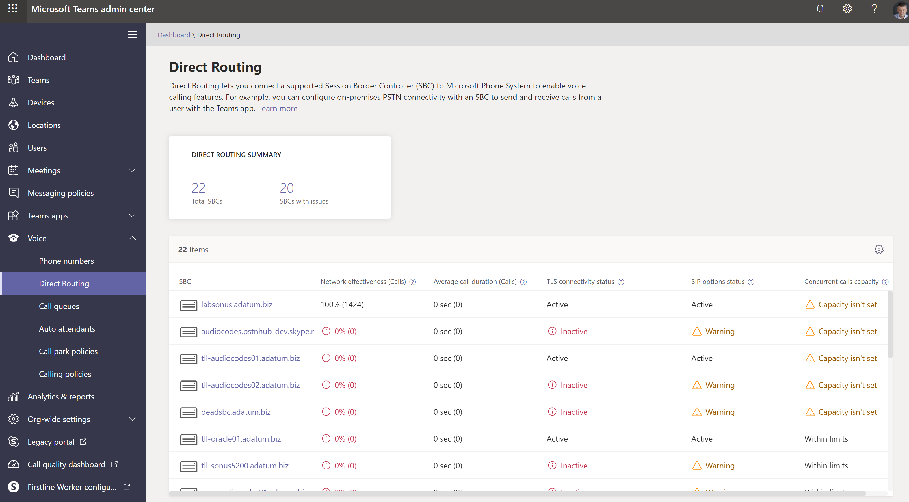

# Dashboard integrità per il routing diretto

Il dashboard integrità per il routing diretto consente di monitorare la connessione tra l'SBC (Session Border Controller) e l'interfaccia Direct routing.  Con dashboard integrità è possibile monitorare le informazioni su SBC, il servizio di telefonia e i parametri di rete tra il SBC e l'interfaccia di routing diretta. Queste informazioni consentono di identificare i problemi, incluso il motivo per cui sono state eliminate le chiamate. Ad esempio, il SBC potrebbe interrompere l'invio di chiamate se un certificato nell'SBC è scaduto o se sono presenti problemi di rete.  

Il dashboard integrità monitora due livelli di informazioni:

- Integrità complessiva dell'SBCs connesso
- Informazioni dettagliate sul SBCs connesso

È possibile visualizzare dashboard integrità nell'interfaccia di amministrazione di Microsoft teams e Skype for business.

## Integrità generale

Il dashboard integrità offre le informazioni seguenti relative all'integrità complessiva delle SBCs connesse:

 

- **Riepilogo del routing diretto** : Mostra il numero totale di sbcs registrati nel sistema. La registrazione indica che l'amministratore del tenant ha aggiunto un SBC usando il comando New-CsOnlinePSTNGateway. Se il SBC è stato aggiunto in PowerShell, ma non è mai connesso, il dashboard integrità lo mostra in uno stato non sano.

- **SBC** -il nome di dominio completo del SBC associato.

- **Network efficacia ratio (ner)** -l'ner misura la capacità di una rete di consegnare le chiamate misurando il numero di chiamate inviate rispetto al numero di chiamate recapitate a un destinatario.  

   L'NER misura la capacità delle reti di consegnare le chiamate al terminale più remoto, ad esclusione delle azioni degli utenti con conseguente rigetto delle chiamate.  Se il destinatario ha rifiutato una chiamata o ha inviato la chiamata alla segreteria telefonica, la chiamata viene conteggiata come recapito riuscito. Ciò significa che un messaggio di risposta, un segnale di occupato o un anello senza risposta vengono considerati chiamate di successo. 
  
   Ad esempio, supponiamo che Direct routing abbia inviato una chiamata a SBC e SBC restituisca il codice SIP "timeout del server di 504: il server ha tentato di accedere a un altro server nel tentativo di elaborare la richiesta e non ha ricevuto una risposta rapida". Questa risposta indica che c'è un problema sul lato SBC e questo ridurrà l'NER nel dashboard integrità per questo SBC. 
  
   Dato che l'azione da eseguire potrebbe dipendere dal numero di chiamate interessate, il dashboard dell'integrità Mostra quante chiamate sono state analizzate per calcolare un parametro. Se il numero di chiamate è inferiore a 100, l'NER potrebbe essere abbastanza basso, ma comunque normale. 

   La formula usata per calcolare NER è:

   NER = 100 x (risposte chiamate + utente occupato + squillo nessuna risposta + attacchi terminali)/Total chiamate

 
- **Durata media** delle chiamate: le informazioni sulla durata media delle chiamate consentono di monitorare la qualità delle chiamate. La durata media di una chiamata PSTN di 1:1 è di quattro-cinque minuti.  Tuttavia, per ogni società, questa media può essere diversa.  Microsoft consiglia di stabilire una previsione per la durata media della chiamata per la società. Se questo parametro è significativamente inferiore alla linea di base, potrebbe indicare che gli utenti hanno problemi con la qualità della chiamata o l'affidabilità e si riagganciano prima del solito. Se si inizia a visualizzare una durata di chiamata media estremamente bassa, ad esempio 15 secondi, i chiamanti potrebbero essere sospesi perché il servizio non è in esecuzione in modo affidabile. 

   Dato che l'azione da eseguire potrebbe dipendere dal numero di chiamate interessate, il dashboard dell'integrità Mostra quante chiamate sono state analizzate per calcolare un parametro.

- **Stato connettività TLS** -la connettività TLS (Transport Layer Security) Mostra lo stato delle connessioni TLS tra routing diretto e SBC. Il dashboard integrità analizza anche la data di scadenza del certificato e avverte se un certificato è impostato per scadere entro 30 giorni, in modo che gli amministratori possano rinnovare il certificato prima che il servizio venga interrotto.

   Facendo clic sul messaggio di avviso, è possibile visualizzare una descrizione dettagliata dei problemi in una finestra popup a destra e suggerimenti su come risolvere il problema.

- **Stato opzioni SIP** : per impostazione predefinita, il SBC invia i messaggi di opzioni ogni minuto. Questa configurazione può variare per diversi fornitori di SBC. Il routing diretto avvisa se le opzioni SIP non vengono inviate o non sono configurate. Per altre informazioni sul monitoraggio delle opzioni SIP e sulle condizioni in cui un SBC può essere contrassegnato come non funzionante, vedere [monitorare e risolvere i problemi di routing diretto](direct-routing-monitor-and-troubleshoot.md).

- **Stato delle opzioni SIP dettagliato** -oltre a indicare che si è verificato un problema con il flusso delle opzioni SIP, il dashboard integrità offre anche descrizioni dettagliate degli errori. È possibile accedere alla descrizione facendo clic sul messaggio "avviso". Una finestra popup a destra mostrerà la descrizione dettagliata degli errori.

   I valori possibili per i messaggi di stato delle opzioni SIP sono i seguenti:

    - Attivo: il SBC è attivo: il servizio Microsoft Direct routing Visualizza le opzioni che scorrono su un intervallo regolare.

    - Avviso, nessuna opzione SIP: il controller del bordo della sessione esiste nel database (l'amministratore lo ha creato usando il comando New-CsOnlinePSTNGateway). È configurata per l'invio di opzioni SIP, ma il servizio di routing diretto non ha mai visto le opzioni SIP di ritorno da questo SBC.

    - Avviso, i messaggi SIP non vengono configurati: il monitoraggio del trunk tramite le opzioni SIP non è attivato. Il sistema di chiamate Microsoft usa le opzioni SIP e il monitoraggio dell'handshake Transport Layer Security (TLS) per rilevare lo stato di integrità dei controller di bordo della sessione connessa (SBCs) a livello di applicazione. Si verificheranno problemi se il trunk può essere raggiunto a livello di rete (tramite ping), ma il certificato è scaduto o lo stack SIP non funziona. Per identificare tempestivamente questi problemi, Microsoft consiglia di abilitare l'invio di opzioni SIP. Verificare la documentazione del produttore SBC per configurare l'invio delle opzioni SIP. 

- **Capacità delle chiamate simultanee** : è possibile specificare il limite delle chiamate simultanee che un SBC può gestire usando il comando New-o set-CsOnlinePSTNGateway con il parametro-MaxConcurrentSessions. Questo parametro calcola il numero di chiamate inviate o ricevute tramite routing diretto usando un SBC specifico e lo confronta con il limite impostato. Nota: se il SBC gestisce anche le chiamate a PBX diversi, questo numero non visualizzerà le chiamate simultanee effettive.

## Informazioni dettagliate per ogni SBC

È anche possibile visualizzare le informazioni dettagliate per un SBC specifico, come illustrato nello screenshot seguente:

La visualizzazione dettagliata mostra i seguenti parametri aggiuntivi:

- **Stato della connettività TLS** : questa è la stessa metrica della pagina "integrità generale";

- **Ultima condizione di connettività TLS** : Mostra l'ora in cui il SBC ha eseguito una connessione TLS al servizio di routing diretto;

- **Stato opzioni SIP** : la stessa metrica della pagina "integrità generale".

- **Opzioni SIP ultimo controllo** : ora in cui sono state ricevute le opzioni SIP l'ultima volta.

- **Stato SBC** -stato complessivo dello sbc, in base a tutti i parametri monitorati.

- **Chiamata simultanea**: Mostra il numero di chiamate simultanee gestite da SBC. Queste informazioni sono utili per stimare il numero di canali simultanei necessari e vedere la tendenza. È possibile scorrere i dati in base al numero di giorni e alla direzione delle chiamate (in ingresso/in uscita/tutti i flussi).

- **Parametri di rete** : tutti i parametri di rete vengono misurati dall'interfaccia di routing diretto al controller di bordo della sessione. Per informazioni sui valori consigliati, vedere [preparare la rete dell'organizzazione per Microsoft teams](https://docs.microsoft.com/microsoftteams/prepare-network)e esaminare i valori consigliati di Microsoft Edge per il cliente.

   - Jitter: è la misura di millisecondi di variazione nel tempo di ritardo di propagazione della rete calcolato tra due endpoint usando RTCP (il protocollo di controllo RTP).

   - Perdita di pacchetti: è una misura del pacchetto che non è riuscita ad arrivare; viene calcolato tra due endpoint.

   - Latenza-(nota anche come tempo di andata e ritorno) è il periodo di tempo necessario per l'invio di un segnale più il tempo necessario per il riconoscimento del segnale da ricevere. Questo ritardo temporale è costituito dai tempi di propagazione tra i due punti di un segnale.

   È possibile scorrere i dati in base al numero di giorni e alla direzione delle chiamate (in ingresso/in uscita/tutti i flussi).

**Rapporto efficacia di rete** : questo è lo stesso parametro visualizzato nel dashboard integrità generale, ma con l'opzione per suddividere i dati in base a serie temporali o direzione chiamata.

