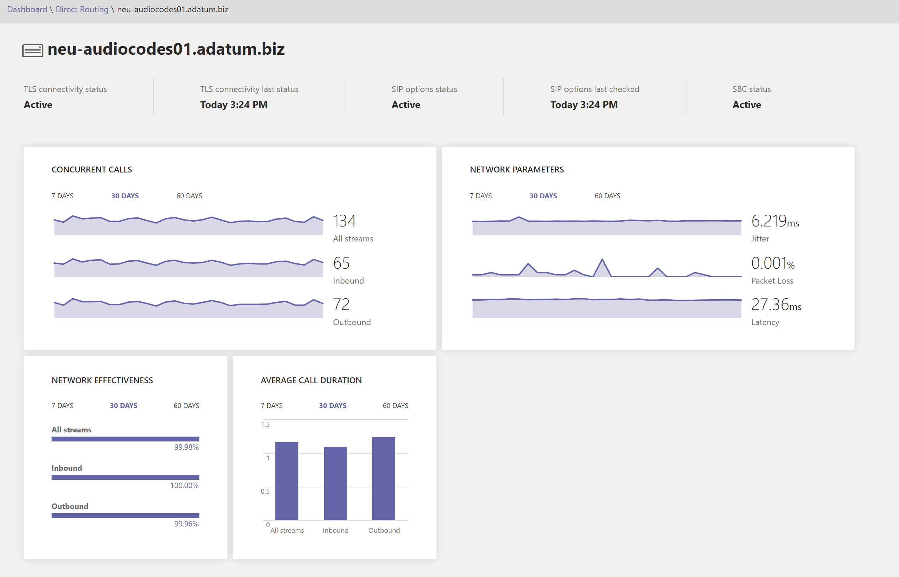

# Dashboard integrità per il routing direttoHealth Dashboard for Direct Routing

Il dashboard integrità per il routing diretto consente di monitorare la connessione tra l'SBC (Session Border Controller) e l'interfaccia Direct routing.Health Dashboard for Direct Routing lets you monitor the connection between your Session Border Controller (SBC) and the Direct Routing interface.  Con dashboard integrità è possibile monitorare le informazioni su SBC, il servizio di telefonia e i parametri di rete tra il SBC e l'interfaccia di routing diretta.With Health Dashboard, you can monitor information about your SBC, the telephony service, and the network parameters between your SBC and the Direct Routing interface. Queste informazioni consentono di identificare i problemi, incluso il motivo per cui sono state eliminate le chiamate.This information can help you identify issues, including the reason for dropped calls. Ad esempio, il SBC potrebbe interrompere l'invio di chiamate se un certificato nell'SBC è scaduto o se sono presenti problemi di rete.For example, the SBC might stop sending calls if a certificate on the SBC has expired or if there are network issues. Vedere i [ruoli di amministratore](using-admin-roles.md) per scoprire chi ha accesso al dashboard integrità.See the [admin roles](using-admin-roles.md) to learn who has access to the health dashboard.

Il dashboard integrità monitora due livelli di informazioni:Health Dashboard monitors two levels of information:

- Integrità complessiva dell'SBCs connessoOverall health of the connected SBCs
- Informazioni dettagliate sul SBCs connessoDetailed information about the connected SBCs

È possibile visualizzare dashboard integrità nell'interfaccia di amministrazione di Microsoft teams e Skype for business.You can view Health Dashboard in the Microsoft Teams and Skype for Business Admin Center.

## Integrità generaleOverall health

Il dashboard integrità offre le informazioni seguenti relative all'integrità complessiva delle SBCs connesse:Health Dashboard provides the following information related to overall health of the connected SBCs:

 

- **Riepilogo del routing diretto** : Mostra il numero totale di sbcs registrati nel sistema.**Direct Routing summary** - Shows the total number of SBCs registered in the system. La registrazione indica che l'amministratore del tenant ha aggiunto un SBC usando il comando New-CsOnlinePSTNGateway.Registration means that the tenant administrator added an SBC by using the New-CsOnlinePSTNGateway command. Se il SBC è stato aggiunto in PowerShell, ma non è mai connesso, il dashboard integrità lo mostra in uno stato non sano.If the SBC was added in PowerShell, but never connected, the Health Dashboard shows it in an unhealthy status.

- **SBC** -il nome di dominio completo del SBC associato.**SBC** - The FQDN of the paired SBC.

- **Network efficacia ratio (ner)** -l'ner misura la capacità di una rete di consegnare le chiamate misurando il numero di chiamate inviate rispetto al numero di chiamate recapitate a un destinatario.**Network Effectiveness Ratio (NER)** - The NER measures the ability of a network to deliver calls by measuring the number of calls sent versus the number of calls delivered to a recipient.  

   L'NER misura la capacità delle reti di consegnare le chiamate al terminale più remoto, ad esclusione delle azioni degli utenti con conseguente rigetto delle chiamate.The NER measures the ability of networks to deliver calls to the far-end terminal--excluding user actions resulting in call rejections.  Se il destinatario ha rifiutato una chiamata o ha inviato la chiamata alla segreteria telefonica, la chiamata viene conteggiata come recapito riuscito.If the recipient rejected a call or sent the call to voicemail, the call is counted as a successful delivery. Ciò significa che un messaggio di risposta, un segnale di occupato o un anello senza risposta vengono considerati chiamate di successo.This means that an answer message, a busy signal, or a ring with no answer are all considered successful calls.
  
   Ad esempio, supponiamo che Direct routing abbia inviato una chiamata a SBC e SBC restituisca il codice SIP "timeout del server di 504: il server ha tentato di accedere a un altro server nel tentativo di elaborare la richiesta e non ha ricevuto una risposta rapida".For example, assume Direct Routing sent a call to the SBC and the SBC returns SIP code “504 Server Time-out - The server attempted to access another server in attempting to process the request and did not receive a prompt response”. Questa risposta indica che c'è un problema sul lato SBC e questo ridurrà l'NER nel dashboard integrità per questo SBC.This response indicates there is an issue on the SBC side, and this will decrease the NER on the Health Dashboard for this SBC.
  
   Dato che l'azione da eseguire potrebbe dipendere dal numero di chiamate interessate, il dashboard dell'integrità Mostra quante chiamate sono state analizzate per calcolare un parametro.Because the action you take might depend on the number of calls affected, Health Dashboard shows how many calls were analyzed to calculate a parameter. Se il numero di chiamate è inferiore a 100, l'NER potrebbe essere abbastanza basso, ma comunque normale.If the number of calls is less than 100, the NER might be quite low, but still be normal.

   La formula usata per calcolare NER è:The formula used to calculate NER is:

   NER = 100 x (risposte chiamate + utente occupato + squillo nessuna risposta + attacchi terminali)/Total chiamateNER = 100 x (Answered calls + User Busy + Ring no Answer + Terminal Reject Seizures)/Total Calls

- **Durata media** delle chiamate: le informazioni sulla durata media delle chiamate consentono di monitorare la qualità delle chiamate.**Average call duration** - Information about average call duration can help you monitor the quality of calls. La durata media di una chiamata PSTN di 1:1 è di quattro-cinque minuti.The average duration of a 1:1 PSTN call is four to five minutes.  Tuttavia, per ogni società, questa media può essere diversa.However, for each company, this average can differ.  Microsoft consiglia di stabilire una previsione per la durata media della chiamata per la società.Microsoft recommends establishing a baseline for the average call duration for your company. Se questo parametro è significativamente inferiore alla linea di base, potrebbe indicare che gli utenti hanno problemi con la qualità della chiamata o l'affidabilità e si riagganciano prima del solito.If this parameter goes significantly below the baseline, it might indicate that your users are having issues with call quality or reliability and are hanging up earlier than usual. Se si inizia a visualizzare una durata di chiamata media estremamente bassa, ad esempio 15 secondi, i chiamanti potrebbero essere sospesi perché il servizio non è in esecuzione in modo affidabile.If you start seeing extremely low average call duration, for example 15 seconds, callers might be hanging up because your service is not performing reliably.

   Dato che l'azione da eseguire potrebbe dipendere dal numero di chiamate interessate, il dashboard dell'integrità Mostra quante chiamate sono state analizzate per calcolare un parametro.Because the action you take might depend on the number of calls affected, Health Dashboard shows how many calls were analyzed to calculate a parameter.

- **Stato connettività TLS** -la connettività TLS (Transport Layer Security) Mostra lo stato delle connessioni TLS tra routing diretto e SBC.**TLS connectivity status** - TLS (Transport Layer Security) connectivity shows the status of the TLS connections between Direct Routing and the SBC. Il dashboard integrità analizza anche la data di scadenza del certificato e avverte se un certificato è impostato per scadere entro 30 giorni, in modo che gli amministratori possano rinnovare il certificato prima che il servizio venga interrotto.Health Dashboard also analyzes the certificate expiration date and warns if a certificate is set to expire within 30 days so that administrators can renew the certificate before service is disrupted.

   Facendo clic sul messaggio di avviso, è possibile visualizzare una descrizione dettagliata dei problemi in una finestra popup a destra e suggerimenti su come risolvere il problema.By clicking the Warning message, you can see a detailed issue description in a popup window on the right and recommendations for how to fix the issue.

- **Stato opzioni SIP** : per impostazione predefinita, il SBC invia i messaggi di opzioni ogni minuto.**SIP options status** – By default, the SBC sends options messages every minute. Questa configurazione può variare per diversi fornitori di SBC.This configuration can vary for different SBC vendors. Il routing diretto avvisa se le opzioni SIP non vengono inviate o non sono configurate.Direct Routing warns if the SIP options are not sent or are not configured. Per altre informazioni sul monitoraggio delle opzioni SIP e sulle condizioni in cui un SBC può essere contrassegnato come non funzionante, vedere [monitorare e risolvere i problemi di routing diretto](direct-routing-monitor-and-troubleshoot.md).For more information about SIP options monitoring, and conditions when an SBC can be marked as not functional, see [Monitor and troubleshoot Direct Routing](direct-routing-monitor-and-troubleshoot.md).

- **Stato delle opzioni SIP dettagliato** -oltre a indicare che si è verificato un problema con il flusso delle opzioni SIP, il dashboard integrità offre anche descrizioni dettagliate degli errori.**Detailed SIP options status** - In addition to showing that there is an issue with SIP options flow, the Health Dashboard also provides detailed descriptions of the errors. È possibile accedere alla descrizione facendo clic sul messaggio "avviso".You can access the description by clicking the “Warning” message. Una finestra popup a destra mostrerà la descrizione dettagliata degli errori.A pop-up window on the right will show the detailed error description.

   I valori possibili per i messaggi di stato delle opzioni SIP sono i seguenti:Possible values for SIP options status messages are as follows:

    - Attivo: il SBC è attivo: il servizio Microsoft Direct routing Visualizza le opzioni che scorrono su un intervallo regolare.Active – The SBC is active--Microsoft Direct Routing service sees the options flowing on a regular interval.

    - Avviso, nessuna opzione SIP: il controller del bordo della sessione esiste nel database (l'amministratore lo ha creato usando il comando New-CsOnlinePSTNGateway).Warning, no SIP options - The Session Border Controller exists in the database (your administrator created it using the command New-CsOnlinePSTNGateway). È configurata per l'invio di opzioni SIP, ma il servizio di routing diretto non ha mai visto le opzioni SIP di ritorno da questo SBC.It is configured to send SIP options, but the Direct Routing service never saw the SIP options coming back from this SBC.

    - Avviso, i messaggi SIP non vengono configurati: il monitoraggio del trunk tramite le opzioni SIP non è attivato.Warning, SIP Messages aren't configured - Trunk monitoring using SIP options isn’t turned on. Il sistema di chiamate Microsoft usa le opzioni SIP e il monitoraggio dell'handshake Transport Layer Security (TLS) per rilevare lo stato di integrità dei controller di bordo della sessione connessa (SBCs) a livello di applicazione.Microsoft Calling System uses SIP options and Transport Layer Security (TLS) handshake monitoring to detect the health of the connected Session Border Controllers (SBCs) at the application level. Si verificheranno problemi se il trunk può essere raggiunto a livello di rete (tramite ping), ma il certificato è scaduto o lo stack SIP non funziona.You’ll have problems if this trunk can be reached at the network level (by ping), but the certificate has expired or the SIP stack doesn’t work. Per identificare tempestivamente questi problemi, Microsoft consiglia di abilitare l'invio di opzioni SIP.To help identify such problems early, Microsoft recommends enabling sending SIP options. Verificare la documentazione del produttore SBC per configurare l'invio delle opzioni SIP.Check your SBC manufacturer documentation to configure sending SIP options.

- **Capacità delle chiamate simultanee** : è possibile specificare il limite delle chiamate simultanee che un SBC può gestire usando il comando New-o set-CsOnlinePSTNGateway con il parametro-MaxConcurrentSessions.**Concurrent calls capacity** - You can specify the limit of concurrent calls that an SBC can handle by using the New- or Set-CsOnlinePSTNGateway command with the -MaxConcurrentSessions parameter. Questo parametro calcola il numero di chiamate inviate o ricevute tramite routing diretto usando un SBC specifico e lo confronta con il limite impostato.This parameter calculates how many calls were sent or received by Direct Routing using a specific SBC and compares it with the limit set. Nota: se il SBC gestisce anche le chiamate a PBX diversi, questo numero non visualizzerà le chiamate simultanee effettive.Note:  If the SBC also handles calls to different PBXs, this number will not show the actual concurrent calls.

## Informazioni dettagliate per ogni SBCDetailed information for each SBC

È anche possibile visualizzare le informazioni dettagliate per un SBC specifico, come illustrato nello screenshot seguente:You can also view the detailed information for a specific SBC as shown in the following screenshot:

La visualizzazione dettagliata mostra i seguenti parametri aggiuntivi:The detailed view shows the following additional parameters:

- **Stato della connettività TLS** : questa è la stessa metrica della pagina "integrità generale";**TLS Connectivity status** – this is the same metric as on the “Overall Health” page;

- **Ultima condizione di connettività TLS** : Mostra l'ora in cui il SBC ha eseguito una connessione TLS al servizio di routing diretto;**TLS Connectivity last status** – shows time when the SBC made a TLS connection to the Direct Routing service;

- **Stato opzioni SIP** : la stessa metrica della pagina "integrità generale".**SIP options status** – the same metric as on the “Overall Health” page.

- **Opzioni SIP ultimo controllo** : ora in cui sono state ricevute le opzioni SIP l'ultima volta.**SIP options last checked** – time when the SIP options were received last time.

- **Stato SBC** -stato complessivo dello sbc, in base a tutti i parametri monitorati.**SBC status** – overall status of the SBC, based on all monitored parameters.

- **Chiamata simultanea**: Mostra il numero di chiamate simultanee gestite da SBC.**Concurrent call**- shows  how many concurrent calls the SBC handled. Queste informazioni sono utili per stimare il numero di canali simultanei necessari e vedere la tendenza.This information is useful to predict the number of concurrent channels you need and see the trend. È possibile scorrere i dati in base al numero di giorni e alla direzione delle chiamate (in ingresso/in uscita/tutti i flussi).You can slide the data by number of days and call direction (inbound/outbound/All streams).

- **Parametri di rete** : tutti i parametri di rete vengono misurati dall'interfaccia di routing diretto al controller di bordo della sessione.**Network parameters** - All network parameters are measured from the Direct Routing interface to the Session Border Controller. Per informazioni sui valori consigliati, vedere [preparare la rete dell'organizzazione per Microsoft teams](https://docs.microsoft.com/microsoftteams/prepare-network)e esaminare i valori consigliati di Microsoft Edge per il cliente.For information about the recommended values, see [Prepare your organization's network for Microsoft Teams](https://docs.microsoft.com/microsoftteams/prepare-network), and look at the Customer Edge to Microsoft Edge recommended values.

   - Jitter: è la misura di millisecondi di variazione nel tempo di ritardo di propagazione della rete calcolato tra due endpoint usando RTCP (il protocollo di controllo RTP).Jitter – Is the millisecond measure of variation in network propagation delay time computed between two endpoints using RTCP (The RTP Control Protocol).

   - Perdita di pacchetti: è una misura del pacchetto che non è riuscita ad arrivare; viene calcolato tra due endpoint.Packet Loss – Is a measure of packet that failed to arrive; it is computed between two endpoints.

   - Latenza-(nota anche come tempo di andata e ritorno) è il periodo di tempo necessario per l'invio di un segnale più il tempo necessario per il riconoscimento del segnale da ricevere.Latency - (Also known as round trip time) is the length of time it takes for a signal to be sent plus the length of time it takes for the acknowledgment of that signal to be received. Questo ritardo temporale è costituito dai tempi di propagazione tra i due punti di un segnale.This time delay consists of the propagation times between the two points of a signal.

   È possibile scorrere i dati in base al numero di giorni e alla direzione delle chiamate (in ingresso/in uscita/tutti i flussi).You can slide the data by number of days and call direction (inbound/outbound/All streams).

**Rapporto efficacia di rete** : questo è lo stesso parametro visualizzato nel dashboard integrità generale, ma con l'opzione per suddividere i dati in base a serie temporali o direzione chiamata.**Network Effectiveness ratio** - This is the same parameter that appears on the Overall Health dashboard, but with the option to slice the data by time series or call direction.
