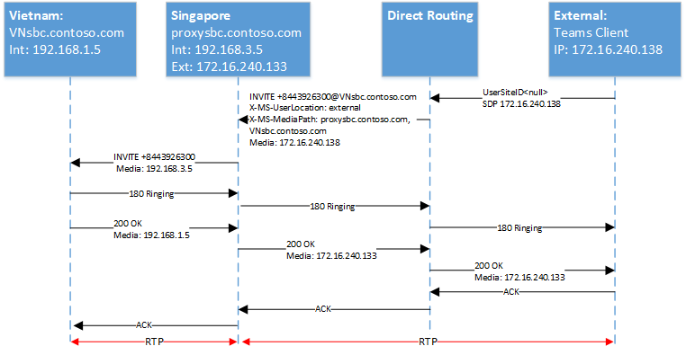

# <a name="configure-local-media-optimization-for-direct-routing"></a>Configurare l'ottimizzazione del supporto locale per il routing diretto

La configurazione per l'ottimizzazione multimediale locale si basa su impostazioni di rete comuni ad altre funzionalità vocali cloud, ad esempio routing Location-Based e chiamate di emergenza dinamiche. Per altre informazioni sulle aree di rete, i siti di rete, le subnet di rete e gli indirizzi IP attendibili, vedere Impostazioni di rete [per le funzionalità vocali cloud.](cloud-voice-network-settings.md)

Prima di configurare l'ottimizzazione del supporto locale, vedere [Ottimizzazione dei supporti locali per il routing diretto.](direct-routing-media-optimization.md)  

Per configurare l'ottimizzazione del supporto locale, sono necessari i passaggi seguenti. È possibile usare l'Teams di amministrazione o PowerShell. Per informazioni dettagliate, vedere [Gestire la topologia di rete.](manage-your-network-topology.md)

1. Configurare l'utente e i siti SBC (come descritto in questo articolo).
2. Configurare gli SBC per l'ottimizzazione dei supporti locali (in base alle specifiche del fornitore SBC).

Il diagramma seguente mostra la configurazione di rete usata negli esempi di questo articolo.


## <a name="configure-the-user-and-the-sbc-sites"></a>Configurare l'utente e i siti SBC

Per configurare l'utente e i siti SBC, è necessario:

1. [Gestire gli indirizzi IP attendibili esterni](#manage-external-trusted-ip-addresses).  

2. [Definire la topologia di rete](#define-the-network-topology) configurando le aree di rete, i siti di rete e le subnet di rete.

3. [Definire la topologia della rete virtuale](#define-the-virtual-network-topology) assegnando SBC ai siti con modalità pertinenti e valori SBC proxy.


## <a name="configure-sbcs-for-local-media-optimization-according-to-the-sbc-vendor-specification"></a>Configurare SBC(s) per l'ottimizzazione dei supporti locali in base alla specifica del fornitore SBC

Questo articolo descrive la configurazione per i componenti Microsoft. Per informazioni sulla configurazione SBC, vedere la documentazione del fornitore SBC.

L'ottimizzazione multimediale locale è supportata dai fornitori SBC seguenti:

| Fornitore | Prodotto |    Versione software |
|:------------|:-------|:-------|
| [Audiocodice](https://www.audiocodes.com/media/13253/connecting-audiocodes-sbc-to-microsoft-teams-direct-routing-enterprise-model-configuration-note.pdf) |    Mediant 500 SBC |   7.20A.256 | 
|            |  Mediant 800 SBC |   7.20A.256 | 
|            |  Mediant 2600 SBC |  7.20A.256 | 
|            |  Mediant 4000 SBC |  7.20A.256 | 
|            |  Mediant 1000B SBC | 7.20A.256 | 
|            |  Mediant 9000 SBC |  7.20A.256 | 
|            |  Mediant Virtual Edition SBC |   7.20A.256 | 
|            |  Mediant Cloud Edition SBC | 7.20A.256 |
| [Componente di base SBC della barra multifunzione](https://support.sonus.net/display/ALLDOC/SBC+8.2+-+Configure+Local+Media+Optimization)  |  SBC 5110         | 8.2  |
|            |  SBC 5210         | 8.2  |
|            |  SBC 5400         | 8.2  |
|            |  SBC 7000         | 8.2  |
|            |  SBC SWe          | 8.2  |
| [Bordo SBC della barra multifunzione](https://support.sonus.net/display/UXDOC81/Best+Practice+-+Configuring+Microsoft+Teams+Local+Media+Optimization)  |  SBC SWe Lite | 8.1.5 |
|               | SBC 1000 | 8.1.5  |
|               | SBC 2000 | 8.1.5  |
| [TE-SYSTEMS](https://www.anynode.de/local_media_optimization/) |  anynode          | 4.0.1+ |
| [Oracle](https://www.oracle.com/industries/communications/enterprise-communications/session-border-controller/microsoft.html) | AP 1100 | 8.4.0.0.0 |
|        | AP 3900 | 8.4.0.0.0 |
|        | AP 4600 | 8.4.0.0.0 | 
|        | AP 6300 | 8.4.0.0.0 |
|        | AP 6350 | 8.4.0.0.0 | 
|        | VME     | 8.4.0.0.0 |


## <a name="manage-external-trusted-ip-addresses"></a>Gestire indirizzi IP attendibili esterni

Gli INDIRIZZI IP attendibili esterni sono gli INDIRIZZI IP esterni Internet della rete aziendale. Questi indirizzi IP sono gli indirizzi IP usati dai client Microsoft Teams quando si connettono a Microsoft 365. È necessario aggiungere questi IP esterni per ogni sito in cui si hanno utenti che usano l'ottimizzazione del supporto locale.

Per aggiungere gli indirizzi IP pubblici per ogni sito, usare il cmdlet New-CsTenantTrustedIPAddress. È possibile definire un numero illimitato di indirizzi IP attendibili per un tenant. Se gli INDIRIZZI IP esterni visti Microsoft 365 indirizzi IPv4 e IPv6, è necessario aggiungere entrambi i tipi di indirizzi IP. Per IPv4, usare la maschera 32. Per IPv6, usare la maschera 128. È possibile aggiungere sia singoli indirizzi IP esterni che subnet IP esterne specificando maskBit diversi nel cmdlet.

```
New-CsTenantTrustedIPAddress -IPAddress <External IP address> -MaskBits <Subnet bitmask> -Description <description>
```


Esempio di aggiunta di indirizzi IP attendibili.

```
New-CsTenantTrustedIPAddress -IPAddress 172.16.240.110 -MaskBits 32 -Description "Vietnam site trusted IP"
New-CsTenantTrustedIPAddress -IPAddress 172.16.240.120 -MaskBits 32 -Description "Indonesia site trusted IP"
New-CsTenantTrustedIPAddress -IPAddress 172.16.240.130 -MaskBits 32 -Description "Singapore site trusted IP"
```


## <a name="define-the-network-topology"></a>Definire la topologia di rete

Questa sezione descrive come definire le aree di rete, i siti di rete e le subnet di rete per la topologia di rete.

Per tutti i parametri viene fatto distinzione tra maiuscole e minuscole, quindi è necessario assicurarsi di usare lo stesso caso usato durante l'installazione.  Ad esempio, i valori gatewaySiteID "Vietnam" e "vietnam" verranno trattati come siti diversi.

### <a name="define-network-regions"></a>Definire le aree di rete

Per definire le aree di rete, usare il cmdlet New-CsTenantNetworkRegion rete. Il parametro RegionID è un nome logico che rappresenta la geografia dell'area geografica e non ha dipendenze o restrizioni. Il parametro CentralSite <site ID> è facoltativo.

```
New-CsTenantNetworkRegion -NetworkRegionID <region ID>  
```

L'esempio seguente crea un'area di rete denominata APAC:

```
New-CsTenantNetworkRegion -NetworkRegionID "APAC"  
```

###  <a name="define-network-sites"></a>Definire i siti di rete

Per definire i siti di rete, usare il cmdlet New-CsTenantNetworkSite rete. Ogni sito di rete deve essere associato a un'area di rete.

```
New-CsTenantNetworkSite -NetworkSiteID <site ID> -NetworkRegionID <region ID>
```

L'esempio seguente crea tre nuovi siti di rete, Vietnam, Indonesia e Singapore nell'area APAC:

```
New-CsTenantNetworkSite -NetworkSiteID "Vietnam" -NetworkRegionID "APAC"
New-CsTenantNetworkSite -NetworkSiteID "Indonesia" -NetworkRegionID "APAC"
New-CsTenantNetworkSite -NetworkSiteID "Singapore" -NetworkRegionID "APAC"
```

### <a name="define-network-subnets"></a>Definire subnet di rete

Per definire subnet di rete e associarle ai siti di rete, usare il cmdlet New-CsTenantNetworkSubnet rete. Ogni subnet di rete può essere associata a un solo sito. 

```
New-CsTenantNetworkSubnet -SubnetID <Subnet IP address> -MaskBits <Subnet bitmask> -NetworkSiteID <site ID>
```

L'esempio seguente definisce tre subnet di rete e le associa ai tre siti di rete: Vietnam, Indonesia e Singapore:

```
New-CsTenantNetworkSubnet -SubnetID 192.168.1.0 -MaskBits 24 -NetworkSiteID “Vietnam”
New-CsTenantNetworkSubnet -SubnetID 192.168.2.0 -MaskBits 24 -NetworkSiteID “Indonesia”
New-CsTenantNetworkSubnet -SubnetID 192.168.3.0 -MaskBits 24 -NetworkSiteID “Singapore”
```

## <a name="define-the-virtual-network-topology"></a>Definire la topologia della rete virtuale 

Prima di tutto, l'amministratore tenant crea una nuova configurazione SBC per ogni SBC pertinente usando il cmdlet New-CsOnlinePSTNGateway tenant.
L'amministratore tenant definisce la topologia della rete virtuale specificando i siti di rete per gli oggetti gateway PSTN usando il cmdlet Set-CsOnlinePSTNGateway:

```
PS C:\> Set-CsOnlinePSTNGateway -Identity <Identity> -GatewaySiteID <site ID> -MediaBypass <true/false> -BypassMode <Always/OnlyForLocalUsers> -ProxySBC  <proxy SBC FQDN or $null>
```

Tenere presente quanto segue: 
   - Se il cliente ha un singolo SBC, il parametro -ProxySBC deve essere obbligatorio $null o il valore FQDN SBC (scenario SBC centrale con trunk centralizzati).
   - Il parametro -MediaBypass deve essere impostato su $true per supportare l'ottimizzazione multimediale locale.
   - Se per SBC non è impostato il parametro -BypassMode, le intestazioni X-MS non verranno inviate. 
   - Tutti i parametri usano la distinzione tra maiuscole e minuscole, quindi è necessario assicurarsi di usare lo stesso caso usato durante l'installazione.  Ad esempio, i valori gatewaySiteID "Vietnam" e "vietnam" verranno trattati come siti diversi.

L'esempio seguente aggiunge tre SBC ai siti di rete Vietnam, Indonesia e Singapore nell'area APAC con modalità Ignora sempre:

```
Set-CSOnlinePSTNGateway -Identity “proxysbc.contoso.com” -GatewaySiteID “Singapore” -MediaBypass $true -BypassMode “Always” -ProxySBC $null

Set-CSOnlinePSTNGateway -Identity “VNsbc.contoso.com” -GatewaySiteID “Vietnam” -MediaBypass $true -BypassMode “Always” -ProxySBC “proxysbc.contoso.com”

Set-CSOnlinePSTNGateway -Identity “IDsbc.contoso.com” -GatewaySiteID “Indonesia” -MediaBypass $true -BypassMode “Always” -ProxySBC “proxysbc.contoso.com”
```

Nota: per garantire operazioni ininterrotte quando l'ottimizzazione del supporto locale e il routing di Location-Based (LBR) sono configurati contemporaneamente, gli SBC downstream devono essere abilitati per LBR impostando il parametro GatewaySiteLbrEnabled su $true per ogni SBC downstream. Questa impostazione non è obbligatoria per il proxy SBC.

In base alle informazioni precedenti, il routing diretto includerà tre intestazioni SIP proprietarie per gli inviti SIP e i nuovi inviti, come illustrato nella tabella seguente.

Intestazioni X-MS introdotte in Routing diretto su inviti e Re-Invites se è definito BypassMode:

| Nome intestazione | Valori | Commenti | 
|:------------|:-------|:-------|
| X-MS-UserLocation | interno/esterno | Indica se l'utente è interno o esterno |
| Request-URI INVITE sip: +84439263000@VNsbc.contoso.com SIP /2.0 | SBC FQDN | Fqdn destinato alla chiamata anche se il servizio SBC non è connesso direttamente a Direct Routing |
| X-MS-MediaPath | Esempio: proxysbc.contoso.com, VNsbc.contoso.com | Ordine di SBC da usare per il percorso multimediale tra l'utente e il SBC di destinazione. Il valore SBC finale è sempre l'ultimo |
| X-MS-UserSite | usersiteID | Stringa definita dall'amministratore del tenant |

## <a name="call-flows"></a>Flussi di chiamata 

Di seguito sono illustrati i flussi delle chiamate per due modalità:

- [Ignora sempre](#always-bypass-mode)
- [Solo per gli utenti locali](#only-for-local-users-mode)

### <a name="always-bypass-mode"></a>Modalità ignora sempre

La modalità Ignora sempre è l'opzione più semplice da configurare. L'amministratore tenant può configurare un singolo sito per tutti gli utenti e gli SBC se tutti gli SBC sono raggiungibili da qualsiasi sito.

Gli esempi mostrano la modalità ignora sempre per gli scenari seguenti:

- [Chiamate in uscita e l'utente si trova nella stessa posizione dell'SBC](#outbound-calls-and-the-user-is-in-the-same-location-as-the-sbc-with-always-bypass)
- [Chiamate in ingresso e l'utente si trova nella stessa posizione dell'SBC](#inbound-calls-and-the-user-is-in-the-same-location-as-the-sbc-with-always-bypass)
- [Chiamate in uscita e l'utente è esterno](#outbound-calls-and-the-user-is-external-with-always-bypass)
- [Chiamate in ingresso e l'utente è esterno](#inbound-calls-and-the-user-is-external-with-always-bypass)

La tabella seguente mostra l'FQDN e gli indirizzi IP usati negli esempi:

| FQDN | Indirizzo IP esterno SBC | Indirizzo IP interno SBC | Subnet interna | Posizione | NAT esterno (IP attendibile) |
|:------------|:-------|:-------|:-------|:-------|:-------|
| VNsbc.contoso.com | Nessuno | 192.168.1.5 | 192.168.1.0/24 | Vietnam | 172.16.240.110 |
| IDsbc.contoso.com | Nessuno | 192.168.2.5 | 192.168.2.0/24 | Indonesia | 172.16.240.120 |
| proxysbc.contoso.com | 172.16.240.133 | 192.168.3.5 | 192.168.3.0/24 | Singapore | 172.16.240.130 |


#### <a name="outbound-calls-and-the-user-is-in-the-same-location-as-the-sbc-with-always-bypass"></a>Chiamate in uscita e l'utente si trova nella stessa posizione della SBC con Bypass sempre

| Modalità |    Utente |  Posizione |  Direzione della chiamata |
|:------------|:-------|:-------| :-------|
| AlwaysBypass |    Interno |  Lo stesso sito di SBC |  In uscita |

La tabella seguente mostra la configurazione e l'azione dell'utente finale:

| Posizione fisica dell'utente| L'utente effettua o riceve una chiamata a/da numero | Numero di telefono dell'utente  | Criteri di routing vocale online | Modalità configurata per SBC |
|:------------|:-------|:-------|:-------|:-------|
| Vietnam | +84 4 3926 3000 | +84 4 5555 5555   | Priorità 1: ^ \+ 84(\d {9} )$ -VNsbc.contoso.com <br> Priorità 2: .* - proxysbc.contoso.com   | VNsbc.contoso.com – Ignora sempre <br> proxysbc.contoso.com – Ignora sempre


Il diagramma seguente mostra la scala SIP per una chiamata in uscita con modalità ignora sempre e l'utente nella stessa posizione del SBC.


La tabella seguente mostra le intestazioni X-MS inviate da Direct Routing:

| Parametro | Spiegazione |
|:------------|:-------|
| Invita +8443926300@VNsbc.contoso.com | L'FQDN di destinazione di SBC come definito nei criteri di routing vocale online viene inviato nell'URI della richiesta | 
| X-MS-UserLocation: interno | Il campo indica che l'utente si trova all'interno della rete aziendale |
| X-MS-MediaPath: VNsbc.contoso.com |   Specifica quale SBC deve attraversare il client fino al valore SBC di destinazione. In questo caso, poiché è stato ignorato sempre, il client è interno al nome di destinazione inviato come unico nome nell'intestazione. | 
|X-MS-UserSite: Vietnam |   Campo indicato all'interno del sito in cui si trova l'utente. |


#### <a name="inbound-calls-and-the-user-is-in-the-same-location-as-the-sbc-with-always-bypass"></a>Chiamate in ingresso e l'utente si trova nella stessa posizione della SBC con Bypass sempre

| Modalità |    Utente |  Posizione |  Direzione della chiamata |
|:------------|:-------|:-------|:-------|:-------|
| AlwaysBypass |    Interno | Lo stesso sito di SBC | In ingresso |


In una chiamata in ingresso, la posizione dell'utente è sconosciuta e SBC deve indovinare dove si trova l'utente. Se l'ipotesi non è corretta, sarà necessario un nuovo invito. Questo caso presuppone che l'utente sia interno, che i supporti multimediali possano fluire direttamente e che non siano necessarie altre azioni (invito di nuovo).
Il servizio SBC connesso al servizio di routing diretto segnala la posizione SBC di origine fornendo i campi Record-Route e Contatto. In base a questi campi, il percorso multimediale viene calcolato tramite Routing diretto.

Nota: dato che un utente può avere più endpoint, il supporto di 183 non è possibile. In questo caso l'instradamento diretto userà sempre 180 squilli. 

Il diagramma seguente mostra la scala SIP per le chiamate in ingresso con la modalità AlwaysBypass e l'utente si trova nella stessa posizione di SBC.


#### <a name="outbound-calls-and-the-user-is-external-with-always-bypass"></a>Chiamate in uscita e l'utente è esterno con Bypass sempre

| Modalità |    Utente |  Sito |  Direzione della chiamata
|:------------|:-------|:-------|:-------|
AlwaysBypass |  Esterno |  N/D | In uscita |


Il diagramma seguente mostra la scala SIP per una chiamata in uscita con modalità AlwaysBypass e l'utente è esterno:



La tabella seguente mostra le intestazioni X-MS inviate dal servizio Routing diretto:

| Parametro |   Spiegazione |
|:------------|:-------|
|Invita +8443926300@VNsbc.contoso.com | L'FQDN di destinazione del servizio SBC come definito nei criteri di routing vocale online viene inviato nell'URI della richiesta.|
| X-MS-UserLocation: esterno | Il campo indica che l'utente si trova all'esterno della rete aziendale. |
| X-MS-MediaPath: proxysbc.contoso.com, VNsbc.contoso.com    | Specifica quale SBC deve attraversare il client fino al valore SBC di destinazione. In questo caso, poiché è sempre stato ignorato e il client è esterno. |

#### <a name="inbound-calls-and-the-user-is-external-with-always-bypass"></a>Chiamate in ingresso e l'utente è esterno con Bypass sempre

| Modalità | Utente | Sito |  Direzione della chiamata |
|:------------|:-------|:-------|:-------|
AlwaysBypass |  Esterno |  N/D |   In ingresso |

Per una chiamata in ingresso, la SBC connessa a Direct Routing deve inviare un nuovo invito (per impostazione predefinita, i media candidati locali sono sempre offerti) se la posizione dell'utente è esterna.  X-MediaPath viene calcolato in base Record-Route e all'utente SBC specificato.

Il diagramma seguente mostra la scala SIP per una chiamata in ingresso con modalità AlwaysBypass e l'utente è esterno.


### <a name="only-for-local-users-mode"></a>Solo per la modalità utenti locali

I media candidati locali dell'SBC di destinazione verranno offerti solo se un utente si trova nella stessa posizione di SBC. In tutti gli altri casi, i supporti multimediali fluiranno attraverso un IP interno o esterno del proxy SBC.

Vengono descritti gli scenari seguenti:

- [Chiamate in uscita e l'utente si trova nella stessa posizione dell'SBC](#outbound-calls-and-the-user-is-in-the-same-location-as-the-sbc-with-only-for-local-users)
- [Chiamate in ingresso e l'utente si trova nella stessa posizione dell'SBC](#inbound-calls-and-the-user-is-in-the-same-location-as-the-sbc-with-only-for-local-users)
- [L'utente non si trova nella stessa posizione di SBC, ma si trova nella rete aziendale](#user-is-not-at-the-same-location-as-the-sbc-but-is-in-the-corporate-network-with-only-for-local-users)
- [Chiamate in ingresso e l'utente è interno, ma non si trova nella stessa posizione dell'SBC](#inbound-call-and-the-user-is-internal-but-is-not-at-the-same-location-as-the-sbc-with-only-for-local-users)

La tabella seguente mostra la configurazione e l'azione dell'utente finale:

| Posizione fisica dell'utente |  L'utente effettua o riceve una chiamata a/da numero |  Numero di telefono dell'utente | Criteri di routing vocale online |   Modalità configurata per SBC |
|:------------|:-------|:-------|:-------|:-------|
| Vietnam | +84 4 3926 3000 |  +84 4 5555 5555 | Priorità 1: ^ \+ 84(\d {9} )$ -VNsbc.contoso.com <br> Priorità 2: .* - proxysbc.contoso.com | VNsbc.contoso.com - OnlyForLocalUsers Proxysbc.contoso.com – Ignora sempre |

#### <a name="outbound-calls-and-the-user-is-in-the-same-location-as-the-sbc-with-only-for-local-users"></a>Chiamate in uscita e l'utente si trova nella stessa posizione dell'SBC con Solo per gli utenti locali

| Modalità | Utente | Sito | Direzione della chiamata |
|:------------|:-------|:-------|:-------|
| OnlyForLocalUsers |   Interno |Uguale a SBC   | In uscita |

Il diagramma seguente mostra una chiamata in uscita in modalità OnlyForLocalUsers e l'utente si trova nella stessa posizione del servizio SBC. Questo è lo stesso flusso visualizzato nelle chiamate in uscita quando l'utente si trova nella stessa [posizione di SBC.](#outbound-calls-and-the-user-is-in-the-same-location-as-the-sbc-with-always-bypass)


#### <a name="inbound-calls-and-the-user-is-in-the-same-location-as-the-sbc-with-only-for-local-users"></a>Chiamate in ingresso e l'utente si trova nella stessa posizione della SBC con Solo per gli utenti locali

| Modalità | Utente | Sito | Direzione della chiamata |
|:------------|:-------|:-------|:-------|
| OnlyForLocalUsers |   Interno | Uguale a SBC | In ingresso |

Il diagramma seguente mostra una chiamata in ingresso in modalità OnlyForLocalUsers e l'utente si trova nella stessa posizione del servizio SBC. Questo è lo stesso flusso mostrato nelle chiamate in ingresso quando l'utente si trova nella stessa posizione [del servizio SBC.](#inbound-calls-and-the-user-is-in-the-same-location-as-the-sbc-with-always-bypass)


#### <a name="user-is-not-at-the-same-location-as-the-sbc-but-is-in-the-corporate-network-with-only-for-local-users"></a>L'utente non si trova nella stessa posizione di SBC, ma si trova nella rete aziendale con Solo per gli utenti locali

| Modalità | Utente | Sito |Direzione della chiamata |
|:------------|:-------|:-------|:-------|
| OnlyForLocalUsers  | Interno |   Diverso da SBC | In uscita |

Il routing diretto calcola X-MediaPath in base alla posizione segnalata dell'utente e alla modalità configurata in SBC.


Il diagramma seguente mostra una chiamata in uscita con la modalità OnlyForLocalUsers e un utente interno che non si trova nella stessa posizione di SBC.


#### <a name="inbound-call-and-the-user-is-internal-but-is-not-at-the-same-location-as-the-sbc-with-only-for-local-users"></a>Chiamata in ingresso e l'utente è interno, ma non si trova nella stessa posizione di SBC con Solo per gli utenti locali

| Modalità |    Utente |  Sito |  Direzione della chiamata |
|:------------|:-------|:-------|:-------|
| OnlyForLocalUsers | Interno |    Diverso da SBC |    In ingresso |

Il diagramma seguente mostra una chiamata in ingresso con la modalità OnlyForLocalUsers e un utente interno che non si trova nella stessa posizione di SBC.


