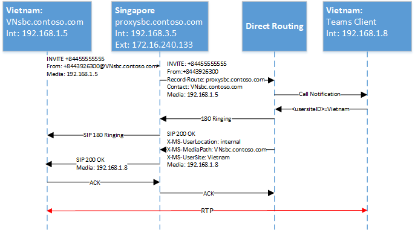

# <a name="configure-local-media-optimization-for-direct-routing"></a><span data-ttu-id="55a59-103">Configurare l'ottimizzazione multimediale locale per il routing diretto</span><span class="sxs-lookup"><span data-stu-id="55a59-103">Configure Local Media Optimization for Direct Routing</span></span>

<span data-ttu-id="55a59-104">La configurazione per l'ottimizzazione media locale si basa sulle impostazioni di rete comuni ad altre caratteristiche vocali del cloud, ad esempio routing basato sulla posizione e chiamate di emergenza dinamiche.</span><span class="sxs-lookup"><span data-stu-id="55a59-104">Configuration for Local Media Optimization is based on network settings that are common to other cloud voice features, such as Location-Based Routing and dynamic emergency calling.</span></span> <span data-ttu-id="55a59-105">Per altre informazioni sulle aree di rete, i siti di rete, le subnet di rete e gli indirizzi IP attendibili, vedere [impostazioni di rete per le funzionalità di cloud Voice](cloud-voice-network-settings.md).</span><span class="sxs-lookup"><span data-stu-id="55a59-105">To learn more about network regions, network sites, network subnets, and trusted IP addresses, see [Network settings for cloud voice features](cloud-voice-network-settings.md).</span></span>

<span data-ttu-id="55a59-106">Prima di configurare l'ottimizzazione multimediale locale, vedere [ottimizzazione dei contenuti multimediali locali per il routing diretto](direct-routing-media-optimization.md).</span><span class="sxs-lookup"><span data-stu-id="55a59-106">Before you configure Local Media Optimization, see [Local media Optimization for Direct Routing](direct-routing-media-optimization.md).</span></span>  

<span data-ttu-id="55a59-107">Per configurare l'ottimizzazione multimediale locale, sono necessarie le operazioni seguenti.</span><span class="sxs-lookup"><span data-stu-id="55a59-107">To configure Local Media Optimization, the following steps are required.</span></span> <span data-ttu-id="55a59-108">Puoi usare l'interfaccia di amministrazione di teams o PowerShell.</span><span class="sxs-lookup"><span data-stu-id="55a59-108">You can use the Teams Admin Center or PowerShell.</span></span> <span data-ttu-id="55a59-109">Per informazioni dettagliate, vedere [gestire la topologia di rete](manage-your-network-topology.md).</span><span class="sxs-lookup"><span data-stu-id="55a59-109">For details, see [Manage your network topology](manage-your-network-topology.md).</span></span>

1. <span data-ttu-id="55a59-110">Configurare l'utente e i siti SBC (come descritto in questo articolo).</span><span class="sxs-lookup"><span data-stu-id="55a59-110">Configure the user and the SBC sites (as described in this article).</span></span>
2. <span data-ttu-id="55a59-111">Configurare la SBCs for local Media Optimization (in base alla specifica del fornitore SBC).</span><span class="sxs-lookup"><span data-stu-id="55a59-111">Configure the SBCs for Local Media Optimization (according to your SBC vendor specification).</span></span>

<span data-ttu-id="55a59-112">Il diagramma seguente mostra la configurazione della rete usata negli esempi in questo articolo.</span><span class="sxs-lookup"><span data-stu-id="55a59-112">The following diagram shows the network setup used in the examples throughout this article.</span></span>

<span data-ttu-id="55a59-113"></span><span class="sxs-lookup"><span data-stu-id="55a59-113"></span></span>


## <a name="configure-the-user-and-the-sbc-sites"></a><span data-ttu-id="55a59-114">Configurare l'utente e i siti SBC</span><span class="sxs-lookup"><span data-stu-id="55a59-114">Configure the user and the SBC sites</span></span>

<span data-ttu-id="55a59-115">Per configurare l'utente e i siti SBC, sarà necessario:</span><span class="sxs-lookup"><span data-stu-id="55a59-115">To configure the user and the SBC sites, you will need to:</span></span>

1. <span data-ttu-id="55a59-116">[Gestire indirizzi IP attendibili esterni](#manage-external-trusted-ip-addresses).</span><span class="sxs-lookup"><span data-stu-id="55a59-116">[Manage external trusted IP addresses](#manage-external-trusted-ip-addresses).</span></span>  

2. <span data-ttu-id="55a59-117">[Definire la topologia di rete](#define-the-network-topology) configurando le aree di rete, i siti di rete e le subnet di rete.</span><span class="sxs-lookup"><span data-stu-id="55a59-117">[Define the network topology](#define-the-network-topology) by configuring the network regions, network sites, and network subnets.</span></span>

3. <span data-ttu-id="55a59-118">[Definire la topologia di rete virtuale](#define-the-virtual-network-topology) assegnando SBC (s) ai siti con le modalità pertinenti e i valori del proxy SBC.</span><span class="sxs-lookup"><span data-stu-id="55a59-118">[Define the virtual network topology](#define-the-virtual-network-topology) by assigning SBC(s) to site(s) with relevant modes and proxy SBC values.</span></span>


## <a name="configure-sbcs-for-local-media-optimization-according-to-the-sbc-vendor-specification"></a><span data-ttu-id="55a59-119">Configurare SBC per l'ottimizzazione di elementi multimediali locali in base alla specifica del fornitore SBC</span><span class="sxs-lookup"><span data-stu-id="55a59-119">Configure SBC(s) for Local Media Optimization according to the SBC vendor specification</span></span>

<span data-ttu-id="55a59-120">Questo articolo descrive la configurazione per i componenti Microsoft.</span><span class="sxs-lookup"><span data-stu-id="55a59-120">This article describes configuration for Microsoft components.</span></span> <span data-ttu-id="55a59-121">Per informazioni sulla configurazione di SBC, vedere la documentazione del fornitore SBC.</span><span class="sxs-lookup"><span data-stu-id="55a59-121">For information on SBC configuration, see your SBC vendor documentation.</span></span>

<span data-ttu-id="55a59-122">L'ottimizzazione media locale è supportata dai seguenti fornitori di SBC:</span><span class="sxs-lookup"><span data-stu-id="55a59-122">Local Media Optimization is supported by the following SBC vendors:</span></span>

| <span data-ttu-id="55a59-123">Fornitore</span><span class="sxs-lookup"><span data-stu-id="55a59-123">Vendor</span></span> | <span data-ttu-id="55a59-124">Prodotto</span><span class="sxs-lookup"><span data-stu-id="55a59-124">Product</span></span> |    <span data-ttu-id="55a59-125">Versione software</span><span class="sxs-lookup"><span data-stu-id="55a59-125">Software version</span></span> |
|:------------|:-------|:-------| :-------|
| [<span data-ttu-id="55a59-126">AudioCodes</span><span class="sxs-lookup"><span data-stu-id="55a59-126">Audiocodes</span></span>](https://www.audiocodes.com/media/13253/connecting-audiocodes-sbc-to-microsoft-teams-direct-routing-enterprise-model-configuration-note.pdf) |    <span data-ttu-id="55a59-127">SBC 500 medium</span><span class="sxs-lookup"><span data-stu-id="55a59-127">Mediant 500 SBC</span></span> |   <span data-ttu-id="55a59-128">7.20 a. 256</span><span class="sxs-lookup"><span data-stu-id="55a59-128">7.20A.256</span></span> | 
|            |  <span data-ttu-id="55a59-129">SBC 800 Medium</span><span class="sxs-lookup"><span data-stu-id="55a59-129">Mediant 800 SBC</span></span> |   <span data-ttu-id="55a59-130">7.20 a. 256</span><span class="sxs-lookup"><span data-stu-id="55a59-130">7.20A.256</span></span> | 
|            |  <span data-ttu-id="55a59-131">SBC 2600 medium</span><span class="sxs-lookup"><span data-stu-id="55a59-131">Mediant 2600 SBC</span></span> |  <span data-ttu-id="55a59-132">7.20 a. 256</span><span class="sxs-lookup"><span data-stu-id="55a59-132">7.20A.256</span></span> | 
|            |  <span data-ttu-id="55a59-133">SBC 4000 medium</span><span class="sxs-lookup"><span data-stu-id="55a59-133">Mediant 4000 SBC</span></span> |  <span data-ttu-id="55a59-134">7.20 a. 256</span><span class="sxs-lookup"><span data-stu-id="55a59-134">7.20A.256</span></span> | 
|            |  <span data-ttu-id="55a59-135">SBC 1000B medium</span><span class="sxs-lookup"><span data-stu-id="55a59-135">Mediant 1000B SBC</span></span> | <span data-ttu-id="55a59-136">7.20 a. 256</span><span class="sxs-lookup"><span data-stu-id="55a59-136">7.20A.256</span></span> | 
|            |  <span data-ttu-id="55a59-137">SBC 9000 medium</span><span class="sxs-lookup"><span data-stu-id="55a59-137">Mediant 9000 SBC</span></span> |  <span data-ttu-id="55a59-138">7.20 a. 256</span><span class="sxs-lookup"><span data-stu-id="55a59-138">7.20A.256</span></span> | 
|            |  <span data-ttu-id="55a59-139">SBC virtuale per edizioni medious</span><span class="sxs-lookup"><span data-stu-id="55a59-139">Mediant Virtual Edition SBC</span></span> |   <span data-ttu-id="55a59-140">7.20 a. 256</span><span class="sxs-lookup"><span data-stu-id="55a59-140">7.20A.256</span></span> | 
|            |  <span data-ttu-id="55a59-141">SBC Cloud Edition</span><span class="sxs-lookup"><span data-stu-id="55a59-141">Mediant Cloud Edition SBC</span></span> | <span data-ttu-id="55a59-142">7.20 a. 256</span><span class="sxs-lookup"><span data-stu-id="55a59-142">7.20A.256</span></span> |
| [<span data-ttu-id="55a59-143">Core SBC della barra multifunzione</span><span class="sxs-lookup"><span data-stu-id="55a59-143">Ribbon SBC Core</span></span>](https://support.sonus.net/display/ALLDOC/SBC+8.2+-+Configure+Local+Media+Optimization)  |  <span data-ttu-id="55a59-144">SBC 5110</span><span class="sxs-lookup"><span data-stu-id="55a59-144">SBC 5110</span></span>         | <span data-ttu-id="55a59-145">8,2</span><span class="sxs-lookup"><span data-stu-id="55a59-145">8.2</span></span>  |
|            |  <span data-ttu-id="55a59-146">SBC 5210</span><span class="sxs-lookup"><span data-stu-id="55a59-146">SBC 5210</span></span>         | <span data-ttu-id="55a59-147">8,2</span><span class="sxs-lookup"><span data-stu-id="55a59-147">8.2</span></span>  |
|            |  <span data-ttu-id="55a59-148">SBC 5400</span><span class="sxs-lookup"><span data-stu-id="55a59-148">SBC 5400</span></span>         | <span data-ttu-id="55a59-149">8,2</span><span class="sxs-lookup"><span data-stu-id="55a59-149">8.2</span></span>  |
|            |  <span data-ttu-id="55a59-150">SBC 7000</span><span class="sxs-lookup"><span data-stu-id="55a59-150">SBC 7000</span></span>         | <span data-ttu-id="55a59-151">8,2</span><span class="sxs-lookup"><span data-stu-id="55a59-151">8.2</span></span>  |
|            |  <span data-ttu-id="55a59-152">SBC SWe</span><span class="sxs-lookup"><span data-stu-id="55a59-152">SBC SWe</span></span>          | <span data-ttu-id="55a59-153">8,2</span><span class="sxs-lookup"><span data-stu-id="55a59-153">8.2</span></span>  |
| [<span data-ttu-id="55a59-154">TE-SYSTEMS</span><span class="sxs-lookup"><span data-stu-id="55a59-154">TE-SYSTEMS</span></span>](https://www.anynode.de/local_media_optimization/) |  <span data-ttu-id="55a59-155">anynode</span><span class="sxs-lookup"><span data-stu-id="55a59-155">anynode</span></span>          | <span data-ttu-id="55a59-156">4.0.1 +</span><span class="sxs-lookup"><span data-stu-id="55a59-156">4.0.1+</span></span> |
| [<span data-ttu-id="55a59-157">Oracle</span><span class="sxs-lookup"><span data-stu-id="55a59-157">Oracle</span></span>](https://www.oracle.com/industries/communications/enterprise-communications/session-border-controller/microsoft.html) | <span data-ttu-id="55a59-158">AP 1100</span><span class="sxs-lookup"><span data-stu-id="55a59-158">AP 1100</span></span> | <span data-ttu-id="55a59-159">8.4.0.0.0</span><span class="sxs-lookup"><span data-stu-id="55a59-159">8.4.0.0.0</span></span> |
|        | <span data-ttu-id="55a59-160">AP 3900</span><span class="sxs-lookup"><span data-stu-id="55a59-160">AP 3900</span></span> | <span data-ttu-id="55a59-161">8.4.0.0.0</span><span class="sxs-lookup"><span data-stu-id="55a59-161">8.4.0.0.0</span></span> |
|        | <span data-ttu-id="55a59-162">AP 4600</span><span class="sxs-lookup"><span data-stu-id="55a59-162">AP 4600</span></span> | <span data-ttu-id="55a59-163">8.4.0.0.0</span><span class="sxs-lookup"><span data-stu-id="55a59-163">8.4.0.0.0</span></span> | 
|        | <span data-ttu-id="55a59-164">AP 6300</span><span class="sxs-lookup"><span data-stu-id="55a59-164">AP 6300</span></span> | <span data-ttu-id="55a59-165">8.4.0.0.0</span><span class="sxs-lookup"><span data-stu-id="55a59-165">8.4.0.0.0</span></span> |
|        | <span data-ttu-id="55a59-166">AP 6350</span><span class="sxs-lookup"><span data-stu-id="55a59-166">AP 6350</span></span> | <span data-ttu-id="55a59-167">8.4.0.0.0</span><span class="sxs-lookup"><span data-stu-id="55a59-167">8.4.0.0.0</span></span> | 
|        | <span data-ttu-id="55a59-168">VME</span><span class="sxs-lookup"><span data-stu-id="55a59-168">VME</span></span>     | <span data-ttu-id="55a59-169">8.4.0.0.0</span><span class="sxs-lookup"><span data-stu-id="55a59-169">8.4.0.0.0</span></span> |


## <a name="manage-external-trusted-ip-addresses"></a><span data-ttu-id="55a59-170">Gestire indirizzi IP attendibili esterni</span><span class="sxs-lookup"><span data-stu-id="55a59-170">Manage external trusted IP addresses</span></span>

<span data-ttu-id="55a59-171">Gli IPs attendibili esterni sono gli IPs esterni Internet della rete aziendale.</span><span class="sxs-lookup"><span data-stu-id="55a59-171">External trusted IPs are the Internet external IPs of the enterprise network.</span></span> <span data-ttu-id="55a59-172">Questi IP sono gli indirizzi IP usati dai client Microsoft teams quando si connettono a Microsoft 365.</span><span class="sxs-lookup"><span data-stu-id="55a59-172">These IP’s are the IP addresses used by Microsoft Teams clients when they connect to Microsoft 365.</span></span> <span data-ttu-id="55a59-173">È necessario aggiungere questi IP esterni per ogni sito in cui sono presenti utenti che usano l'ottimizzazione media locale.</span><span class="sxs-lookup"><span data-stu-id="55a59-173">You need to add these external IPs for each site where you have users using Local Media Optimization.</span></span>

<span data-ttu-id="55a59-174">Per aggiungere gli indirizzi IP pubblici per ogni sito, usare il cmdlet New-CsTenantTrustedIPAddress.</span><span class="sxs-lookup"><span data-stu-id="55a59-174">To add the public IP addresses for each site, use the New-CsTenantTrustedIPAddress cmdlet.</span></span> <span data-ttu-id="55a59-175">Puoi definire un numero illimitato di indirizzi IP attendibili per un tenant.</span><span class="sxs-lookup"><span data-stu-id="55a59-175">You can define an unlimited number of trusted IP addresses for a tenant.</span></span> <span data-ttu-id="55a59-176">Se gli IPs esterni visti da Microsoft 365 sono sia indirizzi IPv4 che IPv6, è necessario aggiungere entrambi i tipi di indirizzi IP.</span><span class="sxs-lookup"><span data-stu-id="55a59-176">If the external IPs seen by Microsoft 365 are both IPv4 and IPv6 addresses, you need to add both types of IP addresses.</span></span> <span data-ttu-id="55a59-177">Per IPv4, USA Mask 32.</span><span class="sxs-lookup"><span data-stu-id="55a59-177">For IPv4, use mask 32.</span></span> <span data-ttu-id="55a59-178">Per IPv6, USA mask 128.</span><span class="sxs-lookup"><span data-stu-id="55a59-178">For IPv6, use mask 128.</span></span> <span data-ttu-id="55a59-179">È possibile aggiungere sia singoli indirizzi IP esterni che subnet IP esterni specificando diversi MaskBits nel cmdlet.</span><span class="sxs-lookup"><span data-stu-id="55a59-179">You can add both individual external IP addresses and external IP subnets by specifying different MaskBits on the cmdlet.</span></span>

```
New-CsTenantTrustedIPAddress -IPAddress <External IP address> -MaskBits <Subnet bitmask> -Description <description>
```


<span data-ttu-id="55a59-180">Esempio di aggiunta di indirizzi IP attendibili.</span><span class="sxs-lookup"><span data-stu-id="55a59-180">Example of adding trusted IP addresses.</span></span>

```
New-CsTenantTrustedIPAddress -IPAddress 172.16.240.110 -MaskBits 32 -Description "Vietnam site trusted IP"
New-CsTenantTrustedIPAddress -IPAddress 172.16.240.120 -MaskBits 32 -Description "Indonesia site trusted IP"
New-CsTenantTrustedIPAddress -IPAddress 172.16.240.130 -MaskBits 32 -Description "Singapore site trusted IP"
```


## <a name="define-the-network-topology"></a><span data-ttu-id="55a59-181">Definire la topologia di rete</span><span class="sxs-lookup"><span data-stu-id="55a59-181">Define the network topology</span></span>

<span data-ttu-id="55a59-182">Questa sezione descrive come definire le aree di rete, i siti di rete e le subnet di rete per la topologia di rete.</span><span class="sxs-lookup"><span data-stu-id="55a59-182">This section describes how to define the network regions, network sites, and network subnets for your network topology.</span></span>

<span data-ttu-id="55a59-183">Tutti i parametri sono maiuscole/minuscole, quindi devi assicurarti di usare lo stesso caso usato durante l'installazione.</span><span class="sxs-lookup"><span data-stu-id="55a59-183">All parameters are case sensitive so you need to ensure that you use the same case that was used during setup.</span></span>  <span data-ttu-id="55a59-184">Ad esempio, i valori di GatewaySiteID "Vietnam" e "Vietnam" verranno trattati come siti diversi.</span><span class="sxs-lookup"><span data-stu-id="55a59-184">(For example, GatewaySiteID values “Vietnam” and “vietnam” will be treated as different sites.)</span></span>

### <a name="define-network-regions"></a><span data-ttu-id="55a59-185">Definire le aree di rete</span><span class="sxs-lookup"><span data-stu-id="55a59-185">Define network regions</span></span>

<span data-ttu-id="55a59-186">Per definire le aree di rete, usare il cmdlet New-CsTenantNetworkRegion.</span><span class="sxs-lookup"><span data-stu-id="55a59-186">To define network regions, use the New-CsTenantNetworkRegion cmdlet.</span></span> <span data-ttu-id="55a59-187">Il parametro RegionID è un nome logico che rappresenta la geografia dell'area geografica e non ha dipendenze o restrizioni.</span><span class="sxs-lookup"><span data-stu-id="55a59-187">The RegionID parameter is a logical name that represents the geography of the region and has no dependencies or restrictions.</span></span> <span data-ttu-id="55a59-188">Il <site ID> parametro CentralSite è facoltativo.</span><span class="sxs-lookup"><span data-stu-id="55a59-188">The CentralSite <site ID> parameter is optional.</span></span>

```
New-CsTenantNetworkRegion -NetworkRegionID <region ID>  
```

<span data-ttu-id="55a59-189">L'esempio seguente crea un'area di rete denominata APAC:</span><span class="sxs-lookup"><span data-stu-id="55a59-189">The following example creates a network region named APAC:</span></span>

```
New-CsTenantNetworkRegion -NetworkRegionID "APAC"  
```

###  <a name="define-network-sites"></a><span data-ttu-id="55a59-190">Definire i siti di rete</span><span class="sxs-lookup"><span data-stu-id="55a59-190">Define network sites</span></span>

<span data-ttu-id="55a59-191">Per definire i siti di rete, usare il cmdlet New-CsTenantNetworkSite.</span><span class="sxs-lookup"><span data-stu-id="55a59-191">To define network sites, use the New-CsTenantNetworkSite cmdlet.</span></span> <span data-ttu-id="55a59-192">Ogni sito di rete deve essere associato a un'area di rete.</span><span class="sxs-lookup"><span data-stu-id="55a59-192">Each network site must be associated with a network region.</span></span>

```
New-CsTenantNetworkSite -NetworkSiteID <site ID> -NetworkRegionID <region ID>
```

<span data-ttu-id="55a59-193">L'esempio seguente crea tre nuovi siti di rete, Vietnam, Indonesia e Singapore nell'area APAC:</span><span class="sxs-lookup"><span data-stu-id="55a59-193">The following example creates three new network sites, Vietnam, Indonesia, and Singapore in the APAC region:</span></span>

```
New-CsTenantNetworkSite -NetworkSiteID "Vietnam" -NetworkRegionID "APAC"
New-CsTenantNetworkSite -NetworkSiteID "Indonesia" -NetworkRegionID "APAC"
New-CsTenantNetworkSite -NetworkSiteID "Singapore" -NetworkRegionID "APAC"
```

### <a name="define-network-subnets"></a><span data-ttu-id="55a59-194">Definire le subnet di rete</span><span class="sxs-lookup"><span data-stu-id="55a59-194">Define network subnets</span></span>

<span data-ttu-id="55a59-195">Per definire le subnet di rete e associarle ai siti di rete, usare il cmdlet New-CsTenantNetworkSubnet.</span><span class="sxs-lookup"><span data-stu-id="55a59-195">To define network subnets and associate them to network sites, use the New-CsTenantNetworkSubnet cmdlet.</span></span> <span data-ttu-id="55a59-196">Ogni subnet di rete può essere associata a un solo sito.</span><span class="sxs-lookup"><span data-stu-id="55a59-196">Each network subnet can only be associated with one site.</span></span> 

```
New-CsTenantNetworkSubnet -SubnetID <Subnet IP address> -MaskBits <Subnet bitmask> -NetworkSiteID <site ID>
```

<span data-ttu-id="55a59-197">L'esempio seguente definisce tre subnet di rete e le associa ai tre siti di rete: Vietnam, Indonesia e Singapore:</span><span class="sxs-lookup"><span data-stu-id="55a59-197">The following example defines three network subnets and associates them with the three network sites:  Vietnam, Indonesia, and Singapore:</span></span>

```
New-CsTenantNetworkSubnet -SubnetID 192.168.1.0 -MaskBits 24 -NetworkSiteID “Vietnam”
New-CsTenantNetworkSubnet -SubnetID 192.168.2.0 -MaskBits 24 -NetworkSiteID “Indonesia”
New-CsTenantNetworkSubnet -SubnetID 192.168.3.0 -MaskBits 24 -NetworkSiteID “Singapore”
```

## <a name="define-the-virtual-network-topology"></a><span data-ttu-id="55a59-198">Definire la topologia di rete virtuale</span><span class="sxs-lookup"><span data-stu-id="55a59-198">Define the virtual network topology</span></span> 

<span data-ttu-id="55a59-199">Prima di tutto, l'amministratore del tenant crea una nuova configurazione SBC per ogni SBC pertinente usando il cmdlet New-CsOnlinePSTNGateway.</span><span class="sxs-lookup"><span data-stu-id="55a59-199">First, the tenant administrator creates a new SBC configuration for each relevant SBC by using the New-CsOnlinePSTNGateway cmdlet.</span></span>
<span data-ttu-id="55a59-200">L'amministratore del tenant definisce la topologia di rete virtuale specificando i siti di rete per gli oggetti gateway PSTN usando il cmdlet Set-CsOnlinePSTNGateway:</span><span class="sxs-lookup"><span data-stu-id="55a59-200">The tenant administrator defines the virtual network topology by specifying the network sites for the PSTN gateway objects using the Set-CsOnlinePSTNGateway cmdlet:</span></span>

```
PS C:\> Set-CsOnlinePSTNGateway -Identity <Identity> -GatewaySiteID <site ID> -MediaBypass <true/false> -BypassMode <Always/OnlyForLocalUsers> -ProxySBC  <proxy SBC FQDN or $null>
```

<span data-ttu-id="55a59-201">Tenere presente quanto segue:</span><span class="sxs-lookup"><span data-stu-id="55a59-201">Note the following:</span></span> 
   - <span data-ttu-id="55a59-202">Se il cliente ha un singolo SBC, il parametro-ProxySBC deve essere obbligatorio $null o il valore FQDN di SBC (SBC centrale con lo scenario Trunks centralizzato).</span><span class="sxs-lookup"><span data-stu-id="55a59-202">If the customer has a single SBC, the -ProxySBC parameter must be either mandatory $null or SBC FQDN value (Central SBC with centralized trunks scenario).</span></span>
   - <span data-ttu-id="55a59-203">Il parametro-MediaBypass deve essere impostato su $true per supportare l'ottimizzazione dei contenuti multimediali locali.</span><span class="sxs-lookup"><span data-stu-id="55a59-203">The -MediaBypass parameter must be set to $true in order to support Local Media Optimization.</span></span>
   - <span data-ttu-id="55a59-204">Se SBC non ha il set di parametri-BypassMode, le intestazioni X-MS non verranno inviate.</span><span class="sxs-lookup"><span data-stu-id="55a59-204">If the SBC doesn’t have the -BypassMode parameter set, X-MS headers will not be sent.</span></span> 
   - <span data-ttu-id="55a59-205">Tutti i parametri sono maiuscole/minuscole, quindi devi assicurarti di usare lo stesso caso usato durante l'installazione.</span><span class="sxs-lookup"><span data-stu-id="55a59-205">All parameters are case sensitive so you need to ensure that you use the same case that was used used during setup.</span></span>  <span data-ttu-id="55a59-206">Ad esempio, i valori di GatewaySiteID "Vietnam" e "Vietnam" verranno trattati come siti diversi.</span><span class="sxs-lookup"><span data-stu-id="55a59-206">(For example, GatewaySiteID values “Vietnam” and “vietnam” will be treated as different sites.)</span></span>

<span data-ttu-id="55a59-207">L'esempio seguente aggiunge tre SBCs ai siti di rete Vietnam, Indonesia e Singapore nell'area APAC con la modalità Ignora sempre:</span><span class="sxs-lookup"><span data-stu-id="55a59-207">The following example adds three SBCs to the network sites Vietnam, Indonesia, and Singapore in the APAC region with mode Always bypass:</span></span>

```
Set-CSOnlinePSTNGateway -Identity “proxysbc.contoso.com” -GatewaySiteID “Singapore” -MediaBypass $true -BypassMode “Always” -ProxySBC $null

Set-CSOnlinePSTNGateway -Identity “VNsbc.contoso.com” -GatewaySiteID “Vietnam” -MediaBypass $true -BypassMode “Always” -ProxySBC “proxysbc.contoso.com”

Set-CSOnlinePSTNGateway -Identity “IDsbc.contoso.com” -GatewaySiteID “Indonesia” -MediaBypass $true -BypassMode “Always” -ProxySBC “proxysbc.contoso.com”
```

<span data-ttu-id="55a59-208">Nota: per garantire che le operazioni ininterrotte quando vengono configurate l'ottimizzazione media locale e il routing basato sulla posizione (LBR), SBCs downstream debba essere abilitato per LBR impostando il parametro GatewaySiteLbrEnabled su $true per ogni SBC downstream.</span><span class="sxs-lookup"><span data-stu-id="55a59-208">Note: To ensure uninterrupted operations when Local Media Optimization and Location-Based Routing (LBR) are configured at the same time, downstream SBCs must be enabled for LBR by setting the GatewaySiteLbrEnabled parameter to $true for each downstream SBC.</span></span> <span data-ttu-id="55a59-209">Questa impostazione non è obbligatoria per il proxy SBC.</span><span class="sxs-lookup"><span data-stu-id="55a59-209">(This setting is not mandatory for the proxy SBC.)</span></span>

<span data-ttu-id="55a59-210">In base alle informazioni fornite sopra, il routing diretto includerà tre intestazioni SIP proprietarie per SIP invita e invita nuovamente come illustrato nella tabella seguente.</span><span class="sxs-lookup"><span data-stu-id="55a59-210">Based on the information above, Direct Routing will include three proprietary SIP Headers to SIP Invites and Re-invites as shown  in the following table.</span></span>

<span data-ttu-id="55a59-211">Intestazioni X-MS introdotte in routing diretto su invita e invita nuovamente se BypassMode è definito:</span><span class="sxs-lookup"><span data-stu-id="55a59-211">X-MS Headers introduced in Direct Routing on Invites and Re-Invites if BypassMode is defined:</span></span>

| <span data-ttu-id="55a59-212">Nome intestazione</span><span class="sxs-lookup"><span data-stu-id="55a59-212">Header name</span></span> | <span data-ttu-id="55a59-213">Valori</span><span class="sxs-lookup"><span data-stu-id="55a59-213">Values</span></span> | <span data-ttu-id="55a59-214">Commenti</span><span class="sxs-lookup"><span data-stu-id="55a59-214">Comments</span></span> | 
|:------------|:-------|:-------|
| <span data-ttu-id="55a59-215">X-MS-UserLocation</span><span class="sxs-lookup"><span data-stu-id="55a59-215">X-MS-UserLocation</span></span> | <span data-ttu-id="55a59-216">interno/esterno</span><span class="sxs-lookup"><span data-stu-id="55a59-216">internal/external</span></span> | <span data-ttu-id="55a59-217">Indica se l'utente è interno o esterno</span><span class="sxs-lookup"><span data-stu-id="55a59-217">Indicates if user is internal or external</span></span> |
| <span data-ttu-id="55a59-218">Request-URI invita SIP: + 84439263000@VNsbc.contoso.com SIP/2,0</span><span class="sxs-lookup"><span data-stu-id="55a59-218">Request-URI   INVITE sip: +84439263000@VNsbc.contoso.com SIP /2.0</span></span> | <span data-ttu-id="55a59-219">FQDN DI SBC</span><span class="sxs-lookup"><span data-stu-id="55a59-219">SBC FQDN</span></span> | <span data-ttu-id="55a59-220">Il nome di dominio completo che è destinato alla chiamata anche se SBC non è connesso direttamente al routing diretto</span><span class="sxs-lookup"><span data-stu-id="55a59-220">The FQDN which is targeted for the call even if the SBC is not directly connected to Direct Routing</span></span> |
| <span data-ttu-id="55a59-221">X-MS-MediaPath</span><span class="sxs-lookup"><span data-stu-id="55a59-221">X-MS-MediaPath</span></span> | <span data-ttu-id="55a59-222">Esempio: proxysbc.contoso.com, VNsbc.contoso.com</span><span class="sxs-lookup"><span data-stu-id="55a59-222">Example: proxysbc.contoso.com, VNsbc.contoso.com</span></span> | <span data-ttu-id="55a59-223">Ordine di SBCs che deve essere usato per il percorso multimediale tra l'utente e il SBC di destinazione.</span><span class="sxs-lookup"><span data-stu-id="55a59-223">Order of SBCs that should be used for Media path between the user and target SBC.</span></span> <span data-ttu-id="55a59-224">Il SBC finale è sempre l'ultima volta</span><span class="sxs-lookup"><span data-stu-id="55a59-224">The final SBC is always last</span></span> |
| <span data-ttu-id="55a59-225">X-MS-UserSite</span><span class="sxs-lookup"><span data-stu-id="55a59-225">X-MS-UserSite</span></span> | <span data-ttu-id="55a59-226">usersiteID</span><span class="sxs-lookup"><span data-stu-id="55a59-226">usersiteID</span></span> | <span data-ttu-id="55a59-227">Stringa definita dall'amministratore del tenant</span><span class="sxs-lookup"><span data-stu-id="55a59-227">String defined by tenant administrator</span></span> |

## <a name="call-flows"></a><span data-ttu-id="55a59-228">Flussi delle chiamate</span><span class="sxs-lookup"><span data-stu-id="55a59-228">Call flows</span></span> 

<span data-ttu-id="55a59-229">Di seguito sono illustrati i flussi delle chiamate per due modalità:</span><span class="sxs-lookup"><span data-stu-id="55a59-229">The following shows call flows for two modes:</span></span>

- [<span data-ttu-id="55a59-230">Ignorare sempre</span><span class="sxs-lookup"><span data-stu-id="55a59-230">Always Bypass</span></span>](#always-bypass-mode)
- [<span data-ttu-id="55a59-231">Solo per gli utenti locali</span><span class="sxs-lookup"><span data-stu-id="55a59-231">Only for local users</span></span>](#only-for-local-users-mode)

### <a name="always-bypass-mode"></a><span data-ttu-id="55a59-232">Modalità di bypass sempre</span><span class="sxs-lookup"><span data-stu-id="55a59-232">Always Bypass mode</span></span>

<span data-ttu-id="55a59-233">La modalità Ignora sempre è l'opzione più semplice da configurare.</span><span class="sxs-lookup"><span data-stu-id="55a59-233">Always Bypass mode is the simplest option to configure.</span></span> <span data-ttu-id="55a59-234">L'amministratore del tenant può configurare un singolo sito per tutti gli utenti e SBCs se tutti i SBCs sono raggiungibili da qualsiasi sito.</span><span class="sxs-lookup"><span data-stu-id="55a59-234">The tenant administrator can configure a single site for all users and SBCs if all SBCs are reachable from any site.</span></span>

<span data-ttu-id="55a59-235">Gli esempi mostrano sempre la modalità di bypass per gli scenari seguenti:</span><span class="sxs-lookup"><span data-stu-id="55a59-235">The examples show Always bypass mode for the following scenarios:</span></span>

- [<span data-ttu-id="55a59-236">Le chiamate in uscita e l'utente si trova nella stessa posizione di SBC</span><span class="sxs-lookup"><span data-stu-id="55a59-236">Outbound calls and the user is in the same location as the SBC</span></span>](#outbound-calls-and-the-user-is-in-the-same-location-as-the-sbc-with-always-bypass)
- [<span data-ttu-id="55a59-237">Le chiamate in ingresso e l'utente si trova nella stessa posizione di SBC</span><span class="sxs-lookup"><span data-stu-id="55a59-237">Inbound calls and the user is in the same location as the SBC</span></span>](#inbound-calls-and-the-user-is-in-the-same-location-as-the-sbc-with-always-bypass)
- [<span data-ttu-id="55a59-238">Chiamate in uscita e l'utente è esterno</span><span class="sxs-lookup"><span data-stu-id="55a59-238">Outbound calls and the user is external</span></span>](#outbound-calls-and-the-user-is-external-with-always-bypass)
- [<span data-ttu-id="55a59-239">Chiamate in ingresso e l'utente è esterno</span><span class="sxs-lookup"><span data-stu-id="55a59-239">Inbound calls and the user is external</span></span>](#inbound-calls-and-the-user-is-external-with-always-bypass)

<span data-ttu-id="55a59-240">La tabella seguente mostra l'FQDN e gli indirizzi IP usati negli esempi:</span><span class="sxs-lookup"><span data-stu-id="55a59-240">The following table shows the FQDN and IP addresses used in the examples:</span></span>

| <span data-ttu-id="55a59-241">FQDN</span><span class="sxs-lookup"><span data-stu-id="55a59-241">FQDN</span></span> | <span data-ttu-id="55a59-242">Indirizzo IP esterno SBC</span><span class="sxs-lookup"><span data-stu-id="55a59-242">SBC external IP address</span></span> | <span data-ttu-id="55a59-243">Indirizzo IP interno SBC</span><span class="sxs-lookup"><span data-stu-id="55a59-243">SBC internal IP Address</span></span> | <span data-ttu-id="55a59-244">Subnet interna</span><span class="sxs-lookup"><span data-stu-id="55a59-244">Internal subnet</span></span> | <span data-ttu-id="55a59-245">Posizione</span><span class="sxs-lookup"><span data-stu-id="55a59-245">Location</span></span> | <span data-ttu-id="55a59-246">NAT esterno (IP attendibile)</span><span class="sxs-lookup"><span data-stu-id="55a59-246">External NAT (Trusted IP)</span></span> |
|:------------|:-------|:-------|:-------|:-------|:-------|
| <span data-ttu-id="55a59-247">VNsbc.contoso.com</span><span class="sxs-lookup"><span data-stu-id="55a59-247">VNsbc.contoso.com</span></span> | <span data-ttu-id="55a59-248">Nessuno</span><span class="sxs-lookup"><span data-stu-id="55a59-248">None</span></span> | <span data-ttu-id="55a59-249">192.168.1.5</span><span class="sxs-lookup"><span data-stu-id="55a59-249">192.168.1.5</span></span> | <span data-ttu-id="55a59-250">192.168.1.0/24</span><span class="sxs-lookup"><span data-stu-id="55a59-250">192.168.1.0/24</span></span> | <span data-ttu-id="55a59-251">Vietnam</span><span class="sxs-lookup"><span data-stu-id="55a59-251">Vietnam</span></span> | <span data-ttu-id="55a59-252">172.16.240.110</span><span class="sxs-lookup"><span data-stu-id="55a59-252">172.16.240.110</span></span> |
| <span data-ttu-id="55a59-253">IDsbc.contoso.com</span><span class="sxs-lookup"><span data-stu-id="55a59-253">IDsbc.contoso.com</span></span> | <span data-ttu-id="55a59-254">Nessuno</span><span class="sxs-lookup"><span data-stu-id="55a59-254">None</span></span> | <span data-ttu-id="55a59-255">192.168.2.5</span><span class="sxs-lookup"><span data-stu-id="55a59-255">192.168.2.5</span></span> | <span data-ttu-id="55a59-256">192.168.2.0/24</span><span class="sxs-lookup"><span data-stu-id="55a59-256">192.168.2.0/24</span></span> | <span data-ttu-id="55a59-257">Indonesia</span><span class="sxs-lookup"><span data-stu-id="55a59-257">Indonesia</span></span> | <span data-ttu-id="55a59-258">172.16.240.120</span><span class="sxs-lookup"><span data-stu-id="55a59-258">172.16.240.120</span></span> |
| <span data-ttu-id="55a59-259">proxysbc.contoso.com</span><span class="sxs-lookup"><span data-stu-id="55a59-259">proxysbc.contoso.com</span></span> | <span data-ttu-id="55a59-260">172.16.240.133</span><span class="sxs-lookup"><span data-stu-id="55a59-260">172.16.240.133</span></span> | <span data-ttu-id="55a59-261">192.168.3.5</span><span class="sxs-lookup"><span data-stu-id="55a59-261">192.168.3.5</span></span> | <span data-ttu-id="55a59-262">192.168.3.0/24</span><span class="sxs-lookup"><span data-stu-id="55a59-262">192.168.3.0/24</span></span> | <span data-ttu-id="55a59-263">Singapore</span><span class="sxs-lookup"><span data-stu-id="55a59-263">Singapore</span></span> | <span data-ttu-id="55a59-264">172.16.240.130</span><span class="sxs-lookup"><span data-stu-id="55a59-264">172.16.240.130</span></span> |


#### <a name="outbound-calls-and-the-user-is-in-the-same-location-as-the-sbc-with-always-bypass"></a><span data-ttu-id="55a59-265">Le chiamate in uscita e l'utente si trova nella stessa posizione dell'SBC con bypass sempre</span><span class="sxs-lookup"><span data-stu-id="55a59-265">Outbound calls and the user is in the same location as the SBC with Always Bypass</span></span>

| <span data-ttu-id="55a59-266">Modalità</span><span class="sxs-lookup"><span data-stu-id="55a59-266">Mode</span></span> |    <span data-ttu-id="55a59-267">Utente</span><span class="sxs-lookup"><span data-stu-id="55a59-267">User</span></span> |  <span data-ttu-id="55a59-268">Posizione</span><span class="sxs-lookup"><span data-stu-id="55a59-268">Location</span></span> |  <span data-ttu-id="55a59-269">Direzione chiamata</span><span class="sxs-lookup"><span data-stu-id="55a59-269">Call direction</span></span> |
|:------------|:-------|:-------| :-------|
| <span data-ttu-id="55a59-270">AlwaysBypass</span><span class="sxs-lookup"><span data-stu-id="55a59-270">AlwaysBypass</span></span> |    <span data-ttu-id="55a59-271">Interno</span><span class="sxs-lookup"><span data-stu-id="55a59-271">Internal</span></span> |  <span data-ttu-id="55a59-272">Lo stesso sito di SBC</span><span class="sxs-lookup"><span data-stu-id="55a59-272">The same site as SBC</span></span> |  <span data-ttu-id="55a59-273">Outbound</span><span class="sxs-lookup"><span data-stu-id="55a59-273">Outbound</span></span> |

<span data-ttu-id="55a59-274">La tabella seguente mostra la configurazione e l'azione degli utenti finali:</span><span class="sxs-lookup"><span data-stu-id="55a59-274">The following table shows the end user configuration and action:</span></span>

| <span data-ttu-id="55a59-275">Posizione fisica dell'utente</span><span class="sxs-lookup"><span data-stu-id="55a59-275">User physical location</span></span>| <span data-ttu-id="55a59-276">L'utente effettua o riceve una chiamata a/da numero</span><span class="sxs-lookup"><span data-stu-id="55a59-276">User makes or receives a call to/from number</span></span> | <span data-ttu-id="55a59-277">Numero di telefono dell'utente</span><span class="sxs-lookup"><span data-stu-id="55a59-277">User phone number</span></span>  | <span data-ttu-id="55a59-278">Criteri di routing vocale online</span><span class="sxs-lookup"><span data-stu-id="55a59-278">Online Voice Routing Policy</span></span> | <span data-ttu-id="55a59-279">Modalità configurata per SBC</span><span class="sxs-lookup"><span data-stu-id="55a59-279">Mode configured for SBC</span></span> |
|:------------|:-------|:-------|:-------|:-------|
| <span data-ttu-id="55a59-280">Vietnam</span><span class="sxs-lookup"><span data-stu-id="55a59-280">Vietnam</span></span> | <span data-ttu-id="55a59-281">+ 84 4 3926 3000</span><span class="sxs-lookup"><span data-stu-id="55a59-281">+84 4 3926 3000</span></span> | <span data-ttu-id="55a59-282">+ 84 4 5555 5555</span><span class="sxs-lookup"><span data-stu-id="55a59-282">+84 4 5555 5555</span></span>   | <span data-ttu-id="55a59-283">Priorità 1: ^ \+ 84 (\d {9} ) $-VNsbc.contoso.com</span><span class="sxs-lookup"><span data-stu-id="55a59-283">Priority 1: ^\+84(\d{9})$ -VNsbc.contoso.com</span></span> <br> <span data-ttu-id="55a59-284">Priorità 2:. \*-proxysbc.contoso.com</span><span class="sxs-lookup"><span data-stu-id="55a59-284">Priority 2: .\* - proxysbc.contoso.com</span></span>   | <span data-ttu-id="55a59-285">VNsbc.contoso.com-ignora sempre</span><span class="sxs-lookup"><span data-stu-id="55a59-285">VNsbc.contoso.com – Always Bypass</span></span> <br> <span data-ttu-id="55a59-286">proxysbc.contoso.com-ignora sempre</span><span class="sxs-lookup"><span data-stu-id="55a59-286">proxysbc.contoso.com – Always Bypass</span></span>


<span data-ttu-id="55a59-287">Il diagramma seguente mostra la scala SIP per una chiamata in uscita con la modalità di bypass sempre e l'utente nella stessa posizione di SBC.</span><span class="sxs-lookup"><span data-stu-id="55a59-287">The following diagram shows the SIP ladder for an outbound call with Always bypass mode, and the user in the same location as the SBC.</span></span>

<span data-ttu-id="55a59-288"></span><span class="sxs-lookup"><span data-stu-id="55a59-288"></span></span>

<span data-ttu-id="55a59-289">La tabella seguente mostra le intestazioni X-MS inviate tramite routing diretto:</span><span class="sxs-lookup"><span data-stu-id="55a59-289">The following table shows the X-MS headers sent by Direct Routing:</span></span>

| <span data-ttu-id="55a59-290">Parametro</span><span class="sxs-lookup"><span data-stu-id="55a59-290">Parameter</span></span> | <span data-ttu-id="55a59-291">Spiegazione</span><span class="sxs-lookup"><span data-stu-id="55a59-291">Explanation</span></span> |
|:------------|:-------|
| <span data-ttu-id="55a59-292">Invitare + 8443926300@VNsbc.contoso.com</span><span class="sxs-lookup"><span data-stu-id="55a59-292">Invite +8443926300@VNsbc.contoso.com</span></span> | <span data-ttu-id="55a59-293">Il nome di dominio completo di destinazione dell'oggetto SBC definito nei criteri di routing vocale online viene inviato nell'URI della richiesta</span><span class="sxs-lookup"><span data-stu-id="55a59-293">The target FQDN of the SBC as defined in the Online Voice Routing Policy is sent in the Request URI</span></span> | 
| <span data-ttu-id="55a59-294">X-MS-UserLocation: Internal</span><span class="sxs-lookup"><span data-stu-id="55a59-294">X-MS-UserLocation: internal</span></span> | <span data-ttu-id="55a59-295">Il campo indica che l'utente si trova all'interno della rete aziendale</span><span class="sxs-lookup"><span data-stu-id="55a59-295">The field indicated that user is located inside the corporate network</span></span> |
| <span data-ttu-id="55a59-296">X-MS-MediaPath: VNsbc.contoso.com</span><span class="sxs-lookup"><span data-stu-id="55a59-296">X-MS-MediaPath: VNsbc.contoso.com</span></span> |   <span data-ttu-id="55a59-297">Specifica il SBC che deve essere attraversato dal client al SBC di destinazione.</span><span class="sxs-lookup"><span data-stu-id="55a59-297">Specifies which SBC the client must traverse to the target SBC.</span></span> <span data-ttu-id="55a59-298">In questo caso, come abbiamo sempre bypassare, e il client è interno il nome di destinazione inviato come unico nome nell'intestazione.</span><span class="sxs-lookup"><span data-stu-id="55a59-298">In this case as we have Always Bypass, and the client is internal the target name sent as the only name in the header.</span></span> | 
|<span data-ttu-id="55a59-299">X-MS-UserSite: Vietnam</span><span class="sxs-lookup"><span data-stu-id="55a59-299">X-MS-UserSite: Vietnam</span></span> |   <span data-ttu-id="55a59-300">Campo indicato nel sito in cui si trova l'utente.</span><span class="sxs-lookup"><span data-stu-id="55a59-300">The field indicated within the site the user is located.</span></span> |


#### <a name="inbound-calls-and-the-user-is-in-the-same-location-as-the-sbc-with-always-bypass"></a><span data-ttu-id="55a59-301">Le chiamate in ingresso e l'utente si trova nella stessa posizione dell'SBC con il bypass sempre</span><span class="sxs-lookup"><span data-stu-id="55a59-301">Inbound calls and the user is in the same location as the SBC with Always Bypass</span></span>

| <span data-ttu-id="55a59-302">Modalità</span><span class="sxs-lookup"><span data-stu-id="55a59-302">Mode</span></span> |    <span data-ttu-id="55a59-303">Utente</span><span class="sxs-lookup"><span data-stu-id="55a59-303">User</span></span> |  <span data-ttu-id="55a59-304">Posizione</span><span class="sxs-lookup"><span data-stu-id="55a59-304">Location</span></span> |  <span data-ttu-id="55a59-305">Direzione chiamata</span><span class="sxs-lookup"><span data-stu-id="55a59-305">Call direction</span></span> |
|:------------|:-------|:-------|:-------|:-------|
| <span data-ttu-id="55a59-306">AlwaysBypass</span><span class="sxs-lookup"><span data-stu-id="55a59-306">AlwaysBypass</span></span> |    <span data-ttu-id="55a59-307">Interno</span><span class="sxs-lookup"><span data-stu-id="55a59-307">Internal</span></span> | <span data-ttu-id="55a59-308">Lo stesso sito di SBC</span><span class="sxs-lookup"><span data-stu-id="55a59-308">The same site as SBC</span></span> | <span data-ttu-id="55a59-309">In ingresso</span><span class="sxs-lookup"><span data-stu-id="55a59-309">Inbound</span></span> |


<span data-ttu-id="55a59-310">In una chiamata in ingresso, la posizione dell'utente è sconosciuta e il SBC deve indovinare dove si trova l'utente.</span><span class="sxs-lookup"><span data-stu-id="55a59-310">On an inbound call, the location of the user is unknown, and the SBC must guess where the user is.</span></span> <span data-ttu-id="55a59-311">Se l'ipotesi non è corretta, sarà necessario un nuovo invito.</span><span class="sxs-lookup"><span data-stu-id="55a59-311">If the guess is not correct, a re-invite will be required.</span></span> <span data-ttu-id="55a59-312">Questo caso presuppone che l'utente sia interno, che l'elemento multimediale possa fluire direttamente e che non siano necessarie altre azioni (re-INVITE).</span><span class="sxs-lookup"><span data-stu-id="55a59-312">This case assumes user is internal, media can flow directly, and no further actions are required (re-invite).</span></span>
<span data-ttu-id="55a59-313">Il SBC connesso al servizio di routing diretto riporta la posizione del SBC di origine fornendo campi di record-route e Contact.</span><span class="sxs-lookup"><span data-stu-id="55a59-313">The SBC connected to the Direct Routing service reports the originating SBC location by providing Record-Route and Contact fields.</span></span> <span data-ttu-id="55a59-314">In base a questi campi, il percorso del supporto viene calcolato tramite routing diretto.</span><span class="sxs-lookup"><span data-stu-id="55a59-314">Based on these fields, the media path is calculated by Direct Routing.</span></span>

<span data-ttu-id="55a59-315">Nota: dato che un utente può avere più endpoint, il supporto di 183 non è possibile.</span><span class="sxs-lookup"><span data-stu-id="55a59-315">Note: Given that a user can have multiple endpoints, support of 183 is not possible.</span></span> <span data-ttu-id="55a59-316">Il routing diretto userà sempre 180 squillare in questo caso.</span><span class="sxs-lookup"><span data-stu-id="55a59-316">The Direct Routing will always use 180 Ringing in this case.</span></span> 

<span data-ttu-id="55a59-317">Il diagramma seguente mostra la scala SIP per la chiamata in ingresso con la modalità AlwaysBypass e l'utente si trova nella stessa posizione di SBC.</span><span class="sxs-lookup"><span data-stu-id="55a59-317">The following diagram shows the SIP ladder for in inbound call with AlwaysBypass mode, and the user is in the same location as the SBC.</span></span>




#### <a name="outbound-calls-and-the-user-is-external-with-always-bypass"></a><span data-ttu-id="55a59-319">Chiamate in uscita e l'utente è esterno con l'esclusione sempre</span><span class="sxs-lookup"><span data-stu-id="55a59-319">Outbound calls and the user is external with Always Bypass</span></span>

| <span data-ttu-id="55a59-320">Modalità</span><span class="sxs-lookup"><span data-stu-id="55a59-320">Mode</span></span> |    <span data-ttu-id="55a59-321">Utente</span><span class="sxs-lookup"><span data-stu-id="55a59-321">User</span></span> |  <span data-ttu-id="55a59-322">Sito</span><span class="sxs-lookup"><span data-stu-id="55a59-322">Site</span></span> |  <span data-ttu-id="55a59-323">Direzione chiamata</span><span class="sxs-lookup"><span data-stu-id="55a59-323">Call direction</span></span>
|:------------|:-------|:-------|:-------|
<span data-ttu-id="55a59-324">AlwaysBypass</span><span class="sxs-lookup"><span data-stu-id="55a59-324">AlwaysBypass</span></span> |  <span data-ttu-id="55a59-325">Esterno</span><span class="sxs-lookup"><span data-stu-id="55a59-325">External</span></span> |  <span data-ttu-id="55a59-326">N/D</span><span class="sxs-lookup"><span data-stu-id="55a59-326">N/A</span></span> | <span data-ttu-id="55a59-327">Outbound</span><span class="sxs-lookup"><span data-stu-id="55a59-327">Outbound</span></span> |


<span data-ttu-id="55a59-328">Il diagramma seguente mostra la scala SIP per una chiamata in uscita con la modalità AlwaysBypass e l'utente è esterno:</span><span class="sxs-lookup"><span data-stu-id="55a59-328">The following diagram shows the SIP ladder for an outbound call with AlwaysBypass mode, and the user is external:</span></span>


<span data-ttu-id="55a59-330">La tabella seguente mostra le intestazioni X-MS inviate dal servizio di routing diretto:</span><span class="sxs-lookup"><span data-stu-id="55a59-330">The following table shows the X-MS headers sent by the Direct Routing service:</span></span>

| <span data-ttu-id="55a59-331">Parametro</span><span class="sxs-lookup"><span data-stu-id="55a59-331">Parameter</span></span> |   <span data-ttu-id="55a59-332">Spiegazione</span><span class="sxs-lookup"><span data-stu-id="55a59-332">Explanation</span></span> |
|:------------|:-------|
|<span data-ttu-id="55a59-333">Invitare + 8443926300@VNsbc.contoso.com</span><span class="sxs-lookup"><span data-stu-id="55a59-333">Invite +8443926300@VNsbc.contoso.com</span></span> | <span data-ttu-id="55a59-334">Il nome di dominio completo di destinazione dell'SBC come definito nei criteri di routing vocale online viene inviato nell'URI della richiesta.</span><span class="sxs-lookup"><span data-stu-id="55a59-334">The target FQDN of the SBC as defined in the Online Voice Routing Policy is sent in the Request URI.</span></span>|
| <span data-ttu-id="55a59-335">X-MS-UserLocation: esterno</span><span class="sxs-lookup"><span data-stu-id="55a59-335">X-MS-UserLocation: external</span></span> | <span data-ttu-id="55a59-336">Il campo indica che l'utente si trova all'esterno della rete aziendale.</span><span class="sxs-lookup"><span data-stu-id="55a59-336">The field indicated that user is located outside the corporate network.</span></span> |
| <span data-ttu-id="55a59-337">X-MS-MediaPath: proxysbc.contoso.com, VNsbc.contoso.com</span><span class="sxs-lookup"><span data-stu-id="55a59-337">X-MS-MediaPath: proxysbc.contoso.com, VNsbc.contoso.com</span></span>    | <span data-ttu-id="55a59-338">Specifica il SBC che deve essere attraversato dal client al SBC di destinazione.</span><span class="sxs-lookup"><span data-stu-id="55a59-338">Specifies which SBC the client must traverse to the target SBC.</span></span> <span data-ttu-id="55a59-339">In questo caso, come abbiamo sempre bypassare, e il client è esterno.</span><span class="sxs-lookup"><span data-stu-id="55a59-339">In this case as we have Always Bypass, and the client is external.</span></span> |

#### <a name="inbound-calls-and-the-user-is-external-with-always-bypass"></a><span data-ttu-id="55a59-340">Chiamate in ingresso e l'utente è esterno con il bypass sempre</span><span class="sxs-lookup"><span data-stu-id="55a59-340">Inbound calls and the user is external with Always Bypass</span></span>

| <span data-ttu-id="55a59-341">Modalità</span><span class="sxs-lookup"><span data-stu-id="55a59-341">Mode</span></span> | <span data-ttu-id="55a59-342">Utente</span><span class="sxs-lookup"><span data-stu-id="55a59-342">User</span></span> | <span data-ttu-id="55a59-343">Sito</span><span class="sxs-lookup"><span data-stu-id="55a59-343">Site</span></span> |  <span data-ttu-id="55a59-344">Direzione chiamata</span><span class="sxs-lookup"><span data-stu-id="55a59-344">Call direction</span></span> |
|:------------|:-------|:-------|:-------|
<span data-ttu-id="55a59-345">AlwaysBypass</span><span class="sxs-lookup"><span data-stu-id="55a59-345">AlwaysBypass</span></span> |  <span data-ttu-id="55a59-346">Esterno</span><span class="sxs-lookup"><span data-stu-id="55a59-346">External</span></span> |  <span data-ttu-id="55a59-347">N/D</span><span class="sxs-lookup"><span data-stu-id="55a59-347">N/A</span></span> |   <span data-ttu-id="55a59-348">In ingresso</span><span class="sxs-lookup"><span data-stu-id="55a59-348">Inbound</span></span> |

<span data-ttu-id="55a59-349">Per una chiamata in ingresso, il SBC connesso al routing diretto deve inviare un re-invite (per impostazione predefinita, i candidati multimediali locali sono sempre offerti) se la posizione dell'utente è esterna.</span><span class="sxs-lookup"><span data-stu-id="55a59-349">For an inbound call, the SBC connected to Direct Routing needs to send a re-invite (by default, local media candidates are always offered) if the location of the user is external.</span></span>  <span data-ttu-id="55a59-350">L'X-MediaPath viene calcolato in base a record-route e all'utente SBC specificato.</span><span class="sxs-lookup"><span data-stu-id="55a59-350">The X-MediaPath is calculated based on Record-Route and the SBC user specified.</span></span>

<span data-ttu-id="55a59-351">Il diagramma seguente mostra la scala SIP per una chiamata in ingresso con la modalità AlwaysBypass e l'utente è esterno.</span><span class="sxs-lookup"><span data-stu-id="55a59-351">The following diagram shows the SIP ladder for an inbound call with AlwaysBypass mode, and the user is external.</span></span>


### <a name="only-for-local-users-mode"></a><span data-ttu-id="55a59-353">Solo per la modalità utenti locali</span><span class="sxs-lookup"><span data-stu-id="55a59-353">Only for local users mode</span></span>

<span data-ttu-id="55a59-354">I candidati multimediali locali del SBC di destinazione verranno offerti solo se un utente si trova nella stessa posizione di SBC.</span><span class="sxs-lookup"><span data-stu-id="55a59-354">Local media candidates of the target SBC will be offered only if a user is in the same location as the SBC.</span></span> <span data-ttu-id="55a59-355">In tutti gli altri casi, il flusso multimediale verrà eseguito attraverso un IP interno o esterno del SBC proxy.</span><span class="sxs-lookup"><span data-stu-id="55a59-355">In all other cases, media will flow through either an internal or external IP of the proxy SBC.</span></span>

<span data-ttu-id="55a59-356">Vengono descritti gli scenari seguenti:</span><span class="sxs-lookup"><span data-stu-id="55a59-356">The following scenarios are described:</span></span>

- [<span data-ttu-id="55a59-357">Le chiamate in uscita e l'utente si trova nella stessa posizione di SBC</span><span class="sxs-lookup"><span data-stu-id="55a59-357">Outbound calls and the user is in the same location as the SBC</span></span>](#outbound-calls-and-the-user-is-in-the-same-location-as-the-sbc-with-only-for-local-users)
- [<span data-ttu-id="55a59-358">Le chiamate in ingresso e l'utente si trova nella stessa posizione di SBC</span><span class="sxs-lookup"><span data-stu-id="55a59-358">Inbound calls and the user is in the same location as the SBC</span></span>](#inbound-calls-and-the-user-is-in-the-same-location-as-the-sbc-with-only-for-local-users)
- [<span data-ttu-id="55a59-359">L'utente non si trova nella stessa posizione di SBC, ma nella rete aziendale</span><span class="sxs-lookup"><span data-stu-id="55a59-359">User is not at the same location as the SBC but is in the corporate network</span></span>](#user-is-not-at-the-same-location-as-the-sbc-but-is-in-the-corporate-network-with-only-for-local-users)
- [<span data-ttu-id="55a59-360">Le chiamate in ingresso e l'utente sono interne, ma non si trova nella stessa posizione di SBC</span><span class="sxs-lookup"><span data-stu-id="55a59-360">Inbound calls and the user is internal but is not at the same location as the SBC</span></span>](#inbound-call-and-the-user-is-internal-but-is-not-at-the-same-location-as-the-sbc-with-only-for-local-users)

<span data-ttu-id="55a59-361">La tabella seguente mostra la configurazione e l'azione degli utenti finali:</span><span class="sxs-lookup"><span data-stu-id="55a59-361">The following table shows end user configuration and action:</span></span>

| <span data-ttu-id="55a59-362">Posizione fisica dell'utente</span><span class="sxs-lookup"><span data-stu-id="55a59-362">User physical location</span></span> |  <span data-ttu-id="55a59-363">L'utente effettua o riceve una chiamata a/da numero</span><span class="sxs-lookup"><span data-stu-id="55a59-363">User makes or receives a call to/from number</span></span> |  <span data-ttu-id="55a59-364">Numero di telefono dell'utente</span><span class="sxs-lookup"><span data-stu-id="55a59-364">User phone number</span></span> | <span data-ttu-id="55a59-365">Criteri di routing vocale online</span><span class="sxs-lookup"><span data-stu-id="55a59-365">Online Voice Routing Policy</span></span> |   <span data-ttu-id="55a59-366">Modalità configurata per SBC</span><span class="sxs-lookup"><span data-stu-id="55a59-366">Mode configured for SBC</span></span> |
|:------------|:-------|:-------|:-------|:-------|
| <span data-ttu-id="55a59-367">Vietnam</span><span class="sxs-lookup"><span data-stu-id="55a59-367">Vietnam</span></span> | <span data-ttu-id="55a59-368">+ 84 4 3926 3000</span><span class="sxs-lookup"><span data-stu-id="55a59-368">+84 4 3926  3000</span></span> |  <span data-ttu-id="55a59-369">+ 84 4 5555 5555</span><span class="sxs-lookup"><span data-stu-id="55a59-369">+84 4 5555 5555</span></span> | <span data-ttu-id="55a59-370">Priorità 1: ^ \+ 84 (\d {9} ) $-VNsbc.contoso.com</span><span class="sxs-lookup"><span data-stu-id="55a59-370">Priority 1: ^\+84(\d{9})$ -VNsbc.contoso.com</span></span> <br> <span data-ttu-id="55a59-371">Priorità 2:. \*-proxysbc.contoso.com</span><span class="sxs-lookup"><span data-stu-id="55a59-371">Priority 2: .\* - proxysbc.contoso.com</span></span> | <span data-ttu-id="55a59-372">VNsbc.contoso.com-OnlyForLocalUsers Proxysbc.contoso.com-ignora sempre</span><span class="sxs-lookup"><span data-stu-id="55a59-372">VNsbc.contoso.com – OnlyForLocalUsers Proxysbc.contoso.com – Always Bypass</span></span> |

#### <a name="outbound-calls-and-the-user-is-in-the-same-location-as-the-sbc-with-only-for-local-users"></a><span data-ttu-id="55a59-373">Le chiamate in uscita e l'utente si trova nella stessa posizione del SBC con solo per gli utenti locali</span><span class="sxs-lookup"><span data-stu-id="55a59-373">Outbound calls and the user is in the same location as the SBC with Only for local users</span></span>

| <span data-ttu-id="55a59-374">Modalità</span><span class="sxs-lookup"><span data-stu-id="55a59-374">Mode</span></span> | <span data-ttu-id="55a59-375">Utente</span><span class="sxs-lookup"><span data-stu-id="55a59-375">User</span></span> | <span data-ttu-id="55a59-376">Sito</span><span class="sxs-lookup"><span data-stu-id="55a59-376">Site</span></span> | <span data-ttu-id="55a59-377">Direzione chiamata</span><span class="sxs-lookup"><span data-stu-id="55a59-377">Call direction</span></span> |
|:------------|:-------|:-------|:-------|
| <span data-ttu-id="55a59-378">OnlyForLocalUsers</span><span class="sxs-lookup"><span data-stu-id="55a59-378">OnlyForLocalUsers</span></span> |   <span data-ttu-id="55a59-379">Interno</span><span class="sxs-lookup"><span data-stu-id="55a59-379">Internal</span></span> |<span data-ttu-id="55a59-380">Uguale a SBC</span><span class="sxs-lookup"><span data-stu-id="55a59-380">Same as SBC</span></span>   | <span data-ttu-id="55a59-381">Outbound</span><span class="sxs-lookup"><span data-stu-id="55a59-381">Outbound</span></span> |

<span data-ttu-id="55a59-382">Il diagramma seguente mostra una chiamata in uscita con la modalità OnlyForLocalUsers e l'utente si trova nella stessa posizione di SBC.</span><span class="sxs-lookup"><span data-stu-id="55a59-382">The following diagram shows an outbound call with OnlyForLocalUsers mode, and the user is in the same location as the SBC.</span></span> <span data-ttu-id="55a59-383">Si tratta dello stesso flusso visualizzato nelle [chiamate in uscita quando l'utente si trova nella stessa posizione di SBC](#outbound-calls-and-the-user-is-in-the-same-location-as-the-sbc-with-always-bypass).</span><span class="sxs-lookup"><span data-stu-id="55a59-383">This is the same flow shown in [Outbound calls when the user is in the same location as the SBC](#outbound-calls-and-the-user-is-in-the-same-location-as-the-sbc-with-always-bypass).</span></span>


#### <a name="inbound-calls-and-the-user-is-in-the-same-location-as-the-sbc-with-only-for-local-users"></a><span data-ttu-id="55a59-385">Le chiamate in ingresso e l'utente si trova nella stessa posizione del SBC con solo per gli utenti locali</span><span class="sxs-lookup"><span data-stu-id="55a59-385">Inbound calls and the user is in the same location as the SBC with Only for local users</span></span>

| <span data-ttu-id="55a59-386">Modalità</span><span class="sxs-lookup"><span data-stu-id="55a59-386">Mode</span></span> | <span data-ttu-id="55a59-387">Utente</span><span class="sxs-lookup"><span data-stu-id="55a59-387">User</span></span> | <span data-ttu-id="55a59-388">Sito</span><span class="sxs-lookup"><span data-stu-id="55a59-388">Site</span></span> | <span data-ttu-id="55a59-389">Direzione chiamata</span><span class="sxs-lookup"><span data-stu-id="55a59-389">Call direction</span></span> |
|:------------|:-------|:-------|:-------|
| <span data-ttu-id="55a59-390">OnlyForLocalUsers</span><span class="sxs-lookup"><span data-stu-id="55a59-390">OnlyForLocalUsers</span></span> |   <span data-ttu-id="55a59-391">Interno</span><span class="sxs-lookup"><span data-stu-id="55a59-391">Internal</span></span> | <span data-ttu-id="55a59-392">Uguale a SBC</span><span class="sxs-lookup"><span data-stu-id="55a59-392">Same as SBC</span></span> | <span data-ttu-id="55a59-393">In ingresso</span><span class="sxs-lookup"><span data-stu-id="55a59-393">Inbound</span></span> |

<span data-ttu-id="55a59-394">Il diagramma seguente mostra una chiamata in ingresso con la modalità OnlyForLocalUsers e l'utente si trova nella stessa posizione di SBC.</span><span class="sxs-lookup"><span data-stu-id="55a59-394">The following diagram shows an inbound call with OnlyForLocalUsers mode, and the user is in the same location as the SBC.</span></span> <span data-ttu-id="55a59-395">Si tratta dello stesso flusso illustrato nelle [chiamate in ingresso quando l'utente si trova nella stessa posizione di SBC](#inbound-calls-and-the-user-is-in-the-same-location-as-the-sbc-with-always-bypass).</span><span class="sxs-lookup"><span data-stu-id="55a59-395">This is the same flow as shown in [Inbound calls when the user is in the same location as the SBC](#inbound-calls-and-the-user-is-in-the-same-location-as-the-sbc-with-always-bypass).</span></span>


#### <a name="user-is-not-at-the-same-location-as-the-sbc-but-is-in-the-corporate-network-with-only-for-local-users"></a><span data-ttu-id="55a59-397">L'utente non si trova nella stessa posizione di SBC, ma è nella rete aziendale solo per gli utenti locali</span><span class="sxs-lookup"><span data-stu-id="55a59-397">User is not at the same location as the SBC but is in the corporate network with Only for local users</span></span>

| <span data-ttu-id="55a59-398">Modalità</span><span class="sxs-lookup"><span data-stu-id="55a59-398">Mode</span></span> | <span data-ttu-id="55a59-399">Utente</span><span class="sxs-lookup"><span data-stu-id="55a59-399">User</span></span> | <span data-ttu-id="55a59-400">Sito</span><span class="sxs-lookup"><span data-stu-id="55a59-400">Site</span></span> |<span data-ttu-id="55a59-401">Direzione chiamata</span><span class="sxs-lookup"><span data-stu-id="55a59-401">Call direction</span></span> |
|:------------|:-------|:-------|:-------|
| <span data-ttu-id="55a59-402">OnlyForLocalUsers</span><span class="sxs-lookup"><span data-stu-id="55a59-402">OnlyForLocalUsers</span></span>  | <span data-ttu-id="55a59-403">Interno</span><span class="sxs-lookup"><span data-stu-id="55a59-403">Internal</span></span> |   <span data-ttu-id="55a59-404">Diverso da SBC</span><span class="sxs-lookup"><span data-stu-id="55a59-404">Different from SBC</span></span> | <span data-ttu-id="55a59-405">Outbound</span><span class="sxs-lookup"><span data-stu-id="55a59-405">Outbound</span></span> |

<span data-ttu-id="55a59-406">Il routing diretto calcola X-MediaPath in base alla posizione segnalata dell'utente e alla modalità configurata in SBC.</span><span class="sxs-lookup"><span data-stu-id="55a59-406">Direct routing calculates X-MediaPath based on the reported location of the user and mode configured on the SBC.</span></span>


<span data-ttu-id="55a59-407">Il diagramma seguente mostra una chiamata in uscita con la modalità OnlyForLocalUsers e un utente interno che non si trova nella stessa posizione di SBC.</span><span class="sxs-lookup"><span data-stu-id="55a59-407">The following diagram shows an outbound call with OnlyForLocalUsers mode, and an internal user who is not at the same location as the SBC.</span></span>


#### <a name="inbound-call-and-the-user-is-internal-but-is-not-at-the-same-location-as-the-sbc-with-only-for-local-users"></a><span data-ttu-id="55a59-409">Chiamata in ingresso e l'utente è interno, ma non è nella stessa posizione dell'SBC con solo per gli utenti locali</span><span class="sxs-lookup"><span data-stu-id="55a59-409">Inbound call and the user is internal but is not at the same location as the SBC with Only for local users</span></span>

| <span data-ttu-id="55a59-410">Modalità</span><span class="sxs-lookup"><span data-stu-id="55a59-410">Mode</span></span> |    <span data-ttu-id="55a59-411">Utente</span><span class="sxs-lookup"><span data-stu-id="55a59-411">User</span></span> |  <span data-ttu-id="55a59-412">Sito</span><span class="sxs-lookup"><span data-stu-id="55a59-412">Site</span></span> |  <span data-ttu-id="55a59-413">Direzione chiamata</span><span class="sxs-lookup"><span data-stu-id="55a59-413">Call direction</span></span> |
|:------------|:-------|:-------|:-------|
| <span data-ttu-id="55a59-414">OnlyForLocalUsers</span><span class="sxs-lookup"><span data-stu-id="55a59-414">OnlyForLocalUsers</span></span> | <span data-ttu-id="55a59-415">Interno</span><span class="sxs-lookup"><span data-stu-id="55a59-415">Internal</span></span> |    <span data-ttu-id="55a59-416">Diverso da SBC</span><span class="sxs-lookup"><span data-stu-id="55a59-416">Different from SBC</span></span> |    <span data-ttu-id="55a59-417">In ingresso</span><span class="sxs-lookup"><span data-stu-id="55a59-417">Inbound</span></span> |

<span data-ttu-id="55a59-418">Il diagramma seguente mostra una chiamata in ingresso con la modalità OnlyForLocalUsers e un utente interno che non si trova nella stessa posizione di SBC.</span><span class="sxs-lookup"><span data-stu-id="55a59-418">The following diagram shows an inbound call with OnlyForLocalUsers mode, and an internal user who is not at the same location as the SBC.</span></span>


