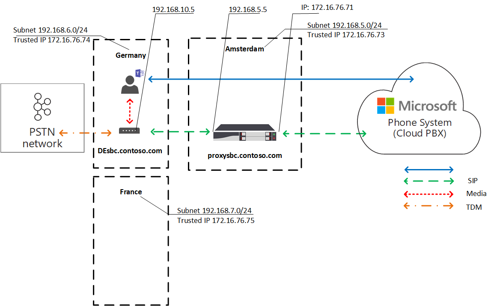
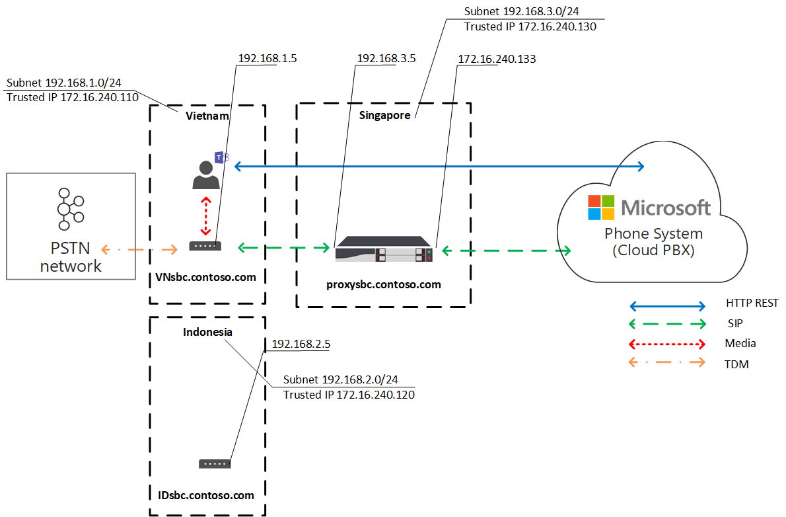

# Pianificare l'ottimizzazione del supporto locale per il routing diretto

La voce PSTN (Public Switched Telephone Network) è considerata un'applicazione business-critical con aspettative elevate per la qualità vocale. Il routing diretto consente di controllare i flussi di traffico multimediali per supportare una varietà di topologie di rete e configurazioni di telefonia locale per varie aziende in tutto il mondo. 

L'ottimizzazione multimediale locale per il routing diretto consente di gestire la qualità vocale in base a:

-   Controllo del flusso del traffico multimediale tra i Teams client e i session border controller (SBC) dei clienti.
-   Mantenere i supporti multimediali locali entro i limiti delle subnet di rete aziendale.
-   Consentire flussi multimediali tra i client Teams e gli SBC, anche se i SBC sono dietro i firewall aziendali con IP privati e non sono visibili direttamente a Microsoft.

L'ottimizzazione multimediale locale supporta due scenari:

- Centralizzazione di tutti i trunk locali tramite una SBC centralizzata connessa al trunk SIP (Session Initiation Protocol) principale, che fornisce servizi di telefonia a tutte le succursali locali dell'azienda.

-   Creazione di una topologia di rete virtuale di SBC, in cui gli SBC nelle succursali locali sono connessi a un SBC proxy centralizzato visibile a Telefono Microsoft System tramite il relativo indirizzo IP esterno. In una topologia di rete virtuale, gli SBC downstream comunicano tramite IP interni e non sono direttamente visibili Sistema telefonico.

Questo articolo descrive le funzionalità delle funzionalità e gli scenari e le soluzioni dei clienti. Per informazioni dettagliate sulla configurazione, vedere [Configurare l'ottimizzazione multimediale locale.](direct-routing-media-optimization-configure.md) 

  > [!NOTE]
  > Se si vuole mantenere i supporti multimediali locali entro i limiti della Intranet, è consigliabile usare l'ottimizzazione dei supporti locali. Se si dispone già di Bypass multimediale e si usano solo gli indirizzi IP pubblici degli SBC, non è obbligatorio passare a Ottimizzazione multimediale locale. È possibile continuare a usare Media Bypass. Per altre informazioni, vedere [Pianificare il bypass multimediale.](direct-routing-plan-media-bypass.md)

Per informazioni sui fornitori SBC che supportano l'ottimizzazione dei supporti locali, vedere [Session Border Controllers Certified for Direct Routing](direct-routing-border-controllers.md).

## Scenari dei clienti supportati

Per questa discussione, si supponga che Contoso esegua più attività in tutto il mondo nel modo seguente. Si noti che le aree Europa e APAC vengono usate solo come esempi. Una società potrebbe avere diverse aree geografiche con requisiti simili.
 
- **In Europa,** Contoso ha uffici in circa 30 paesi. Ogni ufficio ha una propria filiale privata Exchange (PBX). 

  A Contoso è stata offerta un'opzione per centralizzare i trunk in un'unica posizione, Amsterdam, per tutti i 30 uffici europei. Contoso ha distribuito la SBC ad Amsterdam, ha fornito una larghezza di banda sufficiente per eseguire chiamate attraverso la posizione centralizzata, ha connesso un trunk SIP centrale alla posizione centralizzata e ha iniziato a servire tutte le località europee da Amsterdam. 

- **Nell'area APAC,** Contoso ha più uffici in paesi diversi. 

  In molti paesi, l'azienda dispone ancora di trunk di multiplexing (TDM) a divisione temporale nelle succursali locali. La centralizzazione dei trunk TDM non è un'opzione nell'area APAC, quindi non è possibile passare a SIP. Si supponga che nell'area APAC siano presenti più di cinquanta filiali Contoso con centinaia di gateway (SBC). In questo scenario non è possibile associare tutti i gateway all'interfaccia di routing diretto a causa della mancanza di indirizzi IP pubblici e/o di interruzioni internet locali. Inoltre, alcuni paesi impongono requisiti normativi che non possono essere soddisfatti senza la connettività di rete PSTN locale.

In base ai requisiti aziendali, Contoso ha implementato due soluzioni con Ottimizzazione multimediale locale per il routing diretto:

- **In Europa,** tutti i trunk sono centralizzati e i flussi multimediali tra la SBC centrale e gli utenti, in base alla posizione dell'utente. 

  - Se un utente è connesso alla subnet locale di una rete aziendale, ovvero l'utente è interno, i flussi multimediali tra l'IP interno del SBC centrale e il client di Teams dell'utente. 
  
  - Se un utente non rientra nei limiti della rete aziendale, ad esempio se l'utente usa una connessione Internet wireless pubblica, l'utente viene considerato esterno. In questo caso, il flusso multimediale tra l'INDIRIZZO IP esterno della SBC centrale e il client Teams client.

- **Nell'area APAC,** un SBC proxy centralizzato viene associato a Microsoft Direct Routing, che indirizza i supporti tra l'interfaccia Direct Routing e gli SBC downstream nelle succursali locali. 

  Gli SBC a valle nelle succursali locali non sono direttamente visibili al routing diretto in APAC, ma vengono associati usando il cmdlet Set-CSOnlinePSTNGateway per creare una topologia di rete virtuale all'interno di Telefono Microsoft System. I supporti multimediali rimangono sempre locali quando possibile. Gli utenti esterni hanno elementi multimediali che fluino tra il client Teams e l'IP pubblico del proxy SBC.

## SBC centrale con trunk centralizzati

Per creare una soluzione in cui i servizi PSTN vengono forniti a tutte le succursali locali tramite un singolo SBC centrale con un trunk SIP centralizzato connesso, l'amministratore tenant di Contoso abbina un SBC (centralsbc.contoso.com) al servizio; A SBC è connesso un trunk SIP centralizzato. 

- Quando un utente fa parte della rete interna dell'azienda, SBC fornisce l'INDIRIZZO IP interno della SBC per i supporti multimediali. 

- Quando un utente si trova all'esterno della rete aziendale, L'SBC fornisce l'IP esterno (pubblico) dell'SBC.

> [!NOTE]
> Tutti i valori inclusi in esempi, tabelle o diagrammi vengono presentati solo a scopo illustrativo.

Tabella 1. Parametri di rete di esempio per SBC 

| Posizione | SBC FQDN | Subnet interna | NAT esterno (IP attendibile) | Indirizzo IP esterno SBC | Indirizzo IP interno SBC |
|:------------|:-------|:-------|:-------|:-------|:-------|
| Amsterdam | centralsbc.contoso.com | 192.168.5.0/24 | 172.16.76.73 | 172.16.76.71 | 192.168.5.5 |
| Germania | Non distribuito | 192.168.6.0/24 | 172.16.76.74 | Non distribuito |  Non distribuito |
| Francia | Non distribuito | 192.168.7.0/24 | 172.16.76.75 | Non distribuito |  Non distribuito |

### Utente interno

Il diagramma seguente mostra il flusso di traffico quando un utente è connesso alla rete aziendale nella filiale o nel sito dell'utente. 

In locale, l'utente viene assegnato alla filiale locale in Germania. L'utente effettua una chiamata telefonica instradamento diretto tramite Teams.

- Il client Teams comunica con Sistema telefonico direttamente tramite l'API REST, ma il supporto generato durante la chiamata passa all'indirizzo IP interno della SBC centrale. 

- SBC reindirizza il flusso a Sistema telefonico rete PSTN connessa. 

- L'SBC centrale è visibile Sistema telefonico solo tramite l'indirizzo IP esterno. 

Diagramma 1. Flusso di traffico quando l'utente si trova nel sito "home" con un SBC centralizzato e con un trunk SIP centralizzato connesso

### Utente esterno

Il diagramma seguente mostra il flusso di traffico quando un utente non è locale e non è connesso alla rete aziendale, ovvero il dispositivo dell'utente è connesso a Internet tramite un dispositivo mobile o una rete Wi-Fi pubblica. L'utente effettua una chiamata telefonica instradamento diretto tramite Teams:

- Il client Teams dell'utente comunica con Sistema telefonico direttamente tramite l'API REST, ma, in questo caso, i supporti generati durante la chiamata passano all'indirizzo IP esterno della SBC centrale. 

- SBC reindirizza il flusso a Sistema telefonico rete PSTN connessa. 

- L'SBC centrale è visibile Sistema telefonico solo tramite l'indirizzo IP esterno. 

In questo caso, il comportamento è simile se l'utente è locale alla succursale in Germania o a qualsiasi altra succursale. L'utente è considerato esterno perché si trova all'esterno dei confini della rete aziendale.

Diagramma 2. Flusso di traffico quando l'utente è esterno con un SBC centralizzato e con un trunk SIP centralizzato connesso

## Proxy SBC con SBC downstream connessi

Per creare una soluzione in cui i servizi PSTN vengono forniti in tutte le succursali locali dell'area APAC in cui la centralizzazione dei trunk TDM non è un'opzione, l'amministratore contoso abbina un SBC (proxysbc.contoso.com), denominato anche SBC proxy, al servizio di routing diretto. 

In seguito, l'amministratore di Contoso aggiunge alcuni SBC downstream che indicano che è possibile raggiungerlo tramite il proxy SBC proxysbc.contoso.com. Gli SBC a valle non hanno ip pubblici, ma possono essere assegnati alle route vocali. La tabella seguente mostra parametri di rete e configurazione di esempio.

Quando un utente si trova nella succursale locale in cui si trova il SBC a valle, il traffico multimediale fluisce direttamente tra l'utente e lo SBC a valle locale. Se un utente si trova all'esterno dell'ufficio (in una rete Internet pubblica), i supporti multimediali passano dall'utente all'IP pubblico del proxy SBC, che lo delega agli SBC downstream pertinenti.

Tabella 2. Informazioni di rete SBC di esempio

| Posizione | SBC FQDN | Subnet interna | NAT esterno (IP attendibile) | Indirizzo IP esterno SBC  | Indirizzo IP interno SBC |
|:------------|:-------|:-------|:-------|:-------|:-------|
| Vietnam | VNsbc.contoso.com | 192.168.1.0/24 | 172.16.240.110 | Nessuno |  192.168.1.5 |
| Indonesia  | IDsbc.contoso.com | 192.168.2.0/24 | 172.16.240.120 | Nessuno |  192.168.2.5 |
| Singapore | proxysbc.contoso.com |   192.168.3.0/24 | 172.16.240.130 | 172.16.240.133 | 192.168.3.5 |

### Utente interno 

Il diagramma seguente mostra il flusso di traffico di alto livello per lo scenario in cui un utente si trova all'interno dell'ufficio nell'area APAC. L'utente, che è assegnato a una succursale locale in Vietnam e si trova in locale, effettua una chiamata telefonica instradamento diretto tramite Teams. 

- Il client di Teams comunica con Sistema telefonico direttamente tramite l'API REST, ma i supporti generati durante la chiamata passano all'indirizzo IP interno di SBC locale.

- L'SBC locale reindirizza il flusso al proxy SBC di Singapore e alla rete PSTN locale connessa.

-  Il proxy SBC è visibile Sistema telefonico solo tramite l'indirizzo IP esterno e instrada il flusso dalla SBC downstream (in questo caso la SBC locale in Vietnam) a Sistema telefonico. 

- L'SBC a valle nella succursale locale non è visibile a Sistema telefonico direttamente, ma è mappato all'interno della topologia di rete virtuale definita dall'amministratore di Contoso durante la configurazione dell'ottimizzazione dei supporti locali.

> [!NOTE]
> Il comportamento potrebbe essere diverso per gli utenti locali e gli utenti non locali a seconda della modalità di ottimizzazione del supporto locale configurata. 

Per altre informazioni sulle modalità possibili e sul comportamento pertinente, vedere Configurare l'ottimizzazione del supporto locale.

Diagramma 3. Flusso di traffico quando l'utente si trova nella rete "home" con un SBC proxy e con SBC downstream connessi 

### Utente esterno

Il diagramma seguente mostra il flusso di traffico quando un utente si trova all'esterno dei limiti della rete aziendale. L'utente non è locale (non rientra nei limiti della rete aziendale). L'utente effettua una chiamata telefonica instradamento diretto tramite Teams a un numero di telefono in Vietnam. 

- Il client Teams dell'utente comunica con Sistema telefonico direttamente tramite l'API REST, ma il supporto generato durante la chiamata passa prima all'indirizzo IP esterno del proxy SBC a Singapore. 

- In base alla configurazione  e ai criteri vocali (per informazioni dettagliate, vedere Configurare l'ottimizzazione multimediale locale), il proxy SBC reindirizza il flusso alla SBC downstream in Vietnam. 

- L'SBC a valle in Vietnam reindirizza il flusso alla rete PSTN locale connessa. 

- Il proxy SBC è visibile Sistema telefonico solo tramite l'indirizzo IP esterno.

-  L'SBC a valle nella succursale locale non è visibile direttamente a Sistema telefonico, ma è mappato all'interno della topologia di rete virtuale definita dall'amministratore di Contoso durante la configurazione dell'ottimizzazione del supporto locale. Nell'esempio l'utente è considerato esterno perché si trova all'esterno dei confini della rete aziendale. 

Diagramma 4. Flusso di traffico quando l'utente è esterno con un SBC proxy e con SBC downstream connessi

## Modalità di ottimizzazione del contenuto multimediale locale

L'ottimizzazione multimediale locale supporta due modalità:

- **Modalità 1: ignora sempre**. In questo caso, se l'utente è interno, il contenuto multimediale fluirà attraverso l'indirizzo IP interno di SBC a valle locale, indipendentemente dalla posizione effettiva dell'utente interno. ad esempio all'interno della stessa filiale in cui si trova la SBC a valle o in un'altra filiale.  

- **Modalità 2: solo per gli utenti locali**. In questa modalità, i supporti verranno indirizzati direttamente all'indirizzo IP interno di SBC a valle locale solo quando vengono generati dall'utente interno che si trova nella stessa succursale di SBC a valle. 

Per distinguere tra le modalità di ottimizzazione dei supporti multimediali locali, l'amministratore del tenant deve impostare il parametro -BypassMode su 'Always' o 'OnlyForLocalUsers' per ogni SBC usando il cmdlet Set-CSonlinePSTNGateway. Per altre informazioni, vedere [Configurare l'ottimizzazione multimediale locale.](direct-routing-media-optimization-configure.md)  

> [!NOTE]
> Quando gli utenti sono interni, è necessaria la connettività multimediale tra l'utente e SBC tramite l'indirizzo IP **interno.** In questo caso non esiste alcun fallback agli inoltri di trasporto pubblico per i supporti multimediali, in quanto SBC fornirà un indirizzo IP interno per la connettività multimediale. 

### Modalità 1: ignora sempre

Se si ha una buona connessione tra le succursali, la modalità consigliata è Ignora sempre.
 
Si supponga ad esempio che una società abbia un trunk SIP centralizzato ad Amsterdam, che serve 30 paesi e abbia una buona connettività tra tutti i 30 siti e gli utenti locali. C'è anche una filiale in Germania in cui è distribuito un SBC locale.

L'SBC in Germania può essere configurato in modalità "Ignora sempre". Gli utenti, indipendentemente dalla loro posizione, si connetteranno all'SBC direttamente tramite l'indirizzo IP interno dell'SBC ,ad esempio dalla Francia alla Germania. Per informazioni di riferimento, vedere il diagramma seguente.

Di seguito sono descritti due scenari:

- Scenario 1. L'utente si trova nella stessa posizione dell'SBC definito nei criteri di routing vocale online.

- Scenario 2. L'utente e i gateway sono in siti diversi.

#### Scenario 1. L'utente si trova nella stessa posizione dell'SBC definito nei criteri di routing vocale online

L'SBC di Amsterdam è configurato per essere un SBC proxy per un SBC downstream locale in Germania. L'utente si trova in Germania all'interno della stessa subnet della rete aziendale dell'SBC locale. Entrambi gli SBC (proxy e downstream) sono configurati per la modalità Ignora sempre. I criteri di routing vocale online specificano che in caso di chiamate in Germania (con il codice di area +49) devono essere instradati all'SBC locale in Germania. Tutte le altre chiamate, e nel caso in cui la SBC in Germania non riesca, le chiamate in Germania devono essere instradati al proxy SBC di Amsterdam. La tabella seguente riepiloga la configurazione di esempio. 

Tabella 3. Configurazione di esempio per lo scenario 1

| Posizione fisica dell'utente | L'utente effettua una chiamata a un numero | Criteri di routing vocale online | Modalità configurata per SBC | Elementi Flow | 
|:------------|:-------|:-------|:-------|:-------|
| Germania | +49 1 437 2800 | Priorità 1: ^ \+ 49(\d {8} )$ -DEsbc.contoso.com Priorità 2: .* - proxysbc.contoso.com| DEsbc.contoso.com - Ignora sempre  proxysbc.contoso.com – Ignora sempre | Teams Utenti <-> DEsbc.contoso.com |

Il diagramma seguente mostra il flusso di traffico di alto livello per l'utente interno in Germania che effettua una chiamata telefonica instradamento diretto tramite Teams al numero in Germania. 

- Il client di Teams comunica con Sistema telefonico direttamente tramite l'API REST. 

- Il supporto generato durante la chiamata passa all'indirizzo IP interno della SBC locale. 

- L'SBC locale reindirizza il flusso al proxy SBC di Amsterdam e alla rete PSTN locale connessa. 

- Il proxy SBC è visibile Sistema telefonico solo tramite l'indirizzo IP esterno e instrada il flusso dalla SBC downstream (in questo caso, la SBC locale in Germania) a Sistema telefonico. 

- L'SBC a valle nella succursale locale non è visibile a Sistema telefonico direttamente, ma è mappato all'interno della topologia di rete virtuale definita dall'amministratore di Contoso durante la configurazione dell'ottimizzazione del supporto locale.

Diagramma 5.  Flusso di traffico in modalità "Ignora sempre" e l'utente si trova nel sito "home"

#### Scenario 2: l'utente e i gateway sono in siti diversi

L'SBC di Amsterdam è configurato per essere un SBC proxy per un SBC downstream locale in Germania. Entrambi gli SBC (proxy e downstream) sono configurati per la modalità Ignora sempre. L'utente interno in Francia, che si trova nella filiale locale, sta effettuando una chiamata instradamento diretto verso la Germania. I criteri di routing vocale online specificano che le chiamate verso la Germania (con il codice di area +49) devono essere instradati all'SBC locale in Germania. Tutte le altre chiamate e, nel caso in cui la SBC in Germania non riesca, tutte le chiamate in Germania devono essere instradati al proxy SBC di Amsterdam. La tabella seguente riepiloga la configurazione di esempio. 

Tabella 4. Configurazione di esempio per lo scenario 2

| Posizione fisica dell'utente | L'utente effettua una chiamata a un numero | Criteri di routing vocale online | Modalità configurata per SBC | Elementi Flow | 
|:------------|:-------|:-------|:-------|:-------|
| Francia | +49 1 437 2800 | Priorità 1: ^ \+ 49(\d {8} )$ -DEsbc.contoso.com  Priorità 2: .* - proxysbc.contoso.com |  DEsbc.contoso.com – Ignora sempre proxysbc.contoso.com – Ignora sempre | Teams Utenti <- > DEsbc.contoso.com  |

Il diagramma seguente mostra il flusso di traffico di alto livello quando l'utente tedesco interno che si trova in Francia effettua una chiamata telefonica instradamento diretto tramite Teams al numero in Germania. 

- Il client Teams comunica con i Sistema telefonico direttamente tramite l'API REST.

- I supporti generati durante la chiamata passano direttamente all'SBC nell'indirizzo IP interno della Germania. 

- SBC in Germania reindirizza il flusso al proxy SBC di Amsterdam e alla rete PSTN locale connessa. 

Diagramma 6.  Flusso di traffico con modalità "Ignora sempre" e l'utente non si trova nel sito "home", ma nella rete interna

### Modalità 2: solo per gli utenti locali

Se ci sono connessioni non buone tra le filiali locali, ma buone connessioni tra ogni succursale locale e ufficio regionale, la modalità consigliata è "Solo per gli utenti locali".

Ad esempio, nell'area APAC si supponga che Contoso abbia più uffici in paesi diversi. Per molti paesi, il passaggio a SIP non è possibile perché l'azienda ha ancora trunk TDM in molte filiali locali. La centralizzazione dei trunk TDM non è un'opzione nell'area APAC. Inoltre, ci sono più di cinquanta filiali Contoso nell'area APAC con centinaia di gateway (SBC). 

Per creare una soluzione in cui i servizi PSTN vengono forniti in tutte le succursali locali nell'area APAC in cui la centralizzazione dei trunk TDM non è un'opzione, l'amministratore contoso abbina un SBC regionale a Singapore come SBC proxy al servizio di routing diretto. La connessione diretta tra le succursali locali non è buona, ma esiste una buona connessione tra ogni filiale locale e la filiale SBC regionale a Singapore. Per la SBC regionale, l'amministratore sceglie la modalità "Ignora sempre" e per gli SBC downstream locali, l'amministratore sceglie la modalità "Solo per gli utenti locali".

Di seguito sono descritti due scenari:

- Scenario 1. L'utente si trova nella stessa posizione dell'SBC definito nei criteri di routing vocale online

- Scenario 2. L'utente e i gateway sono in siti diversi

#### Scenario 1. L'utente si trova nella stessa posizione dell'SBC definito nei criteri di routing vocale online

Si supponga che la SBC di Singapore sia configurata come proxy SBC per gli SBC downstream locali in Vietnam e Indonesia. L'utente si trova in Vietnam nella stessa posizione dell'SBC locale. I criteri di routing vocale online specificano che le chiamate in Vietnam (con il codice di area +84) devono essere instradati all'SBC locale in Vietnam. Tutte le altre chiamate e, se la SBC in Vietnam ha esito negativo, le chiamate in Vietnam devono essere instradati al proxy SBC di Singapore. La tabella seguente riepiloga la configurazione di esempio. 

Tabella 5. Configurazione di esempio per la modalità "Solo per utenti locali" Scenario 1

| Posizione fisica dell'utente | L'utente effettua una chiamata a un numero | Criteri di routing vocale online | Modalità configurata per SBC | Elementi Flow | 
|:------------|:-------|:-------|:-------|:-------|
| Vietnam | +84 4 3926 3000 | Priorità 1: ^ \+ 84(\d {9} )$ -VNsbc.contoso.com  Priorità 2: .* - proxysbc.contoso.com | VNsbc.contoso.com - Solo per gli utenti locali   proxysbc.contoso.com – Ignora sempre | Teams Utenti <-> VNsbc.contoso.com |

Nel diagramma seguente, un utente assegnato alla succursale locale in Vietnam, mentre è in sede, effettua una chiamata telefonica instradamento diretto tramite Teams. 

- Il client Teams comunica con i Sistema telefonico direttamente tramite l'API REST. 

- Il contenuto multimediale generato durante la chiamata passa all'indirizzo IP interno della SBC locale. 

- L'SBC locale reindirizza il flusso al proxy SBC di Singapore e alla rete PSTN locale connessa. 

- Il proxy SBC è visibile Sistema telefonico solo tramite l'indirizzo IP esterno e instrada il flusso dalla SBC downstream (in questo caso, la SBC locale in Vietnam) a Sistema telefonico. 

- Il database SBC a valle nella succursale locale non è visibile Sistema telefonico direttamente, ma è mappato all'interno della topologia della rete virtuale.

Diagramma 7. Flusso di traffico in modalità "Solo per utenti locali" e l'utente si trova nel sito "home"

#### Scenario 2. L'utente e i gateway sono in siti diversi

Si supponga che la SBC di Singapore sia configurata come proxy SBC per gli SBC downstream locali in Vietnam e Indonesia. L'utente interno in Indonesia, che si trova nella succursale locale, sta effettuando una chiamata instradamento diretto in Vietnam. I criteri di routing vocale online specificano che le chiamate verso il Vietnam (con il codice di area +84) devono essere instradati all'SBC locale in Vietnam. Tutte le altre chiamate e, nel caso in cui la SBC in Vietnam non riesca, le chiamate verso il Vietnam devono essere instradati al proxy SBC di Singapore. Il proxy SBC di Singapore è impostato sulla modalità "Ignora sempre" e la modalità SBC locale in Vietnam è impostata sulla modalità "Solo per gli utenti locali". La tabella seguente riepiloga la configurazione di esempio. 

Tabella 6. Configurazione utente

| Posizione fisica dell'utente | L'utente effettua una chiamata a un numero | Criteri di routing vocale online | Modalità configurata per SBC | Elementi Flow | 
|:------------|:-------|:-------|:-------|:-------|
| Indonesia | +84 4 3926 3000 | Priorità 1: ^ \+ 84(\d {9} )$ -VNsbc.contoso.com   Priorità 2: .* - proxysbc.contoso.com |VNsbc.contoso.com - Solo per gli utenti locali   proxysbc.contoso.com – Ignora sempre | Teams Utenti <-> proxysbc.contoso.com <-> VNsbc.contoso.com |

Nel diagramma seguente, l'utente interno, mentre è locale nella succursale indonesiana, effettua una chiamata telefonica instradamento diretto tramite Teams a un numero in Vietnam. 

- Il client Teams comunica con i Sistema telefonico direttamente tramite l'API REST.

- Il supporto generato durante la chiamata passa prima all'indirizzo IP interno del proxy SBC. 

- Il proxy SBC di Singapore reindirizza il flusso all'indirizzo IP interno della SBC downstream in Vietnam e a Sistema telefonico. 

- L'SBC downstream in Vietnam instrada il flusso alla rete PSTN locale connessa. 

- Il proxy SBC è visibile Sistema telefonico solo tramite l'indirizzo IP esterno.

- Gli SBC a valle nelle succursali locali non sono visibili Sistema telefonico direttamente, ma sono mappati all'interno della topologia della rete virtuale.

Diagramma 8.  Flusso di traffico in modalità "Solo per utenti locali" e l'utente non si trova nel sito "home", ma nella rete interna

## Problemi noti

Di seguito è riportato un elenco dei problemi noti attualmente presenti in Ottimizzazione file multimediali locali. Microsoft sta lavorando per risolvere questi problemi.

| Problema | Soluzione alternativa |
| :--- | :--- |
| Teams client non viene identificato  come interno quando l'INDIRIZZO IP pubblico del client Teams corrisponde all'elenco indirizzi IP attendibili del cliente. | L'ottimizzazione del supporto locale richiede che la subnet Teams client corrisponda a una subnet di rete configurata [dal tenant](/powershell/module/skype/new-cstenantnetworksubnet)|
| Le escalation delle chiamate comportano chiamate eliminate quando il client Teams viene identificato come interno.| Disabilitare l'ottimizzazione del supporto locale nell'SBC di routing diretto.|
| Le escalation delle chiamate da 1 a 1 chiamata tra clienti interni a chiamate multiparty con clienti/risorse esterni causano chiamate eliminate | Lavoro in corso su una correzione. In alternativa, disabilitare Ottimizzazione multimediale locale nell'SBC di routing diretto.|
| Teams utente mette la chiamata in attesa. Musica viene riprodotto all'estremità PSTN e l'ottimizzazione multimediale locale funziona. L Teams utente riprende la chiamata. La chiamata a PSTN riprende, ma l'ottimizzazione dei supporti locali non funziona e la chiamata continua tramite SBC centrale (proxy) | Quando un utente parcheggia una chiamata per avviare la musica in attesa (MoH), viene riassegnata da 1:1 a una chiamata multiparty da parte del Controller di chiamata per richiamare Media Controller e Processore multimediale (che funge da mixer AVMCU) attraverso cui MoH raggiunge un utente che è stato messo in attesa. La de-escalation a una chiamata 1:1 dopo la ripresa della chiamata non viene mai eseguita come da progettazione. Disabilitare l'ottimizzazione del supporto locale nell'SBC di routing diretto.|
