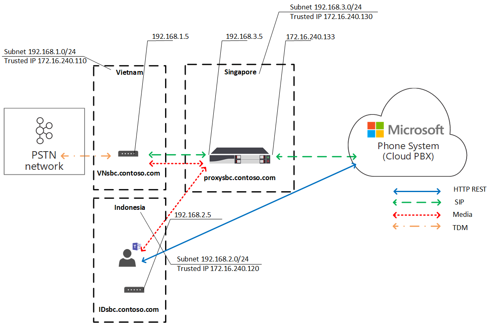

# Ottimizzazione del supporto locale per il routing direttoLocal Media Optimization for Direct Routing

La voce PSTN (Public Switched Telephone Network) è considerata un'applicazione business-critical con aspettative elevate per la qualità vocale.Public Switched Telephone Network (PSTN) voice is considered a business-critical application with high expectations for voice quality. Il routing diretto consente di controllare i flussi di traffico multimediali per supportare una varietà di topologie di rete e configurazioni di telefonia locale per varie aziende in tutto il mondo.Direct Routing lets you control media traffic flows to accommodate a multitude of network topologies and local telephony setups for various enterprises all over the world. 

L'ottimizzazione multimediale locale per il routing diretto consente di gestire la qualità vocale in base a:Local Media Optimization for Direct Routing lets you manage voice quality by:

-   Controllo del flusso del traffico multimediale tra i Teams client e i session border controller (SBC) dei clienti.Controlling how media traffic flows between the Teams clients and the customer Session Border Controllers (SBCs).
-   Mantenere i supporti multimediali locali entro i limiti delle subnet di rete aziendale.Keeping media local within the boundaries of corporate network subnets.
-   Consentire flussi multimediali tra i client Teams e gli SBC, anche se i SBC sono dietro i firewall aziendali con IP privati e non sono visibili direttamente a Microsoft.Allowing media streams between the Teams clients and the SBCs even if the SBCs are behind corporate firewalls with private IPs and not visible to Microsoft directly.

L'ottimizzazione multimediale locale supporta due scenari:Local Media Optimization supports two scenarios:

- Centralizzazione di tutti i trunk locali tramite un SBC centralizzato connesso al trunk SIP (Session Initiation Protocol) principale, che fornisce servizi di telefonia a tutte le succursali locali dell'azienda.Centralization of all local trunks through a centralized SBC connected to the main Session Initiation Protocol (SIP)trunk--providing telephony services to all local branch offices of the company.

-   Creazione di una topologia di rete virtuale di SBC, in cui gli SBC nelle succursali locali sono connessi a un SBC proxy centralizzato visibile a Telefono Microsoft System tramite l'indirizzo IP esterno.Building a virtual network topology of SBCs--where the SBCs in the local branch offices are connected to a centralized proxy SBC that is visible to, and communicating with, Microsoft Phone System through its external IP address. In una topologia di rete virtuale, gli SBC downstream comunicano tramite IP interni e non sono direttamente visibili Sistema telefonico.In a virtual network topology, downstream SBCs are communicating through internal IPs and are not directly visible to Phone System.

Questo articolo descrive le funzionalità delle funzionalità e gli scenari e le soluzioni dei clienti.This article describes feature functionality, and customer scenarios and solutions. Per informazioni dettagliate sulla configurazione, vedere [Configurare l'ottimizzazione multimediale locale.](direct-routing-media-optimization-configure.md)For details on configuration, see [Configure Local Media Optimization](direct-routing-media-optimization-configure.md). 

  > [!NOTE]
  > Se si vuole mantenere i supporti multimediali locali entro i limiti della Intranet, è consigliabile usare l'ottimizzazione dei supporti locali.If you want to keep media local within the boundaries of your intranet, Local Media Optimization is recommended. Se si ha già Media Bypass e si usano solo gli indirizzi IP pubblici degli SBC, non è obbligatorio passare a Ottimizzazione multimediale locale.If you already have Media Bypass and you use only the public IP addresses of your SBCs, it is not mandatory to move to Local Media Optimization. È possibile continuare a usare Media Bypass.You can continue to use Media Bypass. Per altre informazioni, vedere [Pianificare il bypass multimediale.](direct-routing-plan-media-bypass.md)For more information, see [Plan Media Bypass](direct-routing-plan-media-bypass.md).

## Scenari dei clienti supportatiSupported customer scenarios

Per questa discussione, si supponga che Contoso esegua più attività in tutto il mondo nel modo seguente.For this discussion, assume that Contoso runs multiple businesses across the globe as follows. Si noti che le aree Europa e APAC vengono usate solo come esempi.(Note that Europe and APAC regions are used as examples only. Una società potrebbe avere diverse aree geografiche con requisiti simili).A company might have several different regions with similar requirements.)
 
- **In Europa,** Contoso ha uffici in circa 30 paesi.**In Europe**, Contoso has offices in approximately 30 countries. Ogni ufficio ha una propria filiale privata Exchange (PBX).Each office has its own Private Branch Exchange (PBX). 

  A Contoso è stata offerta un'opzione per centralizzare i trunk in un'unica posizione, Amsterdam, per tutti i 30 uffici europei.Contoso was offered an option to centralize the trunks in one location--Amsterdam--for all 30 European offices. Contoso ha distribuito la SBC ad Amsterdam, ha fornito una larghezza di banda sufficiente per eseguire chiamate attraverso la posizione centralizzata, ha connesso un trunk SIP centrale alla posizione centralizzata e ha iniziato a servire tutte le località europee da Amsterdam.Contoso deployed the SBC in Amsterdam, provided enough bandwidth to run calls through the centralized location, connected a central SIP trunk to the centralized location, and started serving all European locations from Amsterdam. 

- **Nell'area APAC,** Contoso ha più uffici in paesi diversi.**In the APAC region**, Contoso has multiple offices in different countries. 

  In molti paesi, l'azienda dispone ancora di trunk TDM (Time Division Multiplexing) nelle succursali locali.In many countries, the company still has time-division multiplexing (TDM) trunks in local branch offices. La centralizzazione dei trunk TDM non è un'opzione nell'area APAC, quindi non è possibile passare a SIP.Centralization of the TDM trunks is not an option in the APAC region, so switching to SIP is not possible. Si supponga che nell'area APAC siano presenti più di cinquanta filiali Contoso con centinaia di gateway (SBC).Assume there are more than fifty Contoso branch offices across the APAC region with hundreds of gateways (SBCs). In questo scenario non è possibile associare tutti i gateway all'interfaccia di routing diretto a causa della mancanza di indirizzi IP pubblici e/o di interruzioni internet locali.In this scenario, it is not possible to pair all gateways to the Direct Routing interface because of a lack of public IP addresses and/or local internet breakouts. Inoltre, alcuni paesi impongono requisiti normativi che non possono essere soddisfatti senza la connettività di rete PSTN locale.In addition, some countries impose regulatory requirements that cannot be fulfilled without having local PSTN network connectivity.

In base ai requisiti aziendali, Contoso ha implementato due soluzioni con Ottimizzazione multimediale locale per il routing diretto:Based on their business requirements, Contoso implemented two solutions with Local Media Optimization for Direct Routing:

- **In Europa,** tutti i trunk sono centralizzati e i flussi multimediali tra la SBC centrale e gli utenti, in base alla posizione dell'utente.**In Europe**, all trunks are centralized and media flows between the central SBC and the users, based on the user location. 

  - Se un utente è connesso alla subnet locale di una rete aziendale, ovvero l'utente è interno, i flussi multimediali tra l'INDIRIZZO IP interno dell'SBC centrale e il client di Teams dell'utente.If a user is connected to the local subnet of a corporate network (that is, the user is internal), media flows between the internal IP of the central SBC and the user’s Teams client. 
  
  - Se un utente è esterno ai limiti della rete aziendale, ad esempio se l'utente usa una connessione Internet wireless pubblica, l'utente viene considerato esterno.If a user is outside the boundaries of the corporate network--for example, if the user is using a public wireless Internet connection--then the user is considered to be external. In questo caso, il flusso multimediale tra l'IP esterno della SBC centrale e il client Teams client.In this case, the media flows between the external IP of the central SBC and the Teams client.

- **Nell'area APAC,** un SBC proxy centralizzato viene associato a Microsoft Direct Routing, che indirizza i supporti tra l'interfaccia Direct Routing e gli SBC downstream nelle succursali locali.**In the APAC region**, a centralized proxy SBC is paired to Microsoft Direct Routing, which directs media between the Direct Routing interface and the downstream SBCs in local branch offices. 

  Gli SBC a valle nelle succursali locali non sono direttamente visibili al routing diretto in APAC, ma vengono associati usando il cmdlet Set-CSOnlinePSTNGateway per creare una topologia di rete virtuale all'interno di Telefono Microsoft System.The downstream SBCs in the local branch offices are not directly visible to Direct Routing in APAC, but they are paired by using the Set-CSOnlinePSTNGateway cmdlet to create a virtual network topology within Microsoft Phone System. I supporti multimediali rimangono sempre locali quando possibile.Media always stays local when possible. Gli utenti esterni hanno elementi multimediali che fluino tra il client Teams e l'IP pubblico del proxy SBC.External users have media flowing between the Teams client and the public IP of the proxy SBC.

## SBC centrale con trunk centralizzatiCentral SBC with centralized trunks

Per creare una soluzione in cui i servizi PSTN vengono forniti a tutte le succursali locali tramite un singolo SBC centrale con un trunk SIP centralizzato connesso, l'amministratore tenant di Contoso abbina un SBC (centralsbc.contoso.com) al servizio; A SBC è connesso un trunk SIP centralizzato.To build a solution where PSTN services are provided to all local branch offices through a single central SBC with a connected centralized SIP trunk, the Contoso tenant administrator pairs one SBC (centralsbc.contoso.com) to the service; the SBC has a centralized SIP trunk connected to it. 

- Quando un utente fa parte della rete interna dell'azienda, SBC fornisce l'INDIRIZZO IP interno della SBC per i supporti multimediali.When a user is in the internal network of the company, the SBC provides the internal IP of the SBC for media. 

- Quando un utente si trova all'esterno della rete aziendale, L'SBC fornisce l'IP esterno (pubblico) dell'SBC.When a user is outside of the corporate network, the SBC provides the external (public) IP of the SBC.

Nota: tutti i valori inclusi in esempi, tabelle o diagrammi vengono presentati solo a scopo illustrativo.Note: All values within examples, tables, or diagrams are presented for illustration purposes only.

Tabella 1.Table 1. Parametri di rete di esempio per SBCExample network parameters for SBCs 

| PosizioneLocation | SBC FQDNSBC FQDN | Subnet internaInternal subnet | NAT esterno (IP attendibile)External NAT (Trusted IP) | Indirizzo IP esterno SBCSBC external IP address | Indirizzo IP interno SBCSBC internal IP address |
|:------------|:-------|:-------|:-------|:-------|:-------|
| AmsterdamAmsterdam | centralsbc.contoso.comcentralsbc.contoso.com | 192.168.5.0/24192.168.5.0/24 | 172.16.76.73172.16.76.73 | 172.16.76.71172.16.76.71 | 192.168.5.5192.168.5.5 |
| GermaniaGermany | Non distribuitoNot deployed | 192.168.6.0/24192.168.6.0/24 | 172.16.76.74172.16.76.74 | Non distribuitoNot deployed |  Non distribuitoNot deployed |
| FranciaFrance | Non distribuitoNot deployed | 192.168.7.0/24192.168.7.0/24 | 172.16.76.75172.16.76.75 | Non distribuitoNot deployed |  Non distribuitoNot deployed ||||

### Utente internoInternal user

Il diagramma seguente mostra il flusso di traffico quando un utente è connesso alla rete aziendale nella filiale o nel sito dell'utente.The following diagram shows the traffic flow when a user is connected to the corporate network in the user’s home branch office or site. 

In locale, l'utente viene assegnato alla filiale locale in Germania.While on premises, the user is assigned to the local branch office in Germany. L'utente effettua una chiamata telefonica instradamento diretto tramite Teams.The user makes a Direct Routing phone call through Teams.

- Il client Teams dell'utente comunica con Sistema telefonico direttamente tramite l'API REST, ma il supporto generato durante la chiamata passa all'indirizzo IP interno della SBC centrale.The user’s Teams client communicates to Phone System directly through the REST API, but the media generated during the call flows to the central SBC’s internal IP address. 

- SBC reindirizza il flusso a Sistema telefonico rete PSTN connessa.The SBC redirects the flow to Phone System and the connected PSTN network. 

- L'SBC centrale è visibile Sistema telefonico solo tramite l'indirizzo IP esterno.The central SBC is visible to Phone System through the external IP address only. 

Diagramma 1.Diagram 1. Flusso di traffico quando l'utente si trova nel sito "home" con un SBC centralizzato e con un trunk SIP centralizzato connessoTraffic flow when the user is in the ‘home’ site with a centralized SBC and with a connected centralized SIP Trunk

### Utente esternoExternal user

Il diagramma seguente mostra il flusso di traffico quando un utente non è locale e non è connesso alla rete aziendale, ovvero il dispositivo dell'utente è connesso a Internet tramite un dispositivo mobile o una rete Wi-Fi pubblica.The following diagram shows the traffic flow when a user is not on premises and is not connected to the corporate network (that is, the user’s device is connected to the Internet through a mobile device or public Wi-Fi). L'utente effettua una chiamata telefonica instradamento diretto tramite Teams:The user makes a Direct Routing phone call through Teams:

- Il client Teams dell'utente comunica con Sistema telefonico direttamente tramite l'API REST, ma, in questo caso, i supporti generati durante la chiamata passano all'indirizzo IP esterno della SBC centrale.The user’s Teams client communicates to Phone System directly through the REST API, but, in this case, the media generated during the call flows to the central SBC’s external IP address. 

- SBC reindirizza il flusso a Sistema telefonico rete PSTN connessa.The SBC redirects the flow to Phone System and the connected PSTN network. 

- L'SBC centrale è visibile Sistema telefonico solo tramite l'indirizzo IP esterno.The central SBC is visible to Phone System through the external IP address only. 

In questo caso, il comportamento è simile se l'utente è locale alla succursale in Germania o a qualsiasi altra succursale.In this case, the behavior is similar whether the user is local to the branch office in Germany or to any other branch office. L'utente è considerato esterno perché si trova all'esterno dei confini della rete aziendale.The user is considered external because the user is outside the boundaries of the corporate network.

Diagramma 2.Diagram 2. Flusso di traffico quando l'utente è esterno con un SBC centralizzato e con un trunk SIP centralizzato connessoTraffic flow when the user is external with a centralized SBC and with a connected centralized SIP Trunk

## Proxy SBC con SBC downstream connessiProxy SBC with connected downstream SBCs

Per creare una soluzione in cui i servizi PSTN vengono forniti in tutte le succursali locali dell'area APAC in cui la centralizzazione dei trunk TDM non è un'opzione, l'amministratore di Contoso abbina un SBC (proxysbc.contoso.com), detto anche SBC proxy, al servizio di routing diretto.To build a solution where PSTN services are provided in all local branch offices in the APAC region where centralization of the TDM trunks is not an option, the Contoso administrator pairs one SBC (proxysbc.contoso.com), also called the proxy SBC, to the Direct Routing service. 

In seguito, l'amministratore di Contoso aggiunge alcuni SBC downstream che indicano che è possibile raggiungerlo tramite il proxy SBC proxysbc.contoso.com.Afterwards, the Contoso administrator adds some downstream SBCs indicating that they can be reached through the proxy SBC proxysbc.contoso.com. Gli SBC a valle non hanno ip pubblici, ma possono essere assegnati alle route vocali.Downstream SBCs do not have public IPs, however, they can be assigned to voice routes. La tabella seguente mostra parametri di rete e configurazione di esempio.The table below shows example network parameters and configuration.

Quando un utente si trova nella succursale locale in cui si trova il SBC a valle, il traffico multimediale fluisce direttamente tra l'utente e lo SBC a valle locale.When a user is in the local branch office where the downstream SBC is located, the media traffic flows between the user and the local downstream SBC directly. Se un utente si trova all'esterno dell'ufficio (su internet pubblico), i supporti multimediali passano dall'utente all'IP pubblico del proxy SBC, che lo delega agli SBC downstream pertinenti.If a user is outside of the office (on a public internet), the media flows from the user to the public IP of the Proxy SBC, which proxies it to the relevant downstream SBC(s).

Tabella 2.Table 2. Informazioni di rete SBC di esempioExample SBC network information

| PosizioneLocation | SBC FQDNSBC FQDN | Subnet internaInternal subnet | NAT esterno (IP attendibile)External NAT (Trusted IP) | Indirizzo IP esterno SBCSBC external IP address  | Indirizzo IP interno SBCSBC internal IP address |
|:------------|:-------|:-------|:-------|:-------|:-------|
| VietnamVietnam | VNsbc.contoso.comVNsbc.contoso.com | 192.168.1.0/24192.168.1.0/24 | 172.16.240.110172.16.240.110 | NessunoNone |  192.168.1.5192.168.1.5 |
| IndonesiaIndonesia  | IDsbc.contoso.comIDsbc.contoso.com | 192.168.2.0/24192.168.2.0/24 | 172.16.240.120172.16.240.120 | NessunoNone |  192.168.2.5192.168.2.5 |
| SingaporeSingapore | proxysbc.contoso.comproxysbc.contoso.com |   192.168.3.0/24192.168.3.0/24 | 172.16.240.130172.16.240.130 | 172.16.240.133172.16.240.133 | 192.168.3.5192.168.3.5 |

### Utente internoInternal user 

Il diagramma seguente mostra il flusso di traffico di alto livello per lo scenario in cui un utente si trova all'interno dell'ufficio nell'area APAC.The following diagram shows the high-level traffic flow for the scenario when a user is inside the office in the APAC region. L'utente, che è assegnato a una succursale locale in Vietnam e si trova in locale, effettua una chiamata telefonica instradamento diretto tramite Teams.The user, who is assigned to a local branch office in Vietnam, and is on premises, makes a Direct Routing phone call through Teams. 

- Il client di Teams comunica con Sistema telefonico direttamente tramite l'API REST, ma i supporti generati durante la chiamata passano all'indirizzo IP interno di SBC locale.The user’s Teams client communicates with Phone System directly through the REST API, but media generated during the call flows to local SBC’s internal IP address.

- L'SBC locale reindirizza il flusso al proxy SBC di Singapore e alla rete PSTN locale connessa.The local SBC redirects the flow to the proxy SBC in Singapore and to the connected local PSTN network.

-  Il proxy SBC è visibile Sistema telefonico solo tramite l'indirizzo IP esterno e instrada il flusso dalla SBC downstream (in questo caso la SBC locale in Vietnam) a Sistema telefonico.The proxy SBC is visible to Phone System through the external IP address only and routes the flow from the downstream SBC (in this case the local SBC in Vietnam) to Phone System. 

- L'SBC a valle nella succursale locale non è visibile a Sistema telefonico direttamente, ma è mappato all'interno della topologia di rete virtuale definita dall'amministratore di Contoso durante la configurazione dell'ottimizzazione del supporto locale.The downstream SBC in the local branch office is not visible to Phone System directly but is mapped within the virtual network topology that is defined by the Contoso administrator while setting up Local Media Optimization.

Nota: il comportamento potrebbe essere diverso per gli utenti locali e per gli utenti non locali a seconda della modalità di ottimizzazione del supporto locale configurata.Note: The behavior might be different for local users and non-local users depending on the configured Local Media Optimization mode. 

Per altre informazioni sulle modalità possibili e sul comportamento pertinente, vedere Configurare l'ottimizzazione del supporto locale.For more information on possible modes and relevant behavior, see Configure Local Media Optimization.

Diagramma 3.Diagram 3. Flusso di traffico quando l'utente si trova nella rete "home" con un SBC proxy e con SBC downstream connessiTraffic flow when the user is in the “home” network with a proxy SBC and with connected downstream SBCs 

### Utente esternoExternal user

Il diagramma seguente mostra il flusso di traffico quando un utente si trova all'esterno dei limiti della rete aziendale.The following diagram shows the traffic flow when a user is outside of the corporate network boundaries. L'utente non è locale (non rientra nei limiti della rete aziendale).The user is not on premises (is not within the boundaries of corporate network). L'utente effettua una chiamata telefonica instradamento diretto tramite Teams a un numero di telefono in Vietnam.The user makes a Direct Routing phone call through Teams to a phone number in Vietnam. 

- Il client di Teams comunica con Sistema telefonico direttamente tramite l'API REST, ma il supporto generato durante la chiamata passa prima all'indirizzo IP esterno del proxy SBC a Singapore.The user’s Teams client communicates with Phone System directly through the REST API, but the  media generated during the call flows first to the external IP address of the proxy SBC in Singapore. 

- In base alla configurazione  e ai criteri vocali (per informazioni dettagliate, vedere Configurare l'ottimizzazione multimediale locale), il proxy SBC reindirizza il flusso alla SBC downstream in Vietnam.Based on configuration and voice policies (see [Configure Local Media Optimization](direct-routing-media-optimization-configure.md) for details), the proxy SBC redirects the flow to the downstream SBC in Vietnam. 

- La SBC a valle in Vietnam reindirizza il flusso alla rete PSTN locale connessa.The downstream SBC in Vietnam redirects the flow to the connected local PSTN network. 

- Il proxy SBC è visibile solo Sistema telefonico tramite l'indirizzo IP esterno.The proxy SBC is visible to Phone System through the external IP address only.

-  L'SBC a valle nella succursale locale non è visibile Sistema telefonico direttamente, ma è mappato all'interno della topologia di rete virtuale definita dall'amministratore di Contoso durante la configurazione dell'ottimizzazione del supporto locale.The downstream SBC in the local branch office is not visible to Phone System directly, but is mapped within the virtual network topology that is defined by the Contoso administrator while setting up Local Media Optimization. Nell'esempio l'utente è considerato esterno perché si trova all'esterno dei confini della rete aziendale.In the example, the user is considered external because the user is outside the boundaries of the corporate network. 

Diagramma 4.Diagram 4. Flusso di traffico quando l'utente è esterno con un SBC proxy e con SBC downstream connessiTraffic flow when the user is external with a proxy SBC and with connected downstream SBCs

## Modalità di ottimizzazione del contenuto multimediale localeLocal Media Optimization modes

L'ottimizzazione multimediale locale supporta due modalità:Local Media Optimization supports two modes:

- **Modalità 1: ignora sempre**.**Mode 1: Always bypass**. In questo caso, se l'utente è interno, il contenuto multimediale fluirà attraverso l'indirizzo IP interno di SBC a valle locale, indipendentemente dalla posizione effettiva dell'utente interno. ad esempio all'interno della stessa filiale in cui si trova la SBC a valle o in un'altra filiale.In this case, if the user is internal, the media will flow through the local downstream SBC’s internal IP address regardless of the actual location of the internal user; for example, within the same branch office where the downstream SBC is located or in some other branch office.  

- **Modalità 2: solo per gli utenti locali**.**Mode 2: Only for local users**. In questa modalità, i supporti verranno indirizzati direttamente all'indirizzo IP interno di SBC a valle locale solo quando vengono generati dall'utente interno che si trova nella stessa succursale di SBC a valle.In this mode, media will flow directly to the local downstream SBC’s internal IP address only when generated by the internal user located in the same branch office as the downstream SBC. 

Per distinguere tra le modalità di ottimizzazione dei supporti multimediali locali, l'amministratore del tenant deve impostare il parametro -BypassMode su 'Always' o 'OnlyForLocalUsers' per ogni SBC usando il cmdlet Set-CSonlinePSTNGateway.To distinguish between Local Media Optimization modes, the tenant administrator needs to set the -BypassMode parameter to either ‘Always’ or ‘OnlyForLocalUsers’ for every SBC by using the  Set-CSonlinePSTNGateway cmdlet. Per altre informazioni, vedere [Configurare l'ottimizzazione multimediale locale.](direct-routing-media-optimization-configure.md)For more information, see [Configure Local Media Optimization](direct-routing-media-optimization-configure.md).  

 > [!NOTE]
  > Quando gli utenti sono interni, è necessaria la connettività multimediale tra l'utente e SBC tramite l'indirizzo IP **interno.**When users are internal, media connectivity between the user and the SBC over the internal IP address is **required**. In questo caso non esiste alcun fallback agli inoltri di trasporto pubblico per i supporti multimediali, in quanto SBC fornirà un indirizzo IP interno per la connettività multimediale.There is no fallback to public transport relays for media in this case as the SBC will be providing an internal IP for media connectivity. 

### Modalità 1: ignora sempreMode 1: Always bypass

Se si ha una buona connessione tra le succursali, la modalità consigliata è Ignora sempre.If you have good connection between branch offices, the recommended mode is Always bypass.
 
Si supponga ad esempio che una società abbia un trunk SIP centralizzato ad Amsterdam, che serve 30 paesi e abbia una buona connettività tra tutti i 30 siti e gli utenti locali.For example, assume a company has a centralized SIP trunk in Amsterdam, which serves 30 countries and has good connectivity between all 30 sites and local users. C'è anche una filiale in Germania in cui è distribuito un SBC locale.There is also a branch in Germany where a local SBC is deployed.

L'SBC in Germania può essere configurato in modalità "Ignora sempre".The SBC in Germany can be configured in “Always bypass” mode. Gli utenti, indipendentemente dalla loro posizione, si connetteranno all'SBC direttamente tramite l'indirizzo IP interno del SBC (ad esempio dalla Francia alla Germania; vedere il diagramma seguente per riferimento).Users, regardless of their location, will connect to the SBC directly through the internal IP address of the SBC (for example from France to Germany; see the diagram below for reference).

Di seguito sono descritti due scenari:The following describes two scenarios:

- Scenario 1.Scenario 1. L'utente si trova nella stessa posizione dell'SBC definito nei criteri di routing vocale online.The user is in the same location as the SBC defined in the Online Voice Routing Policy.

- Scenario 2.Scenario 2. L'utente e i gateway sono in siti diversi.The user and gateways are in different sites.

#### Scenario 1.Scenario 1. L'utente si trova nella stessa posizione dell'SBC definito nei criteri di routing vocale onlineThe user is in the same location as the SBC defined in the Online Voice Routing Policy

L'SBC di Amsterdam è configurato per essere un SBC proxy per un SBC downstream locale in Germania.The SBC in Amsterdam is configured to be a proxy SBC for a local downstream SBC in Germany. L'utente si trova in Germania all'interno della stessa subnet della rete aziendale dell'SBC locale.The user is in Germany within the same subnet as the corporate network of the local SBC. Entrambi gli SBC (proxy e downstream) sono configurati per la modalità Ignora sempre.Both SBCs (proxy and downstream) are configured for Always Bypass mode. I criteri di routing vocale online specificano che in caso di chiamate in Germania (con il codice di area +49) devono essere instradati all'SBC locale in Germania.Online voice routing policies specify that in case of calls within Germany (with area code +49) they should be routed to the local SBC in Germany. Tutte le altre chiamate, e nel caso in cui la SBC in Germania non riesca, le chiamate in Germania devono essere instradati al proxy SBC di Amsterdam.All other calls--and in case the SBC in Germany fails, calls in Germany--should be routed to the proxy SBC in Amsterdam. La tabella seguente riepiloga la configurazione di esempio.The following table summarizes the example configuration. 

Tabella 3.Table 3. Configurazione di esempio per lo scenario 1Example configuration for Scenario 1

| Posizione fisica dell'utenteUser physical location | L'utente effettua una chiamata a un numeroUser makes a call to a number | Criteri di routing vocale onlineOnline Voice Routing Policy | Modalità configurata per SBCMode configured for SBC | Elementi FlowMedia Flow | 
|:------------|:-------|:-------|:-------|:-------|
| GermaniaGermany | +49 1 437 2800+49 1 437 2800 | Priorità 1: ^ \+ 49(\d {8} )$ -DEsbc.contoso.comPriority 1: ^\+49(\d{8})$ -DEsbc.contoso.com Priorità 2: .\* - proxysbc.contoso.comPriority 2: .\* - proxysbc.contoso.com| DEsbc.contoso.com - Ignora sempreDEsbc.contoso.com – Always Bypass  proxysbc.contoso.com – Ignora sempreproxysbc.contoso.com – Always Bypass | Teams Utenti <-> DEsbc.contoso.comTeams User <–> DEsbc.contoso.com |

Il diagramma seguente mostra il flusso di traffico di alto livello per l'utente interno in Germania che effettua una chiamata telefonica instradamento diretto tramite Teams al numero in Germania.The diagram below shows the high-level traffic flow for the internal user in Germany making a Direct Routing phone call through Teams to the number in Germany. 

- Il client di Teams comunica con Sistema telefonico direttamente tramite l'API REST.The user’s Teams client communicates with Phone System directly through the REST API. 

- Il supporto generato durante la chiamata passa all'indirizzo IP interno della SBC locale.The media generated during the call flows to the local SBC’s internal IP address. 

- L'SBC locale reindirizza il flusso al proxy SBC di Amsterdam e alla rete PSTN locale connessa.The local SBC redirects the flow to the proxy SBC in Amsterdam and to the connected local PSTN network. 

- Il proxy SBC è visibile Sistema telefonico solo tramite l'indirizzo IP esterno e instrada il flusso dalla SBC downstream (in questo caso, la SBC locale in Germania) a Sistema telefonico.The proxy SBC is visible to Phone System through the external IP address only and routes the flow from the downstream SBC (in this case, the local SBC in Germany) to Phone System. 

- L'SBC a valle nella succursale locale non è visibile a Sistema telefonico direttamente, ma è mappato all'interno della topologia di rete virtuale definita dall'amministratore di Contoso durante la configurazione dell'ottimizzazione del supporto locale.The downstream SBC in the local branch office is not visible to Phone System directly but is mapped within the virtual network topology that is defined by the Contoso administrator while setting up Local Media Optimization.

Diagramma 5.Diagram 5.  Flusso di traffico in modalità "Ignora sempre" e l'utente si trova nel sito "home"Traffic flow with “Always Bypass” mode and the user is in the “home” site

#### Scenario 2: l'utente e i gateway sono in siti diversiScenario 2: The user and gateways are in different sites

L'SBC di Amsterdam è configurato per essere un SBC proxy per un SBC downstream locale in Germania.The SBC in Amsterdam is configured to be a proxy SBC for a local downstream SBC in Germany. Entrambi gli SBC (proxy e downstream) sono configurati per la modalità Ignora sempre.Both SBCs (proxy and downstream) are configured for Always Bypass mode. L'utente interno in Francia, che si trova nella filiale locale, sta effettuando una chiamata instradamento diretto verso la Germania.The internal user in France, located in the local branch office, is making a Direct Routing call to Germany. I criteri di routing vocale online specificano che le chiamate verso la Germania (con il codice di area +49) devono essere instradati all'SBC locale in Germania.Online voice routing policies specify that calls to Germany (with area code +49) should be routed to the local SBC in Germany. Tutte le altre chiamate e, nel caso in cui la SBC in Germania non riesca, tutte le chiamate in Germania devono essere instradati al proxy SBC di Amsterdam.All other calls--and, in case the SBC in Germany fails, all calls in Germany--should be routed to the proxy SBC in Amsterdam. La tabella seguente riepiloga la configurazione di esempio.The following table summarizes the example configuration. 

Tabella 4.Table 4. Configurazione di esempio per lo scenario 2Example configuration for Scenario 2

| Posizione fisica dell'utenteUser physical location | L'utente effettua una chiamata a un numeroUser makes a call to a number | Criteri di routing vocale onlineOnline Voice Routing Policy | Modalità configurata per SBCMode configured for SBC | Elementi FlowMedia Flow | 
|:------------|:-------|:-------|:-------|:-------|
| FranciaFrance | +49 1 437 2800+49 1 437 2800 | Priorità 1: ^ \+ 49(\d {8} )$ -DEsbc.contoso.comPriority 1: ^\+49(\d{8})$ -DEsbc.contoso.com  Priorità 2: .\* - proxysbc.contoso.comPriority 2: .\* - proxysbc.contoso.com |  DEsbc.contoso.com – Ignora sempre proxysbc.contoso.com – Ignora sempreDEsbc.contoso.com  – Always Bypass proxysbc.contoso.com – Always Bypass | Teams Utenti <- > DEsbc.contoso.comTeams User <– > DEsbc.contoso.com  |

Il diagramma seguente mostra il flusso di traffico di alto livello quando l'utente tedesco interno che si trova in Francia effettua una chiamata telefonica instradamento diretto tramite Teams al numero in Germania.The following diagram shows the high-level traffic flow when the internal German user located in France makes a Direct Routing phone call through Teams to the number in Germany. 

- Il client di Teams comunica con Sistema telefonico direttamente tramite l'API REST.The user’s Teams client communicates with Phone System directly through the REST API.

- I supporti generati durante la chiamata passano direttamente all'SBC nell'indirizzo IP interno della Germania.The media generated during the call flows directly to the SBC in Germany's internal IP address. 

- SBC in Germania reindirizza il flusso al proxy SBC di Amsterdam e alla rete PSTN locale connessa.The SBC in Germany redirects the flow to the proxy SBC in Amsterdam and to the connected local PSTN network. 

Diagramma 6.Diagram 6.  Flusso di traffico in modalità "Ignora sempre" e l'utente non si trova nel sito "home", ma nella rete internaTraffic flow with “Always Bypass” mode and the user is not in “home” site but in the internal network

### Modalità 2: solo per gli utenti localiMode 2: Only for local users

Se ci sono connessioni non buone tra le filiali locali, ma buone connessioni tra ogni succursale locale e ufficio regionale, la modalità consigliata è "Solo per gli utenti locali".If there are bad connections between local branch offices but good connections between each local branch office and regional office, then the recommended mode is “Only For Local Users”.

Ad esempio, nell'area APAC si supponga che Contoso abbia più uffici in paesi diversi.For example, in the APAC region, assume Contoso has multiple offices in different countries. Per molti paesi, il passaggio a SIP non è possibile perché l'azienda ha ancora trunk TDM in molte filiali locali.For many countries, switching to SIP is not possible because the company still has TDM trunks in many local branch offices. La centralizzazione dei trunk TDM non è un'opzione nell'area APAC.Centralization of the TDM trunks is not an option in the APAC region. Inoltre, ci sono più di cinquanta filiali Contoso nell'area APAC con centinaia di gateway (SBC).Moreover, there are more than fifty Contoso branch offices across the APAC region with hundreds of gateways (SBCs). 

Per creare una soluzione in cui i servizi PSTN vengono forniti in tutte le succursali locali dell'area APAC in cui la centralizzazione dei trunk TDM non è un'opzione, l'amministratore contoso abbina un SBC regionale a Singapore come SBC proxy al servizio di routing diretto.To build a solution where PSTN services are provided in all local branch offices in the APAC region where centralization of the TDM trunks is not an option, the Contoso administrator pairs one regional SBC in Singapore as the proxy SBC to the Direct Routing service. La connessione diretta tra le succursali locali non è buona, ma esiste una buona connessione tra ogni filiale locale e la filiale SBC regionale a Singapore.The direct connection between the local branch offices is not good, but there is a good connection between each local branch office and the regional SBC in Singapore. Per la SBC regionale, l'amministratore sceglie la modalità "Ignora sempre", quindi per gli SBC downstream locali l'amministratore sceglie la modalità "Solo per gli utenti locali".For the regional SBC, the administrator chooses ‘Always Bypass’ mode, and for the local downstream SBCs, the administrator chooses ‘Only For Local Users’ mode.

Di seguito sono descritti due scenari:The following describes two scenarios:

- Scenario 1.Scenario 1. L'utente si trova nella stessa posizione dell'SBC definito nei criteri di routing vocale onlineThe user is in the same location as the SBC defined in the Online Voice Routing Policy

- Scenario 2.Scenario 2. L'utente e i gateway sono in siti diversiThe user and gateways are in different sites

#### Scenario 1.Scenario 1. L'utente si trova nella stessa posizione dell'SBC definito in Criteri di routing vocale onlineThe user is in the same location as the SBC defined in Online Voice Routing Policy

Si supponga che la SBC di Singapore sia configurata come proxy SBC per gli SBC downstream locali in Vietnam e Indonesia.Assume the SBC in Singapore is configured to be a proxy SBC for the local downstream SBCs in Vietnam and Indonesia. L'utente si trova in Vietnam nella stessa posizione dell'SBC locale.The user is in Vietnam within the same location as the local SBC. I criteri di routing vocale online specificano che le chiamate in Vietnam (con il codice di area +84) devono essere instradati all'SBC locale in Vietnam.Online voice routing policies specify that calls in Vietnam (with area code +84) should be routed to the local SBC in Vietnam. Tutte le altre chiamate e, se la SBC in Vietnam ha esito negativo, le chiamate in Vietnam devono essere instradati al proxy SBC di Singapore.All other calls--and, if the SBC in Vietnam fails, calls in Vietnam--should be routed to the proxy SBC in Singapore. La tabella seguente riepiloga la configurazione di esempio.The following table summarizes the example configuration. 

Tabella 5.Table 5. Configurazione di esempio per la modalità "Solo per utenti locali" Scenario 1Example configuration for ‘Only For Local Users’ mode Scenario 1

| Posizione fisica dell'utenteUser physical location | L'utente effettua una chiamata a un numeroUser makes a call to a number | Criteri di routing vocale onlineOnline Voice Routing Policy | Modalità configurata per SBCMode configured for SBC | Elementi FlowMedia Flow | 
|:------------|:-------|:-------|:-------|:-------|
| VietnamVietnam | +84 4 3926 3000+84 4 3926 3000 | Priorità 1: ^ \+ 84(\d {9} )$ -VNsbc.contoso.comPriority 1: ^\+84(\d{9})$ -VNsbc.contoso.com  Priorità 2: .\* - proxysbc.contoso.comPriority 2: .\* - proxysbc.contoso.com | VNsbc.contoso.com - Solo per gli utenti localiVNsbc.contoso.com – Only For Local Users   proxysbc.contoso.com – Ignora sempreproxysbc.contoso.com – Always Bypass | Teams Utenti <-> VNsbc.contoso.comTeams User <–> VNsbc.contoso.com |

Nel diagramma seguente, un utente assegnato alla succursale locale in Vietnam, mentre è in sede, effettua una chiamata telefonica instradamento diretto tramite Teams.In the following diagram, a user assigned to the local branch office in Vietnam, while on premises, makes a Direct Routing phone call through Teams. 

- Il client di Teams comunica con Sistema telefonico direttamente tramite l'API REST.The user’s Teams client communicates with Phone System directly through the REST API. 

- Il contenuto multimediale generato durante la chiamata passa all'indirizzo IP interno della SBC locale.Media generated during the call flows to the local SBC’s internal IP address. 

- L'SBC locale reindirizza il flusso al proxy SBC di Singapore e alla rete PSTN locale connessa.The local SBC redirects the flow to the proxy SBC in Singapore and to the connected local PSTN network. 

- Il proxy SBC è visibile Sistema telefonico solo tramite l'indirizzo IP esterno e instrada il flusso dalla SBC downstream (in questo caso, la SBC locale in Vietnam) a Sistema telefonico.The proxy SBC is visible to Phone System through the external IP address only and routes the flow from the downstream SBC (in this case, the local SBC in Vietnam) to Phone System. 

- Il database SBC a valle nella succursale locale non è visibile Sistema telefonico direttamente, ma è mappato all'interno della topologia della rete virtuale.The downstream SBC in the local branch office is not visible to Phone System directly but is mapped within the virtual network topology.

Diagramma 7.Diagram 7. Flusso di traffico in modalità "Solo per utenti locali" e l'utente si trova nel sito "home"Traffic flow with “Only For Local Users” mode and the user is in “home” site

#### Scenario 2.Scenario 2. L'utente e i gateway sono in siti diversiThe user and gateways are in different sites

Si supponga che la SBC di Singapore sia configurata come proxy SBC per gli SBC downstream locali in Vietnam e Indonesia.Assume the SBC in Singapore is configured to be a proxy SBC for the local downstream SBCs in Vietnam and Indonesia. L'utente interno in Indonesia, che si trova nella succursale locale, sta effettuando una chiamata instradamento diretto in Vietnam.The internal user in Indonesia, located in the local branch office, is making a Direct Routing call to Vietnam. I criteri di routing vocale online specificano che le chiamate verso il Vietnam (con il codice area +84) devono essere instradati all'SBC locale in Vietnam.Online Voice routing policies specify that calls to Vietnam (with area code +84) should be routed to the local SBC in Vietnam. Tutte le altre chiamate e, nel caso in cui la SBC in Vietnam non riesca, le chiamate verso il Vietnam devono essere instradati al proxy SBC di Singapore.All other calls--and, in case the SBC in Vietnam fails, calls to Vietnam--should be routed to the proxy SBC in Singapore. Il proxy SBC di Singapore è impostato sulla modalità "Ignora sempre" e la modalità SBC locale in Vietnam è impostata sulla modalità "Solo per gli utenti locali".The proxy SBC in Singapore is set to ‘Always Bypass’ mode, and the local SBC in Vietnam is set to ‘Only For Local Users’ mode. La tabella seguente riepiloga la configurazione di esempio.The following table summarizes the example configuration. 

Tabella 6.Table 6. Configurazione utenteUser configuration

| Posizione fisica dell'utenteUser physical location | L'utente effettua una chiamata a un numeroUser makes a call to a number | Criteri di routing vocale onlineOnline Voice Routing Policy | Modalità configurata per SBCMode configured for SBC | Elementi FlowMedia Flow | 
|:------------|:-------|:-------|:-------|:-------|
| IndonesiaIndonesia | +84 4 3926 3000+84 4 3926 3000 | Priorità 1: ^ \+ 84(\d {9} )$ -VNsbc.contoso.comPriority 1: ^\+84(\d{9})$ -VNsbc.contoso.com   Priorità 2: .\* - proxysbc.contoso.comPriority 2: .\* - proxysbc.contoso.com |VNsbc.contoso.com - Solo per gli utenti localiVNsbc.contoso.com – Only For Local Users   proxysbc.contoso.com – Ignora sempreproxysbc.contoso.com – Always Bypass | Teams Utenti <-> proxysbc.contoso.com <-> VNsbc.contoso.comTeams User <–> proxysbc.contoso.com <–> VNsbc.contoso.com |

Nel diagramma seguente, l'utente interno, mentre è locale nella succursale indonesiana, effettua una chiamata telefonica instradamento diretto tramite Teams a un numero in Vietnam.In the following diagram, the internal user, while on premises in the Indonesian branch office, makes a Direct Routing phone call through Teams to a number in Vietnam. 

- Il client di Teams comunica con Sistema telefonico direttamente tramite l'API REST.The user’s Teams client communicates with Phone System directly through the REST API.

- Il supporto generato durante la chiamata passa prima all'indirizzo IP interno del proxy SBC.Media generated during the call flows to proxy SBC’s internal IP address first. 

- Il proxy SBC di Singapore reindirizza il flusso all'indirizzo IP interno dell'SBC downstream in Vietnam e a Sistema telefonico.The proxy SBC in Singapore redirects the flow to the internal IP address of the downstream SBC in Vietnam and to Phone System. 

- L'SBC downstream in Vietnam instrada il flusso alla rete PSTN locale connessa.The Downstream SBC in Vietnam routes the flow to the connected local PSTN network. 

- Il proxy SBC è visibile solo Sistema telefonico tramite l'indirizzo IP esterno.The proxy SBC is visible to Phone System through the external IP address only.

- Gli SBC a valle nelle succursali locali non sono visibili Sistema telefonico direttamente, ma sono mappati all'interno della topologia della rete virtuale.The downstream SBCs in local branch offices are not visible to Phone System directly but are mapped within the virtual network topology.

Diagramma 8.Diagram 8.  Flusso di traffico in modalità "Solo per utenti locali" e l'utente non si trova nel sito "home", ma nella rete internaTraffic flow with “Only For Local Users” mode, and the user is not in “home” site but in the internal network

## Problemi notiKnown issues

Di seguito è riportato un elenco dei problemi noti attualmente presenti in Ottimizzazione file multimediali locali.The following is a list of known issues that are currently present in Local Media Optimization. Microsoft sta lavorando per risolvere questi problemi.Microsoft is working on addressing these issues.

| ProblemaIssue | Soluzione alternativaWorkaround |
| :--- | :--- |
| Teams client non viene identificato  come interno quando l'indirizzo IP pubblico del client Teams corrisponde all'elenco indirizzi IP attendibili del cliente.Teams client is not identified as **internal** when the Teams client Public IP matches the customer Trusted IP list. | L'ottimizzazione del supporto locale richiede che la subnet del client Teams corrisponda a una subnet di rete configurata [dal tenant](https://docs.microsoft.com/powershell/module/skype/new-cstenantnetworksubnet?view=skype-ps)Local Media Optimization requires that the Teams client subnet matches a tenant configured [network subnet](https://docs.microsoft.com/powershell/module/skype/new-cstenantnetworksubnet?view=skype-ps)|
| Le escalation delle chiamate comportano chiamate eliminate quando il client Teams viene identificato come interno.Call escalations result in dropped calls when the Teams client is identified as internal.| Disabilitare l'ottimizzazione del supporto locale nell'SBC di routing diretto.Disable Local Media Optimization on the Direct Routing SBC.|
| Le escalation delle chiamate da 1 a 1 chiamata tra clienti interni a chiamate multiparty con clienti/risorse esterni causano chiamate eliminateCall escalations from 1 to 1 call between internal customers to multiparty call with external customer/resource result in dropped calls | Lavoro in corso su una correzione.Work in progress on a fix. In alternativa, disabilitare Ottimizzazione multimediale locale nell'SBC di routing diretto.Alternatively, disable Local Media Optimization on the Direct Routing SBC.|
| Teams utente mette la chiamata in attesa.Teams user puts the call On Hold. Musica viene riprodotto all'estremità PSTN e l'ottimizzazione dei supporti locali funziona.Music plays on the PSTN end and Local Media Optimization is working. L Teams utente riprende la chiamata.The Teams user resumes the call. La chiamata a PSTN riprende, ma l'ottimizzazione dei supporti locali non funziona e la chiamata continua tramite SBC centrale (proxy)The call to PSTN resumes but Local Media Optimization is not working and the call continues via Central (Proxy) SBC | Quando un utente parcheggia una chiamata per avviare la musica in attesa (MoH), viene riassegnata da 1:1 a una chiamata multiparty da parte del Controller di chiamata per richiamare Media Controller e Processore multimediale (che funge da mixer AVMCU) attraverso cui MoH raggiunge un utente che è stato messo in attesa.When a user parks a call to initiate music on hold (MoH), it is being escalated from 1:1 to a multiparty call by the Call Controller to invoke Media Controller and Media Processor (serving as AVMCU mixer) through which MoH reaches a user who has been put on hold. La de-escalation a una chiamata 1:1 dopo la ripresa della chiamata non viene mai eseguita come da progettazione.De-escalation to a 1:1 call after the call resumes never happens as per design. Disabilitare l'ottimizzazione del supporto locale nell'SBC di routing diretto.Disable Local Media Optimization on the Direct Routing SBC.|
