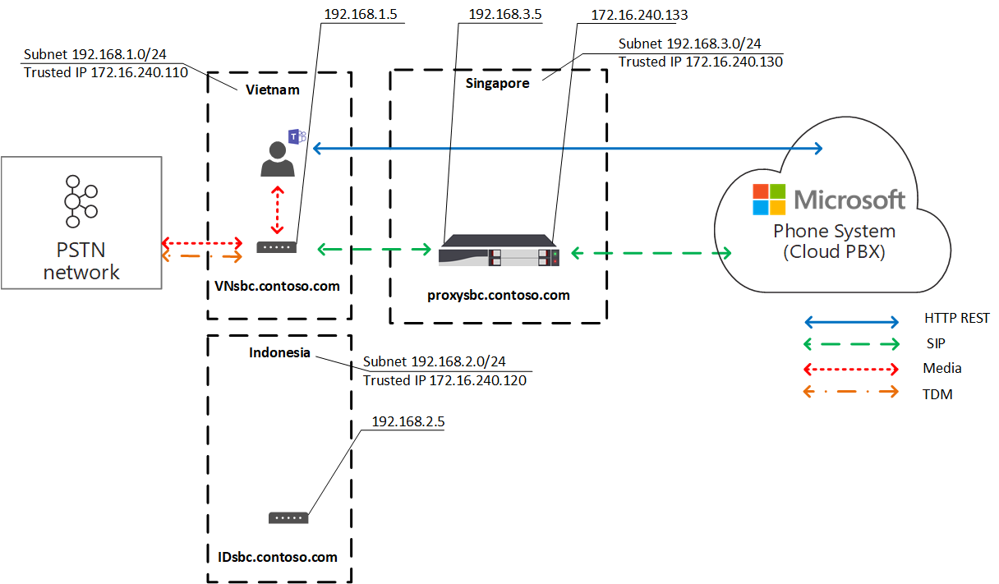

# Ottimizzazione degli elementi multimediali locali per il routing direttoLocal Media Optimization for Direct Routing

La voce PSTN (Public Switched Telephone Network) è considerata un'applicazione di importanza fondamentale per l'azienda, con aspettative elevate in relazione alla qualità vocale.Public Switched Telephone Network (PSTN) voice is considered a business-critical application with high expectations for voice quality. Il routing diretto consente di controllare i flussi di traffico multimediale per supportare numerose topologie di rete e configurazioni di telefonia locali per varie aziende in tutto il mondo.Direct Routing lets you control media traffic flows to accommodate a multitude of network topologies and local telephony setups for various enterprises all over the world. 

L'ottimizzazione degli elementi multimediali locali per il routing diretto consente di gestire la qualità vocale:Local Media Optimization for Direct Routing lets you manage voice quality by:

-   Controllare il modo in cui il traffico multimediale fluisce tra i client di Teams e i controller dei confini della sessione (SBC) del cliente.Controlling how media traffic flows between the Teams clients and the customer Session Border Controllers (SBCs).
-   Mantenere gli elementi multimediali locali entro i limiti delle subnet di rete aziendali.Keeping media local within the boundaries of corporate network subnets.
-   Consentire flussi multimediali tra i client di Teams e gli SBC anche se i dispositivi SBC sono dietro firewall aziendali con IP privati e non sono visibili direttamente a Microsoft.Allowing media streams between the Teams clients and the SBCs even if the SBCs are behind corporate firewalls with private IPs and not visible to Microsoft directly.

L'ottimizzazione degli elementi multimediali locali supporta due scenari:Local Media Optimization supports two scenarios:

- Centralizzazione di tutti i trunk locali tramite un SBC centralizzato connesso al trunk SIP (Session Initiation Protocol) principale, che fornisce servizi di telefonia a tutte le succursali locali della società.Centralization of all local trunks through a centralized SBC connected to the main Session Initiation Protocol (SIP)trunk--providing telephony services to all local branch offices of the company.

-   Creazione di una topologia di rete virtuale di SBC, in cui gli SBC delle succursali locali sono connessi a un SBC proxy centralizzato visibile e con cui comunica il Sistema telefonico Microsoft tramite l'indirizzo IP esterno.Building a virtual network topology of SBCs--where the SBCs in the local branch offices are connected to a centralized proxy SBC that is visible to, and communicating with, Microsoft Phone System through its external IP address. In una topologia di rete virtuale, gli SBC a valle comunicano tramite IP interni e non sono direttamente visibili al Sistema telefonico.In a virtual network topology, downstream SBCs are communicating through internal IPs and are not directly visible to Phone System.

Questo articolo descrive le funzionalità e gli scenari e le soluzioni dei clienti.This article describes feature functionality, and customer scenarios and solutions. Per informazioni dettagliate sulla configurazione, vedere [Configurare l'ottimizzazione del supporto locale.](direct-routing-media-optimization-configure.md)For details on configuration, see [Configure Local Media Optimization](direct-routing-media-optimization-configure.md). 

  > [!NOTE]
  > Se si vuole mantenere gli elementi multimediali locali entro i limiti della Intranet, è consigliabile ottimizzare gli elementi multimediali locali.If you want to keep media local within the boundaries of your intranet, Local Media Optimization is recommended. Se si dispone già del bypass multimediale e si usano solo gli indirizzi IP pubblici dei file SBC, non è obbligatorio passare all'ottimizzazione del supporto locale.If you already have Media Bypass and you use only the public IP addresses of your SBCs, it is not mandatory to move to Local Media Optimization. È possibile continuare a usare il bypass multimediale.You can continue to use Media Bypass. Per altre informazioni, vedere [Pianificare il bypass multimediale.](direct-routing-plan-media-bypass.md)For more information, see [Plan Media Bypass](direct-routing-plan-media-bypass.md).

## Scenari dei clienti supportatiSupported customer scenarios

Per questa discussione, si supponga che Contoso gestisce più aziende in tutto il mondo come indicato di seguito.For this discussion, assume that Contoso runs multiple businesses across the globe as follows. Le aree Europa e APAC vengono usate solo come esempi.(Note that Europe and APAC regions are used as examples only. Un'azienda potrebbe avere diverse aree geografiche con requisiti simili.A company might have several different regions with similar requirements.)
 
- **In Europa,** Contoso ha uffici in circa 30 paesi.**In Europe**, Contoso has offices in approximately 30 countries. Ogni ufficio ha un proprio PBX (Private Branch Exchange).Each office has its own Private Branch Exchange (PBX). 

  A Contoso è stata offerta la possibilità di centralizzare i trunk in un'unica posizione, Amsterdam, per tutti e 30 gli uffici europei.Contoso was offered an option to centralize the trunks in one location--Amsterdam--for all 30 European offices. Contoso ha distribuito lo SBC in Amsterdam, ha fornito una larghezza di banda sufficiente per eseguire chiamate attraverso la posizione centralizzata, ha collegato un trunk SIP centrale alla posizione centralizzata e ha iniziato a servire tutte le località europee da Amsterdam.Contoso deployed the SBC in Amsterdam, provided enough bandwidth to run calls through the centralized location, connected a central SIP trunk to the centralized location, and started serving all European locations from Amsterdam. 

- **Nell'area geografica dell'APAC,** Contoso ha più uffici in paesi diversi.**In the APAC region**, Contoso has multiple offices in different countries. 

  In molti paesi, l'azienda ha ancora trunk di multiplexing (TDM) di divisione temporale nelle succursali locali.In many countries, the company still has time-division multiplexing (TDM) trunks in local branch offices. La centralizzazione dei trunk TDM non è un'opzione nell'area APAC, quindi non è possibile passare a SIP.Centralization of the TDM trunks is not an option in the APAC region, so switching to SIP is not possible. Si supponga che nell'area APAC siano presenti più di cinquanta filiali Contoso con centinaia di gateway (SBC).Assume there are more than fifty Contoso branch offices across the APAC region with hundreds of gateways (SBCs). In questo scenario non è possibile associare tutti i gateway all'interfaccia di routing diretto a causa dell'assenza di indirizzi IP pubblici e/o breakout Internet locali.In this scenario, it is not possible to pair all gateways to the Direct Routing interface because of a lack of public IP addresses and/or local internet breakouts. Inoltre, alcuni paesi impongono requisiti normativi che non possono essere soddisfatti senza disporre di connettività di rete PSTN locale.In addition, some countries impose regulatory requirements that cannot be fulfilled without having local PSTN network connectivity.

In base ai requisiti aziendali, Contoso ha implementato due soluzioni con Ottimizzazione elementi multimediali locali per il routing diretto:Based on their business requirements, Contoso implemented two solutions with Local Media Optimization for Direct Routing:

- **In Europa,** tutti i trunk sono centralizzati e i flussi multimediali tra l'SBC centrale e gli utenti, in base alla posizione dell'utente.**In Europe**, all trunks are centralized and media flows between the central SBC and the users, based on the user location. 

  - Se un utente è connesso alla subnet locale di una rete aziendale (ovvero, l'utente è interno), il flusso multimediale passa tra l'INDIRIZZO IP interno della SBC centrale e il client Teams dell'utente.If a user is connected to the local subnet of a corporate network (that is, the user is internal), media flows between the internal IP of the central SBC and the user’s Teams client. 
  
  - Se un utente non è ai confini della rete aziendale, ad esempio se usa una connessione Internet wireless pubblica, l'utente viene considerato esterno.If a user is outside the boundaries of the corporate network--for example, if the user is using a public wireless Internet connection--then the user is considered to be external. In questo caso, il flusso degli elementi multimediali tra l'INDIRIZZO IP esterno della pagina SBC centrale e il client di Teams.In this case, the media flows between the external IP of the central SBC and the Teams client.

- **Nell'area geografica APAC,** un proxy centralizzato SBC viene associato a Microsoft Direct Routing, che indirizza gli elementi multimediali tra l'interfaccia di routing diretto e gli SBC a valle nelle succursali locali.**In the APAC region**, a centralized proxy SBC is paired to Microsoft Direct Routing, which directs media between the Direct Routing interface and the downstream SBCs in local branch offices. 

  I BCS a valle nelle succursali locali non sono direttamente visibili al routing diretto in APAC, ma vengono abbinati con il cmdlet Set-CSOnlinePSTNGateway per creare una topologia di rete virtuale all'interno del Sistema telefonico Microsoft.The downstream SBCs in the local branch offices are not directly visible to Direct Routing in APAC, but they are paired by using the Set-CSOnlinePSTNGateway cmdlet to create a virtual network topology within Microsoft Phone System. Gli elementi multimediali rimangono sempre locali quando possibile.Media always stays local when possible. Gli utenti esterni hanno elementi multimediali che scorrono tra il client di Teams e l'IP pubblico del proxy SBC.External users have media flowing between the Teams client and the public IP of the proxy SBC.

## SBC centrale con trunk centralizzatiCentral SBC with centralized trunks

Per creare una soluzione in cui i servizi PSTN vengono forniti a tutte le succursali locali tramite un singolo SBC centrale con un trunk SIP centralizzato connesso, l'amministratore del tenant di Contoso abbina un valore SBC (centralsbc.contoso.com) al servizio; A SBC è connesso un trunk SIP centralizzato.To build a solution where PSTN services are provided to all local branch offices through a single central SBC with a connected centralized SIP trunk, the Contoso tenant administrator pairs one SBC (centralsbc.contoso.com) to the service; the SBC has a centralized SIP trunk connected to it. 

- Quando un utente fa parte della rete interna della società, SBC fornisce l'INDIRIZZO IP interno del database SBC per i supporti multimediali.When a user is in the internal network of the company, the SBC provides the internal IP of the SBC for media. 

- Quando un utente è esterno alla rete aziendale, SBC fornisce l'INDIRIZZO IP esterno (pubblico) di SBC.When a user is outside of the corporate network, the SBC provides the external (public) IP of the SBC.

Nota: tutti i valori inclusi in esempi, tabelle o diagrammi vengono presentati solo a scopo di illustrazione.Note: All values within examples, tables, or diagrams are presented for illustration purposes only.

Tabella 1.Table 1. Esempio di parametri di rete per gli SBCExample network parameters for SBCs 

| PosizioneLocation | SBC FQDNSBC FQDN | Subnet internaInternal subnet | NAT esterno (IP attendibile)External NAT (Trusted IP) | Indirizzo IP esterno SBCSBC external IP address | Indirizzo IP interno SBCSBC internal IP address |
|:------------|:-------|:-------|:-------|:-------|:-------|
| AmsterdamAmsterdam | centralsbc.contoso.comcentralsbc.contoso.com | 192.168.5.0/24192.168.5.0/24 | 172.16.76.73172.16.76.73 | 172.16.76.71172.16.76.71 | 192.168.5.5192.168.5.5 |
| GermaniaGermany | Non distribuitaNot deployed | 192.168.6.0/24192.168.6.0/24 | 172.16.76.74172.16.76.74 | Non distribuitaNot deployed |  Non distribuitaNot deployed |
| FranciaFrance | Non distribuitaNot deployed | 192.168.7.0/24192.168.7.0/24 | 172.16.76.75172.16.76.75 | Non distribuitaNot deployed |  Non distribuitaNot deployed ||||

### Utente internoInternal user

Il diagramma seguente mostra il flusso di traffico quando un utente è connesso alla rete aziendale nella succursale o nel sito dell'utente.The following diagram shows the traffic flow when a user is connected to the corporate network in the user’s home branch office or site. 

In locale, l'utente è assegnato alla succursale locale in Germania.While on premises, the user is assigned to the local branch office in Germany. L'utente effettua una chiamata telefonica con instradamento diretto tramite Teams.The user makes a Direct Routing phone call through Teams.

- Il client Teams dell'utente comunica al Sistema telefonico direttamente tramite l'API REST, ma il supporto generato durante la chiamata passa all'indirizzo IP interno della SBC centrale.The user’s Teams client communicates to Phone System directly through the REST API, but the media generated during the call flows to the central SBC’s internal IP address. 

- SBC reindirizza il flusso al Sistema telefonico e alla rete PSTN connessa.The SBC redirects the flow to Phone System and the connected PSTN network. 

- Il servizio SBC centrale è visibile al Sistema telefonico solo tramite l'indirizzo IP esterno.The central SBC is visible to Phone System through the external IP address only. 

Diagramma 1.Diagram 1. Flusso del traffico quando l'utente si trova nel sito "home" con un SBC centralizzato e con un trunk SIP centralizzato connessoTraffic flow when the user is in the ‘home’ site with a centralized SBC and with a connected centralized SIP Trunk

### Utente esternoExternal user

Il diagramma seguente mostra il flusso di traffico quando un utente non è locale e non è connesso alla rete aziendale, ovvero se il dispositivo dell'utente è connesso a Internet tramite un dispositivo mobile o una rete #A0 pubblica.The following diagram shows the traffic flow when a user is not on premises and is not connected to the corporate network (that is, the user’s device is connected to the Internet through a mobile device or public Wi-Fi). L'utente effettua una chiamata telefonica con instradamento diretto tramite Teams:The user makes a Direct Routing phone call through Teams:

- Il client Teams dell'utente comunica al Sistema telefonico direttamente tramite l'API REST, ma, in questo caso, il supporto generato durante la chiamata passa all'indirizzo IP esterno della SBC centrale.The user’s Teams client communicates to Phone System directly through the REST API, but, in this case, the media generated during the call flows to the central SBC’s external IP address. 

- SBC reindirizza il flusso al Sistema telefonico e alla rete PSTN connessa.The SBC redirects the flow to Phone System and the connected PSTN network. 

- Il servizio SBC centrale è visibile al Sistema telefonico solo tramite l'indirizzo IP esterno.The central SBC is visible to Phone System through the external IP address only. 

In questo caso, il comportamento è simile sia che l'utente sia locale della succursale in Germania o di qualsiasi altra succursale.In this case, the behavior is similar whether the user is local to the branch office in Germany or to any other branch office. L'utente è considerato esterno perché è al di fuori dei limiti della rete aziendale.The user is considered external because the user is outside the boundaries of the corporate network.

Diagramma 2.Diagram 2. Flusso del traffico quando l'utente è esterno con un SBC centralizzato e con un trunk SIP centralizzato connessoTraffic flow when the user is external with a centralized SBC and with a connected centralized SIP Trunk

## Proxy SBC con SBC a valle connessiProxy SBC with connected downstream SBCs

Per creare una soluzione in cui i servizi PSTN vengono forniti in tutte le succursali locali nell'area APAC in cui la centralizzazione dei trunk TDM non è disponibile, l'amministratore Contoso abbina un database SBC (proxysbc.contoso.com), chiamato anche SBC proxy, al servizio di routing diretto.To build a solution where PSTN services are provided in all local branch offices in the APAC region where centralization of the TDM trunks is not an option, the Contoso administrator pairs one SBC (proxysbc.contoso.com), also called the proxy SBC, to the Direct Routing service. 

In un secondo momento, l'amministratore di Contoso aggiunge alcuni SBC a valle per indicare che possono essere raggiunti tramite la connessione SBC proxy proxysbc.contoso.com.Afterwards, the Contoso administrator adds some downstream SBCs indicating that they can be reached through the proxy SBC proxysbc.contoso.com. Gli SBC a valle non hanno IP pubblici, ma possono essere assegnati a percorsi vocali.Downstream SBCs do not have public IPs, however, they can be assigned to voice routes. La tabella seguente mostra un esempio di configurazione e parametri di rete.The table below shows example network parameters and configuration.

Quando un utente si trova nella succursale locale in cui si trova il valore SBC a valle, il traffico multimediale passa direttamente tra l'utente e l'SBC a valle locale.When a user is in the local branch office where the downstream SBC is located, the media traffic flows between the user and the local downstream SBC directly. Se un utente è esterno all'ufficio (su una Internet pubblica), gli elementi multimediali passano dall'utente all'IP pubblico del proxy SBC, che lo proxy agli SBC a valle pertinenti.If a user is outside of the office (on a public internet), the media flows from the user to the public IP of the Proxy SBC, which proxies it to the relevant downstream SBC(s).

Tabella 2.Table 2. Esempio di informazioni sulla rete SBCExample SBC network information

| PosizioneLocation | SBC FQDNSBC FQDN | Subnet internaInternal subnet | NAT esterno (IP attendibile)External NAT (Trusted IP) | Indirizzo IP esterno SBCSBC external IP address  | Indirizzo IP interno SBCSBC internal IP address |
|:------------|:-------|:-------|:-------|:-------|:-------|
| VietnamVietnam | VNsbc.contoso.comVNsbc.contoso.com | 192.168.1.0/24192.168.1.0/24 | 172.16.240.110172.16.240.110 | NessunoNone |  192.168.1.5192.168.1.5 |
| IndonesiaIndonesia  | IDsbc.contoso.comIDsbc.contoso.com | 192.168.2.0/24192.168.2.0/24 | 172.16.240.120172.16.240.120 | NessunoNone |  192.168.2.5192.168.2.5 |
| SingaporeSingapore | proxysbc.contoso.comproxysbc.contoso.com |   192.168.3.0/24192.168.3.0/24 | 172.16.240.130172.16.240.130 | 172.16.240.133172.16.240.133 | 192.168.3.5192.168.3.5 |

### Utente internoInternal user 

Il diagramma seguente mostra il flusso di traffico di alto livello per lo scenario quando un utente si trova all'interno dell'ufficio nell'area APAC.The following diagram shows the high-level traffic flow for the scenario when a user is inside the office in the APAC region. L'utente, assegnato a una filiale locale in Vietnam e locale, effettua una chiamata telefonica con instradamento diretto tramite Teams.The user, who is assigned to a local branch office in Vietnam, and is on premises, makes a Direct Routing phone call through Teams. 

- Il client Teams dell'utente comunica con il sistema telefonico direttamente tramite l'API REST, ma i supporti generati durante la chiamata passano all'indirizzo IP interno del servizio SBC locale.The user’s Teams client communicates with Phone System directly through the REST API, but media generated during the call flows to local SBC’s internal IP address.

- Il servizio SBC locale reindirizza il flusso al proxy SBC di Singapore e alla rete PSTN locale connessa.The local SBC redirects the flow to the proxy SBC in Singapore and to the connected local PSTN network.

-  Il proxy SBC è visibile al Sistema telefonico solo attraverso l'indirizzo IP esterno e instrada il flusso dal valore SBC a valle (in questo caso la SBC locale in Vietnam) al Sistema telefonico.The proxy SBC is visible to Phone System through the external IP address only and routes the flow from the downstream SBC (in this case the local SBC in Vietnam) to Phone System. 

- L'SBC a valle nella succursale locale non è visibile direttamente al Sistema telefonico, ma è mappato all'interno della topologia di rete virtuale definita dall'amministratore di Contoso durante la configurazione dell'ottimizzazione dei supporti locali.The downstream SBC in the local branch office is not visible to Phone System directly but is mapped within the virtual network topology that is defined by the Contoso administrator while setting up Local Media Optimization.

Nota: il comportamento potrebbe essere diverso per gli utenti locali e non locali, a seconda della modalità di ottimizzazione file multimediale locale configurata.Note: The behavior might be different for local users and non-local users depending on the configured Local Media Optimization mode. 

Per altre informazioni sulle modalità possibili e sul comportamento pertinente, vedere Configurare l'ottimizzazione degli elementi multimediali locali.For more information on possible modes and relevant behavior, see Configure Local Media Optimization.

Diagramma 3.Diagram 3. Flusso del traffico quando l'utente si trova nella rete "domestica" con un proxy SBC e con gli SBC a valle connessiTraffic flow when the user is in the “home” network with a proxy SBC and with connected downstream SBCs 

### Utente esternoExternal user

Il diagramma seguente mostra il flusso del traffico quando un utente è al di fuori dei limiti di rete aziendali.The following diagram shows the traffic flow when a user is outside of the corporate network boundaries. L'utente non è locale e non è entro i confini della rete aziendale.The user is not on premises (is not within the boundaries of corporate network). L'utente effettua una chiamata telefonica di instradamento diretto tramite Teams a un numero di telefono in Vietnam.The user makes a Direct Routing phone call through Teams to a phone number in Vietnam. 

- Il client Teams dell'utente comunica con il Sistema telefonico direttamente tramite l'API REST, ma i supporti generati durante la chiamata vengono prima di tutto indirizzati all'indirizzo IP esterno del proxy SBC a Singapore.The user’s Teams client communicates with Phone System directly through the REST API, but the  media generated during the call flows first to the external IP address of the proxy SBC in Singapore. 

- In base ai criteri  di configurazione e voce (vedere Configurare l'ottimizzazione degli elementi multimediali locali per i dettagli), il proxy SBC reindirizza il flusso al database SBC a valle in Vietnam.Based on configuration and voice policies (see [Configure Local Media Optimization](direct-routing-media-optimization-configure.md) for details), the proxy SBC redirects the flow to the downstream SBC in Vietnam. 

- La rete SBC a valle in Vietnam reindirizza il flusso alla rete PSTN locale connessa.The downstream SBC in Vietnam redirects the flow to the connected local PSTN network. 

- Il proxy SBC è visibile al Sistema telefonico solo tramite l'indirizzo IP esterno.The proxy SBC is visible to Phone System through the external IP address only.

-  L'SBC a valle nella succursale locale non è visibile direttamente al Sistema telefonico, ma è mappato all'interno della topologia di rete virtuale definita dall'amministratore di Contoso durante la configurazione dell'ottimizzazione dei supporti locali.The downstream SBC in the local branch office is not visible to Phone System directly, but is mapped within the virtual network topology that is defined by the Contoso administrator while setting up Local Media Optimization. In questo esempio l'utente è considerato esterno perché non rientra nei limiti della rete aziendale.In the example, the user is considered external because the user is outside the boundaries of the corporate network. 

Diagramma 4.Diagram 4. Flusso del traffico quando l'utente è esterno con un SBC proxy e con SBC a valle connessiTraffic flow when the user is external with a proxy SBC and with connected downstream SBCs

## Modalità di ottimizzazione degli elementi multimediali localiLocal Media Optimization modes

L'ottimizzazione degli elementi multimediali locali supporta due modalità:Local Media Optimization supports two modes:

- **Modalità 1: ignorare sempre**.**Mode 1: Always bypass**. In questo caso, se l'utente è interno, il flusso degli elementi multimediali attraverso l'indirizzo IP interno della SBC a valle locale, indipendentemente dalla posizione effettiva dell'utente interno; ad esempio all'interno della stessa succursale in cui si trova il ramo SBC a valle o in altre filiali.In this case, if the user is internal, the media will flow through the local downstream SBC’s internal IP address regardless of the actual location of the internal user; for example, within the same branch office where the downstream SBC is located or in some other branch office.  

- **Modalità 2: solo per gli utenti locali.****Mode 2: Only for local users**. In questa modalità, il flusso degli elementi multimediali verrà indirizzato direttamente all'indirizzo IP interno di SBC di downstream locale solo quando viene generato dall'utente interno che si trova nella stessa succursale di SBC a valle.In this mode, media will flow directly to the local downstream SBC’s internal IP address only when generated by the internal user located in the same branch office as the downstream SBC. 

Per distinguere tra le modalità di ottimizzazione del supporto locale, l'amministratore del tenant deve impostare il parametro -BypassMode su "Always" o "OnlyForLocalUsers" per ogni SBC usando il cmdlet Set-CSonlinePSTNGateway.To distinguish between Local Media Optimization modes, the tenant administrator needs to set the -BypassMode parameter to either ‘Always’ or ‘OnlyForLocalUsers’ for every SBC by using the  Set-CSonlinePSTNGateway cmdlet. Per altre informazioni, vedere [Configurare l'ottimizzazione degli elementi multimediali locali.](direct-routing-media-optimization-configure.md)For more information, see [Configure Local Media Optimization](direct-routing-media-optimization-configure.md).  

 > [!NOTE]
  > Quando gli utenti sono interni, è necessaria la connettività dei supporti multimediali tra l'utente e SBC tramite l'indirizzo IP **interno.**When users are internal, media connectivity between the user and the SBC over the internal IP address is **required**. In questo caso non ci sono fallback ai inoltro del trasporto pubblico per i contenuti multimediali, perché SBC fornirerà un IP interno per la connettività dei supporti multimediali.There is no fallback to public transport relays for media in this case as the SBC will be providing an internal IP for media connectivity. 

### Modalità 1: ignorare sempreMode 1: Always bypass

Se la connessione tra succursali è buona, la modalità consigliata è Sempre esclusa.If you have good connection between branch offices, the recommended mode is Always bypass.
 
Ad esempio, si supponga che una società abbia un trunk SIP centralizzato in Amsterdam, al servizio di 30 paesi con una buona connettività tra i 30 siti e gli utenti locali.For example, assume a company has a centralized SIP trunk in Amsterdam, which serves 30 countries and has good connectivity between all 30 sites and local users. È presente anche una filiale in Germania in cui è distribuito un SBC locale.There is also a branch in Germany where a local SBC is deployed.

Il servizio SBC in Germania può essere configurato in modalità "Ignora sempre".The SBC in Germany can be configured in “Always bypass” mode. Gli utenti, indipendentemente dalla loro posizione, si connetteranno all'SBC direttamente attraverso l'indirizzo IP interno del database SBC (ad esempio dalla Francia alla Germania; vedere il diagramma seguente per riferimento).Users, regardless of their location, will connect to the SBC directly through the internal IP address of the SBC (for example from France to Germany; see the diagram below for reference).

Di seguito sono descritti due scenari:The following describes two scenarios:

- Scenario 1.Scenario 1. L'utente si trova nella stessa posizione del servizio SBC definito nel criterio di routing vocale online.The user is in the same location as the SBC defined in the Online Voice Routing Policy.

- Scenario 2.Scenario 2. L'utente e il gateway si tratta di siti diversi.The user and gateways are in different sites.

#### Scenario 1.Scenario 1. L'utente si trova nella stessa posizione del servizio SBC definito nel criterio di routing vocale onlineThe user is in the same location as the SBC defined in the Online Voice Routing Policy

Lo SBC di Amsterdam è configurato per essere un proxy SBC per un SBC a valle locale in Germania.The SBC in Amsterdam is configured to be a proxy SBC for a local downstream SBC in Germany. L'utente si trova in Germania nella stessa subnet della rete aziendale del servizio SBC locale.The user is in Germany within the same subnet as the corporate network of the local SBC. Sia gli SBC (proxy che a valle) sono configurati per la modalità Bypass sempre.Both SBCs (proxy and downstream) are configured for Always Bypass mode. I criteri di routing vocale online specificano che nel caso di chiamate in Germania (con codice di area +49) devono essere instradati all'SBC locale in Germania.Online voice routing policies specify that in case of calls within Germany (with area code +49) they should be routed to the local SBC in Germany. Tutte le altre chiamate, e nel caso in cui l'SBC in Germania non riesce, le chiamate in Germania devono essere indirizzate al proxy SBC di Amsterdam.All other calls--and in case the SBC in Germany fails, calls in Germany--should be routed to the proxy SBC in Amsterdam. La tabella seguente riepiloga la configurazione di esempio.The following table summarizes the example configuration. 

Tabella 3.Table 3. Configurazione di esempio per lo scenario 1Example configuration for Scenario 1

| Posizione fisica dell'utenteUser physical location | Un utente effettua una chiamata a un numeroUser makes a call to a number | Criteri per l'instradamento vocale onlineOnline Voice Routing Policy | Modalità configurata per SBCMode configured for SBC | Flusso multimedialeMedia Flow | 
|:------------|:-------|:-------|:-------|:-------|
| GermaniaGermany | +49 1 437 2800+49 1 437 2800 | Priorità 1: ^ \+ 49(\d {8} )$ -DEsbc.contoso.comPriority 1: ^\+49(\d{8})$ -DEsbc.contoso.com Priorità 2: .\* - proxysbc.contoso.comPriority 2: .\* - proxysbc.contoso.com| DEsbc.contoso.com - Ignora sempreDEsbc.contoso.com – Always Bypass  proxysbc.contoso.com - Ignora sempreproxysbc.contoso.com – Always Bypass | Team User <-> DEsbc.contoso.comTeams User <–> DEsbc.contoso.com |

Il diagramma seguente mostra il flusso di traffico di alto livello per l'utente interno in Germania che effettua una chiamata telefonica di routing diretto attraverso Teams al numero in Germania.The diagram below shows the high-level traffic flow for the internal user in Germany making a Direct Routing phone call through Teams to the number in Germany. 

- Il client Teams dell'utente comunica con il Sistema telefonico direttamente tramite l'API REST.The user’s Teams client communicates with Phone System directly through the REST API. 

- Il supporto generato durante la chiamata passa all'indirizzo IP interno del servizio SBC locale.The media generated during the call flows to the local SBC’s internal IP address. 

- Il servizio SBC locale reindirizza il flusso al proxy SBC di Amsterdam e alla rete PSTN locale connessa.The local SBC redirects the flow to the proxy SBC in Amsterdam and to the connected local PSTN network. 

- Il proxy SBC è visibile al Sistema telefonico solo attraverso l'indirizzo IP esterno e instrada il flusso dal valore SBC a valle (in questo caso, l'SBC locale in Germania) al Sistema telefonico.The proxy SBC is visible to Phone System through the external IP address only and routes the flow from the downstream SBC (in this case, the local SBC in Germany) to Phone System. 

- L'SBC a valle nella succursale locale non è visibile direttamente al Sistema telefonico, ma è mappato all'interno della topologia di rete virtuale definita dall'amministratore di Contoso durante la configurazione dell'ottimizzazione dei supporti locali.The downstream SBC in the local branch office is not visible to Phone System directly but is mapped within the virtual network topology that is defined by the Contoso administrator while setting up Local Media Optimization.

Diagramma 5.Diagram 5.  Flusso del traffico con la modalità "Bypass sempre" e l'utente si trova nel sito "home"Traffic flow with “Always Bypass” mode and the user is in the “home” site

#### Scenario 2: L'utente e i gateway si tratta di siti diversiScenario 2: The user and gateways are in different sites

Lo SBC di Amsterdam è configurato per essere un proxy SBC per un SBC a valle locale in Germania.The SBC in Amsterdam is configured to be a proxy SBC for a local downstream SBC in Germany. Sia gli SBC (proxy che a valle) sono configurati per la modalità Bypass sempre.Both SBCs (proxy and downstream) are configured for Always Bypass mode. L'utente interno in Francia, situato nella succursale locale, effettua una chiamata di routing diretto in Germania.The internal user in France, located in the local branch office, is making a Direct Routing call to Germany. I criteri di routing vocale online specificano che le chiamate verso la Germania (con codice di area +49) devono essere instradati all'SBC locale in Germania.Online voice routing policies specify that calls to Germany (with area code +49) should be routed to the local SBC in Germany. Tutte le altre chiamate, e, nel caso in cui l'SBC in Germania non riesce, tutte le chiamate in Germania devono essere indirizzate al proxy SBC di Amsterdam.All other calls--and, in case the SBC in Germany fails, all calls in Germany--should be routed to the proxy SBC in Amsterdam. La tabella seguente riepiloga la configurazione di esempio.The following table summarizes the example configuration. 

Tabella 4.Table 4. Configurazione di esempio per lo scenario 2Example configuration for Scenario 2

| Posizione fisica dell'utenteUser physical location | Un utente effettua una chiamata a un numeroUser makes a call to a number | Criteri per l'instradamento vocale onlineOnline Voice Routing Policy | Modalità configurata per SBCMode configured for SBC | Flusso multimedialeMedia Flow | 
|:------------|:-------|:-------|:-------|:-------|
| FranciaFrance | +49 1 437 2800+49 1 437 2800 | Priorità 1: ^ \+ 49(\d {8} )$ -DEsbc.contoso.comPriority 1: ^\+49(\d{8})$ -DEsbc.contoso.com  Priorità 2: .\* - proxysbc.contoso.comPriority 2: .\* - proxysbc.contoso.com |  DEsbc.contoso.com - Ignora sempre proxysbc.contoso.com - Ignora sempreDEsbc.contoso.com  – Always Bypass proxysbc.contoso.com – Always Bypass | Utenti di Teams <- > DEsbc.contoso.comTeams User <– > DEsbc.contoso.com  |

Il diagramma seguente mostra il flusso di traffico di alto livello quando l'utente tedesco interno che si trova in Francia effettua una chiamata telefonica di routing diretto attraverso Teams al numero in Germania.The following diagram shows the high-level traffic flow when the internal German user located in France makes a Direct Routing phone call through Teams to the number in Germany. 

- Il client Teams dell'utente comunica con il Sistema telefonico direttamente tramite l'API REST.The user’s Teams client communicates with Phone System directly through the REST API.

- Il supporto generato durante la chiamata passa direttamente all'SBC nell'indirizzo IP interno della Germania.The media generated during the call flows directly to the SBC in Germany's internal IP address. 

- SBC in Germania reindirizza il flusso al proxy SBC di Amsterdam e alla rete PSTN locale connessa.The SBC in Germany redirects the flow to the proxy SBC in Amsterdam and to the connected local PSTN network. 

Diagramma 6.Diagram 6.  Flusso del traffico con la modalità "Bypass sempre" e l'utente non si trova nel sito "home", ma nella rete internaTraffic flow with “Always Bypass” mode and the user is not in “home” site but in the internal network

### Modalità 2: solo per gli utenti localiMode 2: Only for local users

Se ci sono connessioni non erre tra le succursali locali ma buone connessioni tra ogni filiale locale e ufficio locale, la modalità consigliata è "Solo per gli utenti locali".If there are bad connections between local branch offices but good connections between each local branch office and regional office, then the recommended mode is “Only For Local Users”.

Ad esempio, nell'area APAC, si supponga che Contoso abbia più uffici in paesi diversi.For example, in the APAC region, assume Contoso has multiple offices in different countries. Per molti paesi, il passaggio a SIP non è possibile perché la società ha ancora trunk TDM in molte filiali locali.For many countries, switching to SIP is not possible because the company still has TDM trunks in many local branch offices. La centralizzazione dei trunk TDM non è un'opzione nell'area APAC.Centralization of the TDM trunks is not an option in the APAC region. Inoltre, ci sono più di cinquanta filiali Contoso nell'area APAC con centinaia di gateway (SBC).Moreover, there are more than fifty Contoso branch offices across the APAC region with hundreds of gateways (SBCs). 

Per creare una soluzione in cui i servizi PSTN vengono forniti in tutte le succursali locali nell'area APAC in cui la centralizzazione dei trunk TDM non è disponibile, l'amministratore Contoso abbina un SBC locale a Singapore come SBC proxy al servizio di routing diretto.To build a solution where PSTN services are provided in all local branch offices in the APAC region where centralization of the TDM trunks is not an option, the Contoso administrator pairs one regional SBC in Singapore as the proxy SBC to the Direct Routing service. La connessione diretta tra le succursali locali non è buona, ma esiste una buona connessione tra ogni filiale locale e l'SBC locale di Singapore.The direct connection between the local branch offices is not good, but there is a good connection between each local branch office and the regional SBC in Singapore. Per il servizio SBC locale, l'amministratore sceglie la modalità "Bypass sempre" e per gli SBC locali a valle l'amministratore sceglie la modalità "Solo per gli utenti locali".For the regional SBC, the administrator chooses ‘Always Bypass’ mode, and for the local downstream SBCs, the administrator chooses ‘Only For Local Users’ mode.

Di seguito sono descritti due scenari:The following describes two scenarios:

- Scenario 1.Scenario 1. L'utente si trova nella stessa posizione del servizio SBC definito nel criterio di routing vocale onlineThe user is in the same location as the SBC defined in the Online Voice Routing Policy

- Scenario 2.Scenario 2. L'utente e il gateway si tratta di siti diversiThe user and gateways are in different sites

#### Scenario 1.Scenario 1. L'utente si trova nella stessa posizione del servizio SBC definito nel criterio di routing vocale onlineThe user is in the same location as the SBC defined in Online Voice Routing Policy

Si supponga che la SBC di Singapore sia configurata come proxy SBC per le SBC a valle locali in Vietnam e Indonesia.Assume the SBC in Singapore is configured to be a proxy SBC for the local downstream SBCs in Vietnam and Indonesia. L'utente si trova in Vietnam nella stessa posizione del database SBC locale.The user is in Vietnam within the same location as the local SBC. I criteri di routing vocale online specificano che le chiamate in Vietnam (con codice di area +84) devono essere instradati all'SBC locale in Vietnam.Online voice routing policies specify that calls in Vietnam (with area code +84) should be routed to the local SBC in Vietnam. Tutte le altre chiamate e, se il servizio SBC in Vietnam ha esito negativo, le chiamate in Vietnam devono essere indirizzate al proxy SBC di Singapore.All other calls--and, if the SBC in Vietnam fails, calls in Vietnam--should be routed to the proxy SBC in Singapore. La tabella seguente riepiloga la configurazione di esempio.The following table summarizes the example configuration. 

Tabella 5.Table 5. Configurazione di esempio per la modalità "Solo per utenti locali" Scenario 1Example configuration for ‘Only For Local Users’ mode Scenario 1

| Posizione fisica dell'utenteUser physical location | Un utente effettua una chiamata a un numeroUser makes a call to a number | Criteri per l'instradamento vocale onlineOnline Voice Routing Policy | Modalità configurata per SBCMode configured for SBC | Flusso multimedialeMedia Flow | 
|:------------|:-------|:-------|:-------|:-------|
| VietnamVietnam | +84 4 3926 3000+84 4 3926 3000 | Priorità 1: ^ \+ 84(\d {9} )$ -VNsbc.contoso.comPriority 1: ^\+84(\d{9})$ -VNsbc.contoso.com  Priorità 2: .\* - proxysbc.contoso.comPriority 2: .\* - proxysbc.contoso.com | VNsbc.contoso.com- Solo per gli utenti localiVNsbc.contoso.com – Only For Local Users   proxysbc.contoso.com - Ignora sempreproxysbc.contoso.com – Always Bypass | Team User <-> VNsbc.contoso.comTeams User <–> VNsbc.contoso.com |

Nel diagramma seguente, un utente assegnato alla filiale locale in Vietnam, mentre è locale, effettua una chiamata telefonica di instradamento diretto tramite Teams.In the following diagram, a user assigned to the local branch office in Vietnam, while on premises, makes a Direct Routing phone call through Teams. 

- Il client Teams dell'utente comunica con il Sistema telefonico direttamente tramite l'API REST.The user’s Teams client communicates with Phone System directly through the REST API. 

- I supporti generati durante la chiamata passano all'indirizzo IP interno del servizio SBC locale.Media generated during the call flows to the local SBC’s internal IP address. 

- Il servizio SBC locale reindirizza il flusso al proxy SBC di Singapore e alla rete PSTN locale connessa.The local SBC redirects the flow to the proxy SBC in Singapore and to the connected local PSTN network. 

- Il proxy SBC è visibile al Sistema telefonico solo attraverso l'indirizzo IP esterno e instrada il flusso dal valore SBC a valle (in questo caso, l'SBC locale in Vietnam) al Sistema telefonico.The proxy SBC is visible to Phone System through the external IP address only and routes the flow from the downstream SBC (in this case, the local SBC in Vietnam) to Phone System. 

- Il servizio SBC a valle nella succursale locale non è visibile direttamente nel Sistema telefonico, ma è mappato all'interno della topologia della rete virtuale.The downstream SBC in the local branch office is not visible to Phone System directly but is mapped within the virtual network topology.

Diagramma 7.Diagram 7. Flusso del traffico con modalità "Solo per utenti locali" e l'utente si trova nel sito "home"Traffic flow with “Only For Local Users” mode and the user is in “home” site

#### Scenario 2.Scenario 2. L'utente e il gateway si tratta di siti diversiThe user and gateways are in different sites

Si supponga che la SBC di Singapore sia configurata come proxy SBC per le SBC a valle locali in Vietnam e Indonesia.Assume the SBC in Singapore is configured to be a proxy SBC for the local downstream SBCs in Vietnam and Indonesia. L'utente interno in Indonesia, situato nella filiale locale, sta effettuando una chiamata di routing diretto in Vietnam.The internal user in Indonesia, located in the local branch office, is making a Direct Routing call to Vietnam. I criteri di routing vocale online specificano che le chiamate al Vietnam (con codice di area +84) devono essere instradati all'SBC locale in Vietnam.Online Voice routing policies specify that calls to Vietnam (with area code +84) should be routed to the local SBC in Vietnam. Tutte le altre chiamate, e, nel caso in cui la SBC in Vietnam non riesce, le chiamate al Vietnam devono essere indirizzate al proxy SBC a Singapore.All other calls--and, in case the SBC in Vietnam fails, calls to Vietnam--should be routed to the proxy SBC in Singapore. Il proxy SBC di Singapore è impostato sulla modalità "Bypass sempre" e il valore SBC locale in Vietnam è impostato sulla modalità "Solo per gli utenti locali".The proxy SBC in Singapore is set to ‘Always Bypass’ mode, and the local SBC in Vietnam is set to ‘Only For Local Users’ mode. La tabella seguente riepiloga la configurazione di esempio.The following table summarizes the example configuration. 

Tabella 6.Table 6. Configurazione utenteUser configuration

| Posizione fisica dell'utenteUser physical location | Un utente effettua una chiamata a un numeroUser makes a call to a number | Criteri per l'instradamento vocale onlineOnline Voice Routing Policy | Modalità configurata per SBCMode configured for SBC | Flusso multimedialeMedia Flow | 
|:------------|:-------|:-------|:-------|:-------|
| IndonesiaIndonesia | +84 4 3926 3000+84 4 3926 3000 | Priorità 1: ^ \+ 84(\d {9} )$ -VNsbc.contoso.comPriority 1: ^\+84(\d{9})$ -VNsbc.contoso.com   Priorità 2: .\* - proxysbc.contoso.comPriority 2: .\* - proxysbc.contoso.com |VNsbc.contoso.com- Solo per gli utenti localiVNsbc.contoso.com – Only For Local Users   proxysbc.contoso.com - Ignora sempreproxysbc.contoso.com – Always Bypass | Team User <-> proxysbc.contoso.com <-> VNsbc.contoso.comTeams User <–> proxysbc.contoso.com <–> VNsbc.contoso.com |

Nel diagramma seguente, l'utente interno, in sede nella filiale indonesiana, effettua una chiamata telefonica con instradamento diretto attraverso Teams a un numero in Vietnam.In the following diagram, the internal user, while on premises in the Indonesian branch office, makes a Direct Routing phone call through Teams to a number in Vietnam. 

- Il client Teams dell'utente comunica con il Sistema telefonico direttamente tramite l'API REST.The user’s Teams client communicates with Phone System directly through the REST API.

- Gli elementi multimediali generati durante il flusso delle chiamate vengono prima indirizzati all'indirizzo IP interno del proxy SBC.Media generated during the call flows to proxy SBC’s internal IP address first. 

- Il proxy SBC di Singapore reindirizza il flusso all'indirizzo IP interno della SBC a valle in Vietnam e al Sistema telefonico.The proxy SBC in Singapore redirects the flow to the internal IP address of the downstream SBC in Vietnam and to Phone System. 

- La rete SBC a valle in Vietnam indirizza il flusso alla rete PSTN locale connessa.The Downstream SBC in Vietnam routes the flow to the connected local PSTN network. 

- Il proxy SBC è visibile al Sistema telefonico solo tramite l'indirizzo IP esterno.The proxy SBC is visible to Phone System through the external IP address only.

- Gli SBC a valle nelle succursali locali non sono visibili direttamente nel Sistema telefonico, ma sono mappati all'interno della topologia della rete virtuale.The downstream SBCs in local branch offices are not visible to Phone System directly but are mapped within the virtual network topology.

Diagramma 8.Diagram 8.  Flusso del traffico con modalità "Solo per gli utenti locali" e l'utente non si trova nel sito "home", ma nella rete internaTraffic flow with “Only For Local Users” mode, and the user is not in “home” site but in the internal network

## Problemi notiKnown issues

Di seguito è riportato un elenco dei problemi noti attualmente presenti nell'ottimizzazione degli elementi multimediali locali.The following is a list of known issues that are currently present in Local Media Optimization. Microsoft sta lavorando alla risoluzione di questi problemi.Microsoft is working on addressing these issues.

| ProblemaIssue | Soluzione alternativaWorkaround |
| :--- | :--- |
| Il client Teams non viene identificato come **interno quando** l'IP pubblico del client Teams corrisponde all'elenco di indirizzi IP attendibili del cliente.Teams client is not identified as **internal** when the Teams client Public IP matches the customer Trusted IP list. | L'ottimizzazione dei supporti locali richiede che la subnet del client Teams corrisponda a una subnet di [rete configurata dal tenant](https://docs.microsoft.com/powershell/module/skype/new-cstenantnetworksubnet?view=skype-ps)Local Media Optimization requires that the Teams client subnet matches a tenant configured [network subnet](https://docs.microsoft.com/powershell/module/skype/new-cstenantnetworksubnet?view=skype-ps)|
| Le escalation delle chiamate causano chiamate eliminate quando il client di Teams viene identificato come interno.Call escalations result in dropped calls when the Teams client is identified as internal.| Disabilitare l'ottimizzazione del supporto locale in Direct Routing SBC.Disable Local Media Optimization on the Direct Routing SBC.|

