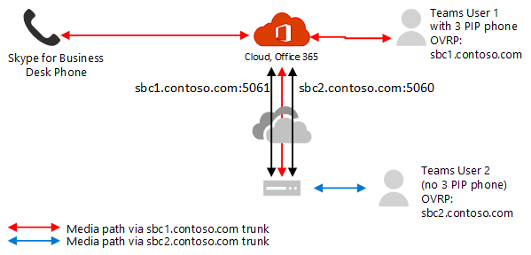

# Pianificare il bypass multimediale con Instradamento diretto

## Informazioni sul bypass multimediale con routing diretto

Il bypass multimediale consente di abbreviare il percorso del traffico multimediale e ridurre il numero di hop in transito per migliorare le prestazioni. Con il bypass multimediale, l'elemento multimediale viene mantenuto tra l'SBC (Session Border Controller) e il client invece di inviarlo tramite il sistema telefonico Microsoft. Per configurare il bypass multimediale, il SBC e il client devono trovarsi nella stessa posizione o rete.

Puoi controllare il bypass multimediale per ogni SBC usando il comando **set-CSOnlinePSTNGateway** con il parametro **-MediaBypass** impostato su true o false. Se si Abilita il bypass multimediale, questo non significa che tutto il traffico multimediale rimarrà all'interno della rete aziendale. In questo articolo viene descritto il flusso delle chiamate in scenari diversi.    

I diagrammi seguenti illustrano la differenza di flusso delle chiamate con e senza bypass multimediale.

Senza bypass multimediale, quando un client effettua o riceve una chiamata, sia la segnalazione che il flusso multimediale tra SBC, Microsoft Phone System e il client teams, come illustrato nel diagramma seguente:

Supponiamo però che un utente si trovi nello stesso edificio o rete di SBC. Supponiamo ad esempio che un utente che si trova in un edificio di Francoforte effettua una chiamata a un utente PSTN: 

- **Senza bypass multimediale**, il flusso multimediale verrà eseguito tramite Amsterdam o Dublin (dove vengono distribuiti i datacenter Microsoft) e di nuovo all'SBC di Francoforte. 

  Il Data Center in Europa è selezionato perché il SBC è in Europa e Microsoft usa il data center più vicino a SBC. Sebbene questo approccio non influenzi la qualità della chiamata a causa dell'ottimizzazione del flusso di traffico all'interno delle reti Microsoft nella maggior parte delle aree geografiche, il traffico ha un ciclo non necessario.     

- **Con il bypass multimediale**, il supporto viene mantenuto direttamente tra l'utente teams e il SBC, come illustrato nel diagramma seguente:

Il bypass multimediale sfrutta i protocolli denominati Interactive Connectivity Establishment (ICE) nel client teams e ICE Lite su SBC. Questi protocolli consentono al routing diretto di usare il percorso multimediale più diretto per ottenere una qualità ottimale. ICE e ICE Lite sono standard WebRTC. Per informazioni dettagliate su questi protocolli, vedere RFC 5245.

## Pianificazione del flusso delle chiamate e del firewall

Il flusso delle chiamate e la pianificazione del firewall variano a seconda che l'utente abbia accesso diretto all'indirizzo IP pubblico dell'SBC e se l'utente si trova all'interno o all'esterno della rete.

### Flusso delle chiamate se l'utente ha accesso diretto all'indirizzo IP pubblico di SBC

Se l'utente ha accesso diretto all'indirizzo IP pubblico dell'SBC, il flusso delle chiamate è il seguente:

- Per il bypass multimediale, il client Teams deve avere accesso all'indirizzo IP pubblico dell'SBC anche da una rete interna. Se l'elemento multimediale diretto non è desiderato, il contenuto multimediale può scorrere tramite Relay di trasporto.

- Questa è la soluzione consigliata quando un utente si trova nello stesso edificio e/o rete come SBC: rimuove i componenti cloud Microsoft dal percorso multimediale.

- La segnalazione scorre sempre tramite il cloud Microsoft.

Il diagramma seguente mostra il flusso delle chiamate quando il bypass multimediale è abilitato, il client è interno e il client può raggiungere l'indirizzo IP pubblico di SBC (Direct Media): 

- Le frecce e i valori numerici dei percorsi sono conformi all'articolo [flussi di chiamata di Microsoft teams](https://docs.microsoft.com/microsoftteams/microsoft-teams-online-call-flows) .

- La segnalazione SIP prende sempre i percorsi 4 e 4' (a seconda della direzione del traffico). Media rimane locale e prende il percorso 5B.

### Flusso delle chiamate se l'utente non ha accesso all'indirizzo IP pubblico di SBC

Di seguito viene descritto il flusso delle chiamate se l'utente non ha accesso all'indirizzo IP pubblico di SBC. 

Supponiamo ad esempio che l'utente sia esterno e che l'amministratore del tenant abbia deciso di non aprire l'indirizzo IP pubblico di SBC a tutti gli utenti di Internet, ma solo al cloud Microsoft. I componenti interni del traffico possono fluire tramite i relay di trasporto di teams. Questa è la configurazione consigliata per gli utenti esterni alla rete aziendale. Tenere presente quanto segue:

- Vengono usati i relè di trasporto teams.

- Per il bypass multimediale, Microsoft usa una versione di relay di trasporto che richiede l'apertura delle porte da 50 000 a 59 999 tra i relay di trasporto di teams e il SBC (in futuro prevediamo di passare alla versione che richiede solo le porte 3478 e 3479).

- Per scopi di ottimizzazione multimediale, Microsoft consiglia di aprire l'indirizzo IP pubblico di SBC solo ai relay di trasporto di teams. Per i client esterni alla rete aziendale, Microsoft consiglia di usare i relay di trasporto invece di raggiungere direttamente l'indirizzo IP pubblico di SBC.

Il diagramma seguente mostra il flusso delle chiamate quando l'esclusione multimediale è abilitata, il client è esterno e il client non riesce a raggiungere l'indirizzo IP pubblico del controller di bordo della sessione (il supporto viene inoltrato dall'inoltro del trasporto di Teams).

- Le frecce e i valori numerici dei percorsi sono conformi all'articolo [flussi di chiamata di Microsoft teams](https://docs.microsoft.com/microsoftteams/microsoft-teams-online-call-flows) .

- Il supporto viene inoltrato tramite i percorsi 3, 3', 4 e 4'

### Flusso delle chiamate se un utente si trova all'esterno della rete e ha accesso all'IP pubblico di SBC

> [!NOTE]
> Non si tratta di una configurazione consigliata perché non sfrutta i relè di trasporto di teams. Dovresti invece prendere in considerazione lo scenario precedente in cui l'utente non ha accesso all'indirizzo IP pubblico di SBC. 

Il diagramma seguente mostra il flusso delle chiamate quando il bypass multimediale è abilitato, il client è esterno e il client può raggiungere l'indirizzo IP pubblico del SBC (Direct Media).

- Le frecce e i valori numerici dei percorsi sono conformi all'articolo [flussi di chiamata di Microsoft teams](https://docs.microsoft.com/microsoftteams/microsoft-teams-online-call-flows) .

- La segnalazione SIP accetta sempre i percorsi 3 e 3' (a seconda della direzione del traffico). Flussi multimediali tramite il percorso 2.

## Uso di processori multimediali e relè di trasporto

Nel cloud Microsoft sono presenti due componenti che possono essere nel percorso del traffico multimediale: processori multimediali e relay di trasporto. 

- Il media processor è un componente pubblico che gestisce i contenuti multimediali in casi non di bypass e gestisce elementi multimediali per le applicazioni vocali.

   I processori multimediali sono sempre nel percorso per le chiamate non ignorate dall'utente finale, ma non nel percorso per le chiamate ignorate. I processori multimediali sono sempre nel percorso per tutte le applicazioni vocali, ad esempio Call Park, operatore automatico dell'organizzazione e code di chiamata.

- L'inoltro di trasporto viene usato per connettersi al servizio di trasporto più vicino per inviare il traffico in tempo reale.

   I relè di trasporto potrebbero non essere nel percorso per le chiamate ignorate, provenienti da o destinati agli utenti finali, a seconda della posizione dell'utente e della configurazione della rete.

Il diagramma seguente mostra due flussi di chiamata: uno con bypass multimediale abilitato e il secondo con bypass multimediale disabilitato. Nota il diagramma illustra solo il traffico proveniente da-o destinato agli utenti finali.  
- Il controller multimediale è un microservizio in Azure che assegna processori multimediali e crea offerte SDP (Session Description Protocol).

- Il proxy SIP è un componente che traduce il segnale di REST HTTP usato in teams per il SIP.    

La tabella seguente riepiloga la differenza tra i processori multimediali e i relè di trasporto.

|    | Processori multimediali | Relè di trasporto|
| :--------------|:---------------|:------------|
Nel percorso multimediale per le chiamate non ignorate per gli utenti finali | Sempre | Mai | 
Nel percorso multimediale per le chiamate ignorate per gli utenti finali | Mai | Se il client non riesce a raggiungere il SBC nell'indirizzo IP pubblico | 
Nel percorso multimediale per le applicazioni vocali | Sempre | Mai | 
Può eseguire la transcodifica (B2BUA)\* | Sì | No, inoltra solo l'audio tra gli endpoint | 
Numero di istanze nel mondo e nella posizione | 8 totale: 2 in Stati Uniti Est e ovest; 2 in Amsterdam e Dublino; 2 a Hong Kong e Singapore; 2 in Giappone  | Più

L'intervallo IP è 52.112.0.0/14 (indirizzi IP da 52.112.0.1 a 52.115.255.254). 

\*Spiegazione della transcodifica: 

- Il media processor è B2BUA, il che significa che può cambiare un codec (ad esempio, SILK from teams client to MP e G. 711 tra MP e SBC).

- I relè di trasporto non sono B2BUA, il che significa che il codec non viene mai modificato tra il client e il SBC, anche se i flussi di traffico tramite Relay.

### Uso dei processori multimediali di teams se trunk è configurato per il bypass multimediale

I processori multimediali di teams vengono sempre inseriti nel percorso multimediale negli scenari seguenti:

- La chiamata viene escalated da 1:1 a una chiamata di gruppo
- Chiamata sta per un utente di Team federati
- La chiamata viene inoltrata o trasferita a un utente di Skype for business

Verificare che SBC abbia accesso ai processori multimediali e ai relè di trasporto, come descritto di seguito.    

## Segnalazione SIP: FQDN

Per la segnalazione SIP, i requisiti di FQDN e firewall sono gli stessi per i casi non bypassati. 

Il routing diretto è disponibile nei seguenti ambienti di Office 365:
- Office 365
- Office 365 GCC
- Office 365 GCC High
- Office 365 DoD ulteriori informazioni su [office 365 e gli ambienti governativi degli Stati Uniti](https://docs.microsoft.com/office365/servicedescriptions/office-365-platform-service-description/office-365-us-government/office-365-us-government) , ad esempio GCC, GCC High e DOD.

### Ambienti Office 365 e Office 365 GCC

I punti di connessione per il routing diretto sono i tre FQDN seguenti:

- **SIP.pstnhub.Microsoft.com** -FQDN globale-deve essere provato per primo. Quando il SBC invia una richiesta di risoluzione di questo nome, i server DNS di Microsoft Azure restituiscono un indirizzo IP che punta al Data Center di Azure principale assegnato a SBC. L'assegnazione si basa sulle metriche delle prestazioni dei datacenter e sulla vicinanza geografica a SBC. L'indirizzo IP restituito corrisponde al nome di dominio completo principale.

- **SIP2.pstnhub.Microsoft.com** -FQDN secondario-Mappa geograficamente alla seconda area di priorità.

- **SIP3.pstnhub.Microsoft.com** -FQDN terziario-Mappa geograficamente alla terza area prioritaria.

È necessario inserire questi tre nomi di dominio completi per:

- Offre un'esperienza ottimale (meno caricato e più vicino al Data Center SBC assegnato eseguendo una query sul primo FQDN).

- Fornisci il failover quando viene stabilita una connessione da un SBC a un centro dati che sta vivendo un problema temporaneo. Per altre informazioni, vedi meccanismo di failover seguente.

Gli FQDN **SIP.pstnhub.Microsoft.com**, **SIP2.pstnhub.Microsoft.com**e **SIP3.pstnhub.Microsoft.com** verranno risolti in uno degli indirizzi IP seguenti:
- 52.114.148.0
- 52.114.132.46
- 52.114.75.24
- 52.114.76.76
- 52.114.7.24
- 52.114.14.70

È necessario aprire le porte per tutti questi indirizzi IP nel firewall per consentire il traffico in entrata e in uscita da e verso gli indirizzi per la segnalazione. Se il firewall supporta i nomi DNS, il nome FQDN **SIP-all.pstnhub.Microsoft.com** si risolve in tutti questi indirizzi IP. 

### Office 365 GCC DoD Environment

Il punto di connessione per il routing diretto è il nome di dominio completo seguente:

**SIP.pstnhub.DoD.teams.Microsoft.US** -FQDN globale. Poiché l'ambiente Office 365 DoD esiste solo nei data center degli Stati Uniti, non esistono nomi di dominio completi secondari e terziari.

Gli FQDN-sip.pstnhub.dod.teams.microsoft.us verranno risolti in uno degli indirizzi IP seguenti:

- 52.127.64.33
- 52.127.68.34

È necessario aprire le porte per tutti questi indirizzi IP nel firewall per consentire il traffico in entrata e in uscita da e verso gli indirizzi per la segnalazione.  Se il firewall supporta i nomi DNS, il nome FQDN sip.pstnhub.dod.teams.microsoft.us si risolve in tutti questi indirizzi IP. 

### Ambiente Office 365 GCC High Environment

Il punto di connessione per il routing diretto è il nome di dominio completo seguente:

**SIP.pstnhub.gov.teams.Microsoft.US** -FQDN globale. Dato che l'ambiente GCC High esiste solo nei data center americani, non esistono nomi di dominio completi secondari e terziari.

Gli FQDN-sip.pstnhub.gov.teams.microsoft.us verranno risolti in uno degli indirizzi IP seguenti:

- 52.127.88.59
- 52.127.92.64

È necessario aprire le porte per tutti questi indirizzi IP nel firewall per consentire il traffico in entrata e in uscita da e verso gli indirizzi per la segnalazione.  Se il firewall supporta i nomi DNS, il nome FQDN sip.pstnhub.gov.teams.microsoft.us si risolve in tutti questi indirizzi IP. 

## Segnalazione SIP: porte

I requisiti della porta sono gli stessi per tutti gli ambienti di Office 365 in cui viene offerto il routing diretto:
- Office 365
- Office 365 GCC
- Office 365 GCC High
- Office 365 DoD

È necessario usare le porte seguenti:

| Traffico | Da | A | Porta di origine | Porta di destinazione|
| :-------- | :-------- |:-----------|:--------|:---------|
SIP/TLS| Proxy SIP | SBC | 1024-65535 | Definita nell'SBC |
| SIP/TLS | SBC | Proxy SIP | Definita nell'SBC | 5061 |

## Traffico multimediale: intervalli di indirizzi IP e di porte

I flussi di traffico multimediale tra il client SBC e teams se la connettività diretta è disponibile o tramite Relay di trasporto teams se il client non riesce a raggiungere il SBC usando l'indirizzo IP pubblico.

### Requisiti per il traffico multimediale diretto (tra il client teams e il SBC) 

Il client deve avere accesso alle porte specificate (Vedi tabella) nell'indirizzo IP pubblico di SBC. 

Nota: se il client si trova in una rete interna, il contenuto multimediale passa all'indirizzo IP pubblico di SBC. Puoi configurare il blocco dei capelli nel dispositivo NAT in modo che il traffico non lasci mai l'apparecchiatura di rete aziendale.

| Traffico | Da | A | Porta di origine | Porta di destinazione|
| :-------- | :-------- |:-----------|:--------|:---------|
UDP/SRTP | Client | SBC | 50 000-50 019  | Definita nell'SBC |
| UDP/SRTP | SBC | Client | Definita nell'SBC | 50 000-50 019  |

Nota: se si dispone di un dispositivo di rete che converte le porte di origine del client, verificare che le porte tradotte vengano aperte tra l'apparecchiatura di rete e l'SBC. 

### Requisiti per l'uso dei relè di trasporto

I relè di trasporto si trovano nello stesso intervallo dei processori multimediali (per i casi non di bypass): 

### Ambienti Office 365 e Office 365 GCC

-52.112.0.0/14 (indirizzi IP da 52.112.0.1 a 52.115.255.254)

## Office 365 GCC DoD Environment

- 52.127.64.0/21

### Ambiente Office 365 GCC High Environment

- 52.127.88.0/21

L'intervallo di porte dei relè di trasporto Teams (applicabile a tutti gli ambienti) è illustrato nella tabella seguente:

| Traffico | Da | A | Porta di origine | Porta di destinazione|
| :-------- | :-------- |:-----------|:--------|:---------|
UDP/SRTP | Inoltro di trasporto | SBC | 50 000-59 999    | Definita nell'SBC |
| UDP/SRTP | SBC | Inoltro di trasporto | Definita nell'SBC | 50 000-59 999, 3478, 3479     |

Nota: Microsoft consiglia almeno due porte per chiamata simultanea su SBC. Poiché Microsoft ha due versioni di relay di trasporto, sono necessarie le seguenti:

- V4, che può funzionare solo con l'intervallo di porte da 50 000 a 59 999

- V6, che funziona con le porte 3478, 3479

In questo momento, il bypass multimediale supporta solo la versione v4 dei relay di trasporto. In futuro presenteremo il supporto di V6. 

È necessario aprire le porte 3478 e 3479 per la transizione. Quando Microsoft introduce il supporto per i relay di trasporto V6 con il bypass multimediale, non sarà necessario riconfigurare l'equipaggiamento di rete o SBCs. 

### Requisiti per l'uso dei processori multimediali

I processori multimediali sono sempre nel percorso multimediale per le applicazioni vocali e per i client Web, ad esempio i client teams in Edge o Google Chrome. I requisiti sono gli stessi della configurazione non di bypass.

L'intervallo IP per il traffico multimediale è 

### Ambienti Office 365 e Office 365 GCC

-52.112.0.0/14 (indirizzi IP da 52.112.0.1 a 52.115.255.254)

## Office 365 GCC DoD Environment

- 52.127.64.0/21

### Ambiente Office 365 GCC High Environment

- 52.127.88.0/21

L'intervallo di porte dei processori multimediali (applicabile a tutti gli ambienti) è illustrato nella tabella seguente:

| Traffico | Da | A | Porta di origine | Porta di destinazione|
| :-------- | :-------- |:-----------|:--------|:---------|
UDP/SRTP | Media processor | SBC | 49 152-53 247    | Definita nell'SBC |
| UDP/SRTP | SBC | Media processor | Definita nell'SBC | 49 152-53 247     |

## Configurare trunk separati per il bypass multimediale e il bypass non multimediale  

Se si esegue la migrazione a un bypass multimediale da un bypass non multimediale e si vuole confermare la funzionalità prima di eseguire la migrazione di tutto l'utilizzo al bypass multimediale, è possibile creare un trunk separato e separare i criteri di routing vocale online per instradare il trunk di bypass multimediale e assegnarlo a specifici utenti. 

Passaggi di configurazione di alto livello:

- Identificare gli utenti per testare il bypass multimediale.

- Creare due trunk distinti con nomi di dominio completi diversi: uno abilitato per il bypass multimediale; l'altro no. 

  Entrambi i trunk puntano allo stesso SBC. Le porte per la segnalazione SIP TLS devono essere diverse. Le porte per elementi multimediali devono essere le stesse.

- Creare un nuovo criterio di routing vocale online e assegnare il trunk bypass multimediale alle route corrispondenti associate all'utilizzo PSTN per questo criterio.

- Assegnare i nuovi criteri di routing vocale online agli utenti identificati per testare il bypass multimediale.

L'esempio seguente illustra questa logica.

| Set di utenti | Numero di utenti | FQDN trunk assegnato in OVRP | Bypass multimediale abilitato |
| :------------ |:----------------- |:--------------|:--------------|
Utenti con trunk di bypass non multimediale | 980 | sbc1.contoso.com:5060 | true
Utenti con trunk bypass multimediale | 20 | sbc2.contoso.com:5061 | false | 

Entrambi i trunk possono puntare allo stesso SBC con lo stesso indirizzo IP pubblico. Le porte di segnalazione TLS sull'SBC devono essere diverse, come illustrato nel diagramma seguente. Nota sarà necessario verificare che il certificato supporti entrambi i trunk. In SAN è necessario avere due nomi (**sbc1.contoso.com** e **sbc2.contoso.com**) o avere un certificato con carattere jolly.

Per informazioni su come configurare due trunk nello stesso SBC, vedere la documentazione fornita dal fornitore SBC:

 - [Documentazione di distribuzione di AudioCodes](https://www.audiocodes.com/solutions-products/products/products-for-microsoft-365/direct-routing-for-microsoft-teams)
- [Documentazione di distribuzione Oracle](https://www.oracle.com/industries/communications/enterprise-session-border-controller/microsoft.html)
- [Documentazione sulla distribuzione delle comunicazioni della barra multifunzione](https://ribboncommunications.com/solutions/enterprise-solutions/microsoft-solutions/direct-routing-microsoft-teams-calling)
- [Documentazione sulla distribuzione di TE-Systems (anynode)](https://www.anynode.de/anynode-and-microsoft-teams/)

## Endpoint client supportati con il bypass multimediale

Il bypass multimediale è supportato con tutti i client desktop di teams e i dispositivi telefonici teams. 

Per tutti gli altri endpoint che non supportano il bypass multimediale, è possibile nascondere la chiamata al non-bypass anche se è stata avviata come chiamata di bypass. Questo problema si verifica automaticamente e non richiede alcuna azione da parte dell'amministratore. Questo include i telefoni di Skype for business 3PIP e i client Web teams che supportano le chiamate di routing diretto (New Microsoft Edge basato su Chromium, Google Chrome, Mozilla Firefox). 
 
## Vedere anche

[Configurare il bypass multimediale con Instradamento diretto](direct-routing-configure-media-bypass.md)

