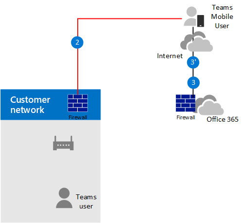

# Pianificare il bypass multimediale con Instradamento direttoPlan for media bypass with Direct Routing

## Informazioni sul bypass multimediale con routing direttoAbout media bypass with Direct Routing

Il bypass multimediale consente di abbreviare il percorso del traffico multimediale e ridurre il numero di hop in transito per migliorare le prestazioni.Media bypass enables you to shorten the path of media traffic and reduce the number of hops in transit for better performance. Con il bypass multimediale, l'elemento multimediale viene mantenuto tra l'SBC (Session Border Controller) e il client invece di inviarlo tramite il sistema telefonico Microsoft.With media bypass, media is kept between the Session Border Controller (SBC) and the client instead of sending it via the Microsoft Phone System. Per configurare il bypass multimediale, il SBC e il client devono trovarsi nella stessa posizione o rete.To configure media bypass, the SBC and the client must be in the same location or network.

Puoi controllare il bypass multimediale per ogni SBC usando il comando **set-CSOnlinePSTNGateway** con il parametro **-MediaBypass** impostato su true o false.You can control media bypass for each SBC by using the **Set-CSOnlinePSTNGateway** command with the **-MediaBypass** parameter set to true or false. Se si Abilita il bypass multimediale, questo non significa che tutto il traffico multimediale rimarrà all'interno della rete aziendale.If you enable media bypass, this does not mean that all media traffic will stay within the corporate network. In questo articolo viene descritto il flusso delle chiamate in scenari diversi.This article describes the call flow in different scenarios.    

I diagrammi seguenti illustrano la differenza di flusso delle chiamate con e senza bypass multimediale.The diagrams below illustrate the difference in call flow with and without media bypass.

Senza bypass multimediale, quando un client effettua o riceve una chiamata, sia la segnalazione che il flusso multimediale tra SBC, Microsoft Phone System e il client teams, come illustrato nel diagramma seguente:Without media bypass, when a client makes or receives a call, both signaling and media flow between the SBC, the Microsoft Phone System, and the Teams client, as shown in the following diagram:

> [!div class="mx-imgBorder"]
> 

Supponiamo però che un utente si trovi nello stesso edificio o rete di SBC.But let's assume that a user is in the same building or network as the SBC. Supponiamo ad esempio che un utente che si trova in un edificio di Francoforte effettua una chiamata a un utente PSTN:For example, assume a user who is in a building in Frankfurt makes a call to a PSTN user: 

- **Senza bypass multimediale** , il flusso multimediale verrà eseguito tramite Amsterdam o Dublin (dove vengono distribuiti i datacenter Microsoft) e di nuovo all'SBC di Francoforte.**Without media bypass** , media will flow via either Amsterdam or Dublin (where Microsoft datacenters are deployed) and back to the SBC in Frankfurt. 

  Il Data Center in Europa è selezionato perché il SBC è in Europa e Microsoft usa il data center più vicino a SBC.The datacenter in Europe is selected because the SBC is in Europe, and Microsoft uses the datacenter closest to the SBC. Sebbene questo approccio non influenzi la qualità della chiamata a causa dell'ottimizzazione del flusso di traffico all'interno delle reti Microsoft nella maggior parte delle aree geografiche, il traffico ha un ciclo non necessario.While this approach does not affect call quality due to optimization of traffic flow within Microsoft networks in most geographies, the traffic has an unnecessary loop.     

- **Con il bypass multimediale** , il supporto viene mantenuto direttamente tra l'utente teams e il SBC, come illustrato nel diagramma seguente:**With media bypass** , the media is kept directly between the Teams user and the SBC as shown in the following diagram:

  > [!div class="mx-imgBorder"]
  > 

Il bypass multimediale sfrutta i protocolli denominati Interactive Connectivity Establishment (ICE) nel client teams e ICE Lite su SBC.Media bypass leverages protocols called Interactive Connectivity Establishment (ICE) on the Teams client and ICE lite on the SBC. Questi protocolli consentono al routing diretto di usare il percorso multimediale più diretto per ottenere una qualità ottimale.These protocols enable Direct Routing to use the most direct media path for optimal quality. ICE e ICE Lite sono standard WebRTC.ICE and ICE Lite are WebRTC standards. Per informazioni dettagliate su questi protocolli, vedere RFC 5245.For detailed information about these protocols, see RFC 5245.

## Pianificazione del flusso delle chiamate e del firewallCall flow and firewall planning

Il flusso delle chiamate e la pianificazione del firewall variano a seconda che l'utente abbia accesso diretto all'indirizzo IP pubblico dell'SBC e se l'utente si trova all'interno o all'esterno della rete.Call flow and firewall planning depends on whether the user has direct access to the public IP address of the SBC, and whether the user is inside or outside of the network.

### Flusso delle chiamate se l'utente ha accesso diretto all'indirizzo IP pubblico di SBCCall flow if the user has direct access to the public IP address of the SBC

Se l'utente ha accesso diretto all'indirizzo IP pubblico dell'SBC, il flusso delle chiamate è il seguente:If the user has direct access to the public IP address of the SBC, the call flow is as follows:

- Per il bypass multimediale, il client Teams deve avere accesso all'indirizzo IP pubblico dell'SBC anche da una rete interna.For media bypass, the Teams client must have access to the public IP address of the SBC even from an internal network. Se l'elemento multimediale diretto non è desiderato, il contenuto multimediale può scorrere tramite Relay di trasporto.If direct media is not desired, the media can flow via Transport Relays.

- Questa è la soluzione consigliata quando un utente si trova nello stesso edificio e/o rete come SBC: rimuove i componenti cloud Microsoft dal percorso multimediale.This is the recommended solution when a user is in the same building and/or network as the SBC – remove Microsoft Cloud components from the media path.

- La segnalazione scorre sempre tramite il cloud Microsoft.Signaling always flows via the Microsoft cloud.

Il diagramma seguente mostra il flusso delle chiamate quando il bypass multimediale è abilitato, il client è interno e il client può raggiungere l'indirizzo IP pubblico di SBC (Direct Media):The following diagram shows call flow when media bypass is enabled, the client is internal, and the client can reach the public IP address of the SBC (direct media): 

- Le frecce e i valori numerici dei percorsi sono conformi ai [flussi delle chiamate di Microsoft teams](https://docs.microsoft.com/microsoftteams/microsoft-teams-online-call-flows).The arrows and numeric values of the paths are in accordance with [Microsoft Teams call flows](https://docs.microsoft.com/microsoftteams/microsoft-teams-online-call-flows).

- La segnalazione SIP prende sempre i percorsi 4 e 4' (a seconda della direzione del traffico).The SIP signaling always takes paths 4 and 4' (depending on the direction of the traffic). Media rimane locale e prende il percorso 5B.Media stays local and takes path 5b.

> [!div class="mx-imgBorder"]
> 

### Flusso delle chiamate se l'utente non ha accesso all'indirizzo IP pubblico di SBCCall flow if the user does not have access to the public IP address of the SBC

Di seguito viene descritto il flusso delle chiamate se l'utente non ha accesso all'indirizzo IP pubblico di SBC.The following describes call flow if the user does not have access to the public IP address of the SBC. 

Supponiamo ad esempio che l'utente sia esterno e che l'amministratore del tenant abbia deciso di non aprire l'indirizzo IP pubblico di SBC a tutti gli utenti di Internet, ma solo al cloud Microsoft.For example, assume the user is external, and the tenant administrator decided not to open the public IP address of the SBC to everyone in the Internet, but only to the Microsoft Cloud. I componenti interni del traffico possono fluire tramite i relay di trasporto di teams.The internal components of traffic can flow via the Teams Transport Relays. Tenere in considerazione gli aspetti seguenti:Consider the following:

- Vengono usati i relè di trasporto teams.Teams Transport Relays are used.

- Per il bypass multimediale, Microsoft usa una versione di relay di trasporto che richiede l'apertura delle porte da 50 000 a 59 999 tra i relay di trasporto di teams e il SBC (in futuro prevediamo di passare alla versione che richiede solo le porte 3478 e 3479).For media bypass, Microsoft uses a version of Transport Relays that requires opening ports 50 000 to 59 999 between the Teams Transport Relays and the SBC (in the future we plan to move to the version which requires only 3478 and 3479 ports).

Il diagramma seguente mostra il flusso delle chiamate quando l'esclusione multimediale è abilitata, il client è esterno e il client non riesce a raggiungere l'indirizzo IP pubblico del controller di bordo della sessione (il supporto viene inoltrato dall'inoltro del trasporto di Teams).The following diagram shows call flow when media bypass is enabled, the client is external, and the client cannot reach the public IP address of the Session Border Controller (media is relayed by Teams Transport Relay).

- Le frecce e i valori numerici dei percorsi sono conformi ai [flussi delle chiamate di Microsoft teams](https://docs.microsoft.com/microsoftteams/microsoft-teams-online-call-flows).The arrows and numeric values of the paths are in accordance with [Microsoft Teams call flows](https://docs.microsoft.com/microsoftteams/microsoft-teams-online-call-flows).

- Il supporto viene inoltrato tramite i percorsi 3, 3', 4 e 4'Media is relayed via paths 3, 3', 4 and 4'

> [!div class="mx-imgBorder"]
> 

### Flusso delle chiamate se un utente si trova all'esterno della rete e ha accesso all'IP pubblico di SBCCall flow if a user is outside the network and has access to the public IP of the SBC

> [!NOTE]
> Non si tratta di una configurazione consigliata perché non sfrutta i relè di trasporto di teams.This is not a recommended configuration because it does not take advantage of Teams Transport Relays. Dovresti invece prendere in considerazione lo scenario precedente in cui l'utente non ha accesso all'indirizzo IP pubblico di SBC.Instead, you should consider the previous scenario where the user does not have access to the public IP address of the SBC. 

Il diagramma seguente mostra il flusso delle chiamate quando il bypass multimediale è abilitato, il client è esterno e il client può raggiungere l'indirizzo IP pubblico del SBC (Direct Media).The following diagram shows call flow when media bypass is enabled, the client is external, and the client can reach the public IP address of the SBC (direct media).

- Le frecce e i valori numerici dei percorsi sono conformi all'articolo [flussi di chiamata di Microsoft teams](https://docs.microsoft.com/microsoftteams/microsoft-teams-online-call-flows) .The arrows and numeric values of the paths are in accordance with the [Microsoft Teams call flows](https://docs.microsoft.com/microsoftteams/microsoft-teams-online-call-flows) article.

- La segnalazione SIP accetta sempre i percorsi 3 e 3' (a seconda della direzione del traffico).The SIP signaling always takes paths 3 and 3' (depending on the direction of the traffic). Flussi multimediali tramite il percorso 2.Media flows using path 2.

> [!div class="mx-imgBorder"]
> 

## Uso di processori multimediali e relè di trasportoUse of Media Processors and Transport Relays

Nel cloud Microsoft sono presenti due componenti che possono essere nel percorso del traffico multimediale: processori multimediali e relay di trasporto.There are two components in the Microsoft Cloud that can be in the path of media traffic: Media Processors and Transport Relays. 

- Il media processor è un componente pubblico che gestisce i contenuti multimediali in casi non di bypass e gestisce elementi multimediali per le applicazioni vocali.The Media Processor is a public facing component that handles media in non-bypass cases and handles media for voice applications.

   I processori multimediali sono sempre nel percorso per le chiamate non ignorate dall'utente finale, ma non nel percorso per le chiamate ignorate.Media Processors are always in the path for end user non-bypassed calls, but never in the path for bypassed calls. I processori multimediali sono sempre nel percorso per tutte le applicazioni vocali, ad esempio Call Park, operatore automatico dell'organizzazione e code di chiamata.Media Processors are always in the path for all voice applications such as Call Park, Organizational Auto Attendant, and Call Queues.

- L'inoltro di trasporto viene usato per connettersi al servizio di trasporto più vicino per inviare il traffico in tempo reale.The Transport Relay is used to connect to the closest Transport Service to send real time traffic.

   I relè di trasporto potrebbero non essere nel percorso per le chiamate ignorate, provenienti da o destinati agli utenti finali, a seconda della posizione dell'utente e della configurazione della rete.Transport Relays might or might not be in the path for bypassed calls--originating from or destined to end users--depending on where the user is and how the network is configured .

Il diagramma seguente mostra due flussi di chiamata: uno con bypass multimediale abilitato e il secondo con bypass multimediale disabilitato.The following diagram shows two call flows – one with media bypass enabled and the second with media bypass disabled. Nota il diagramma illustra solo il traffico proveniente da-o destinato agli utenti finali.Note the diagram only illustrates traffic originating from--or destined to--end users.  
- Il controller multimediale è un microservizio in Azure che assegna processori multimediali e crea offerte SDP (Session Description Protocol).The Media Controller is a microservice in Azure that assigns Media Processors and creates Session Description Protocol (SDP) offers.

- Il proxy SIP è un componente che traduce il segnale di REST HTTP usato in teams per il SIP.The SIP Proxy is a component that translates HTTP REST signaling used in Teams to SIP.    

> [!div class="mx-imgBorder"]
> 

La tabella seguente riepiloga la differenza tra i processori multimediali e i relè di trasporto.The table below summarizes the difference between Media Processors and Transport Relays.

|    | Processori multimedialiMedia Processors | Relè di trasportoTransport Relays|
| :--------------|:---------------|:------------|
Nel percorso multimediale per le chiamate non ignorate per gli utenti finaliIn media path for non-bypassed calls for end users | SempreAlways | MaiNever | 
Nel percorso multimediale per le chiamate ignorate per gli utenti finaliIn media path for bypassed calls for end users | MaiNever | Se il client non riesce a raggiungere il SBC nell'indirizzo IP pubblicoIf client cannot reach the SBC on the public IP address | 
Nel percorso multimediale per le applicazioni vocaliIn media path for voice applications | SempreAlways | MaiNever | 
Può eseguire la transcodifica (B2BUA)\*Can do transcoding (B2BUA)\* | SìYes | No, inoltra solo l'audio tra gli endpointNo, only relays audio between endpoints | 
Numero di istanze nel mondo e nella posizioneNumber of instances worldwide and location | 10 totale: 2 in Stati Uniti Est e ovest; 2 in Amsterdam e Dublino; 2 a Hong Kong e Singapore; 2 in Giappone; 2 in Australia Est e sud-est10 total: 2 in US East and West; 2 in Amsterdam and Dublin; 2 in Hong Kong and Singapore; 2 in Japan ; 2 in Australia East and Southeast | PiùMultiple

Gli intervalli IP sono:The IP ranges are:
- 52.112.0.0/14 (indirizzi IP da 52.112.0.1 a 52.115.255.254)52.112.0.0/14 (IP addresses from 52.112.0.1 to 52.115.255.254)
- 52.120.0.0/14 (indirizzi IP da 52.120.0.1 a 52.123.255.254)52.120.0.0/14 (IP addresses from 52.120.0.1 to 52.123.255.254)

\* Spiegazione della transcodifica:\* Transcoding explanation: 

- Il media processor è B2BUA, il che significa che può cambiare un codec (ad esempio, SILK from teams client to MP e G. 711 tra MP e SBC).Media Processor is B2BUA, which means it can change a codecs (for example, SILK from Teams client to MP and G.711 between MP and SBC).

- I relè di trasporto non sono B2BUA, il che significa che il codec non viene mai modificato tra il client e il SBC, anche se i flussi di traffico tramite Relay.Transport Relays are not B2BUA, which means the codec is never changed between the client and the SBC--even if traffic flows via relays.

### Uso dei processori multimediali di teams se trunk è configurato per il bypass multimedialeUse of Teams Media Processors if trunk is configured for media bypass

I processori multimediali di teams vengono sempre inseriti nel percorso multimediale negli scenari seguenti:Teams Media Processors are always inserted in the media path in the following scenarios:

- La chiamata viene escalated da 1:1 a una chiamata di gruppoCall is escalated from 1:1 to a group call
- Chiamata sta per un utente di Team federatiCall is going to a federated Teams user
- La chiamata viene inoltrata o trasferita a un utente di Skype for businessCall is forwarded or transferred to a Skype for Business user

Verificare che SBC abbia accesso ai processori multimediali e ai relè di trasporto, come descritto di seguito.Ensure your SBC has access to the Media Processors and Transport Relays ranges as described below.    

## Segnalazione SIP: FQDNSIP Signaling: FQDNs

Per la segnalazione SIP, i requisiti di FQDN e firewall sono gli stessi per i casi non bypassati.For SIP signaling, the FQDN and firewall requirements are the same as for non-bypassed cases. 

Il routing diretto è disponibile nei seguenti ambienti Microsoft 365 o Office 365:Direct Routing is offered in the following Microsoft 365 or Office 365 environments:
- Microsoft 365 o Office 365Microsoft 365 or Office 365
- Office 365 GCCOffice 365 GCC
- Office 365 GCC HighOffice 365 GCC High
- Office 365 DoD ulteriori informazioni su [office 365 e gli ambienti governativi degli Stati Uniti](https://docs.microsoft.com/office365/servicedescriptions/office-365-platform-service-description/office-365-us-government/office-365-us-government) , ad esempio GCC, GCC High e DOD.Office 365 DoD Learn more about [Office 365 and US Government environments](https://docs.microsoft.com/office365/servicedescriptions/office-365-platform-service-description/office-365-us-government/office-365-us-government) such as GCC, GCC High, and DoD.

### Ambienti Microsoft 365, Office 365 e Office 365 GCCMicrosoft 365, Office 365, and Office 365 GCC environments

I punti di connessione per il routing diretto sono i tre FQDN seguenti:The connection points for Direct Routing are the following three FQDNs:

- **SIP.pstnhub.Microsoft.com** -FQDN globale-deve essere provato per primo.**sip.pstnhub.microsoft.com** – Global FQDN – must be tried first. Quando il SBC invia una richiesta di risoluzione di questo nome, i server DNS di Microsoft Azure restituiscono un indirizzo IP che punta al Data Center di Azure principale assegnato a SBC.When the SBC sends a request to resolve this name, the Microsoft Azure DNS servers return an IP address pointing to the primary Azure datacenter assigned to the SBC. L'assegnazione si basa sulle metriche delle prestazioni dei datacenter e sulla vicinanza geografica a SBC.The assignment is based on performance metrics of the datacenters and geographical proximity to the SBC. L'indirizzo IP restituito corrisponde al nome di dominio completo principale.The IP address returned corresponds to the primary FQDN.

- **SIP2.pstnhub.Microsoft.com** -FQDN secondario-Mappa geograficamente alla seconda area di priorità.**sip2.pstnhub.microsoft.com** – Secondary FQDN – geographically maps to the second priority region.

- **SIP3.pstnhub.Microsoft.com** -FQDN terziario-Mappa geograficamente alla terza area prioritaria.**sip3.pstnhub.microsoft.com** – Tertiary FQDN – geographically maps to the third priority region.

È necessario inserire questi tre nomi di dominio completi per:You must place these three FQDNs in order to:

- Offre un'esperienza ottimale (meno caricato e più vicino al Data Center SBC assegnato eseguendo una query sul primo FQDN).Provide optimal experience (less loaded and closest to the SBC datacenter assigned by querying the first FQDN).

- Fornisci il failover quando viene stabilita una connessione da un SBC a un centro dati che sta vivendo un problema temporaneo.Provide failover when a connection from an SBC is established to a datacenter that is experiencing a temporary issue. Per altre informazioni, vedi meccanismo di failover seguente.For more information, see Failover mechanism below.

Gli FQDN **SIP.pstnhub.Microsoft.com** , **SIP2.pstnhub.Microsoft.com** e **SIP3.pstnhub.Microsoft.com** verranno risolti in uno degli indirizzi IP seguenti:The FQDNs **sip.pstnhub.microsoft.com** , **sip2.pstnhub.microsoft.com** , and **sip3.pstnhub.microsoft.com** will be resolved to one of the following IP addresses:
- 52.114.148.052.114.148.0
- 52.114.132.4652.114.132.46
- 52.114.16.7452.114.16.74
- 52.114.20.2952.114.20.29
- 52.114.75.2452.114.75.24
- 52.114.76.7652.114.76.76
- 52.114.7.2452.114.7.24
- 52.114.14.7052.114.14.70

È necessario aprire le porte per tutti questi indirizzi IP nel firewall per consentire il traffico in entrata e in uscita da e verso gli indirizzi per la segnalazione.You need to open ports for all these IP addresses in your firewall to allow incoming and outgoing traffic to and from the addresses for signaling. Se il firewall supporta i nomi DNS, il nome FQDN **SIP-all.pstnhub.Microsoft.com** si risolve in tutti questi indirizzi IP.If your firewall supports DNS names, the FQDN **sip-all.pstnhub.microsoft.com** resolves to all these IP addresses. 

### Office 365 GCC DoD EnvironmentOffice 365 GCC DoD environment

Il punto di connessione per il routing diretto è il nome di dominio completo seguente:The connection point for Direct Routing is the following FQDN:

**SIP.pstnhub.DoD.teams.Microsoft.US** -FQDN globale.**sip.pstnhub.dod.teams.microsoft.us** – Global FQDN. Poiché l'ambiente Office 365 DoD esiste solo nei data center degli Stati Uniti, non esistono nomi di dominio completi secondari e terziari.As the Office 365 DoD environment exists only in the US data centers, there is no secondary and tertiary FQDNs.

Gli FQDN-sip.pstnhub.dod.teams.microsoft.us verranno risolti in uno degli indirizzi IP seguenti:The FQDNs – sip.pstnhub.dod.teams.microsoft.us will be resolved to one of the following IP addresses:

- 52.127.64.3352.127.64.33
- 52.127.68.3452.127.68.34

È necessario aprire le porte per tutti questi indirizzi IP nel firewall per consentire il traffico in entrata e in uscita da e verso gli indirizzi per la segnalazione.You need to open ports for all these IP addresses in your firewall to allow incoming and outgoing traffic to and from the addresses for signaling.  Se il firewall supporta i nomi DNS, il nome FQDN sip.pstnhub.dod.teams.microsoft.us si risolve in tutti questi indirizzi IP.If your firewall supports DNS names, the FQDN  sip.pstnhub.dod.teams.microsoft.us resolves to all these IP addresses. 

### Ambiente Office 365 GCC High EnvironmentOffice 365 GCC High environment

Il punto di connessione per il routing diretto è il nome di dominio completo seguente:The connection point for Direct Routing is the following FQDN:

**SIP.pstnhub.gov.teams.Microsoft.US** -FQDN globale.**sip.pstnhub.gov.teams.microsoft.us** – Global FQDN. Dato che l'ambiente GCC High esiste solo nei data center americani, non esistono nomi di dominio completi secondari e terziari.As the GCC High environment exists only in the US data centers, there is no secondary and tertiary FQDNs.

Gli FQDN-sip.pstnhub.gov.teams.microsoft.us verranno risolti in uno degli indirizzi IP seguenti:The FQDNs – sip.pstnhub.gov.teams.microsoft.us will be resolved to one of the following IP addresses:

- 52.127.88.5952.127.88.59
- 52.127.92.6452.127.92.64

È necessario aprire le porte per tutti questi indirizzi IP nel firewall per consentire il traffico in entrata e in uscita da e verso gli indirizzi per la segnalazione.You need to open ports for all these IP addresses in your firewall to allow incoming and outgoing traffic to and from the addresses for signaling.  Se il firewall supporta i nomi DNS, il nome FQDN sip.pstnhub.gov.teams.microsoft.us si risolve in tutti questi indirizzi IP.If your firewall supports DNS names, the FQDN  sip.pstnhub.gov.teams.microsoft.us resolves to all these IP addresses. 

## Segnalazione SIP: porteSIP Signaling: Ports

I requisiti della porta sono gli stessi per tutti gli ambienti di Office 365 in cui viene offerto il routing diretto:Port requirements are the same for all Office 365 environments where Direct Routing is offered:
- Microsoft 365 o Office 365Microsoft 365 or Office 365
- Office 365 GCCOffice 365 GCC
- Office 365 GCC HighOffice 365 GCC High
- Office 365 DoDOffice 365 DoD

È necessario usare le porte seguenti:You must use the following ports:

| TrafficoTraffic | DaFrom | ATo | Porta di origineSource port | Porta di destinazioneDestination port|
| :-------- | :-------- |:-----------|:--------|:---------|
SIP/TLSSIP/TLS| Proxy SIPSIP Proxy | SBCSBC | 1024-655351024 - 65535 | Definita nell'SBCDefined on the SBC |
| SIP/TLSSIP/TLS | SBCSBC | Proxy SIPSIP Proxy | Definita nell'SBCDefined on the SBC | 50615061 |

## Traffico multimediale: intervalli di indirizzi IP e di porteMedia traffic: IP and Port ranges

I flussi di traffico multimediale tra il client SBC e teams se la connettività diretta è disponibile o tramite Relay di trasporto teams se il client non riesce a raggiungere il SBC usando l'indirizzo IP pubblico.Media traffic flows between the SBC and Teams client if direct connectivity is available or via Teams Transport Relays if the client cannot reach the SBC using the public IP address.

### Requisiti per il traffico multimediale diretto (tra il client teams e il SBC)Requirements for direct media traffic (between the Teams client and the SBC) 

Il client deve avere accesso alle porte specificate (Vedi tabella) nell'indirizzo IP pubblico di SBC.The client must have access to the specified ports (see table) on the public IP address of the SBC. 

Nota: se il client si trova in una rete interna, il contenuto multimediale passa all'indirizzo IP pubblico di SBC.Note: If the client is in an internal network, the media flows to the public IP address of the SBC. Puoi configurare il blocco dei capelli nel dispositivo NAT in modo che il traffico non lasci mai l'apparecchiatura di rete aziendale.You can configure hair pinning on your NAT device so traffic never leaves the enterprise network equipment.

| TrafficoTraffic | DaFrom | ATo | Porta di origineSource port | Porta di destinazioneDestination port|
| :-------- | :-------- |:-----------|:--------|:---------|
UDP/SRTPUDP/SRTP | ClientClient | SBCSBC | 50 000-50 01950 000 – 50 019  | Definita nell'SBCDefined on the SBC |
| UDP/SRTPUDP/SRTP | SBCSBC | ClientClient | Definita nell'SBCDefined on the SBC | 50 000-50 01950 000 – 50 019  |

> [!NOTE]
> Se si dispone di un dispositivo di rete che converte le porte di origine del client, verificare che le porte tradotte vengano aperte tra l'apparecchiatura di rete e il SBC.If you have a network device that translates the client's source ports, please make sure that translated ports are opened between the network equipment and the SBC. 

### Requisiti per l'uso dei relè di trasportoRequirements for using Transport Relays

I relè di trasporto si trovano nello stesso intervallo dei processori multimediali (per i casi non di bypass):Transport Relays are in the same range as Media Processors (for non-bypass cases): 

### Ambienti Microsoft 365, Office 365 e Office 365 GCCMicrosoft 365, Office 365, and Office 365 GCC environments

- 52.112.0.0/14 (indirizzi IP da 52.112.0.1 a 52.115.255.254)52.112.0.0 /14 (IP addresses from 52.112.0.1 to 52.115.255.254)

## Office 365 GCC DoD EnvironmentOffice 365 GCC DoD environment

- 52.127.64.0/2152.127.64.0/21

### Ambiente Office 365 GCC High EnvironmentOffice 365 GCC High environment

- 52.127.88.0/2152.127.88.0/21

L'intervallo di porte dei relè di trasporto Teams (applicabile a tutti gli ambienti) è illustrato nella tabella seguente:The port range of the Teams Transport Relays (applicable to all environments) is shown in the following table:

| TrafficoTraffic | DaFrom | ATo | Porta di origineSource port | Porta di destinazioneDestination port|
| :-------- | :-------- |:-----------|:--------|:---------|
UDP/SRTPUDP/SRTP | Inoltro di trasportoTransport Relay | SBCSBC | 50 000-59 99950 000 -59 999    | Definita nell'SBCDefined on the SBC |
| UDP/SRTPUDP/SRTP | SBCSBC | Inoltro di trasportoTransport Relay | Definita nell'SBCDefined on the SBC | 50 000-59 999, 3478, 347950 000 – 59 999, 3478, 3479     |

> [!NOTE]
> Microsoft consiglia almeno due porte per chiamata simultanea su SBC.Microsoft recommends at least two ports per concurrent call on the SBC. Poiché Microsoft ha due versioni di relay di trasporto, sono necessarie le seguenti:Because Microsoft has two versions of Transport Relays, the following are required:
> 
> - V4, che può funzionare solo con l'intervallo di porte da 50 000 a 59 999v4, which can only work with port range 50 000 to 59 999
> 
> - V6, che funziona con le porte 3478, 3479v6, which works with ports 3478, 3479

In questo momento, il bypass multimediale supporta solo la versione v4 dei relay di trasporto.At this time, media bypass only supports v4 version of Transport Relays. In futuro presenteremo il supporto di V6.We will introduce support of v6 in the future. 

È necessario aprire le porte 3478 e 3479 per la transizione.You need to open ports 3478 and 3479 for transitioning. Quando Microsoft introduce il supporto per i relay di trasporto V6 con il bypass multimediale, non sarà necessario riconfigurare l'equipaggiamento di rete o SBCs.When Microsoft introduces support for v6 Transport Relays with Media Bypass, you will not need to reconfigure your network equipment or SBCs. 

### Requisiti per l'uso dei processori multimedialiRequirements for using media processors

I processori multimediali sono sempre nel percorso multimediale per le applicazioni vocali e per i client Web, ad esempio i client teams in Edge o Google Chrome.Media Processors are always in the media path for voice applications and for Web clients (for example, Teams clients in Edge or Google Chrome). I requisiti sono gli stessi della configurazione non di bypass.The requirements are the same as for non-bypass configuration.

L'intervallo IP per il traffico multimediale èThe IP range for media traffic is 

### Ambienti Office 365 e Office 365 GCCOffice 365 and Office 365 GCC environments

- 52.112.0.0/14 (indirizzi IP da 52.112.0.1 a 52.115.255.254)52.112.0.0 /14 (IP addresses from 52.112.0.1 to 52.115.255.254)

## Office 365 GCC DoD EnvironmentOffice 365 GCC DoD environment

- 52.127.64.0/2152.127.64.0/21

### Ambiente Office 365 GCC High EnvironmentOffice 365 GCC High environment

- 52.127.88.0/2152.127.88.0/21

L'intervallo di porte dei processori multimediali (applicabile a tutti gli ambienti) è illustrato nella tabella seguente:The port range of the Media Processors (applicable to all environments) is shown in the following table:

| TrafficoTraffic | DaFrom | ATo | Porta di origineSource port | Porta di destinazioneDestination port|
| :-------- | :-------- |:-----------|:--------|:---------|
UDP/SRTPUDP/SRTP | Media processorMedia Processor | SBCSBC | 3478, 3479 e 49 152-53 2473478, 3479 and 49 152 – 53 247    | Definita nell'SBCDefined on the SBC |
| UDP/SRTPUDP/SRTP | SBCSBC | Media processorMedia Processor | Definita nell'SBCDefined on the SBC | 3478, 3479 e 49 152-53 2473478, 3479 and 49 152 – 53 247     |

## Configurare trunk separati per il bypass multimediale e il bypass non multimedialeConfigure separate trunks for media bypass and non-media bypass  

Se si esegue la migrazione a un bypass multimediale da un bypass non multimediale e si vuole confermare la funzionalità prima di eseguire la migrazione di tutto l'utilizzo al bypass multimediale, è possibile creare un trunk separato e separare i criteri di routing vocale online per instradare il trunk di bypass multimediale e assegnare a utenti specifici.If you are migrating to media bypass from non-media bypass and want to confirm functionality before migrating all usage to media bypass, you can create a separate trunk and separate Online Voice Routing policy to route to the media bypass trunk and assign to specific users. 

Passaggi di configurazione di alto livello:High-level configuration steps:

- Identificare gli utenti per testare il bypass multimediale.Identify users to test media bypass.

- Creare due trunk distinti con nomi di dominio completi diversi: uno abilitato per il bypass multimediale; l'altro no.Create two separate trunks with different FQDNs: one enabled for media bypass; the other not. 

  Entrambi i trunk puntano allo stesso SBC.Both trunks point to the same SBC. Le porte per la segnalazione SIP TLS devono essere diverse.The ports for TLS SIP signaling must be different. Le porte per elementi multimediali devono essere le stesse.The ports for media must be the same.

- Creare un nuovo criterio di routing vocale online e assegnare il trunk bypass multimediale alle route corrispondenti associate all'utilizzo PSTN per questo criterio.Create a new Online Voice Routing policy and assign the media bypass trunk to the corresponding routes associated with the PSTN usage for this policy.

- Assegnare i nuovi criteri di routing vocale online agli utenti identificati per testare il bypass multimediale.Assign the new Online Voice Routing policy to users you have identified to test media bypass.

L'esempio seguente illustra questa logica.The example below illustrates this logic.

| Set di utentiSet of users | Numero di utentiNumber of users | FQDN trunk assegnato in OVRPTrunk FQDN assigned in OVRP | Bypass multimediale abilitatoMedia bypass enabled |
| :------------ |:----------------- |:--------------|:--------------|
Utenti con trunk di bypass non multimedialeUsers with non-media bypass trunk | 980980 | sbc1.contoso.com:5060sbc1.contoso.com:5060 | truetrue
Utenti con trunk bypass multimedialeUsers with media bypass trunk | 2020 | sbc2.contoso.com:5061sbc2.contoso.com:5061 | falsefalse | 

Entrambi i trunk possono puntare allo stesso SBC con lo stesso indirizzo IP pubblico.Both trunks can point to the same SBC with the same public IP address. Le porte di segnalazione TLS sull'SBC devono essere diverse, come illustrato nel diagramma seguente.The TLS signaling ports on the SBC must be different, as shown in the following diagram. Nota sarà necessario verificare che il certificato supporti entrambi i trunk.Note you will need to make sure that your certificate supports both trunks. In SAN è necessario avere due nomi ( **sbc1.contoso.com** e **sbc2.contoso.com** ) o avere un certificato con carattere jolly.In SAN, you need to have two names ( **sbc1.contoso.com** and **sbc2.contoso.com** ) or have a wildcard certificate.

> [!div class="mx-imgBorder"]
> 

Per informazioni su come configurare due trunk nello stesso SBC, vedere la documentazione fornita dal fornitore SBC:For information about how to configure two trunks on the same SBC, see the documentation provided by your SBC vendor:

 - [Documentazione di distribuzione di AudioCodesAudioCodes deployment documentation](https://www.audiocodes.com/solutions-products/products/products-for-microsoft-365/direct-routing-for-microsoft-teams)
- [Documentazione di distribuzione OracleOracle deployment documentation](https://www.oracle.com/industries/communications/enterprise-session-border-controller/microsoft.html)
- [Documentazione sulla distribuzione delle comunicazioni della barra multifunzioneRibbon Communications deployment documentation](https://ribboncommunications.com/solutions/enterprise-solutions/microsoft-solutions/direct-routing-microsoft-teams-calling)
- [Documentazione sulla distribuzione di TE-Systems (anynode)TE-Systems (anynode) deployment documentation](https://www.anynode.de/anynode-and-microsoft-teams/)

## Endpoint client supportati con il bypass multimedialeClient endpoints supported with media bypass

Il bypass multimediale è supportato con tutti i client desktop di Team autonomi, i client Android e iOS e i dispositivi telefonici teams.Media bypass is supported with all standalone Teams Desktop clients, Android and iOS clients and Teams Phone Devices. 

Per tutti gli altri endpoint che non supportano il bypass multimediale, la chiamata verrà convertita in non-bypass anche se è stata avviata come chiamata di bypass.For all other endpoints that do not support media bypass, we will convert the call to non-bypass even if it started as a bypass call. Questo problema si verifica automaticamente e non richiede alcuna azione da parte dell'amministratore.This happens automatically and does not require any actions from the administrator. Questo include i telefoni di Skype for business 3PIP e i client Web teams che supportano le chiamate di routing diretto (client basati su WebRTC in Microsoft Edge, Google Chrome, Mozilla Firefox).This includes Skype for Business 3PIP Phones, and Teams Web Clients that support Direct Routing calling (WebRTC based clients running on Microsoft Edge, Google Chrome, Mozilla Firefox). 
 
## Vedere ancheSee also

[Configurare il bypass multimediale con Instradamento direttoConfigure media bypass with Direct Routing](direct-routing-configure-media-bypass.md)

