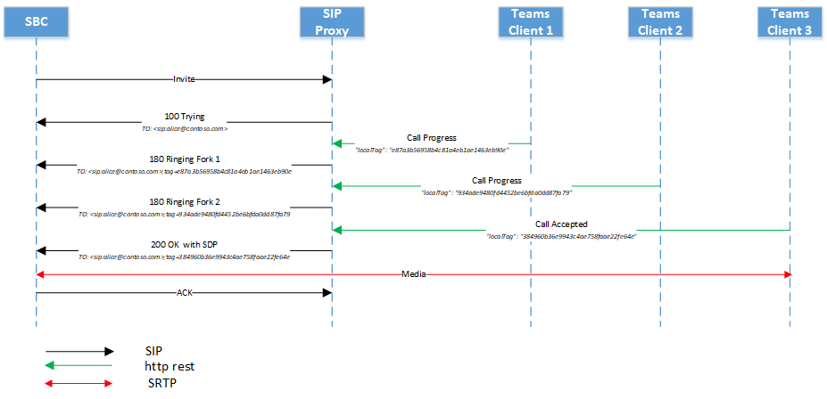

# <a name="direct-routing---sip-protocol"></a><span data-ttu-id="6ac20-103">Routing diretto-protocollo SIP</span><span class="sxs-lookup"><span data-stu-id="6ac20-103">Direct Routing - SIP protocol</span></span>

<span data-ttu-id="6ac20-104">Questo articolo descrive il modo in cui il routing diretto implementa il SIP (Session Initiation Protocol).</span><span class="sxs-lookup"><span data-stu-id="6ac20-104">This article describes how Direct Routing implements the Session Initiation Protocol (SIP).</span></span> <span data-ttu-id="6ac20-105">Per indirizzare correttamente il traffico tra un SBC (Session Border Controller) e il proxy SIP, alcuni parametri SIP devono avere valori specifici.</span><span class="sxs-lookup"><span data-stu-id="6ac20-105">To properly route traffic between a Session Border Controller (SBC) and the SIP proxy, some SIP parameters must have specific values.</span></span> <span data-ttu-id="6ac20-106">Questo articolo è destinato agli amministratori vocali responsabili della configurazione della connessione tra l'SBC locale e il servizio proxy SIP.</span><span class="sxs-lookup"><span data-stu-id="6ac20-106">This article is intended for voice administrators who are responsible for configuring the connection between the on-premises SBC and the SIP proxy service.</span></span>

## <a name="processing-the-incoming-request-finding-the-tenant-and-user"></a><span data-ttu-id="6ac20-107">Elaborazione della richiesta in arrivo: individuazione del tenant e dell'utente</span><span class="sxs-lookup"><span data-stu-id="6ac20-107">Processing the incoming request: finding the tenant and user</span></span>

<span data-ttu-id="6ac20-108">In una chiamata in arrivo, il proxy SIP deve trovare il tenant a cui è destinata la chiamata e trovare l'utente specifico all'interno del tenant.</span><span class="sxs-lookup"><span data-stu-id="6ac20-108">On an incoming call, the SIP proxy needs to find the tenant to which the call is destined and find the specific user within this tenant.</span></span> <span data-ttu-id="6ac20-109">L'amministratore del tenant può configurare i numeri non DID, ad esempio + 1001, in più tenant.</span><span class="sxs-lookup"><span data-stu-id="6ac20-109">The tenant administrator might configure non-DID numbers, for example +1001, in multiple tenants.</span></span> <span data-ttu-id="6ac20-110">Di conseguenza, è importante trovare il tenant specifico in cui eseguire la ricerca di numeri perché i numeri non DID potrebbero essere uguali in più tenant di Office 365.</span><span class="sxs-lookup"><span data-stu-id="6ac20-110">Therefore, it is important to find the specific tenant on which to perform the number lookup because the non-DID numbers might be the same in multiple Office 365 tenants.</span></span>  

<span data-ttu-id="6ac20-111">Questa sezione descrive il modo in cui il proxy SIP trova il tenant e l'utente ed esegue l'autenticazione di SBC sulla connessione in ingresso.</span><span class="sxs-lookup"><span data-stu-id="6ac20-111">This section describes how the SIP proxy finds the tenant and the user, and performs authentication of the SBC on the incoming connection.</span></span>

<span data-ttu-id="6ac20-112">Di seguito è riportato un esempio del messaggio SIP INVITE in una chiamata in arrivo:</span><span class="sxs-lookup"><span data-stu-id="6ac20-112">The following is an example of the SIP Invite message on an incoming call:</span></span>

| <span data-ttu-id="6ac20-113">Nome parametro</span><span class="sxs-lookup"><span data-stu-id="6ac20-113">Parameter name</span></span> | <span data-ttu-id="6ac20-114">Esempio di valore</span><span class="sxs-lookup"><span data-stu-id="6ac20-114">Example of the value</span></span> | 
| :---------------------  |:---------------------- |
| <span data-ttu-id="6ac20-115">Request-URI</span><span class="sxs-lookup"><span data-stu-id="6ac20-115">Request-URI</span></span> | <span data-ttu-id="6ac20-116">INVITARE sip:+18338006777@sip.pstnhub.microsoft.com SIP/2,0</span><span class="sxs-lookup"><span data-stu-id="6ac20-116">INVITE sip:+18338006777@sip.pstnhub.microsoft.com SIP /2.0</span></span> |
| <span data-ttu-id="6ac20-117">Intestazione tramite</span><span class="sxs-lookup"><span data-stu-id="6ac20-117">Via Header</span></span> | <span data-ttu-id="6ac20-118">Via: SIP/2.0/TLS sbc1. adatum. BIZ: 5058; alias; Branch = z9hG4bKac2121518978</span><span class="sxs-lookup"><span data-stu-id="6ac20-118">Via: SIP/2.0/TLS sbc1.adatum.biz:5058;alias;branch=z9hG4bKac2121518978</span></span> | 
| <span data-ttu-id="6ac20-119">Intestazione Max-Forwards</span><span class="sxs-lookup"><span data-stu-id="6ac20-119">Max-Forwards header</span></span> | <span data-ttu-id="6ac20-120">Max-inoltri: 68</span><span class="sxs-lookup"><span data-stu-id="6ac20-120">Max-Forwards:68</span></span> |
| <span data-ttu-id="6ac20-121">Intestazione da</span><span class="sxs-lookup"><span data-stu-id="6ac20-121">From Header</span></span> | <span data-ttu-id="6ac20-122">Da intestazione da: <SIP: 7168712781@sbc1. adatum. biz; Transport = UDP; Tag = 1c747237679</span><span class="sxs-lookup"><span data-stu-id="6ac20-122">From Header From: <sip:7168712781@sbc1.adatum.biz;transport=udp;tag=1c747237679</span></span> |
| <span data-ttu-id="6ac20-123">Intestazione</span><span class="sxs-lookup"><span data-stu-id="6ac20-123">To Header</span></span> | <span data-ttu-id="6ac20-124">A: sip:+183338006777@sbc1.adatum.biz</span><span class="sxs-lookup"><span data-stu-id="6ac20-124">To: sip:+183338006777@sbc1.adatum.biz</span></span> | 
| <span data-ttu-id="6ac20-125">Intestazione CSeq</span><span class="sxs-lookup"><span data-stu-id="6ac20-125">CSeq header</span></span> | <span data-ttu-id="6ac20-126">CSeq: 1 invito</span><span class="sxs-lookup"><span data-stu-id="6ac20-126">CSeq: 1 INVITE</span></span> | 
| <span data-ttu-id="6ac20-127">Intestazione contatto</span><span class="sxs-lookup"><span data-stu-id="6ac20-127">Contact Header</span></span> | <span data-ttu-id="6ac20-128">Contatto: <SIP: 68712781@sbc1. adatum. biz; Transport = TLS></span><span class="sxs-lookup"><span data-stu-id="6ac20-128">Contact: <sip: 68712781@sbc1.adatum.biz;transport=tls></span></span> | 

<span data-ttu-id="6ac20-129">Alla ricezione dell'invito, il proxy SIP esegue i passaggi seguenti:</span><span class="sxs-lookup"><span data-stu-id="6ac20-129">On receiving the invite, the SIP proxy performs the following steps:</span></span>

1. <span data-ttu-id="6ac20-130">Controllare il certificato.</span><span class="sxs-lookup"><span data-stu-id="6ac20-130">Check the certificate.</span></span> <span data-ttu-id="6ac20-131">Nella connessione iniziale il servizio di routing diretto accetta il nome FQDN presentato nell'intestazione del contatto e lo confronta con il nome comune o l'oggetto alternativo del certificato presentato.</span><span class="sxs-lookup"><span data-stu-id="6ac20-131">On the initial connection, the Direct Routing service takes the FQDN name presented in the Contact header and matches it to the Common Name or Subject Alternative name of the presented certificate.</span></span> <span data-ttu-id="6ac20-132">Il nome SBC deve corrispondere a una delle opzioni seguenti:</span><span class="sxs-lookup"><span data-stu-id="6ac20-132">The SBC name must match one of the following options:</span></span>

   - <span data-ttu-id="6ac20-133">Opzione 1.</span><span class="sxs-lookup"><span data-stu-id="6ac20-133">Option 1.</span></span> <span data-ttu-id="6ac20-134">Il nome FQDN completo presentato nell'intestazione del contatto deve corrispondere al nome comune/oggetto alternativo del certificato presentato.</span><span class="sxs-lookup"><span data-stu-id="6ac20-134">The full FQDN name presented in the Contact header must match the Common Name/Subject Alternative name of the presented certificate.</span></span>  

   - <span data-ttu-id="6ac20-135">Opzione 2.</span><span class="sxs-lookup"><span data-stu-id="6ac20-135">Option 2.</span></span> <span data-ttu-id="6ac20-136">La parte del dominio del nome FQDN presentato nell'intestazione del contatto (ad esempio adatum.biz del nome FQDN sbc1.adatum.biz) deve corrispondere al valore jolly in nome comune/oggetto alternativo (ad esempio \*. adatum.biz).</span><span class="sxs-lookup"><span data-stu-id="6ac20-136">The domain portion of the FQDN name presented in the Contact header (for example adatum.biz of the FQDN name sbc1.adatum.biz) must match the wildcard value in Common Name/Subject Alternative Name (for example \*.adatum.biz).</span></span>

2. <span data-ttu-id="6ac20-137">Provare a trovare un tenant usando il nome FQDN completo presentato nell'intestazione del contatto.</span><span class="sxs-lookup"><span data-stu-id="6ac20-137">Try to find a tenant using the full FQDN name presented in the Contact header.</span></span>  

   <span data-ttu-id="6ac20-138">Verificare che il nome FQDN dell'intestazione del contatto (sbc1.adatum.biz) sia registrato come nome DNS in qualsiasi tenant di Office 365.</span><span class="sxs-lookup"><span data-stu-id="6ac20-138">Check if the FQDN name from the Contact header (sbc1.adatum.biz) is registered as a DNS name in any Office 365 tenant.</span></span> <span data-ttu-id="6ac20-139">Se trovata, la ricerca dell'utente viene eseguita nel tenant che ha il nome di dominio completo SBC registrato come Domain Name.</span><span class="sxs-lookup"><span data-stu-id="6ac20-139">If found, the lookup of the user is performed in the tenant that has the SBC FQDN registered as a Domain name.</span></span> <span data-ttu-id="6ac20-140">Se non viene trovato, il passaggio 3 si applica.</span><span class="sxs-lookup"><span data-stu-id="6ac20-140">If not found, Step 3 applies.</span></span>   

3. <span data-ttu-id="6ac20-141">Il passaggio 3 si applica solo se il passaggio 2 non è riuscito.</span><span class="sxs-lookup"><span data-stu-id="6ac20-141">Step 3 only applies if Step 2 failed.</span></span> 

   <span data-ttu-id="6ac20-142">Rimuovere la porzione host dall'FQDN, presentata nell'intestazione del contatto (FQDN: sbc12.adatum.biz, dopo aver rimosso la porzione host: adatum.biz) e verificare se questo nome è registrato come nome DNS in un tenant di Office 365.</span><span class="sxs-lookup"><span data-stu-id="6ac20-142">Remove the host portion from the FQDN, presented in the Contact header (FQDN: sbc12.adatum.biz, after removing the host portion: adatum.biz), and check if this name is registered as a DNS name in any Office 365 tenant.</span></span> <span data-ttu-id="6ac20-143">Se trovata, la ricerca dell'utente viene eseguita in questo tenant.</span><span class="sxs-lookup"><span data-stu-id="6ac20-143">If found, the user lookup is performed in this tenant.</span></span> <span data-ttu-id="6ac20-144">Se non viene trovata, la chiamata non riesce.</span><span class="sxs-lookup"><span data-stu-id="6ac20-144">If not found, the call fails.</span></span>

4. <span data-ttu-id="6ac20-145">Usando il numero di telefono presentato nell'URI della richiesta, eseguire la ricerca in numero inverso all'interno del tenant disponibile nel passaggio 2 o 3.</span><span class="sxs-lookup"><span data-stu-id="6ac20-145">Using the phone number presented in the Request-URI, perform the reverse number lookup within the tenant found in Step 2 or 3.</span></span> <span data-ttu-id="6ac20-146">Corrispondere al numero di telefono presentato a un URI SIP dell'utente all'interno del tenant trovato nel passaggio precedente.</span><span class="sxs-lookup"><span data-stu-id="6ac20-146">Match the presented phone number to a user SIP URI within the tenant found on the previous step.</span></span>

5. <span data-ttu-id="6ac20-147">Applicare le impostazioni trunk.</span><span class="sxs-lookup"><span data-stu-id="6ac20-147">Apply trunk settings.</span></span> <span data-ttu-id="6ac20-148">Individuare i parametri impostati dall'amministratore del tenant per questo SBC.</span><span class="sxs-lookup"><span data-stu-id="6ac20-148">Find the parameters set by the tenant admin for this SBC.</span></span>

   <span data-ttu-id="6ac20-149">Microsoft non supporta l'uso di un proxy SIP di terze parti o di un server agente utente tra il proxy SIP Microsoft e il SBC associato, che può modificare l'URI della richiesta creato dal SBC associato.</span><span class="sxs-lookup"><span data-stu-id="6ac20-149">Microsoft does not support having a third-party SIP proxy or User Agent Server between the Microsoft SIP proxy and the paired SBC, which might modify the Request URI created by the paired SBC.</span></span>

   <span data-ttu-id="6ac20-150">I requisiti per le due ricerche (passaggi 2 e 3) necessari per lo scenario in cui un SBC è collegato a molti tenant (scenario di Carrier) sono descritti più avanti in questo articolo.</span><span class="sxs-lookup"><span data-stu-id="6ac20-150">The requirements for the two lookups (steps 2 and 3) needed for the scenario where one SBC is interconnected to many tenants (carrier scenario) are covered later in this article.</span></span>

### <a name="detailed-requirements-for-contact-header-and-request-uri"></a><span data-ttu-id="6ac20-151">Requisiti dettagliati per l'intestazione del contatto e la richiesta-URI</span><span class="sxs-lookup"><span data-stu-id="6ac20-151">Detailed requirements for Contact header and Request-URI</span></span>

#### <a name="contact-header"></a><span data-ttu-id="6ac20-152">Intestazione contatto</span><span class="sxs-lookup"><span data-stu-id="6ac20-152">Contact header</span></span>

<span data-ttu-id="6ac20-153">Per tutte le chiamate in arrivo al proxy SIP Microsoft, l'intestazione del contatto deve avere il nome di dominio completo SBC associato nel nome host dell'URI come indicato di seguito:</span><span class="sxs-lookup"><span data-stu-id="6ac20-153">For all incoming calls to the Microsoft SIP proxy, the Contact header must have the paired SBC FQDN in the URI hostname as follows:</span></span>

<span data-ttu-id="6ac20-154">Sintassi: contatto: <SIP: telefono o SIP address@FQDN del SBC; Transport = TLS></span><span class="sxs-lookup"><span data-stu-id="6ac20-154">Syntax: Contact:  <sip:phone or sip address@FQDN of the SBC;transport=tls></span></span> 

<span data-ttu-id="6ac20-155">Questo nome deve essere anche il nome comune o i campi nome alternativo oggetto del certificato presentato.</span><span class="sxs-lookup"><span data-stu-id="6ac20-155">This name must also be in the Common Name or Subject Alternative name field(s) of the presented certificate.</span></span> <span data-ttu-id="6ac20-156">Microsoft supporta l'uso di valori jolly dei nomi nei campi nome comune o nome alternativo oggetto del certificato.</span><span class="sxs-lookup"><span data-stu-id="6ac20-156">Microsoft supports using wildcard values of the name(s) in the Common Name or Subject Alternative Name fields of the certificate.</span></span>   

<span data-ttu-id="6ac20-157">Il supporto per i caratteri jolly è descritto in [RFC 2818, sezione 3,1](https://tools.ietf.org/html/rfc2818#section-3.1).</span><span class="sxs-lookup"><span data-stu-id="6ac20-157">The support for wildcards is described in [RFC 2818, section 3.1](https://tools.ietf.org/html/rfc2818#section-3.1).</span></span> <span data-ttu-id="6ac20-158">Specificamente</span><span class="sxs-lookup"><span data-stu-id="6ac20-158">Specifically:</span></span>

<span data-ttu-id="6ac20-159">*"I nomi possono contenere il carattere \* jolly che si ritiene corrisponda a qualsiasi singolo componente del nome di dominio o frammento di componente. Ad esempio, \*. a.com corrisponde a foo.a.com ma non a bar.foo.a.com. f\*. com corrisponde a foo.com ma non a bar.com. "*</span><span class="sxs-lookup"><span data-stu-id="6ac20-159">*"Names may contain the wildcard character \* which is considered to match any single domain name component or component fragment. E.g., \*.a.com matches foo.a.com but not bar.foo.a.com. f\*.com matches foo.com but not bar.com."*</span></span>

<span data-ttu-id="6ac20-160">Se più di un valore nell'intestazione del contatto presentato in un messaggio SIP viene inviato dall'SBC, viene usata solo la parte FQDN del primo valore dell'intestazione del contatto.</span><span class="sxs-lookup"><span data-stu-id="6ac20-160">If more than one value in the Contact header presented in a SIP message is sent by the SBC, only the FQDN portion of the first value of the Contact header is used.</span></span>

#### <a name="request-uri"></a><span data-ttu-id="6ac20-161">Request-URI</span><span class="sxs-lookup"><span data-stu-id="6ac20-161">Request-URI</span></span> 

<span data-ttu-id="6ac20-162">Per tutte le chiamate in arrivo, l'URI della richiesta viene usato per corrispondere al numero di telefono a un utente.</span><span class="sxs-lookup"><span data-stu-id="6ac20-162">For all incoming calls, the Request-URI is used to match the phone number to a user.</span></span>   

<span data-ttu-id="6ac20-163">Attualmente il numero di telefono deve contenere un segno più (+), come illustrato nell'esempio seguente.</span><span class="sxs-lookup"><span data-stu-id="6ac20-163">Currently The phone number must contain a plus sign (+) as shown in the following example.</span></span> 

```
INVITE sip:+18338006777@sip.pstnhub.microsoft.com SIP /2.0
```

## <a name="contact-and-record-route-headers-considerations"></a><span data-ttu-id="6ac20-164">Considerazioni sulle intestazioni di contatti e record-route</span><span class="sxs-lookup"><span data-stu-id="6ac20-164">Contact and Record-Route headers considerations</span></span>

<span data-ttu-id="6ac20-165">Il proxy SIP deve calcolare il nome di dominio completo dell'hop successivo per le nuove transazioni client nella finestra di dialogo, ad esempio bye o re-invite, e quando si risponde alle opzioni SIP.</span><span class="sxs-lookup"><span data-stu-id="6ac20-165">The SIP proxy needs to calculate the next hop FQDN for new in-dialog client transactions (for example Bye or Re-Invite), and when replying to SIP Options.</span></span> <span data-ttu-id="6ac20-166">Vengono usati contatti o record-route.</span><span class="sxs-lookup"><span data-stu-id="6ac20-166">Either Contact or Record-Route are used.</span></span> 

<span data-ttu-id="6ac20-167">In base alla RFC 3261, l'intestazione del contatto è obbligatoria in qualsiasi richiesta che può comportare una nuova finestra di dialogo.</span><span class="sxs-lookup"><span data-stu-id="6ac20-167">According to RFC 3261, Contact header is required in any request that can result in a new dialog.</span></span> <span data-ttu-id="6ac20-168">La route di record è necessaria solo se un proxy vuole rimanere sul percorso delle richieste future in una finestra di dialogo.</span><span class="sxs-lookup"><span data-stu-id="6ac20-168">The Record-Route is only required if a proxy wants to stay on the path of future requests in a dialog.</span></span> 

<span data-ttu-id="6ac20-169">Microsoft consiglia di usare solo l'intestazione del contatto per i motivi seguenti:</span><span class="sxs-lookup"><span data-stu-id="6ac20-169">Microsoft recommends using only Contact header for the following reasons:</span></span>

- <span data-ttu-id="6ac20-170">Per RFC 3261, record-route viene usato se un proxy vuole rimanere sul percorso delle richieste future in una finestra di dialogo, che non è essenziale perché tutto il traffico passa tra il proxy SIP Microsoft e il SBC associato.</span><span class="sxs-lookup"><span data-stu-id="6ac20-170">Per RFC 3261, Record-Route is used if a proxy wants to stay on the path of future requests in a dialog, which is not essential as all traffic goes between the Microsoft SIP proxy and the paired SBC.</span></span> <span data-ttu-id="6ac20-171">Non c'è bisogno di un server proxy intermedio tra SBC e proxy SIP Microsoft.</span><span class="sxs-lookup"><span data-stu-id="6ac20-171">There is no need for an intermediate proxy server between the SBC and Microsoft SIP proxy.</span></span>

- <span data-ttu-id="6ac20-172">Il proxy SIP Microsoft usa solo l'intestazione del contatto (non il record-route) per determinare l'hop successivo quando si inviano le opzioni di ping in uscita.</span><span class="sxs-lookup"><span data-stu-id="6ac20-172">The Microsoft SIP proxy uses only Contact header (not Record-Route) to determine the next hop when sending outbound ping Options.</span></span> <span data-ttu-id="6ac20-173">La configurazione di un solo parametro (contatto) invece di due (contatto e record-route) semplifica l'amministrazione.</span><span class="sxs-lookup"><span data-stu-id="6ac20-173">Configuring only one parameter (Contact) instead of two (Contact and Record-Route) simplifies the administration.</span></span>

<span data-ttu-id="6ac20-174">Per calcolare l'hop successivo, il proxy SIP USA:</span><span class="sxs-lookup"><span data-stu-id="6ac20-174">To calculate the next hop, the SIP proxy uses:</span></span>

- <span data-ttu-id="6ac20-175">Priorità 1.</span><span class="sxs-lookup"><span data-stu-id="6ac20-175">Priority 1.</span></span> <span data-ttu-id="6ac20-176">Route record di primo livello.</span><span class="sxs-lookup"><span data-stu-id="6ac20-176">Top-level Record-Route.</span></span> <span data-ttu-id="6ac20-177">Se la route di record di primo livello contiene il nome FQDN o l'indirizzo IP, il nome FQDN o IP viene usato per creare la connessione in uscita nella finestra di dialogo.</span><span class="sxs-lookup"><span data-stu-id="6ac20-177">If the top-level Record-Route contains the FQDN name or IP, the FQDN name or IP is used to make the outbound in-dialog connection.</span></span>

- <span data-ttu-id="6ac20-178">Priorità 2.</span><span class="sxs-lookup"><span data-stu-id="6ac20-178">Priority 2.</span></span> <span data-ttu-id="6ac20-179">Intestazione contatto.</span><span class="sxs-lookup"><span data-stu-id="6ac20-179">Contact header.</span></span> <span data-ttu-id="6ac20-180">Se record-route non esiste, il proxy SIP cercherà il valore dell'intestazione del contatto per effettuare la connessione in uscita.</span><span class="sxs-lookup"><span data-stu-id="6ac20-180">If Record-Route does not exist, the SIP proxy will look up the value of the Contact header to make the outbound connection.</span></span> <span data-ttu-id="6ac20-181">Questa è la configurazione consigliata.</span><span class="sxs-lookup"><span data-stu-id="6ac20-181">(This is the recommended configuration.)</span></span>

<span data-ttu-id="6ac20-182">Se si usano sia il contatto che la route di record, l'amministratore SBC deve mantenerne i valori identici, causando il sovraccarico amministrativo.</span><span class="sxs-lookup"><span data-stu-id="6ac20-182">If both Contact and Record-Route are used, the SBC administrator must keep their values identical, which causes administrative overhead.</span></span> 

### <a name="use-of-fqdn-name-in-contact-or-record-route"></a><span data-ttu-id="6ac20-183">Uso del nome FQDN in contatti o record-route</span><span class="sxs-lookup"><span data-stu-id="6ac20-183">Use of FQDN name in Contact or Record-Route</span></span>

<span data-ttu-id="6ac20-184">L'utilizzo di un indirizzo IP non è supportato in record-route o Contact.</span><span class="sxs-lookup"><span data-stu-id="6ac20-184">Use of an IP address is not supported in either Record-Route or Contact.</span></span> <span data-ttu-id="6ac20-185">L'unica opzione supportata è un FQDN, che deve corrispondere al nome comune o al nome alternativo dell'oggetto del certificato SBC (i valori jolly nel certificato sono supportati).</span><span class="sxs-lookup"><span data-stu-id="6ac20-185">The only supported option is an FQDN, which must match either the Common Name or Subject Alternative Name of the SBC certificate (wildcard values in the certificate are supported).</span></span>

- <span data-ttu-id="6ac20-186">Se un indirizzo IP viene presentato in una route di record o in un contatto, il controllo del certificato non riesce e la chiamata non riesce.</span><span class="sxs-lookup"><span data-stu-id="6ac20-186">If an IP address is presented in Record-route or Contact, the certificate check fails and the call fails.</span></span>

- <span data-ttu-id="6ac20-187">Se l'FQDN non corrisponde al valore del nome comune o dell'oggetto alternativo nel certificato presentato, la chiamata non riesce.</span><span class="sxs-lookup"><span data-stu-id="6ac20-187">If the FQDN does not match the value of the Common or Subject Alternative Name in the presented certificate, the call fails.</span></span> 

## <a name="inbound-call-sip-dialog-description"></a><span data-ttu-id="6ac20-188">Chiamata in ingresso: Descrizione della finestra di dialogo SIP</span><span class="sxs-lookup"><span data-stu-id="6ac20-188">Inbound call: SIP dialog description</span></span>

<span data-ttu-id="6ac20-189">La tabella seguente riepiloga le differenze di flusso delle chiamate e le analogie tra le modalità di esclusione e non-bypass:</span><span class="sxs-lookup"><span data-stu-id="6ac20-189">The following table below summarizes the call flow differences and similarities between non-bypass and bypass modes:</span></span>

| <span data-ttu-id="6ac20-190">Nome parametro</span><span class="sxs-lookup"><span data-stu-id="6ac20-190">Parameter name</span></span> | <span data-ttu-id="6ac20-191">Modalità non di bypass</span><span class="sxs-lookup"><span data-stu-id="6ac20-191">Non-bypass mode</span></span> | <span data-ttu-id="6ac20-192">Modalità bypass</span><span class="sxs-lookup"><span data-stu-id="6ac20-192">Bypass mode</span></span>
| :---------------------  |:---------------------- |:----------------|
| <span data-ttu-id="6ac20-193">Candidati multimediali nei messaggi di 183 e 200 provenienti da</span><span class="sxs-lookup"><span data-stu-id="6ac20-193">Media candidates in 183 and 200 messages coming from</span></span> | <span data-ttu-id="6ac20-194">Processori multimediali</span><span class="sxs-lookup"><span data-stu-id="6ac20-194">Media processors</span></span> | <span data-ttu-id="6ac20-195">Client</span><span class="sxs-lookup"><span data-stu-id="6ac20-195">Clients</span></span> | 
| <span data-ttu-id="6ac20-196">Numero di messaggi di 183 che SBC può ricevere</span><span class="sxs-lookup"><span data-stu-id="6ac20-196">Number of 183 messages SBC can receive</span></span> | <span data-ttu-id="6ac20-197">Uno per sessione</span><span class="sxs-lookup"><span data-stu-id="6ac20-197">One per session</span></span> | <span data-ttu-id="6ac20-198">Più</span><span class="sxs-lookup"><span data-stu-id="6ac20-198">Multiple</span></span> | 
| <span data-ttu-id="6ac20-199">La chiamata può essere con la risposta provvisoria (183)</span><span class="sxs-lookup"><span data-stu-id="6ac20-199">Call can be with provisional answer (183)</span></span> | <span data-ttu-id="6ac20-200">Sì</span><span class="sxs-lookup"><span data-stu-id="6ac20-200">Yes</span></span> | <span data-ttu-id="6ac20-201">Sì</span><span class="sxs-lookup"><span data-stu-id="6ac20-201">Yes</span></span> |
| <span data-ttu-id="6ac20-202">La chiamata può essere senza risposta provvisoria (183)</span><span class="sxs-lookup"><span data-stu-id="6ac20-202">Call can be without provisional answer (183)</span></span> | <span data-ttu-id="6ac20-203">Sì</span><span class="sxs-lookup"><span data-stu-id="6ac20-203">Yes</span></span> | <span data-ttu-id="6ac20-204">Sì</span><span class="sxs-lookup"><span data-stu-id="6ac20-204">Yes</span></span> |

###  <a name="non-media-bypass-flow"></a><span data-ttu-id="6ac20-205">Flusso di bypass non multimediale</span><span class="sxs-lookup"><span data-stu-id="6ac20-205">Non-media bypass flow</span></span>

<span data-ttu-id="6ac20-206">Un utente di teams potrebbe avere più endpoint contemporaneamente.</span><span class="sxs-lookup"><span data-stu-id="6ac20-206">A Teams user might have multiple endpoints at the same time.</span></span> <span data-ttu-id="6ac20-207">Ad esempio, teams for Windows client, teams for iPhone client e teams Phone (teams Android client).</span><span class="sxs-lookup"><span data-stu-id="6ac20-207">For example, Teams for Windows client, Teams for iPhone client, and Teams Phone (Teams Android client).</span></span> <span data-ttu-id="6ac20-208">Ogni endpoint può segnalare un REST HTTP come segue:</span><span class="sxs-lookup"><span data-stu-id="6ac20-208">Each endpoint might signal an HTTP rest as follows:</span></span>

-   <span data-ttu-id="6ac20-209">Avanzamento chiamata: convertito dal proxy SIP nel messaggio SIP 180.</span><span class="sxs-lookup"><span data-stu-id="6ac20-209">Call progress – converted by the SIP proxy to the SIP message 180.</span></span> <span data-ttu-id="6ac20-210">Quando si riceve il messaggio 180, il SBC deve generare la chiamata locale.</span><span class="sxs-lookup"><span data-stu-id="6ac20-210">On receiving message 180, the SBC must generate local ringing.</span></span>

-   <span data-ttu-id="6ac20-211">Risposta multimediale: convertita dal proxy SIP nel messaggio 183 con i candidati multimediali nel protocollo SDP (Session Description Protocol).</span><span class="sxs-lookup"><span data-stu-id="6ac20-211">Media answer – converted by the SIP proxy to message 183 with media candidates in Session Description Protocol (SDP).</span></span> <span data-ttu-id="6ac20-212">Quando si riceve il messaggio 183, il SBC si aspetta di connettersi ai candidati multimediali ricevuti nel messaggio SDP.</span><span class="sxs-lookup"><span data-stu-id="6ac20-212">On receiving message 183, the SBC expects to connect to the media candidates received in the SDP message.</span></span> <span data-ttu-id="6ac20-213">Tieni presente che in alcuni casi la risposta multimediale potrebbe non essere generata e il punto finale potrebbe rispondere con il messaggio "chiamata accettata".</span><span class="sxs-lookup"><span data-stu-id="6ac20-213">Note that in some cases the Media answer might not be generated, and the end point might answer with “Call Accepted” message.</span></span>

-   <span data-ttu-id="6ac20-214">Chiamata accettata: convertita dal proxy SIP in SIP Message 200 con SDP.</span><span class="sxs-lookup"><span data-stu-id="6ac20-214">Call accepted – converted by the SIP proxy to SIP message 200 with SDP.</span></span> <span data-ttu-id="6ac20-215">Quando si riceve il messaggio 200, il SBC dovrebbe inviare e ricevere elementi multimediali da e verso i candidati SDP forniti.</span><span class="sxs-lookup"><span data-stu-id="6ac20-215">On receiving message 200, the SBC is expected to send and receive media to and from the provided SDP candidates.</span></span>

#### <a name="multiple-endpoints-ringing-with-provisional-answer"></a><span data-ttu-id="6ac20-216">Più endpoint che squillano con la risposta provvisoria</span><span class="sxs-lookup"><span data-stu-id="6ac20-216">Multiple endpoints ringing with provisional answer</span></span>

1.  <span data-ttu-id="6ac20-217">Quando si riceve il primo invito da SBC, il proxy SIP invia il messaggio "SIP SIP/2.0 100 provando" e informa tutti gli endpoint dell'utente finale sulla chiamata in arrivo.</span><span class="sxs-lookup"><span data-stu-id="6ac20-217">On receiving the first Invite from the SBC, the SIP proxy sends the message "SIP SIP/2.0 100 Trying" and notifies all end user endpoints about the incoming call.</span></span> 

2.  <span data-ttu-id="6ac20-218">Dopo la notifica, ogni endpoint inizierà a squillare e a inviare messaggi di "avanzamento chiamata" al proxy SIP.</span><span class="sxs-lookup"><span data-stu-id="6ac20-218">Upon notification, each endpoint will start ringing and sending "Call progress” messages to the SIP proxy.</span></span> <span data-ttu-id="6ac20-219">Dato che un utente di teams può avere più punti finali, il proxy SIP può ricevere più messaggi di stato di avanzamento delle chiamate.</span><span class="sxs-lookup"><span data-stu-id="6ac20-219">Because a Teams user can have multiple end points, the SIP proxy might receive multiple Call Progress messages.</span></span>

3.  <span data-ttu-id="6ac20-220">Per ogni messaggio di stato delle chiamate ricevuto dai client, il proxy SIP converte il messaggio di stato della chiamata nel messaggio SIP "SIP SIP/2.0 180 provando".</span><span class="sxs-lookup"><span data-stu-id="6ac20-220">For every Call Progress message received from the clients, the SIP proxy converts the Call Progress message to the SIP message "SIP SIP/2.0 180 Trying".</span></span> <span data-ttu-id="6ac20-221">L'intervallo per l'invio di tali messaggi è definito dall'intervallo di messaggi ricevuti dal controller di chiamata.</span><span class="sxs-lookup"><span data-stu-id="6ac20-221">The interval for sending such messages is defined by the interval of the receiving messages from the Call Controller.</span></span> <span data-ttu-id="6ac20-222">Nel diagramma seguente sono presenti 2 180 messaggi generati dal proxy SIP.</span><span class="sxs-lookup"><span data-stu-id="6ac20-222">In the following diagram, there are two 180 messages generated by the SIP proxy.</span></span> <span data-ttu-id="6ac20-223">Questi messaggi provengono dai due endpoint di Teams dell'utente.</span><span class="sxs-lookup"><span data-stu-id="6ac20-223">These messages come from the two Teams endpoints of the user.</span></span> <span data-ttu-id="6ac20-224">I client hanno ognuno un ID di tag univoco.</span><span class="sxs-lookup"><span data-stu-id="6ac20-224">The clients each have a unique Tag ID.</span></span>  <span data-ttu-id="6ac20-225">Ogni messaggio proveniente da un endpoint diverso sarà una sessione separata (il parametro "tag" nel campo "a" sarà diverso).</span><span class="sxs-lookup"><span data-stu-id="6ac20-225">Every message coming from a different endpoint will be a separate session (the parameter “tag” in the “To” field will be different).</span></span> <span data-ttu-id="6ac20-226">Ma un endpoint potrebbe non generare il messaggio 180 e inviare subito il messaggio 183, come illustrato nel diagramma seguente.</span><span class="sxs-lookup"><span data-stu-id="6ac20-226">But an endpoint might not generate message 180 and send message 183 right away as shown in the following diagram.</span></span>

4.  <span data-ttu-id="6ac20-227">Dopo che un endpoint genera un messaggio di risposta multimediale con gli indirizzi IP dei candidati multimediali dell'endpoint, il proxy SIP converte il messaggio ricevuto in un messaggio di "avanzamento sessione SIP 183" con lo SDP dal client sostituito da SDP dal processore multimediale.</span><span class="sxs-lookup"><span data-stu-id="6ac20-227">Once an endpoint generates a Media Answer message with the IP addresses of endpoint’s media candidates, the SIP proxy converts the message received to a "SIP 183 Session Progress" message with the SDP from the client replaced by the SDP from the Media Processor.</span></span> <span data-ttu-id="6ac20-228">Nel diagramma seguente l'endpoint da fork 2 ha risposto alla chiamata.</span><span class="sxs-lookup"><span data-stu-id="6ac20-228">In the following diagram, the endpoint from Fork 2 answered the call.</span></span> <span data-ttu-id="6ac20-229">Se il trunk non è bypassato, il messaggio SIP di 183 viene generato una sola volta (Ring bot o client end point).</span><span class="sxs-lookup"><span data-stu-id="6ac20-229">If the trunk is non-bypassed, the 183 SIP message is generated only once (either Ring Bot or Client End Point).</span></span> <span data-ttu-id="6ac20-230">Il 183 potrebbe essere presente in un fork esistente o crearne uno nuovo.</span><span class="sxs-lookup"><span data-stu-id="6ac20-230">The 183 might come on an existing fork or start a new one.</span></span>

5.  <span data-ttu-id="6ac20-231">Viene inviato un messaggio di accettazione delle chiamate con i candidati finali dell'endpoint che hanno accettato la chiamata.</span><span class="sxs-lookup"><span data-stu-id="6ac20-231">A Call Acceptance message is sent with the final candidates of the endpoint that accepted the call.</span></span> <span data-ttu-id="6ac20-232">Il messaggio di accettazione delle chiamate viene convertito in SIP Message 200.</span><span class="sxs-lookup"><span data-stu-id="6ac20-232">The Call Acceptance message is converted to SIP message 200.</span></span> 


#### <a name="multiple-endpoints-ringing-without-provisional-answer"></a><span data-ttu-id="6ac20-234">Più endpoint che squillano senza risposta provvisoria</span><span class="sxs-lookup"><span data-stu-id="6ac20-234">Multiple endpoints ringing without provisional answer</span></span>

1.  <span data-ttu-id="6ac20-235">Quando si riceve il primo invito da SBC, il proxy SIP invia il messaggio "SIP SIP/2.0 100 provando" e informa tutti gli endpoint dell'utente finale sulla chiamata in arrivo.</span><span class="sxs-lookup"><span data-stu-id="6ac20-235">On receiving the first Invite from the SBC, the SIP proxy sends the message "SIP SIP/2.0 100 Trying" and notifies all end user endpoints about the incoming call.</span></span> 

2.  <span data-ttu-id="6ac20-236">Dopo la notifica, ogni endpoint inizierà a squillare e a inviare il messaggio "avanzamento chiamata" al proxy SIP.</span><span class="sxs-lookup"><span data-stu-id="6ac20-236">Upon notification, each endpoint will start ringing and sending the message "Call progress” to the SIP proxy.</span></span> <span data-ttu-id="6ac20-237">Dato che un utente di teams può avere più punti finali, il proxy SIP può ricevere più messaggi di stato di avanzamento delle chiamate.</span><span class="sxs-lookup"><span data-stu-id="6ac20-237">Because a Teams user can have multiple end points, the SIP proxy might receive multiple Call Progress messages.</span></span>

3.  <span data-ttu-id="6ac20-238">Per ogni messaggio di stato delle chiamate ricevuto dai client, il proxy SIP converte il messaggio di stato della chiamata nel messaggio SIP "SIP SIP/2.0 180 provando".</span><span class="sxs-lookup"><span data-stu-id="6ac20-238">For every Call Progress message received from the clients, the SIP proxy converts the Call Progress message to the SIP message "SIP SIP/2.0 180 Trying".</span></span>  <span data-ttu-id="6ac20-239">L'intervallo per l'invio dei messaggi viene definito dall'intervallo di ricezione dei messaggi dal controller di chiamata.</span><span class="sxs-lookup"><span data-stu-id="6ac20-239">The interval for sending the messages is defined by the interval of receiving the messages from the Call Controller.</span></span> <span data-ttu-id="6ac20-240">Nell'immagine seguente sono presenti 2 180 messaggi generati dal proxy SIP, che significa che l'utente ha eseguito l'accesso a tre client di team e ogni client invia lo stato di avanzamento delle chiamate.</span><span class="sxs-lookup"><span data-stu-id="6ac20-240">On the picture below there are two 180 messages generated by the SIP proxy, meaning that user logged into three Teams clients and each client send the call progress.</span></span> <span data-ttu-id="6ac20-241">Ogni messaggio sarà una sessione separata (il parametro "tag" nel campo "a" è diverso)</span><span class="sxs-lookup"><span data-stu-id="6ac20-241">Every message will be a separate session (parameter “tag” in “To” field is different)</span></span>

4.  <span data-ttu-id="6ac20-242">Viene inviato un messaggio di accettazione delle chiamate con i candidati finali dell'endpoint che hanno accettato la chiamata.</span><span class="sxs-lookup"><span data-stu-id="6ac20-242">A Call Acceptance message is sent with the final candidates of the endpoint that accepted the call.</span></span> <span data-ttu-id="6ac20-243">Il messaggio di accettazione delle chiamate viene convertito in SIP Message 200.</span><span class="sxs-lookup"><span data-stu-id="6ac20-243">The Call Acceptance message is converted to SIP message 200.</span></span> 



### <a name="media-bypass-flow"></a><span data-ttu-id="6ac20-245">Flusso di bypass multimediale</span><span class="sxs-lookup"><span data-stu-id="6ac20-245">Media bypass flow</span></span>

<span data-ttu-id="6ac20-246">Gli stessi messaggi (100 che provano, 180, 183) vengono usati nello scenario di bypass multimediale.</span><span class="sxs-lookup"><span data-stu-id="6ac20-246">The same messages (100 Trying, 180, 183) are used in the media bypass scenario.</span></span> 

<span data-ttu-id="6ac20-247">Lo schema seguente mostra un esempio del flusso di chiamata di bypass.</span><span class="sxs-lookup"><span data-stu-id="6ac20-247">The schema below shows an example of the bypass call flow.</span></span> <span data-ttu-id="6ac20-248">Tieni presente che i candidati multimediali possono provenire da endpoint diversi.</span><span class="sxs-lookup"><span data-stu-id="6ac20-248">Note that the media candidates can come from different endpoints.</span></span> 


## <a name="replaces-option"></a><span data-ttu-id="6ac20-250">Opzione sostituisce</span><span class="sxs-lookup"><span data-stu-id="6ac20-250">Replaces option</span></span>

<span data-ttu-id="6ac20-251">Il servizio SBC deve supportare l'invito con Sostituisci.</span><span class="sxs-lookup"><span data-stu-id="6ac20-251">The SBC must support Invite with Replaces.</span></span>

## <a name="size-of-sdp-considerations"></a><span data-ttu-id="6ac20-252">Dimensioni delle considerazioni SDP</span><span class="sxs-lookup"><span data-stu-id="6ac20-252">Size of SDP considerations</span></span>

<span data-ttu-id="6ac20-253">L'interfaccia di routing diretto può inviare un messaggio SIP che supera i 1.500 byte.</span><span class="sxs-lookup"><span data-stu-id="6ac20-253">The Direct Routing interface might send a SIP message exceeding 1,500 bytes.</span></span>  <span data-ttu-id="6ac20-254">La dimensione di SDP causa principalmente questo.</span><span class="sxs-lookup"><span data-stu-id="6ac20-254">The size of SDP primarily causes this.</span></span> <span data-ttu-id="6ac20-255">Tuttavia, se c'è un tronco UDP dietro il SBC, potrebbe rifiutare il messaggio se viene inoltrato dal proxy SIP Microsoft al trunk invariato.</span><span class="sxs-lookup"><span data-stu-id="6ac20-255">However, if there is a UDP trunk behind the SBC, it might reject the message if it is forwarded from the Microsoft SIP proxy to the trunk unmodified.</span></span> <span data-ttu-id="6ac20-256">Microsoft consiglia di stripping alcuni valori in SDP sul SBC quando si invia il messaggio ai trunk UDP.</span><span class="sxs-lookup"><span data-stu-id="6ac20-256">Microsoft recommends stripping some values in SDP on the SBC when sending the message to the UDP trunks.</span></span> <span data-ttu-id="6ac20-257">Ad esempio, i candidati ICE o i codec inutilizzati possono essere rimossi.</span><span class="sxs-lookup"><span data-stu-id="6ac20-257">For example, the ICE candidates or unused codecs can be removed.</span></span>

## <a name="call-transfer"></a><span data-ttu-id="6ac20-258">Trasferimento delle chiamate</span><span class="sxs-lookup"><span data-stu-id="6ac20-258">Call transfer</span></span>

<span data-ttu-id="6ac20-259">Il routing diretto supporta due metodi per il trasferimento delle chiamate:</span><span class="sxs-lookup"><span data-stu-id="6ac20-259">Direct Routing supports two methods for call transfer:</span></span>

- <span data-ttu-id="6ac20-260">Opzione 1.</span><span class="sxs-lookup"><span data-stu-id="6ac20-260">Option 1.</span></span> <span data-ttu-id="6ac20-261">I processi proxy SIP si riferiscono al client localmente e agiscono come arbitro come descritto nella sezione 7,1 della RFC 3892.</span><span class="sxs-lookup"><span data-stu-id="6ac20-261">SIP proxy processes Refer from the client locally and acts as a Referee as described in section 7.1 of RFC 3892.</span></span>

  <span data-ttu-id="6ac20-262">Con questa opzione, il proxy SIP termina il trasferimento e aggiunge un nuovo invito.</span><span class="sxs-lookup"><span data-stu-id="6ac20-262">With this option, the SIP proxy terminates the transfer and adds a new Invite.</span></span> 


- <span data-ttu-id="6ac20-263">Opzione 2.</span><span class="sxs-lookup"><span data-stu-id="6ac20-263">Option 2.</span></span> <span data-ttu-id="6ac20-264">Proxy SIP invia il riferimento a SBC e funge da cedente come descritto nella sezione 6 della RFC 5589.</span><span class="sxs-lookup"><span data-stu-id="6ac20-264">SIP proxy sends the Refer to the SBC and acts as a Transferor as describing in Section 6 of RFC 5589.</span></span>

  <span data-ttu-id="6ac20-265">Con questa opzione, il proxy SIP invia un riferimento a SBC e prevede che SBC gestisca completamente il trasferimento.</span><span class="sxs-lookup"><span data-stu-id="6ac20-265">With this option, the SIP proxy sends a Refer to the SBC and expects the SBC to handle the Transfer fully.</span></span>

<span data-ttu-id="6ac20-266">Il proxy SIP seleziona il metodo in base alle funzionalità segnalate da SBC.</span><span class="sxs-lookup"><span data-stu-id="6ac20-266">The SIP proxy selects the method based on the capabilities reported by the SBC.</span></span> <span data-ttu-id="6ac20-267">Se SBC indica che supporta il metodo "refer", il proxy SIP userà l'opzione 2 per i trasferimenti di chiamata.</span><span class="sxs-lookup"><span data-stu-id="6ac20-267">If the SBC indicates that it supports the method “Refer”, the SIP proxy will use Option 2 for call transfers.</span></span>

<span data-ttu-id="6ac20-268">Di seguito è riportato un esempio di un SBC che invia il messaggio che indica che il metodo refer è supportato:</span><span class="sxs-lookup"><span data-stu-id="6ac20-268">The following is an example of an SBC sending the message that the Refer method is supported:</span></span>

```
ALLOW: INVITE, OPTIONS, INFO, BYE, CANCEL, ACK, PRACK, UPDATE, REFER, SUBSCRIBE, NOTIFY
```

<span data-ttu-id="6ac20-269">Se il SBC non indica che si riferisce a un metodo supportato, il routing diretto userà l'opzione 1 (il proxy SIP funge da arbitro).</span><span class="sxs-lookup"><span data-stu-id="6ac20-269">If the SBC doesn’t indicate that Refer as a supported method, Direct Routing will use Option 1 (SIP proxy acts as a Referee) .</span></span> <span data-ttu-id="6ac20-270">SBC deve inoltre segnalare che supporta il metodo Notify:</span><span class="sxs-lookup"><span data-stu-id="6ac20-270">The SBC  must also signal that it supports the Notify method:</span></span>

<span data-ttu-id="6ac20-271">Esempio di SBC che indica che il metodo refer non è supportato:</span><span class="sxs-lookup"><span data-stu-id="6ac20-271">Example of SBC indicating that Refer method is not supported:</span></span>

```
ALLOW: INVITE, ACK, CANCEL, BYE, INFO, NOTIFY, PRACK, UPDATE, OPTIONS
```

### <a name="sip-proxy-processes-refer-from-the-client-locally-and-acts-as-a-referee"></a><span data-ttu-id="6ac20-272">I processi proxy SIP si riferiscono al client localmente e agiscono come arbitro</span><span class="sxs-lookup"><span data-stu-id="6ac20-272">SIP proxy processes Refer from the client locally and acts as a Referee</span></span>

<span data-ttu-id="6ac20-273">Se il SBC indica che il metodo refer non è supportato, il proxy SIP funge da arbitro.</span><span class="sxs-lookup"><span data-stu-id="6ac20-273">If the SBC indicated that the Refer method is not supported, the SIP proxy acts as a Referee.</span></span> 

<span data-ttu-id="6ac20-274">La richiesta di riferimento che deriva dal client verrà terminata nel proxy SIP.</span><span class="sxs-lookup"><span data-stu-id="6ac20-274">The Refer request that comes from the client will be terminated on the SIP proxy.</span></span> <span data-ttu-id="6ac20-275">La richiesta di riferimento del client viene visualizzata come "trasferimento di chiamata a Dave" nel diagramma seguente.</span><span class="sxs-lookup"><span data-stu-id="6ac20-275">(The Refer request from the client is shown as “Call transfer to Dave” in the following diagram.</span></span>  <span data-ttu-id="6ac20-276">Per altre informazioni, vedere la sezione 7,1 della [RFC 3892](https://www.ietf.org/rfc/rfc3892.txt).</span><span class="sxs-lookup"><span data-stu-id="6ac20-276">For more information, see section 7.1 of [RFC 3892](https://www.ietf.org/rfc/rfc3892.txt).</span></span> 


### <a name="sip-proxy-send-the-refer-to-the-sbc-and-acts-as-a-transferor"></a><span data-ttu-id="6ac20-278">Proxy SIP invia il riferimento a SBC e funge da cedente</span><span class="sxs-lookup"><span data-stu-id="6ac20-278">SIP proxy send the Refer to the SBC and acts as a Transferor</span></span>

<span data-ttu-id="6ac20-279">Questo è il metodo preferito per i trasferimenti delle chiamate ed è obbligatorio per i dispositivi che cercano la certificazione per il bypass multimediale.</span><span class="sxs-lookup"><span data-stu-id="6ac20-279">This is the preferred method for call transfers, and it is mandatory for devices seeking media bypass certification.</span></span> <span data-ttu-id="6ac20-280">Il trasferimento delle chiamate senza che il SBC sia in grado di gestire il riferimento non è supportato in modalità bypass multimediale.</span><span class="sxs-lookup"><span data-stu-id="6ac20-280">Call Transfer without the SBC being able to handle Refer is not supported in media bypass mode.</span></span> 

<span data-ttu-id="6ac20-281">Lo standard è spiegato nella sezione 6 della RFC 5589.</span><span class="sxs-lookup"><span data-stu-id="6ac20-281">The standard is explained in Section 6 of RFC 5589.</span></span> <span data-ttu-id="6ac20-282">Le RFC correlate sono:</span><span class="sxs-lookup"><span data-stu-id="6ac20-282">The related RFCs are:</span></span>

- [<span data-ttu-id="6ac20-283">Controllo delle chiamate SIP (Session Initiation Protocol)-trasferimento</span><span class="sxs-lookup"><span data-stu-id="6ac20-283">Session Initiation Protocol (SIP) Call Control - Transfer</span></span>](https://tools.ietf.org/html/rfc5589)

- [<span data-ttu-id="6ac20-284">Intestazione SIP (Session Initiation Protocol) "sostituisce"</span><span class="sxs-lookup"><span data-stu-id="6ac20-284">Session Initiation Protocol (SIP) "Replaces" Header</span></span>](https://tools.ietf.org/html/rfc3891)

- [<span data-ttu-id="6ac20-285">Meccanismo SIP (Session Initiation Protocol) "a cui si fa riferimento"</span><span class="sxs-lookup"><span data-stu-id="6ac20-285">Session Initiation Protocol (SIP) "Referred-By" mechanism</span></span>](https://tools.ietf.org/html/rfc3892)

<span data-ttu-id="6ac20-286">Questa opzione presuppone che il proxy SIP funga da cedente e invii un messaggio di riferimento a SBC.</span><span class="sxs-lookup"><span data-stu-id="6ac20-286">This option assumes that the SIP proxy acts as a Transferor and sends a Refer message to the SBC.</span></span> <span data-ttu-id="6ac20-287">Il SBC funge da cessionario e gestisce il riferimento per generare una nuova offerta per il trasferimento.</span><span class="sxs-lookup"><span data-stu-id="6ac20-287">The SBC acts as a Transferee and handles the Refer to generate a new offer for transfer.</span></span> <span data-ttu-id="6ac20-288">Esistono due casi possibili:</span><span class="sxs-lookup"><span data-stu-id="6ac20-288">There are two possible cases:</span></span>

- <span data-ttu-id="6ac20-289">La chiamata viene trasferita a un partecipante esterno PSTN.</span><span class="sxs-lookup"><span data-stu-id="6ac20-289">The call is transferred to an external PSTN participant.</span></span> 
- <span data-ttu-id="6ac20-290">La chiamata viene trasferita da un utente di Teams a un altro utente di teams nello stesso tenant tramite SBC.</span><span class="sxs-lookup"><span data-stu-id="6ac20-290">The call is transferred from one Teams user to another Teams user in the same tenant via the SBC.</span></span> 

<span data-ttu-id="6ac20-291">Se la chiamata viene trasferita da un utente di Teams a un'altra tramite SBC, è previsto che il servizio SBC rilascerà un nuovo invito (avviare una nuova finestra di dialogo) per la destinazione di trasferimento (l'utente Teams) usando le informazioni ricevute nel messaggio di riferimento.</span><span class="sxs-lookup"><span data-stu-id="6ac20-291">If the call is transferred from one Teams user to another via the SBC, the SBC is expected to issue a new invite (start a new dialog) for the transfer target (the Teams user) using the information received in the Refer message.</span></span> 

<span data-ttu-id="6ac20-292">Per popolare i campi to/transfert per la transazione della richiesta internamente, il proxy SIP deve trasmettere queste informazioni all'interno delle intestazioni REFER-TO/denominate.</span><span class="sxs-lookup"><span data-stu-id="6ac20-292">To populate the To/Transferor fields for the transaction of the request internally, the SIP proxy needs to convey this information  inside the REFER-TO/REFERRED-BY headers.</span></span> 

<span data-ttu-id="6ac20-293">Il proxy SIP formerà il REFER-TO come URI SIP costituito da un nome di dominio completo del proxy SIP nel nome host e uno dei seguenti:</span><span class="sxs-lookup"><span data-stu-id="6ac20-293">The SIP proxy will form the REFER-TO as a SIP URI comprised of a SIP proxy FQDN in the hostname and either one of the following:</span></span>

- <span data-ttu-id="6ac20-294">Numero di telefono E. 164 nella parte nome utente dell'URI nel caso in cui la destinazione di trasferimento sia un numero di telefono oppure</span><span class="sxs-lookup"><span data-stu-id="6ac20-294">An E.164 phone number in the username part of the URI in case the transfer target is a phone number, or</span></span>

- <span data-ttu-id="6ac20-295">parametri x-m e x-t che codificano rispettivamente per la destinazione del trasferimento completo MRI e ID tenant</span><span class="sxs-lookup"><span data-stu-id="6ac20-295">x-m and x-t parameters encoding the full transfer target MRI and tenant ID respectively</span></span> 

<span data-ttu-id="6ac20-296">L'intestazione di riferimento è un URI SIP con il transfert MRI codificato in esso, nonché l'ID tenant del cedente e altri parametri di contesto di trasferimento, come illustrato nella tabella seguente:</span><span class="sxs-lookup"><span data-stu-id="6ac20-296">The REFERRED-BY header is a SIP URI with transferor MRI encoded in it as well as transferor tenant ID and other transfer context parameters as shown in the following table:</span></span>

| <span data-ttu-id="6ac20-297">Parametro</span><span class="sxs-lookup"><span data-stu-id="6ac20-297">Parameter</span></span> | <span data-ttu-id="6ac20-298">Valore</span><span class="sxs-lookup"><span data-stu-id="6ac20-298">Value</span></span> | <span data-ttu-id="6ac20-299">Descrizione</span><span class="sxs-lookup"><span data-stu-id="6ac20-299">Description</span></span> |  
|:---------------------  |:---------------------- |:---------------------- |
| <span data-ttu-id="6ac20-300">x-m</span><span class="sxs-lookup"><span data-stu-id="6ac20-300">x-m</span></span> | <span data-ttu-id="6ac20-301">MRI</span><span class="sxs-lookup"><span data-stu-id="6ac20-301">MRI</span></span> | <span data-ttu-id="6ac20-302">MRI completo della destinazione transfert/Transfer come popolato da CC</span><span class="sxs-lookup"><span data-stu-id="6ac20-302">Full MRI of transferor/transfer target as populated by CC</span></span> |
| <span data-ttu-id="6ac20-303">x-t</span><span class="sxs-lookup"><span data-stu-id="6ac20-303">x-t</span></span> | <span data-ttu-id="6ac20-304">ID tenant</span><span class="sxs-lookup"><span data-stu-id="6ac20-304">Tenant ID</span></span> | <span data-ttu-id="6ac20-305">ID tenant dell'ID tenant x-t opzionale compilato da CC</span><span class="sxs-lookup"><span data-stu-id="6ac20-305">x-t Tenant ID Optional Tenant Id as populated by CC</span></span> |
| <span data-ttu-id="6ac20-306">x-ti</span><span class="sxs-lookup"><span data-stu-id="6ac20-306">x-ti</span></span> | <span data-ttu-id="6ac20-307">ID correlazione del cedente</span><span class="sxs-lookup"><span data-stu-id="6ac20-307">Transferor Correlation Id</span></span> | <span data-ttu-id="6ac20-308">ID di correlazione della chiamata al cedente</span><span class="sxs-lookup"><span data-stu-id="6ac20-308">Correlation Id of the call to the transferor</span></span> |
| <span data-ttu-id="6ac20-309">x-tt</span><span class="sxs-lookup"><span data-stu-id="6ac20-309">x-tt</span></span> | <span data-ttu-id="6ac20-310">URI di chiamata di destinazione del trasferimento</span><span class="sxs-lookup"><span data-stu-id="6ac20-310">Transfer target call URI</span></span> | <span data-ttu-id="6ac20-311">URI di sostituzione delle chiamate codificate</span><span class="sxs-lookup"><span data-stu-id="6ac20-311">Encoded call replacement URI</span></span> |

<span data-ttu-id="6ac20-312">In questo caso, la dimensione dell'intestazione Refer può contenere fino a 400 simboli.</span><span class="sxs-lookup"><span data-stu-id="6ac20-312">The size of the Refer Header can be up to 400 symbols in this case.</span></span> <span data-ttu-id="6ac20-313">SBC deve supportare la gestione dei messaggi di riferimento con dimensioni fino a 400 simboli.</span><span class="sxs-lookup"><span data-stu-id="6ac20-313">The SBC must support handling Refer messages with size up to 400 symbols.</span></span>


## <a name="session-timer"></a><span data-ttu-id="6ac20-315">Timer sessione</span><span class="sxs-lookup"><span data-stu-id="6ac20-315">Session timer</span></span>

<span data-ttu-id="6ac20-316">Il proxy SIP supporta (sempre offre) il timer di sessione sulle chiamate non di bypass, ma non lo offre sulle chiamate di bypass.</span><span class="sxs-lookup"><span data-stu-id="6ac20-316">The SIP proxy supports (always offers) the Session Timer on non-bypass calls but does not offer it on bypass calls.</span></span> <span data-ttu-id="6ac20-317">L'uso del timer di sessione da SBC non è obbligatorio.</span><span class="sxs-lookup"><span data-stu-id="6ac20-317">Use of the Session Timer by the SBC is not mandatory.</span></span>

##  <a name="use-of-request-uri-parameter-userphone"></a><span data-ttu-id="6ac20-318">Uso di request-parametro URI user = Phone</span><span class="sxs-lookup"><span data-stu-id="6ac20-318">Use of Request-URI parameter user=phone</span></span>

<span data-ttu-id="6ac20-319">Il proxy SIP analizza l'URI della richiesta e se il parametro user = Phone è presente, il servizio gestirà l'URI della richiesta come numero di telefono, in modo che corrisponda al numero a un utente.</span><span class="sxs-lookup"><span data-stu-id="6ac20-319">The SIP proxy analyses the Request-URI and if the parameter user=phone is present, the service will handle the Request-URI as a phone number, matching the number to a user.</span></span> <span data-ttu-id="6ac20-320">Se il parametro non è presente, il proxy SIP applica le euristiche per determinare il tipo di utente dell'URI della richiesta (numero di telefono o indirizzo SIP).</span><span class="sxs-lookup"><span data-stu-id="6ac20-320">If parameter is not present the SIP proxy applies heuristics to determine  the Request-URI user type (phone number or a SIP address).</span></span>

<span data-ttu-id="6ac20-321">Microsof consiglia di applicare sempre il parametro user = Phone per semplificare il processo di configurazione delle chiamate.</span><span class="sxs-lookup"><span data-stu-id="6ac20-321">Microsof recommends always applying the user=phone parameter to simplify the call setup process.</span></span>

## <a name="history-info-header"></a><span data-ttu-id="6ac20-322">Intestazione cronologia-info</span><span class="sxs-lookup"><span data-stu-id="6ac20-322">History-Info header</span></span>

<span data-ttu-id="6ac20-323">L'intestazione History-info viene usata per la ridestinazione delle richieste SIP e "offre un meccanismo standard per l'acquisizione delle informazioni sulla cronologia delle richieste per consentire un'ampia varietà di servizi per le reti e gli utenti finali".</span><span class="sxs-lookup"><span data-stu-id="6ac20-323">The History-Info header is used for retargeting SIP requests and “provide(s) a standard mechanism for capturing the request history information to enable a wide variety of services for networks and end-users.”</span></span> <span data-ttu-id="6ac20-324">Per altre informazioni, vedere [RFC 4244-Section 1,1](http://www.ietf.org/rfc/rfc4244.txt).</span><span class="sxs-lookup"><span data-stu-id="6ac20-324">For more information, see [RFC 4244 – Section 1.1](http://www.ietf.org/rfc/rfc4244.txt).</span></span> <span data-ttu-id="6ac20-325">Per il sistema telefonico Microsoft, questa intestazione viene usata in Simulring e in scenari di inoltro di chiamata.</span><span class="sxs-lookup"><span data-stu-id="6ac20-325">For Microsoft Phone System, this header is used in Simulring and Call Forwarding scenarios.</span></span>  

<span data-ttu-id="6ac20-326">Se si invia l'invio, le informazioni sulla cronologia sono abilitate nel modo seguente:</span><span class="sxs-lookup"><span data-stu-id="6ac20-326">If sending, the History-Info is enabled as follows:</span></span>

- <span data-ttu-id="6ac20-327">Il proxy SIP inserisce un parametro contenente il numero di telefono associato nella cronologia singole-voci di info che includono l'intestazione History-info inviata al controller PSTN.</span><span class="sxs-lookup"><span data-stu-id="6ac20-327">The SIP proxy will insert a parameter containing the associated phone number in individual History-Info entries that comprise the History-Info header sent to the PSTN Controller.</span></span>  <span data-ttu-id="6ac20-328">Usando solo le voci con il parametro numero di telefono, il controller PSTN ricostruirà una nuova intestazione di informazioni sulla cronologia e la passerà al provider trunk SIP tramite proxy SIP.</span><span class="sxs-lookup"><span data-stu-id="6ac20-328">Using only entries that have the phone number parameter, the PSTN Controller will rebuild a new History-Info header, and pass it on to the SIP trunk provider via SIP proxy.</span></span>

- <span data-ttu-id="6ac20-329">L'intestazione History-info verrà aggiunta per i casi di inoltro di chiamata e squillo simultanei.</span><span class="sxs-lookup"><span data-stu-id="6ac20-329">History-Info header will be added for simultaneous ring and call forwarding cases.</span></span>

- <span data-ttu-id="6ac20-330">L'intestazione History-info non verrà aggiunta per i casi di trasferimento delle chiamate.</span><span class="sxs-lookup"><span data-stu-id="6ac20-330">History-Info header will not be added for call transfer cases.</span></span>

- <span data-ttu-id="6ac20-331">Una singola voce della cronologia nell'intestazione ricostruita della cronologia-info avrà il parametro numero di telefono fornito in combinazione con il nome FQDN (sip.pstnhub.microsoft.com) impostato come parte ospitante dell'URI. un parametro di ' user = phone ' verrà aggiunto come parte dell'URI SIP.</span><span class="sxs-lookup"><span data-stu-id="6ac20-331">An individual history entry in the reconstructed History-Info header will have the phone number parameter provided combined with the Direct Routing FQDN (sip.pstnhub.microsoft.com) set as the host part of the URI; a parameter of ‘user=phone’ will be added as part of the SIP URI.</span></span>  <span data-ttu-id="6ac20-332">Tutti gli altri parametri associati all'intestazione cronologia-info originale, fatta eccezione per i parametri di contesto per i telefoni, verranno passati nell'intestazione cronologia-informazioni ricostruita.</span><span class="sxs-lookup"><span data-stu-id="6ac20-332">Any other parameters associated with the original History-Info header, except for phone context parameters, will be passed through in the re-constructed History-Info header.</span></span>  <span data-ttu-id="6ac20-333">Tieni presente che le voci private (come determinato dai meccanismi definiti nella sezione 3,3 della RFC 4244) verranno inoltrate come avviene perché il provider trunk SIP è un peer attendibile.</span><span class="sxs-lookup"><span data-stu-id="6ac20-333">Note that entries that are private (as determined by the mechanisms defined in Section 3.3 of RFC 4244) will be forwarded as is because  the SIP trunk provider is a trusted peer.</span></span>

- <span data-ttu-id="6ac20-334">La cronologia in ingresso-info viene ignorata.</span><span class="sxs-lookup"><span data-stu-id="6ac20-334">Inbound History-Info is ignored.</span></span>

<span data-ttu-id="6ac20-335">Di seguito è riportato il formato dell'intestazione History-info inviata dal proxy SIP:</span><span class="sxs-lookup"><span data-stu-id="6ac20-335">Following is the format of the History-info header sent by the SIP proxy:</span></span>

```
<sip:UserB@sip.pstnhub.microsoft.com?Privacy=history&Reason=SIP%3B\cause%3D486>;index=1.2,
```

<span data-ttu-id="6ac20-336">Se la chiamata è stata reindirizzata più volte, le informazioni su ogni redirect vengono incluse con il motivo appropriato in ordine cronologico.</span><span class="sxs-lookup"><span data-stu-id="6ac20-336">If the call was redirected several times, information about every redirect is included with the appropriate reason in chronological order.</span></span>


<span data-ttu-id="6ac20-337">Esempio di intestazione:</span><span class="sxs-lookup"><span data-stu-id="6ac20-337">Header Example:</span></span>

```
History-info: 
<sip:+14257123456@sip.pstnhub.microsoft.com;user=phone?Reason=SIP;cause=302;text=”Move Temporarily”>;index=1
<sip:+14257123457@sip.pstnhub.microsoft.com;user=phone?Reason=SIP;cause=496;text=”User Busy”>;index=1.1
```

<span data-ttu-id="6ac20-338">Le informazioni sulla cronologia sono protette da un meccanismo TLS obbligatorio.</span><span class="sxs-lookup"><span data-stu-id="6ac20-338">The History-Info is protected by a mandatory TLS mechanism.</span></span> 

## <a name="sbc-connection-to-direct-routing-and-failover-mechanism"></a><span data-ttu-id="6ac20-339">Connessione SBC per il routing diretto e il meccanismo di failover</span><span class="sxs-lookup"><span data-stu-id="6ac20-339">SBC connection to Direct Routing and failover mechanism</span></span>

<span data-ttu-id="6ac20-340">Vedere il meccanismo di failover delle sezioni per la segnalazione SIP in [piano per il routing diretto](direct-routing-plan.md#failover-mechanism-for-sip-signaling).</span><span class="sxs-lookup"><span data-stu-id="6ac20-340">See the section Failover mechanism for SIP signaling in [Plan for Direct Routing](direct-routing-plan.md#failover-mechanism-for-sip-signaling).</span></span>

## <a name="retry-after"></a><span data-ttu-id="6ac20-341">Retry-After</span><span class="sxs-lookup"><span data-stu-id="6ac20-341">Retry-After</span></span>

<span data-ttu-id="6ac20-342">Se un centro dati di routing diretto è occupato, il servizio può inviare un messaggio di riprova con un intervallo di un secondo all'SBC.</span><span class="sxs-lookup"><span data-stu-id="6ac20-342">If a Direct Routing datacenter is busy, the service can send a Retry-After message with a one-second interval to the SBC.</span></span> <span data-ttu-id="6ac20-343">Quando il SBC riceve un messaggio di 503 con un'intestazione Retry-After in risposta a un invito, SBC deve terminare la connessione e provare il nuovo Data Center Microsoft disponibile.</span><span class="sxs-lookup"><span data-stu-id="6ac20-343">When the SBC receives a 503 message with a Retry-After header in response to an INVITE, the SBC must terminate that connection and try the next available Microsoft datacenter.</span></span> 

## <a name="ice-restart-media-bypass-call-transferred-to-an-endpoint-that-does-not-support-media-bypass"></a><span data-ttu-id="6ac20-344">ICE Restart: la chiamata di bypass multimediale viene trasferita a un endpoint che non supporta il bypass multimediale</span><span class="sxs-lookup"><span data-stu-id="6ac20-344">ICE Restart: Media bypass call transferred to an endpoint that does not support media bypass</span></span>

<span data-ttu-id="6ac20-345">L'SBC deve supportare il riavvio del ghiaccio come descritto in [RFC 5245, sezione 9.1.1.1](https://tools.ietf.org/html/rfc5245#section-9.1.1.1).</span><span class="sxs-lookup"><span data-stu-id="6ac20-345">The SBC must support ICE restarts as described in [RFC 5245, section 9.1.1.1](https://tools.ietf.org/html/rfc5245#section-9.1.1.1).</span></span>

<span data-ttu-id="6ac20-346">Il riavvio in routing diretto viene implementato in base ai paragrafi seguenti della RFC:</span><span class="sxs-lookup"><span data-stu-id="6ac20-346">The restart in Direct Routing is implemented according to the following paragraphs of the RFC:</span></span>

<span data-ttu-id="6ac20-347">*Per riavviare ICE, un agente deve cambiare sia l'Ice-pwd che il Ice-ufrag per il flusso multimediale in un'offerta.  Tieni presente che è lecito usare un attributo a livello di sessione in un'offerta, ma per fornire lo stesso Ice-pwd o Ice-ufrag come attributo a livello di media in un'offerta successiva.  Non si tratta di una modifica della password, bensì di una modifica nella relativa rappresentazione e non provoca un riavvio di ghiaccio.*</span><span class="sxs-lookup"><span data-stu-id="6ac20-347">*To restart ICE, an agent MUST change both the ice-pwd and the ice-ufrag for the media stream in an offer.  Note that it is permissible to use a session-level attribute in one offer, but to provide the same ice-pwd or ice-ufrag as a media-level attribute in a subsequent offer.  This is not a change in password, just a change in its representation, and does not cause an ICE restart.*</span></span>

<span data-ttu-id="6ac20-348">*Un agente imposta il resto dei campi nel SDP per questo flusso multimediale come in un'offerta iniziale di questo flusso multimediale (vedere la sezione 4,3).  Di conseguenza, il set di candidati può includere alcuni, nessuno o tutti i candidati precedenti per tale flusso e può includere un set di candidati completamente nuovo, come descritto nella sezione 4.1.1.*</span><span class="sxs-lookup"><span data-stu-id="6ac20-348">*An agent sets the rest of the fields in the SDP for this media stream as it would in an initial offer of this media stream (see Section 4.3).  Consequently, the set of candidates MAY include some, none, or all of the previous candidates for that stream and MAY include a totally new set of candidates gathered as described in Section 4.1.1.*</span></span>

<span data-ttu-id="6ac20-349">Se la chiamata è stata inizialmente stabilita con il bypass multimediale e la chiamata viene trasferita a un client Skype for business, il routing diretto deve inserire un processore multimediale, perché il routing diretto non può essere usato con un client Skype for business con il bypass multimediale.</span><span class="sxs-lookup"><span data-stu-id="6ac20-349">If the call was initially established with media bypass, and the call is transferred to a Skype for Business client, Direct Routing needs to insert a Media Processor--this is because Direct Routing cannot be used with a Skype for Business client with media bypass.</span></span> <span data-ttu-id="6ac20-350">Il routing diretto avvia il processo di riavvio del ghiaccio modificando i file Ice-PWD e Ice-ufrag e offrendo nuovi candidati multimediali in un nuovo invito.</span><span class="sxs-lookup"><span data-stu-id="6ac20-350">Direct Routing starts the ICE restart process by  changing the ice-pwd and ice-ufrag and offering new media candidates in a reinvite.</span></span> 


