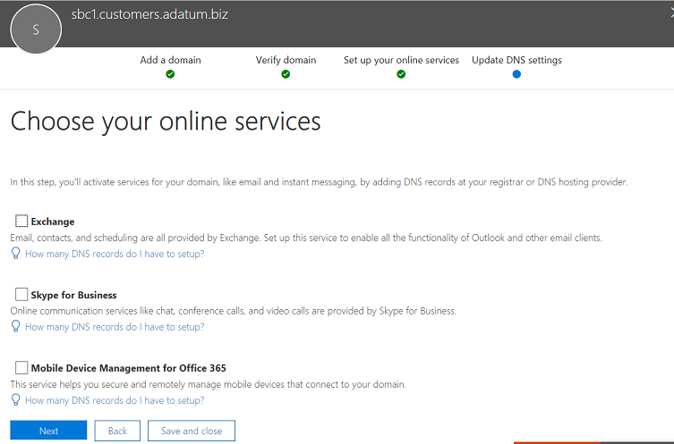

# Configurare un Session Border Controller per più tenant

Il routing diretto supporta la configurazione di un controller SBC (Session Border Controller) per servire più tenant.

> [!NOTE]
> Questo scenario è progettato per i partner Microsoft e/o i gestori PSTN, definiti gestori più avanti in questo documento. Un gestore vende servizi di telefonia Microsoft Teams ai propri clienti. 

Un corriere:
- Distribuisce e gestisce un SBC nel data center (i clienti non devono implementare un SBC e ricevono servizi di telefonia dal gestore nel client Teams).
- Collega il database SBC a più tenant.
- Fornisce servizi PSTN ai clienti.
- Gestisce la qualità delle chiamate end-to-end.
- Addebiti separati per i servizi PSTN.

Microsoft non gestisce i gestori. Microsoft offre un PBX (Telefono Microsoft System) e un Teams client. Microsoft certifica anche i telefoni e certifica gli SBC che possono essere usati con il Telefono Microsoft Sistema. Prima di scegliere un gestore, assicurati che la tua scelta abbia un SBC certificato e possa gestire la qualità vocale end-to-end.

Di seguito sono riportati i passaggi di implementazione tecnica per configurare lo scenario.

**Solo corriere:**
1. Distribuire SBC e configurarlo per lo scenario di hosting in base alle [istruzioni dei fornitori SBC certificati.](#deploy-and-configure-the-sbc)
2. Registrare un nome di dominio di base nel tenant del gestore e richiedere un certificato con caratteri jolly.
3. Registrare un sottodominio per ogni cliente, che fa parte del dominio di base.

**Gestore con un amministratore globale del cliente:**
1. Aggiungere il nome del sottodominio al tenant del cliente.
2. Attivare il nome del sottodominio.
3. Configurare il trunk dal gestore al tenant del cliente ed eseguire il provisioning degli utenti.

*Assicurarsi di comprendere le nozioni di base sul DNS e come viene gestito il nome di dominio in Microsoft 365 o Office 365. Consulta [Ottenere assistenza per Microsoft 365 o Office 365 domini](https://support.office.com/article/Get-help-with-Office-365-domains-28343f3a-dcee-41b6-9b97-5b0f4999b7ef) prima di procedere ulteriormente.*

## Distribuire e configurare SBC

Per la procedura dettagliata su come distribuire e configurare SBC per uno scenario di hosting SBC, vedere la documentazione del fornitore di SBC.

- **AudioCodes:** [Note di](https://www.audiocodes.com/solutions-products/products/products-for-microsoft-365/direct-routing-for-Microsoft-Teams)configurazione del routing diretto , configurazione dello scenario di hosting SBC descritto in "Connessione di AudioCodes SBC a Microsoft Teams Nota di configurazione del modello di hosting del routing diretto". 
- **Oracle:** [Note sulla configurazione del routing](https://www.oracle.com/technetwork/indexes/documentation/acme-packet-2228107.html)diretto , la configurazione dello scenario di hosting SBC è descritta nella sezione "Microsoft". 
- **Comunicazioni sulla barra multifunzione:**  Fare riferimento alla Guida alla configurazione di [SBC Core Microsoft Teams](https://support.sonus.net/display/IOT/PBXs+-+SBC+5k7kSWe) Ribbon Communications per la documentazione su come configurare gli SBC ribbon Core Series e a questa pagina Procedure consigliate per la barra multifunzione - Configurazione dei gestori per [Microsoft Teams Direct Routing SBC Edge](https://support.sonus.net/display/UXDOC81/Connect+SBC+Edge+to+Microsoft+Teams+Direct+Routing+to+Support+Direct+Routing+Carrier)
- **TE-Systems (anynode):**  Registrarsi nella pagina [te-Systems Community](https://community.te-systems.de/) documentazione ed esempi su come configurare anynode SBC per più tenant.
- **Metaswitch:**  Per la documentazione su come abilitare Perimeta SBC [per più tenant, registrarsi](https://manuals.metaswitch.com/MAN39555) nella pagina Community Metaswitch.

> [!NOTE]
> Prestare attenzione a come configurare l'intestazione "Contatto". L'intestazione Contatto viene usata per trovare il tenant del cliente nel messaggio di invito in arrivo. 

## Registrare un dominio di base e sottodomini

Per lo scenario di hosting, è necessario creare:
- Un nome di dominio di base di proprietà del gestore.
- Sottodominio che fa parte del nome di dominio di base in ogni tenant del cliente.

Nell'esempio seguente:
- Adatum è un gestore che serve diversi clienti fornendo servizi Internet e telefonia.
- Woodgrove Bank, Contoso e Adventure Works sono tre clienti che hanno domini Microsoft 365 o Office 365 ma ricevono i servizi di telefonia da Adatum.

I sottodomini **DEVONO** corrispondere al nome FQDN del trunk che verrà configurato per il cliente e all'FQDN nell'intestazione Contatto quando si invia l'invito a Microsoft 365 o Office 365. 

Quando una chiamata arriva all'interfaccia Microsoft 365 o Office 365 Direct Routing, l'interfaccia usa l'intestazione Contatto per trovare il tenant in cui deve essere cercato l'utente. Routing diretto non usa la ricerca di numeri di telefono nell'invito, perché alcuni clienti potrebbero avere numeri non DID che possono sovrapporsi in diversi tenant. Di conseguenza, il nome FQDN nell'intestazione Contatto è necessario per identificare il tenant esatto in cui cercare l'utente in base al numero di telefono.

*Per altre [informazioni sulla](https://support.office.com/article/Get-help-with-Office-365-domains-28343f3a-dcee-41b6-9b97-5b0f4999b7ef) creazione di nomi di dominio in Microsoft 365 o Office 365, vedere Ottenere assistenza Office 365 domini.*

Il diagramma seguente riepiloga i requisiti per il dominio di base, i sottodomini e l'intestazione Contatto.

Il servizio SBC richiede un certificato per autenticare le connessioni. Per lo scenario di hosting SBC, il gestore deve richiedere un certificato con CN e/o SAN *\* .base_domain (ad esempio, \* .customers.adatum.biz).* Questo certificato può essere usato per autenticare le connessioni a più tenant serviti da un singolo SBC.

La tabella seguente è un esempio di una configurazione.

|Nuovo nome di dominio |Tipo|Registrato  |CN/SAN del certificato per SBC  |Dominio predefinito del tenant nell'esempio  |Nome FQDN che SBC deve presentare nell'intestazione Contatto quando si inviano chiamate agli utenti|
|---------|---------|---------|---------|---------|---------|
|customers.adatum.biz|    Base     |     Nel tenant del gestore  |    \*.customers.adatum.biz  |   adatum.biz      |NA, questo è un tenant del servizio, nessun utente |
|sbc1.customers.adatum.biz|    Sottodominio  |    In un tenant del cliente  |    \*.customers.adatum.biz  | woodgrovebank.us  |  sbc1.customers.adatum.biz|
|sbc2.customers.adatum.biz  |   Sottodominio | In un tenant del cliente   |   \*.customers.adatum.biz   |contoso.com   |sbc2.customers.adatum.biz |
|sbc3.customers.adatum.biz |   Sottodominio | In un tenant del cliente |   \*.customers.adatum.biz  |  adventureworks.com | sbc3.customers.adatum.biz |
||         |         |         |         |         |

Per configurare la base e i sottodomini, seguire la procedura descritta di seguito. Nell'esempio verranno configurate un nome di dominio di base (customers.adatum.biz) e un sottodominio per un cliente (sbc1.customers.adatum.biz nel tenant di Woodgrove Bank).

> [!NOTE]
> Usare sbcX.customers.adatum.biz per abilitare la voce nel tenant del gestore. sbcX può essere qualsiasi nome host alfanumerico univoco e valido.

## Registrare un nome di dominio di base nel tenant del gestore

**Queste azioni vengono eseguite nel tenant del gestore.**

### Assicurarsi di avere diritti appropriati nel tenant del gestore

È possibile aggiungere nuovi domini solo se è stato eseguito l'accesso al interfaccia di amministrazione di Microsoft 365 come amministratore globale. 

Per convalidare il ruolo di cui si dispone, accedere al interfaccia di amministrazione di Microsoft 365 ( , passare a Utenti attivi utenti e quindi verificare di avere https://portal.office.com) un ruolo di amministratore   >  globale. 

Per altre informazioni sui ruoli di amministratore e su come assegnare un ruolo in Microsoft 365 o Office 365, vedere [Informazioni sui ruoli di amministratore.](https://support.office.com/article/About-Office-365-admin-roles-da585eea-f576-4f55-a1e0-87090b6aaa9d)

### Aggiungere un dominio di base al tenant e verificarlo

1. Nella finestra interfaccia di amministrazione di Microsoft 365, passare a **Configurazione**  >  **domini Aggiungi**  >  **dominio**.
2. Nella casella **Immettere un dominio di cui** si è proprietari digitare l'FQDN del dominio di base. Nell'esempio seguente il dominio di base è *customers.adatum.biz*.

    

3. Fare clic su **Avanti**.
4. Nell'esempio, il tenant ha già adatum.biz come nome di dominio verificato. La procedura guidata non chiederà ulteriori verifiche perché customers.adatum.biz è un sottodominio per il nome già registrato. Tuttavia, se si aggiunge un NOME FQDN che non è stato verificato in precedenza, sarà necessario eseguire il processo di verifica. Il processo di verifica è [descritto di seguito.](#add-a-subdomain-to-the-customer-tenant-and-verify-it)

    

5. Fare **clic** su Avanti e nella **pagina Aggiorna Impostazioni DNS** selezionare I record **DNS** verranno aggiunti manualmente e fare clic su **Avanti.**
6. Nella pagina successiva deselezionare tutti i valori, a meno che non si voglia usare il nome di dominio per Exchange, SharePoint o Teams/Skype for Business, fare clic su Avanti e quindi su **Fine.** Verificare che il nuovo dominio sia in stato di completamento dell'installazione.

    

### Attivare il nome di dominio

Dopo aver registrato un nome di dominio, è necessario attivarlo aggiungendo almeno un utente con licenza Sistema telefonico e assegnando un indirizzo SIP con la parte FQDN dell'indirizzo SIP corrispondente al dominio di base creato.

> [!NOTE]
> Il tenant carrier deve mantenere almeno una licenza Sistema telefonico assegnata al tenant per evitare la rimozione della Skype for Business configurazione. 

*Per altre informazioni sull'aggiunta di utenti in Microsoft 365 [Office 365](https://support.office.com/article/Get-help-with-Office-365-domains-28343f3a-dcee-41b6-9b97-5b0f4999b7ef) o Office 365, vedere Ottenere assistenza per i domini di Microsoft 365 o Office 365 aziendali.*

Ad esempio: test@customers.adatum.biz

## Registrare un nome di sottodominio in un tenant del cliente

Sarà necessario creare un nome di sottodominio univoco per ogni cliente. In questo esempio verrà creato un sottodominio sbc1.customers.adatum.biz in un tenant con il nome di dominio predefinito woodgrovebank.us.

**Tutte le azioni seguenti sono nel tenant del cliente.**

### Assicurarsi di avere diritti appropriati nel tenant del cliente

È possibile aggiungere nuovi domini solo se è stato eseguito l'accesso al interfaccia di amministrazione di Microsoft 365 come amministratore globale. 

Per convalidare il ruolo di cui si dispone, accedere al interfaccia di amministrazione di Microsoft 365 ( , passare a Utenti attivi utenti e quindi verificare di avere https://portal.office.com) un ruolo di amministratore   >  globale. 

Per altre informazioni sui ruoli di amministratore e su come assegnare un ruolo in Microsoft 365 o Office 365, vedere [Informazioni sui ruoli di amministratore.](https://support.office.com/article/About-Office-365-admin-roles-da585eea-f576-4f55-a1e0-87090b6aaa9d)

### Aggiungere un sottodominio al tenant del cliente e verificarlo
1. Nella finestra interfaccia di amministrazione di Microsoft 365, passare a **Configurazione**  >  **domini**  >  **Aggiungi dominio**.
2. Nella casella **Immettere un dominio di cui** si è proprietari digitare il nome FQDN del sottodominio per il tenant. Nell'esempio seguente il sottodominio è sbc1.customers.adatum.biz.

    

3. Fare clic su **Avanti**.
4. Il nome FQDN non è mai stato registrato nel tenant. Nel passaggio successivo sarà necessario verificare il dominio. Selezionare **Aggiungi un record TXT.** 

    

5. Fare **clic su** Avanti e prendere nota del valore TXT generato per verificare il nome di dominio.

    

6. Creare il record TXT con il valore del passaggio precedente nel provider di hosting DNS del gestore.

    

    Per altre informazioni, vedere Creare [record DNS presso qualsiasi provider di hosting DNS.](https://support.office.com/article/create-dns-records-at-any-dns-hosting-provider-for-office-365-7b7b075d-79f9-4e37-8a9e-fb60c1d95166)

7. Tornare alla pagina del cliente interfaccia di amministrazione di Microsoft 365 fare clic su **Verifica**. 
8. Nella pagina successiva selezionare I record DNS verranno **aggiunti manualmente** e fare clic su **Avanti.**

    

9. Nella pagina **Scegliere i servizi online** deselezionare tutte le opzioni e fare clic su **Avanti.**

    

10. Fare **clic su** Fine nella pagina Aggiorna impostazioni **DNS.**

    

11. Verificare che lo stato sia **Installazione completata.** 
    
    
    
> [!NOTE]
> L'URL di base e il sottodominio per il singolo client devono essere nello stesso tenant per consentire l'aggiunta di un trunk _di route_ diretto.

### Attivare il nome del sottodominio

Dopo aver registrato un nome di dominio, è necessario attivarlo aggiungendo almeno un utente e assegnando un indirizzo SIP con la parte FQDN dell'indirizzo SIP corrispondente al sottodominio creato nel tenant del cliente. 

*Per altre informazioni sull'aggiunta di utenti in Microsoft 365 [Office 365](https://support.office.com/article/Get-help-with-Office-365-domains-28343f3a-dcee-41b6-9b97-5b0f4999b7ef) o Office 365, vedere Ottenere assistenza per i domini di Microsoft 365 o Office 365 aziendali.*

Ad esempio: test@sbc1.customers.adatum.biz

### Creare un trunk ed eseguire il provisioning degli utenti

Con il rilascio iniziale del routing diretto, Microsoft ha richiesto l'aggiunta di un trunk a ogni tenant servito (tenant del cliente) usando New-CSOnlinePSTNGateway.

Tuttavia, questa operazione non si è rivelata ottimale per due motivi:
 
- **Gestione dei costi generali**. L'offload o il drenaggio di un SBC, ad esempio, modifica alcuni parametri, ad esempio l'abilitazione o la disabilitazione del bypass multimediale. La modifica della porta richiede la modifica dei parametri in più tenant (eseguendo Set-CSOnlinePSTNGateway), ma in realtà è lo stesso SBC. 

-  **Elaborazione dei costi generali**. Raccolta e monitoraggio dei dati di integrità del trunk: le opzioni SIP raccolte da più trunk logici che sono, in realtà, lo stesso SBC e lo stesso trunk fisico rallentano l'elaborazione dei dati di routing.
 
In base a questo feedback, Microsoft sta portando una nuova logica per il provisioning dei trunk per i tenant dei clienti.

Sono state introdotte due nuove entità:
-    Un trunk del gestore registrato nel tenant del gestore usando il comando New-CSOnlinePSTNGateway, ad esempio New-CSOnlinePSTNGateway -FQDN customers.adatum.biz -SIPSignalingport 5068 -ForwardPAI $true.

-    Un trunk derivato, che non richiede la registrazione. Si tratta semplicemente di un nome host desiderato aggiunto dal trunk del gestore. Deriva tutti i parametri di configurazione dal trunk del gestore. Il trunk derivato non deve essere creato in PowerShell e l'associazione con il trunk del gestore è basata sul nome FQDN (vedere i dettagli di seguito).

**Logica di provisioning ed esempio**

-    I corrieri devono solo configurare e gestire un singolo trunk (carrier trunk nel dominio carrier), usando il comando Set-CSOnlinePSTNGateway. Nell'esempio precedente è adatum.biz;
-    Nel tenant del cliente, il gestore deve solo aggiungere l'FQDN del trunk derivato ai criteri di routing vocale degli utenti. Non è necessario eseguire New-CSOnlinePSTNGateway per un trunk.
-    Il trunk derivato, come suggerisce il nome, eredita o deriva tutti i parametri di configurazione dal trunk del vettore. Esempi:
-    Customers.adatum.biz, ovvero il trunk del vettore che deve essere creato nel tenant del gestore.
-    Sbc1.customers.adatum.biz: il trunk derivato in un tenant del cliente che non deve essere creato in PowerShell.  È sufficiente aggiungere il nome del trunk derivato nel tenant del cliente nei criteri di routing vocale online senza crearlo.
-   Il gestore dovrà configurare il record DNS che risolve l'FQDN del trunk derivato nell'indirizzo IP SBC del gestore.

-    Tutte le modifiche apportate a un trunk del vettore (nel tenant del vettore) vengono applicate automaticamente ai trunk derivati. Ad esempio, i corrieri possono modificare una porta SIP nel trunk del vettore e questa modifica si applica a tutti i trunk derivati. Una nuova logica per configurare i trunk semplifica la gestione in quanto non è necessario passare a ogni tenant e modificare il parametro in ogni trunk.
-    Le opzioni vengono inviate solo all'FQDN del trunk del gestore. Lo stato di integrità del trunk del vettore viene applicato a tutti i trunk derivati e viene usato per le decisioni di routing. Altre informazioni sulle [opzioni di instradamento diretto.](./direct-routing-monitor-and-troubleshoot.md)
-    Il corriere può drenare il bagagliaio del vettore e tutti i tronchi derivati verranno prosciugati. 
 
> [!NOTE]
> Le regole di conversione dei numeri applicate al trunk del vettore non si applicano ai trunk derivati. Si tratta di un problema noto. Come soluzione alternativa, è necessario creare una regola di conversione dei numeri per il tenant di ogni cliente.

**Migrazione dal modello precedente al trunk del gestore**
 
Per la migrazione dall'implementazione corrente del modello di gestore ospitato al nuovo modello, i gestori dovranno riconfigurare i trunk per i tenant dei clienti. Rimuovere i trunk dai tenant dei clienti usando Remove-CSOnlinePSTNGateway (lasciando il trunk nel tenant del gestore)-

È consigliabile eseguire la migrazione alla nuova soluzione il più presto possibile, perché miglioreremo il monitoraggio e il provisioning usando il vettore e il modello di trunk derivato.
 

Vedere le istruzioni del fornitore [SBC per](#deploy-and-configure-the-sbc) configurare l'invio del nome FQDN dei sottodomini nell'intestazione Contatto.

## Considerazioni per la configurazione del failover multi-tenant 

Per configurare il failover per un ambiente multi-tenant, è necessario eseguire le operazioni seguenti:

- Per ogni tenant, aggiungere gli FQDN per due SBC diversi.  Ad esempio:

   customer1.sbc1.contoso.com  
   customer1.sbc2.contoso.com  

- Nei criteri routing vocale online degli utenti specificare entrambi gli SBC.  Se un SBC non riesce, i criteri di routing instraderanno le chiamate al secondo SBC.

## Vedere anche

[Pianificare Instradamento diretto](direct-routing-plan.md)

[Configurare Instradamento diretto](direct-routing-configure.md)
