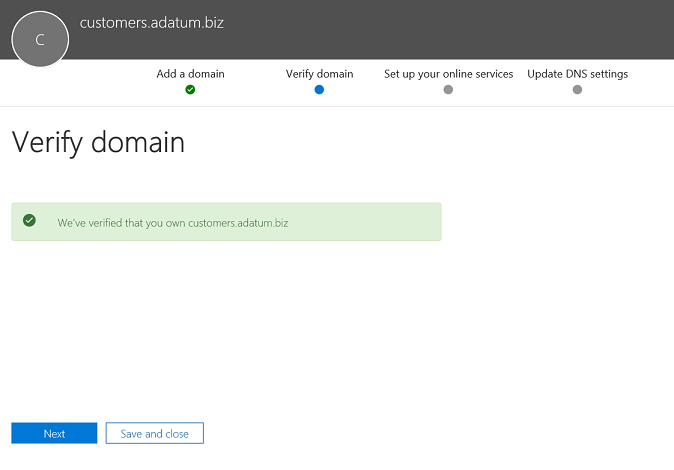

# Configurare un Session Border Controller per più tenant

Il routing diretto supporta la configurazione di uno SBC (Session Border Controller) per servire più tenant.

> [!NOTE]
> Questo scenario è progettato per i partner Microsoft e/o i vettori PSTN, denominati vettori più avanti in questo documento. Un vettore vende i servizi di telefonia forniti a Microsoft teams ai clienti. 

Un elemento portante:
- Distribuisce e gestisce un SBC nel proprio Data Center (i clienti non hanno bisogno di implementare un SBC e ricevono servizi di telefonia dal gestore nel client Teams).
- Connette l'SBC a più tenant.
- Fornisce servizi PSTN ai clienti.
- Gestisce la qualità della chiamata fine alla fine.
- Addebiti separatamente per servizi PSTN.

Microsoft non gestisce i vettori. Microsoft offre un sistema PBX (Microsoft Phone System) e un client teams. Microsoft certifica anche i telefoni e certifica SBCs che può essere usato con il sistema telefonico Microsoft. Prima di scegliere un vettore, assicurati che la tua scelta abbia un SBC certificato e possa gestire la qualità vocale fine alla fine.

Di seguito sono riportate le procedure per l'implementazione tecnica per configurare lo scenario.

**Solo vettore:**
1. Distribuire il SBC e configurarlo per lo scenario di hosting in base alle [istruzioni dei fornitori SBC certificati](#deploy-and-configure-the-sbc).
2. Registrare un nome di dominio di base nel tenant del vettore e richiedere un certificato con caratteri jolly.
3. Registrare un sottodominio per ogni cliente, che fa parte del dominio di base.

**Elemento portante con un amministratore globale del cliente:**
1. Aggiungere il nome del sottodominio al tenant del cliente.
2. Attivare il nome del sottodominio.
3. Configurare il trunk dal vettore al tenant del cliente e provisionare gli utenti.

*Verificare di aver compreso le nozioni di base sul DNS e come viene gestito il nome di dominio in Office 365. Vedere [ottenere assistenza con i domini di Office 365 prima di](https://support.office.com/article/Get-help-with-Office-365-domains-28343f3a-dcee-41b6-9b97-5b0f4999b7ef) procedere ulteriormente.*

## Distribuire e configurare SBC

Per la procedura dettagliata relativa alla distribuzione e alla configurazione di SBCs per uno scenario di hosting SBC, vedere la documentazione del fornitore SBC.

- **AudioCodes:** [Note di configurazione del routing diretto](https://www.audiocodes.com/solutions-products/products/products-for-microsoft-365/direct-routing-for-Microsoft-Teams), la configurazione dello scenario di hosting SBC descritto in "connessione di AudioCodes SBC a Microsoft teams Direct routing modello di hosting nota di configurazione". 
- **Oracle:** [Note di configurazione del routing diretto](https://www.oracle.com/technetwork/indexes/documentation/acme-packet-2228107.html), la configurazione dello scenario di hosting SBC è descritta nella sezione "Microsoft". 
- **Comunicazioni della barra multifunzione:**  Vedere la guida alla [configurazione di Microsoft teams della barra multifunzione](https://support.sonus.net/display/IOT/PBXs+-+SBC+5k7kSWe) per la documentazione su come configurare SBCS della serie Core della barra multifunzione e la [procedura consigliata della barra multifunzione-configurazione dei vettori per Microsoft teams Direct routing SBC Edge](https://support.sonus.net/display/UXDOC70/Best+Practice+-+Configuring+Carriers+for+Microsoft+Teams+Direct+Routing)
- **Te-Systems (anynode):**  Eseguire la registrazione nella [pagina della community di te-Systems](https://community.te-systems.de/) per la documentazione e gli esempi relativi alla configurazione di anynode SBC per più tenant.

> [!NOTE]
> Fare attenzione a come configurare l'intestazione "contatto". L'intestazione del contatto viene usata per trovare il tenant del cliente nel messaggio di invito in arrivo. 

## Registrare un dominio e sottodomini di base

Per lo scenario di hosting, è necessario creare:
- Un nome di dominio di base di proprietà del vettore.
- Sottodominio che fa parte del nome di dominio di base in ogni tenant del cliente.

Nell'esempio seguente:
- Adatum è un gestore che offre numerosi clienti fornendo servizi Internet e telefonia.
- Woodgrove Bank, Contoso e Adventure Works sono tre clienti che hanno domini di Office 365 ma ricevono i servizi di telefonia da adatum.

I sottodomini **devono** corrispondere al nome FQDN del trunk che verrà configurato per il cliente e l'FQDN nell'intestazione del contatto durante l'invio dell'invito a Office 365. 

Quando una chiamata arriva all'interfaccia di routing diretto di Office 365, l'interfaccia usa l'intestazione contatto per trovare il tenant in cui l'utente deve essere cercato. Il routing diretto non usa la ricerca di numeri di telefono nell'invito, perché alcuni clienti potrebbero avere numeri non DID che possono sovrapporsi in diversi tenant. Di conseguenza, il nome FQDN nell'intestazione del contatto è necessario per identificare il tenant esatto per cercare l'utente tramite il numero di telefono.

*Per altre informazioni sulla creazione di nomi di dominio nelle organizzazioni di Office 365, vedere [ottenere assistenza con i domini di office 365](https://support.office.com/article/Get-help-with-Office-365-domains-28343f3a-dcee-41b6-9b97-5b0f4999b7ef) .*

Il diagramma seguente riepiloga i requisiti per il dominio di base, i sottodomini e l'intestazione del contatto.

Il SBC richiede un certificato per l'autenticazione delle connessioni. Per lo scenario di hosting SBC, il gestore deve richiedere un certificato con San * \*. base_domain (ad esempio, \*. Customers.adatum.biz)*. Questo certificato può essere usato per autenticare le connessioni a più tenant serviti da un singolo SBC.

La tabella seguente è un esempio di una configurazione.

|Nuovo nome di dominio |Tipo|Registrato  |SAN certificato per SBC  |Dominio predefinito tenant nell'esempio  |Nome FQDN che SBC deve presentare nell'intestazione del contatto durante l'invio di chiamate agli utenti|
|---------|---------|---------|---------|---------|---------|
|customers.adatum.biz|    Base     |     Nel tenant del Carrier  |    \*. customers.adatum.biz  |   adatum.biz      |NA, questo è un tenant del servizio, nessun utente |
|sbc1.customers.adatum.biz|    Sottodominio  |    In un tenant del cliente  |    \*. customers.adatum.biz  | woodgrovebank.us  |  sbc1.customers.adatum.biz|
|sbc2.customers.adatum.biz  |   Sottodominio | In un tenant del cliente   |   \*. customers.adatum.biz   |contoso.com   |sbc2.customers.adatum.biz |
|sbc3.customers.adatum.biz |   Sottodominio | In un tenant del cliente |   \*. customers.adatum.biz  |  adventureworks.com | sbc3.customers.adatum.biz |
||         |         |         |         |         |

Per configurare la base e i sottodomini, seguire i passaggi descritti di seguito. Nell'esempio verrà configurato un nome di dominio di base (customers.adatum.biz) e un sottodominio per un cliente (sbc1.customers.adatum.biz nel tenant della Woodgrove Bank).

> [!NOTE]
> Usare sbcX.customers.adatum.biz per abilitare la voce nel tenant del gestore.

## Registrare un nome di dominio di base nel tenant del vettore

**Queste azioni vengono eseguite nel tenant del vettore.**

### Verificare di avere diritti appropriati nel tenant del vettore

È possibile aggiungere nuovi domini solo se è stato effettuato l'accesso all'interfaccia di amministrazione di Microsoft 365 come amministratore globale. 

Per convalidare il ruolo che si ha, accedere all'interfaccia di amministrazione di Microsofthttps://portal.office.com)365 (, **passare a** > utenti**attivi**e quindi verificare di avere un ruolo di amministratore globale. 

Per altre informazioni sui ruoli di amministratore e su come assegnare un ruolo in Office 365, vedere [informazioni sui ruoli di amministratore di office 365](https://support.office.com/article/About-Office-365-admin-roles-da585eea-f576-4f55-a1e0-87090b6aaa9d).

### Aggiungere un dominio di base al tenant e verificarlo

1.    Nell'interfaccia di amministrazione di Microsoft 365, accedere a Domains di **configurazione** > **Domains** > **Aggiungi dominio**.
2.    Nella casella **immettere un dominio** Digitare l'FQDN del dominio di base. Nell'esempio seguente il dominio di base è *Customers.adatum.biz*.

    

3. Fare clic su **Avanti**.
4. Nell'esempio il tenant ha già adatum.biz come nome di dominio verificato. La procedura guidata non richiederà ulteriori verifiche perché customers.adatum.biz è un sottodominio per il nome già registrato. Tuttavia, se si aggiunge un nome di dominio completo che non è stato verificato prima, sarà necessario eseguire il processo di verifica. Il processo di verifica è [descritto di seguito](#add-a-subdomain-to-the-customer-tenant-and-verify-it).

    

5.    Fare clic su **Avanti**, quindi nella pagina **Aggiorna impostazioni DNS** Selezionare **aggiungerò i record DNS** e fare clic su **Avanti**.
6.    Nella pagina successiva deselezionare tutti i valori (a meno che non si voglia usare il nome di dominio per Exchange, SharePoint o teams/Skype for business), fare clic su **Avanti**e quindi su **fine**. Verificare che il nuovo dominio sia nello stato di completamento della configurazione.

    

### Attivare il nome di dominio

Dopo aver registrato un nome di dominio, è necessario attivarlo aggiungendo almeno un utente con licenza E1, E3 o E5 e assegnando un indirizzo SIP con la parte FQDN dell'indirizzo SIP corrispondente al dominio di base creato. 

*Per altre informazioni sull'aggiunta di utenti nelle organizzazioni di Office 365, vedere [ottenere assistenza per i domini di office 365](https://support.office.com/article/Get-help-with-Office-365-domains-28343f3a-dcee-41b6-9b97-5b0f4999b7ef) .*

Ad esempio: test@customers.adatum.biz

## Registrare un nome di sottodominio in un tenant del cliente

Sarà necessario creare un nome di sottodominio univoco per ogni cliente. In questo esempio creeremo un sottodominio sbc1.customers.adatum.biz in un tenant con il nome di dominio predefinito woodgrovebank.us.

**Tutte le azioni seguenti sono nel tenant del cliente.**

### Verificare di avere diritti appropriati nel tenant del cliente

È possibile aggiungere nuovi domini solo se è stato effettuato l'accesso all'interfaccia di amministrazione di Microsoft 365 come amministratore globale. 

Per convalidare il ruolo che si ha, accedere all'interfaccia di amministrazione di Microsofthttps://portal.office.com)365 (, **passare a** > utenti**attivi**e quindi verificare di avere un ruolo di amministratore globale. 

Per altre informazioni sui ruoli di amministratore e su come assegnare un ruolo in Office 365, vedere [informazioni sui ruoli di amministratore di office 365](https://support.office.com/article/About-Office-365-admin-roles-da585eea-f576-4f55-a1e0-87090b6aaa9d).

### Aggiungere un sottodominio al tenant del cliente e verificarlo
1. Nell'interfaccia di amministrazione di Microsoft 365, accedere a Domains di **configurazione** > **Domains** > **Aggiungi dominio**.
2. Nella casella **immettere un dominio** Digitare il nome di dominio completo del sottodominio per il tenant. Nell'esempio seguente il sottodominio è sbc1.customers.adatum.biz.

    

3. Fare clic su **Avanti**.
4. Il nome di dominio completo non è mai stato registrato nel tenant. Nel passaggio successivo sarà necessario verificare il dominio. Selezionare **Aggiungi un record TXT**. 

    

5. Fare clic su **Avanti**e prendere nota del valore txt generato per verificare il nome di dominio.

    

6. Creare il record TXT con il valore del passaggio precedente nel provider di hosting DNS del gestore.

    

    Per altre informazioni, vedere [creare record DNS presso qualsiasi provider di hosting DNS per Office 365](https://support.office.com/article/create-dns-records-at-any-dns-hosting-provider-for-office-365-7b7b075d-79f9-4e37-8a9e-fb60c1d95166).

7. Tornare all'interfaccia di amministrazione di Microsoft 365 del cliente e fare clic su **Verifica**. 
8. Nella pagina successiva selezionare **aggiungerò personalmente i record DNS** e fare clic su **Avanti**.

    

9. Nella pagina **scegliere i servizi online** deselezionare tutte le opzioni e fare clic su **Avanti**.

    

10. Fare clic su **fine** nella pagina **Aggiorna impostazioni DNS** .

    

11. Verificare che lo stato sia **impostato su completata**. 
    
    

### Attivare il nome del sottodominio

Dopo aver registrato un nome di dominio, è necessario attivarlo aggiungendo almeno un utente e assegnando un indirizzo SIP con la parte FQDN dell'indirizzo SIP corrispondente al sottodominio creato nel tenant del cliente.

*Per altre informazioni sull'aggiunta di utenti nelle organizzazioni di Office 365, vedere [ottenere assistenza per i domini di office 365](https://support.office.com/article/Get-help-with-Office-365-domains-28343f3a-dcee-41b6-9b97-5b0f4999b7ef) .*

Ad esempio: test@sbc1.customers.adatum.biz

### Creare un trunk e eseguire il provisioning degli utenti

Con la versione iniziale di routing diretto, Microsoft ha richiesto un trunk da aggiungere a ogni inquilino servito (tenant del cliente) usando New-CSOnlinePSTNGateway.

Tuttavia, questo risultato non è stato ottimale per due motivi:
 
- **Gestione overhead**. Lo scarico o lo svuotamento di un SBC, ad esempio, modifica alcuni parametri, come l'abilitazione o la disabilitazione del bypass multimediale. La modifica della porta richiede la modifica di parametri in più tenant (eseguendo set-CSOnlinePSTNGateway), ma in realtà è lo stesso SBC. 

-  **Elaborazione overhead**. Raccolta e monitoraggio dei dati di integrità del trunk: le opzioni SIP raccolte da più trunk logici, in realtà lo stesso SBC e lo stesso trunk fisico, rallentano l'elaborazione dei dati di routing.
 
In base a questo feedback, Microsoft sta introducendo una nuova logica per eseguire il provisioning dei trunk per i tenant del cliente.

Sono state introdotte due nuove entità:
-    Un tronco vettore registrato nel tenant del vettore usando il comando New-CSOnlinePSTNGateway, ad esempio New-CSOnlinePSTNGateway-FQDN customers.adatum.biz-SIPSignalingport 5068-ForwardPAI $true.

-    Un trunk derivato, che non richiede la registrazione. È semplicemente un nome host desiderato aggiunto dal trunk del vettore. Derivano tutti i parametri di configurazione dal trunk del vettore. Il trunk derivato non deve essere creato in PowerShell e l'associazione con il trunk del vettore si basa sul nome FQDN (Vedi dettagli seguenti).

**Logica di provisioning ed esempio**

-    I vettori devono solo configurare e gestire un singolo trunk (trunk Carrier nel dominio vettore) usando il comando set-CSOnlinePSTNGateway. Nell'esempio precedente è adatum.biz;
-    Nel tenant del cliente, il vettore deve solo aggiungere il nome di dominio completo del trunk derivato ai criteri di routing vocale degli utenti. Non è necessario eseguire New-CSOnlinePSTNGateway per un trunk.
-     Il trunk derivato, come suggerisce il nome, eredita o deriva tutti i parametri di configurazione dal trunk del vettore. Esempi
-    Customers.adatum.biz-il tronco portante che deve essere creato nel tenant del vettore.
-    Sbc1.customers.adatum.biz: il trunk derivato in un tenant del cliente che non deve essere creato in PowerShell.  È possibile aggiungere semplicemente il nome del trunk derivato nel tenant del cliente nei criteri di routing vocale online senza crearlo.
-   Il gestore dovrà impostare il record DNS che risolve il nome FQDN del trunk derivato nell'indirizzo IP di Carrier SBC.

-    Tutte le modifiche apportate a un trunk del vettore (sul tenant del gestore) vengono applicate automaticamente ai trunk derivati. Ad esempio, i vettori possono cambiare una porta SIP nel trunk del vettore e questa modifica si applica a tutti i trunk derivati. La nuova logica per configurare i trunk semplifica la gestione perché non è necessario passare a ogni tenant e cambiare il parametro in ogni trunk.
-    Le opzioni vengono inviate solo al nome di dominio completo del trunk vettore. Lo stato di integrità del trunk del vettore viene applicato a tutti i trunk derivati e viene usato per le decisioni di routing. Altre informazioni sulle [Opzioni di routing diretto](https://docs.microsoft.com/microsoftteams/direct-routing-monitor-and-troubleshoot).
-    Il vettore può drenare il tronco del vettore e tutti i tronchi derivati verranno drenati. 
 

**Migrazione dal modello precedente al trunk del vettore**
 
Per la migrazione dall'implementazione corrente del modello ospitato dal vettore al nuovo modello, i vettori dovranno riconfigurare i trunk per i tenant del cliente. Rimuovere i Trunks dagli inquilini del cliente usando Remove-CSOnlinePSTNGateway (lasciando il tronco nel tenant del vettore)-

Invitiamo vivamente la migrazione alla nuova soluzione il più presto possibile, per migliorare il monitoraggio e il provisioning tramite il modello Carrier e trunk derivato.
 

Fare riferimento alle [istruzioni del fornitore SBC](#deploy-and-configure-the-sbc) per la configurazione dell'invio del nome FQDN dei sottodomini nell'intestazione del contatto.

## Considerazioni per la configurazione del failover muti-tenant 

Per configurare il failover per un ambiente multi-tenant, è necessario eseguire le operazioni seguenti:

- Per ogni tenant, aggiungere i nomi di dominio completi per due diversi SBCs.  Ad esempio:

   customer1.sbc1.contoso.com  
   customer2.sbc2.contoso.com  

- Nei criteri di routing vocale online degli utenti specificare sia SBCs.  Se un SBC non riesce, i criteri di routing instradano le chiamate al secondo SBC.

## Vedere anche

[Pianificare Instradamento diretto](direct-routing-plan.md)

[Configurare Instradamento diretto](direct-routing-configure.md)

