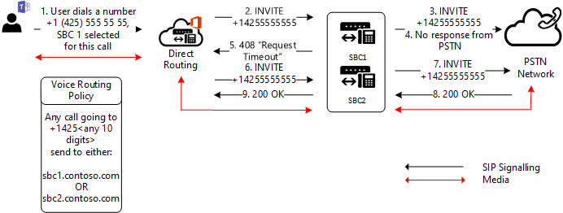

# Failover trunk sulle chiamate in uscita

Questo argomento descrive come evitare il failover trunk sulle chiamate in uscita, dal Teams al Session Border Controller (SBC).

## Errori di failover in rete

Se non è possibile connettersi a un trunk per qualsiasi motivo, la connessione allo stesso trunk verrà provata da un altro data center Microsoft. Un trunk potrebbe non essere connesso, ad esempio se una connessione viene rifiutata, se c'è un timeout TLS o se ci sono altri problemi a livello di rete.
Ad esempio, una connessione potrebbe non riuscire se un amministratore limita l'accesso al database SBC solo da indirizzi IP noti, ma dimentica di inserire gli indirizzi IP di tutti i data center di Routing diretto Microsoft nell'elenco di controllo di accesso (ACL) del database SBC. 

## Failover di codici SIP specifici ricevuti da Session Border Controller (SBC)

Se Routing diretto riceve codici di errore SIP 4xx o 6xx in risposta a un invito in uscita, la chiamata viene considerata completata per impostazione predefinita. In uscita si intende una chiamata da un client Teams alla rete PSTN (Public Switched Telephone Network) con il flusso di traffico seguente: Teams Client -> Direct Routing -> SBC -> Telephony network.

L'elenco dei codici SIP è disponibile in [SESSION Initiation Protocol (SIP) RFC](https://tools.ietf.org/html/rfc3261).

Si supponga una situazione in cui un SBC ha risposto a un invito in arrivo con il codice "408 Request Timeout: Il server non è stato in grado di produrre una risposta entro un periodo di tempo adeguato, ad esempio se non è stato in grado di determinare la posizione dell'utente in tempo. Il client può ripetere la richiesta senza modifiche in un secondo momento".

Questo particolare SBC potrebbe avere difficoltà a connettersi al chiamato, ad esempio a causa di una configurazione errata della rete o di un altro errore. Tuttavia, c'è un altro SBC nel percorso che potrebbe essere in grado di raggiungere il chiamato.

Nel diagramma seguente, quando un utente effettua una chiamata a un numero di telefono, nel percorso sono presenti due SBC che possono potenzialmente recapitare la chiamata. Inizialmente, SBC1.contoso.com per la chiamata, ma SBC1.contoso.com non è in grado di raggiungere una rete PTSN a causa di un problema di rete.
Per impostazione predefinita, la chiamata verrà completata in questo momento. 
 

Ma c'è un altro SBC nel percorso che potenzialmente può recapitare la chiamata.
Se si configura il parametro , verrà provato il secondo `Set-CSOnlinePSTNGateway -Identity sbc1.contoso.com -FailoverResponseCodes "408"` SBC, SBC2.contoso.com nel diagramma seguente:

L'impostazione del parametro -FailoverResponseCodes e la specifica dei codici consentono di ottimizzare il routing ed evitare potenziali problemi quando un SBC non può effettuare una chiamata a causa di problemi di rete o di altro tipo.

Valori predefiniti: 408, 503, 504

