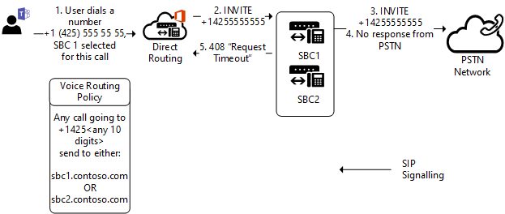

# Failover trunk sulle chiamate in uscita

Questo argomento descrive come evitare failover del trunk nelle chiamate in uscita, da Teams a SBC (Session Border Controller).

## Errori di failover sulla rete

Se non è possibile connettere un trunk per qualsiasi motivo, la connessione allo stesso trunk verrà provata da un altro data center Microsoft. Il data center potrebbe trovarsi in un'area geografica diversa, al di fuori di quella corrente. Un trunk potrebbe non essere connesso se una connessione viene rifiutata, se c'è un timeout TLS o se ci sono altri problemi a livello di rete.

Ad esempio, una connessione potrebbe non riuscire se un amministratore limita l'accesso a SBC solo da indirizzi IP noti, ma dimentica di inserire gli indirizzi IP di tutti i data center di Microsoft Direct Routing nell'elenco Controllo di accesso (ACL) di SBC.For example, a connection might fail if an administrator limits access to the SBC only from well-known IP addresses, but forgets to put the IP addresses of all Microsoft Direct Routing datacenters on the Controllo di accesso List (ACL) of the SBC. 

## Failover di specifici codici SIP ricevuti dal session border controller (SBC)

Se il routing diretto riceve codici di errore SIP 4xx o 6xx in risposta a un invito in uscita, la chiamata viene considerata completata per impostazione predefinita. In uscita indica una chiamata da un client di Teams alla rete PSTN (Public Switched Telephone Network) con il flusso di traffico seguente: Client di Teams -> Direct Routing -> SBC -> Rete di telefonia.

L'elenco dei codici SIP è disponibile in [Session Initiation Protocol (SIP) RFC](https://tools.ietf.org/html/rfc3261).

Si supponga che una SBC abbia risposto a un invito in arrivo con il codice "Timeout richiesta 408: il server non ha potuto produrre una risposta entro un periodo di tempo appropriato, ad esempio, se non è stato possibile determinare la posizione dell'utente nel tempo. Il cliente PUÒ ripetere la richiesta senza modifiche in qualsiasi momento".

Questo SBC particolare potrebbe avere difficoltà a connettersi al chiamante, ad esempio a causa di una configurazione errata della rete o di altri errori. Tuttavia, c'è un altro SBC nel percorso che potrebbe essere in grado di raggiungere il destinatario della chiamata.

Nel diagramma seguente, quando un utente effettua una chiamata a un numero di telefono, ci sono due SBC nel percorso che possono potenzialmente recapitare la chiamata. Inizialmente, viene selezionato SBC1.contoso.com per la chiamata, ma SBC1.contoso.com non riesce a raggiungere una rete PTSN a causa di un problema di rete.
Per impostazione predefinita, la chiamata verrà completata in questo momento. 
 

C'è un altro SBC nel percorso che può potenzialmente recapitare la chiamata.
Se si configura il parametro `Set-CSOnlinePSTNGateway -Identity sbc1.contoso.com -FailoverResponseCodes "408"`, verrà tentato il secondo SBC (SBC2.contoso.com nel diagramma seguente):

L'impostazione del parametro -FailoverResponseCodes e l'impostazione dei codici consentono di ottimizzare il routing ed evitare potenziali problemi quando un'SBC non riesce a effettuare una chiamata a causa di problemi di rete o di altro livello.

Valori predefiniti: 408, 503, 504

