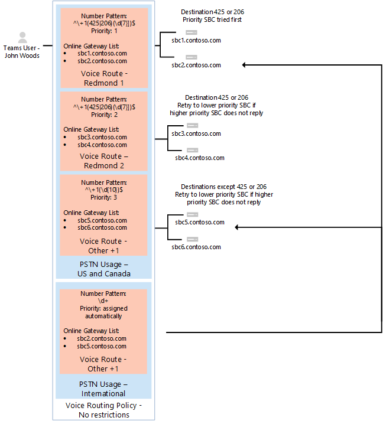

# <a name="configure-voice-routing-for-direct-routing"></a><span data-ttu-id="8bf60-103">Configurare il routing vocale per il routing diretto</span><span class="sxs-lookup"><span data-stu-id="8bf60-103">Configure voice routing for Direct Routing</span></span>

<span data-ttu-id="8bf60-104">Questo articolo descrive come configurare il routing vocale per il routing diretto del sistema telefonico.</span><span class="sxs-lookup"><span data-stu-id="8bf60-104">This article describes how to configure voice routing for Phone System Direct Routing.</span></span>  <span data-ttu-id="8bf60-105">Questo è il passaggio 3 dei passaggi seguenti per la configurazione del routing diretto:</span><span class="sxs-lookup"><span data-stu-id="8bf60-105">This is step 3 of the following steps for configuring Direct Routing:</span></span>

- <span data-ttu-id="8bf60-106">Passaggio 1.</span><span class="sxs-lookup"><span data-stu-id="8bf60-106">Step 1.</span></span> [<span data-ttu-id="8bf60-107">Connettere il SBC con il sistema telefonico Microsoft e convalidare la connessione</span><span class="sxs-lookup"><span data-stu-id="8bf60-107">Connect the SBC with Microsoft Phone System and validate the connection</span></span>](direct-routing-connect-the-sbc.md) 
- <span data-ttu-id="8bf60-108">Passaggio 2.</span><span class="sxs-lookup"><span data-stu-id="8bf60-108">Step 2.</span></span> [<span data-ttu-id="8bf60-109">Abilitare gli utenti per il routing diretto, la voce e la segreteria telefonica</span><span class="sxs-lookup"><span data-stu-id="8bf60-109">Enable users for Direct Routing, voice, and voicemail</span></span>](direct-routing-enable-users.md)    
- <span data-ttu-id="8bf60-110">**Passaggio 3. Configurare il routing vocale** (questo articolo)</span><span class="sxs-lookup"><span data-stu-id="8bf60-110">**Step 3. Configure voice routing** (This article)</span></span>
- <span data-ttu-id="8bf60-111">Passaggio 4.</span><span class="sxs-lookup"><span data-stu-id="8bf60-111">Step 4.</span></span> [<span data-ttu-id="8bf60-112">Tradurre i numeri in un formato alternativo</span><span class="sxs-lookup"><span data-stu-id="8bf60-112">Translate numbers to an alternate format</span></span>](direct-routing-translate-numbers.md) 

<span data-ttu-id="8bf60-113">Per informazioni su tutti i passaggi necessari per la configurazione del routing diretto, vedere [configurare il routing diretto](direct-routing-configure.md).</span><span class="sxs-lookup"><span data-stu-id="8bf60-113">For information on all the steps required for setting up Direct Routing, see [Configure Direct Routing](direct-routing-configure.md).</span></span>

## <a name="voice-routing-overview"></a><span data-ttu-id="8bf60-114">Panoramica del routing vocale</span><span class="sxs-lookup"><span data-stu-id="8bf60-114">Voice routing overview</span></span>

<span data-ttu-id="8bf60-115">Microsoft Phone System include un meccanismo di routing che consente di inviare una chiamata a un SBC (Session Border Controller) specifico basato su:</span><span class="sxs-lookup"><span data-stu-id="8bf60-115">Microsoft Phone System has a routing mechanism that allows a call to be sent to a specific Session Border Controller (SBC) based on:</span></span> 

- <span data-ttu-id="8bf60-116">Modello di numero definito</span><span class="sxs-lookup"><span data-stu-id="8bf60-116">The called number pattern</span></span> 
- <span data-ttu-id="8bf60-117">Il modello di numero chiamato più l'utente specifico che effettua la chiamata</span><span class="sxs-lookup"><span data-stu-id="8bf60-117">The called number pattern plus the specific user who makes the call</span></span>
 
<span data-ttu-id="8bf60-118">SBCs può essere designato come attivo e backup.</span><span class="sxs-lookup"><span data-stu-id="8bf60-118">SBCs can be designated as active and backup.</span></span> <span data-ttu-id="8bf60-119">Quando l'SBC configurato come attivo non è disponibile per una route di chiamata specifica, la chiamata verrà instradata a un SBC di backup.</span><span class="sxs-lookup"><span data-stu-id="8bf60-119">When the SBC that is configured as active is not available for a specific call route, then the call will be routed to a backup SBC.</span></span>
 
<span data-ttu-id="8bf60-120">Il routing vocale è costituito dagli elementi seguenti:</span><span class="sxs-lookup"><span data-stu-id="8bf60-120">Voice routing is made up of the following elements:</span></span> 

- <span data-ttu-id="8bf60-121">**Criteri di routing vocale** : un contenitore per gli usi PSTN, che può essere assegnato a un utente o a più utenti.</span><span class="sxs-lookup"><span data-stu-id="8bf60-121">**Voice routing policy** – A container for PSTN Usages, which can be assigned to a user or to multiple users.</span></span> 

- <span data-ttu-id="8bf60-122">**Usi PSTN** : un contenitore per le route vocali e gli usi PSTN, che possono essere condivisi in criteri di routing vocale diversi.</span><span class="sxs-lookup"><span data-stu-id="8bf60-122">**PSTN usages** – A container for voice routes and PSTN usages, which can be shared in different voice routing policies.</span></span> 

- <span data-ttu-id="8bf60-123">**Route vocali** : uno schema numerico e un set di gateway PSTN online da usare per le chiamate in cui il numero chiamante corrisponde allo schema.</span><span class="sxs-lookup"><span data-stu-id="8bf60-123">**Voice Routes** – A number pattern and set of online PSTN gateways to use for calls where the calling number matches the pattern.</span></span>

- <span data-ttu-id="8bf60-124">**Gateway PSTN online** : puntatore a un SBC che memorizza anche la configurazione applicata quando viene inserita una chiamata tramite SBC, ad esempio inoltra P-Asserted-Identity (PAI) o codec preferiti; possono essere aggiunte alle route vocali.</span><span class="sxs-lookup"><span data-stu-id="8bf60-124">**Online PSTN gateway** - A pointer to an SBC that also stores the configuration that is applied when a call is placed through the SBC, such as forward P-Asserted-Identity (PAI) or Preferred Codecs; can be added to voice routes.</span></span>

## <a name="example-1-voice-routing-with-one-pstn-usage"></a><span data-ttu-id="8bf60-125">Esempio 1: routing vocale con un solo utilizzo PSTN</span><span class="sxs-lookup"><span data-stu-id="8bf60-125">Example 1: Voice routing with one PSTN Usage</span></span>

<span data-ttu-id="8bf60-126">Il diagramma seguente mostra due esempi di criteri di routing vocale in un flusso di chiamata.</span><span class="sxs-lookup"><span data-stu-id="8bf60-126">The following diagram shows two examples of voice routing policies in a call flow.</span></span>

<span data-ttu-id="8bf60-127">**Flusso di chiamata 1 (a sinistra):** Se un utente effettua una chiamata a + 1 425 XXX XX XX o + 1 206 XXX XX XX, la chiamata viene instradata a SBC sbc1.contoso.biz o sbc2.contoso.biz.</span><span class="sxs-lookup"><span data-stu-id="8bf60-127">**Call Flow 1 (on the left):** If a user makes a call to +1 425 XXX XX XX or +1 206 XXX XX XX, the call is routed to SBC sbc1.contoso.biz or sbc2.contoso.biz.</span></span> <span data-ttu-id="8bf60-128">Se non sono disponibili né sbc1.contoso.biz né sbc2.contoso.biz, la chiamata viene eliminata.</span><span class="sxs-lookup"><span data-stu-id="8bf60-128">If neither sbc1.contoso.biz nor sbc2.contoso.biz are available, the call is dropped.</span></span> 

<span data-ttu-id="8bf60-129">**Chiamata flusso 2 (a destra):** Se un utente effettua una chiamata a + 1 425 XXX XX XX o + 1 206 XXX XX XX, la chiamata viene prima indirizzata a SBC sbc1.contoso.biz o sbc2.contoso.biz.</span><span class="sxs-lookup"><span data-stu-id="8bf60-129">**Call Flow 2 (on the right):** If a user makes a call to +1 425 XXX XX XX or +1 206 XXX XX XX, the call is first routed to SBC sbc1.contoso.biz or sbc2.contoso.biz.</span></span> <span data-ttu-id="8bf60-130">Se non è disponibile alcun SBC, verrà provata la route con priorità inferiore (sbc3.contoso.biz e sbc4.contoso.biz).</span><span class="sxs-lookup"><span data-stu-id="8bf60-130">If neither SBC is available, the route with lower priority will be tried (sbc3.contoso.biz and sbc4.contoso.biz).</span></span> <span data-ttu-id="8bf60-131">Se nessuna delle SBCs è disponibile, la chiamata viene eliminata.</span><span class="sxs-lookup"><span data-stu-id="8bf60-131">If none of the SBCs are available, the call is dropped.</span></span> 


<span data-ttu-id="8bf60-133">In entrambi gli esempi, mentre la route vocale è assegnata alle priorità, il SBCs nelle route viene provato in ordine casuale.</span><span class="sxs-lookup"><span data-stu-id="8bf60-133">In both examples, while the voice route is assigned priorities, the SBCs in the routes are tried in random order.</span></span>

  > [!NOTE]
  > <span data-ttu-id="8bf60-134">A meno che l'utente non disponga anche di una licenza per il piano di chiamata Microsoft, le chiamate a qualsiasi numero eccetto i numeri corrispondenti ai pattern + 1 425 XXX XX XX o + 1 206 XXX XX XX nella configurazione di esempio vengono eliminati.</span><span class="sxs-lookup"><span data-stu-id="8bf60-134">Unless the user also has a Microsoft Calling Plan license, calls to any number except numbers matching the patterns +1 425 XXX XX XX or +1 206 XXX XX XX in the example configuration are dropped.</span></span> <span data-ttu-id="8bf60-135">Se l'utente ha una licenza per il piano di chiamata, la chiamata viene instradata automaticamente in base ai criteri del piano di chiamata Microsoft.</span><span class="sxs-lookup"><span data-stu-id="8bf60-135">If the user has a Calling Plan license, the call is automatically routed according to the policies of the Microsoft Calling Plan.</span></span> <span data-ttu-id="8bf60-136">Il piano di chiamate Microsoft si applica automaticamente come ultima route a tutti gli utenti con la licenza per il piano di chiamata Microsoft e non richiede ulteriori configurazioni di routing delle chiamate.</span><span class="sxs-lookup"><span data-stu-id="8bf60-136">The Microsoft Calling Plan applies automatically as the last route to all users with the Microsoft Calling Plan license and does not require additional call routing configuration.</span></span>

<span data-ttu-id="8bf60-137">Nell'esempio illustrato nel diagramma seguente viene aggiunta una route vocale per inviare chiamate a tutti gli altri numeri di Stati Uniti e canadesi (chiamate che vanno alla sequenza numerica chiamata + 1 XXX XXX XX XX).</span><span class="sxs-lookup"><span data-stu-id="8bf60-137">In the example shown in the following diagram, a voice route is added to send calls to all other US and Canadian numbers (calls that go to called number pattern +1 XXX XXX XX XX).</span></span>


<span data-ttu-id="8bf60-139">Per tutte le altre chiamate:</span><span class="sxs-lookup"><span data-stu-id="8bf60-139">For all other calls:</span></span>

- <span data-ttu-id="8bf60-140">Se un utente ha entrambe le licenze (Microsoft Phone System e Microsoft Calling Plan), viene usata la route automatica.</span><span class="sxs-lookup"><span data-stu-id="8bf60-140">If a user has both licenses (Microsoft Phone System and Microsoft Calling Plan), the automatic route is used.</span></span> 
- <span data-ttu-id="8bf60-141">Se non corrisponde agli schemi di numero nelle route vocali online create dall'amministratore, la chiamata viene instradata tramite il piano di chiamata Microsoft.</span><span class="sxs-lookup"><span data-stu-id="8bf60-141">If nothing matches the number patterns in the administrator-created online voice routes, then the call is routed through Microsoft Calling Plan.</span></span>
- <span data-ttu-id="8bf60-142">Se l'utente ha solo un sistema telefonico Microsoft, la chiamata viene eliminata perché non sono disponibili regole di corrispondenza.</span><span class="sxs-lookup"><span data-stu-id="8bf60-142">If the user only has Microsoft Phone System, the call is dropped because no matching rules are available.</span></span>

  > [!NOTE]
  > <span data-ttu-id="8bf60-143">Il valore di priorità per la route "altro + 1" non ha importanza in questo caso perché esiste una sola route che corrisponde al modello + 1 XXX XXX XX XX.</span><span class="sxs-lookup"><span data-stu-id="8bf60-143">The Priority value for route "Other +1" doesn’t matter in this case because there is only one route that matches the pattern +1 XXX XXX XX XX.</span></span> <span data-ttu-id="8bf60-144">Se un utente effettua una chiamata a + 1 324 567 89 89 e sia sbc5.contoso.biz che sbc6.contoso.biz non sono disponibili, la chiamata viene eliminata.</span><span class="sxs-lookup"><span data-stu-id="8bf60-144">If a user makes a call to +1 324 567 89 89 and both sbc5.contoso.biz and sbc6.contoso.biz are unavailable, the call is dropped.</span></span>

<span data-ttu-id="8bf60-145">La tabella seguente riepiloga la configurazione usando tre route vocali.</span><span class="sxs-lookup"><span data-stu-id="8bf60-145">The following table summarizes the configuration using three voice routes.</span></span> <span data-ttu-id="8bf60-146">In questo esempio, tutte e tre le route fanno parte dello stesso utilizzo PSTN "Stati Uniti e Canada".</span><span class="sxs-lookup"><span data-stu-id="8bf60-146">In this example, all three routes are part of the same PSTN Usage "US and Canada".</span></span>  <span data-ttu-id="8bf60-147">Tutte le route sono associate all'utilizzo PSTN "Stati Uniti e Canada" e l'utilizzo PSTN è associato ai criteri di routing vocale "solo Stati Uniti".</span><span class="sxs-lookup"><span data-stu-id="8bf60-147">All routes are associated with the PSTN Usage "US and Canada" and the PSTN Usage is associated with the Voice Routing Policy "US Only."</span></span> 

|<span data-ttu-id="8bf60-148">**Utilizzo PSTN**</span><span class="sxs-lookup"><span data-stu-id="8bf60-148">**PSTN usage**</span></span>|<span data-ttu-id="8bf60-149">**Route vocale**</span><span class="sxs-lookup"><span data-stu-id="8bf60-149">**Voice route**</span></span>|<span data-ttu-id="8bf60-150">**Schema numerico**</span><span class="sxs-lookup"><span data-stu-id="8bf60-150">**Number pattern**</span></span>|<span data-ttu-id="8bf60-151">**Priorità**</span><span class="sxs-lookup"><span data-stu-id="8bf60-151">**Priority**</span></span>|<span data-ttu-id="8bf60-152">**SBC**</span><span class="sxs-lookup"><span data-stu-id="8bf60-152">**SBC**</span></span>|<span data-ttu-id="8bf60-153">**Descrizione**</span><span class="sxs-lookup"><span data-stu-id="8bf60-153">**Description**</span></span>|
|:-----|:-----|:-----|:-----|:-----|:-----|
|<span data-ttu-id="8bf60-154">Solo Stati Uniti</span><span class="sxs-lookup"><span data-stu-id="8bf60-154">US only</span></span>|<span data-ttu-id="8bf60-155">"Redmond 1"</span><span class="sxs-lookup"><span data-stu-id="8bf60-155">"Redmond 1"</span></span>|<span data-ttu-id="8bf60-156">^\\+ 1 (425\|206) (\d{7}) $</span><span class="sxs-lookup"><span data-stu-id="8bf60-156">^\\+1(425\|206)(\d{7})$</span></span>|<span data-ttu-id="8bf60-157">1</span><span class="sxs-lookup"><span data-stu-id="8bf60-157">1</span></span>|<span data-ttu-id="8bf60-158">sbc1.contoso.biz</span><span class="sxs-lookup"><span data-stu-id="8bf60-158">sbc1.contoso.biz</span></span><br/><span data-ttu-id="8bf60-159">sbc2.contoso.biz</span><span class="sxs-lookup"><span data-stu-id="8bf60-159">sbc2.contoso.biz</span></span>|<span data-ttu-id="8bf60-160">Route attiva per i numeri denominati + 1 425 XXX XX XX o + 1 206 XXX XX XX</span><span class="sxs-lookup"><span data-stu-id="8bf60-160">Active route for called numbers +1 425 XXX XX XX or +1 206 XXX XX XX</span></span>|
|<span data-ttu-id="8bf60-161">Solo Stati Uniti</span><span class="sxs-lookup"><span data-stu-id="8bf60-161">US only</span></span>|<span data-ttu-id="8bf60-162">"Redmond 2"</span><span class="sxs-lookup"><span data-stu-id="8bf60-162">"Redmond 2"</span></span>|<span data-ttu-id="8bf60-163">^\\+ 1 (425\|206) (\d{7}) $</span><span class="sxs-lookup"><span data-stu-id="8bf60-163">^\\+1(425\|206)(\d{7})$</span></span>|<span data-ttu-id="8bf60-164">2</span><span class="sxs-lookup"><span data-stu-id="8bf60-164">2</span></span>|<span data-ttu-id="8bf60-165">sbc3.contoso.biz</span><span class="sxs-lookup"><span data-stu-id="8bf60-165">sbc3.contoso.biz</span></span><br/><span data-ttu-id="8bf60-166">sbc4.contoso.biz</span><span class="sxs-lookup"><span data-stu-id="8bf60-166">sbc4.contoso.biz</span></span>|<span data-ttu-id="8bf60-167">Percorso di backup per numeri denominati + 1 425 XXX XX XX o + 1 206 XXX XX XX</span><span class="sxs-lookup"><span data-stu-id="8bf60-167">Backup route for called numbers +1 425 XXX XX XX or +1 206 XXX XX XX</span></span>|
|<span data-ttu-id="8bf60-168">Solo Stati Uniti</span><span class="sxs-lookup"><span data-stu-id="8bf60-168">US only</span></span>|<span data-ttu-id="8bf60-169">"Altro + 1"</span><span class="sxs-lookup"><span data-stu-id="8bf60-169">"Other +1"</span></span>|<span data-ttu-id="8bf60-170">^\\+ 1 (\d{10}) $</span><span class="sxs-lookup"><span data-stu-id="8bf60-170">^\\+1(\d{10})$</span></span>|<span data-ttu-id="8bf60-171">3</span><span class="sxs-lookup"><span data-stu-id="8bf60-171">3</span></span>|<span data-ttu-id="8bf60-172">sbc5.contoso.biz</span><span class="sxs-lookup"><span data-stu-id="8bf60-172">sbc5.contoso.biz</span></span><br/><span data-ttu-id="8bf60-173">sbc6.contoso.biz</span><span class="sxs-lookup"><span data-stu-id="8bf60-173">sbc6.contoso.biz</span></span>|<span data-ttu-id="8bf60-174">Route per i numeri chiamati + 1 XXX XXX XX XX (eccetto + 1 425 XXX XX XX o + 1 206 XXX XX XX)</span><span class="sxs-lookup"><span data-stu-id="8bf60-174">Route for called numbers +1 XXX XXX XX XX (except +1 425 XXX XX XX or +1 206 XXX XX XX)</span></span>|
|||||||


### <a name="example-1-configuration-steps"></a><span data-ttu-id="8bf60-175">Esempio 1: passaggi di configurazione</span><span class="sxs-lookup"><span data-stu-id="8bf60-175">Example 1: Configuration steps</span></span>

<span data-ttu-id="8bf60-176">L'esempio seguente illustra come:</span><span class="sxs-lookup"><span data-stu-id="8bf60-176">The following example shows how to:</span></span>

- <span data-ttu-id="8bf60-177">Creare un singolo utilizzo PSTN</span><span class="sxs-lookup"><span data-stu-id="8bf60-177">Create a single PSTN Usage</span></span> 
- <span data-ttu-id="8bf60-178">Configurare tre route vocali</span><span class="sxs-lookup"><span data-stu-id="8bf60-178">Configure three voice routes</span></span>
- <span data-ttu-id="8bf60-179">Creare un criterio di routing vocale</span><span class="sxs-lookup"><span data-stu-id="8bf60-179">Create a voice routing policy</span></span>
- <span data-ttu-id="8bf60-180">Assegnare il criterio all'utente Spencer low</span><span class="sxs-lookup"><span data-stu-id="8bf60-180">Assign the policy to user Spencer Low</span></span>

<span data-ttu-id="8bf60-181">**Passaggio 1:** Creare l'utilizzo PSTN "Stati Uniti e Canada"</span><span class="sxs-lookup"><span data-stu-id="8bf60-181">**Step 1:** Create the PSTN Usage "US and Canada"</span></span>

<span data-ttu-id="8bf60-182">In una sessione remota di PowerShell per Skype for business digitare:</span><span class="sxs-lookup"><span data-stu-id="8bf60-182">In a Skype for Business Remote PowerShell session, type:</span></span>

```PowerShell
Set-CsOnlinePstnUsage -Identity Global -Usage @{Add="US and Canada"}
```

<span data-ttu-id="8bf60-183">Verificare che l'utilizzo sia stato creato immettendo:</span><span class="sxs-lookup"><span data-stu-id="8bf60-183">Validate that the usage was created by entering:</span></span> 
```PowerShell
Get-CSOnlinePSTNUsage
``` 
<span data-ttu-id="8bf60-184">Che restituisce un elenco di nomi che possono essere troncati:</span><span class="sxs-lookup"><span data-stu-id="8bf60-184">Which returns a list of names that may be truncated:</span></span>
```console
Identity    : Global
Usage       : {testusage, US and Canada, International, karlUsage. . .}
```
<span data-ttu-id="8bf60-185">L'esempio seguente mostra il risultato dell'eseguire il comando `(Get-CSOnlinePSTNUsage).usage` di PowerShell per visualizzare i nomi completi (non troncati):</span><span class="sxs-lookup"><span data-stu-id="8bf60-185">The example below shows the result of  running the PowerShell command `(Get-CSOnlinePSTNUsage).usage` to display full names (not truncated):</span></span>

<pre>
 testusage
 US and Canada
 International
 karlUsage
 New test env
 Tallinn Lab Sonus
 karlUsage2
 Unrestricted
 Two trunks
</pre>

<span data-ttu-id="8bf60-186">**Passaggio 2:** In una sessione di PowerShell in Skype for business online, creare tre Route: Redmond 1, Redmond 2 e altre + 1, come illustrato nella tabella precedente</span><span class="sxs-lookup"><span data-stu-id="8bf60-186">**Step 2:** In a PowerShell session in Skype for Business Online, create three routes: Redmond 1, Redmond 2, and Other +1, as shown in the previous table</span></span>

<span data-ttu-id="8bf60-187">Per creare la route "Redmond 1", immettere:</span><span class="sxs-lookup"><span data-stu-id="8bf60-187">To create the "Redmond 1" route, enter:</span></span>

```PowerShell
New-CsOnlineVoiceRoute -Identity "Redmond 1" -NumberPattern "^\+1(425|206)
(\d{7})$" -OnlinePstnGatewayList sbc1.contoso.biz, sbc2.contoso.biz -Priority 1 -OnlinePstnUsages "US and Canada"
```

<span data-ttu-id="8bf60-188">Che restituisce:</span><span class="sxs-lookup"><span data-stu-id="8bf60-188">Which returns:</span></span>
<pre>
Identity                : Redmond 1
Priority                : 1
Description             :
NumberPattern           : ^\+1(425|206) (\d{7})$
OnlinePstnUsages        : {US and Canada}
OnlinePstnGatewayList   : {sbc1.contoso.biz, sbc2.contoso.biz}
Name                    : Redmond 1
</pre>
<span data-ttu-id="8bf60-189">Per creare la route Redmond 2, immettere:</span><span class="sxs-lookup"><span data-stu-id="8bf60-189">To create the Redmond 2 route, enter:</span></span>

```PowerShell
New-CsOnlineVoiceRoute -Identity "Redmond 2" -NumberPattern "^\+1(425|206)
(\d{7})$" -OnlinePstnGatewayList sbc3.contoso.biz, sbc4.contoso.biz -Priority 2 -OnlinePstnUsages "US and Canada"
```

<span data-ttu-id="8bf60-190">Per creare l'altra route + 1, immettere:</span><span class="sxs-lookup"><span data-stu-id="8bf60-190">To create the Other +1 route, enter:</span></span>

```PowerShell
New-CsOnlineVoiceRoute -Identity "Other +1" -NumberPattern "^\+1(\d{10})$"
-OnlinePstnGatewayList sbc5.contoso.biz, sbc6.contoso.biz -OnlinePstnUsages "US and Canada"
```

  > [!CAUTION]
  > <span data-ttu-id="8bf60-191">Verificare che l'espressione regolare nell'attributo NumberPattern sia valida.</span><span class="sxs-lookup"><span data-stu-id="8bf60-191">Make sure that your regular expression in the NumberPattern attribute is a valid expression.</span></span> <span data-ttu-id="8bf60-192">Puoi testarlo usando questo sito Web:[https://www.regexpal.com](https://www.regexpal.com)</span><span class="sxs-lookup"><span data-stu-id="8bf60-192">You can test it using this website: [https://www.regexpal.com](https://www.regexpal.com)</span></span>

<span data-ttu-id="8bf60-193">In alcuni casi, è necessario instradare tutte le chiamate allo stesso SBC; usare-NumberPattern ". \*"</span><span class="sxs-lookup"><span data-stu-id="8bf60-193">In some cases, there is a need to route all calls to the same SBC; use -NumberPattern ".\*"</span></span>

<span data-ttu-id="8bf60-194">Instradare tutte le chiamate allo stesso SBC.</span><span class="sxs-lookup"><span data-stu-id="8bf60-194">Route all calls to same SBC.</span></span>

```PowerShell
Set-CsOnlineVoiceRoute -id "Redmond 1" -NumberPattern ".*" -OnlinePstnGatewayList sbc1.contoso.biz
```

<span data-ttu-id="8bf60-195">Verificare di aver configurato correttamente la route eseguendo il comando di `Get-CSOnlineVoiceRoute` PowerShell usando le opzioni come illustrato:</span><span class="sxs-lookup"><span data-stu-id="8bf60-195">Validate that you’ve correctly configured the route by running the `Get-CSOnlineVoiceRoute` PowerShell command using options as shown:</span></span>

```PowerShell
Get-CsOnlineVoiceRoute | Where-Object {($_.priority -eq 1) -or ($_.priority -eq 2) or ($_.priority -eq 4) -Identity "Redmond 1" -NumberPattern "^\+1(425|206) (\d{7})$" -OnlinePstnGatewayList sbc1.contoso.biz, sbc2.contoso.biz -Priority 1 -OnlinePstnUsages "US and Canada"
```
<span data-ttu-id="8bf60-196">Che dovrebbe restituire:</span><span class="sxs-lookup"><span data-stu-id="8bf60-196">Which should return:</span></span>
<pre>
Identity            : Redmond 1 
Priority            : 1
Description     : 
NumberPattern       : ^\+1(425|206) (\d{7})$
OnlinePstnUsages    : {US and Canada}    
OnlinePstnGatewayList   : {sbc1.contoso.biz, sbc2.contoso.biz}
Name            : Redmond 1
Identity        : Redmond 2 
Priority            : 2
Description     : 
NumberPattern       : ^\+1(425|206) (\d{7})$
OnlinePstnUsages    : {US and Canada}    
OnlinePstnGatewayList   : {sbc3.contoso.biz, sbc4.contoso.biz}
Name            : Redmond 2
    
Identity        : Other +1 
Priority            : 4
Description     : 
NumberPattern       : ^\+1(\d{10})$
OnlinePstnUsages    : {US and Canada}    
OnlinePstnGatewayList   : {sbc5.contoso.biz, sbc6.contoso.biz}
Name            : Other +1
</pre>

<span data-ttu-id="8bf60-197">Nell'esempio, la route "altro + 1" è stata assegnata automaticamente la priorità 4.</span><span class="sxs-lookup"><span data-stu-id="8bf60-197">In the example, the route "Other +1" was automatically assigned priority 4.</span></span> 

<span data-ttu-id="8bf60-198">**Passaggio 3:** Creare un criterio di routing vocale "solo Stati Uniti" e aggiungere al criterio l'utilizzo PSTN "Stati Uniti e Canada".</span><span class="sxs-lookup"><span data-stu-id="8bf60-198">**Step 3:** Create a voice routing policy "US Only" and add to the policy the PSTN Usage "US and Canada."</span></span>

<span data-ttu-id="8bf60-199">In una sessione di PowerShell in Skype for business online digitare:</span><span class="sxs-lookup"><span data-stu-id="8bf60-199">In a PowerShell session in Skype for Business Online, type:</span></span>

```PowerShell
New-CsOnlineVoiceRoutingPolicy "US Only" -OnlinePstnUsages "US and Canada"
```

<span data-ttu-id="8bf60-200">Il risultato è illustrato in questo esempio:</span><span class="sxs-lookup"><span data-stu-id="8bf60-200">The result is shown in this example:</span></span>

<pre>
Identity            : Tag:US only
OnlinePstnUsages    : {US and Canada}
Description         :
RouteType           : BYOT
</pre>

<span data-ttu-id="8bf60-201">**Passaggio 4:** Se si usa PowerShell, concedere i criteri di routing vocale all'utente Spencer Low:</span><span class="sxs-lookup"><span data-stu-id="8bf60-201">**Step 4:** By using PowerShell, grant the voice routing policy to the user Spencer Low:</span></span>

<span data-ttu-id="8bf60-202">In una sessione di PowerShell in Skype for business online digitare:</span><span class="sxs-lookup"><span data-stu-id="8bf60-202">In a PowerShell session in Skype for Business Online, type:</span></span>

```PowerShell
Grant-CsOnlineVoiceRoutingPolicy -Identity "Spencer Low" -PolicyName "US Only"
```

<span data-ttu-id="8bf60-203">Convalidare l'assegnazione dei criteri immettendo questo comando:</span><span class="sxs-lookup"><span data-stu-id="8bf60-203">Validate the policy assignment by entering this command:</span></span>

```PowerShell
Get-CsOnlineUser "Spencer Low" | select OnlineVoiceRoutingPolicy
```

<span data-ttu-id="8bf60-204">Il comando restituisce quanto segue:</span><span class="sxs-lookup"><span data-stu-id="8bf60-204">The command returns the following:</span></span>
<pre>
OnlineVoiceRoutingPolicy
---------------------
US Only
</pre>

## <a name="example-2-voice-routing-with-multiple-pstn-usages"></a><span data-ttu-id="8bf60-205">Esempio 2: routing vocale con più usi PSTN</span><span class="sxs-lookup"><span data-stu-id="8bf60-205">Example 2: Voice routing with multiple PSTN Usages</span></span>

<span data-ttu-id="8bf60-206">Il criterio di routing vocale creato nell'esempio 1 consente solo le chiamate ai numeri di telefono negli Stati Uniti e in Canada, a meno che l'utente non venga assegnato anche alla licenza per il piano di chiamata Microsoft.</span><span class="sxs-lookup"><span data-stu-id="8bf60-206">The voice routing policy created in Example 1 only allows calls to phone numbers in the US and Canada--unless the Microsoft Calling Plan license is also assigned to the user.</span></span>

<span data-ttu-id="8bf60-207">Nell'esempio seguente puoi creare il criterio di routing vocale "nessuna restrizione".</span><span class="sxs-lookup"><span data-stu-id="8bf60-207">In the example that follows, you can create the voice routing policy "No Restrictions."</span></span> <span data-ttu-id="8bf60-208">Il criterio riutilizza l'utilizzo PSTN "Stati Uniti e Canada" creati nell'esempio 1, nonché il nuovo utilizzo PSTN "internazionale".</span><span class="sxs-lookup"><span data-stu-id="8bf60-208">The policy reuses the PSTN Usage "US and Canada" created in Example 1, as well as the new PSTN Usage "International."</span></span>  <span data-ttu-id="8bf60-209">Questo criterio instrada tutte le altre chiamate a SBCs sbc2.contoso.biz e sbc5.contoso.biz.</span><span class="sxs-lookup"><span data-stu-id="8bf60-209">This policy routes all other calls to the SBCs sbc2.contoso.biz and sbc5.contoso.biz.</span></span> 

<span data-ttu-id="8bf60-210">Gli esempi illustrati assegnano il criterio solo USA all'utente Spencer low e il criterio nessuna restrizione per l'utente John Woods in modo che il routing si verifichi come segue:</span><span class="sxs-lookup"><span data-stu-id="8bf60-210">The examples that are shown assign the US Only policy to user Spencer Low, and the No Restrictions policy to the user John Woods so that routing occurs as follows:</span></span>

- <span data-ttu-id="8bf60-211">Solo criteri di Spencer low-US.</span><span class="sxs-lookup"><span data-stu-id="8bf60-211">Spencer Low – US Only policy.</span></span>  <span data-ttu-id="8bf60-212">Le chiamate sono consentite solo ai numeri Stati Uniti e canadesi.</span><span class="sxs-lookup"><span data-stu-id="8bf60-212">Calls are allowed only to US and Canadian numbers.</span></span> <span data-ttu-id="8bf60-213">Quando si chiama l'intervallo di numeri Redmond, deve essere usato il set specifico di SBCs.</span><span class="sxs-lookup"><span data-stu-id="8bf60-213">When calling to the Redmond number range, the specific set of SBCs must be used.</span></span> <span data-ttu-id="8bf60-214">I numeri non Stati Uniti non verranno instradati, a meno che non venga assegnata all'utente la licenza per il piano chiamante.</span><span class="sxs-lookup"><span data-stu-id="8bf60-214">Non-US numbers will not be routed unless the Calling Plan license is assigned to the user.</span></span>

- <span data-ttu-id="8bf60-215">John Woods-politica internazionale.</span><span class="sxs-lookup"><span data-stu-id="8bf60-215">John Woods – International policy.</span></span>  <span data-ttu-id="8bf60-216">Le chiamate sono consentite a qualsiasi numero.</span><span class="sxs-lookup"><span data-stu-id="8bf60-216">Calls are allowed to any number.</span></span> <span data-ttu-id="8bf60-217">Quando si chiama l'intervallo di numeri Redmond, deve essere usato il set specifico di SBCs.</span><span class="sxs-lookup"><span data-stu-id="8bf60-217">When calling to the Redmond number range, the specific set of SBCs must be used.</span></span> <span data-ttu-id="8bf60-218">I numeri non Stati Uniti verranno instradati usando sbc2.contoso.biz e sbc5.contoso.biz.</span><span class="sxs-lookup"><span data-stu-id="8bf60-218">Non-US numbers will be routed using sbc2.contoso.biz and sbc5.contoso.biz.</span></span>


<span data-ttu-id="8bf60-220">Per tutte le altre chiamate, se un utente ha entrambe le licenze (Microsoft Phone System e Microsoft Calling Plan), viene usata la route automatica.</span><span class="sxs-lookup"><span data-stu-id="8bf60-220">For all other calls, if a user has both licenses (Microsoft Phone System and Microsoft Calling Plan), automatic route is used.</span></span> <span data-ttu-id="8bf60-221">Se non corrisponde agli schemi di numero nelle route vocali online create dall'amministratore, la chiamata viene instradata tramite il piano di chiamata Microsoft.</span><span class="sxs-lookup"><span data-stu-id="8bf60-221">If nothing matches the number patterns in the administrator-created online voice routes, then the call is routed using Microsoft Calling Plan.</span></span>  <span data-ttu-id="8bf60-222">Se l'utente ha solo sistema telefonico Microsoft, la chiamata viene eliminata perché non sono disponibili regole di corrispondenza.</span><span class="sxs-lookup"><span data-stu-id="8bf60-222">If the user has only Microsoft Phone System, the call is dropped because no matching rules are available.</span></span>



<span data-ttu-id="8bf60-224">Nella tabella seguente vengono riepilogati i criteri di routing "nessuna restrizione" denominazioni di utilizzo e route vocali.</span><span class="sxs-lookup"><span data-stu-id="8bf60-224">The following table summarizes routing policy "No Restrictions" usage designations and voice routes.</span></span> 

|<span data-ttu-id="8bf60-225">**Utilizzo PSTN**</span><span class="sxs-lookup"><span data-stu-id="8bf60-225">**PSTN usage**</span></span>|<span data-ttu-id="8bf60-226">**Route vocale**</span><span class="sxs-lookup"><span data-stu-id="8bf60-226">**Voice route**</span></span>|<span data-ttu-id="8bf60-227">**Schema numerico**</span><span class="sxs-lookup"><span data-stu-id="8bf60-227">**Number pattern**</span></span>|<span data-ttu-id="8bf60-228">**Priorità**</span><span class="sxs-lookup"><span data-stu-id="8bf60-228">**Priority**</span></span>|<span data-ttu-id="8bf60-229">**SBC**</span><span class="sxs-lookup"><span data-stu-id="8bf60-229">**SBC**</span></span>|<span data-ttu-id="8bf60-230">**Descrizione**</span><span class="sxs-lookup"><span data-stu-id="8bf60-230">**Description**</span></span>|
|:-----|:-----|:-----|:-----|:-----|:-----|
|<span data-ttu-id="8bf60-231">Solo Stati Uniti</span><span class="sxs-lookup"><span data-stu-id="8bf60-231">US Only</span></span>|<span data-ttu-id="8bf60-232">"Redmond 1"</span><span class="sxs-lookup"><span data-stu-id="8bf60-232">"Redmond 1"</span></span>|<span data-ttu-id="8bf60-233">^\\+ 1 (425\|206) (\d{7}) $</span><span class="sxs-lookup"><span data-stu-id="8bf60-233">^\\+1(425\|206)(\d{7})$</span></span>|<span data-ttu-id="8bf60-234">1</span><span class="sxs-lookup"><span data-stu-id="8bf60-234">1</span></span>|<span data-ttu-id="8bf60-235">sbc1.contoso.biz</span><span class="sxs-lookup"><span data-stu-id="8bf60-235">sbc1.contoso.biz</span></span><br/><span data-ttu-id="8bf60-236">sbc2.contoso.biz</span><span class="sxs-lookup"><span data-stu-id="8bf60-236">sbc2.contoso.biz</span></span>|<span data-ttu-id="8bf60-237">Route attiva per i numeri dei chiamanti + 1 425 XXX XX XX o + 1 206 XXX XX XX</span><span class="sxs-lookup"><span data-stu-id="8bf60-237">Active route for callee numbers +1 425 XXX XX XX or +1 206 XXX XX XX</span></span>|
|<span data-ttu-id="8bf60-238">Solo Stati Uniti</span><span class="sxs-lookup"><span data-stu-id="8bf60-238">US Only</span></span>|<span data-ttu-id="8bf60-239">"Redmond 2"</span><span class="sxs-lookup"><span data-stu-id="8bf60-239">"Redmond 2"</span></span>|<span data-ttu-id="8bf60-240">^\\+ 1 (425\|206) (\d{7}) $</span><span class="sxs-lookup"><span data-stu-id="8bf60-240">^\\+1(425\|206)(\d{7})$</span></span>|<span data-ttu-id="8bf60-241">2</span><span class="sxs-lookup"><span data-stu-id="8bf60-241">2</span></span>|<span data-ttu-id="8bf60-242">sbc3.contoso.biz</span><span class="sxs-lookup"><span data-stu-id="8bf60-242">sbc3.contoso.biz</span></span><br/><span data-ttu-id="8bf60-243">sbc4.contoso.biz</span><span class="sxs-lookup"><span data-stu-id="8bf60-243">sbc4.contoso.biz</span></span>|<span data-ttu-id="8bf60-244">Percorso di backup per i numeri dei chiamanti + 1 425 XXX XX XX o + 1 206 XXX XX XX</span><span class="sxs-lookup"><span data-stu-id="8bf60-244">Backup route for callee numbers +1 425 XXX XX XX or +1 206 XXX XX XX</span></span>|
|<span data-ttu-id="8bf60-245">Solo Stati Uniti</span><span class="sxs-lookup"><span data-stu-id="8bf60-245">US Only</span></span>|<span data-ttu-id="8bf60-246">"Altro + 1"</span><span class="sxs-lookup"><span data-stu-id="8bf60-246">"Other +1"</span></span>|<span data-ttu-id="8bf60-247">^\\+ 1 (\d{10}) $</span><span class="sxs-lookup"><span data-stu-id="8bf60-247">^\\+1(\d{10})$</span></span>|<span data-ttu-id="8bf60-248">3</span><span class="sxs-lookup"><span data-stu-id="8bf60-248">3</span></span>|<span data-ttu-id="8bf60-249">sbc5.contoso.biz</span><span class="sxs-lookup"><span data-stu-id="8bf60-249">sbc5.contoso.biz</span></span><br/><span data-ttu-id="8bf60-250">sbc6>. contoso.biz</span><span class="sxs-lookup"><span data-stu-id="8bf60-250">sbc6>.contoso.biz</span></span>|<span data-ttu-id="8bf60-251">Route per i numeri dei chiamanti + 1 XXX XXX XX XX (eccetto + 1 425 XXX XX XX o + 1 206 XXX XX XX)</span><span class="sxs-lookup"><span data-stu-id="8bf60-251">Route for callee numbers +1 XXX XXX XX XX (except +1 425 XXX XX XX or +1 206 XXX XX XX)</span></span>|
|<span data-ttu-id="8bf60-252">Internazionale</span><span class="sxs-lookup"><span data-stu-id="8bf60-252">International</span></span>|<span data-ttu-id="8bf60-253">Internazionale</span><span class="sxs-lookup"><span data-stu-id="8bf60-253">International</span></span>|<span data-ttu-id="8bf60-254">\d +</span><span class="sxs-lookup"><span data-stu-id="8bf60-254">\d+</span></span>|<span data-ttu-id="8bf60-255">4</span><span class="sxs-lookup"><span data-stu-id="8bf60-255">4</span></span>|<span data-ttu-id="8bf60-256">sbc2.contoso.biz</span><span class="sxs-lookup"><span data-stu-id="8bf60-256">sbc2.contoso.biz</span></span><br/><span data-ttu-id="8bf60-257">sbc5.contoso.biz</span><span class="sxs-lookup"><span data-stu-id="8bf60-257">sbc5.contoso.biz</span></span>|<span data-ttu-id="8bf60-258">Route per qualsiasi modello di numero</span><span class="sxs-lookup"><span data-stu-id="8bf60-258">Route for any number pattern</span></span> |


  > [!NOTE]
  > - <span data-ttu-id="8bf60-259">L'ordine degli usi PSTN nei criteri di routing vocale è fondamentale.</span><span class="sxs-lookup"><span data-stu-id="8bf60-259">The order of PSTN Usages in Voice Routing Policies is critical.</span></span> <span data-ttu-id="8bf60-260">Gli usi vengono applicati in ordine e se viene trovata una corrispondenza nel primo utilizzo, gli altri usi non vengono mai valutati.</span><span class="sxs-lookup"><span data-stu-id="8bf60-260">The usages are applied in order, and if a match is found in the first usage, then other usages are never evaluated.</span></span> <span data-ttu-id="8bf60-261">L'utilizzo PSTN "internazionale" deve essere posizionato dopo l'uso PSTN "solo USA".</span><span class="sxs-lookup"><span data-stu-id="8bf60-261">The PSTN Usage "International" must be placed after the PSTN Usage "US Only."</span></span> <span data-ttu-id="8bf60-262">Per modificare l'ordine degli usi PSTN, eseguire il `Set-CSOnlineVoiceRoutingPolicy` comando.</span><span class="sxs-lookup"><span data-stu-id="8bf60-262">To change the order of the PSTN Usages, run the `Set-CSOnlineVoiceRoutingPolicy` command.</span></span> <br/><span data-ttu-id="8bf60-263">Ad esempio, per cambiare l'ordine da "Stati Uniti e Canada" prima e "internazionale" in secondo luogo, eseguire l'ordine inverso:</span><span class="sxs-lookup"><span data-stu-id="8bf60-263">For example, to change the order from "US and Canada" first and "International" second to the reverse order run:</span></span><br/> `Set-CsOnlineVoiceRoutingPolicy -id tag:"no Restrictions" -OnlinePstnUsages @{Replace="International", "US and Canada"}`
 > - <span data-ttu-id="8bf60-264">La priorità per le route vocali "altro + 1" e "internazionale" viene assegnata automaticamente.</span><span class="sxs-lookup"><span data-stu-id="8bf60-264">The priority for "Other +1" and "International" Voice routes are assigned automatically.</span></span> <span data-ttu-id="8bf60-265">Gli utenti non hanno importanza se hanno priorità più basse rispetto a "Redmond 1" e "Redmond 2".</span><span class="sxs-lookup"><span data-stu-id="8bf60-265">They don’t matter as long as they have lower priorities than "Redmond 1" and "Redmond 2."</span></span>


### <a name="example-2-configuration-steps"></a><span data-ttu-id="8bf60-266">Esempio 2: passaggi di configurazione</span><span class="sxs-lookup"><span data-stu-id="8bf60-266">Example 2: Configuration steps</span></span>

<span data-ttu-id="8bf60-267">L'esempio seguente illustra come:</span><span class="sxs-lookup"><span data-stu-id="8bf60-267">The following example shows how to:</span></span>

- <span data-ttu-id="8bf60-268">Creare un nuovo utilizzo PSTN denominato internazionale</span><span class="sxs-lookup"><span data-stu-id="8bf60-268">Create a new PSTN Usage called International</span></span>
- <span data-ttu-id="8bf60-269">Creare una nuova route vocale denominata internazionale</span><span class="sxs-lookup"><span data-stu-id="8bf60-269">Create a new voice route called International</span></span>
- <span data-ttu-id="8bf60-270">Creare un criterio di routing vocale denominato nessuna restrizione</span><span class="sxs-lookup"><span data-stu-id="8bf60-270">Create a voice routing policy called No Restrictions</span></span>
- <span data-ttu-id="8bf60-271">Assegnare il criterio all'utente John Woods</span><span class="sxs-lookup"><span data-stu-id="8bf60-271">Assign the policy to user John Woods</span></span>


<span data-ttu-id="8bf60-272">**Passaggio 1**: creare l'utilizzo PSTN "internazionale".</span><span class="sxs-lookup"><span data-stu-id="8bf60-272">**Step 1**: Create the PSTN Usage "International."</span></span> 

<span data-ttu-id="8bf60-273">In una sessione remota di PowerShell in Skype for business online, immettere:</span><span class="sxs-lookup"><span data-stu-id="8bf60-273">In a remote PowerShell session in Skype for Business Online, enter:</span></span>

```PowerShell
Set-CsOnlinePstnUsage -Identity Global -Usage @{Add="International"}
```

<span data-ttu-id="8bf60-274">**Passaggio 2**: creare la nuova route vocale "internazionale".</span><span class="sxs-lookup"><span data-stu-id="8bf60-274">**Step 2**:  Create the new voice route "International."</span></span>

```PowerShell
New-CsOnlineVoiceRoute -Identity "International" -NumberPattern ".*" -OnlinePstnGatewayList sbc2.contoso.biz, sbc5.contoso.biz -OnlinePstnUsages "International"
```
<span data-ttu-id="8bf60-275">Che restituisce:</span><span class="sxs-lookup"><span data-stu-id="8bf60-275">Which returns:</span></span>

<pre>
Identity                  : International
Priority                  : 5
Description               :
NumberPattern             : .*
OnlinePstnUsages          : {International}
OnlinePstnGatewayList     : {sbc2.contoso.biz, sbc5.contoso.biz}
Name                      : International
</pre>

<span data-ttu-id="8bf60-276">**Passaggio 3**: creare un criterio di routing vocale "nessuna restrizione".</span><span class="sxs-lookup"><span data-stu-id="8bf60-276">**Step 3**: Create a Voice Routing Policy "No Restrictions".</span></span> 

<span data-ttu-id="8bf60-277">L'utilizzo PSTN "Redmond 1" e "Redmond" vengono riutilizzati in questo criterio di routing vocale per mantenere una gestione speciale per le chiamate al numero "+ 1 425 XXX XX XX" e "+ 1 206 XXX XX XX" come chiamate locali o in locale.</span><span class="sxs-lookup"><span data-stu-id="8bf60-277">The PSTN Usage "Redmond 1" and "Redmond" are reused in this voice routing policy to preserve special handling for calls to number "+1 425 XXX XX XX" and "+1 206 XXX XX XX" as local or on-premises calls.</span></span>

  ```PowerShell
  New-CsOnlineVoiceRoutingPolicy "No Restrictions" -OnlinePstnUsages "US and Canada", "International"
  ```

<span data-ttu-id="8bf60-278">Prendere nota dell'ordine degli usi PSTN:</span><span class="sxs-lookup"><span data-stu-id="8bf60-278">Take note of the order of PSTN Usages:</span></span>

  <span data-ttu-id="8bf60-279">un.</span><span class="sxs-lookup"><span data-stu-id="8bf60-279">a.</span></span> <span data-ttu-id="8bf60-280">Se una chiamata effettuata al numero "+ 1 425 XXX XX XX" con gli usi configurati come nell'esempio seguente, la chiamata segue la route impostata nell'uso "USA e Canada" e viene applicata la logica di routing speciale.</span><span class="sxs-lookup"><span data-stu-id="8bf60-280">If a call made to number "+1 425 XXX XX XX" with the usages configured as in the following example, the call follows the route set in "US and Canada" usage and the special routing logic is applied.</span></span> <span data-ttu-id="8bf60-281">La chiamata viene quindi instradata tramite sbc1.contoso.biz e sbc2.contoso.biz prima, quindi sbc3.contoso.biz e sbc4.contoso.biz come route di backup.</span><span class="sxs-lookup"><span data-stu-id="8bf60-281">That is, the call is routed using sbc1.contoso.biz and sbc2.contoso.biz first, and then sbc3.contoso.biz and sbc4.contoso.biz as the backup routes.</span></span>

  <span data-ttu-id="8bf60-282">b.</span><span class="sxs-lookup"><span data-stu-id="8bf60-282">b.</span></span> <span data-ttu-id="8bf60-283">Se l'utilizzo PSTN "internazionale" è prima di "Stati Uniti e Canada", le chiamate a + 1 425 XXX XX XX vengono instradate a sbc2.contoso.biz e sbc5.contoso.biz come parte della logica di routing.</span><span class="sxs-lookup"><span data-stu-id="8bf60-283">If "International" PSTN usage is before "US and Canada," calls to +1 425 XXX XX XX are routed to sbc2.contoso.biz and sbc5.contoso.biz as part of the routing logic.</span></span> <span data-ttu-id="8bf60-284">Immettere il comando:</span><span class="sxs-lookup"><span data-stu-id="8bf60-284">Enter the command:</span></span>

  ```PowerShell
  New-CsOnlineVoiceRoutingPolicy "No Restrictions" -OnlinePstnUsages "US and Canada", "International"
  ```

<span data-ttu-id="8bf60-285">Che restituisce:</span><span class="sxs-lookup"><span data-stu-id="8bf60-285">Which returns:</span></span>

    <pre>
    Identity              : International 
    OnlinePstnUsages : {US and Canada, International}    
    Description      :  
    RouteType             : BYOT
    </pre>

<span data-ttu-id="8bf60-286">**Passaggio 4**: assegnare il criterio di routing vocale all'utente "John Woods" usando il comando seguente.</span><span class="sxs-lookup"><span data-stu-id="8bf60-286">**Step 4**: Assign the voice routing policy to the user "John Woods" using the following command.</span></span>

```PowerShell
Grant-CsOnlineVoiceRoutingPolicy -Identity "John Woods" -PolicyName "No Restrictions”
```

<span data-ttu-id="8bf60-287">Verificare quindi l'assegnazione usando il comando:</span><span class="sxs-lookup"><span data-stu-id="8bf60-287">Then verify the assignment using the command:</span></span> 

```PowerShell
Get-CsOnlineUser "John Woods" | Select OnlineVoiceRoutingPolicy
```

<span data-ttu-id="8bf60-288">Che restituisce:</span><span class="sxs-lookup"><span data-stu-id="8bf60-288">Which returns:</span></span>

<pre>
OnlineVoiceRoutingPolicy
------------------------
No Restrictions
</pre>

<span data-ttu-id="8bf60-289">Il risultato è che il criterio vocale applicato alle chiamate di John Woods è illimitato e seguirà la logica di routing delle chiamate disponibile per gli Stati Uniti, il Canada e la chiamata internazionale.</span><span class="sxs-lookup"><span data-stu-id="8bf60-289">The result is that the voice policy applied to John Woods’ calls is unrestricted, and will follow the logic of call routing available for US, Canada, and International calling.</span></span>


## <a name="see-also"></a><span data-ttu-id="8bf60-290">Vedere anche</span><span class="sxs-lookup"><span data-stu-id="8bf60-290">See also</span></span>

[<span data-ttu-id="8bf60-291">Pianificare Instradamento diretto</span><span class="sxs-lookup"><span data-stu-id="8bf60-291">Plan Direct Routing</span></span>](direct-routing-plan.md)

[<span data-ttu-id="8bf60-292">Configurare Instradamento diretto</span><span class="sxs-lookup"><span data-stu-id="8bf60-292">Configure Direct Routing</span></span>](direct-routing-configure.md)
