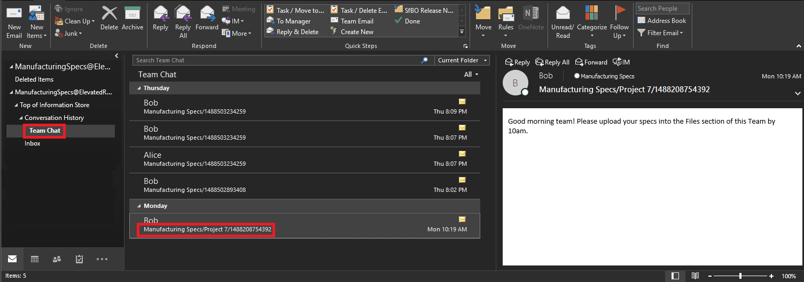

# <a name="conduct-an-ediscovery-investigation-of-content-in-microsoft-teams"></a>Eseguire un'analisi eDiscovery del contenuto in Microsoft Teams

Le grandi imprese sono spesso esposte a procedimenti legali di pena elevata che richiedono l'invio di tutte le informazioni archiviate elettronicamente (ESI). Il contenuto di Microsoft teams può essere cercato e usato durante le indagini eDiscovery.

## <a name="overview"></a>Panoramica

Tutti i team 1:1 o chat di gruppo vengono inseriti nelle cassette postali degli utenti rispettivi. Tutti i messaggi di canale standard vengono inseriti nella cassetta postale del gruppo che rappresenta il team. I file caricati nei canali standard sono coperti dalla funzionalità eDiscovery per SharePoint Online e OneDrive for business.

eDiscovery di messaggi e file nei [canali privati](private-channels.md) funziona in modo diverso rispetto ai canali standard. Per altre informazioni, vedere [eDiscovery di canali privati](#ediscovery-of-private-channels).

Non tutto il contenuto del team è eDiscoverable. La tabella seguente mostra i tipi di contenuto che possono essere individuati tramite eDiscovery.

| Tipo di contenuto | eDiscoverable | Note |
|:--- | --- |:--- |
| Messaggi di chat in teams | Sì | Messaggi di chat dalle chat in cui gli utenti Guest sono gli unici partecipanti in una chat di 1:1 o 1: N non sono eDiscoverable. |
| Registrazioni audio | No | |
| Indicatore di data e ora visualizzato quando un messaggio è stato letto da ogni utente | No | |
| Registrazioni audio | No | |
| Messaggi di canale privato | No | |
| Emoji, gif, adesivi | Sì | |
| Frammenti di codice | No | |
| Collegamenti alle chat | No | |
| Reazioni (simili, cuori e così via) | No | |
| Messaggi modificati | Sì | Se l'utente è in attesa, vengono mantenute le versioni precedenti dei messaggi modificati. |
| Immagini in linea | Sì | |
| Tabelle | No | |
| Oggetto | No | |
| Citazioni | Sì | Il contenuto tra virgolette è ricercabile. Tuttavia, i risultati della ricerca non indicano che il contenuto è stato citato. |
| Nome del canale | No | |

- Per eseguire un'analisi eDiscovery con il contenuto di Microsoft teams, esaminare il passaggio 1 in [gestire i casi di eDiscovery nel collegamento Centro protezione & conformità](https://support.office.com/article/Manage-eDiscovery-cases-in-the-Office-365-Security-Compliance-Center-edea80d6-20a7-40fb-b8c4-5e8c8395f6da) .

- I dati di Microsoft teams verranno visualizzati come messaggi istantanei o conversazioni nell'output di esportazione di Excel eDiscovery. È possibile aprire il `.pst` file in Outlook per visualizzare i messaggi dopo l'esportazione.

    Quando si visualizza `.pst` il file per il team, tenere presente che tutte le conversazioni vengono mantenute nella cartella chat del team in Cronologia conversazioni. Il titolo del messaggio contiene il nome del team e il nome del canale. Ad esempio, l'immagine seguente mostra un messaggio di Roberto che ha inviato un messaggio al canale standard di Project 7 del team di specifiche di manufacturing.

    

- Le chat private nella cassetta postale di un utente sono archiviate nella cartella chat del team in Cronologia conversazioni.

## <a name="ediscovery-of-private-channels"></a>eDiscovery dei canali privati

I record per i messaggi inviati in un canale privato vengono recapitati nella cassetta postale di tutti i membri del canale privato, anziché in una cassetta postale di gruppo. I titoli dei record vengono formattati in modo da indicare da quale canale privato sono stati inviati.

Poiché ogni canale privato ha una propria raccolta siti di SharePoint separata dal sito del team padre, i file in un canale privato vengono gestiti indipendentemente dal team padre.

Teams non supporta la ricerca eDiscovery di un singolo canale all'interno di un team, quindi è necessario cercare tutto il team. Per eseguire una ricerca eDiscovery del contenuto in un canale privato, cercare in tutto il team, la raccolta siti associata al canale privato (per includere i file) e le cassette postali dei membri del canale privato (per includere i messaggi).

Seguire i passaggi seguenti per identificare i file e i messaggi in un canale privato da includere nella ricerca di eDiscovery.

### <a name="include-private-channel-files-in-an-ediscovery-search"></a>Includere file di canale privato in una ricerca eDiscovery

Prima di eseguire questa procedura, installare [SharePoint Online Management Shell e connettersi a SharePoint Online](https://docs.microsoft.com/powershell/sharepoint/sharepoint-online/connect-sharepoint-online?view=sharepoint-ps).

1. Eseguire la procedura seguente per ottenere un elenco di tutte le raccolte siti di SharePoint associate a canali privati nel team.

    ```PowerShell
    Get-SPOSite
    ```

2. Eseguire lo script di PowerShell seguente per ottenere un elenco di tutti gli URL della raccolta siti di SharePoint associati a canali privati nel team e nell'ID del gruppo del team padre.

    ```PowerShell
    $sites = get-sposite -template "teamchannel#0"
    foreach ($site in $sites) {$x= get-sposite -identity $site.url -detail; $x.relatedgroupID; $x.url} 
    ```

3. Per ogni ID team o gruppo, Esegui lo script di PowerShell seguente per identificare tutti i siti di canale privati rilevanti, dove $groupID è l'ID del gruppo del team.

    ```PowerShell
    $sites = get-sposite -template "teamchannel#0"
    $groupID = "e8195240-4a70-4830-9106-80193cf717cb"
    foreach ($site in $sites) {$x= Get-SpoSite -Identity $site.url -Detail; if ($x.RelatedGroupId -eq $groupID) {$x.RelatedGroupId;$x.url}}
    ```

### <a name="include-private-channel-messages-in-an-ediscovery-search"></a>Includere messaggi di canale privato in una ricerca eDiscovery

Prima di eseguire questa procedura, verificare di avere installato la [versione più recente del modulo di PowerShell teams](teams-powershell-overview.md) .

1. Eseguire la procedura seguente per ottenere un elenco di canali privati nel team.

    ```PowerShell
    Get-TeamChannel -GroupId <GroupID> -MembershipType Private
    ```

2. Eseguire la procedura seguente per ottenere un elenco dei membri del canale privato.

    ```PowerShell
    Get-TeamChannelUser -GroupId <GroupID> -DisplayName "Engineering" -Role Member
    ```

3. Includere le cassette postali di tutti i membri di ogni canale privato del team come parte della query di ricerca di eDiscovery.

## <a name="advanced-ediscovery"></a>EDiscovery avanzato

Alcuni contenuti di Microsoft teams possono essere cercati e conservati anche usando il [flusso di lavoro Advanced eDiscovery](https://docs.microsoft.com/microsoft-365/compliance/overview-ediscovery-20). Mentre eDiscovery offre una gamma di funzionalità di ricerca, attesa ed esportazione, Advanced eDiscovery offre agli amministratori della conformità altri strumenti per identificare le origini dati e analizzarne il contenuto.

### <a name="advanced-ediscovery-custodian-workflow-for-teams-content"></a>Flusso di lavoro custode avanzato di eDiscovery per il contenuto Teams

I custodi possono essere membri di vari team. È possibile acquisire il contenuto di teams rilevante per questi custodi. Per informazioni generali e istruzioni sul flusso di lavoro della banca depositaria, vedere [flusso di lavoro eDiscovery avanzato](https://docs.microsoft.com/microsoft-365/compliance/overview-ediscovery-20).

Dopo aver aggiunto un custode, fare clic sul pulsante **Avanti** e quindi sul pulsante **Aggiungi** . Verrà visualizzata una finestra in cui viene chiesto di selezionare altre posizioni, in cui verranno visualizzate tutte le appartenenze del custode e le rispettive posizioni del sito di SharePoint per i relativi dati. Da tutte queste origini dati e teams, è possibile scegliere il contenuto che si vuole usare per eDiscovery, quindi inserire l'utente e tutte le origini dati identificate in attesa.

Puoi scegliere se includere il contenuto di Exchange, il contenuto di OneDrive o entrambi. Il contenuto di Exchange include tutto il contenuto dell'applicazione nelle cassette postali dell'utente, ad esempio i messaggi di posta elettronica, il contenuto dei team archiviati nella cassetta postale e così via. Il contenuto di OneDrive include non solo il contenuto dell'utente, ma anche tutti i contenuti del team archiviati in OneDrive, ad esempio le chat di 1:1, le chat 1: N e i file condivisi nelle chat.

Hai anche la possibilità di associare qualsiasi team a cui è associato il custode, in modo che siano inclusi i messaggi e i file di chat del canale a cui il custode ha accesso. Inoltre, qualsiasi altro team può essere associato a un custode. Per altre informazioni, vedere [aggiungere i custodi a un caso di eDiscovery avanzato](https://docs.microsoft.com/microsoft-365/compliance/add-custodians-to-case).

> [!NOTE]
> eDiscovery di messaggi e file nei [canali privati](private-channels.md) funziona in modo diverso rispetto ai canali standard. Per altre informazioni, vedere [eDiscovery di canali privati](#ediscovery-of-private-channels).

### <a name="placing-a-data-source-on-hold"></a>Inserimento di un'origine dati in blocco

Se non è presente un utente specifico da designare come custode, è possibile inserire un'intera origine dati in attesa. Per altre informazioni su holds, vedere [gestire le esenzioni in Advanced eDiscovery](https://docs.microsoft.com/microsoft-365/compliance/managing-holds).

Quando si crea un blocco per il contenuto del team, è possibile scegliere tutte le posizioni che si desidera includere nel blocco. Anche se gli utenti stanno eliminando o modificando il contenuto, il blocco manterrà copie di tutte le versioni precedenti del contenuto.

È anche possibile usare una query facoltativa per impostare le condizioni per il blocco in base a parole chiave, intervallo di date, autore e molti altri criteri. Se non si specificano parole chiave, tutto il contenuto dell'origine dati sarà soggetto al blocco.

### <a name="advanced-ediscovery-searches"></a>Ricerche eDiscovery avanzate

È anche possibile cercare il contenuto teams. Per altre informazioni sulle ricerche, vedere [raccolta di dati per un caso in Advanced eDiscovery](https://docs.microsoft.com/microsoft-365/compliance/collecting-data-for-ediscovery). Una ricerca restituirà un'intera conversazione se anche un messaggio corrisponde alla query di ricerca.

Quando si crea una query di ricerca, è possibile scegliere custodi in modo che tutte le fonti già selezionate vengano ricercate. È anche possibile cercare fonti non detentive, ad esempio un sito di teams non mappato a un utente. Le query facoltative sono disponibili anche per restringere la ricerca all'interno del contenuto teams.

Dopo aver creato una ricerca e averla selezionata, viene visualizzata una finestra con ulteriori dettagli e azioni che è possibile eseguire nella ricerca selezionata. Se si fa clic sul pulsante **statistiche** , è possibile visualizzare le statistiche relative alla ricerca, incluse le disaggregazioni in base ai tipi di posizione, l'origine originale per il contenuto e se il contenuto si trova in una cassetta postale del gruppo, nella singola cassetta postale dell'utente o in un sito di SharePoint. In questo modo è possibile visualizzare una ripartizione delle fonti che contribuiscono ai risultati della ricerca. È disponibile anche una visualizzazione **query** , in modo da poter vedere quali singole parole chiave contribuiscono ai risultati.

Dopo aver completato la ricerca, è possibile fare clic sul pulsante **Add results to Review set** e aggiungerlo a un set di recensioni. Per altre informazioni sui set di revisione, vedere [gestire i set di revisione in Advanced eDiscovery](https://docs.microsoft.com/microsoft-365/compliance/managing-review-sets) e [set di revisione del flusso di lavoro](#review-sets-workflow) più avanti in questo articolo.

#### <a name="normal-review-sets-and-conversation-review-sets"></a>Set di revisione normale e set di revisione delle conversazioni

Quando si aggiunge una ricerca a un set di revisione, è possibile scegliere da un set di revisione normale o da un set di revisione della conversazione.

Un set di revisione normale è simile a un'esportazione; fornisce i singoli `.msg` file per il contenuto del team e presenta il contenuto in una visualizzazione di base. In genere si usa un normale set di revisione quando si prevede di usare altri strumenti software per rielaborare i file in un secondo momento.

Un set di revisione della conversazione offre una visualizzazione più intuitiva e con thread delle conversazioni; Visualizza insieme i messaggi correlati nell'ordine corretto.

Funzionalità come la redazione è disponibile in entrambi i tipi di set di revisione.

Per altre informazioni sui set di revisione, vedere [rivedere le conversazioni in Advanced eDiscovery](https://docs.microsoft.com/microsoft-365/compliance/conversation-review-sets)

#### <a name="collection-options"></a>Opzioni di raccolta

Quando si aggiunge un set di revisione, sono disponibili diverse opzioni come caselle di controllo nella sezione **Opzioni raccolta** della finestra, incluse le **Opzioni di recupero** delle conversazioni e le **conversazioni di Team**. Se si abilitano queste opzioni, verranno visualizzati anche i singoli messaggi di team che fanno parte del set di revisione con i messaggi aggiuntivi che li circondano per il contesto. Ad esempio, se la query è molto specifica e viene restituito solo un messaggio, l'abilitazione di queste opzioni restituirà anche diversi messaggi che conducono al messaggio che corrisponde alla query.

Molti criteri logici vengono usati per determinare se i messaggi aggiuntivi conferiscono un contesto ai messaggi che corrispondono alla query. Ad esempio, per il contenuto teams, l'abilitazione di queste opzioni recupererà il messaggio padre e tutti i messaggi figlio a causa del modo in cui i messaggi vengono filettati.

Vengono selezionati anche i timestamp del messaggio. Se un messaggio corrisponde alla query, i messaggi adiacenti che lo precedono entro un intervallo di 4 ore o che lo seguono entro un intervallo di 4 ore sono considerati parte della conversazione e sono inclusi anche nei risultati.

Se è necessario essere certi di quali messaggi contestuali verranno restituiti con le corrispondenze alla query di ricerca, non è necessario usare queste opzioni. Puoi raccogliere tutto il contenuto oppure allargare l'intervallo di date della ricerca in modo che vengano restituiti più messaggi come risultato della query.

### <a name="review-sets-workflow"></a>Verifica set di flussi di lavoro

È possibile visualizzare i set di revisione esistenti o crearne di nuovi facendo clic sulla scheda **set di revisione** . Per altre informazioni sui set di revisione, vedere [gestire i set di revisione in Advanced eDiscovery](https://docs.microsoft.com/microsoft-365/compliance/managing-review-sets).

Oltre ai documenti, è possibile aggiungere posta elettronica, messaggi di Team, messaggi di Yammer e altri contenuti al set di recensioni. All'interno di un set di revisione è anche possibile eseguire molte delle stesse operazioni che è possibile eseguire in altri contesti, ad esempio la ricerca di contenuto e la creazione di query personalizzate. Queste operazioni si applicano solo agli elementi che sono stati aggiunti al set di revisione.

Il pulsante **Gestisci set di revisione** offre opzioni aggiuntive, ad esempio analisi, report di riepilogo, numero di set di carichi aggiunti e così via.

Per accedere a visualizzazioni e grafici dei dati, fare clic su **visualizzazione profilo di ricerca** **singoli risultati** \> nell'angolo in alto a destra. È possibile fare clic su cunei in questi grafici per selezionare in modo interattivo il tipo di contenuto che si vuole eseguire. Ad esempio, puoi scegliere di eseguire query solo sul contenuto di teams. È anche possibile salvare queste query come si salvano le query scritte manualmente.

#### <a name="summary-view-text-view-and-annotate-view"></a>Visualizzazione Riepilogo, visualizzazione testo e visualizzazione annotazioni

Se si fa clic su una conversazione in teams nel set di revisione, viene visualizzata la **visualizzazione Riepilogo**, che visualizza un'intera conversazione teams come elenco dei messaggi con cui è possibile interagire singolarmente. Fare clic sulla freccia rivolta verso il basso a destra di un messaggio per visualizzare un menu di scelta rapida che consente di visualizzare i dettagli `.msg` del messaggio o scaricare il singolo file. Se si fa clic su Dettagli messaggio, verrà visualizzato un riepilogo dei metadati o i metadati completi del messaggio.

Per scaricare un PDF, fare clic sul pulsante Scarica nell'angolo in alto a destra della visualizzazione riepilogo.

Fare clic sulla scheda **visualizzazione testo** per visualizzare una visualizzazione in testo normale del testo estratto della conversazione teams. Questa operazione è adatta per l'esportazione e puoi usare facilmente questo testo estratto usando altri strumenti software.

Fare clic sulla scheda **Visualizza** annotazioni per accedere alle caratteristiche di annotazione. Questa scheda Visualizza il contenuto in un formato simile a una conversazione in teams, ma sono disponibili anche altre opzioni per la modifica. È disponibile uno strumento matita che consente di creare note, disegnare sul messaggio o eseguire graffiature a grana fine per scopi di redazione. Esiste anche uno strumento di **redazione di area** che puoi usare per disegnare un rettangolo che oscura l'area e lo contrassegna come "redatto".

Nella parte inferiore della scheda **Visualizzazione annotazioni** si trova il pulsante **tag Documents** , che Visualizza il pannello di tagging. All'interno di questo pannello puoi applicare un contrassegno a tutti i messaggi all'interno della conversazione teams. È possibile contrassegnare una conversazione come reattiva o non rispondente, privilegiata o non privilegiata, se contiene "elementi interessanti", se deve essere inclusa nell'esportazione e se deve essere ulteriormente riesaminata. È anche possibile gestire e applicare altri tag personalizzabili.

#### <a name="action-menu"></a>Menu azione

All'interno della finestra Revisione set è possibile esportare il contenuto facendo clic su **Esporta** **azione** \> . Durante l'esportazione sono disponibili molte opzioni.

Per esportare un file contenente tutti i metadati per tutti i messaggi di teams, fare clic su per selezionare la casella di controllo **Carica file** . Per includere nel file i tag applicati al contenuto, fare clic su per selezionare la casella di controllo **Contrassegni** .

Usare l'opzione **file nativi** per esportare i file nel formato nativo. È possibile scegliere di esportare una conversazione come file o in tutti i singoli messaggi di chat nei propri file separati.

L'opzione **file di testo** consente di salvare le versioni in testo normale del contenuto. Per altre informazioni su come ottenere una visualizzazione in testo normale delle conversazioni dei team nel set di recensioni, vedere visualizzazione [Riepilogo, visualizzazione testo e annotazione](#summary-view-text-view-and-annotate-view) .

Se sono state applicate redazioni al contenuto, come descritto nella sezione visualizzazione [Riepilogo, visualizzazione testo e annotazione](#summary-view-text-view-and-annotate-view) , è possibile selezionare l'opzione **Sostituisci nativi ritirati con file PDF convertiti** per sostituire i file nativi con copie convertite in formato PDF.

Puoi scegliere di esportare in un contenitore di archiviazione BLOB di Azure fornito da Microsoft oppure puoi fornire un contenitore di archiviazione di Azure BLOB personalizzato.

Quando si è pronti per iniziare il processo di esportazione, fare clic sul pulsante **Esporta** . Al termine dell'esportazione, vedere [scaricare i processi di esportazione](https://docs.microsoft.com/microsoft-365/compliance/download-export-jobs) per altre informazioni su come accedere al contenitore di archiviazione di Azure BLOB e scaricare il contenuto esportato.

> [!NOTE]
> L'esportazione può richiedere un periodo di tempo prolungato. Per tenere traccia dello stato del processo di esportazione, chiudere la scheda **set di revisione** e fare clic sulla scheda **Esporta** .

## <a name="related-topics"></a>Argomenti correlati

- [eDiscovery in Microsoft 365](https://docs.microsoft.com/microsoft-365/compliance/ediscovery)
- [Panoramica di PowerShell Teams](teams-powershell-overview.md)
