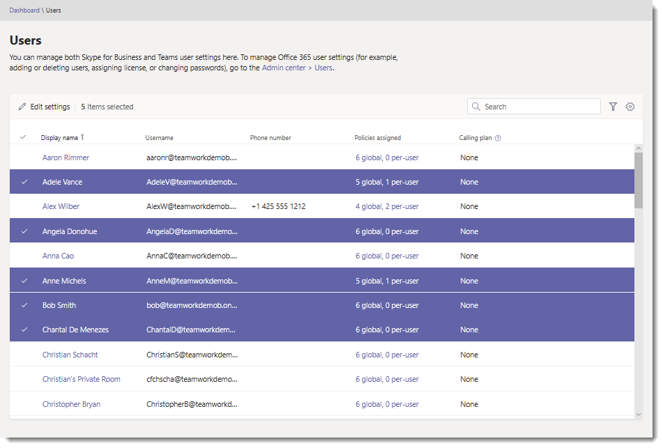
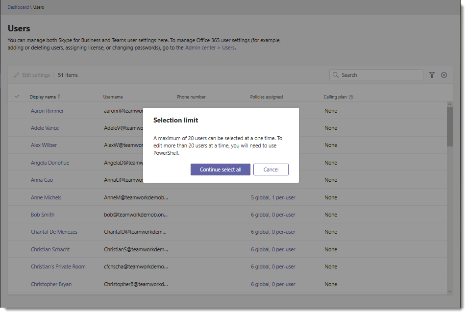
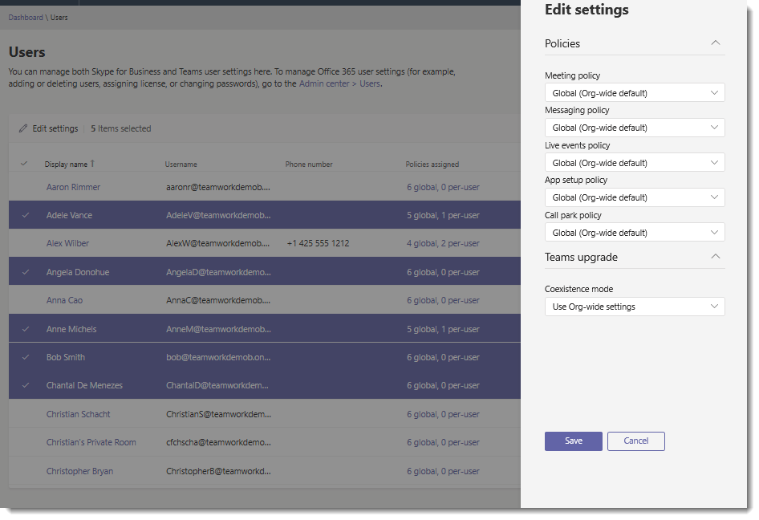

# Modificare le impostazioni degli utenti di Microsoft teams in bloccoEdit Microsoft Teams user settings in bulk

Come amministratore, puoi gestire le impostazioni degli utenti dei team nell'interfaccia di amministrazione di Microsoft teams.As an admin, you manage Teams user settings in the Microsoft Teams admin center. Nella pagina **utenti** è possibile visualizzare informazioni come account e dettagli sulle licenze e modificare i criteri e altre impostazioni.On the **Users** page, you can view information such as account and licensing details and edit policy and other settings. È possibile modificare le impostazioni per gli utenti singolarmente o per più utenti contemporaneamente.You can edit settings for users individually or for multiple users at the same time.

## Modificare le impostazioni utente in bloccoEdit user settings in bulk

Usare l'interfaccia di amministrazione di Microsoft teams per modificare le impostazioni per più utenti alla volta.Use the Microsoft Teams admin center to edit settings for multiple users at a time. Ti consigliamo di modificare le impostazioni per 20 utenti alla volta.We recommend editing settings for 20 users at a time. Per modificare le impostazioni per un numero elevato di utenti, usare PowerShell.To edit settings for a large number of users, use PowerShell. Per altre informazioni, Vedi [Cenni preliminari su teams PowerShell](teams-powershell-overview.md).For more information, see [Teams PowerShell Overview](teams-powershell-overview.md).

1. Nella barra di spostamento sinistra dell'interfaccia di amministrazione di Microsoft teams selezionare **utenti**.In the left navigation of the Microsoft Teams admin center, select **Users**.
2. Cercare gli utenti da modificare o filtrare la visualizzazione per mostrare gli utenti che si desidera modificare.Search for the users you want to edit or filter the view to show the users you want to edit.
3. Nella colonna **&#x2713;** (segno di spunta) selezionare utenti eseguendo una delle operazioni seguenti:In the **&#x2713;** (check mark) column, select users by doing one of the following:
    - Selezionare gli utenti uno alla volta.Select users one at a time. Accanto a ogni utente selezionato viene visualizzato un **&#x2713;** .A **&#x2713;** is displayed next to each user you select. Se si selezionano più di 20 utenti, non verranno bloccati, ma si terrà presente che più utenti si selezionano, più lungo sarà il completamento dell'operazione.If you select more than 20 users, you won't be blocked but keep in mind that the more users you select, the longer the operation will take to complete.

        

    - Fare clic sul &#x2713; (segno di spunta) nella parte superiore della tabella per selezionare tutti gli utenti (fino a un massimo di 20 utenti), quindi nella finestra di dialogo **limite selezione** fare clic su **continua selezionare tutto** per completare la selezione.Click the &#x2713; (check mark) at the top of the table to select all users (up to a maximum of 20 users), and then in the **Selection limit** dialog box, click **Continue select all** to complete the selection.

           Accanto agli utenti selezionati viene visualizzata una **&#x2713;** .A **&#x2713;** is displayed next to the selected users.

        
4. Fare clic su **Modifica impostazioni**, apportare le modifiche desiderate e quindi fare clic su **Salva**.Click **Edit settings**, make the changes that you want, and then click **Save**.

    
