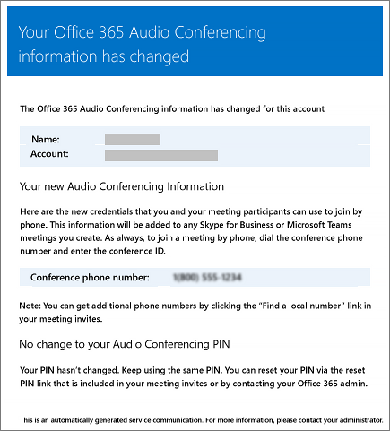

# Messaggi di posta elettronica inviati agli utenti quando le impostazioni cambiano in Microsoft TeamsEmails sent to users when their settings change in Microsoft Teams

I messaggi di posta elettronica vengono inviati automaticamente agli utenti che sono [abilitati per le audioconferenze](set-up-audio-conferencing-in-teams.md) tramite Microsoft come provider di servizi di audioconferenza.Emails will be automatically sent to users who are [enabled for Audio Conferencing](set-up-audio-conferencing-in-teams.md) using Microsoft as the audio conferencing provider.

Per impostazione predefinita, sono disponibili quattro tipi di posta elettronica inviata agli utenti abilitati per le audioconferenze.By default, there are four types of email that will be sent to your users who are enabled for Audio Conferencing. Tuttavia, se desideri limitare il numero di messaggi di posta elettronica inviati agli utenti, puoi disabilitare l'opzione.However, if you want to limit the number of emails sent to users, you can turn it off. Le audioconferenze in Microsoft 365 o Office 365 invieranno un messaggio di posta elettronica agli utenti quando:Audio Conferencing in Microsoft 365 or Office 365 will send email to your users' email when:

- **Viene assegnata loro una licenza di Audioconferenza o quando cambi il provider di audioconferenza e passi a Microsoft.****An Audio Conferencing license is assigned to them or when you are changing the audio conferencing provider to Microsoft.**

     Questo messaggio di posta elettronica include l'ID conferenza, il numero di telefono predefinito per le riunioni, il PIN per le audioconferenze dell'utente e le istruzioni e il collegamento per utilizzare lo strumento di aggiornamento delle riunioni di Skype for Business online che consente di aggiornare riunioni esistenti per l'utente.This email includes the conference ID, the default conference phone number for the meetings, the audio conferencing PIN for the user, and the instructions and link to use the Skype for Business Online Meeting Update Tool that is used to update existing meetings for the user. Vedi [Assegnare licenze per i componenti aggiuntivi Microsoft Teams](https://docs.microsoft.com/microsoftteams/teams-add-on-licensing/microsoft-teams-add-on-licensing) o [Assegnare Microsoft come provider di servizi di audioconferenza.](/SkypeForBusiness/audio-conferencing-in-office-365/assign-microsoft-as-the-audio-conferencing-provider)See [Assign Microsoft Teams add-on licenses](https://docs.microsoft.com/microsoftteams/teams-add-on-licensing/microsoft-teams-add-on-licensing) or [Assign Microsoft as the audio conferencing provider](/SkypeForBusiness/audio-conferencing-in-office-365/assign-microsoft-as-the-audio-conferencing-provider).

    > [!NOTE]
    > Se l'organizzazione è stata abilitata per gli ID conferenza dinamici, tutte le riunioni dell'utente pianificate avranno ID conferenza univoci.If your organization has been enabled for dynamic conference IDs, all of a user's meetings that they schedule will have unique conference IDs. È possibile impostare [gli ID audioconferenza dinamici all'interno dell'organizzazione](/skypeforbusiness/audio-conferencing-in-office-365/reset-a-conference-id-for-a-user).You can set up [Audio Conferencing dynamic IDs in your organization](/skypeforbusiness/audio-conferencing-in-office-365/reset-a-conference-id-for-a-user). 

    Di seguito è riportato un esempio di questo messaggio di posta elettronica:Here is an example of this email:

     

    Per ulteriori informazioni sulle licenze, consulta [l'articolo sulle licenze per i componenti aggiuntivi di Microsoft Teams.](https://docs.microsoft.com/microsoftteams/teams-add-on-licensing/microsoft-teams-add-on-licensing)To find out more about licensing, see [Microsoft Teams add-on licensing](https://docs.microsoft.com/microsoftteams/teams-add-on-licensing/microsoft-teams-add-on-licensing).

- **L'ID conferenza o il numero di telefono per le conferenze predefinito di un utente cambia.****The conference ID or default conference phone number of a user changes.**

    Questo messaggio di posta elettronica contiene l'ID conferenza, il numero di telefono di conferenza predefinito, le istruzioni e il collegamento per utilizzare lo strumento di aggiornamento delle riunioni di Skype for Business online che consente di aggiornare riunioni esistenti per l'utente.This email contains the conference ID, default conference phone number, and the instructions and link to use the Skype for Business Online Meeting Update Tool that is used to update existing meetings for the user. Tuttavia, questo messaggio di posta elettronica non include il PIN per l'audioconferenza dell'utente.But this email doesn't include the user's audio conferencing PIN. See [Reset a conference ID for a user](reset-a-conference-id-for-a-user-in-teams.md).See [Reset a conference ID for a user](reset-a-conference-id-for-a-user-in-teams.md).

    Di seguito è riportato un esempio di questo messaggio di posta elettronica:Here is an example of this email:

     

- **Viene reimpostato il PIN di audioconferenza di un utente.****The audio conferencing PIN of a user is reset.**

    Questo messaggio di posta elettronica contiene il PIN di audioconferenza dell'organizzatore, l'ID conferenza esistente e il numero di telefono di conferenza predefinito per l'utente.This email contains the organizer's audio conferencing PIN, the existing conference ID, and default conference phone number for the user. Consulta [Reimpostare il PIN di audioconferenza.](reset-the-audio-conferencing-pin-in-teams.md)See [Reset the Audio Conferencing PIN](reset-the-audio-conferencing-pin-in-teams.md).
    
     Di seguito è riportato un esempio di questo messaggio di posta elettronica:Here is an example of this email:
    
     
  
- **Una licenza dell'utente è stata rimossa o quando il provider di servizi di audioconferenza viene modificato da Microsoft a altri provider o nessuno.****A user's license is removed or when audio conferencing provider changes from Microsoft to other provider or None.**

    Ciò si verifica quando la licenza per i servizi **di audioconferenza** viene rimossa da un utente o quando si imposta il provider di servizi di audioconferenza su **Nessuno.**This happens when the **Audio Conferencing** license is removed from a user or when setting the audio conferencing provider to **None**.

    Vedere [Assegnare o rimuovere licenze per Microsoft 365 per le aziende.](https://support.office.com/article/997596b5-4173-4627-b915-36abac6786dc)See [Assign or remove licenses for Microsoft 365 for business](https://support.office.com/article/997596b5-4173-4627-b915-36abac6786dc).

    Di seguito è riportato un esempio di questo messaggio di posta elettronica:Here is an example of this email:

     

> [!NOTE]
> [!INCLUDE [updating-admin-interfaces](includes/updating-admin-interfaces.md)]

## Apportare modifiche ai messaggi di posta elettronica inviatiMake changes to the email messages that are sent to them

È possibile apportare modifiche ai messaggi di posta elettronica inviati automaticamente agli utenti.You can make changes to the email that is automatically sent to users. Per impostazione predefinita, il mittente dei messaggi di posta elettronica verrà inviato da Microsoft 365 o Office 365, ma è possibile modificare il nome visualizzato usando Windows PowerShell.By default, the sender of the emails will be from Microsoft 365 or Office 365, but you can change the display name using Windows PowerShell. Per altre informazioni, vedere le informazioni di riferimento su [Microsoft Teams PowerShell.](https://docs.microsoft.com/powershell/module/teams/?view=teams-ps)See the [Microsoft Teams PowerShell reference](https://docs.microsoft.com/powershell/module/teams/?view=teams-ps) for more information.

## E se non vuoi che la posta elettronica venga inviata a loro?What if you don't want email to be sent to them?

Quando disattivi l'invio di messaggi di posta elettronica agli utenti, la posta elettronica non verrà inviata anche quando un utente riceve una licenza.When you disable sending emails to users, email won't be sent even when a user gets assigned a license. In questo caso, l'ID conferenza, il numero di telefono per conferenze predefinito e, soprattutto, il PIN di audioconferenza non verranno inviati all'utente.In this case, the conference ID, default conferencing phone number, and, more importantly, their audio conferencing PIN won't be sent to the user. In questo caso, devi informare l'utente inviandogli un messaggio di posta elettronica separato o chiamandolo.When this happens, you must tell the user by sending them a separate email or by calling them.

Per impostazione predefinita, i messaggi di posta elettronica vengono inviati agli utenti, ma se vuoi impedire loro di ricevere e-mail per i servizi di audioconferenza, puoi utilizzare Microsoft Teams o Windows PowerShell.By default, emails will be sent to your users, but if you want to prevent them from receiving email for audio conferencing, you can use Microsoft Teams or Windows PowerShell. 

 **Usare l'interfaccia di amministrazione di Microsoft Teams** **Using the Microsoft Teams admin center**

1. Nella barra di spostamento sinistra, passa **a Riunioni**-  >  **Bridge conferenza.**In the left navigation, go to **Meetings** > **Conference Bridges**. 

2. Nella parte superiore della pagina **Bridge di conferenza** fare clic su Impostazioni **bridge.**At the top of the **Conference Bridges** page, click **Bridge settings**. 

3. Nel riquadro **Impostazioni bridge abilitare o** disabilitare l'invio automatico dei messaggi di posta elettronica agli utenti in caso di modifica delle impostazioni di accesso **remoto.**In the **Bridge settings** pane, enable or disable **Automatically send emails to users if their dial-in settings change**.

4. Fare clic su **Salva**.Click **Save**.

> [!Note]
> [!INCLUDE [updating-admin-interfaces](includes/updating-admin-interfaces.md)]

**Uso Windows PowerShell****Using Windows PowerShell**

Per altre informazioni, vedere le informazioni di riferimento su [Microsoft Teams PowerShell.](https://docs.microsoft.com/powershell/module/teams/?view=teams-ps)See the [Microsoft Teams PowerShell reference](https://docs.microsoft.com/powershell/module/teams/?view=teams-ps) for more information.

## Per saperne di più su Windows PowerShellWant to know more about Windows PowerShell?

Per impostazione predefinita, il mittente dei messaggi verrà inviato da Microsoft 365 o Office 365, ma è possibile modificare l'indirizzo di posta elettronica e il nome visualizzato usando Windows PowerShell.By default, the sender of the emails will be from Microsoft 365 or Office 365, but you can change the email address and display name using Windows PowerShell. 

Windows PowerShell is all about managing users and what users are allowed or not allowed to do.Windows PowerShell is all about managing users and what users are allowed or not allowed to do. Con Windows PowerShell, è possibile gestire Microsoft 365 o Office 365 tramite un unico punto di amministrazione, che consente di semplificare il lavoro quotidiano quando si hanno più attività da eseguire.With Windows PowerShell, you can manage Microsoft 365 or Office 365 using a single point of administration that can simplify your daily work when you have multiple tasks to do. Per iniziare a usare Windows PowerShell, vedere i seguenti argomenti:To get started with Windows PowerShell, see these topics:

  - [Sei motivi per utilizzare Windows PowerShell per gestire Office 365Why you need to use Office 365 PowerShell](https://go.microsoft.com/fwlink/?LinkId=525041)

  - [Modi migliori per gestire Office 365 con Windows PowerShellBest ways to manage Office 365 with Windows PowerShell](https://go.microsoft.com/fwlink/?LinkId=525142)

Per altre informazioni sulle Windows PowerShell, vedere le informazioni di riferimento su [Microsoft Teams PowerShell.](https://docs.microsoft.com/powershell/module/teams/?view=teams-ps)For more information about Windows PowerShell, see the [Microsoft Teams PowerShell reference](https://docs.microsoft.com/powershell/module/teams/?view=teams-ps) for more information.

## Argomenti correlatiRelated topics

[Abilitare o disabilitare l'invio di messaggi di posta elettronica in caso di modifica delle impostazioni di audioconferenzaEnable or disable sending emails when Audio Conferencing settings change](enable-or-disable-sending-emails-when-their-settings-change-in-teams.md)

[Inviare un messaggio di posta elettronica a un utente con le sue informazioni di audioconferenzaSend an email to a user with their Audio Conferencing information](send-an-email-to-a-user-with-their-dial-in-information-in-teams.md)
