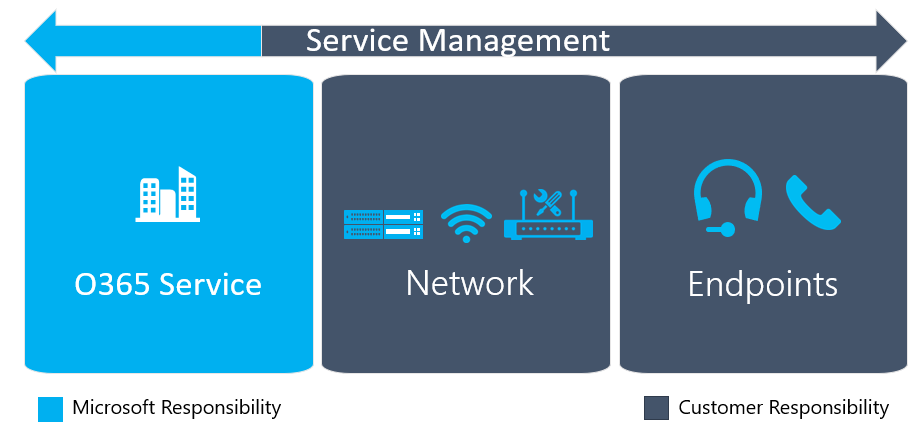

# Pianificare la gestione e la qualità dei serviziPlan for service management and quality

Questo documento riguarda la fase di prevedibilità per Microsoft teams.This document is about the Envision phase for Microsoft Teams.
 
## IntroduzioneIntroduction

Questo contenuto fornirà una panoramica dei requisiti necessari per offrire e gestire una distribuzione di Microsoft teams di alta qualità.This content will provide an overview of the requirements that are necessary to deliver and maintain a high-quality Microsoft Teams deployment. È possibile garantire una distribuzione efficace pianificando la gestione e la qualità dei servizi durante la fase di progettazione, prima della prima distribuzione di Pilot o Production.You can help ensure a successful deployment by planning for service management and quality during the Envision phase, before your first pilot or production deployment.

Le linee guida sono organizzate nelle sezioni seguenti:The guidance is organized into the following sections:

-   La prima è una panoramica dell'esperienza utente e dei componenti chiave che sostengono la qualità.First is an overview of user experience and the key components that underpin quality. In questo articolo vengono evidenziate le aree in cui concentrarsi prima dell'onboarding in Microsoft teams.This highlights the areas to focus on prior to onboarding to Microsoft Teams.

-   In secondo luogo, vengono fornite indicazioni per pianificare un modello di supporto per la gestione di Microsoft teams prima della prima distribuzione pilota o di produzione dell'utente.Second, guidance is given for planning a support model to manage Microsoft Teams prior to the first user pilot or production deployment. Questa sezione descrive le attività che devono essere eseguite regolarmente per mantenere una distribuzione di team di alta qualità.This section describes the tasks that need to be performed on a regular basis to maintain a high-quality Teams deployment. In questa sezione vengono inoltre illustrate altre informazioni che è possibile usare per iniziare a comprendere e operationalizing queste attività.In addition, this section introduces you to further guidance which you can use to start understanding and operationalizing these tasks.

-   In terzo luogo, le linee guida specifiche aiutano a pianificare la rete e gli endpoint dell'organizzazione per supportare Microsoft teams.Third, specific guidance helps with planning your network and endpoints in your organization to support Microsoft Teams.

-   Infine, i passaggi successivi vengono riepilogati con riferimenti a contenuto correlato.Lastly, next steps are summarized with references to related content.

## Componenti chiave che influiscono sull'esperienza utenteKey components that affect user experience

I componenti chiave che influiscono sull'esperienza utente verranno esaminati in questa sezione.The key components that affect user experience will be reviewed in this section. Prima di visualizzare i componenti principali, è fondamentale comprendere l'esperienza utente e la sua importanza per realizzare gli obiettivi aziendali dell'organizzazione.Before reviewing the key components, it’s critical that you understand user experience and its importance in realizing your organization’s business goals. Esaminiamo prima di tutto come definiamo l'esperienza utente.Let’s review how we define the user experience first.

### Esperienza utente definitaUser experience defined

Gli obiettivi aziendali possono essere realizzati quando si distribuisce Microsoft teams e si incorporano le comunicazioni nei processi aziendali per migliorare il flusso di lavoro.Business goals can be realized when you deploy Microsoft Teams and incorporate communications into your business processes to enhance their workflow. Adozione e utilizzo delle unità di qualità: se l'organizzazione offre un servizio di alta qualità che delizia gli utenti, gli utenti e i team possono acquisire fiducia e trovare nuovi e innovativi modi di usare il servizio che guida i vantaggi aziendali.Quality drives adoption and usage: if your organization delivers a high-quality service that delights people, then individuals and teams can gain confidence and find new and innovative ways of using the service that drive business benefits.

Al centro dell'esperienza dell'utente con teams: le emozioni e gli atteggiamenti della persona verso il servizio.At the heart of this is the user’s experience with Teams—the person’s emotions and attitudes toward the service. Quali sono i contributi per l'esperienza utente?So what contributes to the user experience? Spazia da utenti che sanno usare teams e incorporarli nel flusso di lavoro giornaliero per provare una qualità di chiamata eccezionale ed essere in grado di connettersi in modo affidabile, indipendentemente da dove si trovano.It ranges from users’ knowing how to use Teams and incorporating it into their daily workflow to experiencing exceptional call quality and being able to connect reliably, regardless of where they are. L'esperienza utente è molto ampia in natura; Questo documento si basa solo sugli elementi che possono essere controllati dall'organizzazione.User experience is very broad in nature; this document focuses only on those elements that can be controlled by your organization.

Ci sono requisiti specifici per la distribuzione che sono di fondamentale importanza per offrire un'esperienza utente fantastica, soprattutto quando si usano le caratteristiche di cloud Voice in teams.There are specific requirements to the deployment that are critically important to deliver a fantastic user experience—especially when using the Cloud Voice features in Teams. È fondamentale trattare Microsoft teams come cittadino di prima classe con altri investimenti per la comunicazione e la collaborazione, in modo da dare priorità al traffico in tempo reale di conseguenza.It is critical to treat Microsoft Teams as a first-class citizen with other communication and collaboration investments, prioritizing real-time traffic accordingly. La sezione seguente offre una panoramica dei componenti chiave che influiscono sull'esperienza utente.The following section gives an overview of the key components that affect user experience. In altre sezioni verranno fornite indicazioni su come iniziare a pianificare la distribuzione e la gestione dei componenti chiave che includono la qualità.In further sections, we will provide you guidance on how to start planning to deploy and maintain the key components that comprise quality.

### Componenti chiave della qualitàKey components of quality

Un'organizzazione o un partner di supporto dovrebbe iniziare a pianificare tre componenti chiave durante la fase di progettazione di una distribuzione di Team: gestione dei servizi, rete e endpoint.An organization or supporting partner should start planning for three key components during the Envision phase of a Teams deployment: service management, network, and endpoints. La combinazione di tutte e tre le aree è fondamentale per la qualità dell'esperienza utente.The combination of all three areas is fundamental to the quality of the user experience.

![Diagramma che illustra i tre componenti della qualità e la gestione dei servizi in sovrapposizione di tutti e tre i componenti.] (media/envision-planning-for-service-management-and-quality-complete-guide-image1.png "Diagramma che illustra i tre componenti della qualità e la gestione dei servizi in sovrapposizione di tutti e tre i componenti.")

#### Gestione dei serviziService management

La gestione dei servizi può essere divisa in due categorie di responsabilità distinte:Service management can be divided into two distinct categories of responsibility:

-   **Responsabilità Microsoft**.**Microsoft responsibility**. Microsoft è responsabile per i componenti dell'infrastruttura che il servizio Office 365 include.Microsoft is responsible for the infrastructure components that the Office 365 service comprises. Microsoft è responsabile per i clienti di garantire che tutti gli utenti che si connettono ai team siano dotati di un'esperienza affidabile e di alta qualità.Microsoft is accountable to customers to ensure that any of their users connecting to Teams is provided with a reliable and high-quality experience.

-   **Responsabilità del cliente**.**Customer responsibility**. L'utente e l'organizzazione sono responsabili della gestione di vari aspetti del servizio Office 365, della rete locale e degli endpoint degli utenti.You and your organization are responsible for managing various aspects of the Office 365 service, on-premises network, and user endpoints. Ad esempio, quando si aggiungono nuovi indirizzi IP a Office 365, è necessario aggiornare i firewall appropriati per consentire la comunicazione ai nuovi endpoint per evitare interruzioni degli utenti.For example, as new IP addresses are added to Office 365, you must update the appropriate firewalls to allow communication to the new endpoints to avoid user disruption.

Per informazioni dettagliate sulla pianificazione della gestione dei servizi, vedere [pianificare la gestione dei servizi](#plan-for-service-management).For detailed guidance for service management planning, see [Plan for service management](#plan-for-service-management).

#### ReteNetwork 

Nella maggior parte delle organizzazioni le reti sono state progettate inizialmente per consentire l'accesso ai dati e alle applicazioni che risiedevano nei loro datacenter.In most organizations, networks were initially designed to provide access to data and applications that resided in their datacenters. Le applicazioni basate su cloud come Office 365 richiedono modifiche a queste reti per supportare il nuovo accesso e i flussi di dati necessari per i team.Cloud-based applications like Office 365 require changes to these networks to support the new access and data flows that Teams requires. Prima di poter abilitare gli utenti per i team dell'organizzazione, è necessario valutare e ottimizzare la rete corrente.Before you can enable users for Teams in your organization, you must evaluate and optimize your current network. Questo aspetto è fondamentale quando si sfruttano le funzionalità di cloud Voice.This is critically important when leveraging cloud voice capabilities.

Nelle reti tradizionali gli utenti dovranno attraversare le reti perimetrali di un'organizzazione per accedere ai team.In traditional networks, users will need to traverse the perimeter networks of an organization to access Teams. Molte organizzazioni avranno dispositivi basati sulla sicurezza come server proxy, firewall e VPN che possono bloccare, impedire o specificare un percorso non ottimizzato per il traffico di rete.Many organizations will have security-based devices such as proxy servers, firewalls, and VPNs that can block, impede, or provide an unoptimized path for network traffic.

Inoltre, le reti interne principali devono essere ottimizzate e dimensionate a destra per fornire capacità e qualità sufficienti per supportare i carichi di lavoro dei team, inclusi i supporti in tempo reale.Furthermore, the core internal networks need to be optimized and right-sized to provide sufficient capacity and quality for supporting the Teams workloads, including real-time media. È possibile usare la pianificazione della larghezza di banda, il risanamento e l'ottimizzazione per garantire che la rete fornisca un percorso di alta qualità ed efficiente per Office 365.You can use bandwidth planning, remediation, and optimization to help ensure your network provides a high-quality and efficient path to Office 365.

Per istruzioni dettagliate sulla pianificazione della rete, vedere [pianificare la qualità della rete](#plan-for-network-quality).For detailed guidance about network planning, see [Plan for network quality](#plan-for-network-quality).

#### EndpointEndpoints

Microsoft teams supporta un'ampia gamma di endpoint.Microsoft Teams supports a variety of endpoints. Dai PC ai tablet ai telefoni, è possibile accedere a Team ovunque da qualsiasi dispositivo.From PCs to tablets to phones, you can access Teams anywhere from virtually any device.

Per offrire agli utenti un'esperienza ottimale, è necessario considerare questi importanti aspetti durante la fase di prevedibilità: gli endpoint soddisfano i requisiti hardware e software dei team?To give your users the best experience possible, you need to consider these important aspects during the Envision phase: Do your endpoints meet the Teams hardware and software requirements? Sono stati configurati e ottimizzati gli endpoint per il supporto delle reti Wi-Fi?Have you configured and optimized endpoints to support Wi-Fi networks? Quali dispositivi si usano per effettuare e ricevere chiamate vocali?Which devices will you use to make and receive voice calls? I dispositivi sono ottimizzati per i team?Are those devices optimized for Teams?

Per istruzioni dettagliate sulla pianificazione degli endpoint, vedere [pianificare la qualità dell'](#plan-for-endpoint-quality)endpoint.For detailed guidance about endpoint planning, see [Plan for endpoint quality](#plan-for-endpoint-quality).

## Pianificare la gestione dei serviziPlan for service management

La gestione dei servizi è un argomento ampio che include le operazioni quotidiane del servizio Microsoft teams dopo che è stato distribuito e abilitato per gli utenti.Service management is a broad topic that covers day-to-day operations of the Microsoft Teams service after it has been deployed and enabled for users. Il servizio teams include Microsoft Office 365 e i componenti dell'infrastruttura distribuiti localmente (ad esempio, Networking).The Teams service encompasses Microsoft Office 365 and the infrastructure components that are deployed on-premises (for example, networking).

La nozione di gestione dei servizi non è probabilmente un nuovo concetto per la maggior parte delle organizzazioni.The notion of service management is most likely not a new concept for most organizations. Probabilmente hai già implementato processi e attività associati ai servizi esistenti.You probably have already implemented processes and tasks that are associated with existing services. Ciò detto, è probabile che sia possibile aumentare le informazioni disponibili quando si prevede di gestire i servizi Microsoft teams in futuro.That said, you can probably augment what you have in place when you plan for service management today to support Microsoft Teams in the future.

La gestione dei servizi comprende tutte le attività e i processi coinvolti nella gestione di Microsoft teams end to end.Service management encompasses all the activities and processes involved in managing Microsoft Teams end to end. Come descritto in precedenza, alcuni componenti della gestione dei servizi, ovvero i componenti dell'infrastruttura che il servizio di Office 365 stesso comporta, sono responsabili di Microsoft, mentre il cliente è responsabile per gli utenti di gestire i vari aspetti dei team, rete e endpoint da essi forniti.As described earlier, some components of service management—the infrastructure components that the Office 365 service itself comprises—are Microsoft’s responsibility, whereas the customer is accountable to its users to manage the various aspects of Teams, the network, and endpoints they provide. Questa sezione del documento consentirà di concentrarsi sulla responsabilità del cliente da una prospettiva di gestione dei servizi.This section of the document will focus on the customer’s responsibility from a service management perspective.

![Diagramma che illustra i tre componenti della qualità e la gestione dei servizi in sovrapposizione di tutti e tre i componenti. Con lo stato attivo sulla gestione dei servizi.] (media/envision-planning-for-service-management-and-quality-complete-guide-image2.png "Diagramma che illustra i tre componenti della qualità e la gestione dei servizi in sovrapposizione di tutti e tre i componenti. Con lo stato attivo sulla gestione dei servizi.")

### Introduzione alla Guida alle operazioniIntroduction to the Operations Guide 

**Cosa**, **chi**e **come** sono tre domande importanti che devono essere risolte quando si tratta di gestione dei servizi.**What**, **Who**, and **How** are three important questions that need to be answered when it comes to service management.

È possibile usare la [Guida alle operazioni](1-drive-value-operate-my-service.md) per rispondere a tutte e tre le domande.You can use the [Operations Guide](1-drive-value-operate-my-service.md) to help you address all three of these questions. La guida fornisce un elenco di attività da eseguire su base giornaliera, settimanale, mensile e necessaria.The guide provides a list of activities to be performed on a daily, weekly, monthly, and as-needed basis. Queste attività e attività sono critiche per il mantenimento di una distribuzione di team di alta qualità.These activities and tasks are critical for maintaining a high-quality Teams deployment. Determinare chi sarà responsabile dell'esecuzione di attività specifiche nella gestione dei servizi è un aspetto cruciale della pianificazione che è necessario eseguire all'inizio della fase di progettazione per garantire una distribuzione corretta.Determining who will be responsible for performing specific activities in service management is a critical aspect of your planning that you need to do early in the Envision phase to ensure a successful deployment. Dopo aver trovato le attività e le attività, è necessario che siano comprese e seguite dai gruppi o dagli individui assegnati.After you’ve figured out the tasks and activities, they need to be understood and followed by the groups or individuals that you assign to them. La Guida alle operazioni fornisce informazioni e indicazioni su come eseguire ognuna delle attività e/o i riferimenti al contenuto esterno.The Operations Guide provides knowledge and guidance for how to perform each of the tasks, and/or references to outside content.

### Mapping dei ruoli operativiOperational role mapping

La pianificazione della gestione dei servizi è un cardine cruciale, perché la fase delle operazioni inizia quando sono abilitati i primi utenti pilota.Planning for service management early is a critical milestone, because the operations phase begins when the first pilot users are enabled. Il team di progetto deve rivedere e concordare le attività e le attività necessarie, identificare il team responsabile per ogni attività operativa e quindi ottenere un impegno e un discarico da ogni rispettivo team.The project team must review and agree on the tasks and activities required, identify the team that’s responsible for each operational task, and then get a commitment and sign-off from each respective team.

Dopo il completamento della disconnessione, il team responsabile deve quindi avviare operationalizing questi ruoli e responsabilità.After sign-off is complete, the responsible team must then start operationalizing these roles and responsibilities. Questo potrebbe includere formazione e disponibilità, aggiornare il modello di personale o garantire che i partner esterni siano pronti per la distribuzione.This might include training and readiness, updating the staffing model, or ensuring that external partners are ready to deliver.

La mappatura dei ruoli operativi all'inizio della fase di predisposizione consente a tutti i team di avviare le attività operative durante il progetto pilota e di aumentare le operazioni e verificare che tutto sia pronto dopo l'avvio della distribuzione.Mapping operational roles early in the Envision phase enables all teams to start their operational tasks during the pilot, and ramp up operations and make sure that everything is ready after the deployment starts.

La Guida alle operazioni fornisce un elenco di attività comuni mappate a ruoli tipici che devono essere validi nella maggior parte degli scenari.The Operations Guide provides a list of common tasks mapped to typical roles that should be valid in most scenarios. È necessario personalizzare queste responsabilità per lavorare per l'organizzazione.You need to customize these responsibilities to work for your organization.

### Ruolo di campione di qualitàThe Quality Champion role

Un gruppo o un individuo deve essere responsabile per la qualità in tutte le organizzazioni.A group or individual needs to be accountable for quality in all organizations. Questo è il ruolo più importante nella gestione dei servizi.This is the most important role in service management. Il campione di qualità è un ruolo del cliente assegnato a una persona o un gruppo appassionato dell'esperienza degli utenti.The Quality Champion is a customer role that's assigned to a person or group who is passionate about their users' experience. Questo ruolo richiede le competenze necessarie per identificare le tendenze nell'ambiente e la sponsorizzazione per collaborare con altri team per gestire i correttivi.This role requires the skills to identify trends in the environment and the sponsorship to work with other teams to drive remediation. Il candidato migliore per il campione di qualità è in genere il proprietario del servizio clienti, che, a seconda delle dimensioni e della complessità dell'organizzazione, potrebbe essere una persona o un gruppo appassionato dell'esperienza utente.The best candidate for the Quality Champion is typically the customer service owner, who—depending on the organization’s size and complexity—could be any person or group who is passionate about user experience.

Il campione della qualità sfrutta gli strumenti esistenti e i processi documentati, ad esempio il dashboard qualità chiamata (Call Quality Dashboard) e la guida alla revisione dell'esperienza di qualità, per monitorare l'esperienza utente, identificare le tendenze della qualità e correggere le esigenze di guida.The Quality Champion leverages existing tools and documented processes, such as the Call Quality Dashboard (CQD) and the Quality Experience Review Guide, to monitor user experience, identify quality trends, and drive remediation where needed. Il campione di qualità collabora con i rispettivi team per gestire azioni correttive, segnalando a un comitato direttivo i propri progressi e i problemi aperti.The Quality Champion works with the respective teams to drive remediation actions, reporting to a steering committee on their progress and open issues.

Le attività e le attività associate al ruolo sono state documentate nella Guida alle operazioni.The tasks and activities associated with the role have been documented in the Operations Guide. Questo ruolo deve essere assegnato in anticipo nella fase di predisposizione.This role should be assigned early in the Envision phase. Un passaggio chiave in operationalizing il ruolo di campione di qualità sta acquisendo le conoscenze necessarie per il ruolo e garantendo che siano disponibili i prerequisiti per l'esecuzione delle attività.A key step in operationalizing the role of Quality Champion is gaining the knowledge required for the role and ensuring the prerequisites are in place to deliver on the tasks. Un'attività chiave per questo ruolo consiste nell'eseguire una normale revisione dell'esperienza di qualità.A key task for this role is running a regular Quality Experience Review.

### Introduzione alla guida alla revisione dell'esperienza di qualitàIntroduction to the Quality Experience Review Guide

La guida alla revisione dell'esperienza di qualità include una serie di attività che valutano e includono indicazioni per il risanamento in aree chiave che hanno il massimo impatto per migliorare l'esperienza utente, come illustrato nella figura seguente.The Quality Experience Review Guide has a set of activities that assess and provide remediation guidance in key areas that have the greatest impact for improving user experience as shown in the figure below.

![Diagramma che illustra le aree principali esaminate durante una revisione dell'esperienza di qualità.] (media/envision-planning-for-service-management-and-quality-complete-guide-image3.png "Diagramma che illustra le aree principali esaminate durante una revisione dell'esperienza di qualità.")

Valutando e rimediando continuamente le aree descritte in questo documento, è possibile ridurre le proprie potenzialità per influire negativamente sull'esperienza utente.By continually assessing and remediating the areas described in this document, you can reduce their potential to negatively affect user experience. La maggior parte dei problemi di esperienza utente incontrati in una distribuzione può essere raggruppata nelle categorie seguenti:Most user-experience problems encountered in a deployment can be grouped into the following categories:

-   Firewall o configurazione proxy incompletaIncomplete firewall or proxy configuration

-   Scarsa copertura Wi-FiPoor Wi-Fi coverage

-   Larghezza di banda insufficienteInsufficient bandwidth

-   VPNVPN

-   Uso di dispositivi audio non ottimizzati o incorporatiUse of unoptimized or built-in audio devices

-   Subnet problematiche o dispositivi di reteProblematic subnets or network devices

Le indicazioni fornite nella Guida alla revisione dell'esperienza di qualità si basano sull'uso di Call Quality Dashboard (Call Quality Dashboard) online come strumento principale per segnalare e analizzare ogni area descritta, con un particolare accento sull'audio per massimizzare l'adozione e l'impatto.The guidance provided in the Quality Experience Review Guide focuses on using Call Quality Dashboard (CQD) Online as the primary tool to report and investigate each area described, with a focus on audio to maximize adoption and impact. Le eventuali ottimizzazioni apportate alla rete per migliorare l'esperienza audio si traducono anche direttamente nei miglioramenti della condivisione di video e desktop.Any optimizations made to the network to improve the audio experience will also directly translate to improvements in video and desktop sharing.

Ti consigliamo vivamente di nominare il campione di qualità in anticipo.We highly recommend that you nominate the Quality Champion early on. Dopo essere stati nominati, dovrebbero iniziare a familiarizzare con il contenuto della Guida alla revisione dell'esperienza di qualità.After being nominated, they should start to familiarize themselves with the content in the Quality Experience Review Guide.

La guida alla revisione dell'esperienza di qualità può essere trovata [qui](https://aka.ms/qerguide).The Quality Experience Review Guide can be found [here](https://aka.ms/qerguide).

## Pianificare la qualità della retePlan for network quality 

La pianificazione della qualità della rete sarà lo stato principale per la sezione seguente.Planning for network quality will be the focus for the following section.

![Diagramma che illustra i tre componenti della qualità e la gestione dei servizi in sovrapposizione di tutti e tre i componenti. Con lo stato attivo sulla rete.] (media/envision-planning-for-service-management-and-quality-complete-guide-image4.png "Diagramma che illustra i tre componenti della qualità e la gestione dei servizi in sovrapposizione di tutti e tre i componenti. Con lo stato attivo sulla rete.")

Come accennato in precedenza, la pianificazione della qualità della rete prima dell'onboarding in Microsoft teams è fondamentale.As previously mentioned, planning for network quality prior to onboarding to Microsoft Teams is critical. Per altre indicazioni sulla conformità della rete, vedere [preparare la rete dell'organizzazione per Microsoft teams](prepare-network.md).For further guidance for network readiness, see [Prepare your organization's network for Microsoft Teams](prepare-network.md).

Nella maggior parte delle organizzazioni le reti possono contenere sia reti gestite che non gestite.In most organizations, networks can comprise both managed and unmanaged networks.

Le reti gestite sono componenti dell'infrastruttura di rete a cui un'organizzazione ha diretto il controllo.Managed networks are components of the network infrastructure that an organization has direct control over. Di conseguenza, le reti gestite influenzano direttamente la qualità che può essere fornita ai carichi di lavoro in tempo reale.As a result, managed networks have a direct influence on the quality that can be provided to real-time traffic workloads.

Viceversa, le reti non gestite sono segmenti della rete che un cliente ha un controllo limitato o nessun controllo.Conversely, unmanaged networks are segments of the network that a customer has limited control, or no control, over.

Le connessioni Internet tra l'organizzazione e Office 365 sono reti in cui un cliente ha un controllo limitato.Internet connections between the organization and Office 365 are networks where a customer has limited control. Le reti sono gestite da un ISP, ma le organizzazioni devono essere in grado di influenzare la qualità della rete aggiornando la larghezza di banda, sostenendo le ottimizzazioni delle route oppure, se tutto il resto non riesce, passando ISP.The networks are managed by an ISP, but organizations should be able to influence the quality of the network by upgrading their bandwidth, advocating for route optimizations, or—if all else fails—switching ISPs.

Le reti domestiche o le reti in alberghi o coffee shop sono esempi di reti in cui un cliente non ha alcun controllo.Home networks or networks in hotels or coffee shops are examples of networks where a customer has no control.

Nelle sezioni seguenti verranno illustrati i requisiti di qualità delle reti gestite.In the following sections, we will focus on the quality requirements of managed networks.

### Aree principali per la pianificazione della reteKey network planning areas

Le sezioni seguenti riguardano le aree importanti per la distribuzione di una rete di alta qualità.The following sections focus on the important areas for delivering a high-quality network.

> [!NOTE]
> Molte reti si evolvono nel tempo a causa di aggiornamenti, espansioni o altri requisiti aziendali.Many networks evolve over time due to upgrades, expansion, or other business requirements. Verificare di avere a disposizione processi operativi per mantenere queste aree nell'ambito della pianificazione della gestione dei servizi.Ensure that you have operational processes in place to maintain these areas as part of your service management planning.

#### BandaBandwidth

La pianificazione della larghezza di banda è un aspetto critico dell'attività di preparazione della rete.Bandwidth planning is a critical aspect of the network readiness activity. Verificare che la larghezza di banda sufficiente per i carichi di lavoro di Microsoft teams sia indispensabile.Ensuring that there's enough bandwidth for the Microsoft Teams workloads is imperative. Per avere la possibilità di ridimensionare una rete esistente, è necessario comprendere il provisioning corrente, l'utilizzo attuale e, in definitiva, la larghezza di banda disponibile rimanente.To be able to right-size an existing network, you must understand what’s currently provisioned, the current utilization, and—ultimately—the remaining available bandwidth.

Per misurare l'utilizzo corrente, è necessario monitorare la rete.To measure current utilization, you need to monitor the network. Questa misura può quindi essere usata come punto di partenza per la pianificazione della larghezza di banda.This measurement can then be used as the starting point for bandwidth planning. Inoltre, la rete deve essere continuamente monitorata durante la distribuzione e dopo la distribuzione per assicurarsi che la rete sia sufficientemente provisioning.In addition, the network should be continually monitored during the deployment and after the deployment to ensure that the network is sufficiently provisioned.

> [!NOTE]
> Quando si monitora l'utilizzo della rete, è importante evitare di usare le medie durante il giorno.When monitoring network utilization, it’s important to avoid using averages over the day. Queste medie possono includere ore non core che alterano il risultato.These averages can include non-core hours that skew the result. Le medie possono nascondere i periodi di punta e mascherare un problema sottostante.Averages can hide peak periods and mask an underlying problem.

#### Qualità del servizio (QoS)Quality of service (QoS)

La QoS deve essere implementata in tutti i segmenti della rete gestita, anche le reti che sono state adeguatamente provisionate per la larghezza di banda.QoS should be implemented on all segments of the managed network, even networks that have been adequately provisioned for bandwidth. In quest'ultimo caso, QoS funge da mitigazione dei rischi in caso di caricamento di rete imprevisto.In the latter case, QoS acts as a risk mitigation in the event of unanticipated network load. Quando viene implementato QoS, il traffico vocale verrà assegnato in modo che questi eventi imprevisti non influenzino la qualità.When QoS is implemented, voice traffic will be prioritized so that these unanticipated events don’t affect quality.

Un'implementazione QoS deve includere aree della rete, dall'endpoint fino ai punti di uscita e dai punti di uscita di nuovo all'endpoint.A QoS implementation should include areas of the network, from the endpoint all the way up to the egress points and from the egress points back to the endpoint. In questo modo viene garantito che il traffico vocale venga assegnato in priorità in entrambe le direzioni.This will ensure that voice traffic is being prioritized in both directions. La QoS deve essere implementata sia sulle reti cablate che su quelle Wi-Fi.QoS should be implemented on both wired and Wi-Fi networks.

Per implementare QoS nella rete, le linee guida seguenti possono aiutare la [qualità del servizio in Microsoft teams](qos-in-teams.md)For implementing QoS on your network, the following guidance can help [Quality of Service in Microsoft Teams](qos-in-teams.md)

#### Server proxyProxy servers

Molte organizzazioni visualizzano il traffico destinato a Internet come rischio per la sicurezza e mitigano questo rischio monitorando e valutando il traffico nei punti di uscita della rete.Many organizations view traffic destined for the internet as a security risk, and they mitigate this risk by monitoring and evaluating traffic at the egress points in the network. I server proxy sono una classe di dispositivi che possono essere distribuiti per soddisfare questo requisito.Proxy servers are a class of devices that can be deployed to meet this requirement.

Un server proxy può introdurre problemi durante l'esecuzione di un controllo dei pacchetti o una modifica al payload.A proxy server can introduce problems when performing packet inspection or modification to the payload. In questo esempio puoi chiamare errori di configurazione, chiamate interrotte e scarsa qualità delle chiamate.This can lead to call setup failures, dropped calls, and poor call quality. Se l'elemento multimediale in tempo reale è costretto a attraversare un server proxy, lo stack multimediale in teams sarà costretto a non riuscire a eseguire il failover di TCP, che può ulteriormente ridurre la qualità.If real-time media is forced to traverse a proxy server, the media stack in Teams will be forced to fail back to TCP, which can further reduce quality. UDP è sempre preferibile rispetto a TCP.UDP is always preferred over TCP.

Inoltre, un server proxy potrebbe non essere progettato per gestire il carico aggiuntivo di Office 365 e, in particolare, i carichi di lavoro di Microsoft teams, incluso il supporto in tempo reale.In addition, a proxy server might not be designed to handle the additional load of Office 365, and specifically Microsoft Teams workloads—including real-time media.

A causa dei potenziali problemi che possono essere introdotti da un server proxy e di questi ulteriori aspetti relativi alla capacità, Microsoft consiglia di ignorare il server proxy e di stabilire una connessione diretta a Office 365.Due to the potential problems a proxy server can introduce, and these additional capacity concerns, Microsoft recommends bypassing the proxy server and making a direct connection to Office 365.

La configurazione necessaria per aggirare il server proxy varia tra i fornitori, ma l'approccio più comune consiste in genere nell'aggiornamento del file di configurazione automatica del proxy (PAC).The configuration required to bypass the proxy server varies among vendors, but the common approach typically involves updating the proxy auto-config (PAC) file. Il file PAC è un file di configurazione che descrive il traffico che passa attraverso il proxy e il traffico che lo ignora.The PAC file is a configuration file that describes which traffic goes through the proxy and what traffic bypasses it.

Alcuni fornitori di server proxy includono un processo automatizzato per garantire la configurazione aggiornata.Some proxy server vendors provide an automated process for ensuring the configuration is up to date. Se il fornitore non offre questo processo automatico, è possibile scaricare un file PAC aggiornato <https://aka.ms/o365proxies>.If your vendor doesn’t provide this automatic process, you can download an updated PAC file from <https://aka.ms/o365proxies>.

[Server proxy per Teams o Skype for business onlineProxy Servers for Teams or Skype for Business Online](proxy-servers-for-skype-for-business-online.md)

#### FirewallFirewalls

Per avere accesso a Microsoft teams, è necessario assicurarsi che le porte e i protocolli giusti siano aperti a tutti gli indirizzi IP di Office 365 e gli URL.Ensuring that the right ports and protocols are open to all Office 365 IPs and URLs is required to gain access to Microsoft Teams. È anche fondamentale per una distribuzione di alta qualità.It’s also critical for a high-quality deployment. Basta effettuare una chiamata o partecipare a una conferenza telefonica non è sufficiente per verificare che il firewall sia configurato correttamente.Simply making a call or joining a conference call is not enough to be sure your firewall is properly configured.

Se sul firewall viene aperto solo TCP, la sessione verrà stabilita, ma il trasporto preferenziale (UDP) non viene negoziato.If only TCP is opened on the firewall, the session will be established, but the preferred transport (UDP) is not negotiated. Sia TCP che UDP devono essere aperti sul firewall per garantire la migliore esperienza utente.Both TCP and UDP are required to be open on the firewall to provide the best user experience.

A causa della sua natura imponente, TCP non è preferibile per il supporto in tempo reale e viene fornito solo come un trasporto di rete di failback per Microsoft teams.Due to its stateful nature, TCP isn’t preferred for real-time media and is only provided as a failback network transport for Microsoft Teams. Con TCP, se si verificano ritardi o perdite di pacchetti, questi pacchetti devono essere ritrasmessi finché non vengono riconosciuti.With TCP, if there’s packet delay or loss, those packets must be retransmitted until they’re acknowledged. Questo può comportare pacchetti multimediali che non sono più rilevanti in competizione con il recapito tempestivo dei pacchetti multimediali correnti.This can result in media packets that are no longer relevant competing with timely delivery of current media packets. Il client Teams dell'utente tenta di estendere l'audio e può produrre artefatti udibili a seconda delle condizioni della rete.The user’s Teams client attempts to stretch audio and can produce audible artifacts depending on network conditions. Con l'overhead aggiuntivo di TCP, un'esperienza generalmente accettabile può passare a un'esperienza utente insufficiente.With the additional overhead of TCP, a generally acceptable experience can shift to a poor user experience. Per questo motivo, è necessario l'UDP del trasporto di rete apolidi.For this reason, the stateless network transport UDP is required.

La guida completa per l'apertura del firewall per Microsoft teams è disponibile nell'articolo [URL e intervalli di indirizzi IP di Office 365](https://aka.ms/o365ips) .Full guidance for opening the firewall for Microsoft Teams is provided in the [Office 365 URLs and IP address ranges](https://aka.ms/o365ips) article.

Dopo l'apertura del firewall, è possibile usare lo [strumento](https://www.microsoft.com/download/details.aspx?id=53885) di valutazione della rete Microsoft per convalidare la connettività per le funzionalità di cloud Voice.After the firewall is opened, you can use the [Microsoft Network Assessment Tool](https://www.microsoft.com/download/details.aspx?id=53885) to validate connectivity for cloud voice capabilities.

> [!IMPORTANT]
> Gli indirizzi IP e gli URL di Microsoft Office 365 cambieranno nel tempo.The Microsoft Office 365 IPs and URLs will change over time. Come parte della pianificazione della gestione dei servizi, è importante garantire un processo operativo e un gruppo è responsabile per monitorare gli [URL e gli intervalli di indirizzi IP di Office 365](https://aka.ms/o365ips) e rendere gli aggiornamenti di conseguenza.As part of service management planning, it’s important to ensure an operational process is in place and a group is accountable to monitor the [Office 365 URLs and IP address ranges](https://aka.ms/o365ips) and make updates accordingly.

#### Uscita Internet localeLocal internet egress

Molte reti sono state progettate per l'uso di una topologia hub e spoke.Many networks were designed to use a hub and spoke topology. In questa topologia, il traffico Internet in genere attraversa la rete WAN fino a un centro dati centrale prima che venga emerge (egresses) a Internet.In this topology, internet traffic typically traverses the WAN to a central datacenter before it emerges (egresses) to the internet. Spesso questa operazione viene eseguita per centralizzare i dispositivi di sicurezza della rete con l'obiettivo di ridurre i costi complessivi.Often, this is done to centralize network security devices with the goal of reducing overall cost.

Il traffico di back-haul attraverso la rete WAN aumenta la latenza e ha un impatto negativo sulla qualità e sull'esperienza utente.Back-hauling traffic across the WAN increases latency and has a negative impact on quality and the user experience. Poiché Microsoft teams viene eseguito nella grande rete globale di Microsoft, c'è spesso una posizione di peering di rete vicina all'utente.Because Microsoft Teams runs on Microsoft’s large global network, there’s often a network peering location close to the user. Un utente probabilmente otterrà prestazioni migliori egressing fuori da un punto Internet locale vicino alla propria posizione e alla rete ottimizzata per la voce il più presto possibile.A user will most likely get better performance by egressing out of a local internet point close to their location and on to our voice-optimized network as soon as possible. Per alcuni carichi di lavoro, le richieste DNS vengono usate per inviare il traffico al server front-end più vicino.For some workloads, DNS requests are used to send traffic to the nearest front-end server. In questi casi, è importante che quando si usa un punto di uscita locale sia associato alla risoluzione DNS locale.In such cases, it’s important that when using a local egress point, it’s paired with local DNS resolution.

Per ottimizzare il percorso di rete della rete globale Microsoft, è possibile migliorare le prestazioni e infine garantire l'esperienza migliore per gli utenti.Optimizing the network path to Microsoft’s global network will improve performance and ultimately provide the best experience for users. Per altri dettagli, vedere il post di Blog per [ottenere la connettività e le prestazioni migliori in Office 365](https://techcommunity.microsoft.com/t5/Office-365-Blog/Getting-the-best-connectivity-and-performance-in-Office-365/ba-p/124694).For more detail, see the blog post [Getting the best connectivity and performance in Office 365](https://techcommunity.microsoft.com/t5/Office-365-Blog/Getting-the-best-connectivity-and-performance-in-Office-365/ba-p/124694).

#### VPNVPN

Le VPN garantiscono un servizio prezioso a molte organizzazioni.VPNs provide a valuable service to many organizations. Sfortunatamente, in genere non sono progettati o configurati per supportare elementi multimediali in tempo reale.Unfortunately, they are typically not designed or configured to support real-time media. Alcune VPN potrebbero anche non supportare UDP.Some VPNs might also not support UDP. Le VPN introducono anche un ulteriore livello di crittografia sulla parte superiore del traffico multimediale già crittografato.VPNs also introduce an extra layer of encryption on top of already-encrypted media traffic. Inoltre, la connettività al servizio Microsoft teams potrebbe non essere efficiente a causa di un traffico di pinne di capelli attraverso un dispositivo VPN.In addition, connectivity to the Microsoft Teams service might not be efficient due to hair-pinning traffic through a VPN device. Inoltre, non sono necessariamente progettati da una prospettiva di capacità per soddisfare i carichi previsti necessari per i team.Furthermore, they are not necessarily designed from a capacity perspective to accommodate the anticipated loads that Teams will require.

La raccomandazione consiste nel creare un percorso alternativo che ignori la VPN per il traffico di teams.The recommendation is to provide an alternate path that bypasses the VPN for Teams traffic. Questa operazione è comunemente nota come VPN a tunnel separato.This is commonly known as split-tunnel VPN. Suddividi tunneling significa che il traffico per Office 365 non attraverserà la VPN, ma passerà direttamente a Office 365.Split tunneling means that traffic for Office 365 will not traverse the VPN but will go directly to Office 365. Questa modifica avrà un impatto positivo sulla qualità, ma offre anche il vantaggio secondario di ridurre il carico dai dispositivi VPN e dalla rete dell'organizzazione.This change will have a positive impact on quality, but also provides the secondary benefit of reducing load from the VPN devices and the organization’s network.

Per implementare un tunnel suddiviso, consultare il proprio fornitore di VPN per i dettagli della configurazione.To implement a split-tunnel, consult with your VPN vendor for the configuration details.

#### Wi-FiWi-Fi

Come la VPN, le reti Wi-Fi non sono necessariamente progettate o configurate per supportare i supporti in tempo reale.Like VPN, Wi-Fi networks are not necessarily designed or configured to support real time media. Pianificare e/o ottimizzare una rete Wi-Fi per supportare team è una considerazione importante per una distribuzione di qualità.Planning for, and/or optimizing, a Wi-Fi network to support Teams is an important consideration for a quality deployment.

Esistono diversi fattori che entrano in gioco per ottimizzare una rete Wi-Fi.There are several factors that come into play for optimizing a Wi-Fi network.

-   Implementazione di QoS o Wi-Fi Multimedia (WMM) per garantire che il traffico multimediale sia di conseguenza prioritario per le reti Wi-Fi.Implementing QoS or Wi-Fi Multimedia (WMM) to ensure that media traffic is getting prioritized accordingly over the Wi-Fi networks.

-   Pianificare e ottimizzare le bande W-Fi e il posizionamento dei punti di accesso.Planning and optimizing the W-Fi bands and access point placement. L'intervallo di 2,4 GHz può avere un'esperienza adeguata a seconda della posizione del punto di accesso, ma i punti di accesso sono spesso colpiti da altri dispositivi consumer che operano in tale intervallo.The 2.4 GHz range may provide an adequate experience depending on access point placement, but access points are often affected by other consumer devices that operate in that range. La gamma a 5 GHz è più adatta a elementi multimediali in tempo reale a causa della loro gamma densa, ma richiede più punti di accesso per ottenere una copertura sufficiente.The 5 GHz range is better suited to real-time media due to their dense range but requires more access points to get sufficient coverage. Gli endpoint devono inoltre supportare tale intervallo e essere configurati in base a tali bande.Endpoints also need to support that range and be configured to leverage those bands accordingly.

-   Se vengono distribuite reti Wi-Fi dual band, è consigliabile implementare lo sterzo della banda.If dual band Wi-Fi networks are deployed, consider implementing band steering. Lo sterzo della banda è una tecnica implementata da fornitori Wi-Fi per influenzare i client dual-band per usare l'intervallo di 5Ghz.Band steering is a technique implemented by Wi-Fi vendors to influence dual-band clients to use the 5Ghz range.

-   Sovrapposizione dei canali: quando i punti di accesso dello stesso canale sono troppo vicini, possono causare una sovrapposizione di segnali e una concorrenza involontaria, con conseguente esperienza negativa per l'utente.Channel Overlap – When access points of the same channel are too close together they can cause signal overlap and unintentionally compete, resulting in a bad experience for the user. Verificare che i punti di accesso adiacenti si trovino nei canali che non siano sovrapposti.Ensure that access point that are next to each other are on channels than do not overlap.

Ogni fornitore wireless ha le proprie raccomandazioni per la distribuzione della soluzione wireless.Each wireless vendor has its own recommendations for deploying its wireless solution. È consigliabile consultare il fornitore per indicazioni specifiche.We recommend that you consult your vendor for specific guidance.

### Valutazione della conformità della reteNetwork readiness assessment

Una parte delle attività di conformità della rete include una valutazione della rete.Part of the network readiness activities includes a network assessment. Dopo aver completato la pianificazione e la configurazione, la valutazione può darvi una previsione della qualità della rete prima di intavolare gli utenti in Microsoft teams.After you’ve completed your planning and configuration, the assessment can give you a baseline understanding of the quality of your network before you onboard users to Microsoft Teams. I risultati della valutazione aiuteranno anche a identificare e dare priorità agli sforzi correttivi prima di abilitare gli utenti per i team.The assessment results will also help you identify and prioritize remediation efforts before enabling users for Teams.

La valutazione della rete deve essere eseguita sia sulle reti cablate che su quelle Wi-Fi per tutti gli edifici abilitati per le funzionalità di cloud Voice in teams.The network assessment should be performed on both wired and Wi-Fi networks for all buildings that are being enabled for cloud voice capabilities in Teams.

La valutazione della rete può essere eseguita usando un partner Microsoft, strumenti di terze parti o lo [strumento di valutazione della rete Microsoft](https://www.microsoft.com/download/details.aspx?id=53885).The network assessment can be conducted by using a Microsoft partner, third-party tools, or the [Microsoft Network Assessment tool](https://www.microsoft.com/download/details.aspx?id=53885). 

## Pianificare la qualità di endpointPlan for endpoint quality

Come si può vedere dal diagramma seguente, gli endpoint sono un blocco predefinito importante per offrire un'esperienza di alta qualità per gli utenti.As you can see from the diagram below, endpoints are an important building block in providing a high-quality experience for users.

![Diagramma che illustra i tre componenti della qualità e la gestione dei servizi in sovrapposizione di tutti e tre i componenti. Con lo stato attivo sugli endpoint.] (media/envision-planning-for-service-management-and-quality-complete-guide-image5.png "Diagramma che illustra i tre componenti della qualità e la gestione dei servizi in sovrapposizione di tutti e tre i componenti. Con lo stato attivo sugli endpoint.")

Gli endpoint di Microsoft teams possono essere eseguiti in molti dispositivi, tra cui PC, Mac, tablet e dispositivi mobili.Microsoft Teams endpoints can run on many devices, including PCs, Macs, tablets, and mobile devices. Parte dell'esperienza non include solo il dispositivo, ma anche il modo in cui un utente si connette al dispositivo, ad esempio usando il microfono/altoparlante incorporato del dispositivo, gli auricolari o un auricolare ottimizzato.Part of the experience not only encompasses the device, but how a user connects to the device—for example, by using the device’s built-in mic/speaker, earbuds, or an optimized headset. L'uso di un auricolare ottimizzato può arricchire l'esperienza utente complessiva.Using an optimized headset can enrich the overall user experience.

Le linee guida seguenti per la pianificazione degli endpoint consentiranno di verificare che l'organizzazione abbia un'esperienza di onboarding efficace con i team.The following guidance on endpoint planning will help you ensure your organization has a successful onboarding experience with Teams.

### Funzionalità endpointEndpoint capability

La prima parte della pianificazione consiste nel garantire che tutti i PC e altri dispositivi dell'organizzazione possano eseguire Microsoft teams.The first part of planning is to ensure all the PCs and other devices in your organization can run Microsoft Teams. Questo implica non solo esaminare i requisiti hardware, ma anche capire cos'altro sta facendo il PC in background.This involves not just looking at the hardware requirements, but also understanding what else the PC is doing in the background. Molte organizzazioni eseguono altri software, inclusi i sistemi di rilevamento delle intrusioni e il software antimalware, che possono influire sulle prestazioni di base di un dispositivo.Many organizations run other software, including intrusion detection systems and antimalware software, which can affect the base performance of a device.

Microsoft teams è disponibile per i client Web, desktop (Windows e Mac) e per dispositivi mobili (Android, iOS e Windows Mobile).Microsoft Teams has clients available for web, desktop (Windows and Mac), and mobile (Android, iOS, and Windows Mobile). Per informazioni sui requisiti software per ogni piattaforma, vedere [ottenere client per Microsoft teams](get-clients.md).For information about the software requirements for each platform, see [Get clients for Microsoft Teams](get-clients.md).

### Firewall endpointEndpoint firewalls

I firewall lato client possono avere un impatto significativo sull'esperienza utente.Client-side firewalls can have a significant impact on the user experience. I firewall lato client possono influire sulla qualità delle chiamate oltre a impedire la creazione di una chiamata.Client-side firewalls can affect call quality in addition to preventing a call from being established. Configurare le esclusioni appropriate nel firewall client in base alle informazioni contenute negli [URL e negli intervalli di indirizzi IP di Office 365](https://aka.ms/o365ips).Configure the appropriate exclusions on the client firewall based on the information in [Office 365 URLs and IP address ranges](https://aka.ms/o365ips). Il fornitore di terze parti avrà indicazioni specifiche su come creare le esclusioni.Your third-party vendor will have specific guidance on how to create the exclusions.

> [!NOTE]
> Microsoft teams aggiornerà automaticamente Windows Firewall con una configurazione appropriata del firewall.Microsoft Teams will automatically update the Windows Firewall with an appropriate firewall configuration.

### Raccomandazioni Wi-Fi per gli endpointWi-Fi recommendations for endpoints

La pianificazione e la distribuzione di una rete Wi-Fi ottimizzata per supportare i carichi di lavoro in tempo reale in Microsoft teams richiedono una pianificazione significativa.Planning and deploying an optimized Wi-Fi network to support real-time workloads in Microsoft Teams will require significant planning. Nelle sezioni seguenti sono disponibili indicazioni generali che consentono di evitare alcuni problemi comuni quando si pianificano gli endpoint.The following sections provide some general guidance that can help you avoid some common pitfalls when planning for endpoints.

#### Driver Wi-FiWi-Fi drivers

Alcuni driver Wi-Fi potrebbero essere problematici.Some Wi-Fi drivers may be problematic. Ad esempio, un driver potrebbe avere comportamenti di roaming molto aggressivi tra i punti di accesso, causando una scarsa qualità delle chiamate.As an example, a driver might have very aggressive roaming behaviors between access points, causing poor call quality. Non si tratta di una cosa comune, ma è importante assicurarsi che i driver Wi-Fi nel PC siano stati aggiornati e testati prima della distribuzione.This is not a common thing, but it’s important to ensure that Wi-Fi drivers on the PC have been updated and tested prior to deployment.

#### Bande Wi-FiWi-Fi bands

Ci sono principalmente due tipi di bande usate oggi in apparecchiature Wi-Fi, 2,4 GHz e 5,0 GHz.There are primarily two types of bands used in Wi-Fi equipment today, 2.4 GHz and 5.0 GHz. Se l'organizzazione fornisce entrambe le bande, è consigliabile configurare le impostazioni del driver per preferire la banda di 5,0 GHz.If your organization provides both bands, you should configure your driver settings to prefer the 5.0 GHz band. Questa banda è molto più densa in termini di velocità effettiva ed è meno influenzata dall'interferenza riscontrata nella banda di 2,4 GHz.This band is much denser in terms of throughput and is less affected by the interference seen in the 2.4 GHz band. Questa raccomandazione presuppone che sia stata ottimizzata correttamente la banda di rete di 5,0 GHz.This recommendation assumes that you’ve properly optimized the 5.0 GHz network band.

#### Tipo di radio Wi-FiWi-Fi radio type

Pianificare i dispositivi che supportano i più recenti tipi di radio Wi-Fi.Plan for devices that support the newer Wi-Fi radio types. È possibile ottenere ottime prestazioni Wi-Fi se si sfruttano 802.11 AC o versioni successive sui dispositivi che si provisionano.You can get very good Wi-Fi performance if you leverage 802.11ac or newer on the devices you provision.

#### Evitamento wirelessWireless avoidance

Alcune organizzazioni preferiscono evitare completamente la rete Wi-Fi.Some organizations prefer to avoid Wi-Fi altogether. A volte queste indicazioni vengono fornite tramite una raccomandazione agli utenti di connettersi direttamente a una rete cablata.Sometimes this guidance is provided through a recommendation to users to connect directly to a wired network. In alcuni casi, l'ordine di binding della rete potrebbe avere la connessione wireless preferita e continuare a usare questa connessione anche se il PC è connesso alla connessione cablata.In some cases, the network binding order might have the wireless connection preferred and continue to use that connection even though the PC is connected to the wired connection. Per evitare questo comportamento imprevisto, configurare l'ordine di binding per evitare questo scenario.To avoid this unintended behavior, configure the binding order to avoid this scenario.

#### protocollo di risparmio energetico di 802,11802.11 power save protocol

Se l'organizzazione usa punti di accesso wireless o router che non supportano il protocollo di risparmio energia di 802,11, è possibile che si verifichino chiamate cadute o una qualità scadente delle chiamate in Microsoft teams in uso su dispositivi Windows.If your organization uses wireless access points or routers that don’t support the 802.11 power save protocol, you might experience dropped calls or poor call quality in Microsoft Teams running on Windows devices. Se non è possibile aggiornare il punto di accesso o i router wireless, è consigliabile aggiornare le impostazioni di Windows Power Plan nei dispositivi in esecuzione a batteria.If it’s not possible to upgrade your wireless access point or routers, you should update Windows Power Plan settings on devices that run on battery power. Ulteriori indicazioni dettagliate e di configurazione sono disponibili nell' [articolo di supporto](https://support.microsoft.com/help/928152/you-may-experience-connectivity-issues-or-performance-issues-when-you)seguente.Further detail and configuration guidance is provided in the following [support article](https://support.microsoft.com/help/928152/you-may-experience-connectivity-issues-or-performance-issues-when-you).

### Dispositivi per TeamsDevices for Teams

Microsoft teams può essere usato per le riunioni o come sistema telefonico.Microsoft Teams can be used for meetings or as a phone system. Quando si usano queste funzionalità, il dispositivo di interfaccia usato per i team svolge un ruolo importante nell'esperienza utente.When using these features, the interface device that is used for Teams plays an important role in the user experience.

L'uso di un altoparlante e un microfono incorporati nel PC può sembrare accettabile per l'utente che ha questa configurazione.Using a built-in PC speaker and microphone might sound acceptable to the user who has that configuration. Ma in genere questi dispositivi non sono ottimizzati per l'annullamento del rumore e qualsiasi tipo di rumore ambientale può avere un impatto a valle sugli altri utenti della chiamata.But typically those devices aren’t optimized for noise cancellation, and any type of ambient noise can have a downstream impact on others on the call. Sfruttando i dispositivi ottimizzati per questi scenari, sarà utile garantire un'esperienza di alta qualità.Leveraging devices optimized for these scenarios will help ensure a high-quality experience.

Ogni dispositivo deve soddisfare le esigenze degli utenti.Each device needs to meet the needs of your users. È necessario adattare dispositivi come auricolari per i diversi tipi di utenti e casi di utilizzo nell'organizzazione.You’ll need to tailor devices such as headsets for the different personas and use cases in your organization. Un esercizio di mapping da persona a dispositivo deve essere completato come parte del processo di pianificazione.A persona-to-device mapping exercise should be completed as part of the planning process.

Dopo aver selezionato i dispositivi, includerli nel piano di test pilota per la convalida finale.After you’ve selected the devices, include them in the pilot test plan for final validation. È necessario sfruttare i sondaggi durante il progetto pilota per raccogliere feedback per verificare che la strategia del dispositivo sia ottimale.Leverage surveys during the pilot to collect feedback to ensure your device strategy is optimal.

In questo momento, ti consigliamo di usare i dispositivi audio certificati tramite il programma di certificazione Skype for business.At this time, we recommend using audio devices that were certified through the Skype for Business Certification program. Per trovare i dispositivi certificati in questo programma, vedere i [dispositivi USB certificati per il catalogo di soluzioni Skype for business](http://partnersolutions.skypeforbusiness.com/solutionscatalog/personal-peripherals-pcs) .To find devices certified under this program, refer to the [USB Devices Certified for Skype for Business](http://partnersolutions.skypeforbusiness.com/solutionscatalog/personal-peripherals-pcs) solutions catalog.

## Aggiornamenti clientClient updates

Uno dei vantaggi principali di Microsoft teams è che il client viene mantenuto aggiornato automaticamente.One of the key benefits of Microsoft Teams is that the client is kept up to date automatically. I client del PC e del Mac vengono aggiornati usando un processo in background che verifica la ricerca di nuove compilazioni e Scarica il nuovo client quando l'app è inattiva.The clients on the PC and Mac are updated by using a background process that checks for new builds and downloads the new client when the app is idle. La dimensione del download del client è approssimativamente di 100 MB.The client download size is roughly 100 MB.

Un'organizzazione non ha alcun controllo o accesso a un'impostazione di criterio per gestire il processo di aggiornamento.An organization doesn’t have any control or access to a policy setting to manage the update process. Per ridurre il rischio di un problema che potrebbe essere rilevato in una build più recente, l'ultima versione valida nota viene mantenuta nell'endpoint.To mitigate the risk of a problem that might be discovered in a newer build, the last known good version is kept on the endpoint. Se c'è un problema con una nuova build, il servizio Microsoft teams può ripristinare automaticamente l'endpoint alla versione precedente.If there’s a problem with a new build, the Microsoft Teams service can revert the endpoint to the previous version automatically.

## Passaggi e riferimenti successiviNext steps and references

Questa tabella include un riepilogo delle attività di pianificazione con collegamenti a contenuto correlato.This table includes a summary of planning activities with links to related content.

| ZonaArea | DettagliDetails | RiferimentiReferences |
|-----------------------------|----------------------------------------------|--------------------------------------------------------------------------------------------------------------------------------------------------------------------------------------------------------------------------------------------|
| Pianificare la gestione dei serviziPlan for service management | Eseguire un esercizio di mapping dei ruoli operativoConduct an operational role mapping exercise   Conclusione dei team responsabiliSignoff from accountable teams   Preparazione del ruoloRole readiness | [Guida alle operazioniOperations Guide](1-drive-value-operate-my-service.md) |
| | Nominare i campioni di qualitàNominate Quality Champion(s)   Preparazione del campione di qualitàQuality Champion readiness| [Guida alla revisione dell'esperienza di qualitàQuality Experience Review Guide](https://aka.ms/qerguide) |
| | Installare i modelli di revisione dell'esperienza di qualitàInstall Quality Experience Review templates   Caricare un file di costruzioneUpload a building file | [Modelli di QERLiteQERLite templates](https://aka.ms/qertemplates)   [Caricare informazioni sulle costruzioniUpload Building Information](https://docs.microsoft.com/SkypeForBusiness/using-call-quality-in-your-organization/turning-on-and-using-call-quality-dashboard#upload-building-information)|
| Pianificare la qualità della retePlan for network quality | Eseguire la pianificazione della retePerform network planning |  |
| | Implementare QoSImplement QoS | [Qualità del servizio in Microsoft TeamsQuality of Service in Microsoft Teams](qos-in-teams.md) |
| | Bypassare i server proxyBypass proxy servers | [Guida proxyProxy Guidance](https://support.office.com/article/Managing-Office-365-endpoints-99cab9d4-ef59-4207-9f2b-3728eb46bf9a) |
| | Implementare una VPN a tunnel separatoImplement split-tunnel VPN |  |
| | Ottimizzare le reti Wi-Fi per elementi multimediali in tempo realeOptimize Wi-Fi networks for real-time media  | Consultare i fornitori di terze partiConsult 3rd Party Vendors |
| | Implementare l'uscita Internet localeImplement local internet egress | [Uscita Internet localeLocal Internet Egress](https://techcommunity.microsoft.com/t5/Office-365-Blog/Getting-the-best-connectivity-and-performance-in-Office-365/ba-p/124694) |
| | Implementare la connettività di reteImplement network connectivity   Convalidare la connettività di reteValidate network connectivity | [URL e indirizzi IP di Office 365Office 365 URLs and IP addresses](https://aka.ms/o365ips) |
| | Eseguire la valutazione della retePerform network assessment |[Strumento di valutazione della reteNetwork Assessment Tool](https://www.microsoft.com/download/details.aspx?id=53885)   |
| Pianificare la qualità di endpointPlan for endpoint quality | Aggiornare i firewall endpointUpdate endpoint firewalls | [URL e indirizzi IP di Office 365Office 365 URLs and IP addresses](https://aka.ms/o365ips) |
| | Convalidare i requisiti softwareValidate software requirements | [Ottenere client per Microsoft TeamsGet clients for Microsoft Teams](get-clients.md) |
| | Implementare le raccomandazioni Wi-Fi dell'endpointImplement endpoint Wi-Fi recommendations | Consultare i fornitori di terze partiConsult third-party vendors |
| | Eseguire il mapping di tipo persona a dispositiviConduct persona to devices mapping   Eseguire il provisioning di dispositivi e pilotarliProvision devices and pilot them | [Catalogo dispositiviDevice Catalog](http://partnersolutions.skypeforbusiness.com/solutionscatalog/personal-peripherals-pcs) |
