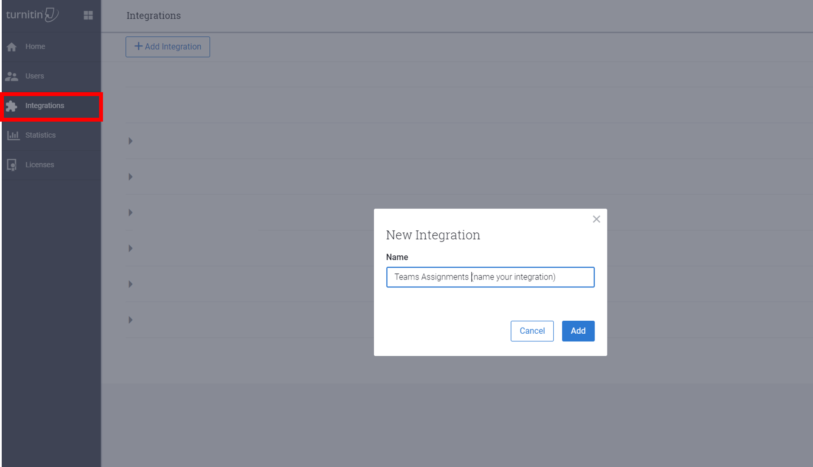

# Assegnare attività in Teams per l'istruzione

Le assegnazioni sono attività o unità di lavoro assegnate a uno studente o a un membro del team in una classe come parte dello studio. Puoi creare assegnazioni all'interno della classe teams.

[Ulteriori informazioni sulle assegnazioni](https://support.office.com/article/microsoft-teams-5aa4431a-8a3c-4aa5-87a6-b6401abea114?ui=en-US&rs=en-IE&ad=IE#ID0EAABAAA=Assignments)

## Assegnazioni nell'interfaccia di amministrazione di Microsoft Teams

Con le impostazioni di amministratore nell'interfaccia di amministrazione di Microsoft teams è possibile attivare o disattivare le caratteristiche seguenti per essere disponibili per studenti e docenti all'interno dell'organizzazione. Di seguito sono riportate le impostazioni relative alle assegnazioni:

### Digest della posta elettronica Guardian settimanale

I messaggi di posta elettronica Guardian sono inviati settimanalmente ai genitori o ai tutori degli studenti. I messaggi di posta elettronica conterranno informazioni sulle assegnazioni della settimana precedente e per la settimana successiva e verranno inviate durante il fine settimana. I messaggi di posta elettronica devono essere aggiornati dagli amministratori tramite la funzionalità School Data Sync.

Questa impostazione è disinserita per impostazione predefinita.

### MakeCode
Microsoft MakeCode è una piattaforma di codifica basata su blocchi che consente di portare in vita l'informatica per tutti gli studenti. 

MakeCode è un prodotto Microsoft soggetto alle [condizioni d'uso](https://go.microsoft.com/fwlink/?LinkID=206977) e ai criteri di [privacy](https://go.microsoft.com/fwlink/?LinkId=521839) di Microsoft.

Questa impostazione è disinserita per impostazione predefinita. Per abilitare le assegnazioni di MakeCode in teams, nell'interfaccia di **amministrazione di teams**passare alla sezione **assegnazioni** e attivare l'opzione toggle MakeCode **su**attivato. Fare clic su **Salva** e attendere alcune ore per rendere effettive queste impostazioni.

Per altre informazioni sul funzionamento di questa funzionalità, vedere questa [dimostrazione video](https://makecode.com/blog/teams/teams-assignments).

[Leggi altre informazioni su MakeCode](https://aka.ms/makecode)

### Turnitin

Turnitin è un servizio di rilevamento del plagio. Si tratta di un prodotto o un servizio di terze parti soggetto ai propri termini e alla propria politica sulla privacy. L'utente è responsabile dell'uso di prodotti e servizi di terze parti.

Questa impostazione è disinserita per impostazione predefinita.

Per abilitare correttamente Turnitin per l'organizzazione, è necessario avere già un abbonamento a Turnitin. Sarà necessario immettere le informazioni aggiuntive seguenti, che si trovano nella console di amministrazione di Turnitin:

  * _TurnitinApiKey_: questo è un GUID di 32-character trovato nella console di amministrazione in Integrations.
  * _TurnitinApiUrl_: questo è l'URL HTTPS della console di amministrazione di Turnitin.

Ecco alcune istruzioni utili per ottenere queste informazioni.

TurnitinApiUrl è l'indirizzo host della console di amministrazione.
Esempio. `https://your-tenant-name.turnitin.com`

La console di amministrazione è la posizione in cui è possibile creare un'integrazione e una chiave API associata all'integrazione.

Selezionare **integrazioni** dal menu laterale, quindi fare clic su **Aggiungi integrazione** e assegnare un nome all'integrazione.

Il TurnitinApiKey verrà assegnato dopo aver seguito le istruzioni. Copiare la chiave API e incollarla nell'interfaccia di amministrazione di Microsoft teams.  Questa è l'unica volta che è possibile visualizzare la chiave.

Dopo aver fatto clic sul pulsante **Salva** nell'interfaccia di amministrazione per questa impostazione, attendere alcune ore per rendere effettive queste impostazioni.

Pronti per iniziare a usare l'integrazione di Turnitin in teams? Iscriversi al [programma Early Access](https://www.turnitin.com/products/feedback-studio/microsoft-teams-integration).
