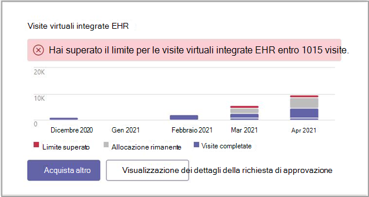

# Microsoft Teams Report di amministrazione del connettore EHR

La Microsoft Teams report di amministrazione del connettore EHR (Electronic Health Record) offre una visualizzazione rapida e facile da leggere dei dati di utilizzo.

È possibile visualizzare il report di Microsoft Teams di amministrazione del connettore EHR facendo clic sul dashboard dell'interfaccia di amministrazione di Microsoft Teams e visualizzando la finestra di dialogo.

Accedere al report dal dashboard dell Microsoft Teams di amministrazione.

 

La finestra di dialogo fornisce i dati seguenti:

- Limite superato
- Allocazione rimanente
- Visite completate

È possibile usare la finestra di dialogo report per acquistare altre visite virtuali.

## Argomenti correlati

[Teams per le visite virtuali](ehr-admin.md)
