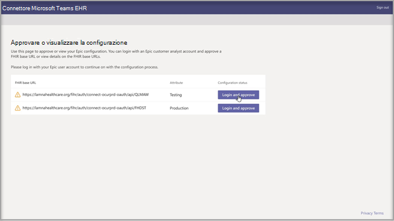
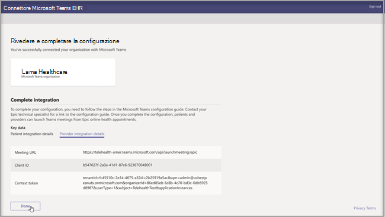
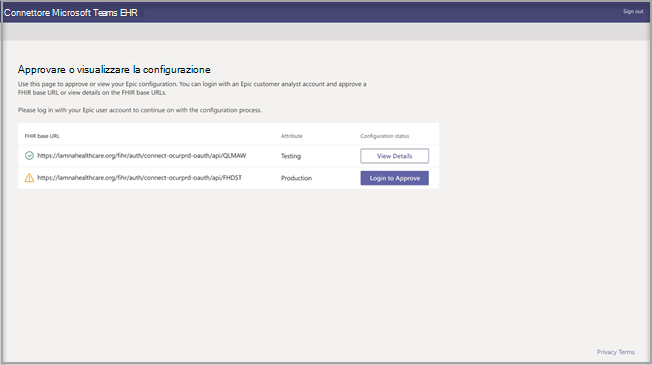

# Visite virtuali con Teams - Integrazione in EHR

Microsoft Teams Electronic Health Record (EHR) Connector consente ai medici di avviare facilmente una visita o una consulenza virtuale con un altro provider di Teams direttamente dal sistema EHR. Basato sul cloud Microsoft 365, Microsoft Teams consente una collaborazione e comunicazione semplici e sicure con strumenti di chat, video, voce e assistenza sanitaria in un unico hub che supporta la conformità con HIPAA, certificazione HITECH e altro ancora.
La piattaforma di comunicazione e collaborazione di Teams consente ai medici di tagliare il disordine di sistemi frammentati in modo che possano dedicare tempo alle cure migliori possibili. Microsoft Teams Electronic Health Record (EHR) Connector può:
- Avvia le visite virtuali di Teams dai portali del provider e dei pazienti.
- Scrivere di nuovo nei metadati EHR per connettersi e disconnettere gli eventi per abilitare il controllo automatico e il mantenimento dei record.
- È possibile integrare i flussi di lavoro esistenti di un medico o di pazienti, consentendo loro di usare Microsoft Teams.

  Guardare il video su come gestire le visite virtuali dal portale EHR.

> [!VIDEO https://www.microsoft.com/videoplayer/embed/RE4HAtn]

## Prima di iniziare

Per poter integrare il connettore EHR, è necessario verificare di avere i prerequisiti seguenti:

- Accesso all'app Microsoft Teams in [App Orchard marketplace di Amazon.](https://apporchard.epic.com/Gallery?id=6153)

- Abbonamento attivo a Microsoft Cloud per il settore sanitario o abbonamento all'offerta autonoma microsoft Teams EHR Connector (applicata solo durante i test di produzione).

- Gli utenti devono avere una licenza appropriata di Microsoft 365 o Office 365 che includa le riunioni di Microsoft Teams.

- Microsoft Teams deve essere adottato e usato all'interno dell'organizzazione.

- Le organizzazioni devono avere con la versione Beta di novembre 2018 o successiva.

- I sistemi devono soddisfare tutti [i prerequisiti software e del browser.](https://docs.microsoft.com/microsoftteams/hardware-requirements-for-the-teams-app)

Sono necessarie anche le informazioni dei seguenti utenti dell'organizzazione:

- Amministratore di Microsoft 365

- Analista cliente esalta

> [!Note]
> Richiedi al tuo esperto tecnico Disabilita di fornire la Epic-Microsoft di integrazione telehealth di Teams disponibile in Marketplace di Amazon.

## Configurazione del connettore

Per la configurazione del connettore è necessario:

- [Avviare il portale di configurazione del connettore EHR](ehr-admin.md#launch-the-ehr-connector-configuration-portal)
- [Informazioni di configurazione](ehr-admin.md#configuration-information)
- [Approvazione o visualizzazione della configurazione](ehr-admin.md#approve-or-view-configuration)
- [Rivedere e completare la configurazione](ehr-admin.md#review-and-finish-the-configuration)

### [Avviare il portale di configurazione del connettore EHR](#launch-the-ehr-connector-configuration-portal)

La configurazione dell'organizzazione sanitaria per l'avvio di visite virtuali con Microsoft Teams avvia il portale di configurazione del connettore EHR. Configurare una o più organizzazioni per testare l'integrazione. Configurare l'URL di test e produzione nel portale di configurazione. Prima di passare alla produzione, testare l'integrazione dell'ambiente di test di Innova.
  
- URL di configurazione del connettore EHR: [https://ehrconnector.teams.microsoft.com](https://ehrconnector.teams.microsoft.com)

L'amministratore di Microsoft 365 e l'analista cliente Più questo dell'organizzazione devono completare i passaggi per l'integrazione e le informazioni nel portale di configurazione. Per i passaggi di configurazione dell'organizzazione, contattare la risorsa tecnica Diarotte assegnata all'organizzazione.

### [Informazioni di configurazione](#configuration-information)

Questo passaggio deve essere completato **dall'amministratore di Microsoft 365.** Per avviare il processo di configurazione, l'amministratore di Microsoft 365 deve avviare il portale di configurazione del connettore e accedere con le credenziali Microsoft.

Per completare questo passaggio, l'amministratore di Microsoft 365 deve ricevere un URL di base Fast Health Interoperability Resources (FHIR) valido dal tecnico Specializzato e il nome utente dell'analista del cliente Fast Health Interoperability Resources che approva la configurazione. Per avviare il processo di configurazione, l'amministratore di Microsoft 365 deve avviare la pagina di configurazione del connettore e accedere con le credenziali Microsoft.

- L'URL di base FHIR è un indirizzo statico corrispondente all'endpoint dell'API FHIR del server. Un URL di esempio è `https://lamnahealthcare.org/fihr/auth/connect-ocurprd-oauth/api/FHDST` .

- Nome responsabile approvazione configurazione è il nome dell'analista cliente Innovatore che sarà responsabile dell'approvazione della configurazione nel passaggio successivo. L'analista cliente Più importante è una persona dell'organizzazione con accesso ad Avaro.

  

### [Approvazione o visualizzazione della configurazione](#approve-or-view-configuration)

L'analista cliente Disalvata per l'organizzazione sanitaria che è stata aggiunta come responsabile approvazione ora deve usare lo stesso URL del connettore EHR del passaggio precedente per accedere con le credenziali di Microsoft 365. Dopo la convalida, al responsabile approvazione verrà chiesto di eseguire l'accesso con le loro credenziali frequenti per convalidare l'organizzazione di questo tipo.

> [!Note]
> L'amministratore di Microsoft 365 e l'analista cliente Più di questo tipo nell'organizzazione possono essere la stessa persona. In questo caso, aggiungere il proprio nome utente come responsabile approvazione. Per convalidare l'accesso, dovrai comunque accedere ad Haiti. L'accesso Dir 3 viene usato solo per convalidare l'URL di base FHIR. Microsoft non archivia le credenziali né accede ai dati EHR con questo accesso.

  

Dopo aver completato l'accesso, l'analista cliente Innova **deve** approvare la configurazione. Se la configurazione non è corretta, l'amministratore di Microsoft 365 avrà la possibilità di modificare le configurazioni originali accedendo di nuovo al portale dei connettori Microsoft EHR. 

### [Rivedere e completare la configurazione](#review-and-finish-the-configuration)

Quando le informazioni di configurazione vengono approvate dall'amministratore programmaTaro, verranno visualizzati i record di integrazione per il lancio di pazienti e provider. Questi record sono necessari per completare la configurazione della visita virtuale in Ho. Per altre informazioni, Epic-Microsoft guida all'integrazione teleintegra di Teams.

> [!Note]  
> In qualsiasi momento, l'analista cliente Microsoft 365 o Riesci può accedere al portale di configurazione per visualizzare i record di integrazione e modificare la configurazione dell'organizzazione, se necessario.

> [!Note]
> Prima di completare il processo di approvazione da parte dell'analista clienteConfigure per ogni URL FHIR configurato dall'amministratore Microsoft.

## Avviare le visite virtuali di Teams

Dopo aver completato la procedura per il connettore EHR e la configurazione di questo tipo, l'organizzazione è pronta a supportare le video visite con Microsoft Teams.

### Prerequisiti per la visita virtuale

- I sistemi devono soddisfare tutti [i prerequisiti software e del browser.](https://docs.microsoft.com/microsoftteams/hardware-requirements-for-the-teams-app)

- È necessario che l'organizzazione sanitaria abbia completato la configurazione tra l'organizzazione Invasa e l'organizzazione Microsoft 365.

### Esperienza del provider

Gli operatori sanitari dell'organizzazione possono partecipare alle visite virtuali con Microsoft Teams dalle applicazioni provider Di Questo tipo (Hyperspace, Haiku, Canto). Il **pulsante Avvia visita** virtuale è incorporato nel flusso del provider.

Caratteristiche principali dell'esperienza del provider:

- I provider possono partecipare a visite virtuali usando i browser supportati o l'applicazione Microsoft Teams.

- I provider devono eseguire l'accesso una sola volta con il proprio account Microsoft 365 quando si partecipa a una visita virtuale per la prima volta.

- Dopo l'accesso una sola volta, il provider verrà portato direttamente all'appuntamento virtuale in Microsoft Teams. (Il provider deve essere connesso a Microsoft Teams).

- Il provider può vedere gli aggiornamenti in tempo reale dei partecipanti che si connettono e si disconnettino per un determinato appuntamento. Il provider può vedere quando il paziente è connesso a una visita virtuale.

  

### Esperienza dei pazienti

Il connettore supporta i pazienti che partecipano a visite virtuali tramite il Web e il dispositivo mobile MyChart. Al momento dell'appuntamento, i pazienti possono iniziare una visita virtuale da MyChart usando il pulsante **Inizia visita** virtuale.

Caratteristiche principali dell'esperienza del paziente:

- I pazienti possono partecipare a visite virtuali da Web browser moderni su desktop e dispositivi mobili senza installazione di app.

- I pazienti possono partecipare a visite virtuali con un solo clic e non è necessario alcun altro account o accesso.

- I pazienti non sono tenuti a creare un account Microsoft o ad accedere per avviare una visita virtuale.

- I pazienti saranno messi in sala d'attesa finché il provider sanitario non si unisce all'appuntamento e li ammettere alla visita virtuale.

- I test del video e del microfono sono disponibili nella sala di attesa prima di partecipare alla visita virtuale.

  

> [!Note]
> MyChart, Haiku e Canto sono marchi di Corporation, Corporation, MyChart e Canto.

### Privacy e posizione dei dati

L'integrazione di Teams nei sistemi EHR ottimizza la quantità di dati usati e archiviati durante l'integrazione e i flussi delle visite virtuali. La soluzione segue i principi generali sulla privacy e la gestione dei dati di Teams e le linee guida sulla privacy di Teams.

Il connettore Microsoft Teams EHR non archivia né trasferisce dati personali identificabili o cartelle sanitarie di pazienti o fornitori di assistenza sanitaria dal sistema EHR. Gli unici dati archiviati dal connettore EHR sono l'ID univoco dell'utente EHR, usato durante la configurazione della riunione di Teams. L'ID univoco dell'utente EHR viene archiviato in una delle tre aree geografiche descritte in Dove vengono archiviati i dati dei clienti [di Microsoft 365.](https://docs.microsoft.com/microsoft-365/enterprise/o365-data-locations?view=o365-worldwide#data-center-geographies) Tutte le chat, le registrazioni e altri dati immessi in Teams dai partecipanti alla riunione vengono archiviati in base ai criteri di archiviazione esistenti. Per ulteriori informazioni sulla posizione dei dati in Microsoft Teams, visita [Posizioni dei dati in Teams.](https://docs.microsoft.com/microsoftteams/location-of-data-in-teams)
