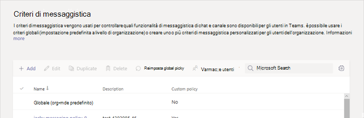
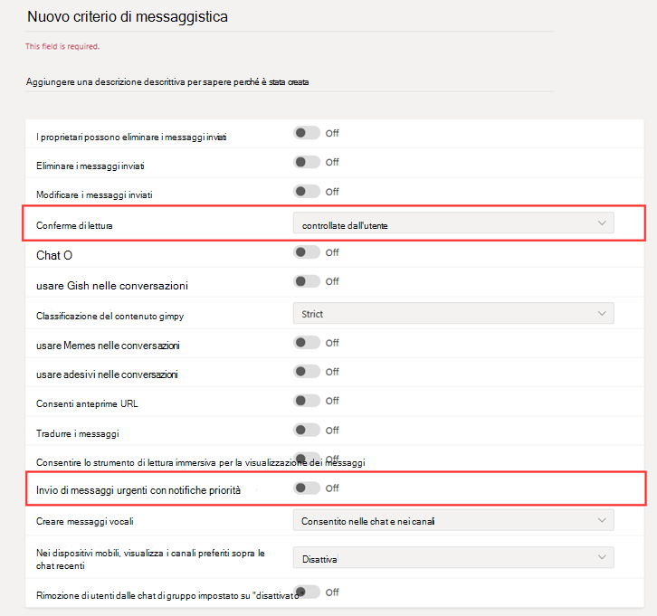

# Guida introduttiva a Messaggistica protetta per le organizzazioni del settore sanitario

I criteri di messaggistica vengono usati per controllare quali funzionalità di messaggistica di chat e canali sono disponibili per gli utenti in Microsoft teams e fanno parte della distribuzione complessiva di messaggistica sicura per organizzazioni sanitarie, come ospedali, cliniche o uffici del medico, in cui è fondamentale avere un messaggio prelevato e agito in modo tempestivo, come è importante sapere quando vengono letti messaggi cruciali.

È possibile usare il criterio globale (predefinito per l'intera organizzazione) o creare uno o più criteri di messaggistica personalizzati per gli utenti dell'azienda. Gli utenti dell'organizzazione verranno assegnati automaticamente al criterio globale, a meno che non venga creato e assegnato un criterio personalizzato. Dopo aver creato un criterio personalizzato, assegnarlo a un utente o a un gruppo di utenti dell'organizzazione. Ad esempio, puoi scegliere di consentire solo a determinati ruoli di lavoro di usare queste funzionalità (solo medici e infermieri) e altri lavoratori (come gli addetti alle pulizie o il personale della cucina) per ottenere un set di caratteristiche più limitato. Per decidere autonomamente ciò che serve alla propria organizzazione, le indicazioni sono al massimo un suggerimento.

I criteri possono essere facilmente gestiti nell'interfaccia di [amministrazione di Microsoft teams](https://admin.teams.microsoft.com) accedendo con le credenziali di amministratore e scegliendo i **criteri di messaggistica** nel riquadro di spostamento sinistro.

 

Per modificare i criteri di messaggistica predefiniti esistenti per l'organizzazione, fare clic su **globale (impostazione predefinita)** e quindi apportare le modifiche desiderate. Per creare nuovi criteri di messaggistica personalizzati, fare clic su **Aggiungi** e quindi selezionare le impostazioni. Al termine, scegliere **Salva** .

Le impostazioni seguenti sono di particolare interesse per le applicazioni sanitarie e devono essere considerate quando si progettano criteri personalizzati usati nel campo dell'assistenza sanitaria:

## Conferme di lettura

Conferme di lettura consente al mittente di un messaggio di chat di sapere quando il messaggio è stato letto dal destinatario in 1:1 e raggruppare le chat di 20 persone o meno. Usare questa impostazione per specificare se le conferme di lettura sono controllate dall'utente, attivate per tutti o disattivate per tutti. Le conferme di lettura dei messaggi sono importanti per le organizzazioni sanitarie perché eliminano in maniera non sicura se un messaggio è stato letto.

Per le applicazioni sanitarie, scegliere **utente controllato** o attivato **per tutti**. Tenere presente che quando si usa l'impostazione **per tutti gli utenti** , l'unico modo per impostare le conferme per l'intero tenant è quello di avere solo un criterio di messaggistica per l'intero tenant (il criterio predefinito denominato "globale (impostazione predefinita)") o per avere tutti i criteri di messaggistica nel tenant usano le stesse impostazioni per le conferme. La caratteristica delle conferme di lettura è più efficace quando la funzionalità è abilitata per **tutti**.

*Esempio di utilizzo senza conferme di lettura:* Jakob Roth, un paziente ad alto rischio, è ammesso in ospedale.Sofia Krause è un'infermiera che lavora come parte del team interdisciplinare (IDT) di operatori sanitari, inclusi diversi specialisti, viene assegnato come coordinatore di assistenza primaria responsabile di questo paziente.  Sofia invia posta elettronica e altri messaggi istantanei a gruppi di infermieri e medici che usano diversi client e app di messaggistica e spesso non riceve alcuna risposta o indica se un messaggio è stato letto dai membri del team. A causa di processi di comunicazione aggrovigliati, il farmaco di Jakob viene applicato in stato di malessere e il suo soggiorno in ospedale viene esteso.

*Esempio di utilizzo con le conferme di lettura:* Jakob Roth, un paziente ad alto rischio, è ammesso in ospedale.Sofia Krause è un'infermiera che lavora come parte del team interdisciplinare (IDT) di operatori sanitari, inclusi diversi specialisti, viene assegnato come coordinatore di assistenza primaria responsabile di questo paziente.  Sofia avvia una chat di gruppo con un set di medici e altri infermieri che lavoreranno con il paziente per coordinare le cure e avviare un triage di emergenza.Gli infermieri e i medici comunicano e collaborano al piano di assistenza del paziente durante il processo di coordinamento delle cure.  I messaggi importanti e urgenti vengono inviati tramite 1:1 e conversazioni di chat di gruppo. Sofia usa la funzionalità di lettura ricevute per determinare se i messaggi inviati che richiedono il supporto vengono recapitati e letti dai medici o infermieri mirati. I risultati del paziente di Jakob sono quasi ottimali e torna a casa prima perché il suo team di assistenza comunica senza intoppi.

## Inviare messaggi urgenti con le notifiche prioritarie

Un utente può contrassegnare un messaggio come *urgente* quando si inviano messaggi di chat ad altri utenti. Questa caratteristica aiuta il personale ospedaliero ad avvisarsi l'un l'altro quando un incidente critico richiede la sua attenzione. A differenza dei normali messaggi *importanti* , le [notifiche prioritarie](https://support.microsoft.com/en-us/office/mark-a-message-as-important-or-urgent-in-teams-ea99d5b6-1317-4550-8d75-86ff14cd4462) notificano agli utenti ogni due minuti per un massimo di 20 minuti oppure fino a quando il messaggio viene raccolto e letto dal destinatario, massimizzando la probabilità che il messaggio venga agito in modo tempestivo.

Un amministratore può abilitare o disabilitare la possibilità per gli utenti assegnati a questo criterio di inviare notifiche prioritarie. Questa caratteristica è attivata per impostazione predefinita. Il destinatario del messaggio di priorità potrebbe non avere lo stesso criterio di messaggistica e non avrà l'opzione di disabilitare la ricezione dei messaggi prioritari. Per le applicazioni sanitarie, è consigliabile abilitare la funzionalità per almeno alcuni utenti, ma è necessario determinare quali.

*Esempio di utilizzo:* Sofia Krause sta riammettendo un paziente ad alto rischio, Jakob Roth. Manuela Carstens, un medico, è il medico di primo interesse per questo paziente.  Sofia Invia un messaggio a Manuela con una notifica prioritaria che chiede assistenza immediata per la valutazione di Jakob.  Il telefono di Manuela riceve il messaggio ma Manuela non sente la vibrazione del telefono e non risponde. I team notificano nuovamente Manuela e continueranno a essere ripetutamente avvisati finché non legge il messaggio. Se sono abilitate anche le conferme di lettura, Sofia può tenere presente che il messaggio è stato letto da Manuela, anche prima che Manuela decida come rispondere.

## Argomenti correlati

- [Gestire i criteri di messaggistica in teams](../../messaging-policies-in-teams.md)
- [Guida introduttiva a Teams per le organizzazioni del settore sanitario](teams-in-hc.md)
