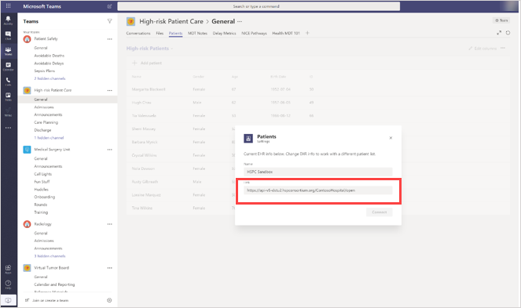

# Connettere l'app Pazienti all'API di Azure per FHIR

> [!IMPORTANT]
> **Efficace il 30 ottobre 2020 l'app patients sarà deprecata e gli utenti non potranno più installarla dall'app teams Store. Ti invitiamo a iniziare a usare l' [app elenchi](https://support.microsoft.com/office/get-started-with-lists-in-teams-c971e46b-b36c-491b-9c35-efeddd0297db) in teams Today.**
>
>I dati dell'app patients sono archiviati nella cassetta postale del gruppo del gruppo Office 365 che appoggia il team. Quando l'app patients viene ritirata, tutti i dati associati verranno mantenuti in questo gruppo, ma non sarà più possibile accedervi tramite l'interfaccia utente. Gli utenti correnti possono ricreare gli elenchi usando l' [app elenchi](https://support.microsoft.com/office/get-started-with-lists-in-teams-c971e46b-b36c-491b-9c35-efeddd0297db).
>
>L' [app elenchi](https://support.microsoft.com/office/get-started-with-lists-in-teams-c971e46b-b36c-491b-9c35-efeddd0297db) è preinstallata per tutti gli utenti di teams ed è disponibile come scheda in ogni team e canale. Con gli elenchi, i team di integrità possono creare elenchi di pazienti usando il modello di pazienti incorporati, da zero o importando dati in Excel. Per ulteriori informazioni su come gestire l'app elenchi nell'organizzazione, vedere [gestire l'app elenchi](../../manage-lists-app.md).

Seguire questa procedura per consentire all'app pazienti in Microsoft teams di accedere a un'API di Azure per l'istanza di FHIR. In questo articolo si presuppone che sia stata configurata un' [API Azure per l'istanza di FHIR](https://azure.microsoft.com/services/azure-api-for-fhir/) e la configurazione del tenant.  Se non è ancora stata creata un'API Azure per l'istanza di FHIR nel tenant, vedere [Guida introduttiva: distribuire Azure API per FHIR con Azure Portal](https://docs.microsoft.com/azure/healthcare-apis/fhir-paas-portal-quickstart).

1. Fare clic [qui](https://login.microsoftonline.com/common/adminConsent?client_id=4aee3506-b263-43e0-ba31-1468fa7b2806) per concedere il consenso dell'amministratore per l'app pazienti. Quando richiesto, accedere con l'amministratore del tenant o le credenziali di amministratore globale e quindi fare clic su **accetta** per concedere le autorizzazioni necessarie.

    

    Dopo aver accettato, chiudere la finestra. Verrà visualizzata una pagina che può avere un aspetto simile al seguente. È possibile ignorare il messaggio di errore nella pagina. È innocuo e indica che viene concesso il consenso. Stiamo lavorando a una pagina più user-friendly per questo URL. Restate sintonizzati!)

    
    
2. Accedere a [Azure Portal](https://portal.azure.com) con le credenziali di amministratore.

3. Nella barra di spostamento sinistra selezionare **Azure Active Directory** e quindi selezionare **applicazioni aziendali** .

    Cercare una riga denominata **patients (dev)** e quindi copiare il valore nella colonna **ID oggetto** negli Appunti.
    
    
    
4. Passare all'istanza di risorsa Azure API for FHIR a cui si vuole connettere l'app patients, cercandola o sfogliando le risorse, quindi aprire le impostazioni per l'istanza.

    

5. Fare clic su **autenticazione** e quindi incollare l'ID oggetto copiato nel passaggio 3 nella casella **ID oggetto consentiti** . Questo consente all'app patients di accedere al server FHIR. Dopo aver incollato l'ID oggetto, Azure Active Directory la convalida e viene visualizzato un segno di spunta verde accanto.

    

6. Fare clic su **Salva** . Verrà ridistribuita l'istanza, che può richiedere alcuni minuti.

7. Fare clic su **Panoramica** e quindi copiare l'URL dall' **endpoint di metadati FHIR** . Rimuovere il tag Metadata per ottenere l'URL del server FHIR. Ad esempio, https://test02-teamshealth.azurehealthcareapis.com/ . 

    

8. In teams passare all'istanza dell'app patients caricata nel team, fare clic su **Impostazioni** e quindi nella casella **collegamento** immettere l'URL dell'endpoint del server FHIR. Fare quindi clic su **Connetti** per stabilire una connessione e cercare e aggiungere i pazienti all'elenco.  

    
    
    Se viene visualizzato un messaggio di errore durante la connessione ai team durante questo passaggio, inviare una schermata dettagliata dell'errore, i registri di [Fiddler](https://www.telerik.com/download/fiddler) e qualsiasi altra procedura di riproduzione in un messaggio di posta elettronica con una riga dell'oggetto "app pazienti-risoluzione dei problemi della modalità EMR" in [teamsforhealthcare@service.microsoft.com](mailto:teamsforhealthcare@service.microsoft.com).

## Argomenti correlati

- [Panoramica dell'app Pazienti](patients-app-overview.md)
- [Integrare cartelle cliniche elettroniche in Microsoft Teams](patients-app.md)
