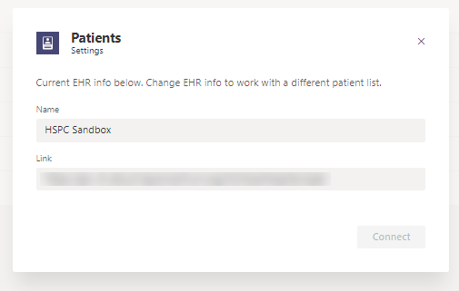

# Integrare cartelle cliniche elettroniche in Microsoft Teams

[!INCLUDE [preview-feature](../../includes/preview-feature.md)]

Per partecipare all'anteprima privata, vedere [registrazione in anteprima privata](#enroll-in-the-private-preview).

Questo articolo è destinato a uno sviluppatore di servizi sanitari generale interessato all'uso di API FHIR su un sistema di informazioni mediche per la connessione a Microsoft teams. Questo consentirebbe agli scenari di coordinamento delle cure che soddisfano le esigenze di un'organizzazione sanitaria.

Gli articoli collegati documentano le specifiche dell'interfaccia FHIR per l'app Microsoft teams patients e le sezioni seguenti spiegano cosa è necessario per configurare un server FHIR e la connessione all'app patients nell'ambiente di sviluppo o nel tenant. Dovrai anche avere familiarità con la documentazione del server FHIR che hai scelto, che deve essere una delle opzioni supportate:
- Datica (tramite l'offerta [CMI](https://datica.com/compliant-managed-integration/) )
- Infor Cloverleaf (tramite il [Bridge infor FHIR](https://pages.infor.com/hcl-infor-fhir-bridge-brochure.html))
- Redox (tramite il [Server R ^ FHIR](https://www.redoxengine.com/fhir/))
- Dapasoft (tramite [corolar in FHIR](https://www.dapasoft.com/corolar-fhir-server-for-microsoft-teams/))

> [!NOTE]
> Questo processo non include passaggi che usano l'interfaccia di amministrazione di Microsoft teams o i cmdlet di PowerShell per abilitare le caratteristiche. La configurazione viene eseguita completamente sul lato server/servizio di FHIR e nel client dell'app pazienti.

Di seguito è illustrata l'architettura dell'app patients:

Le sezioni seguenti illustrano i requisiti del livello di accesso ai dati di FHIR-only per l'app patients che deve soddisfare un server FHIR (o EHR Enabled FHIR API) per l'integrazione con l'app patients, inclusi i seguenti:

- Aspettative intorno all'autenticazione utente
- Requisiti funzionali e tecnici dell'interfaccia di integrazione
- Aspettative intorno alle prestazioni e all'affidabilità
- Aspettative intorno alle risorse di FHIR da supportare per l'app pazienti
- Processo per l'integrazione e il modello di impegno previsto
- Come iscriversi e il cliente nell'anteprima privata dell'app patients
- Come iniziare a usare FHIR e alcune sfide comuni affrontate con l'app patients
- Requisiti futuri per l'iterazione successiva dell'app patients

> [!NOTE]
> Nelle sezioni seguenti viene usato il termine "partner" o "partner di interoperabilità" per fare riferimento a qualsiasi organizzazione di terze parti che consente l'integrazione nei sistemi EHR per l'app patients tramite FHIR e sta implementando un server FHIR in modo che corrisponda alle specifiche elencate.

## Requisiti funzionali e tecnici  

### Autenticazione  

L'autorizzazione a livello di app *senza supporto per l'autorizzazione a livello utente* è il modo più comune per eseguire trasformazioni dei dati ed esporre le connessioni ai dati di EHR tramite FHIR, anche se il sistema EHR potrebbe implementare l'autorizzazione a livello di utente. Il servizio di interoperabilità (partner) Ottiene l'accesso elevato ai dati di EHR e quando espongono gli stessi dati delle risorse FHIR appropriate non esiste alcun contesto di autorizzazione passato al consumer del servizio di interoperabilità (l'app patients) che si integra con l'interoperabilità Servizio o piattaforma. L'app patients non sarà in grado di applicare l'autorizzazione a livello di utente, ma supporta l'applicazione per l'autenticazione delle applicazioni tra l'app patients e il servizio del partner di interoperabilità.

Il modello di autenticazione dell'applicazione per l'applicazione è descritto di seguito:

Il servizio per l'autenticazione del servizio deve essere eseguito tramite il [flusso di credenziali client](https://www.oauth.com/oauth2-servers/access-tokens/client-credentials/)OAuth 2,0. Il servizio partner deve specificare quanto segue:

1. Il servizio partner consente all'app patients di creare un account con il partner, che consente all'app patients di generare e possedere client_id e client_secret, gestito tramite un portale di registrazione auth nel server di autenticazione del partner.
2. Il servizio partner è proprietario del sistema di autenticazione/autorizzazione, che accetta e verifica (autentica) le credenziali del client fornite e restituisce un token di accesso con il suggerimento del tenant nell'ambito, come descritto di seguito.
3. Per motivi di sicurezza o in caso di violazione segreta, l'app patients può rigenerare il segreto e invalidare o eliminare il vecchio segreto (ad esempio è disponibile in Azure Portal-registrazione delle app AAD)
4. L'endpoint dei metadati che ospita l'istruzione di conformità deve essere non autenticato, ma dovrebbe essere accessibile senza il token di autenticazione.
5. Il servizio partner fornisce l'endpoint del token per l'app patients per richiedere un token di accesso usando un flusso di credenziali client. L'URL del token come per il server di autorizzazione deve far parte dell'istruzione di conformità FHIR (funzionalità) recuperata dai metadati nel server FHIR, come in questo esempio:

* * *
    {"resourceType": "CapabilityStatement",.
        .
        .
        "Rest": [{"Mode": "Server", "Security": {"extension": [{"extension": [{"URL": "token", "valueUri": "https://login.contoso.com/145f4184-1b0b-41c7-ba24-b3c1291bfda1/oauth2/token"}, {"URL": "Autorizzo", "valueUri":https://login.contoso.com/145f4184-1b0b-41c7-ba24-b3c1291bfda1/oauth2/authorize""}], "URL":http://fhir-registry.smarthealthit.org/StructureDefinition/oauth-uris""}], "Service": [{"coding": [{"System":http://hl7.org/fhir/ValueSet/restful-security-service"" "," "," codice ":" OAuth "}]}]},.
                .
                .
            } ] }

* * *

Una richiesta di un token di accesso è costituita dai parametri seguenti:

* * *

    POST/token HTTP/1.1 host: authorization-server.com

    Grant-Type = client_credentials &client_id = xxxxxxxxxx &client_secret = xxxxxxxxxx

* * *

Il servizio partner offre la client_id e client_secret per l'app patients, gestita tramite un portale di registrazione auth sul lato del partner. Il servizio partner fornisce l'endpoint per richiedere il token di accesso usando un flusso di credenziali client. Una risposta corretta deve includere i parametri token_type, access_token e expires_in.

### Routing: mapping del tenant di AAD all'endpoint del provider

L'app patients si connette a un servizio partner tramite un singolo endpoint. Il servizio partner è proprietario e gestisce un meccanismo per eseguire il mapping di ogni cliente Microsoft (ID tenant di AAD) a un provider di servizi sanitari (FHIR Server) con cui il servizio partner sta lavorando.

Il mapping del tenant di AAD a un endpoint del provider usa l'ID tenant di AAD (GUID). L'app patients passa l'ID tenant nell'ambito, mentre richiede un token di accesso per ogni richiesta. Il servizio partner mantiene il mapping dell'ID tenant all'endpoint del provider e reindirizza le richieste a un endpoint del provider in base all'ID tenant. A questo scopo, il partner supporta la configurazione alla fine (manualmente o tramite un portale come parte dell'onboarding delle organizzazioni di provider alla propria piattaforma di interoperabilità).

Il flusso di lavoro di autenticazione e routing è illustrato di seguito:

1. Richiedi il token di accesso all'app inviando:
 
        {   grant_type: client_credentials,
            client_id: xxxxxx, 
            client_secret: xxxxxx,
            scope: {Provider Identifier, Ex: tenant ID}
        }

2. Rispondere con un token dell'app:

        {  access_token: {JWT, with scope: tenant ID},
           expires_in: 156678,
           token_type: "Bearer",
        }

3. Richiedi dati protetti con il token di accesso.
4. Messaggio di autorizzazione: selezionare il server di FHIR appropriato da instradare dall'ID tenant nell'ambito
5. Invia i dati protetti dall'app dal server FHIR autorizzato dopo l'autenticazione con il token dell'app.

## Interfacce

Le chiamate e i campi specifici usati dall'app patients sono documentati negli articoli seguenti. Selezionare l'interfaccia applicabile alle API di FHIR server/FHIR.

- [Specifica dell'interfaccia DSTU2](dstu2-interface.md)
- [Specifica dell'interfaccia STU3](stu3-interface.md)

## Prestazioni e affidabilità

Mentre l'app patients è in anteprima privata, non ci sono garanzie sulle prestazioni end-to-end. I fattori della prestazione includono la latenza relativa di tutti i luppoli coinvolti nel flusso di lavoro, a partire dalla EHR nell'ambiente del sistema sanitario, al partner di interoperabilità e ai loro infra, incluso il server FHIR e all'ecosistema di Office 365 e App pazienti.

## Introduzione a FHIR  

Se non si ha familiarità con FHIR e si ha bisogno di un facile accesso a un server FHIR che può essere esposto all'interfaccia di integrazione di Microsoft teams EHR, Microsoft ha un server di FHIR Open-Source disponibile per tutti gli sviluppatori. Vedere l'articolo su [FHIR Server for Azure](https://docs.microsoft.com/azure/healthcare-apis/overview-open-source-server) per altre informazioni sul server open source FHIR disponibile da Microsoft e distribuirlo per le organizzazioni.

Puoi anche usare l'ambiente HSPC Open sandbox EHR per creare un EHR che supporti anche un server FHIR aperto e usarlo per giocare con l'app pazienti. È consigliabile leggere la [documentazione della sandbox di HSPC](https://healthservices.atlassian.net/wiki/spaces/HSPC/pages/64585866/HSPC+Sandbox). La sandbox non solo offre un modo semplice, orientato all'interfaccia utente e facile da usare per creare, aggiungere e modificare i pazienti, ma offre anche diversi esempi per iniziare.  

## Iscriversi all'anteprima privata

Dopo aver creato il server open source FHIR, è molto semplice connettersi all'app patients all'interno del tenant seguendo la procedura descritta di seguito:

1. [Contattaci](mailto:Teamsforhealthcare@service.microsoft.com?subject=Microsoft%20Teams%20Patients%20App%20private%20preview) con i seguenti dettagli iniziali:  
    - Il tuo nome
    - Posizione
    - Società o organizzazione rappresentata
    - Perché sei interessato all'app pazienti per l'integrazione di EHR

    Ti risponderemo al più presto con altre domande e ti guideremo in un processo per ottenere la configurazione per l'anteprima privata.

2. Assicurati che sideload delle app personalizzate sia abilitato nel tenant in cui intendi provare l'app pazienti. Per informazioni su come attivare l'opzione dall'interfaccia di amministrazione di teams per il tenant del cliente o dell'utente, fare riferimento ai [criteri di autorizzazione dell'app](../../admin-settings.md) .

3. Trasferire localmente il manifesto dell'app patients che riceverai da Microsoft (dopo la procedura di elaborazione della posta elettronica) in un team del tenant che verrà usato per gli scenari di coordinamento delle cure e di arrotondamento dei pazienti. Istruzioni dettagliate su come caricare i carichi secondari di un'app in [caricare un pacchetto dell'app in Microsoft teams](/microsoftteams/platform/concepts/apps/apps-upload)

4. Passare al canale generale come proprietario del team e quindi fare clic sulla scheda pazienti. Dovrebbe essere visualizzata un'esperienza di prima esecuzione che presenta due opzioni, ossia la modalità EHR e la modalità manuale. Selezionare la **modalità EHR** e copiare l'endpoint del server FHIR (appena configurato in precedenza con tutti i dati e le risorse necessari per le specifiche descritte sopra) nel campo collegamento e assegnare alla connessione un nome che rappresenti bene il server FHIR. Fare clic su Connetti e tutto dovrebbe essere pronto per l'invio.

    

5. Iniziare a usare l'app per cercare i pazienti dal server FHIR/EHR e aggiungerli a un elenco e inviare [commenti e suggerimenti](mailto:Teamsforhealthcare@service.microsoft.com?subject=Microsoft%20Teams%20Patients%20App%20feedback) se qualcosa non funziona. Inoltre, per stabilire una versione completamente autenticata del flusso dei pazienti app-> FHIR, è necessario avviare un dialogo offline con Microsoft teams for Healthcare Product Engineering, tramite la richiesta di posta elettronica menzionata in precedenza per chiarire i requisiti e ti aiuteremo a abilitare questa procedura per i requisiti di autenticazione descritti nel documento di interfaccia di FHIR.  

