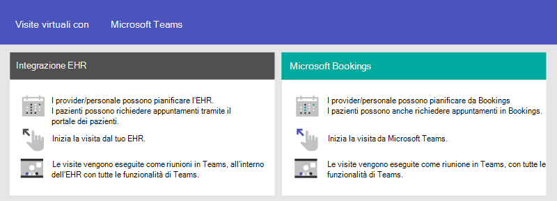
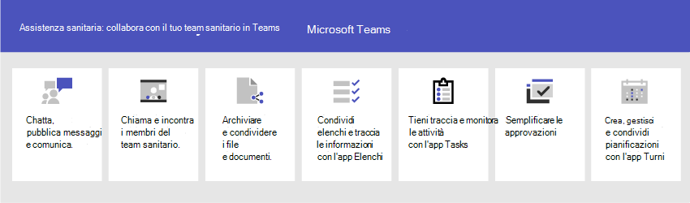

# Iniziare a usare team per organizzazioni sanitarieGet started with Teams for healthcare organizations

Microsoft teams offre una serie di funzionalità utili per ospedali e altre organizzazioni sanitarie, tra cui:Microsoft Teams offers a number of features useful for hospitals and other healthcare organizations, including:

- Visite virtuali e integrazione di EHR (Electronic Healthcare record)Virtual visits and Electronic Healthcare Record (EHR) integration
- Pacchetti di criteri TeamsTeams policy packages
- Messaggistica sicuraSecure messaging
- Modelli di TeamsTeams templates
- Coordinamento e collaborazione per l'assistenzaCare coordination and collaboration

Il contenuto in questa sezione presuppone che siano già stati distribuiti team nell'organizzazione.The content in this section assumes that you've already deployed Teams in your organization. Se non sono stati ancora distribuiti team, iniziare a leggere [come implementare Microsoft teams](../../How-to-roll-out-teams.md).If you haven't yet rolled out Teams, start by reading [How to roll out Microsoft Teams](../../How-to-roll-out-teams.md).

## Visite virtuali e integrazione di EHR (Electronic Healthcare record)Virtual visits and Electronic Healthcare Record (EHR) integration

Usare la piattaforma completa riunioni in Microsoft teams per pianificare, gestire e condurre visite virtuali con i pazienti.Use the complete meetings platform in Microsoft Teams to schedule, manage, and conduct virtual visits with patients.

- Se l'organizzazione usa già i record sanitari elettronici o EHR, è possibile integrare Microsoft teams per un'esperienza più semplice.If your organization already uses Electronic Health Records, or EHR, you can integrate Microsoft Teams for a more seamless experience. Microsoft teams Electronic Health record (EHR) Connector rende più facile per i medici avviare una visita virtuale o una consultazione con un altro provider in teams direttamente dal sistema EHR.Microsoft Teams Electronic Health Record (EHR) Connector makes it easy for clinicians to launch a virtual patient visit or consultation with another provider in Teams directly from the EHR system. Per altre informazioni, Vedi [visite virtuali con Teams-Integration in EHR](ehr-admin.md).To learn more, see [Virtual visits with Teams - Integration into EHR](ehr-admin.md).
- Se non si usa un EHR supportato, è possibile usare le prenotazioni Microsoft e l'app bookings in teams.If you aren't using a supported EHR, you can use Microsoft Bookings and the Bookings app in Teams. Per altre informazioni, vedere [prenotazioni di app e visite virtuali in Microsoft teams](../../bookings-app-admin.md).To learn more, see [Bookings app and virtual visits in Microsoft Teams](../../bookings-app-admin.md).

## Pacchetti di criteri TeamsTeams policy packages

Applicare i pacchetti dei criteri teams per definire i diversi ruoli che possono eseguire in teams.Apply Teams policy packages to define what different roles can do in Teams. Ad esempio, specificare i criteri per:For example, specify policies for:

- I lavoratori clinici, come infermieri registrati, caricano infermieri, medici e assistenti sociali, in modo che possano avere accesso completo alla chat, alle chiamate, alla gestione del turno e alle riunioni.Clinical workers, such as registered nurses, charge nurses, physicians, and social workers, so that they can have full access to chat, calling, shift management, and meetings.
- Gli Information Worker dell'organizzazione sanitaria, come il personale IT, il personale informatico, il personale finanziario e i responsabili della conformità, possono avere accesso completo alla chat, alle chiamate e alle riunioni.Information workers in your healthcare organization, such as IT personnel, informatics staff, finance personnel, and compliance officers, can have full access to chat, calling, and meetings.
- Sale paziente, per controllare le impostazioni per i dispositivi della sala paziente.Patient rooms, to control settings for patient room devices.

Per altre informazioni, vedere [pacchetti di criteri per team per l'assistenza sanitaria](../../policy-packages-healthcare.md).To learn more, see [Teams policy packages for healthcare](../../policy-packages-healthcare.md).

## Messaggistica sicuraSecure messaging

La messaggistica sicura supporta la collaborazione all'interno dei team di integrità, incluse diverse nuove caratteristiche:Secure messaging supports collaboration within health teams, including several new features:

- Un mittente del messaggio può impostare una priorità speciale per il messaggio, in modo che il destinatario venga notificato ripetutamente fino a quando non legge il messaggio.A message sender can set a special priority for their message, so the recipient is repeatedly notified until they read the message.
- Un mittente del messaggio può richiedere una conferma di lettura, in modo che venga notificato quando un messaggio inviato è stato letto dal destinatario del messaggio.A message sender can request a read receipt, so they are notified when a message they sent was read by the message recipient.

Insieme, queste funzionalità permettono una maggiore attenzione ai messaggi urgenti e alla fiducia che il messaggio è stato ricevuto e letto.Together, these features allow quicker attention to urgent messages and confidence that the message was received and read. I nuovi team di integrità che usano queste funzionalità possono essere creati per ogni singolo paziente.New health teams using these features can be created on a per-patient basis. Queste caratteristiche sono basate su criteri e possono essere assegnate a singoli o a Team interi.These features are policy-based, and can be assigned to individuals or entire Teams.

Per ulteriori informazioni, vedere [Introduzione ai criteri di messaggistica sicura per le organizzazioni sanitarie](messaging-policies-hc.md) .See [Get started with Secure Messaging policies for Healthcare organizations](messaging-policies-hc.md) for further details.

Anche correlato alla messaggistica sicura è la possibilità di avere altri tenant federati da organizzazioni sanitarie, consentendo una comunicazione intertenant più ricca.Also related to secure messaging is the ability to have other tenants federated by Healthcare organizations, allowing richer inter-tenant communication. Vedere [gestire l'accesso esterno (Federazione) in Microsoft teams](../../manage-external-access.md).(See [Manage external access (federation) in Microsoft Teams](../../manage-external-access.md)).

## Modelli di team per organizzazioni sanitarieTeams templates for healthcare organizations

I nuovi modelli per la creazione di team sono stati sviluppati per applicarsi a un ambiente ospedaliero e più presto sono attesi.New templates for creating Teams were developed to apply to a Hospital setting, and more are expected soon. In questo modo è più semplice creare team che gli operatori sanitari usano per coordinare le cure per i pazienti in diversi reparti o corsi.This makes it easier to create teams that Healthcare workers use to coordinate care for patients in various departments or wards. Vedere [Introduzione ai modelli di team per le organizzazioni sanitarie](healthcare-templates.md).See [Get started with Teams templates for Healthcare organizations](healthcare-templates.md). I team possono essere avviati per i reparti interni, ad esempio cardiologia o per i corsi di assistenza, e altri modelli sono in sviluppo.Teams can be started for internal departments such as cardiology, or for care wards, and more templates are in development.

## Coordinamento e collaborazione per l'assistenzaCare coordination and collaboration

Collaborare con Microsoft teams per coordinare i servizi di assistenza.Bring your health team together to coordinate care and collaborate with Microsoft Teams.

Microsoft teams consente a medici, clinici, infermieri e altri membri del personale di collaborare in modo efficiente con le caratteristiche di collaborazione incluse in Microsoft teams, ad esempio:Microsoft Teams enables physicians, clinicians, nurses, and other staff to collaborate efficiently with included collaboration features in Microsoft Teams, such as:

- Configurare Team e canali per i team di salute e gli Information Worker.Set up teams and channels for your health teams and information workers. Usare i canali con le schede per strutturare il proprio lavoro, con ulteriori informazioni sulle schede a cui possono aggiungere le origini dati.Use channels with tabs as a way to structure their work, with additional help from tabs to which they can pin information sources.
- Chattare, pubblicare messaggi e comunicare.Chat, post messages, and communicate. Il team può avere conversazioni persistenti su pazienti diversi che richiedono attenzione.Your team can have persistent conversations about different patients needing attention.
- Chiama e incontra i membri del team sanitario.Call and meet with members of the health team. Configurare singole riunioni o usare le riunioni di canale per gestire le riunioni quotidiane, sia con la potenza del team audio, video, condivisione dello schermo, registrazione e funzionalità di trascrizione.Set up individual meetings, or use channel meetings to manage daily meetings, both with the power of Teams audio, video, screen sharing, recording, and transcription features.
- Archiviare e condividere file e documenti.Store and share files and documents. Il team di integrità fa parte di un unico team virtualizzato che lavora e collabora ai documenti di Office.Your health team is part of a single virtualized team that works and collaborates on Office documents.

Inoltre, il team può usare le app in teams per:In addition, your team can use apps in Teams to:

- Condividere elenchi e tenere traccia delle informazioni con l'app elenchiShare lists and track information with the Lists app
- Tenere traccia e monitorare le attività con l'app attivitàTrack and monitor tasks with the Tasks app
- Semplificare le approvazioni con l'app approvazioniStreamline approvals with the Approvals app
- Creare, gestire e condividere le pianificazioni con l'app turniCreate, manage, and share schedules with the Shifts app

### Condividere elenchi e tenere traccia delle informazioni con l'app elenchiShare lists and track information with the Lists app

L'app elenchi in teams aiuta i team a tenere traccia delle informazioni e organizzare il lavoro.The Lists app in Teams helps teams track information and organize work. L'app è preinstallata per tutti gli utenti di teams ed è disponibile come scheda in ogni team e canale.The app is pre-installed for all Teams users and is available as a tab in every team and channel. Gli elenchi possono essere creati da zero, da modelli predefiniti o dall'importazione di dati in Excel.Lists can be created from scratch, from predefined templates, or by importing data to Excel.

i team di integrità possono usare il modello patients per iniziare.health teams can use the Patients template to get started. Possono creare elenchi per tenere traccia delle esigenze e dello stato dei pazienti.They can create lists to track the needs and status of patients. I dati dei pazienti esistenti nei fogli di calcolo di Excel possono essere introdotti per creare un elenco in teams.Existing patient data on Excel spreadsheets can be brought in to create a list in Teams. Questi elenchi possono essere usati per scenari come i turni e il monitoraggio dei pazienti per coordinare le cure.These lists can be used for scenarios such as rounds and patient monitoring to coordinate care.

Ad esempio, un'infermiera della carica crea un elenco di pazienti in un team che include tutti i membri del team di integrità.For example, a charge nurse creates a patient list in a team that includes all health team members. Durante i turni, il team di integrità accede ai team sui dispositivi mobili e aggiorna le informazioni sul paziente nell'elenco, che tutti i membri del team possono visualizzare per rimanere sincronizzati. Durante le sessioni di arrotondamento in cui il team sanitario si riunisce per discutere e valutare le metriche sulle prestazioni chiave per garantire che un paziente sia sul giusto percorso di scorrimento per il discarico, può condividere queste informazioni usando teams su uno schermo di grandi dimensioni.During rounds, the health team access Teams on their mobile devices and update patient information in the list, which everyone on the team can view to stay in sync. At rounding sessions where the health team gathers to discuss and evaluate key health performance metrics to ensure a patient is on the right glide path to discharge, they can share this information using Teams on a large display screen. i membri del team di integrità che non sono presenti nel sito possono partecipare in remoto.health team members who aren't on site can join remotely.

Ecco un elenco di esempio che è stato configurato per l'arrotondamento dei pazienti.Here's an example list which was set up for patient rounding.

:::image type="content" source="../../media/lists-patients-example.png" alt-text="Screenshot dell'elenco di esempio per l'arrotondamento del paziente":::

Per altre informazioni, vedere [gestire l'app elenchi per l'organizzazione in teams](../../manage-lists-app.md).To learn more, see [Manage the Lists app for your organization in Teams](../../manage-lists-app.md).

### Tenere traccia e monitorare le attività con l'app attivitàTrack and monitor tasks with the Tasks app

Usare le [attività](https://support.microsoft.com/office/use-the-tasks-app-in-teams-e32639f3-2e07-4b62-9a8c-fd706c12c070) in teams per tenere traccia degli elementi per l'intero team di integrità.Use [Tasks](https://support.microsoft.com/office/use-the-tasks-app-in-teams-e32639f3-2e07-4b62-9a8c-fd706c12c070) in Teams to track to do items for your whole health team. Il team di integrità può creare, assegnare e pianificare attività, categorizzare le attività e aggiornare lo stato in qualsiasi momento da qualsiasi dispositivo in esecuzione teams.Your health team can create, assign, and schedule tasks, categorize tasks, and update status at any time, from any device running Teams.

Per altre informazioni, vedere [gestire l'app attività per l'organizzazione in Microsoft teams](../../manage-tasks-app.md)To learn more, see [Manage the Tasks app for your organization in Microsoft Teams](../../manage-tasks-app.md)

### Semplificare le approvazioni con l'app approvazioniStreamline approvals with the Approvals app

Usare le [approvazioni](https://support.microsoft.com/office/what-is-approvals-a9a01c95-e0bf-4d20-9ada-f7be3fc283d3) per semplificare tutte le richieste e i processi con il team.Use [Approvals](https://support.microsoft.com/office/what-is-approvals-a9a01c95-e0bf-4d20-9ada-f7be3fc283d3) to streamline all of your requests and processes with your team. Creare, gestire e condividere le approvazioni direttamente dall'hub per il lavoro di gruppo.Create, manage, and share approvals directly from your hub for teamwork. Avviare un flusso di approvazione dalla stessa posizione in cui si invia una chat, in una conversazione di canale o dall'app approvazioni stessa.Start an approval flow from the same place you send a chat, in a channel conversation, or from the Approvals app itself. Basta selezionare un tipo di approvazione, aggiungere dettagli, allegare file e scegliere responsabili approvazione.Just select an approval type, add details, attach files, and choose approvers. Una volta inviati, gli approvatori vengono informati e possono rivedere e agire sulla richiesta.Once submitted, approvers are notified and can review and act on the request.

Puoi consentire l'app approvazioni per l'organizzazione e aggiungerla ai tuoi team.You can allow the Approvals app for your organization and add it to your teams. Per ulteriori informazioni sulla gestione delle app, vedere [gestire le app nell'interfaccia di amministrazione di Microsoft teams](../../manage-apps.md).To learn more about managing apps, see [Manage your apps in the Microsoft Teams admin center](../../manage-apps.md).

### Creare, gestire e condividere le pianificazioni con l'app turni e l'integrazione di I FIRSTLINE WorkerCreate, manage, and share schedules with the Shifts app and Firstline Worker integration

Microsoft teams si integra con l'app Turns e il lavoratore I Firstline, che può essere usato per coordinare le caratteristiche di personale Shift e altro ancora.Microsoft Teams integrates with the Shifts app and Firstline Worker, which can be used to coordinate shift staffing features and more. Ad esempio, in turni, gli infermieri responsabili possono configurare e coordinare le pianificazioni per il personale e gli infermieri possono controllare le pianificazioni e scambiare i turni.For example, in Shifts, Nurse managers can set up and coordinate schedules for their staff, and nurses can check schedules and swap shifts. Teams include un criterio predefinito di configurazione dell'app Worker I FIRSTLINE che puoi assegnare a dipendenti di I FIRSTLINE nell'organizzazione.Teams includes a built-in Firstline Worker app setup policy that you can assign to Firstline Workers in your organization. Per impostazione predefinita, il criterio include le app attività, turni, chat e chiamate.By default, the policy includes the Activity, Shifts, Chat, and Calling apps. Questo criterio Controlla il comportamento per queste app, ad esempio aggiungendo l'app turni alla barra dell'app in modo che il team possa accedervi rapidamente.This policy controls behavior for these apps, for example, pinning the Shifts app to the app bar so the team can quickly access it.

Per altre informazioni, vedere [gestire l'app turni per l'organizzazione in Microsoft teams](../shifts/manage-the-shifts-app-for-your-organization-in-teams.md).To learn more, see [Manage the Shifts app for your organization in Microsoft Teams](../shifts/manage-the-shifts-app-for-your-organization-in-teams.md).
