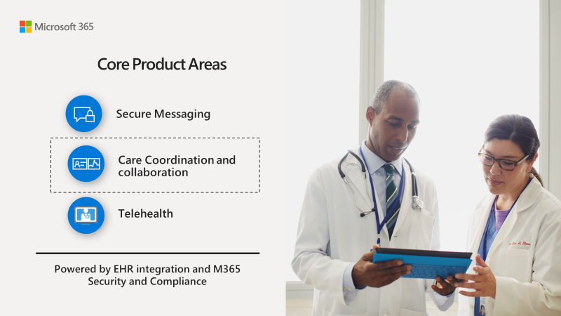

# Guida introduttiva a Teams per le organizzazioni del settore sanitarioGet started with Teams for Healthcare organizations

Microsoft teams offre una serie di funzionalità utili per ospedali e altre organizzazioni sanitarie.Microsoft Teams offers a number of features useful for hospitals and other Healthcare organizations. Le caratteristiche dei team sono in fase di sviluppo per aiutare gli ospedali:Teams features are under development to aid hospitals with:

- Coordinamento e collaborazione per l'assistenzaCare Coordination and collaboration
- Messaggistica sicuraSecure Messaging
- TelemedicinaTelehealth
- Integrazione di EHR (Electronic Healthcare record)Electronic Healthcare Record (EHR) integration 
- Integrazione di i FIRSTLINE Worker SystemFirstline Worker system integration 

Il contenuto di questa sezione si basa sulle funzionalità fondamentali dei team, ad esempio riunioni, chiamate e messaggistica, e presuppone che siano già stati distribuiti team nell'organizzazione.The content in this section builds on the foundational capabilities of Teams, such as meetings, calling, and messaging, and assumes that you've already deployed Teams in your organization. Se non sono stati ancora distribuiti team, iniziare a leggere [come implementare Microsoft teams](../../How-to-roll-out-teams.md).If you haven't yet rolled out Teams, start by reading [How to roll out Microsoft Teams](../../How-to-roll-out-teams.md).

## Coordinamento delle cure-app Microsoft teams patientsCare Coordination - Microsoft Teams Patients app

> [!IMPORTANT]
> **Efficace il 30 ottobre 2020 l'app patients sarà deprecata e gli utenti non potranno più installarla dall'app teams Store. Ti invitiamo a iniziare a usare l' [app elenchi](https://support.microsoft.com/office/get-started-with-lists-in-teams-c971e46b-b36c-491b-9c35-efeddd0297db) in teams Today.****Effective  October 30, 2020, the Patients app will be deprecated and users will no longer be able to install it from the Teams app store. We encourage you to start using the [Lists app](https://support.microsoft.com/office/get-started-with-lists-in-teams-c971e46b-b36c-491b-9c35-efeddd0297db) in Teams today.**
>
>I dati dell'app patients sono archiviati nella cassetta postale del gruppo del gruppo Office 365 che appoggia il team.Patients app data is stored in the group mailbox of the Office 365 group that backs the team. Quando l'app patients viene ritirata, tutti i dati associati verranno mantenuti in questo gruppo, ma non sarà più possibile accedervi tramite l'interfaccia utente.When the Patients app is retired, all data associated with it will be retained in this group but can no longer be accessed through the user interface. Gli utenti correnti possono ricreare gli elenchi usando l' [app elenchi](https://support.microsoft.com/office/get-started-with-lists-in-teams-c971e46b-b36c-491b-9c35-efeddd0297db).Current users can re-create their lists using the [Lists app](https://support.microsoft.com/office/get-started-with-lists-in-teams-c971e46b-b36c-491b-9c35-efeddd0297db).
>
>L' [app elenchi](https://support.microsoft.com/office/get-started-with-lists-in-teams-c971e46b-b36c-491b-9c35-efeddd0297db) è preinstallata per tutti gli utenti di teams ed è disponibile come scheda in ogni team e canale.The [Lists app](https://support.microsoft.com/office/get-started-with-lists-in-teams-c971e46b-b36c-491b-9c35-efeddd0297db) is pre-installed for all Teams users and is available as a tab in every team and channel. Con gli elenchi, i team di assistenza possono creare elenchi di pazienti usando il modello di pazienti incorporati, da zero o importando dati in Excel.With Lists, care teams can create patient lists using the built-in Patients template, from scratch, or by importing data to Excel. Per ulteriori informazioni su come gestire l'app elenchi nell'organizzazione, vedere [gestire l'app elenchi](../../manage-lists-app.md).To learn more about how to manage the Lists app in your organization, see [Manage the Lists app](../../manage-lists-app.md).

[!INCLUDE [preview-feature](../../includes/preview-feature.md)]

Microsoft Teams ha ora una soluzione di coordinamento delle cure specifiche per le organizzazioni sanitarie per aiutarli a fornire la migliore assistenza per i pazienti.Microsoft Teams now has a care coordination solution specific to healthcare organizations to help them provide the best patient care. Il nocciolo della soluzione di coordinamento delle cure, l'app Microsoft teams patients, è un'app per la scheda First party che si integra con i sistemi Electronic Health record (EHR) che usano un'interfaccia[FHIR](https://www.hl7.org/fhir/)(Fast Healthcare Resources) per fornire preziose informazioni mediche in Microsoft teams in contesto per consentire la collaborazione e la comunicazione clinica.The crux of the care coordination solution, the  Microsoft Teams Patients app, is a first party tab app that integrates with electronic health record (EHR) systems using a Fast Healthcare Interoperability Resources ([FHIR](https://www.hl7.org/fhir/)) interface to bring valuable medical information into Microsoft Teams in context to enable clinical collaboration and communication.  

La soluzione di coordinamento delle cure può interfacciarsi con fornitori di software indipendenti leader (ISV) che possono connettere l'app patients ai sistemi EHR usando standard di dati sanitari esistenti come HL7v2 e FHIR.The care coordination solution can interface with leading Independent Software Vendors (ISVs) that can connect the Patients app to your EHR systems using existing health data standards like HL7v2 and FHIR. Partner Microsoft con i seguenti leader del settore per stabilire l'integrazione elettronica dei record sanitari con i team:Microsoft partners with the following industry leaders to establish electronic health record integration with Teams:

- Datica (tramite l'offerta [CMI](https://datica.com/compliant-managed-integration/) )Datica (through their [CMI](https://datica.com/compliant-managed-integration/) offering)
- Infor Cloverleaf (tramite il [Bridge infor FHIR](https://pages.infor.com/hcl-infor-fhir-bridge-brochure.html))Infor Cloverleaf (through the [Infor FHIR Bridge](https://pages.infor.com/hcl-infor-fhir-bridge-brochure.html))
- Redox (tramite il [Server R ^ FHIR](https://www.redoxengine.com/fhir/))Redox (through the [R^FHIR server](https://www.redoxengine.com/fhir/))
- Dapasoft (tramite [corolar in FHIR](https://www.dapasoft.com/corolar-fhir-server-for-microsoft-teams/))Dapasoft (through [Corolar on FHIR](https://www.dapasoft.com/corolar-fhir-server-for-microsoft-teams/))

Un partner di integrazione e interoperabilità di EHR che prova ad implementare Microsoft teams per un'organizzazione di provider di servizi sanitari deve garantire all'app patients una connessione sicura e autenticata con i sistemi di EHR dell'organizzazione del provider di servizi sanitari.An EHR integration and interop partner trying to implement Microsoft Teams for a healthcare provider organization needs to provide the Patients app a secure and authenticated connection with the healthcare provider organization's EHR systems. In questo modo, il flusso unidirezionale (di sola lettura) dei record paziente rilevanti viene attivato nell'app patients.This enables the one-directional (Read only) flow of the relevant patient records into to the Patients app. L'app patients comprende il formato FHIR, in modo che il partner sia anche responsabile della trasformazione dei dati aggregati da vari altri formati come HL7v2 e così via in FHIR DSTU2 o STU3.The Patients app understands the FHIR format, so the partner is also responsible for transforming the aggregated data from various other formats like HL7v2, etc. into FHIR DSTU2 or STU3.

 

 

L'app patients si integra con i sistemi Electronic Health Records (EHR) e consente ai provider di assistenza di comunicare informazioni sulle cure dei pazienti in tempo reale all'interno della piattaforma sicura di teams.The Patients app integrates with electronic health records (EHR) systems and enables care providers to communicate about patient care in real-time within Teams' secure platform. L'app pazienti è il primo investimento importante nell'area di coordinamento delle cure che mira ad affrontare le sfide seguenti:The Patients app is the first major investment in the care coordination area which aims to address the following challenges:

- Scarsa efficienza nelle consegne e comunicazioni critiche attraverso l'esperienza del pazienteLow efficiency in hand-offs and critical communication through the patient experience
- Informazioni silos che creano oneri amministrativiSiloed information that creates administrative burdens
- Insoddisfazione tra i clinici con strumenti di collaborazione complessi e frammentatiDissatisfaction among clinicians with complex and fragmented collaboration tools
- Coordinamento delle cure in-persona inefficiente che può bruciare troppo tempo clinico molto costosoInefficient in-person care coordination that can burn too much expensive clinical time

Microsoft teams consente a medici, clinici, infermieri e altri membri del personale di collaborare in modo efficiente:Microsoft Teams enables physicians, clinicians, nurses, and other staff to collaborate efficiently by:

- Partecipare a un singolo team virtualizzato che lavora e collabora ai documenti di OfficeBeing part of a single virtualized team that works and collaborates on Office documents
- Avere conversazioni persistenti su pazienti diversi che richiedono attenzioneHaving persistent conversations about different patients needing attention
- Usare i canali con le schede per strutturare il proprio lavoro, con ulteriori informazioni sulle schede a cui possono aggiungere le origini datiUsing channels with tabs as a way to structure their work, with additional help from tabs to which they can pin information sources
- Uso delle riunioni di canale con la potenza dei team audio, video, condivisione dello schermo, registrazione e funzionalità di trascrizione per gestire le riunioni quotidianeUsing channel meetings with the power of Teams audio, video, screen sharing, recording, and transcription features to manage daily meetings
- Usando l'app pazienti per curare un elenco di pazienti ad alto rischio che devono essere controllati e i loro dettagli più recenti dal sistema EHR.Using the Patients app to curate a list of high-risk patients that must be monitored, and pulls their latest details from the EHR system. L'app patients stessa aggiunge le caratteristiche seguenti a Microsoft teams:The Patients app itself adds the following features to Microsoft Teams:

    - Possibilità di creare più elenchi di pazienti all'interno di un singolo canale.Ability to create multiple patient lists within a single channel.
    - Possibilità di visualizzare e ordinare le informazioni visualizzate sui pazienti tramite colonne configurabili.Ability to view and sort information displayed about patients through configurable columns.
    - Possibilità di eseguire il provisioning automatico dell'app tramite un modello di team.Ability to auto-provision the app through a team template.
    - Disponibile nell'app teams per iOS e Android per i primi operatori sanitari per dispositivi mobili, oltre a Microsoft teams Web e desktop client.Available on the Teams App for iOS and Android for mobile first healthcare workers as well as Microsoft Teams web and desktop client.
    - Supporto per le versioni di FHIR DSTU2 e STU3 tramite l'analisi dell'istruzione di conformità.Support for FHIR DSTU2 and STU3 versions via parsing of conformance statement.
    - Registri di controllo per tutte le azioni di visualizzazione e ricerca nell'interfaccia utente per salvaguardare le linee guida di PHI per HIPAA.Audit Logs for all view and search actions on its user interface to safeguard PHI per HIPAA guidelines.

L'app pazienti si basa sulla piattaforma di estensibilità teams e sfrutta il framework delle schede per visualizzare il contenuto del paziente avanzato all'interno di un canale.The Patients app is built on the Teams extensibility platform and takes advantage of the Tabs framework to display rich patient content within a channel. Per altre informazioni sulle app di altri team e sulla piattaforma stessa, vedere [app per Microsoft teams](/microsoftteams/platform/concepts/apps/apps-overview).To learn more about other Teams apps and the platform itself, please see [Apps for Microsoft Teams](/microsoftteams/platform/concepts/apps/apps-overview).  

> [!NOTE]
> L'app patients è in anteprima privata e l'interfaccia FHIR è in versione beta.The Patients app is in private preview and the FHIR interface is in beta. Le versioni rilasciate non dovrebbero essere compatibili con la versione precedente.Released versions are not expected to be backward compatible.

Vedere [integrazione di record sanitari elettronici in Microsoft teams](patients-app.md) per dettagli sull'implementazione.See [Integrating Electronic Healthcare Records into Microsoft Teams](patients-app.md) for implementation details,.

## Modelli di TeamsTeams templates

I nuovi modelli per la creazione di team sono stati sviluppati per applicarsi a un ambiente ospedaliero e più presto sono attesi.New templates for creating Teams were developed to apply to a Hospital setting, and more are expected soon. In questo modo è più semplice creare team che gli operatori sanitari usano per coordinare le cure per i pazienti in diversi reparti o corsi.This makes it easier to create teams that Healthcare workers use to coordinate care for patients in various departments or wards. Vedere [Introduzione ai modelli di team per le organizzazioni sanitarie](healthcare-templates.md).See [Get started with Teams templates for Healthcare organizations](healthcare-templates.md). I team possono essere avviati per i reparti interni, ad esempio cardiologia o per i corsi di assistenza, e altri modelli sono in sviluppo.Teams can be started for internal departments such as cardiology, or for care wards, and more templates are in development.

## App elenchiLists app

[!INCLUDE [preview-feature](../../includes/preview-feature.md)]

L'app elenchi in teams aiuta i team a tenere traccia delle informazioni e organizzare il lavoro.The Lists app in Teams helps teams track information and organize work. L'app è preinstallata per tutti gli utenti di teams ed è disponibile come scheda in ogni team e canale.The app is pre-installed for all Teams users and is available as a tab in every team and channel. Gli elenchi possono essere creati da zero, da modelli predefiniti o dall'importazione di dati in Excel.Lists can be created from scratch, from predefined templates, or by importing data to Excel.

I team di assistenza possono usare il modello patients per iniziare.Care teams can use the Patients template to get started. Possono creare elenchi per tenere traccia delle esigenze e dello stato dei pazienti.They can create lists to track the needs and status of patients. I dati dei pazienti esistenti nei fogli di calcolo di Excel possono essere introdotti per creare un elenco in teams.Existing patient data on Excel spreadsheets can be brought in to create a list in Teams. Questi elenchi possono essere usati per scenari come i turni e il monitoraggio dei pazienti per coordinare le cure.These lists can be used for scenarios such as rounds and patient monitoring to coordinate care.

Ad esempio, un'infermiera della carica crea un elenco di pazienti in un team che include tutti i membri del team di assistenza.For example, a charge nurse creates a patient list in a team that includes all care team members. Durante i turni, il team di servizi di assistenza accede ai propri dispositivi mobili e aggiorna le informazioni sul paziente nell'elenco, che tutti i membri del team possono visualizzare per rimanere sincronizzati. Durante le sessioni di arrotondamento in cui il team di assistenza si riunisce per discutere e valutare le metriche sulle prestazioni chiave per garantire che un paziente sia sul giusto percorso di scorrimento per il discarico, può condividere queste informazioni usando teams su uno schermo di grandi dimensioni.During rounds, the care team access Teams on their mobile devices and update patient information in the list, which everyone on the team can view to stay in sync. At rounding sessions where the care team gathers to discuss and evaluate key health performance metrics to ensure a patient is on the right glide path to discharge, they can share this information using Teams on a large display screen. I membri del team di assistenza che non sono presenti nel sito possono partecipare in remoto.Care team members who aren't on site can join remotely.

Ecco un elenco di esempio che è stato configurato per l'arrotondamento dei pazienti.Here's an example list which was set up for patient rounding.

:::image type="content" source="../../media/lists-patients-example.png" alt-text="Screenshot dell'elenco di esempio per l'arrotondamento del paziente":::

Per altre informazioni, vedere [gestire l'app elenchi per l'organizzazione in teams](../../manage-lists-app.md).To learn more, see [Manage the Lists app for your organization in Teams](../../manage-lists-app.md).

## Messaggistica sicuraSecure Messaging

La messaggistica sicura supporta la collaborazione all'interno di team di assistenza, incluse diverse nuove caratteristiche:Secure messaging supports collaboration within care teams, including several new features:

- Un mittente del messaggio può impostare una priorità speciale per il messaggio, in modo che il destinatario venga notificato ripetutamente fino a quando non legge il messaggio.A message sender can set a special priority for their message, so the recipient is repeatedly notified until they read the message.
- Un mittente del messaggio può richiedere una conferma di lettura, in modo che venga notificato quando un messaggio inviato è stato letto dal destinatario del messaggio.A message sender can request a read receipt, so they are notified when a message they sent was read by the message recipient.

Insieme, queste funzionalità permettono una maggiore attenzione ai messaggi urgenti e alla fiducia che il messaggio è stato ricevuto e letto.Together, these features allow quicker attention to urgent messages and confidence that the message was received and read. I nuovi team di assistenza che usano queste funzionalità possono essere creati per ogni singolo paziente.New care teams using these features can be created on a per-patient basis. Queste caratteristiche sono basate su criteri e possono essere assegnate a singoli o a Team interi.These features are policy-based, and can be assigned to individuals or entire Teams.

Per ulteriori informazioni, vedere [Introduzione ai criteri di messaggistica sicura per le organizzazioni sanitarie](messaging-policies-hc.md) .See [Get started with Secure Messaging policies for Healthcare organizations](messaging-policies-hc.md) for further details.

Anche correlato alla messaggistica sicura è la possibilità di avere altri tenant federati da organizzazioni sanitarie, consentendo una comunicazione intertenant più ricca.Also related to secure messaging is the ability to have other tenants federated by Healthcare organizations, allowing richer inter-tenant communication. Vedere [gestire l'accesso esterno (Federazione) in Microsoft teams](../../manage-external-access.md).(See [Manage external access (federation) in Microsoft Teams](../../manage-external-access.md)).

## Integrazione di i FIRSTLINE WorkerFirstline Worker integration

Microsoft teams si integra con I FIRSTLINE Worker, che può essere usato per coordinare le caratteristiche di personale di spostamento e altro ancora.Microsoft Teams integrates with Firstline Worker, which can be used to coordinate shift staffing features and more. Vedere [gestire l'app turni per l'organizzazione in Microsoft teams](../shifts/manage-the-shifts-app-for-your-organization-in-teams.md).See [Manage the Shifts app for your organization in Microsoft Teams](../shifts/manage-the-shifts-app-for-your-organization-in-teams.md).
