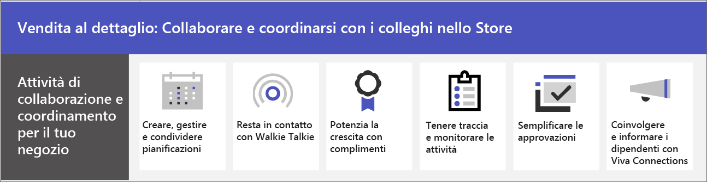

# Collaborazione del team di vendita al dettaglio

Unisci management e collaboratori in negozio per comunicare, collaborare e semplificare le operazioni con Microsoft Teams. Aiuta i tuoi collaboratori a [connettersi all'organizzazione con Viva Connections](#connect-information-from-across-the-organization-with-viva-connections) e abilita le comunicazioni tra negozi e con la sede centrale grazie alle [community Yammer](#connect-across-your-organization-with-yammer-and-teams).

> [!VIDEO https://www.microsoft.com/videoplayer/embed/RWRJVw]

> [!NOTE]
> Questi scenari fanno inoltre parte di Microsoft Cloud per la vendita al dettaglio. È possibile fare di più con questi scenari quando si usano anche altre funzionalità di Microsoft Cloud per la vendita al dettaglio, ad esempio Microsoft Dynamics 365. Puoi trovare altre informazioni sull'uso di questa soluzione, che riunisce le funzionalità di Azure, Dynamics 365 e Microsoft 365 su [Microsoft Cloud per la vendita al dettaglio](/industry/retail).

## Comunicazioni quotidiane e collaborazione in Teams

Microsoft Teams consente ad addetti alle vendite in negozio, manager e altro personale di collaborare in modo efficiente con le funzionalità e le app di collaborazione incluse. Gli operatori in prima linea possono utilizzare Teams su dispositivi personali o condivisi a seconda delle esigenze dell'organizzazione.

Teams include i modi seguenti per comunicare e condividere informazioni:

| Attività | Descrizione | Gestire questa funzionalità | Formazione per gli utenti finali |
| ---- | ---- | ---- | ---- |
| Chatta, pubblica messaggi e comunica. | I tuoi collaboratori nell’ambito dello store possono comunicare facilmente tra i vari reparti per soddisfare gli ordini, ottenere assistenza per i clienti e gestire le esigenze di magazzino.   Teams offre un'esperienza di collaborazione predefinita che la maggior parte delle organizzazioni trova perfetta per le proprie esigenze. | [Chat, team, canali e app in Microsoft Teams](../deploy-chat-teams-channels-microsoft-teams-landing-page.md) | [Avviare chat e](https://support.microsoft.com/office/start-and-pin-chats-a864b052-5e4b-4ccf-b046-2e26f40e21b5) [usare post e messaggi](https://support.microsoft.com/office/create-and-format-a-post-e66777da-636b-49eb-9408-b0d88b212885) |
|Chiamare e incontrare i membri del team | I manager possono configurare singole riunioni o usare le riunioni del canale per gestire le riunioni quotidiane, grazie alle grandi potenzialità delle funzionalità audio, video, di condivisione dello schermo, registrazione e trascrizione di Teams. Ad esempio, un manager potrebbe configurare una riunione video mattutina con i dipendenti di diversi reparti per verificarne lo stato prima di aprire lo store.   È necessario configurare le impostazioni per le riunioni e le conferenze e abilitare una soluzione Voce per l'uso delle chiamate. | [Riunioni e conferenze in Microsoft Teams](../deploy-meetings-microsoft-teams-landing-page.md) e [pianificare la soluzione voce Teams](../cloud-voice-landing-page.md) | [Effettuare chiamate](https://support.microsoft.com/office/overview-of-teams-calls-425d6970-6e27-47b6-bc61-4c38fff51c4f) e [partecipare a una riunione](https://support.microsoft.com/office/join-a-teams-meeting-078e9868-f1aa-4414-8bb9-ee88e9236ee4) |
|Archiviare e condividere i file e documenti. | La condivisione di file consente al personale dello store di accedere facilmente a informazioni come i diagrammi di merchandising senza dover uscire dal reparto vendite od ottenere assistenza da un responsabile. Ogni team include automaticamente una scheda File che è possibile usare per archiviare e condividere documenti. Questa scheda rappresenta in realtà una cartella all'interno della raccolta documenti predefinita del sito del team SharePoint che viene creata automaticamente al momento della creazione del team. | [Come SharePoint e OneDrive interagiscono con Microsoft Teams](../sharepoint-onedrive-interact.md) | [Caricare e condividere file](https://support.microsoft.com/office/upload-and-share-files-57b669db-678e-424e-b0a0-15d19215cb12) |

Il team può usare le app in Teams per coordinarsi e collaborare tra loro sulle attività quotidiane, ad esempio:

| Attività | App | Descrizione | Gestione di questa app | Formazione per gli utenti finali |
| ---- | ---- | ---- | ---- | ---- |
| Creare, gestire e condividere pianificazioni| Turni | Usare Turni per gestire e condividere facilmente le pianificazioni. I manager possono creare gruppi personalizzati, ad esempio cassieri o greeter, assegnare turni ai dipendenti, aggiungere etichette e pause personalizzate e aggiungere turni aperti che i dipendenti possono richiedere. I dipendenti possono usare Turni per impostare la disponibilità, visualizzare le pianificazioni, scambiare i turni con i colleghi e accedere e uscire. | [Gestire i turni](/microsoftteams/expand-teams-across-your-org/shifts/manage-the-shifts-app-for-your-organization-in-teams)|[Video do formazione su Turni](https://support.microsoft.com/office/what-is-shifts-f8efe6e4-ddb3-4d23-b81b-bb812296b821)|
| Resta in contatto | Walkie-talkie | L'app Walkie-talkie fornisce comunicazioni push-to-talk istantanee. Usando Walkie-talkie, dipendenti e manager possono comunicare da ovunque nel negozio. Ad esempio, se un cliente su un lato dello store chiede a un dipendente se un articolo è in magazzino sull'altro lato del negozio, il dipendente può usare Walkie-talkie per contattare qualcuno che lavora vicino all'articolo. Poiché Walkie-talkie non ha una portata di comunicazione limitata, i dipendenti possono anche consultare facilmente esperti di altri negozi o uffici aziendali. | [Gestione di Walkie-talkie](../walkie-talkie.md)  | [Video di formazione su Walkie-talkie](https://support.microsoft.com/office/use-walkie-talkie-in-teams-884a008a-761e-4b62-99f8-15671d9a2f69) |
| Supportare il morale | Complimento | L'app Complimenti consente ai membri della direzione e ai dipendenti dei punti vendita di congratularsi tra loro e condividere apprezzamento inviando badge. Complimento aiuta i dipendenti a sentirsi riconosciuti per i risultati raggiunti, ad esempio per realizzare obiettivi di vendita e andare oltre per aiutare i clienti. | [Gestire l'app Complimento](../manage-praise-app.md) |[Video di formazione su Complimento](https://support.microsoft.com/office/communication-and-praise-7d37ef80-542b-42e5-aa01-0fabbaa634b6) |
| Tenere traccia e monitorare le attività | Attività | Usare Attività in Teams per tenere traccia delle attività da svolgere per l'intero team di vendita al dettaglio. I manager dello store e i dipendenti possono creare, assegnare e pianificare attività, categorizzare le attività e aggiornare lo stato in qualsiasi momento da qualsiasi dispositivo che esegue Teams. I professionisti e gli amministratori IT possono anche pubblicare attività in team specifici per l'organizzazione. Ad esempio, è possibile pubblicare un set di attività per la pulizia quotidiana o i passaggi per configurare una nuova visualizzazione.| [Gestire l'app Attività](/microsoftteams/manage-tasks-app) |[Video di formazione su Attività](https://support.microsoft.com/office/use-the-tasks-app-in-teams-e32639f3-2e07-4b62-9a8c-fd706c12c070) |
| Semplificare le approvazioni | Approvazioni | Usare Approvazioni per semplificare le richieste e i processi con il team. Crea, gestisci e condividi le approvazioni direttamente dal tuo hub per il lavoro di squadra. Avvia un flusso di approvazione dallo stesso punto in cui invii una chat, in una conversazione del canale o dall'app Approvazioni stessa. Basta selezionare un tipo di approvazione, aggiungere dettagli, allegare file e scegliere gli approvatori. Una volta inviata, gli approvatori ricevono una notifica e possono verificare e agire in base alla richiesta. È possibile consentire l’app Approvazioni per l'organizzazione e aggiungerla a Teams. | [Disponibilità dell'app Approvazioni in Teams](/microsoftteams/approval-admin) | [Video di formazione su Approvazioni](https://support.microsoft.com/office/what-is-approvals-a9a01c95-e0bf-4d20-9ada-f7be3fc283d3?wt.mc_id=otc_microsoft_teams)|

### Configurare team, canali e app

Quando sei pronto a connettere i dipendenti dei punti vendita in Teams, puoi configurare team e canali per i team e i responsabili dello store con modelli predefiniti o personalizzati. Il modo più semplice è iniziare con un modello. I modelli **Organizza uno store** e **Vendita al dettaglio** [per i manager](/microsoftteams/get-started-with-retail-teams-templates) sono modelli predefiniti che includono canali e app progettate per la vendita al dettaglio. È inoltre possibile creare un modello basato su un team esistente. Anche quando si inizia con un modello, è possibile personalizzare il team e i canali e aggiungere altre app in base alle esigenze del team.

- Usa i canali con le schede per condividere notizie, tenere i dipendenti in contatto durante i turni e creare una vera e propria community.
- Usa i modelli di team per configurare team con strutture simili (ad esempio canali e schede) in store o aree geografiche diversi.

#### Crea un team basato su un modello

1. In Microsoft Teams, seleziona **Partecipa o crea un team**.

2. Seleziona **Crea un team** e quindi scorri verso il basso per visualizzare i modelli disponibili.

Altre informazioni: [Creare un team con i modelli](https://support.microsoft.com/office/create-a-team-with-team-templates-702a2977-e662-4038-bef5-bdf8ee47b17b)

### Gestione delle app

Perfeziona gli elementi del team con le app. È possibile consentire o bloccare le app per l'organizzazione o configurare le impostazioni per le app nell'interfaccia di amministrazione di Microsoft Teams. Per altre informazioni sulla gestione delle app, vedi [Gestire le app nell'interfaccia di amministrazione di Microsoft Teams](../manage-apps.md).

Gli utenti possono aggiungere qualsiasi app consentita ai loro team. Condividi questa formazione con gli utenti per mostrare loro come: [Trovare e usare le app](https://support.microsoft.com/office/find-and-use-apps-6e22a734-c002-4da0-ba63-681f155b142d).

## Connettere informazioni da tutta l'organizzazione con Viva Connections

Coinvolgere e informare i dipendenti con Viva Connections. Viva Connections crea un hub in Teams in cui i tuoi collaboratori possono visualizzare un newsfeed personalizzato dell'organizzazione e un dashboard personalizzato con le risorse di cui hanno bisogno. Quando i dipendenti usano Viva Connections, possono ottenere informazioni importanti più velocemente, il che significa che i manager non devono dedicare tempo prezioso all'inoltro degli aggiornamenti. Informazioni chiave relative a Surface, notizie personalizzate, attività, annunci e altre risorse nel dashboard Viva Connections.

Scopri di più su [Viva Connections](/sharepoint/viva-connections-overview) e aiuta i dipendenti e i collaboratori a iniziare a usare [Viva Connections in Microsoft Teams](https://support.microsoft.com/office/your-intranet-is-now-in-microsoft-teams-8b4e7f76-f305-49a9-b6d2-09378476f95b).

Con Microsoft Teams, Viva Connections e SharePoint, è possibile abilitare questi scenari:

- Onboarding di nuovi dipendenti [Apprendi come fare](/sharepoint/onboard-employees)
- Connessione dei team di leadership con gli operatori in prima linea [Apprendi come fare](/sharepoint/leadership-connection)
- Distribuzione di notizie all'organizzazione [Apprendi come fare](/sharepoint/distribute-corporate-news-to-your-organization)

[Altre informazioni su come guidare la comunicazione nell'ambito dell’organizzazione](/sharepoint/corporate-communications-overview)

## Connessione nell’ambito dell'organizzazione con Yammer e Teams

Interazione con le community in Yammer. Le community Yammer soddisfano le esigenze della condivisione delle conoscenze, dell'esperienza dei dipendenti, delle comunicazioni a livello aziendale e del coinvolgimento della leadership, fornendo una posizione centrale per le conversazioni, i file, gli eventi e gli aggiornamenti. I collaboratori possono sollevare problemi, inviare feedback e porre e rispondere a domande nelle community Yammer. Tenere eventi live e incontri per tenere sempre tutti aggiornati nell’organizzazione.

Scopri come [aggiungere una pagina Yammer a un canale Teams](https://support.microsoft.com/office/add-a-yammer-page-to-a-teams-channel-ca06ec83-f22d-4b76-83a5-c83aa2a33528) e [partecipare e creare una community in Yammer](https://support.microsoft.com/office/join-and-create-a-community-in-yammer-56aaf591-1fbc-4160-ba26-0c4723c23fd6).

Altre informazioni su Yammer:

- Per gli amministratori: [Gestire Yammer](/yammer)
- Per gli utenti: [Usare Yammer](https://support.microsoft.com/office/what-is-yammer-1b0f3b3e-89ee-4b66-aac5-30def12f287c)
