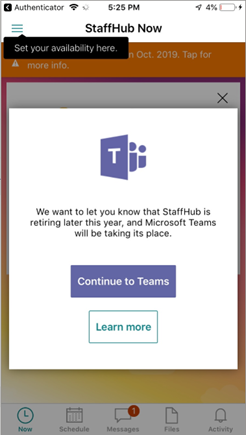

# <a name="move-your-microsoft-staffhub-teams-to-shifts-in-microsoft-teams"></a><span data-ttu-id="4d2e4-103">Spostare i team di Microsoft StaffHub in turni in Microsoft Teams</span><span class="sxs-lookup"><span data-stu-id="4d2e4-103">Move your Microsoft StaffHub teams to Shifts in Microsoft Teams</span></span>

> [!IMPORTANT]
> <span data-ttu-id="4d2e4-104">Efficace 31 dicembre 2019, Microsoft StaffHub sarà ritirato.</span><span class="sxs-lookup"><span data-stu-id="4d2e4-104">Effective December 31, 2019, Microsoft StaffHub will be retired.</span></span> <span data-ttu-id="4d2e4-105">Stiamo costruendo funzionalità di StaffHub in Microsoft teams.</span><span class="sxs-lookup"><span data-stu-id="4d2e4-105">We’re building StaffHub capabilities into Microsoft Teams.</span></span> <span data-ttu-id="4d2e4-106">Oggi teams include l'app turni per la gestione della pianificazione e le funzionalità aggiuntive verranno distribuite nel tempo.</span><span class="sxs-lookup"><span data-stu-id="4d2e4-106">Today, Teams includes the Shifts app for schedule management and additional capabilities will roll out over time.</span></span> <span data-ttu-id="4d2e4-107">StaffHub smetterà di funzionare per tutti gli utenti il 31 dicembre 2019.</span><span class="sxs-lookup"><span data-stu-id="4d2e4-107">StaffHub will stop working for all users on December 31, 2019.</span></span> <span data-ttu-id="4d2e4-108">Chiunque tenti di aprire StaffHub verrà visualizzato un messaggio che li indirizza a scaricare teams.</span><span class="sxs-lookup"><span data-stu-id="4d2e4-108">Anyone who tries to open StaffHub will be shown a message directing them to download Teams.</span></span> <span data-ttu-id="4d2e4-109">Per altre informazioni, vedere [Microsoft StaffHub per ritirarsi](microsoft-staffhub-to-be-retired.md).</span><span class="sxs-lookup"><span data-stu-id="4d2e4-109">To learn more, see [Microsoft StaffHub to be retired](microsoft-staffhub-to-be-retired.md).</span></span>

<span data-ttu-id="4d2e4-110">L'app turni in teams offre un approccio semplice per gestire le pianificazioni e il flusso costante di scambi di turni e di annullamenti che si verificano giornalmente.</span><span class="sxs-lookup"><span data-stu-id="4d2e4-110">The Shifts app in Teams provides a simple approach to managing schedules and the constant flow of shift swaps and cancellations that occur on a daily basis.</span></span> <span data-ttu-id="4d2e4-111">I membri del team possono accedere alle informazioni di programmazione e spostamento direttamente nell'app e in tutti i loro dispositivi per impostare le preferenze, gestire le pianificazioni e richiedere il tempo libero.</span><span class="sxs-lookup"><span data-stu-id="4d2e4-111">Team members can access their schedule and shift information directly in the app and across their devices to set their preferences, manage their schedules, and request time off.</span></span>

<span data-ttu-id="4d2e4-112">Questo articolo illustra come spostare i team di StaffHub dell'organizzazione e pianificare i dati in turni in teams.</span><span class="sxs-lookup"><span data-stu-id="4d2e4-112">This article walks you through how to move your organization’s StaffHub teams and schedule data to Shifts in Teams.</span></span> <span data-ttu-id="4d2e4-113">Copre:</span><span class="sxs-lookup"><span data-stu-id="4d2e4-113">It covers:</span></span>

- [<span data-ttu-id="4d2e4-114">Informazioni utili sul passaggio a teams</span><span class="sxs-lookup"><span data-stu-id="4d2e4-114">What you need to know about the move to Teams</span></span>](#what-you-need-to-know-about-the-move-to-teams)
- [<span data-ttu-id="4d2e4-115">Preparare</span><span class="sxs-lookup"><span data-stu-id="4d2e4-115">Prepare</span></span>](#prepare)
- [<span data-ttu-id="4d2e4-116">Eseguire un progetto pilota</span><span class="sxs-lookup"><span data-stu-id="4d2e4-116">Conduct a pilot</span></span>](#conduct-a-pilot) 
- [<span data-ttu-id="4d2e4-117">Andare oltre il pilota e trasferire tutti i team di StaffHub</span><span class="sxs-lookup"><span data-stu-id="4d2e4-117">Go beyond your pilot and move all StaffHub teams</span></span>](#go-beyond-your-pilot-and-move-all-staffhub-teams)
- [<span data-ttu-id="4d2e4-118">Monitorare l'utilizzo di Teams</span><span class="sxs-lookup"><span data-stu-id="4d2e4-118">Monitor Teams usage</span></span>](#monitor-teams-usage)
- [<span data-ttu-id="4d2e4-119">Risoluzione dei problemi</span><span class="sxs-lookup"><span data-stu-id="4d2e4-119">Troubleshooting</span></span>](#troubleshooting)

<span data-ttu-id="4d2e4-120">Sia che si tratti di una piccola azienda con uno o due team di StaffHub o di una grande azienda con centinaia di team di StaffHub, qui sono disponibili le indicazioni per l'amministratore necessarie per facilitare la transizione ai team.</span><span class="sxs-lookup"><span data-stu-id="4d2e4-120">Whether you’re a small business with one or two StaffHub teams or a large enterprise with hundreds of StaffHub teams, here you’ll find the admin guidance you need to help make your transition to Teams successful.</span></span>

<span data-ttu-id="4d2e4-121">Per eseguire i passaggi di questo articolo, è necessario essere un amministratore globale.</span><span class="sxs-lookup"><span data-stu-id="4d2e4-121">You must be a global admin to perform the steps in this article.</span></span> <span data-ttu-id="4d2e4-122">Se non lo si è già fatto, vedere le domande [frequenti sulla pensione StaffHub](microsoft-staffhub-to-be-retired.md) per ottenere le risposte a qualsiasi domanda possiate avere.</span><span class="sxs-lookup"><span data-stu-id="4d2e4-122">If you haven't already done so, have a look through the [StaffHub retirement FAQ](microsoft-staffhub-to-be-retired.md) to get answers to any questions you may have.</span></span>

## <a name="what-you-need-to-know-about-the-move-to-teams"></a><span data-ttu-id="4d2e4-123">Informazioni utili sul passaggio a teams</span><span class="sxs-lookup"><span data-stu-id="4d2e4-123">What you need to know about the move to Teams</span></span>

### <a name="when-to-move-to-teams"></a><span data-ttu-id="4d2e4-124">Quando si passa a teams</span><span class="sxs-lookup"><span data-stu-id="4d2e4-124">When to move to Teams</span></span>

<span data-ttu-id="4d2e4-125">Efficace il 31 dicembre 2019 StaffHub sarà ritirato.</span><span class="sxs-lookup"><span data-stu-id="4d2e4-125">Effective December 31, 2019, StaffHub will be retired.</span></span> <span data-ttu-id="4d2e4-126">Ti invitiamo a iniziare a usare teams oggi e iniziare a eseguire la transizione di team e utenti dell'organizzazione da StaffHub.</span><span class="sxs-lookup"><span data-stu-id="4d2e4-126">We encourage you to start using Teams today and begin to transition your organization's teams and users from StaffHub.</span></span> <span data-ttu-id="4d2e4-127">La gestione della pianificazione è la caratteristica più usata in StaffHub, ti consigliamo di usare l'app turni in teams Moving Forward.</span><span class="sxs-lookup"><span data-stu-id="4d2e4-127">With schedule management being the most commonly-used feature in StaffHub, we recommend you use the Shifts app in Teams moving forward.</span></span>

### <a name="what-is-moved-to-teams"></a><span data-ttu-id="4d2e4-128">Elementi spostati in teams</span><span class="sxs-lookup"><span data-stu-id="4d2e4-128">What is moved to Teams</span></span>

<span data-ttu-id="4d2e4-129">Quando si sposta un team di StaffHub, i membri del team, i dettagli degli utenti, le pianificazioni del team e i dati della chat vengono spostati in teams.</span><span class="sxs-lookup"><span data-stu-id="4d2e4-129">When you move a StaffHub team, team membership, user details, team schedules, and chat data are moved to Teams.</span></span> <span data-ttu-id="4d2e4-130">I file non vengono spostati quando si sposta un team di StaffHub.</span><span class="sxs-lookup"><span data-stu-id="4d2e4-130">Files aren't moved when you move a StaffHub team.</span></span> <span data-ttu-id="4d2e4-131">Se un team di StaffHub contiene file che si vuole anche trasferire in teams, è possibile trasferire i file in un passaggio separato.</span><span class="sxs-lookup"><span data-stu-id="4d2e4-131">If a StaffHub team contains files that you also want to move to teams, you move the files in a separate step.</span></span>

<span data-ttu-id="4d2e4-132">Ogni team di StaffHub ha bisogno di un gruppo di Office 365 corrispondente.</span><span class="sxs-lookup"><span data-stu-id="4d2e4-132">Every StaffHub team needs a corresponding Office 365 Group.</span></span> <span data-ttu-id="4d2e4-133">Se un team di StaffHub è associato a un gruppo di Office 365, l'impostazione della privacy del gruppo viene mantenuta quando si trasferisce il team.</span><span class="sxs-lookup"><span data-stu-id="4d2e4-133">If a StaffHub team is associated with an Office 365 Group, the privacy setting of the group is retained when you move the team.</span></span> <span data-ttu-id="4d2e4-134">Se a un team di StaffHub non è associato un gruppo di Office 365, viene automaticamente creato un gruppo con l'impostazione di privacy private per supportare la transizione.</span><span class="sxs-lookup"><span data-stu-id="4d2e4-134">If a StaffHub team doesn't have an Office 365 Group associated with it, a group with a privacy setting of Private is automatically created for you to support the transition.</span></span>  <span data-ttu-id="4d2e4-135">Considerata la differenza tra team e nomi di gruppo tra team e StaffHub, è possibile che venga visualizzato un nome di team diverso in teams.</span><span class="sxs-lookup"><span data-stu-id="4d2e4-135">Given the difference in team and group naming between Teams and StaffHub, you may see a different team name in Teams.</span></span> 

<span data-ttu-id="4d2e4-136">Durante la transizione da Teams da StaffHub a teams, gli utenti non avranno più accesso alle loro pianificazioni in StaffHub e verranno reindirizzati ai turni in teams.</span><span class="sxs-lookup"><span data-stu-id="4d2e4-136">As you transition teams from StaffHub to Teams, users will no longer have access to their schedules in StaffHub and are redirected to Shifts in Teams.</span></span> <span data-ttu-id="4d2e4-137">È consigliabile comunicare questo cambiamento nell'organizzazione per ridurre al minimo le interruzioni e incoraggiare gli utenti ad adottare ed esplorare team.</span><span class="sxs-lookup"><span data-stu-id="4d2e4-137">We recommend you communicate this change across your organization to minimize disruption and to encourage users to adopt and explore Teams.</span></span> <span data-ttu-id="4d2e4-138">Se si dispone di Azure AD Premium, è possibile [eseguire un report](run-report-to-show-staffhub-usage.md) per ottenere un elenco di utenti di StaffHub nell'organizzazione che devono conoscere la modifica.</span><span class="sxs-lookup"><span data-stu-id="4d2e4-138">If you have Azure AD Premium, you can [run a report](run-report-to-show-staffhub-usage.md) to get a list of StaffHub users in your organization who need to know about this change.</span></span>  

<span data-ttu-id="4d2e4-139">Non è possibile eseguire l'opzione rollback dopo avere spostato un team di StaffHub in teams.</span><span class="sxs-lookup"><span data-stu-id="4d2e4-139">There's no rollback option after you move a StaffHub team to Teams.</span></span>

### <a name="user-experience-when-you-move-a-team"></a><span data-ttu-id="4d2e4-140">Esperienza utente quando si trasferisce un team</span><span class="sxs-lookup"><span data-stu-id="4d2e4-140">User experience when you move a team</span></span>

<span data-ttu-id="4d2e4-141">Ci sono tempi di inattività minimi (meno di un secondo, se presenti) per gli utenti quando il loro team è passato da StaffHub a turni in teams.</span><span class="sxs-lookup"><span data-stu-id="4d2e4-141">There's minimal downtime (less than a second, if any at all) for users when their team is switched from StaffHub to Shifts in Teams.</span></span> <span data-ttu-id="4d2e4-142">Gli utenti possono continuare a usare StaffHub fino al completamento del passaggio a teams.</span><span class="sxs-lookup"><span data-stu-id="4d2e4-142">Users can continue using StaffHub until the move to Teams is completed.</span></span> <span data-ttu-id="4d2e4-143">Al termine dello spostamento, i membri del team vedranno un messaggio per comunicare loro che devono iniziare a usare i turni in teams per accedere alla pianificazione del team.</span><span class="sxs-lookup"><span data-stu-id="4d2e4-143">When the move is completed, team members will see a message to let them know that they need to start using Shifts in Teams to access their team schedule.</span></span> <span data-ttu-id="4d2e4-144">Ecco un esempio del messaggio visualizzato dagli utenti in StaffHub dopo che il team di StaffHub è stato spostato in teams.</span><span class="sxs-lookup"><span data-stu-id="4d2e4-144">Here's an example of the message that users see in StaffHub after the StaffHub team is moved to Teams.</span></span>

<span data-ttu-id="4d2e4-145"></span><span class="sxs-lookup"><span data-stu-id="4d2e4-145"></span></span>

## <a name="prepare"></a><span data-ttu-id="4d2e4-146">Preparare</span><span class="sxs-lookup"><span data-stu-id="4d2e4-146">Prepare</span></span>

<span data-ttu-id="4d2e4-147">Ecco come prepararsi per il passaggio a teams.</span><span class="sxs-lookup"><span data-stu-id="4d2e4-147">Here's how to prepare for the move to Teams.</span></span>

### <a name="check-that-prerequisites-are-met"></a><span data-ttu-id="4d2e4-148">Verificare che i prerequisiti vengano soddisfatti</span><span class="sxs-lookup"><span data-stu-id="4d2e4-148">Check that prerequisites are met</span></span>

<span data-ttu-id="4d2e4-149">Prima di trasferire un team di StaffHub in teams, verificare che:</span><span class="sxs-lookup"><span data-stu-id="4d2e4-149">Before you move a StaffHub team to Teams, make sure that:</span></span>

- <span data-ttu-id="4d2e4-150">L'utente connesso è un amministratore globale.</span><span class="sxs-lookup"><span data-stu-id="4d2e4-150">The signed-in user is a global admin.</span></span>
- <span data-ttu-id="4d2e4-151">Teams è abilitato per tutti gli utenti del tenant.</span><span class="sxs-lookup"><span data-stu-id="4d2e4-151">Teams is enabled for all users in the tenant.</span></span>
- <span data-ttu-id="4d2e4-152">La creazione di gruppi di Office 365 è abilitata nel tenant.</span><span class="sxs-lookup"><span data-stu-id="4d2e4-152">Office 365 Groups creation is enabled in the tenant.</span></span>
- <span data-ttu-id="4d2e4-153">StaffHub teamId è valido.</span><span class="sxs-lookup"><span data-stu-id="4d2e4-153">The StaffHub teamId is valid.</span></span>
- <span data-ttu-id="4d2e4-154">Il team di StaffHub ha almeno un proprietario del team.</span><span class="sxs-lookup"><span data-stu-id="4d2e4-154">The StaffHub team has at least one team owner.</span></span>
- <span data-ttu-id="4d2e4-155">Il team di StaffHub contiene membri.</span><span class="sxs-lookup"><span data-stu-id="4d2e4-155">The StaffHub team contains members.</span></span>
- <span data-ttu-id="4d2e4-156">Tutti i membri del team di StaffHub sono collegati a un account Azure AD.</span><span class="sxs-lookup"><span data-stu-id="4d2e4-156">All StaffHub team members are linked to an Azure AD account.</span></span>
- <span data-ttu-id="4d2e4-157">A tutti i membri del team di StaffHub è assegnata una licenza teams.</span><span class="sxs-lookup"><span data-stu-id="4d2e4-157">All StaffHub team members are assigned a Teams license.</span></span>  

<span data-ttu-id="4d2e4-158">Se questi prerequisiti non sono soddisfatti, la richiesta di trasferimento avrà esito negativo.</span><span class="sxs-lookup"><span data-stu-id="4d2e4-158">If these prerequisites aren't met, the move request will fail.</span></span>

### <a name="assign-teams-licenses"></a><span data-ttu-id="4d2e4-159">Assegnare licenze di Teams</span><span class="sxs-lookup"><span data-stu-id="4d2e4-159">Assign Teams licenses</span></span>

<span data-ttu-id="4d2e4-160">Ogni utente deve avere una licenza Microsoft 365 o Office 365 attiva da [un piano idoneo](microsoft-staffhub-to-be-retired.md#which-plans-is-shifts-available-in) e deve essere assegnata una licenza di teams.</span><span class="sxs-lookup"><span data-stu-id="4d2e4-160">Each user must have an active Microsoft 365 or Office 365 license from [an eligible plan](microsoft-staffhub-to-be-retired.md#which-plans-is-shifts-available-in) and must be assigned a Teams license.</span></span> <span data-ttu-id="4d2e4-161">L'assegnazione di una licenza di teams agli utenti consente loro di accedere ai team.</span><span class="sxs-lookup"><span data-stu-id="4d2e4-161">Assigning a Teams license to users gives them access to Teams.</span></span>

<span data-ttu-id="4d2e4-162">È possibile gestire le licenze teams nell'interfaccia di amministrazione di Microsoft 365.</span><span class="sxs-lookup"><span data-stu-id="4d2e4-162">You manage Teams licenses in the Microsoft 365 admin center.</span></span> <span data-ttu-id="4d2e4-163">Per altre informazioni, vedere [gestire l'accesso degli utenti ai team](../../user-access.md).</span><span class="sxs-lookup"><span data-stu-id="4d2e4-163">To learn more, see [Manage user access to Teams](../../user-access.md).</span></span>

> [!NOTE]
> <span data-ttu-id="4d2e4-164">Se l'organizzazione usa Skype for business e non si è pronti per trasferire tutti gli utenti in teams, è possibile abilitare i team per i dipendenti di I FIRSTLINE che possono quindi eseguire teams insieme a Skype for business.</span><span class="sxs-lookup"><span data-stu-id="4d2e4-164">If your organization uses Skype for Business and you’re not ready to move all your users to Teams, you can enable Teams for your Firstline Workers who can then run Teams alongside Skype for Business.</span></span> <span data-ttu-id="4d2e4-165">In questa modalità di coesistenza, denominata *Islands*, ogni app client funziona come soluzione separata.</span><span class="sxs-lookup"><span data-stu-id="4d2e4-165">In this coexistence mode, called *Islands*, each client app operates as a separate solution.</span></span> <span data-ttu-id="4d2e4-166">Per altre informazioni, vedere [comprendere i team e la coesistenza e l'interoperabilità di Skype for business](../../teams-and-skypeforbusiness-coexistence-and-interoperability.md).</span><span class="sxs-lookup"><span data-stu-id="4d2e4-166">To learn more, see [Understand Teams and Skype for Business coexistence and interoperability](../../teams-and-skypeforbusiness-coexistence-and-interoperability.md).</span></span>

### <a name="install-the-prerelease-version-of-the-staffhub-powershell-module"></a><span data-ttu-id="4d2e4-167">Installare la versione prerelease del modulo di PowerShell StaffHub</span><span class="sxs-lookup"><span data-stu-id="4d2e4-167">Install the prerelease version of the StaffHub PowerShell module</span></span>

<span data-ttu-id="4d2e4-168">Se non è già stato installato, [installare la versione prerelease del modulo di PowerShell StaffHub](install-the-staffhub-powershell-module.md).</span><span class="sxs-lookup"><span data-stu-id="4d2e4-168">If you haven't already, [install the prerelease version of the StaffHub PowerShell module](install-the-staffhub-powershell-module.md).</span></span>

<span data-ttu-id="4d2e4-169">Per trasferire i team di StaffHub in teams, è necessario che sia installata la versione del modulo prerelease.</span><span class="sxs-lookup"><span data-stu-id="4d2e4-169">You must have the prerelease version of the module installed to move your StaffHub teams to Teams.</span></span>

### <a name="link-an-azure-ad-account-for-staffhub-team-members-who-dont-have-one"></a><span data-ttu-id="4d2e4-170">Collegare un account di Azure AD per i membri del team di StaffHub che non ne hanno uno</span><span class="sxs-lookup"><span data-stu-id="4d2e4-170">Link an Azure AD account for StaffHub team members who don't have one</span></span>

<span data-ttu-id="4d2e4-171">Ogni membro del team di StaffHub deve essere collegato a un account di Azure Active Directory (Azure AD).</span><span class="sxs-lookup"><span data-stu-id="4d2e4-171">Each StaffHub team member must be linked to an Azure Active Directory (Azure AD) account.</span></span> <span data-ttu-id="4d2e4-172">Gli utenti dell'organizzazione non saranno collegati a un account di Azure AD se si applica uno degli scenari seguenti:</span><span class="sxs-lookup"><span data-stu-id="4d2e4-172">Users in your organization won't be linked to an Azure AD account if any of the following scenarios apply:</span></span>

- <span data-ttu-id="4d2e4-173">Un proprietario del team ha aggiunto un utente che non dispone di un account Azure AD.</span><span class="sxs-lookup"><span data-stu-id="4d2e4-173">A team owner added a user who doesn't have an Azure AD account.</span></span>
- <span data-ttu-id="4d2e4-174">Un proprietario del team ha invitato un utente a un team di StaffHub e l'utente non ha accettato l'invito.</span><span class="sxs-lookup"><span data-stu-id="4d2e4-174">A team owner invited a user to a StaffHub team and that user didn't accept the invitation.</span></span>

<span data-ttu-id="4d2e4-175">Questi utenti hanno account inattivi e mostrano uno stato utente di sconosciuto, invitato o InviteRejected.</span><span class="sxs-lookup"><span data-stu-id="4d2e4-175">These users have inactive accounts and show a user state of Unknown, Invited, or InviteRejected.</span></span> <span data-ttu-id="4d2e4-176">Puoi collegare un account di Azure AD per questi utenti.</span><span class="sxs-lookup"><span data-stu-id="4d2e4-176">You can link an Azure AD account for these users.</span></span>  <span data-ttu-id="4d2e4-177">Ecco come fare.</span><span class="sxs-lookup"><span data-stu-id="4d2e4-177">Here's how.</span></span>

#### <a name="get-a-list-of-all-inactive-accounts-on-staffhub-teams"></a><span data-ttu-id="4d2e4-178">Ottenere un elenco di tutti gli account inattivi nei team di StaffHub</span><span class="sxs-lookup"><span data-stu-id="4d2e4-178">Get a list of all inactive accounts on StaffHub teams</span></span>

<span data-ttu-id="4d2e4-179">Eseguire la serie di comandi seguente per ottenere un elenco di tutti gli account inattivi nei team di StaffHub ed esportare l'elenco in un file CSV.</span><span class="sxs-lookup"><span data-stu-id="4d2e4-179">Run the following series of commands to get a list of all inactive accounts on StaffHub teams and export the list to a CSV file.</span></span> <span data-ttu-id="4d2e4-180">Ogni comando deve essere eseguito separatamente.</span><span class="sxs-lookup"><span data-stu-id="4d2e4-180">Each command should be run separately.</span></span>

```PowerShell
$InvitedUsersObject = @()

$StaffHubTeams = Get-StaffHubTeamsForTenant

$StaffHubTeams[0] = $StaffHubTeams[0] | Where-Object { $_.ManagedBy -eq 'StaffHub' }

foreach($team in $StaffHubTeams[0])
{ 
    Write-host $team.name
    $StaffHubUsers = Get-StaffHubMember -TeamId $team.Id | where {$_.State -eq "Invited"}
    foreach($StaffHubUser in $StaffHubUsers) {
        $InvitedUsersObject  += New-Object PsObject -Property @{
          "TeamID"="$($team.Id)"
          "TeamName"="$($team.name)"
          "MemberID"="$($StaffHubUser.Id)"
            }
    }
}

$InvitedUsersObject | SELECT * | export-csv InvitedUsers.csv -NoTypeInformation  
```

#### <a name="link-the-account"></a><span data-ttu-id="4d2e4-181">Collegare l'account</span><span class="sxs-lookup"><span data-stu-id="4d2e4-181">Link the account</span></span>

<span data-ttu-id="4d2e4-182">Esegui una delle operazioni seguenti:</span><span class="sxs-lookup"><span data-stu-id="4d2e4-182">Do one of the following:</span></span>

- <span data-ttu-id="4d2e4-183">Convertire e collegare l'account.</span><span class="sxs-lookup"><span data-stu-id="4d2e4-183">Convert and link the account.</span></span>

  <span data-ttu-id="4d2e4-184">I proprietari e i responsabili del team di StaffHub possono convertire un account inattivo e collegarlo a un account di Azure AD in StaffHub modificando l'indirizzo di posta elettronica dell'utente in un UPN valido nella pagina delle impostazioni del team di StaffHub.</span><span class="sxs-lookup"><span data-stu-id="4d2e4-184">StaffHub team owners and managers can convert an inactive account and link it to an Azure AD account in StaffHub by changing the user's email address to a valid UPN on the StaffHub team settings page.</span></span>

- <span data-ttu-id="4d2e4-185">Rimuovere l'account non collegato e quindi aggiungere di nuovo l'account usando l'UPN.</span><span class="sxs-lookup"><span data-stu-id="4d2e4-185">Remove the unlinked account and then re-add the account by using the UPN.</span></span>
    1. <span data-ttu-id="4d2e4-186">Eseguire il cmdlet [Remove-StaffHubMember](https://docs.microsoft.com/powershell/module/staffhub/Remove-StaffHubMember?view=staffhub-ps) per rimuovere l'account non provisioning dal team di StaffHub.</span><span class="sxs-lookup"><span data-stu-id="4d2e4-186">Run the [Remove-StaffHubMember](https://docs.microsoft.com/powershell/module/staffhub/Remove-StaffHubMember?view=staffhub-ps) cmdlet to remove the non-provisioned account from the StaffHub team.</span></span>
    2. <span data-ttu-id="4d2e4-187">Eseguire il cmdlet [Add-StaffHubMember](https://docs.microsoft.com/powershell/module/staffhub/add-staffhubmember?view=staffhub-ps) per aggiungere di nuovo l'account al team di StaffHub usando l'UPN.</span><span class="sxs-lookup"><span data-stu-id="4d2e4-187">Run the [Add-StaffHubMember](https://docs.microsoft.com/powershell/module/staffhub/add-staffhubmember?view=staffhub-ps) cmdlet to add the account back to the StaffHub team by using the UPN.</span></span>

- <span data-ttu-id="4d2e4-188">Rimuovere l'account inattivo.</span><span class="sxs-lookup"><span data-stu-id="4d2e4-188">Remove the inactive account.</span></span> <span data-ttu-id="4d2e4-189">Usare questa opzione se l'account utente non è più necessario.</span><span class="sxs-lookup"><span data-stu-id="4d2e4-189">Use this option if the user account is no longer needed.</span></span>

### <a name="assign-the-firstlineworker-app-setup-policy-to-users"></a><span data-ttu-id="4d2e4-190">Assegnare i criteri di configurazione dell'app FirstlineWorker agli utenti</span><span class="sxs-lookup"><span data-stu-id="4d2e4-190">Assign the FirstlineWorker app setup policy to users</span></span>

<span data-ttu-id="4d2e4-191">Teams include un criterio di configurazione dell'app FirstlineWorker incorporato che puoi usare per personalizzare i team per evidenziare le app più importanti per gli operatori di I FIRSTLINE dell'organizzazione.</span><span class="sxs-lookup"><span data-stu-id="4d2e4-191">Teams includes a built-in FirstlineWorker app setup policy that you can use to customize Teams to highlight the apps that are most important for the Firstline Workers in your organization.</span></span> <span data-ttu-id="4d2e4-192">Quando si assegna questo criterio agli utenti, le app del criterio vengono aggiunte alla barra dell'app in teams per un accesso rapido e semplice.</span><span class="sxs-lookup"><span data-stu-id="4d2e4-192">When you assign this policy to users, the apps in the policy are pinned to the app bar in Teams for quick and easy access.</span></span> <span data-ttu-id="4d2e4-193">Altre app aggiunte a teams possono essere trovate nella barra dell'app facendo clic su **... Altre app** nei client desktop e Web teams e scorrendo rapidamente verso l'alto nel client per dispositivi mobili teams.</span><span class="sxs-lookup"><span data-stu-id="4d2e4-193">Other apps added to Teams can be found in the app bar by clicking **... More apps** in the Teams desktop and web clients and by swiping up in the Teams mobile client.</span></span> <span data-ttu-id="4d2e4-194">Per impostazione predefinita, i criteri di configurazione dell'app FirstlineWorker includono le app attività, turni, chat e chiamate.</span><span class="sxs-lookup"><span data-stu-id="4d2e4-194">By default, the FirstlineWorker app setup policy includes the Activity, Shifts, Chat, and Calling apps.</span></span>

<span data-ttu-id="4d2e4-195">Per istruzioni su come assegnare i criteri di configurazione dell'app FirstlineWorker agli utenti, vedere [usare i criteri di configurazione dell'app FirstlineWorker per aggiungere i turni ai team](manage-the-shifts-app-for-your-organization-in-teams.md#use-the-firstlineworker-app-setup-policy-to-pin-shifts-to-teams).</span><span class="sxs-lookup"><span data-stu-id="4d2e4-195">For steps on how to assign the FirstlineWorker app setup policy to users, see [Use the FirstlineWorker app setup policy to pin Shifts to Teams](manage-the-shifts-app-for-your-organization-in-teams.md#use-the-firstlineworker-app-setup-policy-to-pin-shifts-to-teams).</span></span> <span data-ttu-id="4d2e4-196">Dopo aver assegnato un criterio, possono essere necessarie fino a 24 ore per avere effetto.</span><span class="sxs-lookup"><span data-stu-id="4d2e4-196">After you assign a policy, it can take up to 24 hours to take effect.</span></span>

<span data-ttu-id="4d2e4-197">È consigliabile completare questo passaggio almeno una settimana prima di trasferire i team e gli utenti di StaffHub in teams.</span><span class="sxs-lookup"><span data-stu-id="4d2e4-197">We recommend you complete this step at least a week before you move your StaffHub teams and users to Teams.</span></span> <span data-ttu-id="4d2e4-198">Quando gli utenti si trovano in teams, verificare che possano vedere e accedere all'app turni.</span><span class="sxs-lookup"><span data-stu-id="4d2e4-198">When users are on Teams, confirm that they can see and access the Shifts app.</span></span>

<span data-ttu-id="4d2e4-199">Puoi anche creare criteri di configurazione delle app personalizzati e modificare le impostazioni nel criterio di configurazione dell'app globale.</span><span class="sxs-lookup"><span data-stu-id="4d2e4-199">You can also create custom app setup policies and edit the settings in the global app setup policy.</span></span> <span data-ttu-id="4d2e4-200">Per altre informazioni, vedere [gestire i criteri di configurazione delle app in teams](../../teams-app-setup-policies.md).</span><span class="sxs-lookup"><span data-stu-id="4d2e4-200">To learn more, check out [Manage app setup policies in Teams](../../teams-app-setup-policies.md).</span></span>

### <a name="onboard-users-to-teams"></a><span data-ttu-id="4d2e4-201">Utenti a bordo di Teams</span><span class="sxs-lookup"><span data-stu-id="4d2e4-201">Onboard users to Teams</span></span>

<span data-ttu-id="4d2e4-202">Come parte della strategia di onboarding, fornisci formazione e indicazioni agli utenti per aiutarli a familiarizzare con i team.</span><span class="sxs-lookup"><span data-stu-id="4d2e4-202">As part of your onboarding strategy, provide training and guidance for users to help them get familiar with Teams.</span></span> <span data-ttu-id="4d2e4-203">Condividere le risorse seguenti con gli utenti in modo che sappiano dove ottenere i client, la formazione e il supporto per i team:</span><span class="sxs-lookup"><span data-stu-id="4d2e4-203">Share the following resources with users so they know where to get Teams clients, training, and support:</span></span>

- [<span data-ttu-id="4d2e4-204">Client Web di Teams</span><span class="sxs-lookup"><span data-stu-id="4d2e4-204">Teams web client</span></span>](https://teams.microsoft.com)
- [<span data-ttu-id="4d2e4-205">Collegamenti per il download dei client desktop e per dispositivi mobili</span><span class="sxs-lookup"><span data-stu-id="4d2e4-205">Desktop and mobile client download links</span></span>](https://teams.microsoft.com/downloads)
- [<span data-ttu-id="4d2e4-206">Video di formazione su Teams</span><span class="sxs-lookup"><span data-stu-id="4d2e4-206">Teams training videos</span></span>](https://support.office.com/article/microsoft-teams-video-training-4f108e54-240b-4351-8084-b1089f0d21d7)
- [<span data-ttu-id="4d2e4-207">Documentazione della Guida di Teams</span><span class="sxs-lookup"><span data-stu-id="4d2e4-207">Teams Help documentation</span></span>](https://support.office.com/teams)

<span data-ttu-id="4d2e4-208">Per istruzioni sulla distribuzione di team e sull'adozione di team di guida, vedere [come implementare](../../How-to-roll-out-teams.md) teams e [adottare teams](../../adopt-microsoft-teams-landing-page.md).</span><span class="sxs-lookup"><span data-stu-id="4d2e4-208">For guidance on deploying Teams and driving Teams adoption, see [How to roll out Teams](../../How-to-roll-out-teams.md) and [Adopt Teams](../../adopt-microsoft-teams-landing-page.md).</span></span>

## <a name="conduct-a-pilot"></a><span data-ttu-id="4d2e4-209">Eseguire un progetto pilota</span><span class="sxs-lookup"><span data-stu-id="4d2e4-209">Conduct a pilot</span></span>

<span data-ttu-id="4d2e4-210">Ti consigliamo di iniziare spostando due o tre team di StaffHub per un gruppo selezionato di early adopters.</span><span class="sxs-lookup"><span data-stu-id="4d2e4-210">We recommend you start by moving two or three StaffHub teams for a select group of early adopters.</span></span> <span data-ttu-id="4d2e4-211">L'uso di un pilota consente di affinare il piano di transizione e di essere pronti per trasferire tutti i team di StaffHub dell'organizzazione in teams.</span><span class="sxs-lookup"><span data-stu-id="4d2e4-211">Running a pilot helps you refine your transition plan and ensure you're ready to move all your organization's StaffHub teams to Teams.</span></span> <span data-ttu-id="4d2e4-212">Identifica inoltre campioni che possono aiutare l'adozione delle unità nell'organizzazione.</span><span class="sxs-lookup"><span data-stu-id="4d2e4-212">It also identifies champions who can help drive adoption across your organization.</span></span> <span data-ttu-id="4d2e4-213">Se si è una piccola impresa che non ha bisogno di un approccio graduale, la procedura descritta in questa sezione può essere sufficiente per passare da StaffHub a teams.</span><span class="sxs-lookup"><span data-stu-id="4d2e4-213">If you're a small business who doesn't need a phased approach, the steps in this section may be all you need to make the switch from StaffHub to Teams.</span></span>

### <a name="identify-pilot-teams"></a><span data-ttu-id="4d2e4-214">Identificare team pilota</span><span class="sxs-lookup"><span data-stu-id="4d2e4-214">Identify pilot teams</span></span>

<span data-ttu-id="4d2e4-215">Individuare due o tre team pilota.</span><span class="sxs-lookup"><span data-stu-id="4d2e4-215">Reach out to identify two or three pilot teams.</span></span> <span data-ttu-id="4d2e4-216">Tutti i membri del team devono impegnarsi per l'uso di turni in teams per gestire le pianificazioni e comunicare e collaborare tra loro.</span><span class="sxs-lookup"><span data-stu-id="4d2e4-216">All team members should commit to using Shifts in Teams to manage their schedules and communicate and collaborate with each other.</span></span>

### <a name="identify-team-champions"></a><span data-ttu-id="4d2e4-217">Identificare i campioni del team</span><span class="sxs-lookup"><span data-stu-id="4d2e4-217">Identify team champions</span></span>

<span data-ttu-id="4d2e4-218">Identificare i campioni in team pilota e arruolarli per favorire l'evangelizzazione degli spostamenti.</span><span class="sxs-lookup"><span data-stu-id="4d2e4-218">Identify champions across pilot teams and enlist them to help evangelize Shifts.</span></span> <span data-ttu-id="4d2e4-219">I Team Champions sono appassionati di quello che fanno, condividono le proprie informazioni per offrire supporto e indicazioni ai membri del team.</span><span class="sxs-lookup"><span data-stu-id="4d2e4-219">Team champions are passionate about what they do, sharing their own learnings to offer support and guidance to team members.</span></span> <span data-ttu-id="4d2e4-220">I Team Champions possono essere proprietari o responsabili del team.</span><span class="sxs-lookup"><span data-stu-id="4d2e4-220">Team champions can be team owners or managers.</span></span>

<span data-ttu-id="4d2e4-221">I Team Champions devono garantire che i membri del team siano configurati dedicando tempo a tutti per [ottenere i clienti](../../get-clients.md)dei team, accedere a teams e verificare i loro programmi in turni e iniziare a chattare tra di loro.</span><span class="sxs-lookup"><span data-stu-id="4d2e4-221">Team champions should ensure team members are set up by dedicating time for everyone to [get Teams clients](../../get-clients.md), sign in to Teams and check out their schedules in Shifts, and start chatting with each other.</span></span> <span data-ttu-id="4d2e4-222">Gli utenti che hanno già familiarità con StaffHub saranno operativi rapidamente in turni.</span><span class="sxs-lookup"><span data-stu-id="4d2e4-222">Users who are already familiar with StaffHub will be up and running quickly in Shifts.</span></span> <span data-ttu-id="4d2e4-223">È anche possibile scegliere di [spostare la guida](https://support.office.com/article/apps-and-services-cc1fba57-9900-4634-8306-2360a40c665b) per ulteriori informazioni.</span><span class="sxs-lookup"><span data-stu-id="4d2e4-223">You can also point them to [Shifts Help](https://support.office.com/article/apps-and-services-cc1fba57-9900-4634-8306-2360a40c665b) for additional help.</span></span>

### <a name="move-a-staffhub-team"></a><span data-ttu-id="4d2e4-224">Trasferire un team di StaffHub</span><span class="sxs-lookup"><span data-stu-id="4d2e4-224">Move a StaffHub team</span></span>

<span data-ttu-id="4d2e4-225">Seguire questi passaggi per trasferire un team di StaffHub alla volta.</span><span class="sxs-lookup"><span data-stu-id="4d2e4-225">Use these steps to move one StaffHub team at a time.</span></span> <span data-ttu-id="4d2e4-226">È consigliabile questo approccio per i team pilota.</span><span class="sxs-lookup"><span data-stu-id="4d2e4-226">We recommend this approach for your pilot teams.</span></span> <span data-ttu-id="4d2e4-227">In seguito, quando si è pronti a trasferire tutti i team di StaffHub dell'organizzazione, vedere [trasferire i](#move-your-staffhub-teams) team di StaffHub per la procedura per la migrazione di più team alla volta.</span><span class="sxs-lookup"><span data-stu-id="4d2e4-227">Later, when you're ready to move all your organization's StaffHub teams, see [Move your StaffHub teams](#move-your-staffhub-teams) for steps on how move multiple teams at a time.</span></span>

<span data-ttu-id="4d2e4-228">Eseguire la procedura seguente per trasferire un team di StaffHub.</span><span class="sxs-lookup"><span data-stu-id="4d2e4-228">Run the following to move a StaffHub team.</span></span>

```PowerShell
Move-StaffHubTeam -TeamId <String>
```
<span data-ttu-id="4d2e4-229">Esempio</span><span class="sxs-lookup"><span data-stu-id="4d2e4-229">Example:</span></span>

```PowerShell
Move-StaffHubTeam -TeamId "TEAM_4bbc03af-c764-497f-a8a5-1c0708475e5f"
```

<span data-ttu-id="4d2e4-230">Ecco un esempio della risposta che ricevi quando invii una richiesta per trasferire un team di StaffHub in teams.</span><span class="sxs-lookup"><span data-stu-id="4d2e4-230">Here's an example of the response you get when you submit a request to move a StaffHub team to Teams.</span></span>

```console
 jobId                                      teamId                                      teamAlreadyInMicrosofteams  
---------------------------------------    ----------------------------------------    ---------------------------          
JOB_81b1f191-3e19-45ce-ab32-3ef51f100000   TEAM_4bbc03af-c764-497f-a8a5-1c0708475e5f   false
```

<span data-ttu-id="4d2e4-231">Per controllare lo stato di una richiesta di trasferimento, eseguire la procedura seguente.</span><span class="sxs-lookup"><span data-stu-id="4d2e4-231">To check the status of a move request, run the following.</span></span>

```PowerShell
Get-TeamMigrationJobStatus <String>
```
<span data-ttu-id="4d2e4-232">Esempio</span><span class="sxs-lookup"><span data-stu-id="4d2e4-232">Example:</span></span>

```PowerShell
Get-TeamMigrationJobStatus -JobId "JOB_81b1f191-3e19-45ce-ab32-3ef51f100000"
```

<span data-ttu-id="4d2e4-233">Ecco un esempio della risposta che si ottiene quando è in corso una manovra.</span><span class="sxs-lookup"><span data-stu-id="4d2e4-233">Here's an example of the response you get when a move is in progress.</span></span>

```console
jobId                                     status       teamId                                     isO365GroupCreated  Error
----------------------------------------  ----------   ----------------------------------------   ------------------  -----    
JOB_81b1f191-3e19-45ce-ab32-3ef51f100000  inProgress   TEAM_4bbc03af-c764-497f-a8a5-1c0708475e5f  true                none
```

### <a name="move-files-from-a-staffhub-team-to-teams"></a><span data-ttu-id="4d2e4-234">Trasferire i file da un team di StaffHub a teams</span><span class="sxs-lookup"><span data-stu-id="4d2e4-234">Move files from a StaffHub team to Teams</span></span>

<span data-ttu-id="4d2e4-235">Questo passaggio si applica solo se il team di StaffHub spostato in teams contiene file che si desidera spostare anche in teams.</span><span class="sxs-lookup"><span data-stu-id="4d2e4-235">This step only applies if the StaffHub team that you moved to Teams has files that you want to also move to Teams.</span></span> <span data-ttu-id="4d2e4-236">È possibile trasferire i file direttamente in SharePoint Online o usando PowerShell.</span><span class="sxs-lookup"><span data-stu-id="4d2e4-236">You can move files directly in SharePoint Online or by using PowerShell.</span></span>

#### <a name="in-sharepoint-online"></a><span data-ttu-id="4d2e4-237">In SharePoint Online</span><span class="sxs-lookup"><span data-stu-id="4d2e4-237">In SharePoint Online</span></span>

<span data-ttu-id="4d2e4-238">Informazioni [su come trasferire file in SharePoint Online](https://support.office.com/article/how-to-move-files-in-sharepoint-online-8c86f6c3-9612-4031-95b2-3d9d5c6e5a30).</span><span class="sxs-lookup"><span data-stu-id="4d2e4-238">See [How to move files in SharePoint Online](https://support.office.com/article/how-to-move-files-in-sharepoint-online-8c86f6c3-9612-4031-95b2-3d9d5c6e5a30).</span></span>

#### <a name="using-powershell"></a><span data-ttu-id="4d2e4-239">Utilizzo di PowerShell</span><span class="sxs-lookup"><span data-stu-id="4d2e4-239">Using PowerShell</span></span>

<span data-ttu-id="4d2e4-240">Scaricare e installare [SharePoint Online Management Shell](https://www.microsoft.com/download/details.aspx?id=35588), se non è già stato fatto.</span><span class="sxs-lookup"><span data-stu-id="4d2e4-240">Download and install the [SharePoint Online Management Shell](https://www.microsoft.com/download/details.aspx?id=35588), if you haven't already.</span></span> <span data-ttu-id="4d2e4-241">Contiene i cmdlet necessari per trasferire i file.</span><span class="sxs-lookup"><span data-stu-id="4d2e4-241">It contains the cmdlets you need to move files.</span></span>  

<span data-ttu-id="4d2e4-242">Utilizzare il cmdlet [Connect-PnPOnline](https://docs.microsoft.com/powershell/module/sharepoint-pnp/connect-pnponline?view=sharepoint-ps) per connettersi al sito del team di SharePoint Online.</span><span class="sxs-lookup"><span data-stu-id="4d2e4-242">Use the [Connect-PnPOnline](https://docs.microsoft.com/powershell/module/sharepoint-pnp/connect-pnponline?view=sharepoint-ps) cmdlet to connect to the SharePoint Online team site.</span></span>

```PowerShell
Connect-PnPOnline -Url https://<sharepoint URL>/sites/<Group Name>  
```

<span data-ttu-id="4d2e4-243">Per ogni file che si vuole trasferire da StaffHub a teams, usare il cmdlet [Move-PnPFile](https://docs.microsoft.com/powershell/module/sharepoint-pnp/move-pnpfile) per trasferire il file.</span><span class="sxs-lookup"><span data-stu-id="4d2e4-243">For each file that you want to move from StaffHub to Teams, use the [Move-PnPFile](https://docs.microsoft.com/powershell/module/sharepoint-pnp/move-pnpfile) cmdlet to move the file.</span></span>

```PowerShell
Move-PnPFile -ServerRelativeUrl "/sites/<Group Name>/Shared Documents/<File Name>" -TargetUrl "/sites/<Group Name>/Shared Documents/General/<File Name>" 
```

<span data-ttu-id="4d2e4-244">Per spostarsi di più file, eseguire il loop sui file e il secondo comando nel ciclo.</span><span class="sxs-lookup"><span data-stu-id="4d2e4-244">To move multiple files, loop over the files and run the second command on the loop.</span></span> <span data-ttu-id="4d2e4-245">Se la sessione rimane attiva, non è necessario ripetere il primo comando.</span><span class="sxs-lookup"><span data-stu-id="4d2e4-245">You don't need to repeat the first command if the session remains active.</span></span>

## <a name="go-beyond-your-pilot-and-move-all-staffhub-teams"></a><span data-ttu-id="4d2e4-246">Andare oltre il pilota e trasferire tutti i team di StaffHub</span><span class="sxs-lookup"><span data-stu-id="4d2e4-246">Go beyond your pilot and move all StaffHub teams</span></span>

### <a name="raise-awareness"></a><span data-ttu-id="4d2e4-247">Aumentare la consapevolezza</span><span class="sxs-lookup"><span data-stu-id="4d2e4-247">Raise awareness</span></span>

<span data-ttu-id="4d2e4-248">Quando si è pronti per superare le squadre pilota e spostare i team di StaffHub dell'organizzazione in teams, è importante comunicare prima di tutto la modifica all'interno dell'organizzazione.</span><span class="sxs-lookup"><span data-stu-id="4d2e4-248">When you're ready to go beyond your pilot teams and move your organization's StaffHub teams to Teams, it's important to first communicate the change across your organization.</span></span> <span data-ttu-id="4d2e4-249">Diffondere la parola sui turni e la transizione ai team per sensibilizzare, generare emozioni e guidare l'adozione.</span><span class="sxs-lookup"><span data-stu-id="4d2e4-249">Spread the word about Shifts and the transition to Teams to raise awareness, generate excitement, and drive adoption.</span></span>

### <a name="move-your-staffhub-teams"></a><span data-ttu-id="4d2e4-250">Trasferire i team di StaffHub</span><span class="sxs-lookup"><span data-stu-id="4d2e4-250">Move your StaffHub teams</span></span>

<span data-ttu-id="4d2e4-251">Seguire questa procedura per trasferire i team di StaffHub in blocco.</span><span class="sxs-lookup"><span data-stu-id="4d2e4-251">Use these steps to move StaffHub teams in bulk.</span></span> <span data-ttu-id="4d2e4-252">Puoi scegliere di trasferire tutti i team di StaffHub dell'organizzazione o di trasferire specifici team di StaffHub.</span><span class="sxs-lookup"><span data-stu-id="4d2e4-252">You can choose to move all your organization's StaffHub teams or move specific StaffHub teams.</span></span> <span data-ttu-id="4d2e4-253">Se si vuole trasferire StaffHub teams uno alla volta, vedere [trasferire un team di StaffHub](#move-a-staffhub-team).</span><span class="sxs-lookup"><span data-stu-id="4d2e4-253">If you want to move StaffHub teams one at a time, see [Move a StaffHub team](#move-a-staffhub-team).</span></span>

#### <a name="move-all-staffhub-teams"></a><span data-ttu-id="4d2e4-254">Trasferire tutti i team di StaffHub</span><span class="sxs-lookup"><span data-stu-id="4d2e4-254">Move all StaffHub teams</span></span>

<span data-ttu-id="4d2e4-255">Eseguire la procedura seguente per ottenere un elenco di tutti i team di StaffHub dell'organizzazione.</span><span class="sxs-lookup"><span data-stu-id="4d2e4-255">Run the following to get a list of all StaffHub teams in your organization.</span></span>

```PowerShell
$StaffHubTeams = Get-StaffHubTeamsForTenant

$StaffHubTeams[0] | Where-Object { $_.ManagedBy -eq ‘StaffHub’ }
```

<span data-ttu-id="4d2e4-256">Eseguire quindi le operazioni seguenti per trasferire tutti i team.</span><span class="sxs-lookup"><span data-stu-id="4d2e4-256">Then, run the following to move all teams.</span></span>

```PowerShell
foreach ($team in $StaffHubTeams[0]) {Move-StaffHubTeam -TeamId $team.Id}
```

<span data-ttu-id="4d2e4-257">Ecco un esempio della risposta.</span><span class="sxs-lookup"><span data-stu-id="4d2e4-257">Here's an example of the response.</span></span>

<span data-ttu-id="4d2e4-258">Per tutti i team già spostati in teams o già presenti in teams, il jobId sarà "null" perché non è necessario inviare un processo per spostare il team.</span><span class="sxs-lookup"><span data-stu-id="4d2e4-258">For any team that was already moved to Teams or already exists in Teams, the jobId will be "null" as a job doesn't need to be submitted to move that team.</span></span>

```console
jobId                                      teamId                                      teamAlreadyInMicrosofteams  
----------------------------------------   -----------------------------------------   --------------------------         
null                                       TEAM_4bbc03af-c764-497f-a8a5-1c0708475e5f   true
JOB_81b1f191-3e19-45ce-ab32-3ef51f100000   TEAM_81b1f191-3e19-45ce-ab32-3ef51f100000   false
```

#### <a name="move-specific-staffhub-teams"></a><span data-ttu-id="4d2e4-259">Trasferimento di team di StaffHub specifici</span><span class="sxs-lookup"><span data-stu-id="4d2e4-259">Move specific StaffHub teams</span></span>

<span data-ttu-id="4d2e4-260">Eseguire la procedura seguente per ottenere un elenco di tutti gli ID del team di StaffHub nell'organizzazione.</span><span class="sxs-lookup"><span data-stu-id="4d2e4-260">Run the following to get a list of all StaffHub team Ids in your organization.</span></span>

```PowerShell
Get-StaffHubTeamsForTenant -ManagedBy "Staffhub"
```

<span data-ttu-id="4d2e4-261">Nei risultati restituiti dal `Get-StaffHubteamsForTenant` cmdlet eseguito in precedenza selezionare gli ID del team che si desidera trasferire e quindi aggiungerli a un file con valori separati da virgola (CSV).</span><span class="sxs-lookup"><span data-stu-id="4d2e4-261">In the results returned by the `Get-StaffHubteamsForTenant` cmdlet you ran earlier, select the Team Ids you want to move, and then add them to a comma-separated values (CSV) file.</span></span>

<span data-ttu-id="4d2e4-262">Ecco un esempio di come formattare il file CSV.</span><span class="sxs-lookup"><span data-stu-id="4d2e4-262">Here's an example of how the CSV file should be formatted.</span></span>

|<span data-ttu-id="4d2e4-263">ID</span><span class="sxs-lookup"><span data-stu-id="4d2e4-263">Id</span></span>  |
|---------|
|<span data-ttu-id="4d2e4-264">TEAM_4bbc03af-c764-497F-a8a5-1c0708475e5f</span><span class="sxs-lookup"><span data-stu-id="4d2e4-264">TEAM_4bbc03af-c764-497f-a8a5-1c0708475e5f</span></span><br><span data-ttu-id="4d2e4-265">TEAM_81b1f191-3E19-45ce-AB32-3ef51f100000</span><span class="sxs-lookup"><span data-stu-id="4d2e4-265">TEAM_81b1f191-3e19-45ce-ab32-3ef51f100000</span></span><br><span data-ttu-id="4d2e4-266">TEAM_b42d0fa2-0fc9-408b-85ff-c14a26700000</span><span class="sxs-lookup"><span data-stu-id="4d2e4-266">TEAM_b42d0fa2-0fc9-408b-85ff-c14a26700000</span></span><br><span data-ttu-id="4d2e4-267">TEAM_b42d0fa2-0fc9-408b-85ff-c14a26700000</span><span class="sxs-lookup"><span data-stu-id="4d2e4-267">TEAM_b42d0fa2-0fc9-408b-85ff-c14a26700000</span></span>|

<span data-ttu-id="4d2e4-268">Dopo aver creato il file CSV, eseguire la procedura seguente per trasferire i team specificati nel file CSV.</span><span class="sxs-lookup"><span data-stu-id="4d2e4-268">After you create the CSV file, run the following to move the teams you specified in the CSV file.</span></span>

```PowerShell
$StaffHubTeams = Import-Csv .\teams.csv

foreach ($team in $StaffHubTeams[0]) {Move-StaffHubTeam -TeamId $team.Id}
```

### <a name="confirm-that-your-staffhub-teams-have-moved-to-teams"></a><span data-ttu-id="4d2e4-269">Verificare che i team di StaffHub siano stati spostati in teams</span><span class="sxs-lookup"><span data-stu-id="4d2e4-269">Confirm that your StaffHub teams have moved to Teams</span></span>

<span data-ttu-id="4d2e4-270">Eseguire la procedura seguente per ottenere un elenco di tutti i team in turni nell'organizzazione.</span><span class="sxs-lookup"><span data-stu-id="4d2e4-270">Run the following to get a list of all teams in Shifts in your organization.</span></span> 

```PowerShell
Get-StaffHubTeamsForTenant -ManagedBy "Teams"
```

### <a name="move-files-from-your-staffhub-teams-to-teams"></a><span data-ttu-id="4d2e4-271">Trasferire i file dai team di StaffHub in teams</span><span class="sxs-lookup"><span data-stu-id="4d2e4-271">Move files from your StaffHub teams to Teams</span></span>

<span data-ttu-id="4d2e4-272">Se i team di StaffHub spostati contengono file che si vuole spostare anche in teams, vedere [spostare i file da un team di StaffHub a teams](#move-files-from-a-staffhub-team-to-teams).</span><span class="sxs-lookup"><span data-stu-id="4d2e4-272">If the StaffHub teams that you moved contain files that you also want to move to Teams, see [Move files from a StaffHub team to Teams](#move-files-from-a-staffhub-team-to-teams).</span></span>

## <a name="monitor-teams-usage"></a><span data-ttu-id="4d2e4-273">Monitorare l'utilizzo di Teams</span><span class="sxs-lookup"><span data-stu-id="4d2e4-273">Monitor Teams usage</span></span>

<span data-ttu-id="4d2e4-274">I report sull'utilizzo consentono di comprendere meglio i modelli di utilizzo e di fornire informazioni dettagliate su dove assegnare priorità agli sforzi di formazione e comunicazione nell'organizzazione.</span><span class="sxs-lookup"><span data-stu-id="4d2e4-274">Usage reports can help you better understand usage patterns and give you insights on where to prioritize training and communication efforts across your organization.</span></span> <span data-ttu-id="4d2e4-275">È possibile eseguire report che mostrano l'utilizzo complessivo dei team, i tipi di attività che gli utenti eseguono in team, il modo in cui gli utenti si connettono ai team e altro ancora.</span><span class="sxs-lookup"><span data-stu-id="4d2e4-275">You can run reports that show you overall Teams usage, the types of activities that users perform in Teams, how users connect to Teams, and more.</span></span> <span data-ttu-id="4d2e4-276">Per altre informazioni, vedere [segnalazione di team nell'interfaccia di amministrazione di Microsoft teams](../../teams-analytics-and-reports/teams-reporting-reference.md) e [report attività in teams nell'interfaccia di amministrazione di Microsoft 365](../../teams-activity-reports.md).</span><span class="sxs-lookup"><span data-stu-id="4d2e4-276">For more information, see [Teams reporting in the Microsoft Teams admin center](../../teams-analytics-and-reports/teams-reporting-reference.md) and [Teams activity reports in the Microsoft 365 admin center](../../teams-activity-reports.md).</span></span>

## <a name="troubleshooting"></a><span data-ttu-id="4d2e4-277">Risoluzione dei problemi</span><span class="sxs-lookup"><span data-stu-id="4d2e4-277">Troubleshooting</span></span>

<span data-ttu-id="4d2e4-278">**Come ottenere ulteriori informazioni sugli errori di errore**</span><span class="sxs-lookup"><span data-stu-id="4d2e4-278">**How to get more information about failure errors**</span></span>

<span data-ttu-id="4d2e4-279">Eseguire la procedura seguente per ottenere altre informazioni sugli errori di "errore" che si verificano quando si tenta di trasferire un team:</span><span class="sxs-lookup"><span data-stu-id="4d2e4-279">Run the following to get more information about "Failure" errors that occur when you try to move a team:</span></span>

```PowerShell
Move-StaffHubTeam -TeamId <TeamId>

$res = Get-TeamMigrationJobStatus -JobId <JobId>

$res.Status
```

<span data-ttu-id="4d2e4-280">Verrà visualizzato uno degli Stati seguenti restituiti: Success, Failure, InProgress, queued.</span><span class="sxs-lookup"><span data-stu-id="4d2e4-280">You'll see one of the following statuses returned: Success, Failure, InProgress, Queued.</span></span>

<span data-ttu-id="4d2e4-281">Se viene restituito "errore", eseguire le operazioni seguenti per ottenere altre informazioni sull'errore:</span><span class="sxs-lookup"><span data-stu-id="4d2e4-281">If "Failure" is returned, run the following to get more information about the error:</span></span>

```PowerShell
$res.Result.Error.Innererror
```

<span data-ttu-id="4d2e4-282">**Quando si prova a trasferire un team di StaffHub, lo stato viene visualizzato come "errore" e viene visualizzato il messaggio di errore "Impossibile recuperare le categorie di SKU applicabili per l'utente"**</span><span class="sxs-lookup"><span data-stu-id="4d2e4-282">**When you try to move a StaffHub team, the status shows as "Failure" and you receive a "Failed to retrieve applicable SKU categories for the user" error message**</span></span>

<span data-ttu-id="4d2e4-283">Questo problema può verificarsi se uno o più membri del team non hanno una licenza teams.</span><span class="sxs-lookup"><span data-stu-id="4d2e4-283">This can occur if one or more team members don't have a Teams license.</span></span> <span data-ttu-id="4d2e4-284">Accedere a portal.office.com, individuare il gruppo e quindi verificare che ai membri del gruppo sia assegnata una licenza teams.</span><span class="sxs-lookup"><span data-stu-id="4d2e4-284">Go to portal.office.com, find the group, and then confirm that group members are assigned a Teams license.</span></span>

<span data-ttu-id="4d2e4-285">**Quando si prova a trasferire un team di StaffHub, lo stato viene visualizzato come "errore" e viene visualizzato un messaggio di errore "proprietario del team non trovato"**</span><span class="sxs-lookup"><span data-stu-id="4d2e4-285">**When you try to move a StaffHub team, the status shows as "Failure" and you receive a "Team owner not found" error message**</span></span>

<span data-ttu-id="4d2e4-286">Questo problema può verificarsi se il gruppo associato al team di StaffHub non ha un proprietario del team.</span><span class="sxs-lookup"><span data-stu-id="4d2e4-286">This can occur if the group that's associated with the StaffHub team doesn't have a team owner.</span></span> <span data-ttu-id="4d2e4-287">Accedere a portal.office.com, individuare il gruppo e quindi aggiungere uno o più proprietari al gruppo.</span><span class="sxs-lookup"><span data-stu-id="4d2e4-287">Go to portal.office.com, find the group, and then add one or more owners to the group.</span></span>

<span data-ttu-id="4d2e4-288">**Quando si prova a trasferire i file da StaffHub a teams, viene visualizzato il messaggio di errore "autorizzazione negata".**</span><span class="sxs-lookup"><span data-stu-id="4d2e4-288">**When you try to move files from StaffHub to Teams, you get a "Permission denied" error message.**</span></span>

<span data-ttu-id="4d2e4-289">Questo problema può verificarsi se si sta provando a trasferire file in un gruppo di Office 365 privato di cui non si è membri.</span><span class="sxs-lookup"><span data-stu-id="4d2e4-289">This may occur if you're trying to move files in a private Office 365 group that you're not a member of.</span></span> <span data-ttu-id="4d2e4-290">In questo caso, usa il cmdlet [AddStaffHubMember](https://docs.microsoft.com/powershell/module/staffhub/add-staffhubmember) per aggiungerti al team di StaffHub e quindi sposti i file.</span><span class="sxs-lookup"><span data-stu-id="4d2e4-290">If this is the case, use the [AddStaffHubMember](https://docs.microsoft.com/powershell/module/staffhub/add-staffhubmember) cmdlet to add yourself to the StaffHub team, and then move the files.</span></span> <span data-ttu-id="4d2e4-291">Dopo aver spostato i file, usare il cmdlet [Remove-StaffHubMember](https://docs.microsoft.com/powershell/module/staffhub/remove-staffhubmember) per rimuoversi dal team.</span><span class="sxs-lookup"><span data-stu-id="4d2e4-291">After you move the files, use the [Remove-StaffHubMember](https://docs.microsoft.com/powershell/module/staffhub/remove-staffhubmember) cmdlet to remove yourself from the team.</span></span> 

<span data-ttu-id="4d2e4-292">**Quando si prova a trasferire i file da StaffHub a teams, viene visualizzato un messaggio di errore che indica che la cartella generale non esiste.**</span><span class="sxs-lookup"><span data-stu-id="4d2e4-292">**When you try to move files from StaffHub to Teams, you get an error that says the General folder doesn't exist.**</span></span>

<span data-ttu-id="4d2e4-293">Eseguire il comando seguente per aggiungere la cartella generale a SharePoint e riprovare:</span><span class="sxs-lookup"><span data-stu-id="4d2e4-293">Run the following command to add the General folder to SharePoint, and then try again:</span></span>

  ```PowerShell
  Add-PnPFolder -Name General -Folder 'Shared Documents'
  ```  

## <a name="related-topics"></a><span data-ttu-id="4d2e4-294">Argomenti correlati</span><span class="sxs-lookup"><span data-stu-id="4d2e4-294">Related topics</span></span>
- [<span data-ttu-id="4d2e4-295">Come implementare Microsoft Teams</span><span class="sxs-lookup"><span data-stu-id="4d2e4-295">How to roll out Microsoft Teams</span></span>](../../How-to-roll-out-teams.md)
- [<span data-ttu-id="4d2e4-296">Ritiro di Microsoft StaffHub</span><span class="sxs-lookup"><span data-stu-id="4d2e4-296">Microsoft StaffHub to be retired</span></span>](microsoft-staffhub-to-be-retired.md)
- [<span data-ttu-id="4d2e4-297">Gestire l'app turni per l'organizzazione in Microsoft Teams</span><span class="sxs-lookup"><span data-stu-id="4d2e4-297">Manage the Shifts app for your organization in Microsoft Teams</span></span>](manage-the-shifts-app-for-your-organization-in-teams.md)
- [<span data-ttu-id="4d2e4-298">Riferimento a PowerShell di StaffHub</span><span class="sxs-lookup"><span data-stu-id="4d2e4-298">StaffHub PowerShell reference</span></span>](https://docs.microsoft.com/powershell/module/staffhub/?view=staffhub-ps)
