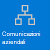
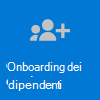

# Introduzione a Teams per la vendita al dettaglio

Gli ambienti di vendita al dettaglio, caratterizzati dalla rotazione dei turni e del personale, hanno esigenze molto diverse rispetto ad altre organizzazioni. Per ottenere il massimo vantaggio per l’organizzazione di vendita al dettaglio, bisogna prima di tutto scegliere gli scenari in cui Teams può essere d’aiuto nelle operazioni aziendali quotidiane, quindi assicurarsi di preparare l’ambiente Teams con le giuste basi, i team e le app per supportare tali scenari.

1. [Scegli gli scenari](#choose-your-scenarios) da implementare per l'azienda.
:::image type="content" source="../media/retail-teams-scenarios.png" alt-text="Diagramma che mostra gli scenari Teams per la vendita al dettaglio." lightbox="../media/retail-teams-scenarios.png":::
1. [Configura gli elementi fondamentali](#set-up-the-fundamentals): supporta il personale con gli elementi di base: la gestione degli account e dei dispositivi e la verifica dell'applicazione dei criteri di Teams appropriati. :::image type="content" source="../media/retail-teams-fundamentals.png" alt-text="Diagramma che mostra gli elementi fondamentali, inclusi i criteri, gli account e i dispositivi di Teams." lightbox="../media/retail-teams-fundamentals.png":::
1. [Configura team e app](#set-up-teams-and-apps): usa i modelli di team per configurare rapidamente i team necessari, inclusi i canali e le app necessari per l'azienda. Aggiungi altre app da Microsoft in base alle esigenze per supportare gli scenari.
:::image type="content" source="../media/retail-teams-apps.png" alt-text="Diagramma che mostra team, modelli di team e app che è possibile includere." lightbox="../media/retail-teams-apps.png":::

<!-- Additional capabilities for retail environments are available with the Microsoft Cloud for Retail, which includes capabilities from Dynamics 365 and Microsoft Azure as well as the Microsoft 365 features. For more information, see [Microsoft Cloud for Retail](/industry/retail/). -->

## Scegli gli scenari

Microsoft 365 e Microsoft Teams offrono diverse funzionalità che possono aiutare le organizzazioni di vendita al dettaglio nello svolgimento delle operazioni quotidiane e nella trasformazione digitale. Per le organizzazioni di vendita al dettaglio sono consigliati gli scenari seguenti:

     

> [!NOTE]
> Questi scenari fanno anche parte di Microsoft Cloud per la vendita al dettaglio. È possibile fare di più con questi scenari quando si usano anche altre funzionalità di Microsoft Cloud per la vendita al dettaglio, ad esempio Microsoft Dynamics 365. Puoi trovare altre informazioni sull'uso di questa soluzione, che riunisce le funzionalità di Azure, Dynamics 365 e Microsoft 365 su [Microsoft Cloud per la vendita al dettaglio](/industry/retail).

### Comunicazione e collaborazione in negozio

Unisci management e collaboratori in negozio per collaborare e semplificare le operazioni con Teams e app Teams.

**App principali:** Turni, Walkie-talkie, Attività, Approvazioni, Chat, Complimento, Elenchi, File

**Servizi aggiuntivi:** Viva Connections, SharePoint, Power Platform e Power Apps

Altre informazioni: [collaborazione con il team di vendita al dettaglio](retail-team-collaboration.md)

### Comunicazione e collaborazione tra negozi

I membri del personale possono comunicare e collaborare tra più negozi in un'area geografica o con la sede centrale usando gli stessi strumenti e app che usi all'interno dello store.

**App principali:** Turni, Walkie-talkie, Attività, Approvazioni, Chat, Complimento, Elenchi, File

**Servizi aggiuntivi:** Viva Connections, Yammer, SharePoint, Power Platform e Power Apps

Altre informazioni: [collaborazione con il team di vendita al dettaglio](retail-team-collaboration.md)

### Accessori virtuali e consulenze

L'app Bookings in Microsoft Teams offre alle organizzazioni un modo semplice per pianificare e gestire appuntamenti virtuali per collaboratori e clienti. Usala per pianificare appuntamenti virtuali, ad esempio esperienze di shopping virtuali.

**Caratteristiche e app principali:** riunioni, Bookings

Altre informazioni: [appuntamenti virtuali con Microsoft Teams e l'app Bookings](bookings-virtual-visits.md)

### Semplifica i processi aziendali

Puoi usare le app di Teams, Power Apps e Power BI per semplificare i processi aziendali. Ad esempio, è possibile:

- Impostare e gestire le pianificazioni per i dipendenti con Turni.
- Condurre le passeggiate e gli inventari dei negozi con Power Apps.
- Tenere traccia degli indicatori di prestazioni chiave (KPI) con i report Power BI.

**App principali:** Turni, Attività, Elenchi, Approvazioni

**Servizi aggiuntivi:** Power Platform con Power Apps e Power BI

Altre informazioni: [Semplifica i processi aziendali](retail-business-processes.md)

### Comunicazioni aziendali

Il coinvolgimento dei dipendenti è un contributo significativo alla soddisfazione, alla fedeltà e alla produttività del luogo di lavoro in qualsiasi organizzazione. Scopri come tenere tutti informati e coinvolti usando SharePoint, Teams, Yammer, Stream e Viva Connections.

**Servizi aggiuntivi:** Viva Connections, SharePoint, Stream, Yammer

Altre informazioni: [Comunicazioni aziendali: guida, metodi e prodotti](/sharepoint/corporate-communications-overview)

### Onboarding di nuovi dipendenti

Rendere l'onboarding di nuovi dipendenti un'esperienza ottimale, promuovendo un ambiente di lavoro ibrido all-in-one in cui i nuovi dipendenti possono trovare risorse importanti, incontrare persone dell'organizzazione e prepararsi per avere successo nel nuovo ruolo.

**App principali:** elenchi, riunioni in tempo reale

**Servizi aggiuntivi:** Viva Learning, SharePoint, Yammer

Altre informazioni: [eseguire l'onboarding di nuovi dipendenti](/sharepoint/onboard-employees)

> [!NOTE]
> Per tutte queste funzionalità, gli utenti devono avere una licenza appropriata. Microsoft 365 per i dipendenti in prima linea F1 e F3 o Office 365 F3, Office 365 A3, A5, E3 ed E5, oltre a Microsoft 365 Business Standard, Business Premium, A3, A5, E3 ed E5 sono tutti supportati. Per altre informazioni sull'assegnazione di una licenza generale di Teams, vedere [Gestire l'accesso degli utenti a Teams](../user-access.md). Per [altre informazioni sull'uso di Microsoft 365](../flw-licensing-options.md) per i lavoratori in prima linea in combinazione con altre licenze, vedi Opzioni di licenza per gli operatori in prima linea.

## Configura le nozioni fondamentali

Getta le basi giuste per i tuoi lavoratori scegliendo le licenze appropriate per loro, gestendo i loro account e gestendo i loro dispositivi in modo da fornire un modo sicuro e conforme per eseguire il loro lavoro.

:::image type="content" source="../media/retail-teams-fundamentals.png" alt-text="Diagramma degli elementi fondamentali che supportano scenari per Teams, ad esempio criteri Teams e Account e dispositivi.":::

### Licenze

Il personale al dettaglio è in genere una forza lavoro mobile: lavoratori e manager in prima linea che non sono davanti ai computer tutto il giorno, a differenza del personale aziendale. Quindi gli strumenti e le app di cui hanno bisogno sono diversi. Microsoft 365 per gli operatori in prima linea offre un set di funzionalità personalizzato per questo pubblico. Per altre informazioni, [vedi Opzioni di licenza per gli operatori in prima linea](../flw-licensing-options.md).

### Account

Con un fatturato elevato, la possibilità di aggiungere e rimuovere rapidamente gli account e ottenere i criteri giusti assegnati è fondamentale. Introduzione alla procedura guidata di onboarding Frontline Worker nell’interfaccia di amministrazione di Microsoft 365. La procedura guidata configura un team per gli operatori in prima linea e assegna licenze e pacchetti di criteri a ogni membro del team. Per altre informazioni, vedere [Usare la procedura guidata di onboarding per gli operatori in prima linea nell’esercizio del loro lavoro](../flw-onboarding-wizard.md).

Se i team da distribuire sono tanti, vedere [Distribuire i team su vasta scala per gli operatori in prima linea](../deploy-teams-at-scale.md).

La presenza di operatori in prima linea è spesso meno prevedibile rispetto ad altri dipendenti, in quanto le ore lavorative in genere non sono uguali ogni giorno. Gli amministratori possono configurare Teams con l'accesso basato su turni (anteprima) in modo da visualizzare un set di stati di presenza basati su turni per gli operatori in prima linea dell'organizzazione per indicare quando sono al lavoro nel loro turno e quando non lo sono. È inoltre possibile gestire l'accesso a Teams quando gli operatori in prima linea non sono impegnati in un turno. Per altre informazioni, vedi [Gestire l'accesso basato sui turni per gli operatori in prima linea](shifts/manage-shift-based-access-flw.md).

### Dispositivi

Poiché la forza lavoro è in gran parte mobile, la gestione di account e dispositivi è fondamentale per gli ambienti di vendita al dettaglio. È necessario impostare una linea di base sicura e conforme con i dispositivi gestiti per l'uso da parte della forza lavoro, che si tratti di un dispositivo condiviso o del dispositivo di un dipendente. Per altre informazioni vedi:

- [Pianificare la distribuzione di dispositivi Azure Active Directory](/azure/active-directory/devices/plan-device-deployment)
- [Panoramica Microsoft Intune](/mem/intune/fundamentals/what-is-intune#manage-devices)
- [Microsoft Teams per RealWear](../flw-realwear.md)

### Criteri

Assicurati che gli addetti alle vendite e altri operatori in prima linea siano in grado di accedere alla funzionalità Teams configurando i pacchetti di criteri appropriati. I criteri di Teams consentono di controllare le operazioni che gli utenti con ruoli specifici possono eseguire. I [pacchetti di criteri per manager in prima linea e operatori in prima linea](../manage-policy-packages.md#policy-packages-included-in-teams) sono personalizzati per essere appropriati per i dipendenti in prima linea come quelli dei negozi al dettaglio.

Teams si integra con l'app Turni e l’operatore in prima linea che possono essere usati per coordinare le caratteristiche del personale a turni e altro ancora. Ad esempio, in Turni, i manager dei negozi possono configurare e coordinare le pianificazioni per il personale e i dipendenti possono controllare le pianificazioni e scambiare i turni.

## Configurare team e app

:::image type="content" source="../media/retail-teams-apps.png" alt-text="Diagramma dei team, modelli di team e app che è possibile includere.":::

### App e servizi per la vendita al dettaglio

Assicurati che i tuoi dipendenti possano comunicare, collaborare e offrire un servizio clienti eccezionale con app come Turni, Walkie-talkie, Attività, Elenchi, Complimento e così via. È possibile determinare quali app sono disponibili per gli utenti abilitandole nell'interfaccia di amministrazione di Teams o includendole in un modello di team. Altre informazioni sulla [gestione app Teams](../manage-apps.md).

Per gli ambienti di vendita al dettaglio, le app e i servizi seguenti consentono di trasformare i processi aziendali e supportare le comunicazioni:

| App e servizi di Teams | Descrizione | Gestione | Guida |
| ----- | ----- | ----- | ----- |
| Approvazioni | Le approvazioni possono essere integrate nella chat per semplificarne il processo. | [Gestione delle approvazioni](../approval-admin.md) | [Uso delle approvazioni](https://support.microsoft.com/office/what-is-approvals-a9a01c95-e0bf-4d20-9ada-f7be3fc283d3) |
| Chat | Abilita conversazioni rapide e controlli tra il personale con strumenti di comunicazione sicuri di livello aziendale, invece di app o SMS di livello consumer. | [Chat, team, canali & app in Microsoft Teams](../deploy-chat-teams-channels-microsoft-teams-landing-page.md) | [Chattare in Teams](https://support.microsoft.com/office/start-and-pin-chats-a864b052-5e4b-4ccf-b046-2e26f40e21b5?wt.mc_id=otc_microsoft_teams) |
| Documenti | Condividere procedure operative standard, criteri di archiviazione, piani e altro ancora. | [Come SharePoint e OneDrive interagiscono con Microsoft Teams](../sharepoint-onedrive-interact.md) | [Condividere file](https://support.microsoft.com/office/upload-and-share-files-57b669db-678e-424e-b0a0-15d19215cb12) |
| Complimento | Riconosci l’ottimo lavoro svolto in team dai colleghi con l’app Complimento. | [Gestire l'app Complimento](../manage-praise-app.md) | [Inviare complimenti alle persone](https://support.microsoft.com/office/send-praise-to-people-50f26b47-565f-40fe-8642-5ca2a5ed261e) |
| Dispositivi RealWear | Comunicazione vivavoce con i dispositivi. | [Microsoft Teams per RealWear](../flw-realwear.md) | [Usare Microsoft Teams per RealWear](https://support.microsoft.com/office/using-microsoft-teams-for-realwear-af20d232-d18c-476f-8031-843a4edccd5f) |
| Turni | Gestire le pianificazioni e la registrazione dell'ora di entrata e uscita con Turni. | [Gestire i turni](shifts-for-teams-landing-page.md) | [Usare i turni](https://support.microsoft.com/office/what-is-shifts-f8efe6e4-ddb3-4d23-b81b-bb812296b821) |
| Attività | Aiuta i dipendenti a comprendere su cosa concentrarsi quando non sono con i clienti assegnando attività. Le operazioni possono utilizzare la [pubblicazione delle attività](../manage-tasks-app.md#task-publishing) per inviare attività ale varie posizioni e tenere traccia dello stato di avanzamento in tali posizioni. | [Gestire l'app Attività](../manage-tasks-app.md) | [Usare le attività](https://support.microsoft.com/office/use-the-tasks-app-in-teams-e32639f3-2e07-4b62-9a8c-fd706c12c070) |
| Walkie-talkie | Comunicazione rapida push to talk non vincolata da fattori geografici come le radio standard a 2 vie.| [Gestire l'app Walkie-talkie](../walkie-talkie.md) | [Usare Walkie-talkie](https://support.microsoft.com/office/get-started-with-teams-walkie-talkie-25bdc3d5-bbb2-41b7-89bf-650fae0c8e0c) |

| Altre app e servizi da Microsoft | Descrizione | Gestione | Guida |
| ----- | ----- | ----- | ----- |
| Bookings | Abilita le consulenze e gli accessori virtuali. | [Visite virtuali con Microsoft Teams e l’app Bookings](bookings-virtual-visits.md) | [Usare Bookings](https://support.microsoft.com/en-us/office/what-is-bookings-42d4e852-8e99-4d8f-9b70-d7fc93973cb5) |
| Power Apps e Power Platform | Integra i processi aziendali e abilita aggiornamenti rapidi dei dati, ad esempio l'inventario del negozio, i numeri di vendita, i report degli incidenti e altro ancora. | [Integrazione di Teams con Microsoft Power Platform](/microsoftteams/platform/samples/teams-low-code-solutions) e [gestione delle app Microsoft Power Platform nell'interfaccia di amministrazione di Microsoft Teams](../manage-power-platform-apps.md) | -  |
| SharePoint | Quando si crea un nuovo team, viene creato un nuovo sito SharePoint e viene connesso al team. Molti degli scenari precedenti si basano su funzionalità SharePoint già incorporate in Teams, ad esempio la condivisione di documenti per la collaborazione in team. | [Integrazione di Teams e SharePoint](/sharepoint/teams-connected-sites) | [Aggiungi una pagina SharePoint, un elenco o una raccolta documenti come scheda in Teams](https://support.microsoft.com/office/add-a-sharepoint-page-list-or-document-library-as-a-tab-in-teams-131edef1-455f-4c67-a8ce-efa2ebf25f0b)|
| Viva Connections | Viva Connections crea un hub in Teams in cui i tuoi collaboratori possono visualizzare un newsfeed personalizzato dell'organizzazione e un dashboard personalizzato con le risorse di cui hanno bisogno. | [Panoramica di Viva Connections](/sharepoint/viva-connections-overview) | [Viva Connections in Microsoft Teams](https://support.microsoft.com/office/your-intranet-is-now-in-microsoft-teams-8b4e7f76-f305-49a9-b6d2-09378476f95b) |
| Viva Learning | Fornisci formazione quando necessario, direttamente nel flusso del loro lavoro. | [Gestire Viva Learning](/microsoft-365/learning/) | [Usare Viva Learning (anteprima)](https://support.microsoft.com/office/viva-learning-preview-01bfed12-c327-41e0-a68f-7fa527dcc98a) |
| Yammer | Connetti la tua organizzazione e abilita la comunicazione tra reparti e aree geografiche diversi con Yammer. | [Gestire Yammer](/yammer) | [Usare Yammer](https://support.microsoft.com/office/what-is-yammer-1b0f3b3e-89ee-4b66-aac5-30def12f287c) |

### Usa i modelli per configurare i team

Crea team che includono un set predefinito di impostazioni, canali, schede e app preinstallate per la comunicazione e la collaborazione all'interno di un singolo negozio, un'area geografica o tra la sede centrale e il personale ovunque si trovi.

- Il modello di vendita al dettaglio **Organizza un uno store** include canali relativi a generale, handoff turni, preparazione dello store e learning e include le app Approvazioni, Attività e Wiki.
- Il modello **Vendita al dettaglio per manager** include canali relativamente a generale, operazioni e learning e include una scheda Wiki.

È inoltre possibile [creare un modello personalizzato](../create-a-team-template.md) per includere le app necessarie per lo store. Altre informazioni: [introduzione ai modelli del team di vendita al dettaglio](../get-started-with-retail-teams-templates.md)

Oltre ai modelli di team, è inoltre possibile configurare altri siti e servizi per facilitare la comunicazione: SharePoint e Viva Connections.

- Configura i siti SharePoint per creare una home page per l'organizzazione, distribuire notizie all'interno dell'azienda e fornire una posizione con risorse per l'onboarding degli utenti. Per altre informazioni sull'uso di SharePoint per gli scenari di comunicazione aziendale, vedi [Comunicazioni aziendali: linee guida, metodi e prodotti](/sharepoint/corporate-communications-overview).
- Usa Viva Connections per tenere tutto insieme. Con Viva Connections come vera e propria casa del tuo dipendente in Teams, i dipendenti stessi possono ottenere aggiornamenti sulle attività, le notizie aziendali e altro ancora. Per altre informazioni, vedi [Panoramica: Viva Connections (anteprima)](/viva/connections/viva-connections-overview) e [Aggiungere l'app Viva Connections nell'interfaccia di amministrazione di Teams (anteprima).](/viva/connections/add-viva-connections-app).

## Preparati a implementare gli scenari: identificare ruoli e responsabilità per gli scenari

Ora che conosci gli scenari da implementare e ciò di cui hai bisogno per supportarli, puoi riunire il tuo team e iniziare a pianificare, implementare e monitorarne il funzionamento nell'organizzazione. Ad esempio, i ruoli seguenti potrebbero essere necessari per implementare tali scenari nell’organizzazione:

| Immagine | Ruolo | Responsabilità | Reparto |
| ---- | ---- | ----- | ----- |
| | Amministratore IT | Collaborare con il personale di gestione delle operazioni e della vendita al dettaglio per definire gli scenari e il relativo impatto per l'organizzazione.   Configurare le impostazioni nell'interfaccia di amministrazione di Teams, ad esempio criteri e modelli, e abilitare le app.   Configurare le impostazioni dell'app, ad esempio le impostazioni globali di Turni, per l'organizzazione.   Aggiungere e concedere la licenza agli utenti.  | Reparto IT |
|| Personale operazioni | Collaborare con gli amministratori per definire scenari e determinare quali impostazioni, criteri, modelli e app sono necessari per Teams.   Creare team locali o di reparto dai modelli.   Configurare attività, elenchi e flussi di approvazione per il coordinamento tra gli store all'interno di un'area geografica o tra i negozi e la sede centrale.   Configurare il framework di apprendimento per il personale. | Operazioni centrali |
| | Responsabile dello Store | Collaborare con gli amministratori e il personale operativo per definire gli scenari.   Creare team per lo store da modelli.   Configurare canali e app per i team, in base alle esigenze. Ad esempio: un canale per gli handover relativi ai turni.   Configurare le pianificazioni degli store in Turni.   Configurare attività, elenchi e flussi di approvazione specifici per lo store.   Configurare le attività di apprendimento per il personale. | Gestione dello Store |

Per altre informazioni sull'implementazione e l'adozione di Teams, vedere [Adottare Microsoft Teams](../adopt-microsoft-teams-landing-page.md).
