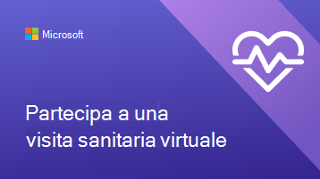

# Aiutare clienti e clienti a usare gli appuntamenti virtuali

Ora che l'organizzazione ha iniziato a usare Microsoft Teams e l'app Bookings per gli appuntamenti virtuali, è necessario assicurarsi che clienti e clienti comprendano come prenotare e partecipare a questi appuntamenti.

Guardare questo video per una rapida panoramica sulle operazioni che gli appuntamenti virtuali possono eseguire per l'organizzazione.

> [!VIDEO https://www.microsoft.com/videoplayer/embed/RE4TQop]

## Contenuto di questo toolkit

Questo toolkit ha lo scopo di aiutare clienti e clienti a partecipare correttamente a un appuntamento virtuale. È possibile personalizzare le risorse fornite e includere collegamenti alle risorse nelle comunicazioni sugli appuntamenti virtuali. Questo toolkit include:

[Indicazioni per il sito Web](#guidance-for-your-website):   Domande frequenti sugli appuntamenti virtuali che è possibile personalizzare e quindi ospitare nel sito Web. Assicurarsi di aggiungere collegamenti personalizzati ed eventuali altre informazioni che i clienti devono conoscere sui criteri.

[Risorse per il team](#resources-for-your-team):   Articoli e video per aiutare il team a condurre appuntamenti virtuali.

[Risorse per i clienti](#resources-for-your-clients):  
Un collegamento al contenuto di supporto Microsoft, che include un video su come partecipare a un appuntamento virtuale. 
Infografiche che è possibile personalizzare per l'organizzazione.

## Indicazioni per il sito Web

È possibile comunicare ai clienti cosa aspettarsi con gli appuntamenti virtuali rispondendo alle domande più comuni. È sufficiente modificare questa Q&A per allinearsi ai criteri per gli appuntamenti virtuali e incollarla nel sito Web.

### Nozioni di base su appuntamenti virtuali

**Che cos'è un appuntamento virtuale?**

Un appuntamento virtuale è un appuntamento online condotto su Microsoft Teams. Parlerai uno a uno con uno dei nostri membri del personale, proprio come faresti per una visita di persona.

**Quali sono le differenze tra gli appuntamenti virtuali e le visite di persona?**

Fai sapere ai tuoi clienti se esistono differenze nei servizi che fornisci in modo virtuale e di persona. È anche possibile descrivere eventuali differenze di tariffa tra appuntamenti virtuali e di persona.

**Come va un appuntamento virtuale?**

Quando partecipi dal collegamento nella conferma tramite e-mail, immetti una sala d'attesa virtuale. Una volta che un membro del personale si unisce alla chiamata, potrai entrare in una sala virtuale con loro in cui avrà luogo la tua visita uno-a-uno.

**Come funziona il pagamento per gli appuntamenti virtuali?**

Comunicare ai clienti se si accettano diversi tipi di pagamento per gli appuntamenti virtuali.

### Prenotazione di un appuntamento

**Ricerca per categorie prendere appuntamento?**

Collegamento alla pagina di prenotazione dell'organizzazione. Fai sapere ai tuoi clienti se esistono modi alternativi per creare appuntamenti virtuali, ad esempio al telefono, tramite e-mail o social media.

**Who posso fissare un appuntamento?**

Assicurarsi che i clienti possano mantenere le relazioni con i propri provider preferiti condividendo quali, se presenti, il personale opera in modo esclusivo virtuale o di persona.

**Ricerca per categorie annullare o ripianificare un appuntamento virtuale?**

Qui è possibile creare un collegamento ai criteri di annullamento e riprogrammazione dell'organizzazione oppure descrivere eventuali differenze tra gli appuntamenti virtuali e di persona.

### Tecnologia

**Quali attrezzature sono necessarie per un appuntamento virtuale?**

I clienti possono partecipare a un appuntamento virtuale da qualsiasi Web browser o tramite l'app Microsoft Teams. Elenca qui se l'organizzazione ha specifiche aggiuntive, ad esempio una webcam o un microfono di alta qualità. Se l'organizzazione sanitaria ha integrato L'EHR nei team, i pazienti possono partecipare alle visite dal portale sanitario.

**Ricerca per categorie partecipare a un appuntamento virtuale?**

È possibile collegare i clienti qui Partecipare a un appuntamento di Bookings come partecipante (microsoft.com) per mostrare loro un video dettagliato e un processo dettagliato su come partecipare a un appuntamento.

## Risorse per il team

Sfruttare al meglio gli appuntamenti virtuali assicurandosi che i membri del personale sappiano come gestirli. È possibile condividere questi articoli e video con i membri del team per aiutarli a comprendere meglio gli appuntamenti virtuali.

- [Informazioni su come usare l'app Bookings in Teams](https://support.microsoft.com/office/what-is-bookings-42d4e852-8e99-4d8f-9b70-d7fc93973cb5)
- [Informazioni su come partecipare a un appuntamento di Bookings](https://support.microsoft.com/office/join-a-bookings-appointment-attendees-3deb7bde-3ea3-4b41-8a06-741ad0db9fc0)
- [Conduci una visita virtuale](/microsoftteams/expand-teams-across-your-org/bookings-virtual-visits#conduct-a-visit)
- [Guardare un video sugli appuntamenti virtuali](#help-your-clients-and-customers-use-virtual-appointments)

## Risorse per i clienti

È possibile creare un collegamento a questo articolo per mostrare ai clienti come partecipare agli appuntamenti virtuali:  
[Informazioni su come partecipare a un appuntamento virtuale](https://support.microsoft.com/office/join-a-bookings-appointment-as-an-attendee-95cea12d-2220-421f-a663-6efb20913c7f)

Scaricare e [personalizzare](#customize-your-infographic) una di queste infografiche da visualizzare nel sito Web. Questi offrono ai clienti un modo rapido e visivamente coinvolgente per capire come funzionano gli appuntamenti virtuali con l'organizzazione.

| Grafica                | Descrizione e collegamenti              |
| :------------------- | -------------------: |
|  | Infografica personalizzabile per l'organizzazione di servizi finanziari   [Scarica in formato PDF](//download.microsoft.com/download/8/5/7/85784cd8-6945-4fcc-a3c3-972bd88d3fef/VirtualVisit_Financial_Infographic.pdf)   [Scarica come PowerPoint](//download.microsoft.com/download/8/5/7/85784cd8-6945-4fcc-a3c3-972bd88d3fef/VirtualVisit_Financial_Infographic.pptx)
|  | Infografica personalizzabile per l'organizzazione di vendita al dettaglio   [Scarica in formato PDF](//download.microsoft.com/download/a/b/5/ab5c07d9-cf7a-47b3-ba54-05a8a0a2a1bd/VirtualVisit_Retail_Infographic.pdf)   [Scarica come PowerPoint](//download.microsoft.com/download/a/b/5/ab5c07d9-cf7a-47b3-ba54-05a8a0a2a1bd/VirtualVisit_Retail_Infographic.pptx) |
|  | Infografica personalizzabile per l'organizzazione sanitaria   [Scarica in formato PDF](//download.microsoft.com/download/4/d/3/4d3d9c53-0304-4aea-a56a-60a16402c58f/VirtualVisit_Healthcare_Infographic.pdf)   [Scarica come PowerPoint](//download.microsoft.com/download/4/d/3/4d3d9c53-0304-4aea-a56a-60a16402c58f/VirtualVisit_Healthcare_Infographic.pptx) |

### Personalizzare l'infografica

1. Scegliere una delle tre infografiche precoci a seconda delle esigenze dell'organizzazione:
    1. Sanità
    2. Servizi finanziari
    3. Commercio al dettaglio

2. Personalizzare l'infografica in PowerPoint.
    1. Usare i colori e i tipi di carattere preferiti dell'organizzazione.
    2. Aggiungere il logo o le immagini personalizzate dell'organizzazione.
    3. Collegarsi alle pagine del sito Web, ad esempio la pagina di prenotazione, le informazioni di fatturazione o la home page.
    4. Aggiungere eventuali altre informazioni necessarie ai clienti prima di partecipare a un appuntamento virtuale.

3. Esportare l'infografica personalizzata in formato PDF.
