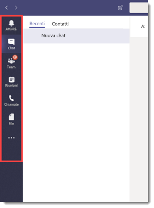
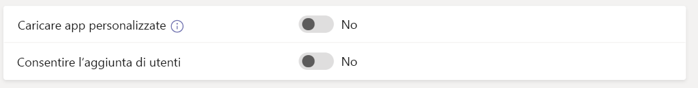
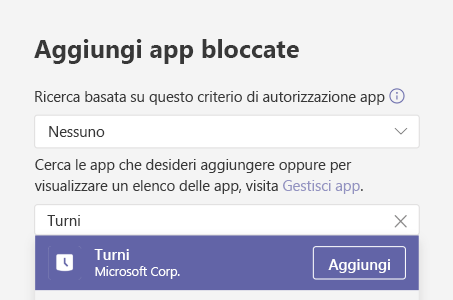
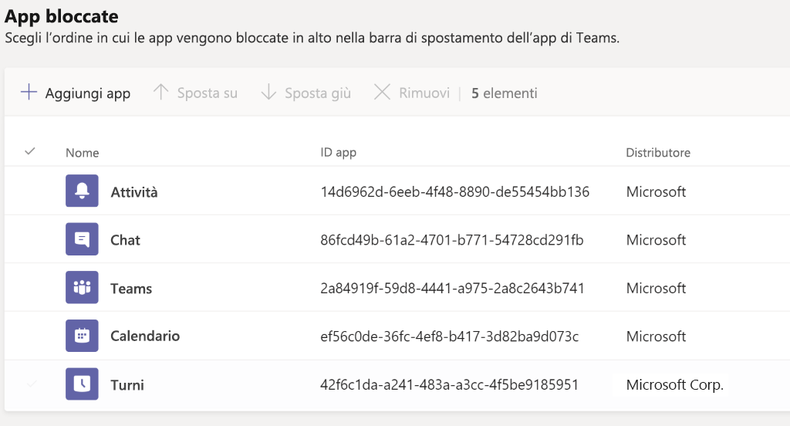
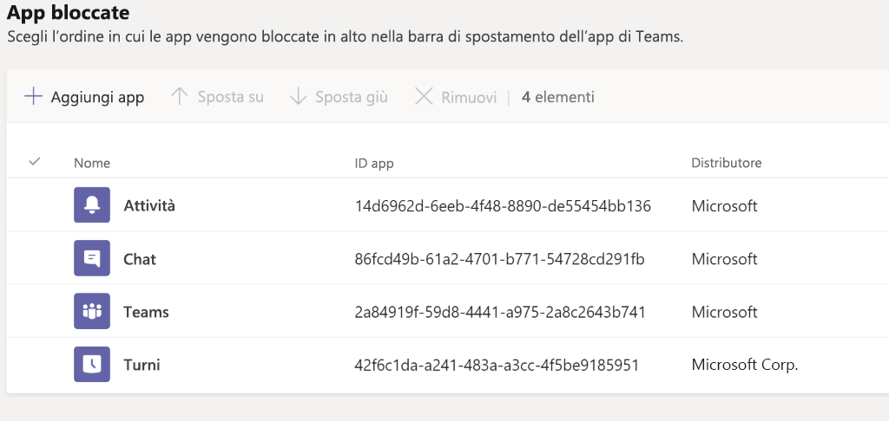
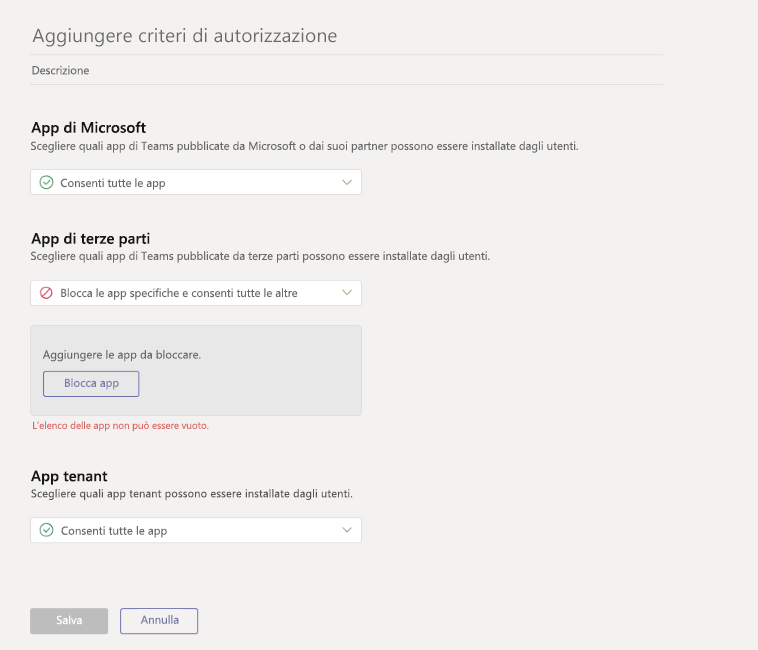

# <a name="how-to-provision-teams-at-scale-for-firstline-workers"></a>Come eseguire il provisioning di Microsoft Teams su vasta scala per gli operatori sul campo

Si deve eseguire l'onboarding di un numero elevato di utenti in Microsoft Teams e configurare un'esperienza semplificata per tali utenti? Nelle istruzioni seguenti viene indicato come eseguire rapidamente il provisioning delle identità e dei team e assegnare tutti i criteri appropriati per controllare l'esperienza dell'utente finale.

Questa procedura dettagliata illustra come:

- Creare un numero elevato di utenti.
- Creare un numero elevato di team e configurare i canali appropriati.
- Assegnare licenze su vasta scala.
- Creare criteri di messaggistica, criteri di installazione app e criteri di autorizzazione app appropriati in Teams.
- Applicare quei criteri agli utenti su vasta scala.
- Assegnare un numero elevato di utenti a un determinato team.

> [!NOTE]
> Se queste informazioni sono state esaminate e si ha ancora bisogno di assistenza o se si hanno domande, è possibile [**fare clic qui**](https://forms.office.com/Pages/ResponsePage.aspx?id=v4j5cvGGr0GRqy180BHbRyMDv-1voW9MqL7zkQ11DzBUREZaU1E0WEk5T0NYS0NDSkFMSDROUUdYMC4u) per contattare il supporto White Glove.

## <a name="prerequisites"></a>Prerequisiti

Scaricare le risorse disponibili [qui](https://github.com/MicrosoftDocs/OfficeDocs-SkypeForBusiness/blob/live/Teams/downloads/FLWTeamsScale.zip?raw=true).

> [!IMPORTANT]
> Gli script accessibili tramite il collegamento indicato sopra sono forniti così come sono da Microsoft e devono essere modificati in base alle proprie esigenze.

## <a name="technical-requirements"></a>Requisiti tecnici

- Nel tenant deve essere disponibile il numero appropriato di licenze che includano Microsoft Teams. Se non si hanno ancora queste licenze, seguire le istruzioni per attivare la [versione di valutazione gratuita di Office 365 E1](e1-trial-license.md).
- Gli utenti che eseguono questa procedura devono utilizzare il ruolo di amministratore globale o di amministratore utenti in Azure AD.
- È necessario che l'utente abbia i diritti necessari per installare e configurare il software nel computer locale.

## <a name="step-by-step-process-overview"></a>Panoramica della procedura

1. **Configurare l'ambiente**
    1. Scaricare il file ZIP contenente gli script di esempio e la documentazione di PowerShell
    1. Configurare le credenziali
    1. Configurare l'ambiente locale
    1. Configurare i moduli di PowerShell e le variabili di ambiente
    1. Creare la registrazione dell'app
1. **Creare e configurare i team**
    1. Creare team
    1. Creare canali per i team
1. **Creare criteri di Teams**
    1. Creare criteri di messaggistica di Teams
    1. Creare criteri di installazione app di Teams
    1. Creare criteri di autorizzazione app di Teams
1. **Creare e configurare gli utenti**
    1. Creare utenti e gruppi di sicurezza
    1. Assegnare licenze agli utenti tramite le licenze basate sui gruppi
1. **Assegnare utenti e criteri**
    1. Assegnare gli utenti ai team
    1. Assegnare criteri a utenti e gruppi
1. **Eseguire il test e la convalida**
    1. Verificare la presenza di errori
    1. Accedere a Teams con un utente di test

## <a name="set-up-your-environment"></a>Configurare l'ambiente

La procedura seguente consente di configurare l'ambiente:

### <a name="download-zip-file-containing-sample-powershell-scripts"></a>Scaricare il file ZIP contenente gli script di PowerShell di esempio

Prima di procedere, è necessario scaricare gli script disponibili [qui](https://github.com/MicrosoftDocs/OfficeDocs-SkypeForBusiness/blob/live/Teams/downloads/FLWTeamsScale.zip?raw=true).

### <a name="setup-credentials"></a>Configurare le credenziali

In questo documento e negli script di esempio abbiamo deciso di creare un file di riferimento contenente le credenziali per agevolare il processo. In questo modo si elimina la necessità di eseguire l'autenticazione in tutti gli endpoint di servizio, mantenendo le credenziali in un archivio locale. Per eseguire gli script successivi, sarà necessario aggiornare quel file di riferimento con le credenziali univoche per l'utente e per l'ambiente. Dall'interno di ognuno degli script successivi, le credenziali appropriate vengono lette con la funzione helper che abbiamo chiamato **GetCreds** e queste credenziali vengono usate per connettersi ai vari servizi.

Non è raro che per servizi diversi siano richieste credenziali diverse. Ad esempio, se si hanno credenziali diverse per MicrosoftTeams, AzureAD e MSonline, è possibile eseguire SetCred salvando ogni file delle credenziali con il relativo nome significativo.

Esempi: SetCreds msol-cred.xml SetCreds azuread-cred.xml SetCreds teams-cred.xml

> [!NOTE]
> L'account usato per le credenziali non può richiedere l'autenticazione a più fattori.

Ecco un esempio di come i vari script usano le credenziali salvate per eseguire l'autenticazione:

```azurepowershell
# Connect to MicrosoftTeams
$teams_cred = GetCreds teams-cred.xml
Connect-MicrosoftTeams -Credential $teams_cred
```

Per impostare le credenziali, eseguire le operazioni seguenti:

1. Trovare **SetCreds.ps1** nelle risorse del file ZIP.
1. In PowerShell eseguire lo script **SetCreds.ps1** per salvare le credenziali.
    1. Verrà indicato che è in esecuzione l'operazione "Export-Clixml" e sarà necessario immettere "Y" per approvare.

### <a name="configure-the-local-environment"></a>Configurare l'ambiente locale

1. Trovare **SetConfig.ps1** nelle risorse del file ZIP.
1. In PowerShell eseguire il comando seguente, sostituendo le voci racchiuse tra parentesi quadre con le informazioni specifiche.
    1. **SetConfig.ps1** -tenantName [nome del tenant] -rootPath "[percorso completo della radice del repository git]"

Ad esempio: `.\SetConfig.ps1 -tenantName contoso.onmicrosoft.com -rootPath "C:\data\source\FLWTeamsScale"`

### <a name="configure-powershell-modules-and-environmental-variables"></a>Configurare i moduli di PowerShell e le variabili di ambiente

Prima di procedere, è necessario installare e connettersi a diversi moduli di PowerShell, tra cui Azure AD, MSAL, MSCloudUtils e MicrosoftTeams.

1. Trovare **ConfigurePowerShellModules.ps1** nelle risorse del file ZIP.
1. Modificare e sostituire le seguenti variabili di ambiente con le proprie variabili:
1. In PowerShell eseguire lo script **ConfigurePowerShellModules.ps1**.

## <a name="create-and-set-up-teams"></a>Creare e configurare i team

Per comunicare e collaborare con gli operatori sul campo, è necessario prima di tutto creare una serie di team e aggiungere canali standard a quei team, come illustrato di seguito.

### <a name="create-teams"></a>Creare i team

I team sono una insieme di persone, contenuti e strumenti all'interno dell'organizzazione. Per la maggior parte delle organizzazioni orientate agli operatori sul campo, è consigliabile associare un team a una posizione fisica. Ad esempio, un team per ognuna delle seguenti posizioni:

- Negozio
- Centro di distribuzione
- Stabilimento di produzione
- Ospedale
- Supermercato

*Discussione sulle procedure consigliate*: quando si progettano i team, è importante tenere in considerazione i [limiti e le specifiche per Teams](limits-specifications-teams.md). Per le organizzazioni più piccole, è possibile usare un team a livello di organizzazione per snellire le comunicazioni e integrare una struttura di posizioni fisiche. Per altre, una convenzione di denominazione dei team basata su una posizione fisica strutturata agevola le comunicazioni aziendali facilitando la pubblicazione trasversale a più team contemporaneamente. Ad esempio, è possibile cercare e inviare post a tutti i team nel cui nome è presente US per raggiungere tutte le posizioni negli Stati Uniti. Altre informazioni a questo proposito sono disponibili [qui](https://support.office.com/article/cross-post-a-channel-conversation-in-teams-9c1252a3-67ef-498e-a7c1-dd7147b3d295).

#### <a name="steps-to-create-teams"></a>Procedura per la creazione di team

1. Trovare il file **Teams Information.csv** nelle risorse.
1. Aggiornare le informazioni nel file **Teams Information.csv** con le informazioni specifiche dell'organizzazione. Tenere presenti le procedure consigliate descritte in precedenza.
1. Trovare lo script **CreateTeams.ps1**.
1. In PowerShell eseguire lo script **CreateTeams.ps1**.

### <a name="create-channels-for-teams"></a>Creare canali per i team

I canali sono sezioni dedicate all'interno di un team in cui le conversazioni sono organizzate per argomento, progetto, interesse e così via. Ogni team dispone automaticamente di un canale Generale, ma è possibile personalizzare la struttura in base alle esigenze dell'azienda. Ad esempio, la struttura dei canali potrebbe includere:

- **Produzione**: Sicurezza, Linea 1, Linea 2, Comunicazioni aziendali, Formazione
- **Alimentari**: Prodotti da forno, Frutta e verdura, Carne, Comunicazioni aziendali, Formazione
- **Sanità**: Infermieri, Medici, Terapia intensiva 1, Terapia intensiva 2
- **Accoglienza** - Front desk, Manutenzione, Pulizia, Parcheggio e facchinaggio, Comunicazioni aziendali, Formazione
- **Vendita al dettaglio**: Vendita, Magazzino, Comunicazioni aziendali, Formazione

> [!NOTE]
> I canali non devono essere considerati come delimitazioni di sicurezza. Sono uno strumento per organizzare i lavoratori nell'ottica della collaborazione.

*Discussione sulle procedure consigliate*: quando si progetta la struttura di un canale, è importante semplificarla al massimo, soprattutto se si intende eseguire l'onboarding di un numero elevato di utenti. Resistere alla tentazione di aggiungere canali per ogni situazione, ruolo o argomento per ridurre al massimo la necessità di formazione. Scegliere 3-5 canali al massimo per iniziare. Se necessario, sarà possibile aggiungere facilmente altri canali. Per il momento, in realtà, è sufficiente usare solo il canale Generale.

#### <a name="steps-to-create-channels-for-teams"></a>Procedura per la creazione di canali per i team

1. Trovare il file **TeamsChannels.csv** nelle risorse del file ZIP.
1. Aggiornare il file **TeamsChannels.csv** con le informazioni specifiche dell'organizzazione. Tenere presenti le procedure consigliate descritte in precedenza.
1. Trovare lo script **CreateTeamsChannels.ps1** nelle risorse del file ZIP.
1. In PowerShell eseguire lo script **TeamsChannels.ps1**.

## <a name="create-teams-policies"></a>Creare criteri di Teams

L'amministratore può usare i criteri per i team in Microsoft Teams per controllare ciò che gli utenti dell'organizzazione possono vedere. Ad esempio, è possibile controllare quali applicazioni sono bloccate sulla barra di sinistra nel browser desktop o Web o sulla barra inferiore dei dispositivi mobili, per semplificare l'esperienza dell'utente finale durante l'onboarding di una grande quantità di utenti. Alcuni di questi criteri possono essere creati con PowerShell, mentre altri devono essere creati manualmente nella console di amministrazione di Teams.

*Discussione sulle procedure consigliate*: per ognuno dei criteri seguenti, decidiamo di creare due criteri, uno per gli operatori sul campo e uno per i manager sul campo. È possibile crearne un numero qualsiasi, in base alle proprie preferenze. Per la maggior parte dei clienti, due è un numero sufficiente per iniziare, anche se inizialmente si assegnano le stesse impostazioni a ciascun gruppo. Man mano che si acquisisce esperienza con Teams, si potrà decidere di differenziare ulteriormente l'esperienza e i due criteri separati già creati possono semplificare questa operazione.

### <a name="create-teams-message-policies"></a>Creare criteri di messaggistica di Teams

I criteri di messaggistica vengono usati per controllare le funzionalità di messaggistica disponibili in chat e canali per gli utenti di Microsoft Teams.

*Discussione sulle procedure consigliate*: anche se è possibile usare il criterio globale predefinito che viene creato automaticamente, abbiamo deciso di creare un criterio personalizzato usando la procedura descritta di seguito per offrire un'esperienza più definita, semplice e differenziata per i manager sul campo e gli operatori sul campo.

#### <a name="steps-to-create-teams-message-policies"></a>Procedura per la creazione di criteri di messaggistica di Teams

1. Trovare il file **TeamsMessagingPolicies.csv** nelle risorse del file ZIP.
1. Aggiornare il file **TeamsMessagingPolicies.csv** con le informazioni specifiche dell'organizzazione. Altre informazioni su alcune delle opzioni sono disponibili [qui](https://docs.microsoft.com/microsoftteams/messaging-policies-in-teams#messaging-policy-settings).
1. Trovare lo script **CreateTeamsMessagePolicies.ps1** nelle risorse.
1. In PowerShell eseguire lo script **TeamsMessagePolicies.ps1**.

### <a name="create-teams-app-setup-policies"></a>Creare criteri di installazione app di Teams

Gli amministratori possono usare i criteri di installazione app per eseguire le operazioni seguenti:

- Personalizzare Teams in modo da evidenziare le app più importanti per gli utenti. Scegliere le app da aggiungere e impostare l'ordine in cui vengono visualizzate. L'aggiunta di app consente di mettere in evidenza le app di cui gli utenti dell'organizzazione hanno bisogno, incluse quelle create da terze parti o dagli sviluppatori dell'organizzazione.
- Controllare se gli utenti possono aggiungere app a Teams.

Le app vengono aggiunte alla barra delle app. Questa barra si trova sul lato del client Teams desktop e nella parte inferiore dei client Teams per dispositivi mobili (iOS e Android).

|Client Teams per desktop  |         |Client Teams per dispositivi mobili  |
|---------|---------|---------|
|         |         | |

*Discussione sulle procedure consigliate*: i criteri di installazione app vengono gestiti nell'interfaccia di amministrazione di Microsoft Teams. Non possono essere creati con PowerShell. È possibile usare il criterio globale (predefinito per l'intera organizzazione) o creare criteri personalizzati e assegnarli agli utenti. Gli utenti dell'organizzazione verranno automaticamente assegnati al criterio globale, a meno che non venga creato e assegnato un criterio personalizzato. In questo caso, stiamo creando due nuovi criteri per gli operatori sul campo e per i manager sul campo, per offrire loro una soluzione più semplice e più snella per semplificare l'onboarding di un numero elevato di utenti contemporaneamente. È possibile decidere di personalizzare l'esperienza in base alle esigenze aziendali.

#### <a name="create-the-firstline-manager-app-setup-policy"></a>Creare i criteri di installazione app per i manager sul campo

Le impostazioni seguenti possono essere personalizzate in base alle esigenze aziendali. Le opzioni consigliate sono state scelte in base alle procedure consigliate e per semplificare l'onboarding di nuovi utenti su vasta scala. Per altre informazioni, fare clic [qui](https://docs.microsoft.com/MicrosoftTeams/teams-app-setup-policies#create-a-custom-app-setup-policy).

1. Nel riquadro di spostamento sinistro dell'interfaccia di amministrazione di Microsoft Teams passare a  **App di Teams** > **Criteri di configurazione**.
2. Fare clic su  **Aggiungi**.  
3. Immettere un nome e una descrizione per il criterio. Ad esempio: **Criterio di installazione app per manager sul campo**.
.

4. Disattivare **Carica app personalizzate**.
5. Disattivare **Consenti di aggiungere un utente**.


6. Se non è già presente nell'elenco, aggiungere l'app **Turni**. Per altre informazioni su **Turni**, fare clic [qui](expand-teams-across-your-org/shifts/manage-the-shifts-app-for-your-organization-in-teams.md).


7. Rimuovere Chiamata, se presente. Nota: quando questa funzionalità viene rimossa, non viene disabilitata per l'utente ma si impedisce che venga visualizzata sulla barra delle app, per semplificare l'esperienza dell'utente finale.
8. Disporre le app nell'ordine seguente per specificare l'ordine in cui vengono visualizzate sulla barra delle app di Teams, quindi fare clic su  **Salva**.
    1. Attività
    1. Chat
    1. Teams
    1. Calendario
    1. Turni 

#### <a name="create-the-firstline-worker-app-setup-policy"></a>Creare i criteri di installazione app per gli operatori sul campo

Le impostazioni seguenti possono essere personalizzate in base alle esigenze aziendali. Le opzioni consigliate sono state scelte in base alle procedure consigliate e per semplificare l'onboarding di nuovi utenti su vasta scala. Per altre informazioni, fare clic [qui](https://docs.microsoft.com/MicrosoftTeams/teams-app-setup-policies#create-a-custom-app-setup-policy).

1. Nel riquadro di spostamento sinistro dell'interfaccia di amministrazione di Microsoft Teams passare a  **App di Teams** > **Criteri di configurazione**.
2. Fare clic su  **Aggiungi**.
3. Immettere un nome e una descrizione per il criterio. Ad esempio: **Criterio di installazione app per operatori sul campo**.
.

4. Disattivare **Carica app personalizzate**.
5. Disattivare **Consenti di aggiungere un utente**.


6. Se non è già presente nell'elenco, aggiungere l'app **Turni**. Per altre informazioni su **Turni**, fare clic qui.


7. Rimuovere Riunioni e Chiamate, se presenti. Nota: quando queste funzionalità vengono rimosse, non vengono disabilitate per l'utente ma si impedisce che vengano visualizzate sulla barra delle app, per semplificare l'esperienza dell'utente finale.
8. Disporre le app nell'ordine seguente per specificare l'ordine in cui vengono visualizzate sulla barra delle app di Teams, quindi fare clic su  **Salva**.
    1. Attività
    1. Chat
    1. Teams
    1. Turni 

### <a name="create-app-permission-policies"></a>Creare criteri di autorizzazione app

Gli amministratori possono usare i criteri di autorizzazione app per controllare quali app sono disponibili per gli utenti di Microsoft Teams dell'organizzazione. È possibile consentire o bloccare tutte le app o determinate app pubblicate da Microsoft, da terze parti e dall'organizzazione. Quando si blocca un'app, gli utenti a cui è assegnato il criterio non possono a installarla dallo store delle app di Teams. Per gestire questi criteri, è necessario essere un amministratore globale o un amministratore del servizio Teams.

*Discussione sulle procedure consigliate*: i criteri di installazione app vengono gestiti nell'interfaccia di amministrazione di Microsoft Teams. Non possono essere creati con PowerShell. È possibile usare il criterio globale (predefinito per l'intera organizzazione) o creare criteri personalizzati e assegnarli agli utenti. Gli utenti dell'organizzazione verranno assegnati automaticamente al criterio globale, a meno che non venga creato e assegnato un criterio personalizzato. In questo caso, stiamo creando due nuovi criteri per gli operatori sul campo e per i manager sul campo, per offrire loro una soluzione sicura e più snella per semplificare l'onboarding di un numero elevato di utenti contemporaneamente. Naturalmente si può decidere di personalizzare l'esperienza in base alle esigenze aziendali.

#### <a name="create-the-firstline-manager-app-permission-policy"></a>Creare i criteri di autorizzazione app per i manager sul campo

Le impostazioni seguenti possono essere personalizzate in base alle esigenze aziendali. Queste sono opzioni raccomandate in base alle procedure consigliate che possono semplificare l'onboarding di nuovi utenti su vasta scala. Per altre informazioni, fare clic [qui](teams-app-permission-policies.md).

1. Nel riquadro di spostamento sinistro dell'interfaccia di amministrazione di Microsoft Teams passare a  **App di Teams** > **Criteri di autorizzazione**.
2. Fare clic su  **Aggiungi**.


3. Immettere un nome e una descrizione per il criterio. Ad esempio: Criterio di autorizzazione app per manager sul campo.
4. In App Microsoft selezionare **Consenti tutte le app**.
5. In App di terze parti selezionare **Consenti tutte le app**.
6. In App tenant selezionare **Consenti tutte le app**.
7. Fare clic su  **Salva**.

#### <a name="create-the-firstline-worker-app-permission-policy"></a>Creare i criteri di autorizzazione app per gli operatori sul campo

Le impostazioni seguenti possono essere personalizzate in base alle esigenze aziendali. Queste sono opzioni raccomandate in base alle procedure consigliate che possono semplificare l'onboarding di nuovi utenti su vasta scala. Per altre informazioni, fare clic [qui](teams-app-permission-policies.md).

1. Nel riquadro di spostamento sinistro dell'interfaccia di amministrazione di Microsoft Teams passare a  **App di Teams** > **Criteri di autorizzazione**.
2. Fare clic su  **Aggiungi**.


3. Immettere un nome e una descrizione per il criterio. Ad esempio: Criterio di autorizzazione app per operatori sul campo.
4. In App Microsoft selezionare **Consenti tutte le app**.
5. In App di terze parti selezionare **Blocca tutte le app**.
6. In App tenant selezionare **Consenti tutte le app**.
7. Fare clic su  **Salva**.

## <a name="create-and-set-up-users"></a>Creare e configurare gli utenti

### <a name="create-user-and-security-groups"></a>Creare utenti e gruppi di sicurezza

Per lavorare con un numero considerevole di utenti in Teams, prima di tutto è necessario creare gli utenti in Azure AD. Ci sono molti modi per eseguire il provisioning di un numero elevato di utenti, ma in questo caso si evidenzia quanto segue:

- Se questi utenti sono già presenti in uno dei seguenti sistemi HR, usare i collegamenti seguenti per configurarne il provisioning:
  - SAP SuccessFactors - [Esercitazione: configurare il provisioning degli utenti SAP SuccessFactors in Active Directory](https://docs.microsoft.com/azure/active-directory/saas-apps/sap-successfactors-inbound-provisioning-tutorial).
  - Workday - [Esercitazione: configurare Workday per il provisioning automatico degli utenti](https://docs.microsoft.com/azure/active-directory/saas-apps/workday-inbound-tutorial).
- Se le informazioni degli utenti sono archiviate in altri sistemi, procedere con i passaggi successivi.

Per gestire questi utenti su vasta scala in modo più efficace, è necessario creare due gruppi di sicurezza per i manager sul campo e per gli operatori sul campo ed eseguire il provisioning degli utenti direttamente nei gruppi di sicurezza, seguendo questa procedura:

1. Trovare il file **SecurityGroups.csv** nelle risorse del file ZIP.
1. Aggiornare il file **SecurityGroups.csv** con le informazioni specifiche dell'organizzazione.
    1. Aggiornare i campi **MessagePolicy**, **AppPermissionPolicy** e **AppSetupPolicy** in modo da associarli ai criteri appropriati creati in precedenza.
    1. Aggiornare il campo **LicensePlan** per riflettere la licenza che si intende assegnare a ogni utente. Per altre informazioni sui nomi dei prodotti e sugli identificatori dei piani di servizio, vedere la documentazione [qui](https://docs.microsoft.com/azure/active-directory/users-groups-roles/licensing-service-plan-reference).
1. Trovare il file **Users.csv** nelle risorse del file ZIP.
1. Aggiornare il file **Users.csv** con le informazioni specifiche dell'organizzazione.
    1. Per impostazione predefinita, lo script fornito creerà un utente con una password temporanea che deve essere cambiata al primo accesso. Se non si vuole usare la password predefinita, modificare lo script **CreateUsers.ps1** in base ai propri requisiti.
    1. Assicurarsi di aggiornare il campo SecurityGroup in modo da riflettere il nome appropriato creato in precedenza.
1. In PowerShell eseguire lo script **CreateUsers.ps1** presente nelle risorse.

### <a name="assign-licensing-to-users-by-group-based-licensing"></a>Assegnare licenze agli utenti mediante le licenze basate sui gruppi

I servizi cloud Microsoft a pagamento, come Office 365, Enterprise Mobility + Security, Dynamics 365 e altri prodotti simili, richiedono apposite licenze. Queste licenze vengono assegnate a ogni utente che deve avere accesso a questi servizi. Per gestire le licenze, gli amministratori usano i portali di gestione (Office o Azure) e i cmdlet di PowerShell. Azure Active Directory (Azure AD) è l'infrastruttura sottostante che supporta la gestione delle identità per tutti i servizi cloud Microsoft. Azure AD archivia le informazioni sugli stati di assegnazione delle licenze per gli utenti.

Per consentire la gestione delle licenze su vasta scala, Azure AD ora include le licenze basate sui gruppi ed è per questo motivo che sono stati creati i gruppi di sicurezza più indietro in questo articolo. È possibile assegnare una o più licenze di prodotto a un gruppo. Azure AD assicura che le licenze vengano assegnate a tutti i membri del gruppo. A tutti i nuovi membri che entrano a far parte del gruppo vengono assegnate le licenze appropriate. Le licenze vengono rimosse dai membri che lasciano il gruppo. Questa gestione delle licenze elimina la necessità di automatizzare la gestione delle licenze tramite PowerShell per riflettere le modifiche nella struttura dell'organizzazione e del reparto o a livello di singoli utenti.

## <a name="assign-users-and-policies"></a>Assegnare utenti e criteri

### <a name="assigning-users-to-teams"></a>Assegnazione degli utenti ai team

Dopo avere creato gli utenti e creato i team, occorre inserire tutti gli utenti nei team appropriati.

1. Trovare il file **Users.csv** nelle risorse del file ZIP e assicurarsi che in questo file sia presente il mapping corretto ai team.
1. In PowerShell eseguire lo script **AssignUserstoTeams.ps1** presente nelle risorse del file ZIP.

### <a name="assign-teams-policies-to-users"></a>Assegnare i criteri di Teams agli utenti

Dopo avere creato gli utenti e i criteri per modificarne la loro esperienza in Teams, occorre assegnare tali criteri agli utenti corretti.

1. Trovare il file **SecurityGroups.csv** nelle risorse del file ZIP e assicurarsi che in questo file sia presente il mapping corretto tra i criteri e i gruppi.
1. In PowerShell eseguire lo script **AssignPoliciestoUsers.ps1** presente nelle risorse del file ZIP.

## <a name="test-and-validate"></a>Eseguire il test e la convalida

### <a name="check-for-errors"></a>Verificare la presenza di errori

Durante l'esecuzione degli script precedenti, le eccezioni o gli errori sono stati scritti in un file CSV che si trova nella cartella logs delle risorse del file ZIP. Questo file può essere usato per analizzare eventuali problemi che potrebbero essersi verificati.

Si può verificare un'eccezione, ad esempio, se si tenta di creare un team che esiste già nel tenant.

1. Trovare la cartella **logs** e rivedere tutti i file CSV che potrebbe contenere. Se non ci sono eccezioni, il file delle eccezioni potrebbe non essere presente qui.

### <a name="login-to-teams-with-a-test-user"></a>Accedere a Teams con un utente di test

Dopo aver completato tutti i passaggi, verificare il lavoro completato.

1. Selezionare un utente nell'elenco precedente e accedere a Teams con le credenziali dell'utente.
1. Verificare che l'aspetto di Teams sia quello previsto. In caso contrario, rivedere le sezioni **Creare criteri di Teams** e **Assegnare i criteri di Teams agli utenti**.
1. Verificare che l'utente si trovi nel team corretto. In caso contrario, rivedere le sezioni **Creare e configurare gli utenti** e **Assegnare gli utenti ai team**.
