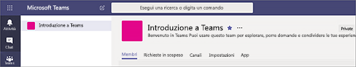
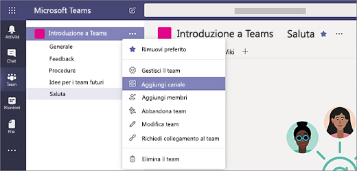
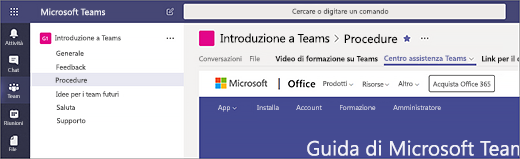

# Creare i primi team e canali in Microsoft Teams

La configurazione e l'uso del primo set di team e canali consente di acquisire familiarità con Teams e identificare i promotori che possono contribuire all'adozione di Teams in tutta l'organizzazione. Se non è ancora stato installato Teams, vedere [Ottenere i client di Teams](get-clients.md) e [Accedere a Teams con l'autenticazione moderna](sign-in-teams.md).

## Suggerimenti per i primi team e canali

 Un team è un gruppo di persone che si riuniscono attorno a un obiettivo comune. I canali sono gli spazi di collaborazione all'interno di un team in cui viene concretamente svolto il lavoro. 

Per altre informazioni, vedere [Panoramica su team e canali in Teams](teams-channels-overview.md) e [Procedure consigliate per l'organizzazione dei team in Teams](best-practices-organizing.md).

 È consigliabile iniziare con un team "Introduzione a Teams", in cui gli early adopter possono sperimentare, porre domande e scoprire le funzionalità di Teams. Questo team può essere fondamentale per il successo quando si inizia a testare Teams. 

### Team "Introduzione a Teams"
Il team di progetto può usare il team "Introduzione a Teams" per assicurarsi che i client di Teams siano configurati correttamente, avviare una conversazione iniziale ed esplorare le funzionalità dell'applicazione. Nell'organizzazione potrebbe essere già presente un gruppo di persone che hanno accesso anticipato alle nuove funzionalità. Questo può essere uno dei team iniziali che useranno al momento dell'onboarding e sarà utile per ricevere un feedback precoce.

Ecco una struttura consigliata per il team.

| Canale | Descrizione e utilizzo | Schede, bot e app aggiunti |
| ------------ | -------------------- | -------------------- |
| Generale | Tutti i team iniziano con un canale Generale. Usare questo canale per creare annunci quando si inizia a familiarizzare con Teams. |  |
| Presentazioni | Per presentarsi al team e condividere le proprie aspettative su Teams. |  |
| Procedure | Un canale per porre domande sulle procedure. Passaggio 1: installare i client per desktop e dispositivi mobili. Passaggio 2: entrare in Teams.| Scheda aggiunta con collegamento al [Centro assistenza di Teams](https://support.office.com/teams) Scheda aggiunta con collegamento ai [video di formazione su Teams](https://support.office.com/article/microsoft-teams-video-training-4f108e54-240b-4351-8084-b1089f0d21d7). Scheda aggiunta che collega alla [pagina di download dei client per desktop e dispositivi mobili](https://teams.microsoft.com/downloads) |
| Feedback | Per condividere opinioni sull'esperienza in Teams. | Scheda aggiunta con sondaggio di Polly|
| Idee per i team futuri | Per condividere idee e suggerimenti su dove Teams può creare valore aggiunto nell'organizzazione. Come si potrebbero chiamare questi team? Chi sarebbero i membri? ||
| Supporto | Se qualcosa non funziona come previsto, usare questo canale per ottenere assistenza. ||

## Configurare i primi team
Gli amministratori possono creare e gestire team e canali nel client di Teams o nell'interfaccia di amministrazione di Microsoft Teams. È possibile creare team pubblici o privati. Si può anche creare [un team a livello di organizzazione](create-an-org-wide-team.md). Chiunque usi Teams nell'organizzazione può entrare a far parte di un team pubblico. Per i team privati, l'appartenenza è gestita dai proprietari del team. Per un team a livello di organizzazione, vengono aggiunti automaticamente tutti gli utenti dell'organizzazione. 

Per iniziare, è consigliabile creare team privati e aggiungere un altro proprietario per gestire le impostazioni e l'appartenenza del team. 

> [!NOTE]
> Nei passaggi successivi viene usato il client desktop di Teams per creare team e canali. Tenere presente che, come amministratore, è anche possibile eseguire queste attività nell'interfaccia di amministrazione di Microsoft Teams.

### Creare un team

Sul lato sinistro di Teams fare clic su **Team**, in fondo all'elenco dei team fare clic su **Partecipa o crea un team** e quindi fare clic su **Crea un nuovo team**.

Dopo aver creato il team, invitare altri utenti a parteciparvi. È possibile aggiungere singoli utenti, gruppi e persino interi gruppi di contatti (in precedenza noti come liste di distribuzione). 

 

### Aggiungere un proprietario del team
Trovare il team creato e fare clic su **Altre opzioni ˙˙˙** > **Gestisci il team**. Passare quindi alla scheda **Membri**. Individuare le persone che si vogliono designare come proprietari del team. In **Ruolo** fare clic su **Proprietario**.

### Creare un canale in un team
Trovare il team creato e fare clic su **Altre opzioni ...** > **Aggiungi canale**. È anche possibile fare clic su **Gestisci il team** e aggiungere un canale nella scheda **Canali**. 

 

Assegnare al canale un nome descrittivo che consenta agli utenti di comprenderne facilmente lo scopo. 

Come proprietario del team, è possibile aggiungere automaticamente canali preferiti per l'intero team, rendendoli più visibili per tutti i membri del team. È anche possibile aggiungere schede al canale per aggiungere strumenti, come OneNote, collegamenti a pagine Web e altri contenuti che consentano agli utenti di trovare più facilmente ciò di cui hanno bisogno e condividere opinioni.  

Ecco un esempio del canale "Procedure" nel team "Introduzione a Teams", con schede aggiunte che collegano alle pagine Web di Teams &ndash; Video di formazione su Teams, Centro assistenza di Teams e Link per il download di Teams. 

 

## Passaggi successivi
Passare a [Onboarding degli early adopter](get-started-with-teams-onboard-early-adopters.md).
