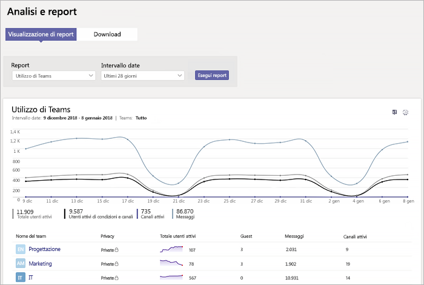
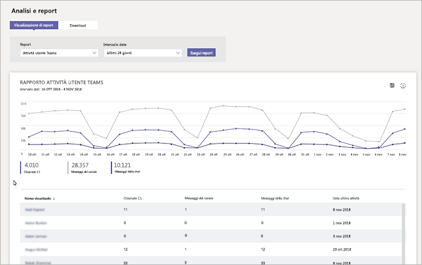
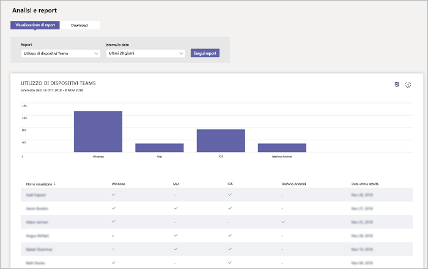

# Monitorare l'utilizzo e il feedback in Microsoft Teams
È importante sapere in che modo gli utenti usano Teams e com'è la loro esperienza con Teams. I report sull'utilizzo consentono di comprendere meglio i modelli di utilizzo e, insieme al feedback degli utenti, forniscono informazioni approfondite utili per l'implementazione su scala più ampia e per stabilire come assegnare la priorità alle attività di formazione e comunicazione.

## Monitorare l'utilizzo
Per il primo set di team, è consigliabile esaminare i report due volte alla settimana per individuare le tendenze emergenti. 

Ad esempio, se i report sull'utilizzo mostrano che pochi utenti usano i client per dispositivi mobili di Teams, questo potrebbe indicare che gli utenti non sanno come installare i client. Pubblicare istruzioni dettagliate per l'installazione in un canale può favorire l'utilizzo di una gamma più ampia di client. I report sull'utilizzo potrebbero anche mostrare che gli utenti usano Teams principalmente per le chat private. In questo caso sarebbe consigliabile rivedere gli scenari dei team, perché gli utenti stanno chattando all'esterno dei team e dei canali iniziali configurati. 

Ecco come ottenere i report per esaminare l'utilizzo di Teams. 

### Analisi e report di Teams (interfaccia di amministrazione di Microsoft Teams)

I report di Teams nell'interfaccia di amministrazione di Microsoft Teams forniscono informazioni dettagliate sul modo in cui Teams viene utilizzato nell'organizzazione. Usare i report per avere una panoramica sull'utilizzo di Teams, sulle attività degli utenti e sull'utilizzo dei dispositivi nell'organizzazione. 

Per vedere questi report è necessario essere un amministratore globale in Office 365, un amministratore del servizio Teams o un amministratore di Skype for Business. Passare all'interfaccia di amministrazione di Microsoft Teams, selezionare **Analisi e report** nel riquadro di spostamento a sinistra e quindi in **Report** scegliere il report che si vuole eseguire.

- **Report sull'utilizzo di Teams**: questo report offre una panoramica delle attività di utilizzo in Teams, tra cui il totale di utenti e canali attivi e il numero di utenti e canali attivi, guest e messaggi in ogni team. 

         
- **Report sulle attività degli utenti di Teams**: questo report illustra i tipi di attività svolte dagli utenti, ad esempio il numero di persone che comunicano con chiamate 1:1, i messaggi di canale e i messaggi nelle chat private. 

     
`
- **Report sull'utilizzo dei dispositivi di Teams**: questo report mostra il modo in cui gli utenti si connettono a Teams, incluso il numero di persone che usano Teams nei dispositivi mobili quando sono in viaggio. 

    

Per altre informazioni, vedere [Analisi e creazione di report di Teams](teams-analytics-and-reports/teams-reporting-reference.md). 

### Report sulle attività di Teams (interfaccia di amministrazione di Microsoft 365)
È anche possibile visualizzare le attività di Teams tramite report disponibili dall'interfaccia di amministrazione di Microsoft 365. Questi report fanno parte dei report di Office 365 nell'interfaccia di amministrazione di Microsoft 365 e forniscono informazioni sulle attività degli utenti e sull'utilizzo dei dispositivi. 

Per visualizzare questi report, passare all'interfaccia di amministrazione di Microsoft 365 e fare clic su **Report** > **Utilizzo**. In **Seleziona un report** fare clic su **Microsoft Teams**. Da qui scegliere il report che si vuole visualizzare.

Per altre informazioni, vedere [Usare i report attività per Teams](teams-activity-reports.md).

### Analisi di utilizzo di Microsoft 365

È possibile usare l'analisi dell'utilizzo di Microsoft 365 in Power BI per visualizzare e analizzare i dati di utilizzo per Teams e altri prodotti e servizi di Office 365. Analisi utilizzo di Microsoft 365 è un pacchetto di contenuto che include un dashboard predefinito e una serie di report predefiniti. Ogni report offre dati specifici sull'utilizzo e approfondimenti. Per connettersi al pacchetto di contenuto è necessario Power BI e occorre essere un amministratore globale di Office 365 oppure un lettore di report. Se non si ha già Power BI, [iscriversi per il servizio Power BI gratuito](https://powerbi.microsoft.com). 

Per altre informazioni, vedere [Analisi di utilizzo di Microsoft 365](https://support.office.com/article/Microsoft-365-usage-analytics-77ff780d-ab19-4553-adea-09cb65ad0f1f). 

## Raccogliere il feedback
L'adozione di una nuova esperienza di collaborazione comporta la modifica del comportamento degli utenti. Per rendere possibile questo cambiamento occorrono formazione, incoraggiamento e esempi positivi. È importante che gli utenti abbiano una voce durante il passaggio a Teams e che possano condividere apertamente le loro esperienze. È consigliabile usare il canale Feedback nel team "Introduzione a Teams" creato per raccogliere e rispondere al feedback degli utenti sulle loro esperienze con Teams. 

## Passaggi successivi
Passare a [Raccogliere le risorse per pianificare l'implementazione a livello di organizzazione](get-started-with-teams-resources-for-org-wide-rollout.md).
