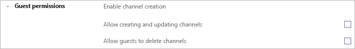

Elenco di controllo per l'accesso guest in Microsoft Teams
=========================================

Usare questo elenco di controllo per attivare e configurare l'accesso guest in Microsoft Teams. Per apportare queste modifiche è necessario essere un amministratore globale o un amministratore di Teams.

> [!IMPORTANT]
> Potrebbe essere necessario attendere qualche ora affinché le modifiche abbiano effetto. 

Guardare questo breve video (5:31 minuti) per scoprire come attivare l'accesso guest in tutto Microsoft 365, incluso Teams.

> [!VIDEO https://www.microsoft.com/videoplayer/embed/RE44NTr?autoplay=false]

## Passaggio 1: attivare l'accesso guest a livello di organizzazione di Teams

Per attivare l'accesso guest, accedere all'interfaccia di amministrazione <a href="https://go.microsoft.com/fwlink/p/?linkid=2024339" target="_blank">https://admin.microsoft.com</a> . 

1. Nell'interfaccia di amministrazione di Teams selezionare **Impostazioni organizzazione** > **Accesso guest**.
2. Impostare il selettore **Consenti accesso ospite in Teams** su **Attivato**.

    

3. Nella stessa pagina attivare o disattivare le impostazioni di **Chiamata**, **Riunione** e **Messaggistica** per gli utenti guest.
4. Fare clic su **Salva**.

> [!TIP]
> Se si usano le impostazioni predefinite in Azure Active Directory, SharePoint Online e Microsoft 365 groups, è possibile che sia stata eseguita la configurazione dell'accesso guest. In questo caso, è possibile ignorare il resto della procedura. In caso di dubbi o se si usano impostazioni personalizzate per i gruppi AAD, SharePoint Online o Microsoft 365, procedere con il resto dei passaggi descritti in questo elenco di controllo.

## Passaggio 2: configurare le impostazioni business-to-business di Azure AD

Queste sono le impostazioni di Azure AD che supportano l'accesso guest in Teams. Una volta configurate queste impostazioni, sarà possibile [aggiungere](add-guests.md) e [gestire i guest](manage-guests.md) in Teams.

1. Accedere al [portale di Azure](https://portal.azure.com) come amministratore del tenant.
2. Selezionare **Azure Active Directory** > **Utenti** > **Impostazioni utente**.
3. In **Utenti esterni** selezionare **Gestisci le impostazioni di collaborazione esterna**.
   > [!NOTE]
   > Le **Impostazioni di collaborazione esterna** sono disponibili anche nella pagina **Relazioni aziendali**. In Azure Active Directory, in **Gestisci** passare a **Relazioni aziendali** > **Impostazioni**.
4. Nella pagina **Impostazioni di collaborazione esterna** scegliere i criteri da abilitare.

    - **Le autorizzazioni degli utenti guest sono limitate**: questo criterio determina le autorizzazioni per i guest nella directory. Selezionare **Sì** per impedire ai guest di eseguire determinate attività della directory, come enumerare utenti, gruppi o altre risorse della directory. Selezionare **No** per concedere ai guest lo stesso accesso degli utenti standard ai dati della directory.
     - **Amministratori e utenti nel ruolo mittente dell'invito guest possono invitare **: impostare il criterio su **Sì** per consentire agli amministratori e agli utenti nel ruolo Mittente dell'invito guest di invitare guest.
     - **I membri possono invitare**: per consentire ai membri non amministratori della directory di invitare utenti guest, impostare questo criterio su **Yes** (scelta consigliata). Se si preferisce che solo gli amministratori siano autorizzati ad aggiungere utenti guest, è possibile impostare questo criterio su **No**. Tenere presente che l'opzione **No** limiterà l'esperienza guest per i proprietari di team non amministratori, che potranno aggiungere in Teams solo utenti guest già aggiunti in Azure AD dall'amministratore.
     - **Gli utenti guest possono invitare**: per consentire ai guest di invitare altri guest, impostare questo criterio su **Sì**.
         > [!IMPORTANT]
         > Al momento Teams non supporta il ruolo mittente dell'invito, pertanto se si imposta **I guest possono invitare** su **Sì**, gli utenti guest non possono invitare altri guest in Teams.
     - **Abilita passcode monouso tramite posta elettronica per gli utenti guest (anteprima)**: per altre informazioni sulla funzionalità passcode monouso, vedere [Autenticazione con passcode monouso tramite indirizzo di posta elettronica (anteprima)](https://docs.microsoft.com/azure/active-directory/b2b/one-time-passcode).
     - **Restrizioni di collaborazione**: per altre informazioni su come consentire o bloccare gli inviti a domini specifici, vedere [Consentire o bloccare gli inviti agli utenti B2B di organizzazioni specifiche](https://docs.microsoft.com/azure/active-directory/b2b/allow-deny-list).
        > [!NOTE]
        > Per le restrizioni della collaborazione, vedere [Abilitare la collaborazione esterna B2B e gestire gli utenti che possono invitare guest](https://docs.microsoft.com/azure/active-directory/b2b/delegate-invitations).
      
    Per altre informazioni su come controllare chi può invitare guest, consultare [Delegare gli inviti per Collaborazione B2B di Azure Active Directory](https://docs.microsoft.com/azure/active-directory/b2b/delegate-invitations).

## Passaggio 3: configurare i gruppi Microsoft 365

1. Nell'interfaccia di amministrazione di Microsoft 365 accedere alle **Settings**impostazioni dell'  >  **organizzazione**impostazioni, fare clic su **Servizi**e quindi selezionare **gruppi Microsoft 365**.

     
2. Assicurarsi che la casella di controllo **Consenti ai membri del gruppo esterni all'organizzazione di accedere al contenuto del gruppo** sia selezionata. In caso contrario, gli utenti guest non saranno in grado di accedere al contenuto del gruppo.

    
3. Assicurarsi che la casella di controllo **Consenti ai proprietari di gruppi di aggiungere persone esterne all'organizzazione ai gruppi** sia selezionata. In caso contrario, i proprietari dei gruppi non saranno in grado aggiungerne nuovi guest. Per supportare l'accesso guest, è necessario come minimo che questa opzione sia attivata.

Per istruzioni dettagliate sulla configurazione di queste impostazioni, vedere [gestire l'accesso guest nei gruppi di microsoft 365](https://support.office.com/article/manage-guest-access-in-office-365-groups-9de497a9-2f5c-43d6-ae18-767f2e6fe6e0?appver=MOE150) e [controllare l'accesso guest nei gruppi di Microsoft 365](Teams-dependencies.md#control-guest-access-in-microsoft-365-groups).

## Passaggio 4: configurare la condivisione in Microsoft 365 

Assicurarsi che gli utenti possano aggiungere guest. Ecco come:

1. Nell'interfaccia di amministrazione di Microsoft 365 accedere alle **Settings**impostazioni dell'  >  **organizzazione**impostazioni, fare clic su **sicurezza & privacy**e quindi selezionare **condivisione**.

     
 
2. Selezionare la casella di controllo **Consenti agli utenti di aggiungere nuovi utenti guest all'organizzazione** e quindi fare clic su **Salva modifiche**.

     
 
    > [!NOTE]
    > Questa impostazione è equivalente a **I membri possono invitare** in **Impostazioni utente** > **Utenti esterni** in Azure AD.  

## Passaggio 5: verificare l'impostazione di condivisione in SharePoint

1. Accedere all'interfaccia di amministrazione di Microsoft 365.
2. In **Interfacce di amministrazione** selezionare **SharePoint**.
3. Nella nuova interfaccia di amministrazione di SharePoint selezionare **Siti attivi** in **Siti**.

    

3. Selezionare il sito e fare clic su **Condivisione**.
4. Assicurarsi che l'opzione sia impostata su **Chiunque** o **Utenti guest nuovi ed esistenti**.

     

## Passaggio 6: configurare le autorizzazioni degli utenti guest

Nell'applicazione Teams, a livello di singolo team, configurare le autorizzazioni che controllano se gli utenti guest possono creare, aggiornare o eliminare canali. Possono configurare queste impostazioni gli amministratori di Teams e i proprietari dei team.

Per altre informazioni sull'accesso guest, vedere [Accesso guest in Teams](guest-access.md) e [Attivare o disattivare l'accesso guest a Microsoft Teams](set-up-guests.md).

## Risoluzione dei problemi

In caso di problemi con la configurazione dell'accesso guest o l'aggiunta di utenti guest in Teams, queste risorse possono rivelarsi utili:

[Risolvere i problemi relativi all'accesso guest in Microsoft Teams](troubleshoot-guest-access.md)

[Risoluzione dei problemi di Teams](https://docs.microsoft.com/MicrosoftTeams/troubleshoot/)
