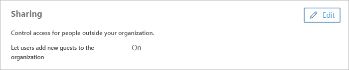

Elenco di controllo di accesso guest di Microsoft TeamsMicrosoft Teams guest access checklist
==========================================

Usare questo elenco di controllo per attivare e configurare l'accesso guest in Microsoft teams.Use this checklist to help you turn on and configure guest access in Microsoft Teams.

> [!IMPORTANT]
> Potrebbe essere necessario attendere fino a 24 ore affinché le modifiche abbiano effetto.You may have to wait up to 24 hours for your changes to take effect. 

## Passaggio 1: attivare l'accesso Guest a livello di organizzazione TeamsStep 1: Turn on guest access at the Teams org-wide level

Per attivare l'accesso guest, accedere all'interfaccia di **amministrazione di Microsoft teams**.To turn on guest access, go to the **Microsoft Teams admin center**. 

1. Nell'interfaccia di amministrazione di teams selezionare**l'accesso Guest** **delle impostazioni** > a livello di organizzazione.In the Teams admin center, select **Org-Wide settings** > **Guest access**.
2. Impostare l'opzione **Consenti accesso guest in Microsoft teams** **su**attivato.Set the **Allow guest access in Microsoft Teams** switch to **On**.

    

3. Nella stessa pagina attivare o disattivare le impostazioni di **chiamata**, **riunione**e **messaggistica** per gli utenti.On this same page, turn on or turn off **Calling**, **Meeting**, and **Messaging** settings for guests.
4. Fai clic su **Salva**.Click **Save**.

> [!TIP]
> Se si usano le impostazioni predefinite in Azure Active Directory, SharePoint Online e Office 365 groups, è possibile che sia stata eseguita la configurazione dell'accesso guest.If you're using default settings in Azure Active Directory, SharePoint Online, and Office 365 Groups, you may be done configuring guest access. In questo caso, è possibile ignorare il resto della procedura.In this case, you can skip the rest of the steps. In caso di dubbi o se si usano impostazioni personalizzate per i gruppi AAD, SharePoint Online o Office 365, procedere con il resto della procedura descritta in questo elenco di controllo.If you're not sure, or if you're using custom settings for AAD, SharePoint Online, or Office 365 Groups, continue with the rest of the steps in this checklist.

## Passaggio 2: configurare le impostazioni di Azure AD business-to-businessStep 2: Configure Azure AD business-to-business settings

1. Accedere a [Azure Portal](https://portal.azure.com) come amministratore del tenant.Sign in to the [Azure portal](https://portal.azure.com) as a tenant administrator.
2. Selezionare\*\*\*\* > **le impostazioni utente**di **Azure Active Directory** > Users.Select **Azure Active Directory** > **Users** > **User settings**.
3. In **utenti esterni**selezionare **Gestisci impostazioni di collaborazione esterna**.Under **External users**, select **Manage external collaboration settings**.
   > [!NOTE]
   > Le **impostazioni di collaborazione esterna** sono disponibili anche nella pagina **relazioni organizzative** .The **External collaboration settings** are also available from the **Organizational relationships** page. In Azure Active Directory, in **Gestisci**, passa a > **Impostazioni** **relazioni organizzative**.In Azure Active Directory, under **Manage**, go to **Organizational relationships** > **Settings**.
4. Nella pagina **impostazioni di collaborazione esterna** scegliere i criteri che si desidera abilitare.On the **External collaboration settings** page, choose the policies you want to enable.

  - Le **autorizzazioni degli utenti Guest sono limitate**: questo criterio determina le autorizzazioni per gli ospiti nella directory.**Guest users permissions are limited**: This policy determines permissions for guests in your directory. Selezionare **Sì** per bloccare gli ospiti da determinate attività di directory, come l'enumerazione di utenti, gruppi o altre risorse di directory.Select **Yes** to block guests from certain directory tasks, like enumerating users, groups, or other directory resources. Selezionare **No** per offrire agli ospiti lo stesso accesso ai dati della directory come utenti regolari nella directory.Select **No** to give guests the same access to directory data as  regular users in your directory.
   - Gli **amministratori e gli utenti del ruolo dell'invitato Guest possono invitare**: per consentire agli amministratori e agli utenti del ruolo "Guest invite" di invitare gli ospiti, impostare questo criterio su **Sì**.**Admins and users in the guest inviter role can invite**: To allow admins and users in the "Guest Inviter" role to invite guests, set this policy to **Yes**.
   - **I membri possono invitare**: per consentire ai membri non amministratori della directory di invitare gli ospiti, impostare questo criterio su **Sì**.**Members can invite**: To allow non-admin members of your directory to invite guests, set this policy to **Yes**.
   
       > [!NOTE]
       > Se si impostano **membri può invitare** a **No** e quindi abilitare l'accesso guest nei gruppi di Office 365 e Microsoft teams, gli amministratori possono controllare gli inviti Guest nella directory.If you set **Members can invite** to **No** and then enable guest access in Office 365 Groups and Microsoft Teams, admins can control guest invitations to your directory. Dopo che gli ospiti si trovano nella directory, possono essere aggiunti ai team da membri non amministratori che sono proprietari del team.After guests are in the directory, they can be added to teams by non-admin members who are team owners. Per altre informazioni, vedere [autorizzare l'accesso guest in Microsoft teams](Teams-dependencies.md).For more information, see [Authorize guest access in Microsoft Teams](Teams-dependencies.md).
       > [!IMPORTANT]
       > Per consentire agli utenti di accedere al lavoro in teams, è necessario impostare **i membri può invitare** a **Sì**.For guest access to work at all in Teams, you must set **Members can invite** to **Yes**.   
   - **Gli ospiti possono invitare**: per consentire agli ospiti di invitare altri ospiti, impostare questo criterio su **Sì**.**Guests can invite**: To allow guests to invite other guests, set this policy to **Yes**.
       > [!IMPORTANT]
       > Attualmente, teams non supporta il ruolo di invitato Guest, quindi, anche se si imposta **gli ospiti possono invitare** a **Sì**, gli utenti non possono invitare altri ospiti in teams.Currently, Teams doesn't support the guest inviter role, so even if you set **Guests can invite** to **Yes**, guests can't invite other guests in Teams.
   - **Abilitare la password unica per gli utenti (anteprima)**: per altre informazioni sulla funzionalità di codice per la sola volta, vedere autenticazione di un codice di accesso unico per la [posta elettronica (anteprima)](https://docs.microsoft.com/azure/active-directory/b2b/one-time-passcode).**Enable email one-time passcode for guests (Preview)**: For more information about the one-time passcode feature, see [Email one-time passcode authentication (preview)](https://docs.microsoft.com/azure/active-directory/b2b/one-time-passcode).
   - **Limitazioni della collaborazione**: per altre informazioni su come consentire o bloccare gli inviti a specifici domini, vedere [consentire o bloccare gli inviti agli utenti B2B di organizzazioni specifiche](https://docs.microsoft.com/azure/active-directory/b2b/allow-deny-list).**Collaboration restrictions**: For more information about allowing or blocking invitations to specific domains, see [Allow or block invitations to B2B users from specific organizations](https://docs.microsoft.com/azure/active-directory/b2b/allow-deny-list).
      > [!NOTE]
      > Per le limitazioni della collaborazione, vedere [abilitare la collaborazione esterna B2B e gestire chi può invitare gli ospiti](https://docs.microsoft.com/azure/active-directory/b2b/delegate-invitations).For collaboration restrictions, see [Enable B2B external collaboration and manage who can invite guests](https://docs.microsoft.com/azure/active-directory/b2b/delegate-invitations).
      
 
Per altre informazioni su come controllare chi può invitare gli ospiti, vedere [delegare gli inviti per la collaborazione B2B di Azure Active Directory](https://docs.microsoft.com/azure/active-directory/b2b/delegate-invitations).For more information about controlling who can invite guests, see [Delegate invitations for Azure Active Directory B2B collaboration](https://docs.microsoft.com/azure/active-directory/b2b/delegate-invitations).

## Passaggio 3: configurare i gruppi di Office 365Step 3: Configure Office 365 Groups

1. Nell'interfaccia di amministrazione di Microsoft 365 accedere a **Impostazioni** > **Servizi &** > gruppi di componenti aggiuntivi di**Office 365**.In the Microsoft 365 admin center, go to **Settings** > **Services & Add-ins** > **Office 365 Groups**.
2. Assicurarsi che **i membri del gruppo al di fuori del contenuto del gruppo di Access dell'organizzazione** siano impostati **su**attivato.Make sure **Let group members outside the organization access group content** is set to **On**. Se questa impostazione è disattivata, gli utenti non saranno in grado di accedere a qualsiasi contenuto di gruppo.If this setting is turned off, guests won't be able to access any group content.
3. Assicurarsi che **i proprietari del gruppo aggiungano persone all'esterno dell'organizzazione a gruppi** sia impostato **su**attivato.Make sure **Let group owners add people outside the organization to groups** is set to **On**. Se questa impostazione è disattivata, i proprietari del team non saranno in grado di aggiungere nuovi Guest.If this setting is turned off, Team owners won't be able to add new guests. Questa impostazione deve essere almeno attiva per supportare l'accesso guest.At a minimum, this setting must be On to support guest access.

     

Per istruzioni dettagliate sulla configurazione di queste impostazioni, vedere [gestire l'accesso guest nei gruppi di office 365](https://support.office.com/article/manage-guest-access-in-office-365-groups-9de497a9-2f5c-43d6-ae18-767f2e6fe6e0?appver=MOE150) e [controllare l'accesso guest nei gruppi di Office 365](Teams-dependencies.md#control-guest-access-in-office-365-groups).For detailed instructions about configuring these settings, see [Manage guest access in Office 365 Groups](https://support.office.com/article/manage-guest-access-in-office-365-groups-9de497a9-2f5c-43d6-ae18-767f2e6fe6e0?appver=MOE150) and [Control guest access in Office 365 Groups](Teams-dependencies.md#control-guest-access-in-office-365-groups).
 

## Passaggio 4: configurare la condivisione in Office 365Step 4: Configure sharing in Office 365 

Assicurarsi che gli utenti possano aggiungere Guest.Make sure that users can add guests. Ecco come:Here's how:

1. Nell'interfaccia di amministrazione di Microsoft 365 accedere a **Impostazioni** > di**sicurezza & privacy**.In the Microsoft 365 admin center, go to **Settings** > **Security & privacy**.

     

2. In **condivisione**selezionare **modifica**.In **Sharing**, select **Edit**.

     
 
3. Impostare **consentire agli utenti di aggiungere nuovi Guest a questa organizzazione** e quindi fare clic **su** **Salva**.Set **Let users add new guests to this organization** to **On**, and then click **Save**.

     
 
> [!NOTE]
> Questa impostazione è equivalente ai **membri che possono invitare** l'impostazione in **Impostazioni** > utente**utenti esterni** in Azure ad.This setting is equivalent to the **Members can invite** setting in **User settings** > **External users** in Azure AD.  

## Passaggio 5: verificare l'impostazione di condivisione in SharePointStep 5: Verify sharing setting in SharePoint

Questo è un po' un rompicapo.This one's a bit of a brain teaser. L'accesso guest in teams non funziona se l'opzione **non consentire la condivisione all'esterno dell'organizzazione** è selezionata nell'interfaccia di amministrazione di SharePoint.Guest access in Teams doesn't work if the **Don't allow sharing outside your organization** setting is selected in the SharePoint admin center.

1. Accedere all'interfaccia di amministrazione di Microsoft 365.Sign in to the Microsoft 365 admin center.
2. Fare clic su interfaccia di **Amministrazione**e quindi selezionare **SharePoint**.Click **Admin center**, and then select **SharePoint**.
3. Nell'interfaccia di amministrazione di SharePoint selezionare **condivisione**.In the SharePoint admin center, select **Sharing**.
4. Verificare che l'opzione **non consentire la condivisione all'esterno** dell'organizzazione *non* sia selezionata.Make sure the option for **Don’t allow sharing outside your organization** is *not* selected.
 
     

## Passaggio 6: configurare le autorizzazioni per gli utenti GuestStep 6: Set up guest user permissions

Nell'applicazione teams, a livello di team specifico, configura le autorizzazioni guest che controllano se gli utenti possono creare, aggiornare o eliminare canali.In the Teams application, at the individual team level, configure guest permissions that control whether guests can create, update, or delete channels. Gli amministratori dei team e i proprietari del team possono configurare queste impostazioni.Teams admins as well as team owners can configure these settings.

Per ulteriori informazioni sull'accesso guest, vedere [accesso guest in teams](guest-access.md) e [attivare o disattivare l'accesso Guest a Microsoft teams](set-up-guests.md).To learn more about guest access, see [Guest access in Teams](guest-access.md) and [Turn on or turn off guest access to Microsoft Teams](set-up-guests.md).

## Risoluzione dei problemiTroubleshooting

In caso di problemi con l'impostazione dell'accesso guest o l'aggiunta di ospiti in teams, usare queste risorse per aiutarti:If you have problems setting up guest access or adding guests in Teams, use these resources to help you:

[Risolvere i problemi relativi all'accesso guest in Microsoft TeamsTroubleshoot problems with guest access in Microsoft Teams](troubleshoot-guest-access.md)

[Risoluzione dei problemi di TeamsTeams troubleshooting](https://docs.microsoft.com/MicrosoftTeams/troubleshoot/)

