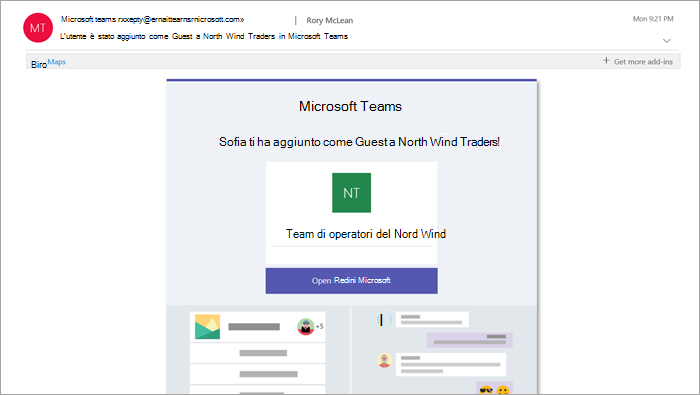

Aspetto dell'esperienza Guest
=================================

Quando un ospite è invitato a partecipare a un team, riceve un messaggio di posta elettronica di benvenuto che include alcune informazioni sul team e cosa aspettarsi ora che si tratta di un membro. Il guest deve riscattare l'invito nel messaggio di posta elettronica prima di poter accedere al team e ai relativi canali.
    

    
Tutti i membri del team vedono un messaggio nel thread del canale che annuncia che il proprietario del team ha aggiunto un Guest e fornisce il nome dell'ospite. Tutti gli utenti del team possono identificare facilmente chi è ospite. Come illustrato nello screenshot seguente di un team di esempio, un banner indica "questo team ha Guest" e viene visualizzata un'etichetta "(Guest)" accanto al nome di ogni Guest.
    
![Screenshot che Mostra gli utenti Guest notifica banner] Lo (media/guest-experience-image2.png "screenshot mostra una parte del canale di marketing per Northwind Traders, con la notifica nel banner superiore che indica che il team ha Guest e gli utenti che sono ospiti sono identificati con l'ospite di Word accanto al nome.")

## Confronto tra i membri del team e le funzionalità Guest

Nella tabella seguente viene confrontata la funzionalità Microsoft teams disponibile per i membri del team di un'organizzazione per la funzionalità disponibile per un utente Guest nel team.

|**Funzionalità in teams**|**Utenti teams nell'organizzazione**|**Utente Guest**|
|:-----|:-----|:-----|
|Creare un canale     *I proprietari del team controllano questa impostazione.*    |||
|Partecipare a una chat privata    |||
|Partecipare a una conversazione di canale    |||
|Pubblicare, eliminare e modificare i messaggi    |||
|Condividere un file di canale    |||
|Condividere un file di chat    |||
|Aggiungere app (schede, bot o connettori)    |||
|Creare riunioni o pianificare le sessioni di Access    |||
|Accedere a OneDrive for Business Storage    |||
|Creare criteri di accesso Guest a livello di tenant e teams/Channels    |||
|Invitare un utente all'esterno del dominio del tenant di Office 365    *I proprietari del team controllano questa impostazione.*      |||
|Creare un team    |||
|Individuare e partecipare a un team pubblico    |||
|Visualizzazione organigramma    |||
   
La tabella seguente mostra le funzionalità di chiamata e riunione disponibili per gli utenti guest.

| Caratteristica chiamante | I | Utenti E1 e E3 | Utenti E5 e EV |
| --------------- | ----- | -------------- | -------------- |
| Chiamate VOIP | Sì | Sì | Supporto per più paesi |
| Chiamata di gruppo | Sì | Sì | Supporto per più paesi |
| Controlli di chiamata principali supportati (blocco, mute, video attivato/disattivato, condivisione dello schermo) | Sì | Sì | Supporto per più paesi |
| Destinazione di trasferimento | Sì | Sì | Supporto per più paesi |
| Può trasferire una chiamata | Sì | Sì | Supporto per più paesi |
| Trasferimento consultivo can | Sì | Sì | Supporto per più paesi |
| Può aggiungere altri utenti a una chiamata tramite VOIP | Sì | Sì | Supporto per più paesi |
| Può aggiungere utenti per numero di telefono a una chiamata | No | No | Sì |
| Inoltra destinazione | No | Sì | Supporto per più paesi |
| Destinazione gruppo chiamate | No | Sì | Supporto per più paesi |
| Destinazione senza risposta | No | Sì | Supporto per più paesi |
| Può essere la destinazione di una chiamata federata | No | Sì | Supporto per più paesi |
| Può eseguire una chiamata federata | No | Sì | Supporto per più paesi |
| Può inoltrare immediatamente le chiamate | No | No | Sì |
| Può chiamare simultaneamente le chiamate | No | No | Sì |
| Può instradare le chiamate senza risposta | No | No | Sì |
| Le chiamate perse possono andare alla segreteria telefonica | No | N.1 |Sì |
| Avere un numero di telefono in grado di ricevere chiamate | No | No | Sì |
| Può chiamare i numeri di telefono | No | No | Sì |
| Può accedere alle impostazioni delle chiamate | No | No | Sì |
| Può cambiare il messaggio di saluto della segreteria | No | N.1 | Sì |
| Può modificare le suonerie | No | No  | Sì |
| Supporta TTY | No | No | Sì |
| Può avere delegati | No | No | Sì |
|  Può essere un delegato | No | No | Sì |

1 questa funzionalità sarà presto disponibile.

> [!NOTE]
> Gli amministratori di Office 365 controllano le funzionalità disponibili per gli utenti. 
 
## Accesso guest e accesso esterno (Federazione)

[!INCLUDE [guest-vs-external-access](includes/guest-vs-external-access.md)]
 
## Domande frequenti

Q. Come si lascia un'organizzazione a cui si è stati invitati? 
Un. Se si è stati invitati a un'organizzazione di cui non si vuole essere ospiti, è possibile scegliere di uscire dall'organizzazione. Per altre informazioni, vedere uscire da [un'organizzazione come utente Guest](https://docs.microsoft.com/en-us/azure/active-directory/b2b/leave-the-organization). In alternativa, puoi chiedere all'amministratore dell'organizzazione di rimuoverti dal tenant. Tieni presente che in entrambi i casi dovrai essere invitato di nuovo al tenant se vuoi accedere all'organizzazione in futuro.

Q. Gli utenti hanno le stesse funzionalità dei membri del team? 
Un. Non. Per altre informazioni su ciò che un ospite può o non può fare, vedere il [confronto tra le funzionalità membro del team e Guest](#comparison-of-team-member-and-guest-capabilities) in questo articolo.

Q. Quanti ospiti posso invitare? 
Un. Puoi aggiungere fino a 5 clienti per ogni utente con licenza.

Q. Gli utenti possono accedere a OneDrive for business? 
Un. Non.

Q. Gli utenti possono accedere ai file di SharePoint? 
Un. Sì.

Q. Gli utenti possono eseguire ricerche nei file? 
Un. Non.

Q. I guest possono allegare file? 
Un. Sì, un guest può allegare file in questi due modi:

   - Selezionare file nel riquadro sinistro e quindi passare al percorso del file.
   - Caricare file dal computer.

Q. Un guest può scaricare un file in una chat privata? 
Un. Sì, possono ricevere un file da un membro in una chat privata e quindi scaricarlo sul desktop.
